Cost: 0.44526625

# Chapter 25: Lend-Lease and the Common Pool

## 1. Strategic Context & Modern Historical Perspective

Chapter 25 concerns a fundamental transformation in coalition logistics: the replacement of narrowly bilateral purchasing and nationally segregated supply systems with a partially integrated Allied resource pool. Lend-Lease was the legal and financial mechanism that made this transformation possible, but its operational significance extended well beyond the transfer of American matériel without immediate cash payment. In practice, Lend-Lease, reciprocal aid, pooled merchant shipping, theater procurement, and shared infrastructure formed an interdependent logistical system. Its proper unit of analysis is therefore not the individual transaction but the coalition-wide movement of resources through constrained production, shipping, port, and inland-transport networks.

### The strategic paradox

The central paradox was that Allied strategic plans were repeatedly framed in terms of forces, campaigns, and target dates, while the logistics system operated in terms of ship-days, deadweight tons, measurement tons, tanker capacity, port clearance, railcar availability, warehouse space, and turn-around time. Strategic conferences could authorize operations much more quickly than the underlying transportation system could create the physical capacity required to execute them.

Casablanca in January 1943, TRIDENT in May, QUADRANT in August, and SEXTANT late in the year generated or refined commitments to the Mediterranean, the cross-Channel buildup, the strategic air offensive, the China-Burma-India theater, the Pacific advance, and continued aid to the Soviet Union. These commitments did not draw on independent logistical systems. They competed for many of the same merchant ships, tankers, escorts, landing craft, locomotives, port battalions, and specialized cargo-handling resources.

The nominal production of supplies was consequently an inadequate measure of usable military power. Cargo became operationally meaningful only after passing through a sequence of transformations:

1. production and acceptance;
2. movement to a port of embarkation;
3. storage and cargo assembly;
4. allocation of suitable shipping;
5. loading and convoy formation;
6. ocean transit;
7. discharge at a destination port;
8. port clearance;
9. movement to a theater depot;
10. issue to a combat formation.

Every stage could constrain the whole pipeline. A theater might possess substantial cargo afloat while experiencing an acute shortage at the front. Conversely, an American port could hold abundant supplies that had no immediate military value because shipping, escorts, discharge capacity, or inland clearance were unavailable.

This distinction was especially important for amphibious operations. Ordinary merchant tonnage and combat-loaded assault shipping were not interchangeable. Commercially efficient loading sought to maximize vessel utilization and cargo density. Combat loading sacrificed part of that efficiency so that tactically required items could be discharged in the sequence in which they were needed. Landing ships, attack transports, tankers, refrigerated vessels, and heavy-lift ships were heterogeneous assets. A global total of merchant deadweight tonnage therefore overstated the amount of capacity available for any particular mission.

Port throughput was equally decisive. Berth capacity alone did not determine discharge rates. Cranes, lighters, labor, weather, documentation, storage, railways, roads, and the availability of empty trucks or railcars determined whether cargo could be cleared from the quay. Cargo that remained in transit sheds or on piers consumed working space and could reduce subsequent discharge capacity. This created a nonlinear congestion effect: once port inventories crossed a practical threshold, marginal throughput could decline rather than merely plateau.

Modern network analysis confirms that the binding constraint often migrated. An increase in ship construction could move the bottleneck from ocean lift to ports. Additional port labor could shift it to rail clearance. More rail capacity could expose shortages of depots, trucks, or fuel. Coalition logistics thus behaved as a dynamic flow network rather than as a series of independent national supply accounts.

### The Common Pool as a coalition institution

Lend-Lease weakened the traditional relationship between legal ownership and operational use. Under conventional procurement, a state purchased an item, acquired title, and directed its employment through a nationally controlled supply chain. Under the Common Pool concept, production, shipping, local resources, and services could be allocated according to combined strategy even when legal title, funding, operation, and consumption belonged to different governments.

The Combined Shipping Adjustment Board, established after the United States entered the war, provided the principal high-level mechanism for reconciling British and American shipping programs. It did not function as a single supranational fleet operator. The United States War Shipping Administration and the British Ministry of War Transport retained extensive administrative and operating responsibilities. Nevertheless, the board made it possible to compare national programs, identify deficits and surpluses, and recommend adjustments within a combined framework.

The modern analogy to linear programming is illuminating but must be qualified. The Allies did not continuously solve one complete mathematical optimization model of the world shipping system. Data were incomplete, priorities were political, voyage times were uncertain, and national authorities retained veto points. Yet the logic closely resembled a multi-commodity network-flow problem: allocate heterogeneous ships among routes and cargo programs so as to maximize coalition military utility subject to ship availability, voyage duration, port capacity, convoy schedules, tanker segregation, and minimum political commitments.

The relevant scarce quantity was often not tons but ton-days or ship-days. Sending one vessel on a long voyage to the Indian Ocean or Persian Gulf removed it from the general pool for much longer than employing it on a North Atlantic route. The cost of a shipment therefore depended on cargo volume, distance, route risk, unloading delay, and return-cargo opportunities. A short voyage with rapid turn-around could generate several delivery cycles while a long voyage completed only one.

### Lend-Lease as physical allocation rather than financial accounting

Dollar valuations were essential for congressional reporting and intergovernmental accounting, but they were poor direct proxies for logistical burden. One dollar of aircraft, one dollar of wheat, and one dollar of petroleum represented radically different weights, volumes, handling requirements, shipping modes, and strategic effects. Aircraft might be flown overseas, shipped disassembled, or moved on deck. Petroleum required tankers or specialized packaged handling. Food often involved refrigeration, spoilage, and high measurement volume. Vehicles consumed substantial cubic capacity and could create severe stowage inefficiency unless knocked down or carefully nested.

A high-fidelity simulation must therefore maintain at least two ledgers:

- a **financial ledger**, recording the value and legal category of aid;
- a **physical-flow ledger**, recording weight, volume, commodity class, shipping mode, handling demand, and delivery state.

The financial transfer occurred for reporting purposes when goods or services were assigned under Lend-Lease rules; military utility occurred only when the recipient could employ the resource. The two dates should not be conflated.

### Reverse Lend-Lease and reciprocal aid

Lend-Lease was not a one-directional American subsidy. Reciprocal aid—usually called Reverse Lend-Lease—allowed Allied governments to provide American forces with goods, services, facilities, and infrastructure without ordinary dollar settlement. The United Kingdom and Commonwealth supplied barracks, hospitals, airfields, docks, repair services, communications, transport, food, fuel, construction labor, and other support to American forces.

Its greatest operational value lay in avoided shipping. If the United States had attempted to send every barracks fitting, ration component, engineering material, vehicle service, and gallon of locally available fuel across the Atlantic or Pacific, the resulting demand would have consumed ships needed for troops, weapons, ammunition, and operational reserves. Reciprocal aid effectively converted British and Commonwealth domestic production and infrastructure into additional American ocean-lift capacity.

The same principle operated in Australia. Local food, construction, storage, transport, repair, and base services reduced the quantity of low-value or bulky support cargo that had to cross the Pacific. The saving was not limited to outbound tonnage. It also included reduced port labor, convoy space, handling, warehousing, damage, and return-cycle time.

Reverse Lend-Lease was therefore best understood as a coalition-level substitution mechanism:

$$
\text{Local Allied Resource}
\rightarrow
\text{Avoided U.S. Shipment}
\rightarrow
\text{Released Ship-Days}
\rightarrow
\text{Additional Strategic Lift}.
$$

The released capacity could then carry cargo unavailable locally, such as specialized weapons, aircraft, precision machinery, ammunition, and communications equipment.

### Inter-service and coalition tensions

Pooling did not abolish institutional rivalry. It changed the arena in which rivalry occurred. Army combat commands sought assurance that operational plans would receive the required supplies on time. The Services of Supply emphasized the physical feasibility of those plans and resisted commitments unsupported by shipping, port, depot, and inland-transport capacity. The Navy controlled or influenced escorts, naval auxiliaries, amphibious shipping, and theater sea transport. The War Shipping Administration operated or allocated much of the American-controlled merchant fleet. Consequently, no single Army headquarters possessed unilateral control over the complete pipeline.

Combat commanders often treated approved operations as creating an entitlement to transportation. Logisticians viewed transportation as a pre-existing constraint that should shape operational design. This produced recurrent friction over priority, reserve levels, theater requisitions, cargo documentation, and the diversion of ships already allocated to another program.

Anglo-American tensions were similarly structural. Britain entered the combined system with worldwide bases, mature shipping institutions, imperial routes, and severe import dependence. The United States entered with rapidly expanding production and shipbuilding capacity but also with an increasing number of global military commitments. British officials feared that American numerical predominance would erode British discretion over imperial shipping. American officials sometimes regarded British requirements, reserves, and distribution practices as insufficiently transparent. Both sides had incentives to state requirements generously and available resources conservatively.

Pooling therefore depended on negotiated transparency. Each government had to reveal enough about its shipping position, import program, and strategic reserves to permit combined allocation. That requirement touched sovereignty directly. Merchant shipping was not merely commercial property; it was an instrument of national survival. Assigning it through combined machinery meant accepting that a vessel under national control might be employed on a route whose immediate benefit accrued chiefly to another ally.

### Modern assessment

Postwar records show that the Common Pool did not eliminate waste, duplicated inventories, politically protected programs, or national bargaining. Nor did it create perfect equality among allies. American productive power gave Washington growing influence, while Britain’s dependence on imported food and petroleum imposed severe constraints on its negotiating position.

Nevertheless, the arrangement substantially improved global utilization. Pooling widened the set of feasible substitutions: British-controlled ships could carry American cargo, American supplies could sustain British forces, Commonwealth resources could support American bases, and route assignments could be revised when sinkings, port closures, operational emergencies, or production changes altered the system.

The principal historical achievement was institutional rather than merely financial. The Allies learned to treat coalition resources as partially fungible components of a common military system. National accounting continued, but allocation increasingly followed combined strategic priorities. This was a major precursor to later multinational logistics, host-nation support, burden-sharing agreements, and alliance-wide transportation planning.

For simulation purposes, the chapter should therefore be represented as a constrained, stochastic, multi-country, multi-commodity flow network. Financial aid is one state variable, but the decisive outputs are delivered tonnage, saved tonnage, ship-days consumed, port congestion, theater inventory, and combat availability.

---

## 2. High-Fidelity Simulation Parameters & Real-World Metrics

The chapter and contemporary reports generally use rounded values. Artificial decimal precision should not be inferred where wartime accounting categories differed. “Aid,” “exports,” “transfers,” and “services” were not always reported on identical bases.

| Parameter ID | Historical value | Unit and accounting date | Historical meaning | Recommended simulation representation |
|---|---:|---|---|---|
| `US_LL_TOTAL_EOY_1944` | **$35.0 billion** | Current wartime U.S. dollars; cumulative through the end of 1944 | The chapter-level rounded total for American Lend-Lease aid by the end of 1944. Contemporary reports can differ modestly depending on whether they count exports, transfers, services, and administrative adjustments. It should not be confused with the approximately $50.1 billion ultimately furnished over the entire program. | Store as a **dated cumulative financial stock**, not as physical cargo capacity. Maintain source precision as `$35.0B`, with an accounting-basis field. Do not convert directly into tons. |
| `UK_REVERSE_LL_TO_US` | **$4.2 billion** | Current wartime U.S. dollars; chapter-period cumulative valuation | Approximate value of reciprocal aid furnished by the United Kingdom to United States forces at the point summarized in the chapter. It included facilities and services as well as physical goods. Later end-of-war totals were higher. | Store as a **cumulative reciprocal-aid ledger**. Split modeled entries among goods, services, infrastructure, transport, and avoided shipment. Only the goods subset should automatically create physical tonnage. |
| `UK_FOOD_REQUIREMENT_LL_SHARE` | **25%** | Share of British food requirements; rounded | Lend-Lease supplied approximately one quarter of British food requirements. The figure demonstrates Britain’s continuing dependence on seaborne imports and the strategic importance of food cargo despite its relatively low value per ton. | Use as a **calibration target or minimum import-support coefficient**, not an immutable tactical rule. It may vary by month, commodity, harvest, ration policy, and definition of “requirements.” |
| `UK_FUEL_REQUIREMENT_LL_SHARE` | **50%** | Share of British fuel or petroleum requirements; rounded | Lend-Lease met approximately one half of British fuel requirements in the chapter’s broad formulation. Petroleum was constrained by tanker availability, storage, refinery compatibility, and military demand. | Use as a **commodity-specific dependency coefficient**. Apply it to petroleum demand, with separate tanker, discharge, storage, and distribution constraints. |
| `COMMON_POOL_OWNERSHIP_FACTOR` | **1.0 operational / national legal title retained** | Dimensionless modeling rule | Resources could be scheduled for combined purposes even though national ownership and administrative control remained distinct. | Separate `legalOwner`, `operator`, `allocator`, and `beneficiary` fields. Never infer operational control solely from ownership. |
| `REVERSE_LL_SHIPPING_AVOIDANCE` | **Commodity- and theater-dependent** | Tons or measurement tons avoided per local unit supplied | Reciprocal aid saved outbound cargo space and associated ship-days. Its value was especially high for bulky food, construction material, base services, and locally available fuel. | Dynamic coefficient: `avoidedTons × routeCycleDays`, adjusted for volume, refrigeration, tanker requirements, and backhaul. |
| `PORT_CONGESTION_THRESHOLD` | **Port-specific** | Fraction of transit-shed or clearance capacity | Historical ports did not share a universal threshold. Congestion arose when discharge exceeded inland clearance for sustained periods. | Dynamic capacity state. Above a calibrated utilization threshold, apply rising delay and declining effective discharge rates. |
| `COMBAT_LOADING_EFFICIENCY` | **Less than commercial loading efficiency** | Effective cargo tons per nominal ship ton | Combat loading preserved tactical discharge sequence at the expense of stowage density. | Apply a mission-specific coefficient, normally below ordinary administrative-loading efficiency. Do not use one universal value for all ship types. |
| `SHIP_COST_BASIS` | **Ship-days, not merely tons** | Vessel-days or deadweight-ton-days | Long routes tied up vessels for more time and therefore imposed a larger opportunity cost. | Primary transport resource should be `ship capacity × cycle time`; monthly tonnage alone is insufficient. |

### Data-handling cautions

1. **Financial value is not cargo tonnage.** A simulator must not derive tonnage by dividing total aid value by one average dollars-per-ton figure.
2. **Requirements and consumption are different denominators.** The food and fuel percentages are strategic-level rounded shares, not exact monthly consumption ratios.
3. **Reverse aid includes noncargo services.** Airfield construction or ship repair has financial value and operational effect but does not necessarily create a trade flow measured in shipped tons.
4. **Current-dollar values should remain nominal in the historical ledger.** If modern-dollar comparisons are desired, they should be generated in a separate analytical layer.
5. **The $4.2 billion figure is period-sensitive.** Later reports record higher cumulative British and Commonwealth reciprocal-aid totals. The database must attach an `asOfDate` and an accounting definition to every cumulative figure.

---

## 3. Logistical Network Topology (Detailed Mermaid.js Flowchart)

```mermaid
flowchart LR
    subgraph PROD_US["United States Production and Assembly"]
        USF["Factories and Arsenals<br/>Weapons, vehicles, ammunition"]
        USAG["Agricultural Collection<br/>Food and animal products"]
        USPOL["Refineries and Tank Farms<br/>Bulk petroleum"]
        USDEP["Zone of Interior Depots<br/>Order assembly and reserve"]
        USF --> USDEP
        USAG --> USDEP
        USPOL --> USDEP
    end

    subgraph CTRL["Combined Allocation and Shipping Control"]
        LL["Lend-Lease Administration<br/>Financial authorization"]
        CCS["Combined Chiefs of Staff<br/>Strategic priority"]
        CSAB["Combined Shipping Adjustment Board<br/>Program reconciliation"]
        WSA["U.S. War Shipping Administration<br/>American merchant allocation"]
        MWT["British Ministry of War Transport<br/>British-controlled shipping"]
        NAVY["Naval Authorities<br/>Escort, routing, convoy timing"]
        CCS --> CSAB
        LL --> CSAB
        CSAB --> WSA
        CSAB --> MWT
        WSA --> NAVY
        MWT --> NAVY
    end

    subgraph US_POE["U.S. Ports of Embarkation"]
        NY["New York POE<br/>Berth and warehouse cap"]
        HAM["Hampton Roads<br/>Bulk and general cargo"]
        GULF["Gulf Ports<br/>Petroleum and dry cargo"]
        PAC["Pacific Coast POEs<br/>San Francisco, Los Angeles, Seattle"]
        POECONG["POE Congestion State<br/>Delay rises if arrivals exceed loading"]
        USDEP --> NY
        USDEP --> HAM
        USDEP --> GULF
        USDEP --> PAC
        NY --> POECONG
        HAM --> POECONG
        GULF --> POECONG
        PAC --> POECONG
    end

    subgraph ATL["Atlantic Shipping Pool"]
        ATLCONV["North Atlantic Convoys<br/>Escort and sailing-cycle constraints"]
        TANKATL["Atlantic Tanker Pool<br/>Segregated petroleum capacity"]
        MEDCONV["Mediterranean Convoys<br/>Longer or contested routing"]
        LOSSATL["Submarine, weather, and diversion risk"]
        ATLCONV --> LOSSATL
        TANKATL --> LOSSATL
        MEDCONV --> LOSSATL
    end

    subgraph UKNET["United Kingdom Reception and Distribution"]
        LPOOL["Liverpool and Mersey<br/>General cargo discharge"]
        BRISTOL["Bristol Channel Ports<br/>Alternative routing"]
        CLYDE["Clyde Ports<br/>Northern reception"]
        UKPOL["Petroleum Terminals<br/>Tanker discharge and storage"]
        UKPORTQ["Port Queue<br/>Berth, crane, labor limits"]
        UKRAIL["British Rail and Coastal Transport<br/>Clearance constraint"]
        UKDEP["British Depots and Civil Distribution"]
        ETOBASE["U.S. ETO Base Depots<br/>Bolero and Overlord support"]
        UKPORTQ --> UKRAIL
        UKRAIL --> UKDEP
        UKRAIL --> ETOBASE
    end

    subgraph MEDNET["Mediterranean and Middle Eastern Network"]
        GIB["Gibraltar Control Point"]
        ORAN["Oran and North African Ports"]
        NAP["Naples<br/>Discharge and clearance bottleneck"]
        PERSIAN["Persian Gulf Ports<br/>Aid route to USSR"]
        MEDDEP["Mediterranean Theater Depots"]
        SOVIET["Soviet Transfer Nodes"]
        ORAN --> MEDDEP
        NAP --> MEDDEP
        PERSIAN --> SOVIET
    end

    subgraph PACNET["Pacific and Australian Network"]
        PACCONV["Pacific Convoy and Independent Sailings<br/>Long cycle time"]
        AUSPORT["Sydney, Brisbane, Melbourne<br/>Port capacity"]
        AUSDEP["Australian and U.S. Base Depots"]
        SWPA["Southwest Pacific Combat Nodes"]
        CBI["India and CBI Reception Nodes"]
        AUSPORT --> AUSDEP
        AUSDEP --> SWPA
        PACCONV --> CBI
    end

    subgraph RLL["Reverse Lend-Lease Sources"]
        UKLOCAL["United Kingdom Local Supply<br/>Food, fuel, quarters, services"]
        UKINFRA["British Infrastructure<br/>Airfields, docks, hospitals, repair"]
        AUSLOCAL["Australian Local Supply<br/>Food, construction, transport"]
        AUSINFRA["Australian Base Services<br/>Storage, repair, communications"]
        SAVED["Avoided U.S. Ocean Shipment<br/>Released ship-days"]
        UKLOCAL --> ETOBASE
        UKINFRA --> ETOBASE
        AUSLOCAL --> AUSDEP
        AUSINFRA --> AUSDEP
        UKLOCAL --> SAVED
        UKINFRA --> SAVED
        AUSLOCAL --> SAVED
        AUSINFRA --> SAVED
        SAVED --> CSAB
    end

    subgraph COMBAT["Final Operational Consumers"]
        UKFORCE["British Forces and Civil War Economy"]
        US_ETO["U.S. Divisions in ETO"]
        US_MED["U.S. and Allied Divisions in MTO"]
        US_PAC["U.S. and Allied Divisions in SWPA"]
        USSRFORCE["Soviet Operational Forces"]
        UKDEP --> UKFORCE
        ETOBASE --> US_ETO
        MEDDEP --> US_MED
        SWPA --> US_PAC
        SOVIET --> USSRFORCE
    end

    LL -. "financial authorization" .-> USDEP
    CCS -. "priority weights" .-> CSAB

    NY -->|"dry cargo; loading cap"| ATLCONV
    HAM -->|"ammunition and vehicles"| ATLCONV
    GULF -->|"bulk petroleum"| TANKATL
    NY -->|"Mediterranean allocation"| MEDCONV
    HAM -->|"Mediterranean allocation"| MEDCONV
    PAC -->|"dry cargo and petroleum"| PACCONV

    CSAB -. "ship assignment" .-> ATLCONV
    CSAB -. "tanker assignment" .-> TANKATL
    CSAB -. "route allocation" .-> MEDCONV
    CSAB -. "route allocation" .-> PACCONV

    LOSSATL -->|"surviving dry cargo"| LPOOL
    LOSSATL -->|"diversion if congested"| BRISTOL
    LOSSATL -->|"northern alternative"| CLYDE
    LOSSATL -->|"bulk petroleum"| UKPOL

    LPOOL --> UKPORTQ
    BRISTOL --> UKPORTQ
    CLYDE --> UKPORTQ
    UKPOL --> UKPORTQ

    MEDCONV --> GIB
    GIB -->|"western Mediterranean"| ORAN
    GIB -->|"Italian route"| NAP
    MEDCONV -->|"Cape or Suez/Persian routing"| PERSIAN

    PACCONV --> AUSPORT

    UKPORTQ -. "queue delay if discharge > clearance" .-> CSAB
    NAP -. "port congestion feedback" .-> CSAB
    AUSPORT -. "long dwell and clearance feedback" .-> CSAB
    LOSSATL -. "loss and delay feedback" .-> CSAB
```



### Topological interpretation

Each transport edge should have, at minimum:

- commodity eligibility;
- weight and volume capacity;
- tanker or refrigerated-space requirement;
- voyage or transit duration;
- loading and unloading delay;
- loss probability;
- priority class;
- operating nation;
- legal owner;
- convoy schedule;
- cost in ship-days;
- current queue;
- alternative-route set.

Each port node should separately track discharge capacity and inland-clearance capacity. Effective throughput in period \(t\) is bounded by the smallest relevant capability:

$$
Q_{pt}^{\text{effective}}
=
\min
\left(
Q_{pt}^{\text{berth}},
Q_{pt}^{\text{labor}},
Q_{pt}^{\text{handling}},
Q_{pt}^{\text{storage}},
Q_{pt}^{\text{clearance}}
\right).
$$

---

## 4. Mathematical Modeling & Simulation Formulas

### 4.1 Sets and indices

Let:

- \(i,j \in C\): countries;
- \(n,m \in N\): logistical nodes;
- \(a \in A\): directed transport arcs;
- \(k \in K\): commodity classes;
- \(v \in V\): vessel classes;
- \(t \in T\): planning periods;
- \(r \in R\): strategic programs or theaters.

### 4.2 Core variables

- \(L_{ijtk}\): physical aid flow from country \(i\) to country \(j\), commodity \(k\), during period \(t\);
- \(F_{ijtk}\): financial value of that flow;
- \(x_{atkv}\): tons of commodity \(k\) moved over arc \(a\) by vessel class \(v\);
- \(I_{nkt}\): ending inventory at node \(n\);
- \(U_{avt}\): vessel or transport capacity assigned to arc \(a\);
- \(q_{pt}\): port queue at port \(p\);
- \(d_{rkt}\): unsatisfied demand for program \(r\);
- \(R_{ijtk}\): reciprocal or Reverse Lend-Lease flow;
- \(A_{ijtk}\): U.S. shipment tonnage avoided because reciprocal aid was supplied locally;
- \(y_{avt}\): number of voyages or vessel equivalents assigned to an arc.

### 4.3 Bilateral net balance

The requested core concept is:

$$
B_i = \sum_j L_{ij} - \sum_j L_{ji}.
$$

Here:

- \(\sum_j L_{ij}\) is total outward aid furnished by country \(i\);
- \(\sum_j L_{ji}\) is total inward aid received by country \(i\);
- \(B_i > 0\) indicates that \(i\) is a net supplier under the chosen unit;
- \(B_i < 0\) indicates that \(i\) is a net recipient.

The unit must be explicit. A dollar balance, tonnage balance, and ship-day balance answer different questions:

$$
B_i^{\$}
=
\sum_{j,t,k} F_{ijtk}
-
\sum_{j,t,k} F_{jitk},
$$

$$
B_i^{\text{tons}}
=
\sum_{j,t,k} L_{ijtk}
-
\sum_{j,t,k} L_{jitk},
$$

$$
B_i^{\text{ship-days}}
=
\sum_{j,t,k} \tau_{ijtk}L_{ijtk}
-
\sum_{j,t,k} \tau_{jitk}L_{jitk},
$$

where \(\tau_{ijtk}\) is the ship-day burden per ton. These balances must not be combined without an explicit conversion or utility function.

### 4.4 Coalition allocation objective

A useful objective is to maximize weighted delivered military utility while penalizing shortages, losses, congestion, and ship-day consumption:

$$
\max Z
=
\sum_{r,k,t}
w_{rkt}D_{rkt}
-
\sum_{r,k,t}
\pi_{rkt}d_{rkt}
-
\sum_{a,k,v,t}
c_{akv}x_{atkv}
-
\sum_{p,t}
\gamma_p q_{pt}
-
\sum_{a,k,v,t}
\lambda_{akv}x_{atkv},
$$

where:

- \(D_{rkt}\) is quantity delivered to program \(r\);
- \(w_{rkt}\) is strategic utility per delivered unit;
- \(\pi_{rkt}\) is the shortage penalty;
- \(c_{akv}\) is transport cost, preferably measured in ship-days;
- \(\gamma_p\) is the congestion penalty;
- \(\lambda_{akv}\) is expected loss cost.

This formulation reproduces the logic of combined allocation without asserting that wartime planners literally solved this exact model.

### 4.5 Node-flow conservation

For every node, commodity, and period:

$$
I_{nkt}
=
I_{nk,t-1}
+
P_{nkt}
+
\sum_{a \in \delta^-(n)} \sum_v
\left(1-\ell_{akvt}\right)x_{akvt}
-
\sum_{a \in \delta^+(n)} \sum_v x_{akvt}
-
C_{nkt},
$$

where:

- \(P_{nkt}\) is local production or reciprocal aid entering the node;
- \(\delta^-(n)\) and \(\delta^+(n)\) are incoming and outgoing arcs;
- \(\ell_{akvt}\) is the transit-loss fraction;
- \(C_{nkt}\) is consumption or final issue.

The constraint:

$$
I_{nkt} \ge 0
$$

prevents the model from dispatching inventory that does not exist.

### 4.6 Arc and vessel capacity

For each arc and period:

$$
\sum_k x_{akvt}
\le
\kappa_{av} y_{avt},
$$

where \(\kappa_{av}\) is the effective weight capacity per voyage.

Volume must be constrained separately:

$$
\sum_k \nu_k x_{akvt}
\le
\Omega_{av} y_{avt},
$$

where:

- \(\nu_k\) is cubic volume per ton of commodity \(k\);
- \(\Omega_{av}\) is vessel measurement capacity.

This prevents a weight-only model from unrealistically loading low-density vehicles or packaged supplies.

### 4.7 Ship-day constraint

Let \(\tau_{avt}\) include sailing, convoy assembly, loading, discharge, waiting, and return time:

$$
\sum_a y_{avt}\tau_{avt}
\le
H_{vt},
$$

where \(H_{vt}\) is the available vessel-days for vessel class \(v\).

The cycle time may be represented as:

$$
\tau_{avt}
=
\tau_{a}^{\text{load}}
+
\tau_{a}^{\text{outbound}}
+
\tau_{a}^{\text{queue}}
+
\tau_{a}^{\text{discharge}}
+
\tau_{a}^{\text{return}}.
$$

A port delay therefore reduces future carrying capacity even if no ship is physically lost.

### 4.8 Port congestion

The port queue evolves as:

$$
q_{p,t+1}
=
\max
\left[
0,
q_{pt}
+
A_{pt}
-
Q_{pt}^{\text{clearance}}
\right],
$$

where \(A_{pt}\) is cargo discharged or arriving for clearance.

A nonlinear effective capacity function can represent congestion:

$$
Q_{pt}^{\text{effective}}
=
Q_{pt}^{0}
\left[
1-\alpha_p
\left(
\frac{q_{pt}}{S_p}
\right)^{\beta_p}
\right]^+,
$$

with:

- \(Q_{pt}^{0}\): uncongested capacity;
- \(S_p\): practical storage threshold;
- \(\alpha_p,\beta_p\): calibrated congestion coefficients;
- \([z]^+ = \max(0,z)\).

### 4.9 Reverse Lend-Lease and avoided tonnage

Let \(R_{ijtk}\) denote locally furnished reciprocal aid. The corresponding avoided American shipment is:

$$
A_{ijtk}
=
\eta_{ijkt} R_{ijtk},
$$

where \(\eta_{ijkt}\) converts a unit of reciprocal aid into avoided ocean-shipping tons.

The saved ship-day capacity is:

$$
H_t^{\text{saved}}
=
\sum_{i,j,k}
A_{ijtk}\tau_{ijkt}.
$$

For services such as construction or repair, \(\eta\) should be derived from the counterfactual cargo, personnel, and equipment that the United States would otherwise have transported. It should not automatically equal one.

### 4.10 Minimum strategic commitments

Political and coalition obligations can be represented as lower bounds:

$$
D_{rkt} \ge M_{rkt},
$$

where \(M_{rkt}\) is the minimum commitment to a theater or recipient. These constraints explain why the mathematically cheapest shipping allocation may not have been politically feasible.

---

## 5. Compile-Safe Scala 3.8.3 Domain Model

```scala
package Logistics.LendLease

import scala.math.min

sealed trait DomainError derives CanEqual:
  def message: String

final case class InvalidQuantity(
    field: String,
    value: Double
) extends DomainError:
  val message: String = s"$field must be finite and non-negative, but was $value"

final case class InvalidIdentifier(
    field: String
) extends DomainError:
  val message: String = s"$field must not be blank"

final case class DuplicateIdentifier(
    identifier: String
) extends DomainError:
  val message: String = s"Identifier already exists: $identifier"

final case class MissingNode(
    nodeId: NodeId
) extends DomainError:
  val message: String = s"Node does not exist: ${nodeId.value}"

final case class MissingArc(
    arcId: ArcId
) extends DomainError:
  val message: String = s"Arc does not exist: ${arcId.value}"

final case class MissingShipment(
    shipmentId: ShipmentId
) extends DomainError:
  val message: String = s"Shipment does not exist: ${shipmentId.value}"

final case class CommodityNotPermitted(
    arcId: ArcId,
    cargoClass: CargoClass
) extends DomainError:
  val message: String =
    s"Commodity $cargoClass is not permitted on arc ${arcId.value}"

final case class IllegalShipmentTransition(
    shipmentId: ShipmentId,
    from: ShipmentStatus,
    to: ShipmentStatus
) extends DomainError:
  val message: String =
    s"Shipment ${shipmentId.value} cannot transition from $from to $to"

final case class CapacityExceeded(
    arcId: ArcId
) extends DomainError:
  val message: String = s"No residual capacity exists on arc ${arcId.value}"

opaque type Tons = Double

object Tons:
  val Zero: Tons = 0.0

  def from(value: Double): Either[DomainError, Tons] =
    if value.isFinite && value >= 0.0 then Right(value)
    else Left(InvalidQuantity("tons", value))

  def value(quantity: Tons): Double = quantity

  def add(left: Tons, right: Tons): Tons = left + right

  def subtractFloorZero(left: Tons, right: Tons): Tons =
    math.max(0.0, left - right)

  def minimum(left: Tons, right: Tons): Tons =
    min(left, right)

opaque type Days = Double

object Days:
  val Zero: Days = 0.0

  def from(value: Double): Either[DomainError, Days] =
    if value.isFinite && value >= 0.0 then Right(value)
    else Left(InvalidQuantity("days", value))

  def value(duration: Days): Double = duration

opaque type NauticalMiles = Double

object NauticalMiles:
  val Zero: NauticalMiles = 0.0

  def from(value: Double): Either[DomainError, NauticalMiles] =
    if value.isFinite && value >= 0.0 then Right(value)
    else Left(InvalidQuantity("nauticalMiles", value))

  def value(distance: NauticalMiles): Double = distance

opaque type MoneyBillions = Double

object MoneyBillions:
  val Zero: MoneyBillions = 0.0

  def from(value: Double): Either[DomainError, MoneyBillions] =
    if value.isFinite && value >= 0.0 then Right(value)
    else Left(InvalidQuantity("moneyBillions", value))

  def value(amount: MoneyBillions): Double = amount

opaque type Probability = Double

object Probability:
  val Zero: Probability = 0.0

  def from(value: Double): Either[DomainError, Probability] =
    if value.isFinite && value >= 0.0 && value <= 1.0 then Right(value)
    else Left(InvalidQuantity("probability", value))

  def value(probability: Probability): Double = probability

final case class CountryId(value: String)
final case class NodeId(value: String)
final case class ArcId(value: String)
final case class ShipmentId(value: String)

enum CargoClass derives CanEqual:
  case DryCargo
  case Ammunition
  case Vehicles
  case Food
  case BulkPetroleum
  case PackagedPetroleum
  case RefrigeratedCargo
  case ConstructionMaterial

enum NodeKind derives CanEqual:
  case ProductionCenter
  case ZoneOfInteriorDepot
  case PortOfEmbarkation
  case DestinationPort
  case TheaterDepot
  case CombatNode
  case LocalProcurementSource

enum TransportMode derives CanEqual:
  case Rail
  case Road
  case DryCargoShip
  case Tanker
  case CoastalShipping
  case InlandWaterway

enum AidCategory derives CanEqual:
  case LendLease
  case ReverseLendLease
  case NationalSupply
  case CommercialPurchase
  case LocalProcurement

enum ShipmentStatus derives CanEqual:
  case Planned
  case Held
  case InTransit
  case Delivered
  case Lost
  case Cancelled

enum CongestionState derives CanEqual:
  case Clear
  case Busy
  case Congested
  case Gridlocked

final case class TradeFlow(
    source: String,
    destination: String,
    valueBillions: Double
)

object ReverseLendLeaseMatrix:
  def netBalance(country: String, flows: List[TradeFlow]): Double =
    val outFlow: Double =
      flows.filter(_.source == country).map(_.valueBillions).sum
    val inFlow: Double =
      flows.filter(_.destination == country).map(_.valueBillions).sum
    outFlow - inFlow

  def validate(flows: List[TradeFlow]): Either[DomainError, List[TradeFlow]] =
    flows.find(flow =>
      flow.source.trim.isEmpty ||
      flow.destination.trim.isEmpty ||
      !flow.valueBillions.isFinite ||
      flow.valueBillions < 0.0
    ) match
      case Some(flow) if flow.source.trim.isEmpty =>
        Left(InvalidIdentifier("tradeFlow.source"))
      case Some(flow) if flow.destination.trim.isEmpty =>
        Left(InvalidIdentifier("tradeFlow.destination"))
      case Some(flow) =>
        Left(InvalidQuantity("tradeFlow.valueBillions", flow.valueBillions))
      case None =>
        Right(flows)

final case class MonetaryAidFlow(
    source: CountryId,
    destination: CountryId,
    category: AidCategory,
    value: MoneyBillions,
    asOfYear: Int
)

object MonetaryAidLedger:
  def netBalance(
      country: CountryId,
      flows: List[MonetaryAidFlow]
  ): Double =
    val outward: Double =
      flows
        .filter(_.source == country)
        .map(flow => MoneyBillions.value(flow.value))
        .sum

    val inward: Double =
      flows
        .filter(_.destination == country)
        .map(flow => MoneyBillions.value(flow.value))
        .sum

    outward - inward

final case class LogisticsNode(
    id: NodeId,
    country: CountryId,
    kind: NodeKind,
    storageCapacity: Tons,
    clearanceCapacityPerPeriod: Tons
)

final case class TransportArc(
    id: ArcId,
    source: NodeId,
    destination: NodeId,
    mode: TransportMode,
    distance: NauticalMiles,
    transitTime: Days,
    weightCapacityPerPeriod: Tons,
    lossProbability: Probability,
    permittedCargo: Set[CargoClass]
)

final case class Shipment(
    id: ShipmentId,
    sourceCountry: CountryId,
    destinationCountry: CountryId,
    origin: NodeId,
    destination: NodeId,
    arcId: ArcId,
    cargoClass: CargoClass,
    requested: Tons,
    dispatched: Tons,
    aidCategory: AidCategory,
    status: ShipmentStatus
)

final case class PortOperatingState(
    nodeId: NodeId,
    queuedCargo: Tons,
    congestion: CongestionState
)

final case class SimulationState(
    period: Int,
    nodes: Map[NodeId, LogisticsNode],
    arcs: Map[ArcId, TransportArc],
    shipments: Map[ShipmentId, Shipment],
    inventories: Map[(NodeId, CargoClass), Tons],
    arcUsage: Map[ArcId, Tons],
    ports: Map[NodeId, PortOperatingState]
)

object SimulationState:
  val Empty: SimulationState =
    SimulationState(
      period = 0,
      nodes = Map.empty,
      arcs = Map.empty,
      shipments = Map.empty,
      inventories = Map.empty,
      arcUsage = Map.empty,
      ports = Map.empty
    )

object ShipmentTransitions:
  def isAllowed(
      from: ShipmentStatus,
      to: ShipmentStatus
  ): Boolean =
    (from, to) match
      case (ShipmentStatus.Planned, ShipmentStatus.Held)       => true
      case (ShipmentStatus.Planned, ShipmentStatus.Cancelled)  => true
      case (ShipmentStatus.Held, ShipmentStatus.Cancelled)     => true
      case (ShipmentStatus.InTransit, ShipmentStatus.Held)     => true
      case (ShipmentStatus.InTransit, ShipmentStatus.Delivered) => true
      case (ShipmentStatus.InTransit, ShipmentStatus.Lost)     => true
      case (ShipmentStatus.InTransit, ShipmentStatus.Cancelled) => true
      case _                                                    => false

object LogisticsEngine:
  def addNode(
      state: SimulationState,
      node: LogisticsNode
  ): Either[DomainError, SimulationState] =
    if node.id.value.trim.isEmpty then
      Left(InvalidIdentifier("node.id"))
    else if state.nodes.contains(node.id) then
      Left(DuplicateIdentifier(node.id.value))
    else
      Right(state.copy(nodes = state.nodes.updated(node.id, node)))

  def addArc(
      state: SimulationState,
      arc: TransportArc
  ): Either[DomainError, SimulationState] =
    if arc.id.value.trim.isEmpty then
      Left(InvalidIdentifier("arc.id"))
    else if state.arcs.contains(arc.id) then
      Left(DuplicateIdentifier(arc.id.value))
    else if !state.nodes.contains(arc.source) then
      Left(MissingNode(arc.source))
    else if !state.nodes.contains(arc.destination) then
      Left(MissingNode(arc.destination))
    else
      Right(state.copy(arcs = state.arcs.updated(arc.id, arc)))

  def addShipment(
      state: SimulationState,
      shipment: Shipment
  ): Either[DomainError, SimulationState] =
    if shipment.id.value.trim.isEmpty then
      Left(InvalidIdentifier("shipment.id"))
    else if state.shipments.contains(shipment.id) then
      Left(DuplicateIdentifier(shipment.id.value))
    else if !state.nodes.contains(shipment.origin) then
      Left(MissingNode(shipment.origin))
    else if !state.nodes.contains(shipment.destination) then
      Left(MissingNode(shipment.destination))
    else
      state.arcs.get(shipment.arcId) match
        case None =>
          Left(MissingArc(shipment.arcId))
        case Some(arc) if !arc.permittedCargo.contains(shipment.cargoClass) =>
          Left(CommodityNotPermitted(shipment.arcId, shipment.cargoClass))
        case Some(_) =>
          Right(
            state.copy(
              shipments = state.shipments.updated(shipment.id, shipment)
            )
          )

  def residualArcCapacity(
      state: SimulationState,
      arcId: ArcId
  ): Either[DomainError, Tons] =
    state.arcs.get(arcId) match
      case None =>
        Left(MissingArc(arcId))
      case Some(arc) =>
        val used: Tons = state.arcUsage.getOrElse(arcId, Tons.Zero)
        Right(
          Tons.subtractFloorZero(
            arc.weightCapacityPerPeriod,
            used
          )
        )

  def dispatch(
      state: SimulationState,
      shipmentId: ShipmentId
  ): Either[DomainError, SimulationState] =
    state.shipments.get(shipmentId) match
      case None =>
        Left(MissingShipment(shipmentId))
      case Some(shipment)
          if shipment.status != ShipmentStatus.Planned &&
            shipment.status != ShipmentStatus.Held =>
        Left(
          IllegalShipmentTransition(
            shipment.id,
            shipment.status,
            ShipmentStatus.InTransit
          )
        )
      case Some(shipment) =>
        state.arcs.get(shipment.arcId) match
          case None =>
            Left(MissingArc(shipment.arcId))
          case Some(arc)
              if !arc.permittedCargo.contains(shipment.cargoClass) =>
            Left(CommodityNotPermitted(arc.id, shipment.cargoClass))
          case Some(arc) =>
            residualArcCapacity(state, arc.id).flatMap: residual =>
              val quantity: Tons =
                Tons.minimum(shipment.requested, residual)

              if Tons.value(quantity) <= 0.0 then
                Left(CapacityExceeded(arc.id))
              else
                val updatedShipment: Shipment =
                  shipment.copy(
                    dispatched = quantity,
                    status = ShipmentStatus.InTransit
                  )

                val currentUsage: Tons =
                  state.arcUsage.getOrElse(arc.id, Tons.Zero)

                val updatedUsage: Tons =
                  Tons.add(currentUsage, quantity)

                Right(
                  state.copy(
                    shipments =
                      state.shipments.updated(shipment.id, updatedShipment),
                    arcUsage =
                      state.arcUsage.updated(arc.id, updatedUsage)
                  )
                )

  def transition(
      state: SimulationState,
      shipmentId: ShipmentId,
      target: ShipmentStatus
  ): Either[DomainError, SimulationState] =
    state.shipments.get(shipmentId) match
      case None =>
        Left(MissingShipment(shipmentId))
      case Some(shipment)
          if !ShipmentTransitions.isAllowed(shipment.status, target) =>
        Left(
          IllegalShipmentTransition(
            shipment.id,
            shipment.status,
            target
          )
        )
      case Some(shipment) =>
        val updatedShipment: Shipment =
          shipment.copy(status = target)

        val updatedInventories: Map[(NodeId, CargoClass), Tons] =
          if target == ShipmentStatus.Delivered then
            val key: (NodeId, CargoClass) =
              (shipment.destination, shipment.cargoClass)
            val current: Tons =
              state.inventories.getOrElse(key, Tons.Zero)
            state.inventories.updated(
              key,
              Tons.add(current, shipment.dispatched)
            )
          else
            state.inventories

        Right(
          state.copy(
            shipments =
              state.shipments.updated(shipment.id, updatedShipment),
            inventories = updatedInventories
          )
        )

  def advancePeriod(state: SimulationState): SimulationState =
    state.copy(
      period = state.period + 1,
      arcUsage = Map.empty
    )

object CongestionModel:
  def classify(
      queuedCargo: Tons,
      clearanceCapacity: Tons
  ): CongestionState =
    val capacity: Double = Tons.value(clearanceCapacity)
    val queue: Double = Tons.value(queuedCargo)

    if queue <= 0.0 then CongestionState.Clear
    else if capacity <= 0.0 then CongestionState.Gridlocked
    else
      val ratio: Double = queue / capacity
      if ratio < 0.75 then CongestionState.Busy
      else if ratio < 1.5 then CongestionState.Congested
      else CongestionState.Gridlocked

  def nextQueue(
      currentQueue: Tons,
      arrivingCargo: Tons,
      clearanceCapacity: Tons
  ): Tons =
    val totalAvailable: Tons =
      Tons.add(currentQueue, arrivingCargo)

    Tons.subtractFloorZero(
      totalAvailable,
      clearanceCapacity
    )

object CommonPoolAnalysis:
  def physicalNetBalance(
      country: CountryId,
      shipments: List[Shipment]
  ): Double =
    val outward: Double =
      shipments
        .filter(shipment =>
          shipment.sourceCountry == country &&
          shipment.status == ShipmentStatus.Delivered
        )
        .map(shipment => Tons.value(shipment.dispatched))
        .sum

    val inward: Double =
      shipments
        .filter(shipment =>
          shipment.destinationCountry == country &&
          shipment.status == ShipmentStatus.Delivered
        )
        .map(shipment => Tons.value(shipment.dispatched))
        .sum

    outward - inward

  def expectedDeliveredTons(
      shipment: Shipment,
      arc: TransportArc
  ): Double =
    Tons.value(shipment.dispatched) *
      (1.0 - Probability.value(arc.lossProbability))

  def savedShipDays(
      avoidedTonnage: Tons,
      cycleTime: Days,
      vesselCapacity: Tons
  ): Double =
    val capacity: Double = Tons.value(vesselCapacity)

    if capacity <= 0.0 then 0.0
    else
      val vesselEquivalents: Double =
        Tons.value(avoidedTonnage) / capacity
      vesselEquivalents * Days.value(cycleTime)

object HistoricalCalibration:
  val UsLendLeaseEndOf1944Billions: Double = 35.0
  val UkReverseLendLeaseBillions: Double = 4.2
  val BritishFoodRequirementShare: Double = 0.25
  val BritishFuelRequirementShare: Double = 0.50
```

The model deliberately separates monetary and physical balances. It also prevents direct delivery without an in-transit state, enforces arc eligibility, limits dispatch by residual period capacity, and records delivered inventory only after a valid transition.

---

## 6. Graduate-Level Operational Analysis

### How did the Common Pool challenge traditional ideas of national sovereignty and military procurement?

Traditional military procurement assumes a close alignment among five roles:

1. payer;
2. legal owner;
3. allocator;
4. operator;
5. beneficiary.

The Common Pool separated these roles. The United States might finance and manufacture an item, a British-controlled ship might transport it, a combined board might influence its priority, and a Soviet, British, or Commonwealth force might consume it. Conversely, Britain might provide an airfield, quarters, food, repair work, or inland transport to an American formation whose combat mission had been approved through combined strategic machinery.

This was a significant incursion into classical procurement sovereignty. A government ordinarily treats taxation, purchasing, merchant shipping, and military supply as instruments under national control. Pooling required governments to accept that coalition utility could supersede immediate national possession. The relevant question became not “Which government bought this ship or cargo?” but “Where will its employment produce the greatest combined strategic effect?”

That principle was never absolute. Britain and the United States retained national shipping administrations, separate budgets, legal ownership, and political accountability. Combined institutions coordinated rather than completely nationalized Allied resources. Nevertheless, coordination could be coercive in practice. Once theater priorities were approved by the Combined Chiefs of Staff and shipping programs were reconciled through combined machinery, national authorities faced strong pressure to conform.

The sovereignty problem was intensified by information. Efficient pooling required disclosure of:

- national inventories;
- import requirements;
- reserve policies;
- projected military consumption;
- merchant-fleet availability;
- ship turnaround;
- cargo backlogs;
- port capacity;
- future production.

A government that understated resources or overstated requirements could obtain a larger share of the pool, but widespread strategic misrepresentation would destroy the pool’s value. The system therefore depended on reciprocal inspection, common statistical definitions, and political trust.

From a mechanism-design perspective, each participant had both cooperative and competitive incentives. All benefited from higher coalition throughput, but each preferred that scarce capacity be assigned to its own forces, population, or political commitments. The resulting allocation problem was not purely technical. Strategic weights \(w_{rkt}\) in an optimization model were political variables, not objective physical constants.

A mathematically efficient solution might have reduced a politically sensitive civilian import, delayed aid to an ally, or shifted ships away from an imperial route. Such a result could be operationally optimal yet diplomatically infeasible. The true feasible region therefore included political constraints:

$$
D_{rkt} \ge M_{rkt},
$$

where \(M_{rkt}\) represented minimum commitments required to preserve alliance cohesion, civilian stability, or strategic credibility.

The Common Pool also challenged service sovereignty. Army logisticians, naval authorities, civilian shipping agencies, and theater commanders controlled different parts of the pipeline. No organization could optimize the whole system independently. A theater commander could demand supplies but could not create merchant hulls, escorts, or port capacity. The Services of Supply could assemble cargo but could not unilaterally dictate convoy schedules. The Navy could protect and route ships but did not determine every cargo priority. Effective action required cross-organizational bargaining.

This fragmentation explains why nominal strategic approval did not guarantee execution. In systems terms, authorization was not a capacity reservation unless it was translated into:

- cargo availability;
- vessel-class assignment;
- loading windows;
- escort schedules;
- destination-port slots;
- inland-clearance capacity;
- theater storage;
- final distribution.

The Common Pool’s enduring significance lies in its recognition that coalition warfare required shared optimization rather than merely parallel national mobilizations. NATO host-nation support, multinational movement coordination, standardized fuels and ammunition, and modern strategic-lift allocation all reflect the same principle: sovereignty can be retained legally while selected logistical functions are exercised collectively.

### Strategic value of Reverse Lend-Lease in minimizing U.S. shipping to Britain and Australia

The most important value of reciprocal aid was not its reported dollar amount. It was the counterfactual tonnage and ship time that did not have to leave the United States.

Suppose an American force in Britain required \(Q_k\) tons of commodity \(k\). Without local support, the ocean-lift requirement would be:

$$
X_k^{US} = Q_k.
$$

If Britain supplied \(R_k\) locally and the substitution factor was \(\eta_k\), the American requirement became:

$$
X_k^{US}
=
Q_k-\eta_kR_k.
$$

The immediate tonnage saving was:

$$
A_k=\eta_kR_k.
$$

But the operational benefit was larger than \(A_k\). If a ship of capacity \(C_v\) required \(\tau_v\) days for a full voyage cycle, the saved vessel-days were:

$$
H_k^{\text{saved}}
=
\frac{A_k}{C_v}\tau_v.
$$

The cycle-time term is critical. Avoiding 10,000 tons on a short route and avoiding 10,000 tons on a long Pacific route did not release the same quantity of annual carrying capacity. Australian reciprocal aid was particularly valuable because trans-Pacific voyages imposed long cycle times. A vessel committed to Australia or the Southwest Pacific remained unavailable to the wider pool for much longer than one employed on a shorter Atlantic movement.

Reciprocal aid also saved measurement tons. Vehicles, prefabricated buildings, packaged food, and some engineering materials could fill cubic space before reaching a ship’s deadweight limit. The correct avoided-capacity formula is therefore:

$$
V^{\text{saved}}
=
\max
\left(
\frac{A_k}{C_v^{\text{weight}}},
\frac{\nu_kA_k}{C_v^{\text{volume}}}
\right),
$$

where \(\nu_k\) is commodity volume per ton. Bulky local construction materials could produce disproportionate shipping savings even when their dollar value was modest.

In Britain, reciprocal aid exploited an already developed industrial and infrastructural base. British authorities could provide or facilitate:

- quarters and camps;
- hospitals;
- airfields;
- docks and depots;
- rail movement;
- communications;
- repair and maintenance;
- locally produced food;
- petroleum distribution;
- construction labor and materials.

Without this assistance, the United States would have needed to ship not only the finished supplies but also additional construction equipment, spare parts, personnel support, and replacement materials. Local repair had a multiplier effect because it returned equipment to service without requiring replacement shipment.

The British case also demonstrates why Reverse Lend-Lease should not be modeled only as an inbound American inventory transaction. An airfield furnished to the U.S. Army Air Forces was infrastructure capacity. Its effect was to increase sortie generation, storage, maintenance, and reception capacity. A hospital represented medical throughput and reduced the requirement for imported facilities. Railway service created inland ton-miles. These benefits require distinct capacity variables.

Australia provided analogous support in a more shipping-intensive theater. The United States could draw on Australian food production, ports, base facilities, transport, construction, and repair resources. Because the Pacific network had long distances, limited alternative routes, and severe forward-port constraints, every avoided shipment had a high opportunity value.

Local food procurement was particularly important. Food generally had lower strategic value per shipping ton than aircraft, ammunition, radar equipment, or specialized vehicles, yet troops could not operate without it. Supplying food locally allowed scarce ocean capacity to be reallocated to commodities unavailable in theater.

The same was true of construction materials. Shipping cement, timber, aggregate, and basic fittings over transoceanic routes was expensive in weight and volume. When local sources could satisfy acceptable specifications, the coalition exchanged inexpensive local resources for released strategic lift. The released lift could then carry high-value military cargo.

Reverse Lend-Lease also reduced pressure at both origin and destination ports. An avoided shipment meant:

- no rail movement to an American port;
- no American warehouse requirement;
- no loading labor;
- no convoy slot;
- no exposure to submarine or weather loss;
- no destination discharge;
- no transit-shed occupation;
- no inland-clearance movement;
- no packaging waste at the receiving depot.

Thus its benefit propagated through the entire network. If a congested port was the binding constraint, avoiding one ton of inbound cargo could be more valuable than adding one ton of nominal ship capacity.

The system did, however, have limits. Local supply was not costless or unlimited. British resources were already strained by civilian requirements, bombing damage, manpower shortages, and the support of British forces. Australia also had finite production, transport, and labor. Excessive American local demand could create inflation, displace civilian consumption, or compete with Allied military programs. Reverse Lend-Lease should consequently be represented with host-country production limits and opportunity costs:

$$
R_{kt}
\le
P_{kt}^{\text{host}}
-
C_{kt}^{\text{civil}}
-
C_{kt}^{\text{host force}}
-
S_{kt}^{\text{reserve}}.
$$

The optimal reciprocal-aid policy is therefore not “procure everything locally.” It is to source locally those goods and services for which the coalition-wide avoided transport and infrastructure burden exceeds the host-country opportunity cost.

Historically, this was the essence of the Common Pool. American production, British shipping and infrastructure, Commonwealth resources, and local services were treated as substitutable inputs to a combined war effort. Reverse Lend-Lease transformed the host nations from passive recipients into active providers of logistical capacity and allowed American ocean shipping to concentrate on the resources that only the United States, or only distant production centers, could provide.
