Cost: 0

# Reference Manual & Simulation Specification
## Chapter 25: Lend-Lease and the Common Pool — *Global Logistics and Strategy: 1943–1945* (Coakley & Leighton, OCMH)

**Document class:** Principal OR Analyst / Military Logistics Historian / Systems Architect specification
**Target engine:** Division-level WWII logistics simulator — Coalition Resource Exchange subsystem

---

## 1. Strategic Context & Modern Historical Perspective

### 1.1 The Core Problem: Finance Meets Physics

Chapter 25 occupies the precise point where the *financial* architecture of coalition warfare collided with its *physical* constraints. Lend-Lease began in March 1941 as a fiscal expedient — a device to keep Britain fighting after the collapse of "cash-and-carry" and the exhaustion of British gold and dollar reserves. By 1943, however, it had matured into something structurally novel: an administered system of multinational resource allocation in which the traditional instruments of national economic sovereignty — title, purchase, bilateral payment — were deliberately subordinated to a joint calculus of *where a ton of shipping, a barrel of fuel, or a division's equipment would do the most good*. Franklin Roosevelt's Arcadia-era formulation of a "common pool" was rhetorically grand; its implementation was narrower, more legalistic, and more interesting: a lattice of combined boards that pooled the *employment* of resources while scrupulously preserving national *title*. This distinction — pooled use, national ownership — was the constitutional compromise that made the entire system politically survivable in Westminster and Washington alike.

### 1.2 Institutional Genealogy

The institutional ancestors matter for the simulator designer. The direct template was the **Allied Maritime Transport Council (AMTC)** of 1917–1918, the First World War's experiment in pooled shipping allocation, which collapsed with the Armistice but left behind a generation of British officials (and institutional memory) who revived the concept in December 1941 at the **Arcadia Conference**. Arcadia produced the Combined Chiefs of Staff and, in rapid succession, the **Combined Production and Resources Board (CPRB)**, the **Combined Raw Materials Board**, the **Munitions Assignments Board (MAB)** in Washington with its **Munitions Assignments Committee (MAC)** in London, and — critically for this chapter — the **Combined Shipping Adjustment Board (CSAB)**, chaired on the American side by Rear Admiral Emory S. Land (simultaneously Administrator of the War Shipping Administration) and on the British side by Lord Leathers, Minister of War Transport. The **Combined Food Board** followed in mid-1942. The CSAB operated on a monthly deficit-review cycle: each theater's requirements were netted against indigenous production and reciprocal-aid availability, and the residual "deficit" was matched against pooled dry-cargo and tanker capacity. Tankers were pooled separately — a recognition that the 1942 tanker famine (exacerbated by Operation Drumbeat off the US East Coast) made petroleum lift the single most inelastic constraint in the system.

### 1.3 The Strategic Paradox: Conference Arithmetic versus Ship-Day Arithmetic

The defining tension of 1943–1945 was the widening gap between the *commitments* generated by summit diplomacy and the *lift* physically available. **Casablanca** (January 1943) fixed HUSKY while the Battle of the Atlantic was still being lost; **TRIDENT** (May 1943) simultaneously locked in the BOLERO target — the COSSAC-derived figure of 29 divisions staged in the United Kingdom by 1 April 1944 — *and* an expanded Central Pacific offensive; **QUADRANT** (August 1943) layered on Burma and Southeast Asia Command commitments; **SEXTANT/EUREKA** (November–December 1943) promised OVERLORD in May 1944, ANVIL in the south of France, and simultaneous Pacific and CBI advances. Each promise was, in shipping terms, a withdrawal slip drawn on the same account. The result was the 1943 "shipping famine": turnaround times deteriorating in congested UK ports, troop-lift demands ballooning, and the cumulative gap closed only by brutal measures — the "Battle of the Imports" (holding British civilian imports near roughly 26 million tons, down from a pre-war flow of roughly 60+ million), economies in troop sailings, crash output of Liberty and Victory hulls (US yards delivered on the order of 19 million deadweight tons in 1943 alone, against Allied losses of ~8 million GRT in 1942 collapsing to ~2.5–3 million after "Black May" 1943), and the escort expansion that finally broke the U-boat offensive. Even so, the physical ledger bit back repeatedly: OVERLORD's slip from May to June 1944 was substantially a landing-craft and shipping decision; the ANVIL/DRAGOON debate of July–August 1944 was, at bottom, an argument about whose theater would surrender assault lift; and the destruction of Mulberry A in the 19–22 June storm exposed how thin the margin between planned and achievable discharge really was.

### 1.4 Coalition and Inter-Service Friction

Three axes of friction deserve explicit modeling. **First, the Anglo-American axis:** Churchill fought tenaciously against proposed cuts to Britain's civilian import program, and Roosevelt repeatedly intervened personally to grant additional tonnage for foodstuffs — a reminder that the "pool" never fully escaped national political gravity. The Soviet Union, governed by quarterly protocols, refused both pooling and reciprocal aid, meaning the global optimizer the CSAB nominally ran was in fact an Anglo-American optimizer with a large exogenous Soviet demand stream attached. **Second, the civil-military axis within the US Army:** the Services of Supply under Lt. Gen. John C. H. Lee controlled ports, depots, and zone-of-interior pipelines, generating chronic friction with combat commanders (and later SHAEF) over priorities — friction that surfaced violently in the autumn 1944 supply crisis, when the pursuit across France outran a rail-less, port-constrained pipeline and the Red Ball Express (25 August–16 November 1944; ~412,000 tons moved at a peak exceeding 12,000 tons/day) became a brute-force substitute for broken infrastructure. **Third, the Army-Navy axis:** control of attack transports, attack cargo ships, and landing craft gave the Navy decisive leverage over every amphibious commitment, and Munitions Assignments disputes (tanks, aircraft, amphibs) were resolved less by optimization than by negotiated truces among AGF, ASF, AAF, Navy, and British claimants.

### 1.5 Modern Analytical Insights

With eight decades of scholarship (Milward, Kimball, Reynolds, Sainsbury, and especially Mark Harrison's comparative accounting work), the Common Pool can now be read as what it structurally was: **an early, manually-executed linear program**. The CSAB's monthly cycle — enumerate requirements, subtract indigenous and reciprocal supply, rank residual deficits, allocate scarce ship-days — is precisely the feasible-direction method of constrained optimization, with the CCS priority system serving as the human-computed dual variable (the "shadow price" of a ship-day). The system's documented pathologies are equally instructive for simulator design: systematic *requirements inflation* by claiming agencies (classic moral hazard under common-pool resource regimes), double-counting between theater and service requisition streams, and "deficit entrepreneurship" — the deliberate exaggeration of shortfalls to attract allocation. The informational backbone was genuinely remarkable for its era: punch-card tonnage censuses and standardized monthly reporting produced, for the first time, a near-real-time global balance sheet of Allied shipping. Modern counterfactual scholarship suggests the pool's principal contribution was not heroic efficiency but the *prevention of beggar-thy-neighbor routing* — without it, national fleets would have hoarded capacity in low-priority national circuits, and the effective lift available to the two decisive campaigns of 1944 would have been materially smaller. The institutional DNA survives recognizably in NATO Host Nation Support, wartime coalition asset-sharing, and the accounting disciplines of every multinational logistics operation since.

---

## 2. High-Fidelity Simulation Parameters & Real-World Metrics

**Unit conventions (mandatory for database integrity):** All tonnages are **long tons (2,240 lb = 1.01605 metric tonnes)** unless noted. GRT measures enclosed volume (100 ft³ units); DWT measures weight capacity — do not conflate. Petroleum: 1 ton ≈ 7.33 barrels. Dollar figures are nominal 1940s USD in billions. Values marked **(est.)** carry historian-reconstructed uncertainty bands and should be encoded with variance, not as point constants.

| Ref | Metric | Value (band) | Measurement basis & rationale | Simulator encoding |
|---|---|---|---|---|
| LL-01 | **Cumulative US Lend-Lease transferred through 31 Dec 1944** | **≈ $38.5B** (37.5–40.0) | Sum of goods + services transferred; interpolates FY-annual official reports (FY44 cumulative ≈ $30.7B at 30 Jun 1944; program total $50.7B). Accounting basis (allocations vs. deliveries) shifts the figure ±$1.5B. | `ACCUMULATOR_INIT` — initial state of global aid ledger |
| LL-02 | Total US Lend-Lease, full program (Mar 1941–Oct 1945) | $50.7B | Final FEA/State Department accounting | `SCENARIO_BOUND` (terminal accumulator ceiling) |
| LL-03 | Lend-Lease to British Empire (total) | $31.4B | Dominant bilateral channel; anchors UK import-program dependency | Static partition of LL-02 |
| LL-04 | Lend-Lease to USSR | $11.3B | Quarterly-protocol channel; no pooling, no reciprocity | Exogenous demand stream + scheduled deliveries |
| LL-05 | Lend-Lease to France | $3.2B | Post-TORCH/DRAGOON French forces & civil affairs | Minor accumulator |
| LL-06 | Lend-Lease to China | $1.6B | Hump-constrained; tiny physical tonnage, high unit cost | Minor accumulator |
| RL-01 | **Total Reverse Lend-Lease received by US** | **≈ $7.8B** | Reciprocal aid: goods + services rendered to US forces by allies | `OFFSET_CREDIT` — reduces net outbound requirement |
| RL-02 | **UK reciprocal aid to US** | **≈ $6.1B** (Commonwealth total ≈ $6.8B) | Coal, food for US forces, rail haulage, camp/airfield construction, dock labor, warehousing | `OFFSET_CREDIT` (UK node) |
| RL-03 | Australia reciprocal aid | ≈ $1.1B | Substantially sustained SWPA US forces | `OFFSET_CREDIT` (SWPA) |
| RL-04 | India contributions | ≈ $0.5B | Labor, base works, Lines-of-Communication costs | `OFFSET_CREDIT` (CBI/SEAC) |
| RL-05 | New Zealand reciprocal aid | ≈ $0.2B | South Pacific base support | `OFFSET_CREDIT` (POA/SOPAC) |
| FD-01 | **Share of UK food *imports* met via Lend-Lease, 1944** | **≈ 33%** (30–35) | Import-program composition analysis; higher (>50%) for bacon, cheese, dried eggs, powdered milk | `SUPPLY_MIX_COEFFICIENT` on UK food-import demand |
| FD-02 | Share of UK *total* food consumption via Lend-Lease | ≈ 15–20% | Denominator includes home production (Dig-for-Victory) | Derived coefficient |
| PF-01 | UK high-octane aviation gasoline sourced from US-controlled supply | ≥ 95% (effectively ~100%) | 100-octane capacity overwhelmingly US/Caribbean | Hard dependency flag on UK air-power module |
| PF-02 | UK total petroleum products drawing on US-controlled Western Hemisphere supply | ≈ 70–85% (est.) | Trinidad/Aruba refining complex + US Gulf | Tanker-pool allocation weight |
| SH-01 | Liberty ship nominal deadweight | 10,800 LT | Design standard; ~2,710 built | Fleet-segment parameter |
| SH-02 | Liberty service speed | 11 kn | Determines round-trip cycle | Fleet-segment parameter |
| SH-03 | T2 tanker deadweight | 16,600 LT | Standard pooled tanker | Fleet-segment parameter |
| RT-01 | North Atlantic round-trip cycle (laden out, ballast or partial return, ports) | 40–45 days (est.) | Voyage-cycle reconstruction | `ROUTE_PRODUCTIVITY` denominator |
| PC-01 | UK sustainable discharge capacity, 1944 | ≈ 75,000–90,000 LT/day (est.) | Implied by ~26M LT/yr import program + surge margin | `CAPACITY_CAP` (UK reception complex) |
| LS-01 | Allied merchant losses, 1942 | ≈ 8.0M GRT | Global, all causes | Attrition stochastic parameter |
| LS-02 | Allied merchant losses, 1943 | ≈ 2.5–3.0M GRT | Post-Black-May regime shift | Regime-switched attrition |
| SB-01 | US merchant deliveries, 1943 | ≈ 19M DWT | Peak construction year | Fleet replenishment rate |
| TR-01 | BOLERO staging target (COSSAC/TRIDENT) | 29 divisions by 1 Apr 1944 | Planning constant driving 1943–44 lift allocation | Scenario milestone |
| TR-02 | US personnel in UK, 6 Jun 1944 | > 1.5M | Achieved buildup | Milestone verification |
| RB-01 | Red Ball Express throughput | ≈ 412,000 LT total; peak > 12,000 LT/day | 25 Aug–16 Nov 1944 truck-line emergency | Emergency-mode throughput override |
| AP-01 | Antwerp discharge ramp | ~20–25k LT/day by early 1945 (design toward 30k+) | Activated only after Scheldt cleared (Nov 1944) | Delayed-capacity unlock event |
| CH-01 | Cherbourg discharge | Plan ~8,000 LT/day; early actual ~3–4k (est.) | Wrecked basins delayed restoration | Congestion/degradation coefficient |
| CL-01 | Combat-loading penalty vs. commercial stowage | −25% to −40% usable cubic (est.) | APA/AKA assault stowage | `EFFICIENCY_COEFFICIENT` on assault lift |
| SF-01 | Planning stowage factors (ft³/LT): ammo 40; general dry 45; coal 42; staple food 48; perishable 52; vehicles/stores 65; packaged POL 58 | As listed | Hold-cubic feasibility checks | `STOWAGE_COEFFICIENT` per commodity |
| CSAB-01 | Allocation review cadence | Monthly | Deficit-review cycle | Simulation tick = 30 days (rolling horizon) |
| SOV-01 | Soviet protocol cadence | Quarterly | Bilateral, non-pooled | Scheduled exogenous deliveries |
| SOV-02 | Pacific (Vladivostok) share of Soviet LL tonnage | ≈ 45–50% | Largest single route; Japan-non-belligerent loophole | Route-share prior |
| SOV-03 | ALSIB air ferry (Alaska–Siberia) | ≈ 8,000 aircraft | Air-route complement | Separate modal channel |
| PQ-01 | Convoy PQ-17 loss rate | 24 of 35 ships (69%) | Arctic hazard extremum | Northern-route hazard distribution tail |

### Deep-Dive: The Three Mandated Headline Metrics

**LL-01 (≈ $38.5B cumulative through 1944).** This is best understood not as a stock of "money spent" but as the running integral of the Allied world's externally-sourced supply. Its simulation role is the *initial condition of the global aid accumulator*: every downstream allocation constraint in 1945 inherits this committed base. The ±$1.5B band reflects a genuine historiographical ambiguity — the difference between *allocations authorized*, *goods shipped*, and *titles transferred* — and the simulator should therefore store the accumulator with an explicit `accountingBasis` tag rather than a bare scalar.

**RL-01/RL-02 (≈ $7.8B total; ≈ $6.1B UK).** Reverse Lend-Lease is the mirror-image accumulator, and strategically the more interesting one: it converts allied *local* productive capacity into a credit that offsets US outbound tonnage. Because reciprocal aid was concentrated in exactly the categories where shipping savings per dollar were highest (coal, food, construction, dock labor — see §6.2), its *logistical* value substantially exceeds its dollar value. Encode as a per-theater `OFFSET_CREDIT` applied *before* deficit computation, not as a post-hoc financial reconciliation.

**FD-01 (≈ 33% of UK food imports).** This coefficient governs the elasticity of the UK civilian economy to Atlantic shipping shocks. Cut Atlantic dry-cargo allocation by X and British caloric input falls by roughly X/3 on the import margin — the mechanism behind the 1943 "Battle of the Imports" and Churchill's personal interventions with Roosevelt. Model as a `SUPPLY_MIX_COEFFICIENT` coupling the shipping-allocation module to a UK civil-economy morale/production module.

---

## 3. Logistical Network Topology

```mermaid
flowchart TD

%% ============ COMBINED CONTROL LAYER ============
subgraph CTRL["Combined Command and Allocation Layer"]
  CCS["Combined Chiefs of Staff<br/>Washington"]
  CSAB{{"COMBINED SHIPPING ADJUSTMENT BOARD<br/>Land, WSA / Leathers, MoWT<br/>Monthly deficit review"}}
  CPRB["Combined Production and Resources Board"]
  CFB["Combined Food Board"]
end

%% ============ RESOURCE POOLS ============
subgraph POOLS["Pools - national title, pooled employment"]
  DRYPOOL[("Dry Cargo Pool<br/>Liberty 10,800 DWT / Victory hulls")]
  TANKPOOL[("Tanker Pool<br/>T2 class 16,600 DWT")]
  TROOPPOOL[("Troop Lift Pool<br/>QM2 and QE - approx 15,000 troops per voyage")]
  LCTPOOL[("Assault Lift Pool<br/>LST approx 2,100 LT lift")]
end

CSAB -.->|"dry cargo allocations"| DRYPOOL
CSAB -.->|"POL allocations"| TANKPOOL
CCS -.->|"force movement priorities"| TROOPPOOL
CCS -.->|"assault lift priorities"| LCTPOOL
CPRB -.->|"production-feed constraints"| DRYPOOL
CFB -.->|"UK import floor policy"| DRYPOOL

%% ============ CONUS PORTS OF EMBARKATION ============
subgraph CONUS["United States Ports of Embarkation"]
  NYPOE["New York POE<br/>est. 18,000 LT/day load"]
  HRPOE["Hampton Roads POE<br/>est. 12,000 LT/day"]
  MIDPOE["Baltimore / Philadelphia<br/>est. 9,000 LT/day"]
  GULFPOE["Gulf POEs - Houston / New Orleans<br/>est. 7,000 LT/day"]
  WCPOE["West Coast - SF / Seattle / LA<br/>est. 10,000 LT/day"]
end

%% ============ PETROLEUM SOURCE COMPLEX ============
subgraph OIL["Petroleum Source Complex"]
  TXCRUDE["Texas / Louisiana crude"]
  CARIBREF["Caribbean refining complex<br/>Trinidad / Aruba / Curacao"]
end
TXCRUDE -->|"coastal and offshore shuttle"| CARIBREF

%% ============ UNITED KINGDOM RECEPTION ============
subgraph UK["United Kingdom Reception Complex"]
  LIVERPOOL["Liverpool / Merseyside<br/>est. 20,000 LT/day discharge"]
  CLYDE["Clyde - Glasgow<br/>trooper arrivals"]
  AVONMOUTH["Bristol Channel - Avonmouth / Cardiff"]
  BELFAST["Belfast Lough"]
  THAMESPORTS["Thames / London / Hull"]
  BOLERODEPOT["BOLERO inland depots<br/>Western and Southern Base Sections<br/>rail-fed storage"]
end

%% ============ NORTHWEST EUROPE ============
subgraph ETO["Northwest Europe"]
  NORMBEACH["Normandy Beaches OMAHA / UTAH<br/>weather-exposed discharge"]
  MULBERRY["Mulberry A / B artificial harbors<br/>A destroyed 19-22 Jun 1944 storm"]
  CHERBOURG["Cherbourg<br/>plan 8,000 LT/day - early actual 3-4k"]
  REDBALL["Red Ball Express truck line<br/>25 Aug - 16 Nov 1944 - approx 412,000 LT"]
  ANTWERP["Antwerp<br/>open Sep 1944 - ramp to 20-30k LT/day"]
  MARSEILLE["Marseille - post-DRAGOON<br/>major southern inflow"]
  ETOFRONT["12th / 6th Army Group fronts"]
end

%% ============ MEDITERRANEAN ============
subgraph MED["Mediterranean Theater"]
  ALGIERS["Algiers"]
  NAPLES["Naples"]
  PALERMO["Palermo"]
  MTOFRONT["Italian front - 15th Army Group"]
end

%% ============ CBI ============
subgraph CBI["China-Burma-India"]
  KARACHI["Karachi"]
  BOMBAY["Bombay"]
  CALCUTTA["Calcutta / Hump airfields"]
  LEDOROAD["Ledo Road / Assam LoC"]
  CBIFRONT["Burma and China fronts"]
end

%% ============ SWPA / POA ============
subgraph PAC["Pacific Theaters"]
  BRISBANE["Brisbane - SWPA base"]
  SYDNEY["Sydney / Melbourne"]
  DARWIN["Darwin advanced base"]
  HOLLANDIA["Hollandia forward base"]
  SWPAFRONT["SWPA fronts"]
  PEARLHARBOR["Pearl Harbor - POA hub"]
  POAFRONT["Central Pacific fronts"]
end

%% ============ USSR SUPPLY ROUTES ============
subgraph SOV["Routes to the Soviet Union"]
  MURMANSK["Murmansk<br/>Arctic convoy hazard"]
  ARCHANGEL["Archangel<br/>ice-limited"]
  PGULF["Persian Gulf ports<br/>Khorramshahr / Basra"]
  IRANRR["Trans-Iranian Railroad + Caspian steamers"]
  VLADIVOSTOK["Vladivostok<br/>approx 45-50 pct of Soviet LL tonnage"]
  ALSIB["ALSIB air ferry<br/>approx 8,000 aircraft"]
  SOVFRONT["Soviet consumption zones"]
end

%% ============ RECIPROCAL AID NODES ============
subgraph REVERSE["Reverse Lend-Lease Sources"]
  UKRECAID["UK Reciprocal Aid<br/>coal - food for US forces - rail haulage<br/>camp and airfield construction - dock labor"]
  AUSRECAID["Australian Reciprocal Aid<br/>food - construction - hospitals - labor"]
  INDRECAID["Indian contributions<br/>labor - base works - LoC costs"]
end

%% ============ PRIMARY OUTBOUND LANES ============
NYPOE -->|"HX / ON convoys - 10-12 d eastbound"| LIVERPOOL
NYPOE -->|"alternate North Channel routing"| CLYDE
HRPOE -->|"BOLERO troop convoys"| CLYDE
MIDPOE -->|"dry cargo and colliers"| AVONMOUTH
MIDPOE -->|"east-coast feeder"| THAMESPORTS
HRPOE -->|"UGS / GUS Mediterranean convoys"| ALGIERS
GULFPOE -->|"tanker and dry cargo - Cape routing"| PGULF
WCPOE -->|"PW Pacific convoys"| PEARLHARBOR
WCPOE -->|"SWPA reinforcement circuit"| BRISBANE
WCPOE -->|"Indian Ocean circuit"| BOMBAY
WCPOE -->|"Soviet Protocol Pacific route"| VLADIVOSTOK
WCPOE -->|"ALSIB air ferry stage"| ALSIB

%% ============ TANKER LANES ============
CARIBREF -->|"OT / TO tanker convoys - UK uplift"| LIVERPOOL
CARIBREF -->|"Mediterranean POL uplift"| ALGIERS
CARIBREF -->|"Panama-Pacific tanker circuit"| PEARLHARBOR

%% ============ UK INLAND DISTRIBUTION ============
LIVERPOOL -->|"rail"| BOLERODEPOT
CLYDE -->|"rail"| BOLERODEPOT
AVONMOUTH -->|"rail"| BOLERODEPOT
BELFAST -->|"cross-channel feeder"| BOLERODEPOT
THAMESPORTS -->|"rail"| BOLERODEPOT

%% ============ CROSS-CHANNEL ASSAULT PIPELINE ============
BOLERODEPOT -->|"pre-loaded assault shipping"| NORMBEACH
BOLERODEPOT -->|"follow-up shuttle"| MULBERRY
NORMBEACH -->|"beach discharge"| REDBALL
MULBERRY -->|"artificial harbor discharge"| REDBALL
CHERBOURG -->|"restored port discharge"| REDBALL
REDBALL -->|"motor transport surge"| ETOFRONT
ANTWERP -->|"rail and barge bulk feed"| ETOFRONT
MARSEILLE -->|"Rhone valley rail trunk"| ETOFRONT

%% ============ THEATER INTERNAL FEEDS ============
ALGIERS -->|"coastal and rail"| MTOFRONT
NAPLES -->|"frontal rail feed"| MTOFRONT
PALERMO -->|"feeder shipping"| MTOFRONT
KARACHI -->|"DSR rail network"| CBIFRONT
BOMBAY -->|"rail to Assam"| LEDOROAD
CALCUTTA -->|"Hump ATC airlift"| CBIFRONT
LEDOROAD -->|"road of supply"| CBIFRONT
BRISBANE -->|"inter-island shipping"| HOLLANDIA
SYDNEY -->|"base feed"| BRISBANE
HOLLANDIA -->|"advanced debarkation"| SWPAFRONT
PEARLHARBOR -->|"fast convoys and amphibians"| POAFRONT

%% ============ SOVIET ROUTES ============
LIVERPOOL -.->|"PQ / JW Arctic convoys - high attrition tail"| MURMANSK
MURMANSK -->|"Arctic rail"| SOVFRONT
ARCHANGEL -->|"seasonal window"| SOVFRONT
PGULF -->|"corridor transit"| IRANRR
IRANRR -->|"Caspian crossing"| SOVFRONT
VLADIVOSTOK -->|"Trans-Siberian"| SOVFRONT
ALSIB -->|"ferry delivery"| SOVFRONT

%% ============ REVERSE LEND-LEASE FLOWS ============
UKRECAID -->|"offsets US import tonnage - coal food rail construction"| BOLERODEPOT
UKRECAID -.->|"dock labor and discharge surge"| LIVERPOOL
AUSRECAID -->|"sustains US Sixth and Eighth Armies"| SWPAFRONT
INDRECAID -->|"LoC labor and base services"| CBIFRONT

%% ============ POOL FEED RELATIONSHIPS ============
DRYPOOL -.->|"dispatch authority"| NYPOE
TANKPOOL -.->|"dispatch authority"| CARIBREF
TROOPPOOL -.->|"sailing assignments"| HRPOE
LCTPOOL -.->|"assault allocation"| NORMBEACH

%% ============ STYLING ============
classDef congested fill:#ffcccc,stroke:#aa0000,stroke-width:2px
classDef highcap fill:#ccffcc,stroke:#006600,stroke-width:2px
classDef control fill:#dde8ff,stroke:#003366,stroke-width:2px
classDef poolnode fill:#fff2cc,stroke:#996600,stroke-width:2px
class CHERBOURG,NORMBEACH,MURMANSK,LEDOROAD congested
class ANTWERP,MARSEILLE,LIVERPOOL,VLADIVOSTOK highcap
class CSAB,CCS,CPRB,CFB control
class DRYPOOL,TANKPOOL,TROOPPOOL,LCTPOOL poolnode
```



**Topology notes for engine implementation:** (1) Solid edges are physical tonnage flows; dashed edges are either *authority* relationships (control layer → pools) or *service* flows (reverse lend-lease) that consume no oceanic lift. (2) Congested-class nodes impose queue delays via the Little's Law relation in §4.5. (3) Antwerp and Marseille are *delayed-unlock* capacity events gated on scenario date and (for Antwerp) the Scheldt-clearance precondition. (4) The Arctic edge carries a fat-tailed loss distribution calibrated to PQ-17-type extremes.

---

## 4. Mathematical Modeling & Simulation Formulas

### 4.1 Sets, Indices, and Parameters

Let $\mathcal{N}$ be the set of pool participants (US, UK, Australia, NZ, India, …), $\mathcal{C}$ the commodity classes, $\mathcal{K}$ fleet segments, $\mathcal{R}$ routes, $\mathcal{P}$ ports, and $t \in \{1,\dots,T\}$ monthly periods. Parameters: $n_{k,t}$ = vessels available in segment $k$ (net of attrition); $\kappa_k$ = mean deadweight (LT); $\ell_k \in (0,1]$ = load factor; $\tau_r$ = round-trip days on route $r$; $\mu_p$ = port discharge capacity (LT/day); $v_c$ = valuation weight ($B/LT$); $w_{jc}$ = CCS-style priority weight; $q_{jc,t}$ = gross requirement; $\sigma_{jc,t}$ = indigenous + reciprocal-aid supply (the Reverse Lend-Lease term); $s_c$ = stowage factor (ft³/LT); $\beta$ = discount factor.

### 4.2 The CSAB "Tonnage Availability" Identity

The fundamental planning equation of the shipping pool — deliverable tonnage on route $r$ over horizon $T$:

$$
A_r(T) \;=\; \frac{T}{\bar{\tau}_r} \sum_{k \in \mathcal{K}_r} n_{k}\,\kappa_k\,\ell_k
$$

This is the quantity the CSAB actually balanced: *ship-days*, not ships. A Liberty (10,800 LT, $\ell \approx 0.85$, $\tau \approx 42$ days) yields $\approx 218$ LT/day of sustained delivery; forty such hulls sustain $\approx 8,700$ LT/day on a North Atlantic circuit. Every strategic dispute in the chapter — BOLERO versus Pacific, imports versus munitions — is a fight over the allocation of $A_r(T)$.

### 4.3 The Global Allocation Program

$$
\min_{x,\,y,\,d} \;\; \sum_{t=1}^{T} \beta^{t} \sum_{j \in \mathcal{N}} \sum_{c \in \mathcal{C}} w_{jc}\, d_{jc,t}
$$

subject to:

$$
\sum_{r \in \mathcal{R}} y_{kr,t} \;\le\; n_{k,t} \qquad \forall\, k,\, t \quad \text{(fleet conservation)}
$$

$$
\sum_{i} x^{c}_{ij,t} \;\le\; \sum_{r \in R(j)} \pi_{r}\, Y_{jr,t} \qquad \forall\, j,\, c,\, t, \quad \text{where } \pi_r = \frac{\bar{\kappa}\,\bar{\ell}}{\bar{\tau}_r} \quad \text{(delivery–lift linkage)}
$$

$$
\sum_{c} \sum_{i} x^{c}_{ij,t} \;\le\; \mu_j\,\eta_j(\lambda_{j,t}), \qquad \eta_j = \max\!\Big(0,\; 1 - \tfrac{\lambda_{j,t}}{\mu_j}\Big) \quad \text{(port discharge with congestion degradation)}
$$

$$
d_{jc,t} \;\ge\; q_{jc,t} \;-\; \sum_{i} x^{c}_{ij,t} \;-\; \sigma_{jc,t}, \qquad d_{jc,t} \ge 0 \quad \text{(deficit definition; } \sigma \text{ = Reverse Lend-Lease)}
$$

$$
\sum_{c} s_c\, x^{c}_{ij,t} \;\le\; V_{\text{hull}} \quad \text{(stowage/cubic feasibility)}, \qquad x,\, y \ge 0
$$

**Interpretation.** The objective minimizes priority-weighted global deficit — the formal statement of "send the ship where the shortfall hurts most." Constraint (4.3b) is the physical heart of the model: *you cannot allocate tonnage you cannot lift*. Constraint (4.3c) encodes the Cherbourg/Antwerp lesson: effective port capacity degrades as arrival rate $\lambda$ approaches discharge capacity $\mu$. The $\sigma_{jc,t}$ term is where Reverse Lend-Lease enters the mathematics — it *shrinks the deficit before shipping is ever asked to*. The optimal dual variables on the fleet constraints, $\lambda^{*}_{k,t}$, are the rigorous counterpart of the CCS priority-rating system: the administrative "scarcity value of a ship-day."

### 4.4 Bilateral Balance Matrix (mandated form, extended)

The chapter's core accounting identity, with commodity valuation and service flows:

$$
\text{Mathematical Concept: } B_i = \sum_{j} L_{ij} - \sum_{j} L_{ji}
\qquad\Longrightarrow\qquad
B_i \;=\; \sum_{j}\sum_{c} v_c\, L^{c}_{ij} \;+\; \Gamma_i \;-\; \sum_{j}\sum_{c} v_c\, L^{c}_{ji} \;-\; \Phi_i
$$

where $L^{c}_{ij}$ is the tonnage of commodity $c$ flowing $i \to j$, $\Gamma_i$ the imputed value of services $i$ renders to allied forces on its territory (host-nation support), and $\Phi_i$ the value of services $i$ consumes. $B_i > 0$ identifies a net creditor (donor) nation; the US ended the war with $B_{US} \approx \$50.7\text{B} - \$7.8\text{B} \approx \$42.9\text{B}$. The dimensionless **reciprocity ratio**

$$
\rho_i \;=\; \frac{\sum_{j}\sum_{c} v_c L^{c}_{ji} + \Phi_i}{\sum_{j}\sum_{c} v_c L^{c}_{ij} + \Gamma_i}
$$

measures the degree to which the "one-way street" was in fact bidirectional ($\rho_{UK} \approx 6.1/31.4 \approx 0.19$ in dollar terms — but materially higher in *lift-adjusted* terms; see §6.2).

### 4.5 Port Queue Dynamics

Arrivals form a process of rate $\lambda_p$; discharge is a server of capacity $\mu_p$. Little's Law governs the backlog:

$$
L_p = \lambda_p\, W_p, \qquad \text{stable regime } \lambda_p < \mu_p, \qquad W_p^{M/M/1} = \frac{1}{\mu_p - \lambda_p}
$$

Cherbourg in July 1944 and UK anchorages in the 1943 congestion crisis are canonical cases of $\lambda \to \mu$: queue delay diverges hyperbolically, converting marginal shipping into dead ship-days. The simulator should integrate backlog as $B_p(t+\Delta) = \max\big(0,\; B_p(t) + (\lambda_p - \mu_p)\Delta\big)$.

---

## 5. Compile-Safe Scala 3 Domain Model

```scala
package Logistics.LendLease

import scala.annotation.tailrec
import scala.collection.immutable.List
import scala.collection.immutable.Map
import scala.math.max

// ============================================================================
// SECTION A — Unit-safe opaque scalar types
// ============================================================================

/** Long tons (2,240 lb) of physical cargo. Non-negative by construction. */
opaque type Tons = Double

object Tons:
  val zero: Tons = 0.0
  def apply(raw: Double): Tons =
    require(java.lang.Double.isFinite(raw) && raw >= 0.0, s"Tons must be finite and non-negative, got: $raw")
    raw
  extension (lhs: Tons)
    def +(rhs: Tons): Tons = lhs + rhs
    def -(rhs: Tons): Tons = lhs - rhs
    def *(factor: Double): Tons = lhs * factor
    def /(divisor: Double): Double = lhs / divisor
    def toDouble: Double = lhs

/** Billions of nominal 1940s US dollars. Signed values permitted for net balances. */
opaque type UsdBillions = Double

object UsdBillions:
  val zero: UsdBillions = 0.0
  def apply(raw: Double): UsdBillions =
    require(java.lang.Double.isFinite(raw), s"UsdBillions must be finite, got: $raw")
    raw
  extension (lhs: UsdBillions)
    def +(rhs: UsdBillions): UsdBillions = lhs + rhs
    def -(rhs: UsdBillions): UsdBillions = lhs - rhs
    def *(factor: Double): UsdBillions = lhs * factor
    def /(divisor: Double): Double = lhs / divisor
    def toDouble: Double = lhs

/** Elapsed or absolute duration in days. Non-negative by construction. */
opaque type Days = Double

object Days:
  val zero: Days = 0.0
  def apply(raw: Double): Days =
    require(java.lang.Double.isFinite(raw) && raw >= 0.0, s"Days must be finite and non-negative, got: $raw")
    raw
  extension (lhs: Days)
    def +(rhs: Days): Days = lhs + rhs
    def -(rhs: Days): Days = lhs - rhs
    def *(factor: Double): Days = lhs * factor
    def /(divisor: Double): Double = lhs / divisor
    def toDouble: Double = lhs

/** Dimensionless ratio confined to [0, 1]. */
opaque type Ratio = Double

object Ratio:
  val zero: Ratio = 0.0
  val one: Ratio = 1.0
  def apply(raw: Double): Ratio =
    require(java.lang.Double.isFinite(raw) && raw >= 0.0 && raw <= 1.0, s"Ratio must lie in [0,1], got: $raw")
    raw
  def clamp(raw: Double): Ratio =
    if raw < 0.0 then 0.0 else if raw > 1.0 then 1.0 else raw
  extension (lhs: Ratio)
    def toDouble: Double = lhs
    def *(rhs: Ratio): Ratio = lhs * rhs

// ============================================================================
// SECTION B — Enumeration domains
// ============================================================================

enum NationId(val displayName: String):
  case UnitedStates      extends NationId("United States")
  case UnitedKingdom     extends NationId("United Kingdom")
  case SovietUnion       extends NationId("Soviet Union")
  case Australia         extends NationId("Australia")
  case NewZealand        extends NationId("New Zealand")
  case India             extends NationId("India")
  case China             extends NationId("China")
  case FreeFrance        extends NationId("Free France")
  case Brazil            extends NationId("Brazil")
  case OtherAllies       extends NationId("Other Allied Nations")

object NationId:
  def fromDisplayName(raw: String): Option[NationId] =
    NationId.values.find(_.displayName.equalsIgnoreCase(raw))

/** Stowage factors are planning heuristics in cubic feet per long ton;
  * csabPriorityWeight reproduces the relative urgency ranking used by the
  * Combined Shipping Adjustment Board for deficit scoring. */
enum CommodityClass(val stowageFactorCuFtPerLongTon: Double, val csabPriorityWeight: Double):
  case BulkPetroleum          extends CommodityClass(48.0, 1.30)
  case Ammunition             extends CommodityClass(40.0, 1.25)
  case PerishableFood         extends CommodityClass(52.0, 1.10)
  case StapleFood             extends CommodityClass(48.0, 1.05)
  case GeneralDryCargo        extends CommodityClass(45.0, 1.00)
  case Coal                   extends CommodityClass(42.0, 0.90)
  case VehiclesAndStores      extends CommodityClass(65.0, 0.95)

enum TheaterId(val displayName: String):
  case EuropeanTheater      extends TheaterId("European Theater of Operations")
  case MediterraneanTheater extends TheaterId("Mediterranean Theater of Operations")
  case ChinaBurmaIndia      extends TheaterId("China-Burma-India")
  case SouthwestPacific     extends TheaterId("Southwest Pacific Area")
  case PacificOceanAreas    extends TheaterId("Pacific Ocean Areas")
  case MiddleEast           extends TheaterId("Middle East / Persia-Iraq")

enum PipelineStage:
  case Requisitioned
  case AssembledAtPoe
  case LoadedAboard
  case InConvoyTransit
  case DischargeQueue
  case TheaterDepot
  case IssuedToForce

object PipelineStage:
  private val adjacency: Map[PipelineStage, Set[PipelineStage]] =
    Map(
      PipelineStage.Requisitioned   -> Set(PipelineStage.AssembledAtPoe),
      PipelineStage.AssembledAtPoe  -> Set(PipelineStage.LoadedAboard),
      PipelineStage.LoadedAboard    -> Set(PipelineStage.InConvoyTransit),
      PipelineStage.InConvoyTransit -> Set(PipelineStage.DischargeQueue),
      PipelineStage.DischargeQueue  -> Set(PipelineStage.TheaterDepot),
      PipelineStage.TheaterDepot    -> Set(PipelineStage.IssuedToForce),
      PipelineStage.IssuedToForce   -> Set.empty[PipelineStage]
    )
  def canTransition(from: PipelineStage, to: PipelineStage): Boolean =
    adjacency.getOrElse(from, Set.empty[PipelineStage]).contains(to)

// ============================================================================
// SECTION C — Validation error taxonomy
// ============================================================================

sealed abstract class ValidationError(val message: String)
final case class NegativeFieldError(field: String, observed: Double)
  extends ValidationError(s"$field must be non-negative, observed: $observed")
final case class SelfLoopFlowError(nation: NationId)
  extends ValidationError(s"Self-referencing trade flow for ${nation.displayName}")
final case class DayIndexOutOfRangeError(dayIndex: Int)
  extends ValidationError(s"dayIndex $dayIndex outside simulation epoch")
final case class InvalidFleetParameterError(segmentId: String, reason: String)
  extends ValidationError(s"Fleet segment '$segmentId': $reason")
final case class InsufficientDataError(reason: String)
  extends ValidationError(reason)

// ============================================================================
// SECTION D — Temporal epoch
// ============================================================================

object SimulationEpoch:
  /** Day index 0 corresponds to 11 March 1941 (Lend-Lease Act signed). */
  val epochDayIndex: Int = 0
  /** Day index corresponding to 2 September 1945 (VJ-Day surrender ceremony). */
  val maxDayIndex: Int = 1635
  def contains(dayIndex: Int): Boolean =
    dayIndex >= epochDayIndex && dayIndex <= maxDayIndex

// ============================================================================
// SECTION E — Core trade-flow record and ledger
// ============================================================================

final case class TradeFlow(
  source: NationId,
  destination: NationId,
  commodity: CommodityClass,
  valueBillionsUsd: UsdBillions,
  tonnageLongTons: Tons,
  dayIndex: Int
)

object TradeFlow:
  /** Validated smart constructor. Supersedes the untyped prototype record. */
  def create(
    source: NationId,
    destination: NationId,
    commodity: CommodityClass,
    valueBillionsUsd: Double,
    tonnageLongTons: Double,
    dayIndex: Int
  ): Either[ValidationError, TradeFlow] =
    (
      source == destination,
      SimulationEpoch.contains(dayIndex),
      valueBillionsUsd >= 0.0,
      tonnageLongTons >= 0.0
    ) match
      case (true, _, _, _)   => Left(SelfLoopFlowError(source))
      case (_, false, _, _)  => Left(DayIndexOutOfRangeError(dayIndex))
      case (_, _, false, _)  => Left(NegativeFieldError("valueBillionsUsd", valueBillionsUsd))
      case (_, _, _, false)  => Left(NegativeFieldError("tonnageLongTons", tonnageLongTons))
      case _                 =>
        Right(
          TradeFlow(
            source,
            destination,
            commodity,
            UsdBillions(valueBillionsUsd),
            Tons(tonnageLongTons),
            dayIndex
          )
        )

final case class Ledger(flows: List[TradeFlow]):

  /** Signed net value balance: positive means net aid donor (creditor). */
  def netValueBalance(country: NationId): UsdBillions =
    val outbound: UsdBillions =
      flows.filter(_.source == country).map(_.valueBillionsUsd).foldLeft(UsdBillions.zero)(_ + _)
    val inbound: UsdBillions =
      flows.filter(_.destination == country).map(_.valueBillionsUsd).foldLeft(UsdBillions.zero)(_ + _)
    outbound - inbound

  /** Signed net physical tonnage balance in long tons. */
  def netTonnageBalance(country: NationId): Tons =
    val outbound: Tons =
      flows.filter(_.source == country).map(_.tonnageLongTons).foldLeft(Tons.zero)(_ + _)
    val inbound: Tons =
      flows.filter(_.destination == country).map(_.tonnageLongTons).foldLeft(Tons.zero)(_ + _)
    outbound - inbound

  /** Directed bilateral balance a -> b minus b -> a, in billions of dollars. */
  def bilateralValueBalance(a: NationId, b: NationId): UsdBillions =
    val ab: UsdBillions =
      flows.filter(f => f.source == a && f.destination == b)
        .map(_.valueBillionsUsd).foldLeft(UsdBillions.zero)(_ + _)
    val ba: UsdBillions =
      flows.filter(f => f.source == b && f.destination == a)
        .map(_.valueBillionsUsd).foldLeft(UsdBillions.zero)(_ + _)
    ab - ba

  /** Reciprocity ratio rho_i = inbound / outbound (tonnage basis). None if the
    * nation exported nothing (ratio undefined rather than infinite). */
  def reciprocityRatio(country: NationId): Option[Ratio] =
    val outbound: Tons =
      flows.filter(_.source == country).map(_.tonnageLongTons).foldLeft(Tons.zero)(_ + _)
    val inbound: Tons =
      flows.filter(_.destination == country).map(_.tonnageLongTons).foldLeft(Tons.zero)(_ + _)
    if outbound.toDouble <= 0.0 then None
    else Some(Ratio.clamp(inbound.toDouble / outbound.toDouble))

  def flowsBetween(a: NationId, b: NationId): List[TradeFlow] =
    flows.filter(f =>
      (f.source == a && f.destination == b) || (f.source == b && f.destination == a))

  def validate: Either[List[ValidationError], Ledger] =
    val errors: List[ValidationError] =
      flows.flatMap { f =>
        val loopErr: List[ValidationError] =
          if f.source == f.destination then List(SelfLoopFlowError(f.source)) else List.empty[ValidationError]
        val dayErr: List[ValidationError] =
          if !SimulationEpoch.contains(f.dayIndex) then List(DayIndexOutOfRangeError(f.dayIndex)) else List.empty[ValidationError]
        loopErr ++ dayErr
      }
    if flows.isEmpty then Left(List(InsufficientDataError("Ledger contains no trade flows")))
    else if errors.nonEmpty then Left(errors)
    else Right(this)

/** Compatibility facade preserving the prototype API surface, upgraded to
  * strongly-typed inputs and outputs. */
object ReverseLendLeaseMatrix:
  def netBalance(country: NationId, flows: List[TradeFlow]): UsdBillions =
    Ledger(flows).netValueBalance(country)

  def netBalanceAsDouble(country: NationId, flows: List[TradeFlow]): Double =
    Ledger(flows).netValueBalance(country).toDouble

  def netTonnageBalance(country: NationId, flows: List[TradeFlow]): Tons =
    Ledger(flows).netTonnageBalance(country)

  def reciprocityTable(flows: List[TradeFlow]): Map[NationId, Option[Ratio]] =
    val ledger: Ledger = Ledger(flows)
    val participants: List[NationId] =
      (flows.map(_.source) ++ flows.map(_.destination)).distinct
    participants.map(n => n -> ledger.reciprocityRatio(n)).toMap

// ============================================================================
// SECTION F — Shipping pool mechanics (CSAB tonnage-availability identity)
// ============================================================================

final case class FleetSegment(
  segmentId: String,
  vesselCount: Int,
  meanDeadweightTons: Tons,
  meanLoadFactor: Ratio,
  meanRoundTripDays: Days
)

object FleetSegment:
  def create(
    segmentId: String,
    vesselCount: Int,
    meanDeadweightTons: Double,
    meanLoadFactor: Double,
    meanRoundTripDays: Double
  ): Either[ValidationError, FleetSegment] =
    (
      vesselCount <= 0,
      meanDeadweightTons <= 0.0,
      meanLoadFactor <= 0.0 || meanLoadFactor > 1.0,
      meanRoundTripDays <= 0.0
    ) match
      case (true, _, _, _)  => Left(InvalidFleetParameterError(segmentId, "vesselCount must be positive"))
      case (_, true, _, _)  => Left(InvalidFleetParameterError(segmentId, "meanDeadweightTons must be positive"))
      case (_, _, true, _)  => Left(InvalidFleetParameterError(segmentId, "meanLoadFactor must lie in (0, 1]"))
      case (_, _, _, true)  => Left(InvalidFleetParameterError(segmentId, "meanRoundTripDays must be positive"))
      case _                =>
        Right(
          FleetSegment(
            segmentId,
            vesselCount,
            Tons(meanDeadweightTons),
            Ratio(meanLoadFactor),
            Days(meanRoundTripDays)
          )
        )

  /** CSAB tonnage-availability identity:
    * A = (vessels x horizon / round-trip days) x DWT x load factor. */
  def deliverableTonnage(segment: FleetSegment, horizonDays: Days): Tons =
    val shipTrips: Double =
      segment.vesselCount.toDouble * (horizonDays.toDouble / segment.meanRoundTripDays.toDouble)
    Tons(shipTrips * segment.meanDeadweightTons.toDouble * segment.meanLoadFactor.toDouble)

  /** Sustained daily delivery rate while the segment remains employed. */
  def dailyProductivityTonsPerDay(segment: FleetSegment): Tons =
    Tons(
      (segment.meanDeadweightTons.toDouble * segment.meanLoadFactor.toDouble)
        / segment.meanRoundTripDays.toDouble
        * segment.vesselCount.toDouble
    )

// ============================================================================
// SECTION G — Port nodes and queue dynamics (Little's Law regime)
// ============================================================================

final case class PortNode(
  portId: String,
  theater: TheaterId,
  dischargeCapacityTonsPerDay: Tons,
  arrivalRateTonsPerDay: Tons,
  backlogTons: Tons
)

object PortNode:
  /** Projected time to clear the existing backlog at the current arrival rate.
    * None when the port receives nothing (idle system, undefined wait). */
  def projectedClearanceDays(port: PortNode): Option[Days] =
    val lambda: Double = port.arrivalRateTonsPerDay.toDouble
    if lambda <= 0.0 then None
    else Some(Days(port.backlogTons.toDouble / lambda))

  def isCongested(port: PortNode): Boolean =
    port.arrivalRateTonsPerDay.toDouble > port.dischargeCapacityTonsPerDay.toDouble

  /** Backlog evolution: B' = max(0, B + (lambda - mu) * dt). */
  def advance(port: PortNode, elapsedDays: Days): PortNode =
    val netAccumulation: Double =
      (port.arrivalRateTonsPerDay.toDouble - port.dischargeCapacityTonsPerDay.toDouble) * elapsedDays.toDouble
    val newBacklog: Double = max(0.0, port.backlogTons.toDouble + netAccumulation)
    port.copy(backlogTons = Tons(newBacklog))

// ============================================================================
// SECTION H — Common-pool allocator (greedy priority fill approximating
//              the CSAB linear program; deterministic and auditable)
// ============================================================================

final case class DemandRequest(
  requestId: String,
  theater: TheaterId,
  commodity: CommodityClass,
  requestedTons: Tons,
  priorityWeight: Double
)

final case class AllocationGrant(request: DemandRequest, grantedTons: Tons)

final case class AllocationResult(
  grants: List[AllocationGrant],
  unmetTons: Tons,
  shipDaysExpended: Days
)

object CommonPoolAllocator:
  /** Greedy priority-fill: demands sorted by descending priorityWeight; each
    * receives min(requested, remainingShipDays x routeProductivity). This is
    * the discrete greedy relaxation of the LP in Specification Section 4.3. */
  def allocate(
    demands: List[DemandRequest],
    availableShipDays: Days,
    routeProductivityTonsPerShipDay: Tons
  ): AllocationResult =
    val ordered: List[DemandRequest] = demands.sortBy(d => -d.priorityWeight)
    val productivity: Double = routeProductivityTonsPerShipDay.toDouble
    @tailrec
    def loop(
      rest: List[DemandRequest],
      remainingDays: Double,
      accGrants: List[AllocationGrant],
      accUnmet: Double,
      accDaysUsed: Double
    ): AllocationResult =
      rest match
        case Nil =>
          AllocationResult(accGrants.reverse, Tons(max(0.0, accUnmet)), Days(accDaysUsed))
        case head :: tail =>
          val potential: Double = remainingDays * productivity
          val grant: Double = max(0.0, math.min(head.requestedTons.toDouble, potential))
          val daysUsed: Double =
            if productivity <= 0.0 then 0.0 else grant / productivity
          val unmetDelta: Double = head.requestedTons.toDouble - grant
          loop(
            tail,
            remainingDays - daysUsed,
            AllocationGrant(head, Tons(grant)) :: accGrants,
            accUnmet + unmetDelta,
            accDaysUsed + daysUsed
          )
    loop(ordered, availableShipDays.toDouble, List.empty[AllocationGrant], 0.0, 0.0)

// ============================================================================
// SECTION I — Aggregate simulation state
// ============================================================================

final case class SimulationState(
  dayIndex: Int,
  ledger: Ledger,
  fleet: List[FleetSegment],
  ports: Map[String, PortNode]
):

  def totalDailyDischargeCapacity: Tons =
    ports.values.map(_.dischargeCapacityTonsPerDay).foldLeft(Tons.zero)(_ + _)

  def congestedPorts: List[PortNode] =
    ports.values.filter(PortNode.isCongested).toList.sortBy(_.portId)

  def advance(elapsedDays: Days): SimulationState =
    val nextPorts: Map[String, PortNode] =
      ports.map { case (key, port) => key -> PortNode.advance(port, elapsedDays) }
    SimulationState(dayIndex + elapsedDays.toInt, ledger, fleet, nextPorts)

// ============================================================================
// SECTION J — Historical calibration constants (Specification Section 2)
// ============================================================================

object HistoricalCalibration:
  val usLendLeaseTotalProgramBillions: UsdBillions                = UsdBillions(50.7)
  val usLendLeaseCumulativeThroughDec1944Billions: UsdBillions    = UsdBillions(38.5)
  val ukShareOfUsLendLeaseBillions: UsdBillions                   = UsdBillions(31.4)
  val sovietShareOfUsLendLeaseBillions: UsdBillions               = UsdBillions(11.3)
  val franceShareOfUsLendLeaseBillions: UsdBillions               = UsdBillions(3.2)
  val chinaShareOfUsLendLeaseBillions: UsdBillions                = UsdBillions(1.6)
  val totalReverseLendLeaseReceivedBillions: UsdBillions          = UsdBillions(7.8)
  val ukReverseLendLeaseBillions: UsdBillions                     = UsdBillions(6.1)
  val australiaReverseLendLeaseBillions: UsdBillions              = UsdBillions(1.1)
  val indiaReverseLendLeaseBillions: UsdBillions                  = UsdBillions(0.5)
  val newZealandReverseLendLeaseBillions: UsdBillions             = UsdBillions(0.2)
  val ukFoodImportsViaLendLeaseShare1944: Ratio                   = Ratio(0.33)
  val ukHighOctaneAvgasUsSourcedShare: Ratio                      = Ratio(0.97)
  val libertyNominalDeadweightTons: Tons                          = Tons(10800.0)
  val t2TankerDeadweightTons: Tons                                = Tons(16600.0)
  val northAtlanticRoundTripDays: Days                            = Days(42.0)
  val combatLoadingEfficiencyPenalty: Ratio                       = Ratio(0.30)
  val redBallExpressTotalTons: Tons                               = Tons(412000.0)

// ============================================================================
// SECTION K — Cross-cutting validation entry points
// ============================================================================

object DomainValidation:
  def validateLedger(ledger: Ledger): Either[List[ValidationError], Ledger] =
    ledger.validate

  def validateFleet(segments: List[FleetSegment]): Either[List[ValidationError], List[FleetSegment]] =
    val errors: List[ValidationError] =
      segments.collect {
        case s if s.vesselCount <= 0 =>
          InvalidFleetParameterError(s.segmentId, "vesselCount must be positive")
        case s if s.meanRoundTripDays.toDouble <= 0.0 =>
          InvalidFleetParameterError(s.segmentId, "meanRoundTripDays must be positive")
      }
    if segments.isEmpty then Left(List(InsufficientDataError("Fleet roster is empty")))
    else if errors.nonEmpty then Left(errors)
    else Right(segments)
```

**Integration notes:** `Ledger` implements §4.4 directly (`netValueBalance` = $B_i$; `reciprocityRatio` = $\rho_i$). `FleetSegment.deliverableTonnage` implements §4.2. `PortNode.advance` implements §4.5. `CommonPoolAllocator.allocate` is the auditable greedy relaxation of the §4.3 LP, suitable for the monthly CSAB tick; swap in an LP solver behind the same `AllocationResult` interface when global optimality is required.

---

## 6. Graduate-Level Operational Analysis

### 6.1 How did the concept of the 'Common Pool' challenge traditional ideas of national sovereignty and military procurement?

The Common Pool mounted a three-front assault on orthodox sovereignty, and its success depended on a legal and epistemic architecture that deserves close attention.

**First, the separation of title from employment.** Classical sovereignty over military resources rests on ownership: a state buys, owns, disposes. The Lend-Lease Act and the Master Agreement of 23 February 1942 constructed a deliberate legal fiction — the United States retained title to every tank, ship, and tin of meat, while *effective control* passed to whichever combined authority the Combined Chiefs designated. The CSAB did not own a single hull; British-flagged and American-flagged ships remained national property, yet their *employment* was decided in Washington by a board sitting over both fleets. This is sovereignty's functional equivalent of fractional reserve: each nation retained the symbolic asset while surrendering the liquidity. The arrangement was politically indispensable — the Lend-Lease Act's drafters explicitly rejected formal pooling of ownership precisely because Congress would never have ratified it — but operationally it achieved what outright pooling would have: a single global allocation problem solved against a single constraint set. The First World War's Allied Maritime Transport Council had pioneered the technique; its 1942 revival demonstrates that the innovation was institutional memory, not theory.

**Second, the replacement of the price mechanism with administered requirements.** Peacetime procurement allocates by willingness-to-pay; the Common Pool allocated by *computed deficit*. Each theater's demand was audited, netted against indigenous production and reciprocal aid, ranked by CCS priority, and filled from the pool. This is procurement as linear programming (§4.3), and it raises the classic epistemic problem of all non-price allocation: without prices, how does the center know true scarcities? The Allied answer was an unprecedented statistical apparatus — standardized monthly tonnage returns, punch-card tabulation, joint fact-finding missions — that functioned as a surrogate price system. The dual variables of the formal LP reappeared administratively as priority ratings. Yet the pathology was equally classical: because claiming agencies bore no cost for overstating need, *requirements inflation* became endemic — the moral hazard inherent in any common-pool regime without exclusion or pricing. The combined boards' persistent battles against padded requisitions were, in economic terms, attempts to recover the disciplining function that prices normally supply.

**Third, the reciprocal-aid inversion of the donor-recipient relation.** Article VII of the Master Agreement — the "consideration" clause committing both parties to an "expanded exchange of goods" free of discriminatory treatment — transformed Lend-Lease from charity into the first installment of a multilateral economic order. This was Cordell Hull's liberal project embedded in a wartime expedient, and it placed British imperial preference (the Ottawa system of 1932) in the doctrinal dock. The resulting tension — Britain fighting for its life while being asked to mortgage its postwar trading system — was managed, not resolved, and its settlement (Bretton Woods, the 1945 loan, GATT) defines the postwar order. Sovereignty here was challenged not by allocation but by *conditionality*: aid carried an ideological price.

Game-theoretically, the Pool sustained cooperation in a repeated prisoner's dilemma through three mechanisms: iteration (monthly reviews created indefinite replay), transparency (joint audit made defection detectable), and side-payments (Reverse Lend-Lease let the weaker party contribute in kind, sustaining its participation utility). But the payoff matrix drifted: as American output came to dominate after 1943, the UK's BATNA collapsed, and "combined" decision-making slid toward American preponderance — a hegemonic transition visible in the Munitions Assignments disputes and in the 1944–45 marginalization of British claims on shipping. The USSR's refusal to join the Pool (quarterly bilateral protocols, no reciprocity, no pooling) marks the system's boundary: the Common Pool optimized the Anglo-American world and treated the Soviet demand stream as exogenous, forfeiting whatever global optimum a truly universal pool might have reached. Modern scholarship (Milward emphasizing hegemonic instrumentality, Kimball the forged partnership, Harrison the accounting of burden-sharing) converges on a synthesis: the Pool was neither altruism nor exploitation but a *functional federation* — imperfect, asymmetric, and yet responsible for preventing the national hoarding of shipping that would have materially shortened neither war but certainly lengthened one of them.

### 6.2 Detail the strategic value of 'Reverse Lend-Lease' in minimizing the shipping tonnage the US had to send to England and Australia.

Reverse Lend-Lease is best analyzed not as a financial footnote ($7.8B against $50.7B, a mere 15% offset) but as a *shipping-generation machine* whose output was denominated in ship-days. The dollar ratio systematically understates its logistical value for three compounding reasons.

**(a) The round-trip collapse.** Every long ton supplied to US forces *within* the receiving nation's economy eliminates not merely one ton of outbound shipment but the entire pipeline that shipment would have occupied. Consider the arithmetic: one million long tons of food, coal, and construction material procured locally in Britain obviates roughly $10^6 / 10{,}800 \approx 93$ Liberty loadings; at a 42-day North Atlantic round trip, that is $\approx 3{,}900$ ship-days — the equivalent of keeping **ten to eleven Liberty hulls employed continuously for a full year**. Extrapolate across the war: the ~$6.1B of UK reciprocal aid, heavily weighted toward bulk staples, plausibly represents several million tons of *foregone* transatlantic lift — on the order of thirty to forty Liberty-equivalents released annually to BOLERO, the Mediterranean, and the Pacific. In the tonnage-starved winters of 1943–44, when OVERLORD's timetable hung on hundreds of ship-days, this was not a rounding error; it was a campaign-decisive margin.

**(b) Composition bias toward maximum lift-relief.** Reverse Lend-Lease was not a random slice of GDP; it was concentrated in exactly the categories where *tons per dollar* were highest and US shipping demand most elastic: British coal (obviating transatlantic collier traffic), home-grown and Empire-routed foodstuffs for US garrisons (obviating crated Type B/C rations, whose packaging inflated cubic demand further), railway haulage of BOLERO freight (obviating both US truck fleets and the motor gasoline to fuel them), and camp, airfield, and warehouse construction by British labor (obviating shipment of US engineer units, plant, and cement). A dollar of British coal relieved more shipping than a dollar of almost anything America could have shipped. Hence $\rho_{UK} \approx 0.19$ in dollar terms (§4.4) is a *lower bound* on the true reciprocity of the exchange when measured in the currency that actually constrained strategy — ship-days.

**(c) Theater-level force multiplication.** In the Southwest Pacific the effect was structural rather than marginal. MacArthur's command was sustained to a remarkable degree by Australian reciprocal aid — food grown in Australia, hospitals staffed and built there, base development performed by Australian construction authorities and labor. Every calorie and bed-frame sourced locally was tonnage not competing for the scarce, long-haul Pacific circuits, where round-trip cycles of 60–90 days made each hull an order of magnitude more precious than an Atlantic Liberty. Australian aid (≈ $1.1B) thus functioned as a *force-package amplifier*: it allowed the US to project combat power into SWPA while shipping only the combattail rather than the sustainment tail. India's contribution (labor, Lines-of-Communication works, base services) played the same role for SEAC/CBI, a theater whose internal transport poverty made imported sustainment nearly impossible at scale.

Strategically, Reverse Lend-Lease performed three further functions. *Political:* it neutralized the isolationist charge that Lend-Lease was unilateral giveaway — semi-annual reports to Congress could display the reciprocal ledger, and the rhetorical symmetry ("mutual aid") stabilized domestic consent for the entire program. *Financial:* by absorbing costs in sterling rather than dollars, it slowed the depletion of British reserves and deferred the postwar settlement crisis. *Operational:* it bought surge capacity at the hinge moments — British dock labor and rail networks absorbed the diverted and delayed shipping of June–July 1944 when the Normandy discharge plan failed to materialize on schedule; without that absorptive capacity, the June storm's consequences would have propagated directly into the buildup schedule.

The counterfactual closes the argument. Absent reciprocal aid, the US would have needed roughly 3–4 million additional long tons of annual lift to the UK and Australia — call it 300–370 extra Liberty loadings a year, or thirty-five to forty hulls permanently withdrawn from other tasks. In 1943, when the shipping famine forced the "Battle of the Imports" and delayed OVERLORD by a month, those hulls did not exist to be withdrawn. Reverse Lend-Lease was therefore not the passive mirror of Lend-Lease but its *enabling condition*: the mechanism that converted a coalition of nationally-hoarded economies into a single, if imperfectly optimized, logistics system — and that made the "Common Pool" common in fact as well as name.

---

*End of specification. All constants in §2 and §5.J carry explicit confidence bands; the engine should persist these bands alongside point values and propagate them through Monte Carlo passes over attrition (LS-01/02), route hazard (PQ-01), and port congestion (§4.5).*
