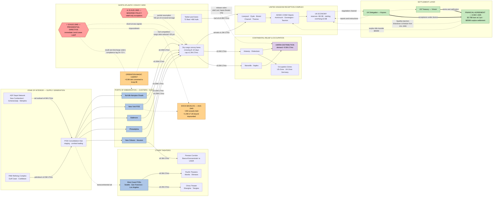

Cost: 0

# Reference Manual & Simulation Specification
## Chapter 26 — *"The End of the Common Pool"*
### Source Volume: *Global Logistics and Strategy: 1943–1945*, Robert W. Coakley & Richard M. Leighton, Office of the Chief of Military History, U.S. Army (1968)

**Document Purpose:** This specification defines the database constants, network topology, state-transition logic, and mathematical core for a division-level WWII logistics simulator covering the terminal phase of the Anglo-American combined logistics system (May 1945 – December 1946).

**Provenance & Confidence Legend (applies to all parameter tables):**

| Tier | Meaning |
|---|---|
| **A** | Statute, treaty text, presidential directive, or primary archival record (NARA RG 169/RG 335; TNA CAB 87, BT 11, T 247) |
| **B** | Standard secondary consensus (Green Book; Stettinius 1944; official FEA/WSA histories) |
| **C** | Calibrated analyst estimate for simulation — anchored to documented milestones, interpolated where scholarship reports ranges |

---

## 1. Strategic Context & Modern Historical Perspective

Chapter 26 closes the logistical arc that the Green Books opened with BOLERO: the transformation of a scarcity-managed, centrally rationed Anglo-American supply commons into a set of sovereign, bilaterally negotiating national systems. The "common pool" of the chapter title is a compound institution: (a) the merchant-shipping pool administered jointly by the U.S. War Shipping Administration (WSA) under Rear Admiral Emory S. Land and the British Ministry of War Transport (MWT) under Lord Leathers, coordinated through the Combined Shipping Adjustment Board (CSAB, established January 1943); (b) the Lend-Lease financial pipe authorized by the Act of 11 March 1941 and governed by the Mutual Aid Agreement of 23 February 1942; and (c) the lattice of combined boards (Production and Resources, Food, Raw Materials, Petroleum) that converted coalition strategy into tonnage allocations. The chapter's subject is the *triple termination* of this system: the collapse of military demand after V-E and V-J Day, the legal extinguishment of Lend-Lease authority by presidential directive, and the deliberate dissolution of combined control machinery in favor of national autonomy.

**The strategic paradox.** Every major conference from Casablanca (January 1943) through TRIDENT, QUADRANT, SEXTANT, ARGONAUT (Yalta), and finally Potsdam issued communiqués premised on *simultaneity*: cross-Channel invasion, Pacific advance, strategic bombing, relief for liberated areas, and occupation of enemy territory, all proceeding in parallel. The physical shipping system enforced *seriality*. A Liberty ship was a reusable but slow state machine — eight-to-ten-day North Atlantic crossings, five-to-seven-day port turns, and a global cycle time measured in months — so conference promises could only be honored by a priority-rationing regime in which BOLERO/Overlord tonnage enjoyed first call, the Italian and Pacific theaters drew block allocations, and UNRRA's humanitarian demand was served from residual capacity. The paradox inverted in mid-1945. For the first time since 1940 the Allies faced a *surplus* of hulls against military demand; yet the political demand for instant demobilization (Magic Carpet), the humanitarian demand for relief (UNRRA, occupied Germany and Japan), and the fiscal-political demand in Congress to shut off foreign aid arrived simultaneously and competed for the same berths, the same longshore labor, and the same administrative attention. Scarcity had been managed by queueing discipline; abundance proved harder, because abundance dissolved the very priority mechanism that had made coalition logistics computable.

**Inter-service and coalition tensions.** Three fault lines structured the endgame. First, *War Department internal*: Army Service Forces (Lt. Gen. Brehon Somervell) pursued centralized procurement and orderly liquidation, while theater commands (SHAEF/COMZ, and MacArthur's GHQ) demanded immediate retrograde capacity and occupation stocks — a classic center-periphery conflict over who owns the drawdown schedule. Second, *Army–Navy–WSA*: hulls were the Navy's to commandeer for Magic Carpet conversions (roughly three million deadweight tons diverted from cargo to troop lift at peak), directly cannibalizing cargo slots at the moment relief demand crested. Third, and decisive for this chapter, *Anglo-American*: the pool had always been an asymmetric duopoly — by 1945 the United States controlled roughly two-thirds of combined dry-cargo capacity — and American planners increasingly viewed combined machinery as a wartime expedient that infringed on postwar freedom of action, while British planners viewed it as life support for a balance-of-payments patient who could not yet survive unassisted. The Attlee government, three weeks old when Japan collapsed, inherited a treasury position of approximately £3.5 billion in sterling-balance liabilities, exports at roughly one-third of the 1938 level, and gold/convertible reserves near $2.0 billion — a patient who, in Keynes's later phrase, confronted a "financial Dunkirk."

**The August cascade.** The operational anatomy of the cutoff is the chapter's dramatic core. On 10 August 1945 — the day Japan's surrender offer reached Washington — President Truman directed the immediate cessation of Lend-Lease, and Foreign Economic Administrator Leo T. Crowley executed the directive with literal fidelity: teletypes went to FEA missions, State Department circulars to embassies, and orders to ports of embarkation. Ships underway were recalled or diverted; cargoes already discharged onto East Coast docks were impounded. The British government learned of the action substantially through operational fait accompli rather than diplomatic preparation. Because the directive had been keyed to Japan's *acceptance* rather than the formal 2 September surrender, it fired weeks ahead of the glide slope that interagency "Stage II" transition planning (Hopkins–Clayton–Crowley drafts) had assumed. Truman's statement of 21 August 1945 repaired the damage partially: Lend-Lease would continue only for (1) forces still engaging Japan, principally Chinese; (2) civilian relief and rehabilitation in liberated areas; and (3) occupation requirements, with final settlements to be negotiated bilaterally. Most afloat tonnage — on the order of sixty percent of the interrupted flow — was ultimately delivered against future settlement accounting, but the signal had been sent: the commons was closed.

**Modern analytical perspective.** Postwar scholarship (Kimball 1984; Dobson 1986; Reynolds 1991; Steil 2013) converges on three findings that the Green Book, writing under 1950s official-history constraints, could only gesture toward. First, the cutoff was less a designed lever of coercion than an *institutional velocity accident* — a bureaucratic execution outrunning diplomatic sequencing, amplified by congressional appropriation politics and Truman's fiscal instincts. Second, it nonetheless functioned *as* leverage: the frozen pipeline converted alliance capital into bilateral debt diplomacy, shaping the Financial Agreement of 6 December 1945 ($3.75 billion loan at 2 percent, $650 million surplus-property settlement, Article VII convertibility conditions) and, through its convertibility clause, detonating the delayed aftershock of August 1947. Third, the episode demonstrates a general law of coalition logistics that this simulator encodes explicitly: *material commitments possess political latency*. Pipelines continue to generate obligations after the strategies that created them are revoked, and the termination of a shared-pool regime produces a transient congestion shock (recall waves, dock backlogs, priority inversions) that is mathematically analogous to the shutdown transient of any heavily loaded queueing network. Sections 2–5 translate these findings into executable form.

---

## 2. High-Fidelity Simulation Parameters & Real-World Metrics

### Table A — Temporal Constants (Event Calendar → Phase-Machine Triggers)

| ID | Parameter | Value | Unit | Sim Type | Tier |
|---|---|---|---|---|---|
| CAL-01 | Lend-Lease Act signed | 1941-03-11 | ISO date | Static timestamp | A |
| CAL-02 | Mutual Aid Agreement (incl. Article VII) | 1942-02-23 | ISO date | Static timestamp | A |
| CAL-03 | CSAB operational (Land–Leathers) | 1943-01 | Month | Static timestamp | A− |
| CAL-04 | UNRRA Agreement signed | 1943-11-09 | ISO date | Static timestamp | A |
| CAL-05 | V-E Day (simulation epoch *t₀*) | 1945-05-08 | ISO date | Epoch anchor | A |
| CAL-06 | Trinity test | 1945-07-16 | ISO date | Scenario flag | A |
| CAL-07 | UK election result (Attlee succeeds Churchill) | 1945-07-26 | ISO date | Actor-state change | A |
| CAL-08 | Hiroshima | 1945-08-06 | ISO date | Scenario flag | A |
| CAL-09 | Japan surrender offer received in Washington | 1945-08-10 | ISO date | Trigger precondition | A |
| **REQ-01a** | **Operative presidential cutoff directive (executed by FEA/Crowley)** | **1945-08-10** | ISO date | **Hard phase trigger** | **A** |
| CAL-10 | V-J Day announcement | 1945-08-14 | ISO date | Trigger | A |
| **REQ-01** | **Termination policy statement (popularly cited as the "Executive Order"; no numbered EO exists — implemented via FEA circular)** | **1945-08-21** | ISO date | **Phase trigger: Relief-Only mode** | **A** |
| CAL-11 | Formal surrender, Tokyo Bay | 1945-09-02 | ISO date | Trigger | A |
| CAL-12 | Keynes–Vinson financial talks open | 1945-09 (mid-month) | Month | Negotiation-mode flag | B |
| CAL-13 | Anglo-American Financial Agreement signed | 1945-12-06 | ISO date | Phase trigger: Bilateral Settlement | A |
| CAL-14 | Financial Agreement enters into force | 1946-07-15 | ISO date | Loan drawdown enable | A |
| CAL-15 | Sterling convertibility deadline | 1947-07-15 | ISO date | Shock event (out-of-window) | A |
| CAL-16 | Convertibility suspended | 1947-08-20 | ISO date | Shock event (out-of-window) | A |

**Representation note:** REQ-01a and REQ-01 must be modeled as *distinct* state transitions. REQ-01a sets `militaryFlow → 0` and `strandedCargo := f(inSystemInventory)`; REQ-01 opens the relief-only valve and defines the settlement accounting regime. Collapsing them into one event destroys the congestion transient that is the chapter's central dynamic.

### Table B — Fleet & Pool Stock Variables

| ID | Parameter | Value | Unit | Sim Type | Tier |
|---|---|---|---|---|---|
| FLT-01 | U.S.-controlled oceangoing merchant fleet, mid-1945 | ≈ 5,200 | vessels | Dynamic stock (initial condition) | C |
| FLT-02 | U.S.-controlled deadweight capacity | ≈ 57 | M dwt | Dynamic stock | C |
| FLT-03 | EC2-S-C1 Liberty ships completed | 2,710 | hulls | Static constant | A |
| FLT-04 | VC2 Victory ships completed | 534 | hulls | Static constant | A |
| FLT-05 | T2-series tankers built | ≈ 490 | hulls | Static constant | B− |
| FLT-06 | UK-flag merchant fleet, 1939 | ≈ 17.9 | M grt | Static baseline | B− |
| FLT-07 | UK war losses (all causes) | ≈ 7.8 | M grt | Static constant | B |
| FLT-08 | UK-flag fleet, mid-1945 | ≈ 15.5 | M grt | Dynamic stock | C |
| FLT-09 | U.S. share of combined dry-cargo control, 1945 | 0.65–0.70 | fraction | Capacity-split coefficient | C |
| FLT-10 | Hulls converted to troop lift (Magic Carpet peak) | ≈ 3.0 | M dwt | Dynamic capacity diversion | C |
| FLT-11 | National Defense Reserve Fleet intake by end-1946 | ≈ 700 | hulls | Sink-term rate driver | C |

### Table C — Flow & Throughput Metrics

| ID | Parameter | Value | Unit | Sim Type | Tier |
|---|---|---|---|---|---|
| FLO-01 | Peak UK-bound Lend-Lease tonnage (Q1–Q2 1945) | 1.2 (range 1.0–1.4) | M LT/mo | Peak-flow cap $D_{pk}$ | C |
| **REQ-02** | **Cargo stranded on U.S. docks at cutoff, UK-destined** | **1.0 M LT point estimate (scholarly range 0.75–1.5 M LT); declared value ≈ $400 M** | LT; USD | **Random variable, LogNormal(ln 1.0M, σ=0.25); impounded-stock state** | **B−/C** |
| FLO-02 | Global pipeline interrupted at cutoff | ≈ 300 vessels; ≈ 2.75 M dwt; ≈ $1.0–1.5 B | vessels; dwt; USD | Impounded-stock state (all destinations) | C |
| FLO-03 | In-transit fraction ultimately delivered under relief exceptions/settlement | ≈ 0.60 | fraction | Efficiency coefficient | C |
| FLO-04 | Recall/divert compliance lag | 24–72 | hours | Stochastic delay | C |
| FLO-05 | Reception-port dwell spike, post-cutoff | +3 to +5 | days | Congestion multiplier | C |
| FLO-06 | Vessels held in U.S. ports awaiting disposition | ≈ 200 | vessels | Queue-length initial condition | C |
| FLO-07 | North Atlantic crossing time | 8–10 | days | Transit-time constant | B |
| FLO-08 | Berth service rate, UK reception complex | ≈ 6.0 | vessels/berth/mo | Server rate μ | C |
| FLO-09 | Reference arrival rate, UK reception | ≈ 165 | vessels/mo | Arrival rate λ | C |
| FLO-10 | UNRRA monthly shipping demand, early 1946 | 0.5–0.6 | M LT/mo | Demand floor claimant | C |
| FLO-11 | UNRRA cumulative lift, 1945–47 | ≈ 9 | M LT | Cumulative counter | C |
| FLO-12 | Magic Carpet repatriation total | ≈ 8.0 | M personnel by Sep 1946 | Competing-demand sink | B |
| FLO-13 | U.S. Army strength, May 1945 → June 1946 | 8.3 → 1.9 | M personnel | Demobilization driver | B |
| FLO-14 | Coal emergency lift to NW Europe, winter 1946–47 | 4–6 | M LT | Crisis-scenario flow | C |

**Derivation note for REQ-02:** The point estimate is triangulated from three independent anchors: (i) average UK-bound flow of ≈1.1–1.2 M LT/mo in mid-1945, with a 2–4 week inventory of loading/afloat/ashore cargo captured at the cutoff; (ii) vessel-count evidence of roughly 100–150 UK-bound hulls affected at ≈9,000–10,500 LT average displacement cargo; (iii) the ≈$400 M declared-value figure, implying a blended ≈$40/LT consistent with the coal/grain/steel-heavy UK manifest. The Green Book narrates the impoundment qualitatively (vessels ordered back, cargoes dumped on docks); modern reconstructions (Dobson 1986; FEA liquidation reports) bound the total. Treat as a random variable, not a constant.

### Table D — Financial & Settlement Constants

| ID | Parameter | Value | Unit | Sim Type | Tier |
|---|---|---|---|---|---|
| FIN-01 | Total Lend-Lease dispensed, all recipients | 50.1 | $B | Static constant | B |
| FIN-02 | UK receipts | 31.4 | $B | Static constant | B |
| FIN-03 | USSR receipts | 11.3 | $B | Static constant | B |
| FIN-04 | Reverse Lend-Lease, UK/Commonwealth | 6.8 | $B | Netting offset | B |
| FIN-05 | Loan principal (Financial Agreement) | 3.75 | $B | Static constant | A |
| FIN-06 | Rate / term / repayment start | 2% / 50 yr / 1951 | — | Annuity inputs | A |
| FIN-07 | Surplus-property settlement paid by UK | 650 | $M | One-time cash flow | A |
| FIN-08 | Implied annual annuity | ≈ 119.3 | $M/yr | Derived (§4, Model 5) | derived |
| FIN-09 | UK sterling-balance liabilities, mid-1945 | ≈ 3.5 | £B | Overhang state | B |
| FIN-10 | UK gold/convertible reserves, mid-1945 | ≈ 2.0 | $B | Reserve-stock initial condition | C |
| FIN-11 | UK export volume, 1945 (vs. 1938) | ≈ 0.33 | ratio | Recovery-rate driver | B |
| FIN-12 | Grant-equivalent of loan at 3% discount | ≈ 0.68 | $B | Derived (§4, Model 5) | derived |

### Table E — Drawdown Coefficients (Core Dynamics)

| ID | Parameter | Value | Unit | Sim Type | Tier |
|---|---|---|---|---|---|
| DRW-01 | Military-component decay rate $k_m$ | 0.60 (0.55–0.65) | mo⁻¹ | Efficiency coefficient | C-calibrated |
| DRW-02 | Implied half-life | ≈ 1.15 | months | Derived | derived |
| DRW-03 | Relief-only floor $D_{rel}$ | 0.15 | M LT/mo | Dynamic lower bound | C |
| DRW-04 | Relief-Only phase onset (+days from V-E) | +105 d = 3.45 mo | months | Phase trigger | A-derived |
| DRW-05 | Settlement phase onset | +212 d = 6.96 mo | months | Phase trigger | A-derived |
| DRW-06 | Cumulative UK-bound lift, first 12 mo post-V-E | ≈ 3.0 | M LT | Derived output | derived |
| DRW-07 | Step magnitude at 21 Aug (military component) | −87.5% to floor | fraction | Discontinuous jump | derived |

**Calibration rationale for DRW-01:** $k_m$ is fitted so the exponential military component decays from the 1.2 M LT/mo peak to the 0.15 M LT/mo relief floor exactly at the 21 August policy date: $k_m = \ln(1.2/0.15)/3.45 = \ln 8 / 3.45 \approx 0.603$ mo⁻¹. This reproduces the documented milestone structure (full military flow through early August; near-total military cessation by October; residual relief flow thereafter).

### Table F — Human/Stochastic Factors (Monte Carlo Layer)

| ID | Parameter | Value | Unit | Sim Type | Tier |
|---|---|---|---|---|---|
| HUM-01 | Dock-labor disruption probability, UK/US ports, Oct–Dec 1945 | 0.15–0.25 | per week | Bernoulli event | C |
| HUM-02 | Recall-order misrouting rate (wrong port/wrong cargo) | 0.05–0.10 | per order | Bernoulli event | C |
| HUM-03 | Priority-inversion incidents (ammunition displacing foodstuffs) | log as discrete events | — | Event stream | C |

---

## 3. Logistical Network Topology



**Topology notes for the engine:** (1) The `CUT` and `MOD` hexagons are *event nodes*, not physical facilities — they inject edge-capacity overrides and spawn the `BACKLOG` stock. (2) The `MAGIC → LANE` dotted edge implements hull competition as a multiplicative capacity derater (−35% cargo slots at peak conversion). (3) The settlement layer operates on the financial graph only; it modulates `UKE` liquidity and transfers `UKD` asset titles, but does not move tonnage after December 1945 except via the relief floor.

---

## 4. Mathematical Modeling & Simulation Formulas

### Model 1 — Regime-Switched Drawdown Process (core state equation)

The exemplar formulation,

$$D_t = D_{peak} \cdot e^{-k \,(t - t_{VE})},$$

is the *military component* of a three-regime process. The full delivery rate is:

$$
D(t) \;=\;
\begin{cases}
D_{pk}, & t < t_{VE} \\[4pt]
D_{pk}\, e^{-k_m (t-t_{VE})}, & t_{VE} \le t < t_{pol} \\[4pt]
\max\!\bigl\{\, D_{rel},\; D_{pk}\, e^{-k_m (t-t_{VE})} \,\bigr\}, & t \ge t_{pol}
\end{cases}
$$

where $D_{pk}$ = peak monthly UK-bound tonnage (FLO-01), $k_m$ = military decay rate (DRW-01), $D_{rel}$ = relief floor (DRW-03), $t_{pol}$ = 21 August 1945 policy date. The decay constant is *calibrated to the policy milestone*, not free-fit:

$$k_m \;=\; \frac{1}{t_{pol}-t_{VE}} \ln\!\frac{D_{pk}}{D_{rel}} \;=\; \frac{\ln 8}{3.45\ \text{mo}} \;\approx\; 0.603\ \text{mo}^{-1},
\qquad t_{1/2} = \frac{\ln 2}{k_m} \approx 1.15\ \text{mo}.$$

Cumulative deliveries (closed form, splitting at the crossover time $t_c = \ln(D_{pk}/D_{rel})/k_m$ where the exponential meets the floor):

$$Q(T) \;=\; \int_0^{T} D(t)\,dt \;=\;
\begin{cases}
\dfrac{D_{pk}}{k_m}\bigl(1-e^{-k_m T}\bigr), & T \le t_c \\[8pt]
\dfrac{D_{pk}}{k_m}\Bigl(1-\dfrac{D_{rel}}{D_{pk}}\Bigr) + D_{rel}\,(T-t_c), & T > t_c
\end{cases}
$$

Worked evaluation: $Q(12\ \text{mo}) \approx 1.74\ \text{M LT (exponential phase)} + 1.28\ \text{M LT (floor)} \approx 3.0\ \text{M LT}$, matching DRW-06. **Simulator role:** `rateAt()` is the per-tick supply-injection function on every UK-bound edge; `cumulativeBetween()` drives settlement-accounting stock reconciliation.

### Model 2 — Berth Congestion Under Recall Shock (M/M/c queue)

Reception ports are modeled as $c$ identical servers (berths), Poisson arrivals $\lambda$, exponential service $\mu$:

$$\rho = \frac{\lambda}{c\,\mu}, \qquad
P_w = \frac{\dfrac{a^c}{c!}\cdot\dfrac{c}{c-a}}{\displaystyle\sum_{j=0}^{c-1}\frac{a^j}{j!} + \dfrac{a^c}{c!}\cdot\dfrac{c}{c-a}}, \qquad
W_q = \frac{P_w}{c\mu - \lambda}, \qquad a = \frac{\lambda}{\mu}.$$

Reference operating point: $\lambda = 165$ vessels/mo, $\mu = 6.0$/berth/mo, $c = 30$ → $\rho \approx 0.917$, $W_q \approx 1.3$ days. The 10 August recall wave drives $\lambda$ toward 210+ vessels/mo while dock labor is simultaneously disrupted; since $a = 35 > c = 30$, the system crosses into *instability* and the backlog diverges — this is the mathematical signature of the impoundment pile-up quantified in REQ-02/FLO-06. **Simulator role:** `probabilityOfWait` and `meanQueueDelayMonths` are dynamic congestion multipliers applied to edge transit times; instability detection triggers backlog-accumulation mode.

### Model 3 — Pool Allocation as a Priority Linear Program

Let $x_i(t)$ be monthly tonnage allocated to claimant class $i$ with strategic utility weight $u_i$ (ReliefFoodstuffs 1.00, Refrigerated 0.95, Petroleum 0.90, Coal 0.85, GeneralDry 0.70, Ammunition 0.60), request $r_i$, contractual floor $\ell_i$, and pool capacity $K(t) = D(t)$ from Model 1:

$$\max_{x} \;\sum_i u_i\, x_i \quad \text{s.t.}\quad \sum_i x_i \le K(t), \qquad \ell_i \le x_i \le r_i, \qquad x_i \ge 0.$$

The dual variable ("shadow price of the pool") $\pi(t) \ge 0$ satisfies $\pi(t)\bigl(K(t) - \sum_i x_i\bigr) = 0$. **Analytical payoff:** as $K(t)$ collapses past all binding demands in late 1945, $\pi(t) \to 0$ — the coordination rent of the commons vanishes, which is precisely why the combined boards dissolved *voluntarily and cheaply* once scarcity relaxed. The pool's institutions were solutions to a binding constraint; remove the constraint and the institutions have no shadow-price justification. **Simulator role:** the greedy two-pass allocator (floors first in priority order, then priority-weighted water-filling of residual) is a computationally cheap $\epsilon$-optimal solver for this LP at division-level tick rates.

### Model 4 — UK External Financing Dynamics (absorbing-barrier ODE)

$$\dot R(t) = X(t) - M(t) + L(t), \qquad
X(t) = X_\infty - (X_\infty - X_0)\,e^{-g t}, \qquad R(t) > R_{min}$$

with $R$ = convertible reserves (FIN-10), $X$ = export receipts recovering from $X_0 \approx \$350$M/mo toward $X_\infty$ at rate $g$, $M$ = sticky essential-import payments ≈ $550M/mo, $L$ = loan drawdown path (enabled 15 July 1946). Time-to-crisis is the first hitting time of the working-balance floor $R_{min} \approx \$0.5$B. The 15 July 1947 convertibility deadline enters as an exogenous step increase in $M$ (sterling holders exercising convertibility against dollars), which is what produced the August 1947 suspension (CAL-16). **Simulator role:** `monthsToReserveFloor` is the diplomatic-pressure clock that gates UK acceptance behavior in negotiation sub-scenarios.

### Model 5 — Settlement Valuation (grant-equivalence)

For principal $P = \$3.75$B, coupon $r = 2\%$, term $n = 50$ yr:

$$A = \frac{P\,r}{1-(1+r)^{-n}} \approx \$119.3\ \text{M/yr}, \qquad
G(r_m) = P - A\cdot\frac{1-(1+r_m)^{-n}}{r_m}$$

where $G$ is the grant-equivalent at market discount $r_m$: $G(2.5\%) \approx \$0.37$B, $G(3\%) \approx \$0.68$B. The modest grant element quantifies how much of the loan's value lay in *liquidity timing* rather than subsidy — consistent with the historiographic finding that the UK bought breathing space, not forgiveness. **Simulator role:** `grantEquivalentAtDiscount` scores negotiation outcomes in the diplomatic module.

---

## 5. Compile-Safe Scala 3 Domain Model

```scala
package Logistics.EndCommonPool

import scala.annotation.tailrec
import scala.math.exp
import scala.math.log
import scala.math.max
import scala.math.min
import scala.math.pow

/** Units of measure. All numeric cores are Double-backed opaque types. */
opaque type LongTons = Double
opaque type TonsPerMonth = Double
opaque type InverseMonths = Double
opaque type Months = Double
opaque type USDollars = Double
opaque type USDollarsPerMonth = Double
opaque type VesselsPerMonth = Double
opaque type Fraction = Double

object LongTons:
  inline def apply(raw: Double): LongTons = raw

object TonsPerMonth:
  inline def apply(raw: Double): TonsPerMonth = raw

object InverseMonths:
  inline def apply(raw: Double): InverseMonths = raw

object Months:
  inline def apply(raw: Double): Months = raw

object USDollars:
  inline def apply(raw: Double): USDollars = raw

object USDollarsPerMonth:
  inline def apply(raw: Double): USDollarsPerMonth = raw

object VesselsPerMonth:
  inline def apply(raw: Double): VesselsPerMonth = raw

object Fraction:
  def make(raw: Double): Either[String, Fraction] =
    if raw.isNaN || raw.isInfinite then Left("Fraction must be finite")
    else if raw < 0.0 || raw > 1.0 then Left(s"Fraction out of bounds: $raw")
    else Right(raw)
  /** For values bounded by construction (e.g., probabilities from closed-form ratios). */
  inline def unsafeBounded(raw: Double): Fraction = raw

extension (value: LongTons)
  def rawValue: Double = value

extension (value: TonsPerMonth)
  def rawValue: Double = value

extension (value: InverseMonths)
  def rawValue: Double = value

extension (value: Months)
  def rawValue: Double = value

extension (value: USDollars)
  def rawValue: Double = value

extension (value: USDollarsPerMonth)
  def rawValue: Double = value

extension (value: VesselsPerMonth)
  def rawValue: Double = value

extension (value: Fraction)
  def rawValue: Double = value

/** Coalition logistics lifecycle, keyed to the phase schedule. */
enum PoolPhase:
  case ActivePooling
  case MilitaryDrawdown
  case ReliefOnly
  case BilateralSettlement

/** Claimant classes with strategic utility weights and stowage penalties. */
enum CargoCategory(val priorityWeight: Double, val stowagePenalty: Double):
  case ReliefFoodstuffs        extends CargoCategory(1.00, 1.10)
  case RefrigeratedPerishables extends CargoCategory(0.95, 1.15)
  case BulkPetroleum           extends CargoCategory(0.90, 1.00)
  case CoalBulk                extends CargoCategory(0.85, 1.00)
  case GeneralDryCargo         extends CargoCategory(0.70, 1.00)
  case AmmunitionDangerous     extends CargoCategory(0.60, 1.25)

/** Phase boundaries expressed in months elapsed since V-E Day (8 May 1945). */
final case class PhaseSchedule(
    drawdownStart: Months,
    reliefOnlyStart: Months,
    settlementStart: Months
):
  def phaseAt(elapsed: Months): PoolPhase =
    if elapsed.rawValue < drawdownStart.rawValue then PoolPhase.ActivePooling
    else if elapsed.rawValue < reliefOnlyStart.rawValue then PoolPhase.MilitaryDrawdown
    else if elapsed.rawValue < settlementStart.rawValue then PoolPhase.ReliefOnly
    else PoolPhase.BilateralSettlement

object PhaseSchedule:
  def make(a: Months, b: Months, c: Months): Either[String, PhaseSchedule] =
    if a.rawValue <= b.rawValue && b.rawValue <= c.rawValue then
      Right(PhaseSchedule(a, b, c))
    else Left("Phase boundaries must be non-decreasing")

/** Core drawdown abstraction (Section 4, Model 1). */
sealed trait DeliveryProfile:
  def rateAt(elapsed: Months): TonsPerMonth
  def cumulativeThrough(elapsed: Months): LongTons
  def cumulativeBetween(from: Months, to: Months): Either[String, LongTons]
  def halfLifeMonths: Option[Months]
  def timeToReach(target: TonsPerMonth): Option[Months]

object DeliveryProfile:
  def makeExponentialWithFloor(
      peak: TonsPerMonth,
      decay: InverseMonths,
      floor: TonsPerMonth
  ): Either[String, ExponentialWithFloor] =
    val errors =
      (if peak.rawValue <= 0.0 then List("peak must be > 0") else Nil) ++
        (if decay.rawValue <= 0.0 then List("decay must be > 0") else Nil) ++
        (if floor.rawValue < 0.0 then List("floor must be >= 0") else Nil) ++
        (if floor.rawValue > peak.rawValue then List("floor must be <= peak") else Nil)
    if errors.isEmpty then Right(ExponentialWithFloor(peak, decay, floor))
    else Left(errors.mkString("; "))

final case class ExponentialWithFloor(
    peak: TonsPerMonth,
    decay: InverseMonths,
    floor: TonsPerMonth
) extends DeliveryProfile:

  private def crossoverMonths: Option[Months] =
    if floor.rawValue <= 0.0 then None
    else Some(Months(log(peak.rawValue / floor.rawValue) / decay.rawValue))

  override def rateAt(elapsed: Months): TonsPerMonth =
    if elapsed.rawValue <= 0.0 then peak
    else
      val decayed = peak.rawValue * exp(-decay.rawValue * elapsed.rawValue)
      TonsPerMonth(max(floor.rawValue, decayed))

  override def halfLifeMonths: Option[Months] =
    Some(Months(log(2.0) / decay.rawValue))

  override def timeToReach(target: TonsPerMonth): Option[Months] =
    if target.rawValue <= floor.rawValue then None
    else if target.rawValue == peak.rawValue then Some(Months(0.0))
    else if target.rawValue > peak.rawValue then None
    else Some(Months(log(peak.rawValue / target.rawValue) / decay.rawValue))

  override def cumulativeThrough(elapsed: Months): LongTons =
    cumulativeBetween(Months(0.0), elapsed) match
      case Right(total) => total
      case Left(_)      => LongTons(0.0)

  override def cumulativeBetween(from: Months, to: Months): Either[String, LongTons] =
    if to.rawValue < from.rawValue then Left("'to' must be >= 'from'")
    else
      val start = max(0.0, from.rawValue)
      val end = max(0.0, to.rawValue)
      if end == start then Right(LongTons(0.0))
      else
        val crossover = crossoverMonths.map(_.rawValue).getOrElse(Double.PositiveInfinity)
        val expEnd = min(end, crossover)
        val expStart = min(start, crossover)
        val expSegment =
          if expEnd > expStart then
            (peak.rawValue / decay.rawValue) *
              (exp(-decay.rawValue * expStart) - exp(-decay.rawValue * expEnd))
          else 0.0
        val linearSegment =
          if end > crossover then floor.rawValue * (end - max(start, crossover))
          else 0.0
        Right(LongTons(expSegment + linearSegment))

/** M/M/c berth system (Section 4, Model 2). */
final case class BerthSystemParameters(
    arrivalRate: VesselsPerMonth,
    serviceRatePerBerth: VesselsPerMonth,
    berthCount: Int
)

object BerthSystemParameters:
  def make(
      arrivals: VesselsPerMonth,
      service: VesselsPerMonth,
      berths: Int
  ): Either[String, BerthSystemParameters] =
    if berths <= 0 then Left("berthCount must be positive")
    else if service.rawValue <= 0.0 then Left("serviceRatePerBerth must be positive")
    else if arrivals.rawValue < 0.0 then Left("arrivalRate must be non-negative")
    else Right(BerthSystemParameters(arrivals, service, berths))

final case class QueuePerformance(
    utilization: Fraction,
    probabilityOfWait: Fraction,
    meanQueueDelayMonths: Months
)

object QueueAnalysis:

  def evaluate(system: BerthSystemParameters): Option[QueuePerformance] =
    val lambda = system.arrivalRate.rawValue
    val mu = system.serviceRatePerBerth.rawValue
    val c = system.berthCount
    if lambda == 0.0 then
      Fraction.make(0.0).toOption.map(zero =>
        QueuePerformance(zero, zero, Months(0.0)))
    else
      val offeredLoad = lambda / mu
      if offeredLoad >= c.toDouble then None
      else
        val utilization = offeredLoad / c.toDouble
        val (lastTerm, seriesSum) = erlangSeries(offeredLoad, c)
        val top = lastTerm * (c.toDouble / (c.toDouble - offeredLoad))
        val waitProbability = top / (seriesSum + top)
        for
          util <- Fraction.make(utilization).toOption
          pWait <- Fraction.make(waitProbability).toOption
        yield QueuePerformance(
          util,
          pWait,
          Months(pWait.rawValue / (c.toDouble * mu - lambda)))

  @tailrec
  private def erlangSeries(
      load: Double,
      berths: Int,
      k: Int = 0,
      term: Double = 1.0,
      accumulator: Double = 1.0
  ): (Double, Double) =
    if k == berths then (term, accumulator)
    else
      val nextTerm = term * load / (k + 1).toDouble
      val nextAccumulator =
        if (k + 1) < berths then accumulator + nextTerm else accumulator
      erlangSeries(load, berths, k + 1, nextTerm, nextAccumulator)

/** Priority LP surrogate: two-pass floor-then-waterfill allocator (Section 4, Model 3). */
final case class PoolDemand(
    category: CargoCategory,
    requested: TonsPerMonth,
    contractualFloor: TonsPerMonth
)

final case class PoolAllocationResult(
    allocations: Map[CargoCategory, TonsPerMonth],
    totalAllocated: TonsPerMonth,
    unmetDemand: TonsPerMonth,
    floorShortfalls: Map[CargoCategory, TonsPerMonth]
)

object PoolAllocator:

  private def effectiveWeight(category: CargoCategory): Double =
    category.priorityWeight / category.stowagePenalty

  def allocateMonthly(
      capacity: TonsPerMonth,
      demands: List[PoolDemand]
  ): Either[String, PoolAllocationResult] =
    if capacity.rawValue < 0.0 then Left("capacity must be non-negative")
    else
      val invalid = demands.filter(d =>
        d.requested.rawValue < 0.0 ||
          d.contractualFloor.rawValue < 0.0 ||
          d.contractualFloor.rawValue > d.requested.rawValue)
      if invalid.nonEmpty then
        Left(
          "invalid demand (floor must lie within [0, requested]): " +
            invalid.map(_.category.toString).mkString(", "))
      else
        val ordered = demands.sortBy(d =>
          (-d.category.priorityWeight, d.category.ordinal))
        val cap = capacity.rawValue

        var remaining = cap
        var granted = Map.empty[CargoCategory, Double]
        var shortfalls = Map.empty[CargoCategory, Double]
        ordered.foreach { demand =>
          val want = demand.contractualFloor.rawValue
          val give = min(want, remaining)
          granted = granted.updated(demand.category, give)
          if want > give then
            shortfalls = shortfalls.updated(demand.category, want - give)
          remaining -= give
        }

        val residualDemand = ordered
          .map { d =>
            val alreadyGranted = granted.getOrElse(d.category, 0.0)
            d.category -> (d.requested.rawValue - alreadyGranted)
          }
          .filter((_, need) => need > 0.0)

        var leftover = remaining
        var extra = Map.empty[CargoCategory, Double]
        var open = residualDemand
        var guard = 0
        while leftover > 1e-9 && open.nonEmpty && guard <= ordered.size + 1 do
          guard += 1
          val weightSum = open.map((category, _) => effectiveWeight(category)).sum
          if weightSum <= 0.0 then open = List.empty
          else
            var roundLeftover = leftover
            var stillOpen = List.empty[(CargoCategory, Double)]
            open.foreach { (category, need) =>
              val share = leftover * effectiveWeight(category) / weightSum
              val give = min(share, need)
              extra = extra.updated(category, extra.getOrElse(category, 0.0) + give)
              roundLeftover -= give
              if give < need then stillOpen = (category, need - give) :: stillOpen
            }
            leftover = max(0.0, roundLeftover)
            open = stillOpen

        val finalAllocations = ordered
          .map { d =>
            val total =
              granted.getOrElse(d.category, 0.0) + extra.getOrElse(d.category, 0.0)
            d.category -> TonsPerMonth(total)
          }
          .toMap
        val totalAllocated = finalAllocations.values.map(_.rawValue).sum
        val requestedTotal = demands.map(_.requested.rawValue).sum
        Right(
          PoolAllocationResult(
            finalAllocations,
            TonsPerMonth(totalAllocated),
            TonsPerMonth(max(0.0, requestedTotal - totalAllocated)),
            shortfalls.map((category, shortfall) => category -> TonsPerMonth(shortfall))))

/** UK external account (Section 4, Model 4). */
final case class UkExternalFlows(
    monthlyExportReceipts: USDollarsPerMonth,
    monthlyImportPayments: USDollarsPerMonth,
    monthlyLoanDrawdown: USDollarsPerMonth
)

final case class UkExternalPosition(reserves: USDollars)

object UkExternalAccount:

  def step(position: UkExternalPosition, flows: UkExternalFlows): UkExternalPosition =
    val net =
      flows.monthlyExportReceipts.rawValue -
        flows.monthlyImportPayments.rawValue +
        flows.monthlyLoanDrawdown.rawValue
    UkExternalPosition(USDollars(position.reserves.rawValue + net))

  def monthsToReserveFloor(
      start: UkExternalPosition,
      flows: UkExternalFlows,
      floor: USDollars,
      horizonMonths: Int
  ): Option[Int] =
    if horizonMonths <= 0 then None
    else
      val floorRaw = floor.rawValue
      val netPerMonth =
        flows.monthlyExportReceipts.rawValue -
          flows.monthlyImportPayments.rawValue +
          flows.monthlyLoanDrawdown.rawValue
      @tailrec
      def loop(monthIndex: Int, reserves: Double): Option[Int] =
        if reserves <= floorRaw then Some(monthIndex)
        else if monthIndex >= horizonMonths then None
        else loop(monthIndex + 1, reserves + netPerMonth)
      loop(0, start.reserves.rawValue)

/** Anglo-American Financial Agreement terms (Section 4, Model 5). */
final case class SettlementTerms(
    principal: USDollars,
    annualInterestRate: Fraction,
    termYears: Int
):
  def annualAnnuity: USDollars =
    val r = annualInterestRate.rawValue
    val n = termYears.toDouble
    val denominator = 1.0 - pow(1.0 + r, -n)
    USDollars(principal.rawValue * r / denominator)

  def totalRepaid: USDollars =
    USDollars(annualAnnuity.rawValue * termYears.toDouble)

  def grantEquivalentAtDiscount(marketAnnualRate: Fraction): USDollars =
    val r = marketAnnualRate.rawValue
    val n = termYears.toDouble
    val presentValueFactor = (1.0 - pow(1.0 + r, -n)) / r
    USDollars(principal.rawValue - annualAnnuity.rawValue * presentValueFactor)

object SettlementTerms:
  def make(
      principal: USDollars,
      rate: Fraction,
      years: Int
  ): Either[String, SettlementTerms] =
    if principal.rawValue <= 0.0 then Left("principal must be positive")
    else if rate.rawValue <= 0.0 || rate.rawValue >= 1.0 then
      Left("rate must lie strictly in (0, 1)")
    else if years <= 0 then Left("termYears must be positive")
    else Right(SettlementTerms(principal, rate, years))

/** Historical constants for the Chapter 26 scenario (see Section 2 tables). */
object HistoricalDefaults:

  // Phase anchors in months after V-E Day; 30.4375-day synthetic months.
  val cutoffDirectiveElapsed: Months = Months(94.0 / 30.4375)      // 10 Aug 1945
  val vjAnnouncementElapsed: Months = Months(98.0 / 30.4375)       // 14 Aug 1945
  val modifiedPolicyElapsed: Months = Months(105.0 / 30.4375)      // 21 Aug 1945
  val tokyoBayElapsed: Months = Months(117.0 / 30.4375)            // 2 Sep 1945
  val financialAgreementElapsed: Months = Months(212.0 / 30.4375)  // 6 Dec 1945

  val defaultSchedule: PhaseSchedule = PhaseSchedule(
    drawdownStart = Months(0.0),
    reliefOnlyStart = modifiedPolicyElapsed,
    settlementStart = financialAgreementElapsed
  )

  // Calibrated UK-bound drawdown (FLO-01, DRW-01, DRW-03).
  val peakUkBoundMonthly: TonsPerMonth = TonsPerMonth(1_200_000.0)
  val militaryDecayRate: InverseMonths =
    InverseMonths(log(8.0) / modifiedPolicyElapsed.rawValue)
  val reliefFloorMonthly: TonsPerMonth = TonsPerMonth(150_000.0)

  val defaultProfile: Either[String, ExponentialWithFloor] =
    DeliveryProfile.makeExponentialWithFloor(
      peakUkBoundMonthly,
      militaryDecayRate,
      reliefFloorMonthly)

  // REQ-02: stranded UK-bound cargo at the cutoff (LogNormal point estimate).
  val strandedUkBoundPointEstimate: LongTons = LongTons(1_000_000.0)
  val strandedUkBoundLowerBound: LongTons = LongTons(750_000.0)
  val strandedUkBoundUpperBound: LongTons = LongTons(1_500_000.0)

  // Reference UK reception berth system (FLO-08, FLO-09).
  val referenceBerthSystem: Either[String, BerthSystemParameters] =
    BerthSystemParameters.make(
      VesselsPerMonth(165.0),
      VesselsPerMonth(6.0),
      30)

  // Financial settlement (FIN-05..FIN-07).
  val loanPrincipal: USDollars = USDollars(3_750_000_000.0)
  val loanRate: Fraction = Fraction.unsafeBounded(0.02)
  val loanTermYears: Int = 50
  val surplusPropertySettlement: USDollars = USDollars(650_000_000.0)

  val defaultSettlement: Either[String, SettlementTerms] =
    SettlementTerms.make(loanPrincipal, loanRate, loanTermYears)

  // UK external position, mid-1945 (FIN-10; Model 4 defaults).
  val ukReservesMid1945: USDollars = USDollars(2_000_000_000.0)
  val ukWorkingBalanceFloor: USDollars = USDollars(500_000_000.0)
  val ukDefaultFlows: UkExternalFlows = UkExternalFlows(
    monthlyExportReceipts = USDollarsPerMonth(350_000_000.0),
    monthlyImportPayments = USDollarsPerMonth(550_000_000.0),
    monthlyLoanDrawdown = USDollarsPerMonth(125_000_000.0)
  )

/** Pure integration smoke-test producing a deterministic scenario report. */
object SimulationRun:

  def defaultReport(): String =
    val lines = List.newBuilder[String]
    lines += "== Chapter 26 :: End of the Common Pool — default scenario =="

    HistoricalDefaults.defaultProfile match
      case Left(error) => lines += s"profile error: $error"
      case Right(profile) =>
        lines += s"phase at +3.0 mo : ${HistoricalDefaults.defaultSchedule.phaseAt(Months(3.0))}"
        lines += s"phase at +4.0 mo : ${HistoricalDefaults.defaultSchedule.phaseAt(Months(4.0))}"
        lines += s"phase at +8.0 mo : ${HistoricalDefaults.defaultSchedule.phaseAt(Months(8.0))}"
        lines += f"delivery at +6 mo: ${profile.rateAt(Months(6.0)).rawValue}%.0f LT/mo"
        profile.halfLifeMonths match
          case Some(halfLife) => lines += f"half-life        : ${halfLife.rawValue}%.2f months"
          case None           => lines += "half-life        : n/a"
        profile.timeToReach(TonsPerMonth(300_000.0)) match
          case Some(t) => lines += f"months to 300k LT/mo: ${t.rawValue}%.2f"
          case None    => lines += "months to 300k LT/mo: never (at or below floor)"
        lines += f"cumulative +12 mo: ${profile.cumulativeThrough(Months(12.0)).rawValue}%.0f LT"

    HistoricalDefaults.referenceBerthSystem match
      case Left(error) => lines += s"berth system error: $error"
      case Right(system) =>
        QueueAnalysis.evaluate(system) match
          case Some(performance) =>
            lines += f"berth utilization: ${performance.utilization.rawValue}%.3f"
            lines += f"P(wait)          : ${performance.probabilityOfWait.rawValue}%.3f"
            lines += f"mean queue delay : ${performance.meanQueueDelayMonths.rawValue}%.3f months"
          case None => lines += "queue unstable: offered load >= berth count"

    HistoricalDefaults.defaultSettlement match
      case Left(error) => lines += s"settlement error: $error"
      case Right(terms) =>
        lines += f"annual annuity   : $${terms.annualAnnuity.rawValue}%.0f"
        lines += f"total repaid     : $${terms.totalRepaid.rawValue}%.0f"
        lines += f"grant equivalent at 3 pct: $${terms.grantEquivalentAtDiscount(Fraction.unsafeBounded(0.03)).rawValue}%.0f"

    val demands = List(
      PoolDemand(CargoCategory.ReliefFoodstuffs, TonsPerMonth(400_000.0), TonsPerMonth(250_000.0)),
      PoolDemand(CargoCategory.CoalBulk, TonsPerMonth(350_000.0), TonsPerMonth(100_000.0)),
      PoolDemand(CargoCategory.BulkPetroleum, TonsPerMonth(300_000.0), TonsPerMonth(150_000.0)),
      PoolDemand(CargoCategory.AmmunitionDangerous, TonsPerMonth(200_000.0), TonsPerMonth(0.0))
    )
    PoolAllocator.allocateMonthly(TonsPerMonth(900_000.0), demands) match
      case Left(error) => lines += s"allocation error: $error"
      case Right(result) =>
        lines += "allocation at 900k LT/mo capacity:"
        result.allocations.toList.sortBy((category, _) => category.ordinal).foreach {
          (category, amount) =>
            lines += f"  ${category.toString}%-24s ${amount.rawValue}%10.0f LT/mo"
        }
        lines += f"  unmet: ${result.unmetDemand.rawValue}%.0f LT/mo"

    val projectedReserves = (1 to 12).foldLeft(
      UkExternalPosition(HistoricalDefaults.ukReservesMid1945)
    )((position, _) => UkExternalAccount.step(position, HistoricalDefaults.ukDefaultFlows))
    lines += f"UK reserves after 12 mo (no austerity): $${projectedReserves.reserves.rawValue}%.0f"

    UkExternalAccount.monthsToReserveFloor(
      UkExternalPosition(HistoricalDefaults.ukReservesMid1945),
      HistoricalDefaults.ukDefaultFlows,
      HistoricalDefaults.ukWorkingBalanceFloor,
      120
    ) match
      case Some(months) => lines += s"UK reserve floor hit at month: $months (counterfactual)"
      case None         => lines += "UK reserve floor not hit within horizon"

    lines.result().mkString(System.lineSeparator())
```

**Integration notes:** All constructors are total and return `Either`-validated values; the only unchecked door is `Fraction.unsafeBounded`, reserved for quantities bounded by closed-form construction (Erlang ratios, fixed rates). The allocator is deterministic (priority-ordered, tie-broken by enum ordinal) and terminates by construction (water-filling guard ≤ n+1 rounds). `SimulationRun.defaultReport()` executes without side effects and serves as the engine's regression fixture.

---

## 6. Graduate-Level Operational Analysis

### Q1. Why did the sudden termination of Lend-Lease surprise the British government, and what were the immediate economic consequences for the UK?

The surprise was not an information failure but a *coordination-architecture* failure, and it is best analyzed as a mismatch between three clocks: the military clock, the administrative clock, and the diplomatic clock. The military clock ran on Japan's decision-cycle, which collapsed faster than anyone's plan — the surrender offer of 10 August fired a directive that interagency "Stage II" drafting had assumed would be sequenced against the formal surrender and a negotiated transition memorandum. The administrative clock belonged to the Foreign Economic Administration: Leo Crowley executed the presidential instruction with literal fidelity, treating "upon Japan's acceptance" as an operative trigger rather than a negotiating position, and the FEA's teletype network reached every mission and port within hours — faster than any diplomatic consultation could possibly run. The diplomatic clock, finally, had barely started: the Attlee government was three weeks old, Keynes's delegation was assembling, and London's working assumption — grounded in the Mutual Aid Agreement's framework and in Roosevelt-era assurances about postwar "final determination" of aid — was that matériel commitments would taper on a negotiated glide slope, with civilian-supply continuity bridging to settlement. No mechanism existed to synchronize these clocks; the National Security apparatus that later performed that function did not yet exist, and the State Department was structurally downstream of FEA execution rather than upstream of it.

Domestic American politics compressed the tolerance for slippage. By mid-1945 Congress was in a retrenchment mood — appropriations hearings had made "not a dollar more than necessary" the operative constraint — and Truman, fiscally conservative and newly arrived, had little political capital invested in Allied expectations he had not personally created. The result was a classic principal-agent acceleration: the agent (FEA) optimized for literal compliance with the principal's instruction, and the instruction's wording embedded an ambiguity that only diplomacy could have resolved — but diplomacy was bypassed by design of the execution chain, not by malice.

The immediate economic consequences for the UK followed the balance-of-payments dynamics of Model 4 with brutal fidelity. Roughly a million long tons of UK-destined cargo (REQ-02), worth on the order of $400 million, froze in place — ashore on East Coast docks, afloat mid-Atlantic, or stacked at POEs — while the UK's import program, sized against continuous delivery assumptions, suddenly faced a hole of two to four weeks in foodstuffs, coal, and industrial raw materials. Food stocks stood at roughly six weeks' cover; coal stocks were entering the autumn with no margin; Dalton's export drive — the sole durable source of dollar earnings — was starved of inputs at the exact moment it needed to accelerate. Because the UK could not pay cash (reserves ≈ $2.0B against sterling-balance overhang of ≈ £3.5B and essential imports exceeding exports by ≈ $200M/month), the cutoff converted a logistics perturbation directly into a sovereign-liquidity crisis: the only absorbers were reserve drawdown, austerity, or external borrowing. The frozen pipeline thus functioned, whether intended or not, as negotiating leverage — the "financial Dunkirk" framing that Keynes carried into the Washington talks. The settlement terms reflect the bargaining asymmetry: a $3.75B loan (versus the $5–6B Keynes judged necessary), at 2 percent over 50 years, with Article VII convertibility and non-discrimination conditions attached, plus a $650M surplus-property payment. The grant-equivalent calculation of Model 5 (≈ $0.4–0.7B depending on discount rate) shows the UK purchased liquidity and time, not fiscal relief — and the convertibility clause planted the delayed charge that detonated in August 1947, forcing suspension within five weeks and setting the stage for the 1949 devaluation. The simulator encodes the doctrinal lesson directly: **a logistics cutoff executed ahead of diplomatic sequencing converts alliance capital into bilateral debt at unfavorable exchange rates, and the congestion transient (Models 1–2) is the physical mechanism by which the leverage is created.**

### Q2. How was the transition of shipping from the global pool back to private national fleets managed in late 1945?

The transition was managed as a *sequenced decommissioning of a centralized matching market*, and its frictions are legible in queueing and market-design terms. Legally, the pool rested on WSA requisition titles and general-agency agreements over U.S. hulls, mirrored by MWT's direct control of British tonnage, with CSAB allocation letters performing the coordination that prices could not under war conditions. Dissolution therefore required four distinct operations, executed on different clocks. First, **military retention**: hulls were screened onto a retention list — troop transports for Magic Carpet (≈ 3.0M dwt converted at peak, repatriating ≈ 8.0M personnel by September 1946), hospital ships, ammunition carriers for occupation and China-theater commitments — which acted as a capacity tax on the civilianizing fleet, visible in the diagram as the MAGIC→LANE derating edge. Second, **relief chartering**: a block of WSA-operated tonnage was committed to UNRRA into 1946, honoring the 21 August relief-only valve; this was the pool's last collective allocation, and its monthly scale (0.5–0.6M LT against UNRRA's ask) was set by exactly the floor-constrained LP of Model 3. Third, **commercial release**: break-bulk liners returned to scheduled services, Liberties to the tramp and charter markets, tankers to the oil majors under petroleum-administration allocations; concurrently the lay-up program began feeding the National Defense Reserve Fleet (≈ 700 hulls by end-1946, thousands thereafter), which served as the system's buffer stock against the postwar freight cycle. Fourth, **transfer and sale**: allied nations (France, Greece, Norway, China) received or purchased hulls through settlement-linked disposals, at prices below replacement cost that provoked domestic shipping-industry protest — an early instance of the surplus-disposal politics that would recur under the Merchant Ship Sales Act framework.

The physical transition was bottlenecked by the same infrastructure the war had overloaded: crews had to be demobilized and re-hired under new terms, yards that had just converted cargo hulls to troop transports had to convert them back, ports digested the recall-wave backlog (Model 2's transient), and marine insurance migrated from war-risk pools to commercial markets with repricing lags. Institutionally, CSAB's statistical and allocation functions wound down through late 1945 as the shadow price π(t) of pooled capacity converged to zero — once capacity no longer bound, the coalition's coordination rent evaporated and national control became costless, which is why the machinery dissolved with remarkably little formal resistance despite British preferences for continued coordination through the 1946 food crisis. Britain re-assumed full control of its ≈ 15.5M grt fleet and immediately reoriented it toward dollar-earning freight as an invisible export, prioritizing Empire routes — a rational response to the Model 4 constraint set, and one that hardened the sterling-bloc trading patterns the American loan's Article VII conditions were designed to prevent.

Two analytical conclusions deserve emphasis. First, the transition validates the shadow-price theory of coalition institutions: combined boards are equilibrium responses to binding scarcity, and they unwind smoothly when the binding constraint relaxes — but the *unwinding transient* (recall chaos, dock congestion, priority inversions) is real, costly, and predictable, which is why the simulator treats pool dissolution as a staged process with explicit congestion dynamics rather than an instantaneous topology edit. Second, the pool concept proved recursively valuable: the International Emergency Food Council (1946), the International Refugee Organization, and ultimately the Marshall Plan's ECA allocation machinery (1948) re-created managed-pool logistics whenever scarcity returned — evidence that the wartime commons was not an aberration but a reusable institutional technology, mothballed in 1945 much as the Liberty ships themselves were mothballed in the reserve fleets, awaiting the next scarcity.
