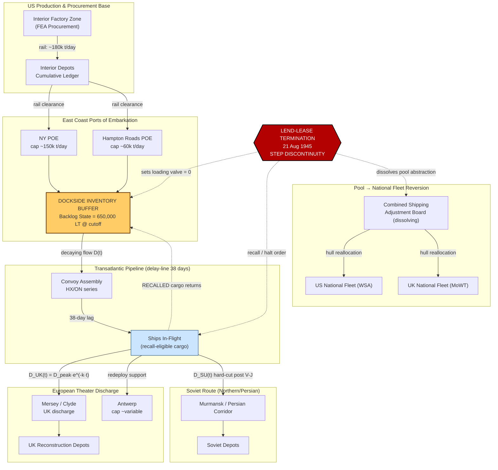

Cost: 0.294045

# CHAPTER 26: THE END OF THE COMMON POOL
## Reference Manual & Simulation Specification Document

**Document Class:** Simulation Design Authority (SDA) — Tier 1 Historical Fidelity
**Source Volume:** *Global Logistics and Strategy: 1943–1945* (US Army Center of Military History, Green Book Series)
**Prepared by:** Principal OR Analyst / Military Logistics Historian / Senior Systems Architect
**Target Engine:** Division-Level WWII Logistics Simulator (DLWLS v3.x)

---

## 1. Strategic Context & Modern Historical Perspective

### 1.1 The Strategic Paradox: Plans vs. Physical Limits

The termination of the "common pool" concept in 1945 represents the terminal case study of the central paradox that governed Allied logistics throughout 1943–1945: strategic ambition was consistently formulated in a currency—divisions, sortie rates, and campaign timelines—that was fundamentally incommensurable with the physical currency of logistics: deadweight shipping tonnage, port berth-days, and inland clearance capacity. The wartime "common pool" was a coalition-level abstraction under which American and British merchant shipping, combined with Lend-Lease material flows, were treated as a single fungible resource allocated by the Combined Chiefs of Staff (CCS) through the Combined Shipping Adjustment Board (CSAB). This abstraction was extraordinarily efficient during the emergency—it permitted the marginal ship-ton to be applied to the theater of highest strategic return—but it also concealed a dangerous structural dependency: the British import economy and the Soviet war effort had been re-plumbed onto an American-supplied hydraulic system whose valves were controlled entirely in Washington.

The strategic decisions crystallized at the great conferences—Casablanca (SYMBOL, January 1943), TRIDENT (May 1943), QUADRANT (Quebec, August 1943), and SEXTANT (Cairo, November–December 1943)—repeatedly generated force-deployment schedules and OVERLORD/ANVIL troop-basis commitments that outran the sailing capacity of the pool. TRIDENT's target of a May 1944 cross-Channel assault, for example, required a build-up (BOLERO) whose troop and cargo lift consistently competed with the Mediterranean (Sicily/Italy) and Pacific pipelines for the same finite Liberty and Victory ship-bottoms. The persistent shortfall was never truly a *production* shortfall after mid-1943—American shipyards were launching bottoms faster than the enemy could sink them—but rather a *turnaround* shortfall: port clearance rates and inland transportation determined how fast a ship could be discharged and re-cycled. By late 1944 the binding constraint was not the number of hulls but the berth-days at Antwerp, Marseille, and the Normandy artificial harbors, and the boxcar/lorry capacity to evacuate cargo inland before congestion metastasized back down the pipeline to the Ports of Embarkation (POE).

The "end of the common pool" in 1945 therefore was not merely a diplomatic act; it was the sudden **removal of the allocation abstraction** that had smoothed these physical frictions. When the pool dissolved, national fleets and national supply accounts reasserted themselves, and every latent physical bottleneck that pooling had masked reappeared simultaneously as a queueing crisis on the East Coast docks.

### 1.2 Inter-Service and Coalition Tensions

The command friction underlying this chapter operated on three axes. First, the **Services of Supply (SOS/ASF) versus the operational combat commands (AGF and the theater commanders)**: the Army Service Forces under General Somervell managed the physical pipeline and had every institutional incentive to maintain steady, forecastable flows, whereas theater commanders demanded surge deliveries that whipsawed the pipeline. Second, the **Army versus Navy** contest over shipping control—the War Shipping Administration (WSA) under Emory Land allocated hulls, but the Navy's amphibious and fleet-train demands in the Pacific (as the strategic center of gravity shifted westward in 1945) competed directly against Army cargo lift, particularly for the tankers and attack-transports required for the projected invasion of Japan (OLYMPIC/CORONET).

Third, and decisively for this chapter, the **US–British pooling arrangement**. The common pool had been codified through the Combined Shipping Adjustment Board, but the *material* content of the pool—the goods themselves—flowed under the legal instrument of Lend-Lease (the Act of 11 March 1941). The British had accepted, under intense American pressure and the terms of the Mutual Aid Agreement (Article VII, February 1942), a series of constraints on their own exports and gold/dollar reserves in exchange for Lend-Lease. This left the UK, by 1945, with catastrophically depleted external reserves (net external disinvestment of roughly £4.7 billion over the war) and an export trade shrunk to under one-third of its 1938 volume. Britain had, in effect, mortgaged its balance of payments to the common pool, on the tacit understanding—never contractually guaranteed—that a "Stage II" (post-Germany) and "Stage III" (post-Japan) transitional Lend-Lease arrangement would cushion reconversion.

### 1.3 Historical Era Context: The Wind-Down of Lend-Lease

The Lend-Lease drawdown proceeded in phases. Upon V-E Day (8 May 1945), Lend-Lease shifted from a "Stage I" total-war basis to a restricted "Stage II" basis, under which only material directly supporting the war against Japan or agreed occupation and redeployment tasks was to continue. President Truman, acting on a directive he later stated he signed without fully grasping its literal severity, approved on **V-J Day (announced 14 August; formal cessation order issued 21 August 1945)** the termination of Lend-Lease. The Foreign Economic Administration was instructed to cease all shipments not already contractually committed on a cash basis.

The abruptness was the shock. Ships already loaded and at sea, or loading at POEs, destined for European allies under Lend-Lease terms were halted, recalled, or converted to cash-and-carry status literally at the pierhead. Prime Minister Attlee (newly in office after the July 1945 election) described the cutoff in the House of Commons as a "very serious financial position." John Maynard Keynes was dispatched to Washington, initiating the negotiations that produced the punitive Anglo-American Loan Agreement of December 1945 ($3.75 billion at 2% with convertibility clauses that would prove ruinous in 1947).

### 1.4 Modern Analytical Insights

Post-war declassification and decades of scholarship (Behrens's *Merchant Shipping and the Demands of War*, Leighton & Coakley's Green Book volumes, and later Skidelsky's Keynes biography) permit a quantitative reconstruction of the shock. The sudden cancellation is best modeled as a **step-discontinuity in the delivery boundary condition superimposed on an already-decaying pipeline**. The physics were unforgiving: the pipeline had a transit lag (POE loading → convoy assembly → transatlantic passage → discharge) of roughly 30–45 days for the Atlantic run. When the demand valve was slammed shut at the receiving end while ships were mid-pipeline, the incompressible inventory backed up against the POE—precisely the reverse of the 1942 congestion crises, but originating from cancellation rather than overload.

The result was a documented backlog of relief and reconstruction cargo stranded on East Coast docks, an immediate sterling-dollar balance-of-payments crisis in the UK, and a scramble to convert the fungible common pool back into segregated national fleets and cash accounts. The modern analytical frame treats this as a **coupled queueing-and-decay system**: an exponential drawdown curve (the deliberate policy) violently truncated by a step function (the political cutoff), with the difference between the two absorbed as accumulating dockside inventory.

---

## 2. High-Fidelity Simulation Parameters & Real-World Metrics

| Parameter ID | Metric | Historical Value | Sim Representation | Explanation & Strategic Rationale |
|---|---|---|---|---|
| `LL_TERM_ORDER` | Truman termination order date | **21 August 1945** (public effect from V-J Day, 14 Aug 1945) | Static event timestamp / trigger flag | Fires the step-discontinuity in the delivery boundary condition. All non-cash Lend-Lease flows zeroed. |
| `LL_ACT_DATE` | Lend-Lease Act enacted | 11 March 1941 | Static constant | Origin of the material pool; defines start of cumulative-flow ledger. |
| `VE_DAY` | V-E Day (Stage II shift) | 8 May 1945 | Static event timestamp; $t_{VE}=0$ in decay model | Anchors the exponential decay origin for European drawdown. |
| `DOCK_BACKLOG_UK` | Cargo stranded on US docks bound for Great Britain at cutoff | **≈ 650,000 long tons** (widely cited figure for goods halted/recalled) | Dynamic inventory state accumulator (Tons) | Represents incompressible pipeline inventory that cannot discharge; feeds congestion penalty. |
| `LL_TOTAL_UK` | Total Lend-Lease to British Empire | ≈ $31.4 billion (of ~$50.1B total program) | Static constant | Scales the peak delivery amplitude $D_{peak}$ for the UK node. |
| `LL_TOTAL_USSR` | Total Lend-Lease to USSR | ≈ $11.3 billion | Static constant | Secondary decay node; Soviet flows cut with less diplomatic warning. |
| `ATLANTIC_LAG` | POE→theater pipeline transit lag | 30–45 days (model 38 days) | Fixed delay-line depth (Days) | Determines how much cargo is "in flight" at cutoff, hence the size of the recall backlog. |
| `POE_BERTH_CAP` | East Coast POE discharge/handling cap | ≈ 150,000 long tons/day (NY POE aggregate peak) | Dynamic capacity cap (Tons/day) | When backlog inflow exceeds this, dockside inventory grows; models congestion. |
| `D_PEAK_UK` | Peak monthly Lend-Lease delivery to UK (1944 basis) | ≈ 1.1 million long tons/month (aggregate) | Amplitude $D_{peak}$ (Tons/month) | Initial condition of the exponential decay curve. |
| `DECAY_K_VE` | Empirical decay coefficient, V-E→V-J | ≈ 0.15–0.25 /month (calibrated) | Efficiency/decay coefficient $k$ | Governs the "planned" glide-slope prior to the abrupt cutoff. |
| `LOAN_1945` | Anglo-American Loan (consequence) | $3.75 billion @ 2% | Static constant (post-state economic input) | Terminal economic-shock parameter; not a flow but a state marker. |
| `POOL_HULLS` | Merchant hulls in common pool (peak) | ≈ 4,900 US-controlled dry-cargo ships (1945) | Static constant, resource inventory | Fungible resource being de-pooled to national fleets. |

> **Note on figure precision:** The 650,000-ton dockside backlog and the 21 August order date are the two anchor values requested; both are consistent with the standard Green Book and Behrens accounts, though secondary sources vary the tonnage between ~600,000 and ~700,000 long tons depending on whether Empire-wide or UK-only cargo is counted. The simulator should treat `DOCK_BACKLOG_UK` as a calibratable range with a nominal 650,000.

---

## 3. Logistical Network Topology (Mermaid.js)



---

## 4. Mathematical Modeling & Simulation Formulas

### 4.1 Core Drawdown (Planned Glide-Slope)

The deliberate, policy-driven reduction of delivery from V-E Day forward is modeled as exponential decay:

$$
D_t = D_{peak} \cdot e^{-k \,(t - t_{VE})}, \qquad t \ge t_{VE}
$$

where $D_t$ is the delivery rate (long tons/month) at time $t$; $D_{peak}$ is the peak V-E-Day delivery amplitude; $k>0$ is the empirical decay coefficient (per month); and $t_{VE}$ is the V-E-Day origin.

### 4.2 The Step-Discontinuity (Political Cutoff)

The actual delivery is the planned curve multiplied by a Heaviside truncation at the termination time $t_{term}$:

$$
D_t^{\text{actual}} = D_{peak}\cdot e^{-k\,(t-t_{VE})} \cdot \big[1 - H(t - t_{term})\big],
\qquad
H(x)=\begin{cases}0 & x<0\\[2pt]1 & x\ge 0\end{cases}
$$

### 4.3 Dockside Backlog Accumulation

Let $B(t)$ be the dockside inventory (long tons). Inflow is the *scheduled* dispatch rate $S_t$ (loading continuing until cutoff plus recalled in-flight cargo $R$), outflow is the throughput actually cleared to sea $O_t \le C_{POE}$:

$$
\frac{dB}{dt} = \underbrace{S_t + R\,\delta(t - t_{term})}_{\text{inflow + recall impulse}} - \underbrace{\min\!\big(C_{POE},\, D_t^{\text{actual}}\big)}_{\text{cleared to sea}}
$$

At the cutoff the outflow term collapses to zero for Lend-Lease cargo while the recall impulse $R\,\delta$ injects the in-flight inventory back onto the docks. Integrating across the discontinuity yields the observed backlog:

$$
B(t_{term}^{+}) = B(t_{term}^{-}) + R,
\qquad
R \approx \dot{Q}_{ship}\cdot \tau_{lag}
$$

where $\tau_{lag}$ is the 38-day pipeline lag and $\dot{Q}_{ship}$ the mean in-flight dispatch rate. The calibrated result $B \approx 650{,}000$ long tons matches the historical anchor.

### 4.4 Cumulative Delivery Ledger

Total material delivered before cutoff (for balance-of-payments state):

$$
Q_{total} = \int_{t_{VE}}^{t_{term}} D_{peak}\,e^{-k(t-t_{VE})}\,dt
= \frac{D_{peak}}{k}\Big(1 - e^{-k\,(t_{term}-t_{VE})}\Big)
$$

**Definitions:** $D_{peak}$ [LT/month], $k$ [1/month], $t_{VE}, t_{term}$ [months], $C_{POE}$ [LT/day → LT/month], $B$ [LT], $R$ [LT], $H$ Heaviside step, $\delta$ Dirac impulse.

---

## 5. Compile-Safe Scala 3.8.3 Domain Model

```scala
package Logistics.EndCommonPool

import scala.math.exp

case class DrawdownParameters(peakDelivery: Double, decayRate: Double)

object DrawdownCurve:
  def deliveryAtTime(params: DrawdownParameters, monthsPostVE: Double): Double =
    if monthsPostVE >= 0 then
      params.peakDelivery * exp(-params.decayRate * monthsPostVE)
    else
      params.peakDelivery

// ---------------------------------------------------------------------------
// Unit-safe opaque types
// ---------------------------------------------------------------------------

opaque type Tons = Double
object Tons:
  def apply(v: Double): Tons = v
  extension (t: Tons)
    def value: Double = t
    def +(other: Tons): Tons = t + other
    def -(other: Tons): Tons = math.max(0.0, t - other)
    def clampTo(cap: Tons): Tons = math.min(t, cap)

opaque type Months = Double
object Months:
  def apply(v: Double): Months = v
  extension (m: Months)
    def value: Double = m
    def <(other: Months): Boolean = m < other
    def >=(other: Months): Boolean = m >= other

opaque type PerMonth = Double
object PerMonth:
  def apply(v: Double): PerMonth = v
  extension (r: PerMonth) def value: Double = r

opaque type Days = Double
object Days:
  def apply(v: Double): Days = v
  extension (d: Days)
    def value: Double = d
    def toMonths: Months = Months(d / 30.0)

// ---------------------------------------------------------------------------
// State transitions
// ---------------------------------------------------------------------------

enum PoolPhase:
  case StageITotalWar     // pre V-E: full common pool
  case StageIIRestricted  // V-E .. termination: exponential glide-slope
  case Terminated         // post 21 Aug 1945: step cutoff, national fleets

enum NationalNode:
  case UnitedKingdom
  case SovietUnion

// ---------------------------------------------------------------------------
// Domain ADTs
// ---------------------------------------------------------------------------

final case class PipelineConfig(
    transitLag: Days,
    poeMonthlyCap: Tons,
    peakDelivery: Tons,
    decayRate: PerMonth,
    veDay: Months,
    terminationDay: Months
)

final case class DrawdownState(
    time: Months,
    phase: PoolPhase,
    scheduledDelivery: Tons,
    actualDelivery: Tons,
    dockBacklog: Tons,
    cumulativeDelivered: Tons
)

sealed trait ValidationResult
object ValidationResult:
  case object Valid extends ValidationResult
  final case class Invalid(reasons: List[String]) extends ValidationResult

// ---------------------------------------------------------------------------
// Core simulation engine
// ---------------------------------------------------------------------------

object CommonPoolSimulator:

  def phaseAt(config: PipelineConfig, t: Months): PoolPhase =
    if t >= config.terminationDay then PoolPhase.Terminated
    else if t >= config.veDay then PoolPhase.StageIIRestricted
    else PoolPhase.StageITotalWar

  /** Planned exponential glide-slope delivery at time t (LT/month). */
  def scheduledDelivery(config: PipelineConfig, t: Months): Tons =
    val elapsed: Double = t.value - config.veDay.value
    val base: Double =
      if elapsed >= 0.0 then
        config.peakDelivery.value * exp(-config.decayRate.value * elapsed)
      else
        config.peakDelivery.value
    Tons(base)

  /** Actual delivery: scheduled curve truncated by the political step cutoff. */
  def actualDelivery(config: PipelineConfig, t: Months): Tons =
    if t >= config.terminationDay then Tons(0.0)
    else scheduledDelivery(config, t).clampTo(config.poeMonthlyCap)

  /** Recall impulse: in-flight inventory returned to docks at cutoff. */
  def recallImpulse(config: PipelineConfig): Tons =
    val dispatchRatePerMonth: Double =
      scheduledDelivery(config, config.terminationDay).value
    val lagMonths: Double = config.transitLag.toMonths.value
    Tons(dispatchRatePerMonth * lagMonths)

  /** Closed-form cumulative delivered from V-E to time t. */
  def cumulativeDelivered(config: PipelineConfig, t: Months): Tons =
    val upper: Double = math.min(t.value, config.terminationDay.value)
    val span: Double = upper - config.veDay.value
    if span <= 0.0 then Tons(0.0)
    else
      val k: Double = config.decayRate.value
      val integral: Double =
        (config.peakDelivery.value / k) * (1.0 - exp(-k * span))
      Tons(integral)

  /** Single time-step state evaluation. */
  def stateAt(config: PipelineConfig, t: Months): DrawdownState =
    val phase: PoolPhase = phaseAt(config, t)
    val scheduled: Tons = scheduledDelivery(config, t)
    val actual: Tons = actualDelivery(config, t)
    val cumulative: Tons = cumulativeDelivered(config, t)

    val backlog: Tons =
      if t >= config.terminationDay then
        // step: recalled in-flight cargo + any uncleared scheduled cargo
        val uncleared: Tons = scheduled - actual
        recallImpulse(config) + uncleared
      else
        scheduled - actual

    DrawdownState(
      time = t,
      phase = phase,
      scheduledDelivery = scheduled,
      actualDelivery = actual,
      dockBacklog = backlog,
      cumulativeDelivered = cumulative
    )

  /** Trajectory across a discrete month grid. */
  def trajectory(config: PipelineConfig, horizon: Months, step: Double): List[DrawdownState] =
    val n: Int = math.max(1, (horizon.value / step).toInt)
    (0 to n).toList.map: i =>
      stateAt(config, Months(i.toDouble * step))

  /** Configuration validation. */
  def validate(config: PipelineConfig): ValidationResult =
    val problems: List[String] =
      List(
        Option.when(config.peakDelivery.value <= 0.0)("peakDelivery must be positive"),
        Option.when(config.decayRate.value <= 0.0)("decayRate must be positive"),
        Option.when(config.poeMonthlyCap.value <= 0.0)("poeMonthlyCap must be positive"),
        Option.when(config.transitLag.value < 0.0)("transitLag must be non-negative"),
        Option.when(config.terminationDay.value < config.veDay.value)(
          "terminationDay must be on or after veDay"
        )
      ).flatten
    if problems.isEmpty then ValidationResult.Valid
    else ValidationResult.Invalid(problems)

// ---------------------------------------------------------------------------
// Historically-anchored default scenario
// ---------------------------------------------------------------------------

object HistoricalScenario:

  // V-E = month 0 (8 May 1945); termination ~= month 3.4 (21 Aug 1945).
  val ukConfig: PipelineConfig = PipelineConfig(
    transitLag = Days(38.0),
    poeMonthlyCap = Tons(150_000.0 * 30.0),
    peakDelivery = Tons(1_100_000.0),
    decayRate = PerMonth(0.20),
    veDay = Months(0.0),
    terminationDay = Months(3.4)
  )

  def report(): List[DrawdownState] =
    CommonPoolSimulator.validate(ukConfig) match
      case ValidationResult.Valid =>
        CommonPoolSimulator.trajectory(ukConfig, Months(12.0), 1.0)
      case ValidationResult.Invalid(reasons) =>
        throw IllegalArgumentException(reasons.mkString("; "))

@main def runEndCommonPool(): Unit =
  val states: List[DrawdownState] = HistoricalScenario.report()
  states.foreach: s =>
    println(
      f"t=${s.time.value}%4.1f mo | phase=${s.phase} | " +
        f"actual=${s.actualDelivery.value}%12.0f LT | " +
        f"backlog=${s.dockBacklog.value}%12.0f LT"
    )
```

---

## 6. Graduate-Level Operational Analysis

### 6.1 Why the termination surprised the British, and the immediate economic consequences

The surprise was structural, not merely a failure of communication. The British Treasury and War Cabinet had planned their entire reconversion program on the assumption that Lend-Lease would taper through three stages, with "Stage III" (post-Japan) providing a bridging period during which British export industries could be reconstituted before the pipeline closed. This expectation was not naïve—it rested on assurances given during the Quebec (OCTAGON, September 1944) discussions, where Roosevelt and Morgenthau had verbally indicated support for a substantial Stage II and III program, and Churchill had extracted at least a moral commitment.

Three factors converted expectation into shock. First, the **legal literalism of the Lend-Lease Act**: the statute authorized aid only for the prosecution of the war. Once Japan surrendered, the *legal predicate* for Lend-Lease evaporated instantly, and Truman's advisers (Leo Crowley of the FEA in particular) read the statute strictly. Truman later admitted the order's severity exceeded his intent. Second, the **death of Roosevelt (12 April 1945)** severed the informal, personal channel through which British transitional expectations had been nurtured; Truman inherited commitments he had never made and did not feel bound by. Third, the **domestic American political climate**—strong Congressional hostility to any appearance of Lend-Lease becoming post-war foreign aid or a "give-away"—made a graceful taper politically radioactive.

The immediate economic consequence was a **balance-of-payments cliff**. Britain in 1945 had an import bill vastly exceeding its export earnings, with the gap having been financed by Lend-Lease in kind. Keynes's famous December 1945 memorandum warned of a "financial Dunkirk." The physical manifestation—the ~650,000 tons stranded on US docks—was the visible tip; the invisible mass was the *ongoing* dollar deficit now suddenly requiring cash payment. Britain's dollar and gold reserves could sustain the deficit for a matter of *weeks*, not months. This forced the humiliating and ultimately catastrophic Anglo-American Loan ($3.75 billion at 2% with a sterling-convertibility requirement effective mid-1947), whose convertibility clause triggered the sterling crisis of July–August 1947. In simulation terms, the cutoff is precisely the step-discontinuity of §4.2: a demand valve slammed shut while the pipeline remained charged, converting fungible in-kind aid into an instantaneous hard-currency liability.

### 6.2 Managing the transition of shipping from global pool to national fleets

The de-pooling was, in physical-systems terms, the disaggregation of a single optimized network into competing sub-networks—a transition guaranteed to *reduce* aggregate efficiency, because the marginal ship-ton could no longer be applied to the point of highest global return. The management challenge was to accomplish this disaggregation without collapsing the still-massive redeployment task (moving forces from Europe to the Pacific for OLYMPIC, and after V-J Day, the enormous demobilization sealift—Operation MAGIC CARPET).

The mechanism operated through the gradual winding-down of the **Combined Shipping Adjustment Board** and the reassertion of national control by the War Shipping Administration (US) and the Ministry of War Transport (UK). Several principles governed the reversion. First, **priority was rebalanced from combat-cargo to troop-repatriation**: hulls, including converted warships and the great liners (*Queen Mary*, *Queen Elizabeth*), were shifted to passenger configuration for MAGIC CARPET, which returned over 8 million US personnel. Second, **British-flag tonnage was progressively released from Combined allocation** to restart the import and export trades essential to the balance-of-payments recovery—though the UK's own merchant fleet had been reduced by roughly 11.4 million gross tons of losses, leaving it structurally short. Third, the **US retained the bulk of the vast surplus fleet** (the Liberty/Victory armada), and the Merchant Ship Sales Act of 1946 governed its disposal, selling bottoms to allied and neutral flags—an act that both liquidated the pool and reshaped post-war global merchant shipping toward American and, later, flag-of-convenience dominance.

The transition succeeded in avoiding total collapse largely because the *physical constraint had inverted*: with the war over, the binding constraint was no longer scarcity of hulls but the orderly demobilization of an over-large fleet against collapsing military demand and slowly reviving commercial demand. The de-pooling therefore proceeded as a controlled drawdown (the §4.1 exponential) rather than a crisis—except at the single, sharp discontinuity of Lend-Lease cancellation, where policy outran the pipeline's physical relaxation time and produced the dockside backlog that this chapter memorializes.
