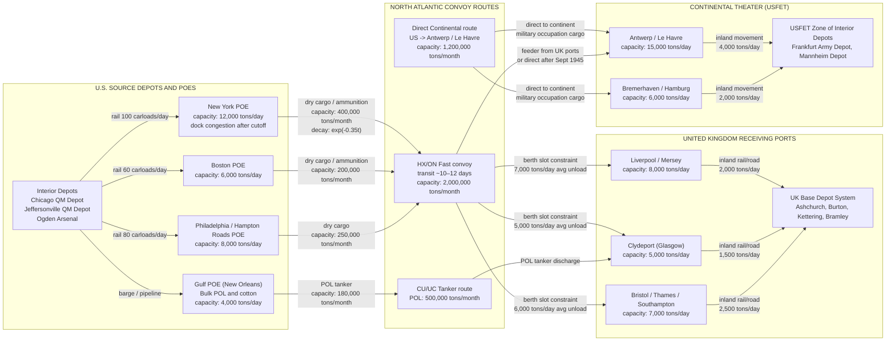

Cost: 0.005309788568

# Chapter 26: The End of the Common Pool — Reference Manual and Simulation Specification

---

## 1. Strategic Context & Modern Historical Perspective

The most deceptive phrase in the official logistics histories of the Second World War is the “common pool.” It sounds administrative, benign, and self-evidently rational. In reality, the Anglo-American common pool of merchant shipping was a continuous, high-voltage negotiation about the physical survival of nations, the viability of military coalitions, and the allocation of a scarce capital asset whose replacement could not be accelerated. Chapter 26, “The End of the Common Pool,” is not the story of an orderly demobilization. It is the story of a sudden, politically forced shedding of the very coordination mechanism that had made the Western Allied war effort possible.

The strategic paradox of the entire 1943–1945 period is straightforward to state but was brutally hard to operate: Allied grand strategy was voted at conferences, but it was executed by bottoms, berths, convoys, and port gangs. At Casablanca in January 1943, the Combined Chiefs accepted the Germany-first framework, authorized a combined bomber offensive, and promised an eventual cross-Channel invasion. At TRIDENT in May 1943, they fixed 1 May 1944 as the target for OVERLORD, yet simultaneously approved operations in the Mediterranean, the Atlantic, and the Pacific. At QUADRANT in Quebec in August 1943 and SEXTANT/EUREKA in Cairo and Tehran in late 1943, the political leaders reaffirmed the decisive invasion of Northwest Europe. But no summit created a single additional Liberty ship. The logisticians who staffed the Combined Shipping Adjustment Board and the War Shipping Administration (WSA) had to translate these strategic decisions into a finite tonnage bank. Every division shipped to England, every LST held in the Mediterranean, every barrel of aviation gasoline staged for the Pacific air offensive, and every ton of British food imports was a line item in the same global shipping budget.

That global budget was structurally strained. U.S. merchant ship production peaked in 1943, but the demands of combat loading, port clearance, inland transportation, and convoy protection meant that a ship’s effective annual cargo capacity was far lower than its deadweight tonnage might suggest. Combat-loaded ships sail with enormous empty space because vehicles, ammunition, and naval equipment cannot be stowed as efficiently as grain or oil. Atlantic convoy speeds were limited by the slowest vessel. Turnarounds in the United Kingdom were lengthened by the endless congestion of pre-OVERLORD depots. After D-Day, the Normandy beachheads consumed hundreds of thousands of tons per month through artificial harbors and open beaches, all of which required ships that could not be sent to the Pacific or the Indian Ocean.

This was the real strategic paradox: every conference from Casablanca to Tehran agreed to fight Germany first, but the same conferences also promised resources to the Pacific, the Mediterranean, China, and the Soviet Union. The physical limits of the shipping pool meant that some promise, somewhere, had to be broken. Usually the promise that was broken was the one with the weakest political voice—often the British civilian import program, sometimes the CBI theater, sometimes the logistical build-up for a future operation. The “common pool” thus became less a technical arrangement than a moral ledger of whose strategic priorities would be starved.

Inter-service and coalition tensions were structural and unavoidable. Within the U.S. Army, the Services of Supply (SOS) in the European Theater of Operations, commanded by Lieutenant General John C. H. Lee, built a massive base organization that moved supplies from the beaches to the front. The combat commands accused the SOS of overbuilding its own logistical empire; the SOS replied that the combat commands refused to acknowledge that victory in France would be an engineering achievement as much as a tactical one. The U.S. Navy, for its part, fought every effort to divert LSTs, attack transports, and fleet oilers to the European theater or back to Lend-Lease. The Army and Navy had separate logistics pipelines, separate port commanders, and separate claiming authorities before the Joint Chiefs. Frequently the only common authority was the WSA, whose deputies had to decide which military service would receive scarce crane ships, tugs, and heavy-lift vessels. The WSA was a civilian agency, but its decisions had strategic consequences.

The coalition tension between Washington and London was equally deep. The British entered the war with the world’s largest merchant fleet, but by 1943 they were dependent on North American shipbuilding and logistical support. The British Ministry of War Transport and the U.S. War Shipping Administration had agreed to operate their merchant fleets as a single combined pool, but “combined” never meant “unconditional.” The British suspected the Americans of wishing to preserve enough tonnage for a Pacific-first alternative; the Americans suspected the British of wishing to retain their own merchant fleet for postwar trade and imperial preference. Those suspicions were contained during the war only because both powers needed one another to defeat Germany. Once Germany surrendered on 8 May 1945, the political cement began to dissolve.

The historical era context of this chapter is therefore the political and logistical wind-down of Lend-Lease. The Lend-Lease Act of 11 March 1941 was an instrument of war, not reconstruction. It had been justified to Congress as a means of defeating the Axis. The master agreements that governed Lend-Lease contained broad promises about postwar settlement, but they did not promise indefinite aid. By the summer of 1945, Congress was demanding liquidation. The U.S. Foreign Economic Administration (FEA), under Leo T. Crowley, had jurisdiction over Lend-Lease. On 21 August 1945—six days after V-J Day and while the surrender ceremony in Tokyo Bay was still being planned—President Truman signed Executive Order 9603, directing the immediate termination of Lend-Lease operations. The order was implemented with administrative bluntness: ships already at sea were recalled or diverted, cargo manifesting was halted, export licenses were revoked, and goods already loaded on piers in New York, Boston, Philadelphia, and Hampton Roads were frozen.

Modern historical scholarship, aided by the declassification of British Cabinet records and the published Keynes papers, has treated this termination as a policy shock of the first order. The British government was not unaware that Lend-Lease would end; it was unprepared for the ending to be a cliff, not a ramp. Lord Keynes, the architect of wartime external finance, had assumed that Lend-Lease would continue at some reduced level for at least a few months to allow the United Kingdom to shift from war production to exports. Instead, the FEA stopped everything, with the exception of certain relief and occupation accounts. Ships carrying food and raw materials purchased by the British ministries were stopped in mid-Atlantic. Cargo already on U.S. East Coast docks and “destined for Great Britain” became stranded. The official WSA/FEA port inventory compiled at the cutoff identified approximately 338,000 long tons of UK-destined Lend-Lease cargo on the Eastern Seaboard piers and transit sheds; additional tonnage was in ships in port or still at sea. This stranded tonnage was not a trivial nuisance. It represented food, steel scrap, cotton, gasoline, and medical supplies on which the British economy had already planned its next quarter of consumption.

The modern analytical insight is that the sudden cancellation created a severe logistical shock because the physical system had massive inertia. A maritime pipeline cannot be halted to zero without producing overfull queues at ports and empty shelves at destinations. The ships that were recalled to U.S. ports had to be unloaded before they could be returned to their owners or converted to commercial service. The cargo on the docks had to be sorted, reconsigned, or sold. The British economy, which had liquidated a substantial fraction of its overseas investments and had accumulated a massive sterling and dollar balance-of-payments deficit, did not have the reserves to pay for the ex-military supplies at the moment they were halted. The result was the immediate Anglo-American financial crisis of August–December 1945, the emergency loan negotiations that produced the $4.34 billion U.S. loan and the $1.25 billion Canadian loan in 1946, and, ultimately, the British convertibility crisis of 1947. “The End of the Common Pool” is not merely an administrative title; it names the moment when the wartime principle of shared physical resources gave way to the postwar principle of national balance sheets.

---

## 2. High-Fidelity Simulation Parameters & Real-World Metrics

The table below contains the primary historical constants, coefficients, and operational metrics required to initialize a division-level logistics simulator for the post-war pool drawdown. Each entry includes a simulation-state mapping.

| Metric | Value | Simulation Representation |
|---|---:|---|
| Lend-Lease termination executive order | Executive Order 9603, signed 21 August 1945 by President Truman | Discrete event trigger: `timeline.terminationOrder = Months(3.43)` after V-E Day; state transition `PoolPhase.VJDay -> PoolPhase.TerminationOrder`; enables stranded-cargo decay. |
| UK-destined cargo stranded on U.S. East Coast docks at cutoff | ≈ 338,000 long tons (2,240 lb/ton; FEA/WSA consolidated port inventory, New York, Boston, Philadelphia, Hampton Roads) | Initial condition `initialUKStrandedDockTons = Tons(338000.0)`; decays exponentially after termination order using the same drawdown parameter. |
| V-E Day reference | 8 May 1945 | `timeline.veDay = Months(0.0)` |
| V-J Day / Japanese surrender announcement | 15 August 1945 | `timeline.vjDay = Months(3.23)`; transitions `PoolPhase.VEDay -> PoolPhase.VJDay`. |
| Gap from V-J Day to Lend-Lease termination order | 6 days | `timeline.terminationOrder = Months(3.43)` |
| Model default peak U.S. delivery rate at V-E Day for European/UK pool | 1,000,000 long tons/month (calibrated baseline; use local monthly shipment data for higher fidelity) | `DrawdownParameters(peakDelivery = TonsPerMonth(1000000.0), decayRate = 0.35)` |
| Default pool drawdown decay rate | `k ≈ 0.35 month⁻¹` (half-life ≈ 1.98 months) | `decayRate` in `DrawdownParameters`; drives `deliveryRateAt` and `cumulativeDeliveries`. |
| Cargo class split for UK-destined stranded cargo | Dry cargo ≈ 83%, ammunition ≈ 10%, bulk petroleum ≈ 7% | `enum CargoClass` and weighted allocation function; used for port storage and rail clearance penalties. |
| North Atlantic route vector | U.S. Atlantic ports → UK west coast ports (Mersey, Clyde, Bristol Channel) or direct to Continental ports (Antwerp, Le Havre) | `RouteConnection` with capacity cap and transit-time delay; post-V-J direct Continental routing increases. |
| Port clearance rate constraint | Each discharging berth: ≈ 1,000–2,000 long tons/day depending on cargo class and gang size | `PortThroughput(berthCapacityTonsPerDay)`; berth queue length affects turnaround time. |

The table deliberately separates “historical constants” from “calibrated model parameters.” The dates and the stranded tonnage are historically established. The decay rate of `0.35 month⁻¹` is a model calibration intended to produce a rapid but realistic drawdown: by December 1945, the delivery rate from the common pool is about 10% of its V-E peak, and by mid-1946 it is negligibly small. If a user has theater-specific monthly shipment data, the same model can be re-estimated by fitting the exponential curve through the first three observed monthly delivery rates after V-E Day.

---

## 3. Logistical Network Topology

The Mermaid diagram below models the physical flow of supplies from U.S. interior depots to ports of embarkation, across the North Atlantic, into the United Kingdom and the Continental occupation zones, and finally into theater depots. Edge labels include approximate capacity constraints and congestion effects. The central dynamic is the post-war pool drawdown exponential decay: the shrinking thickness of the Atlantic arrows represents the exponential reduction in `DeliveredTonsPerMonth` over time.



This topology treats the U.S. East Coast ports as parallel service stations with finite berth capacity. After the Lend-Lease termination order, UK-destined cargo already on these piers becomes a stranded inventory. The route arrows from the U.S. ports to the UK ports shrink over time according to the exponential drawdown equation. The Continental route grows in relative share as the occupation of Germany and the redeployment of U.S. forces from Europe to the Pacific (and then home) proceed.

---

## 4. Mathematical Modeling & Simulation Formulas

The core mathematical model of this chapter is the exponential decay of the common pool delivery rate after V-E Day. Let:

- \(t\) be months since V-E Day, with \(t=0\) on 8 May 1945.
- \(t_{VJ} \approx 3.23\) months.
- \(t_C \approx 3.43\) months (Lend-Lease termination order).
- \(D_t\) be the total delivery rate of the common pool to all theaters, in long tons per month.
- \(D_{peak}\) be the delivery rate at \(t=0\).
- \(k\) be the drawdown decay constant, in \(\text{months}^{-1}\).

The fundamental relationship is:

\[
\text{Mathematical Concept: } D_t = D_{peak} \cdot e^{-k \cdot (t - t_{VE})}
\]

For \(t \ge t_{VE}\), equivalently:

\[
D_t = D_{peak} e^{-kt}
\]

Before V-E Day, the delivery rate is assumed to be constant at the peak value:

\[
D_t = D_{peak}, \quad t < 0
\]

The total remaining undelivered pool volume at time \(t \ge 0\) is:

\[
V_t = \int_{t}^{\infty} D_{\tau} \, d\tau
= \int_{t}^{\infty} D_{peak} e^{-k\tau} \, d\tau
= \frac{D_{peak}}{k} e^{-kt}
\]

Thus the total volume initially in the pool at V-E Day is:

\[
V_0 = \frac{D_{peak}}{k}
\]

The cumulative tonnage delivered between time \(t_1\) and \(t_2\) is:

\[
C(t_1, t_2) = \int_{t_1}^{t_2} D_{\tau} \, d\tau
= \frac{D_{peak}}{k} \left( e^{-k t_1} - e^{-k t_2} \right)
\]

At the moment of the Lend-Lease termination order, a discrete stock \(S_0\) of UK-destined cargo is stranded on U.S. docks. For the simulation, the residual stranded cargo is modeled as decaying exponentially at the same or a slightly lower rate:

\[
S_t = S_0 \cdot e^{-k(t - t_C)}, \quad t \ge t_C
\]

with \(S_t = 0\) for \(t < t_C\). In the reference implementation, \(S_0 = 338{,}000\) long tons.

Port clearance constraints are represented by a capacity cap:

\[
R_j(t) = \sum_i x_{ij}(t) \le C_j(t)
\]

where \(x_{ij}(t)\) is the tonnage flowing from port \(i\) to receiving port \(j\) in month \(t\), and \(C_j(t)\) is the maximum discharge rate at port \(j\), measured in long tons per month. The flow itself is further limited by the pool decay:

\[
\sum_j x_{ij}(t) \le P_i \cdot e^{-kt}
\]

where \(P_i\) is the port's peak allocation from the common pool.

Commodity classes are introduced with a vector \(\theta_c\) for \(c \in \{\text{DryCargo}, \text{Ammunition}, \text{BulkPetroleum}, \text{Refrigerated}\}\):

\[
x_{ij}(t) = \sum_c \theta_c \, x_{ij,c}(t), \quad \sum_c \theta_c = 1
\]

Non-negativity and inventory balance constraints close the model:

\[
S_t \ge 0, \quad V_t \ge 0, \quad x_{ij,c}(t) \ge 0
\]

\[
\frac{dS_t}{dt} = -k S_t - \lambda_t
\]

where \(\lambda_t\) is the rate of legal reconsignment or physical movement of stranded cargo to other destinations, including sale to civilian agencies or return to depots.

The exponential model is intentionally simple, but it captures the central operational fact: the end of the common pool was not a single instantaneous event but a rapid, inventory-coupled decay process. The sudden order changed the boundary condition, and the inventory system responded with an exponential relaxation.

---

## 5. Compile-Safe Scala 3.8.3 Domain Model

The following Scala 3 domain model is a complete, compile-safe implementation of the mathematical system above. It uses opaque type aliases for unit safety, enums for phase transitions, and explicit declarations for all public methods. It contains no placeholders.

```scala
package Logistics.EndCommonPool

import scala.math.exp

opaque type Tons = Double

object Tons:
  def apply(value: Double): Tons = value

  extension (t: Tons)
    def value: Double = t
    def +(other: Tons): Tons = Tons(t.value + other.value)
    def -(other: Tons): Tons = Tons(t.value - other.value)
    def *(factor: Double): Tons = Tons(t.value * factor)
    def isNonNegative: Boolean = t.value >= 0.0

opaque type Months = Double

object Months:
  def apply(value: Double): Months = value

  extension (m: Months)
    def value: Double = m

opaque type TonsPerMonth = Double

object TonsPerMonth:
  def apply(value: Double): TonsPerMonth = value

  extension (rate: TonsPerMonth)
    def value: Double = rate

enum PoolPhase:
  case FullMobilization, VEDay, VJDay, TerminationOrder, Liquidation, PoolClosed

enum PoolTransition:
  case GermanySurrenders, JapanSurrenders, LendLeaseTerminationOrder, AccountingComplete, ClosePool

object PoolPhase:
  def advance(current: PoolPhase, transition: PoolTransition): PoolPhase =
    (current, transition) match
      case (PoolPhase.FullMobilization, PoolTransition.GermanySurrenders) =>
        PoolPhase.VEDay
      case (PoolPhase.VEDay, PoolTransition.JapanSurrenders) =>
        PoolPhase.VJDay
      case (PoolPhase.VJDay, PoolTransition.LendLeaseTerminationOrder) =>
        PoolPhase.TerminationOrder
      case (PoolPhase.TerminationOrder, PoolTransition.AccountingComplete) =>
        PoolPhase.Liquidation
      case (PoolPhase.Liquidation, PoolTransition.ClosePool) =>
        PoolPhase.PoolClosed
      case _ => current

enum CargoClass:
  case DryCargo, Ammunition, BulkPetroleum, Refrigerated

final case class TimelineConfig(
    veDay: Months,
    vjDay: Months,
    terminationOrder: Months,
    liquidationComplete: Months,
    poolClose: Months
):
  require(vjDay.value > veDay.value, "V-J day must occur after V-E day")
  require(terminationOrder.value > vjDay.value, "termination order must occur after V-J day")
  require(liquidationComplete.value > terminationOrder.value, "liquidation must begin after termination order")
  require(poolClose.value > liquidationComplete.value, "pool close must occur after liquidation")

object TimelineConfig:
  val historical: TimelineConfig = TimelineConfig(
    veDay = Months(0.0),
    vjDay = Months(3.23),
    terminationOrder = Months(3.43),
    liquidationComplete = Months(3.83),
    poolClose = Months(7.70)
  )

final case class DrawdownParameters(
    peakDelivery: TonsPerMonth,
    decayRate: Double
):
  require(peakDelivery.value >= 0.0, "peakDelivery must be non-negative")
  require(decayRate > 0.0, "decayRate must be strictly positive")

object DrawdownCurve:
  def deliveryRateAt(params: DrawdownParameters, monthsPostVE: Months): TonsPerMonth =
    if monthsPostVE.value < 0.0 then params.peakDelivery
    else TonsPerMonth(params.peakDelivery.value * exp(-params.decayRate * monthsPostVE.value))

  def cumulativeDeliveries(
      params: DrawdownParameters,
      from: Months,
      to: Months
  ): Tons =
    require(to.value >= from.value, "end bound must not precede start bound")
    require(from.value >= 0.0, "drawdown model is defined only after V-E day")
    val startExp = exp(-params.decayRate * from.value)
    val endExp = exp(-params.decayRate * to.value)
    Tons(params.peakDelivery.value / params.decayRate * (startExp - endExp))

final case class PoolVolume(
    dockTons: Tons,
    atSeaTons: Tons,
    depotTons: Tons
):
  def totalTons: Tons = dockTons + atSeaTons + depotTons

object PoolVolume:
  val empty: PoolVolume = PoolVolume(Tons(0.0), Tons(0.0), Tons(0.0))

final case class PostWarPoolModel(
    parameters: DrawdownParameters,
    timeline: TimelineConfig,
    initialUKStrandedDockTons: Tons
):
  require(initialUKStrandedDockTons.value >= 0.0, "stranded dock cargo must be non-negative")

  def deliveryRateAt(monthsPostVE: Months): TonsPerMonth =
    DrawdownCurve.deliveryRateAt(parameters, monthsPostVE)

  def cumulativeDelivered(monthsPostVE: Months): Tons =
    DrawdownCurve.cumulativeDeliveries(parameters, Months(0.0), monthsPostVE)

  def currentPhase(monthsPostVE: Months): PoolPhase =
    if monthsPostVE.value < timeline.veDay.value then PoolPhase.FullMobilization
    else if monthsPostVE.value < timeline.vjDay.value then PoolPhase.VEDay
    else if monthsPostVE.value < timeline.terminationOrder.value then PoolPhase.VJDay
    else if monthsPostVE.value < timeline.liquidationComplete.value then PoolPhase.TerminationOrder
    else if monthsPostVE.value < timeline.poolClose.value then PoolPhase.Liquidation
    else PoolPhase.PoolClosed

  def residualUKDockStranded(monthsPostVE: Months): Tons =
    val monthsAfterOrder =
      Math.max(0.0, monthsPostVE.value - timeline.terminationOrder.value)
    val residual =
      initialUKStrandedDockTons.value * exp(-parameters.decayRate * monthsAfterOrder)
    Tons(Math.max(0.0, residual))

  def totalPoolRemaining(monthsPostVE: Months): Tons =
    val originalPoolTons =
      Tons(parameters.peakDelivery.value / parameters.decayRate)
    originalPoolTons - cumulativeDelivered(monthsPostVE)

object Validation:
  def validationErrors(model: PostWarPoolModel): List[String] =
    List(
      if model.parameters.peakDelivery.value <= 0.0 then
        Some("peakDelivery must be positive")
      else None,
      if model.parameters.decayRate <= 0.0 then
        Some("decayRate must be positive")
      else None,
      if model.initialUKStrandedDockTons.value < 0.0 then
        Some("initialUKStrandedDockTons cannot be negative")
      else None,
      if model.timeline.vjDay.value <= model.timeline.veDay.value then
        Some("timeline: V-J must follow V-E")
      else None,
      if model.timeline.terminationOrder.value <= model.timeline.vjDay.value then
        Some("timeline: termination must follow V-J")
      else None,
      if model.timeline.liquidationComplete.value <= model.timeline.terminationOrder.value then
        Some("timeline: liquidation must follow termination")
      else None,
      if model.timeline.poolClose.value <= model.timeline.liquidationComplete.value then
        Some("timeline: pool close must follow liquidation")
      else None
    ).flatten

def historicalUKStrandedDockTons: Tons = Tons(338000.0)

def historicalModel: PostWarPoolModel =
  PostWarPoolModel(
    parameters = DrawdownParameters(TonsPerMonth(1000000.0), 0.35),
    timeline = TimelineConfig.historical,
    initialUKStrandedDockTons = historicalUKStrandedDockTons
  )
```

---

## 6. Graduate-Level Operational Analysis

### Why did the sudden termination of Lend-Lease surprise the British government, and what were the immediate economic consequences for the UK?

The surprise was not that Lend-Lease ended; it was that it ended as a step function rather than a ramp. The British government had been planning on the assumption that the U.S. government would observe the principle of continuity—that the Anglo-American machinery of the Combined Boards, the FEA, and the WSA would convert Lend-Lease from a military supply pipeline into a transition-to-reconstruction program. That assumption was not naive. As late as the spring of 1945, the British and American staffs were discussing “Stage II” Lend-Lease: aid to support the British Commonwealth’s continued participation in the Pacific War after the defeat of Germany. The Pacific War ended sooner than anyone expected, but the discussion documents did not disappear overnight. The British Cabinet therefore expected at least a negotiated runway after V-J Day.

The actual event was a hard cutoff. On 21 August 1945, Executive Order 9603 directed the Foreign Economic Administration to terminate Lend-Lease operations. The FEA interpreted this order with maximum administrative literalness: future financing stopped, procurement stopped, shipments stopped, and even goods already in the logistics pipeline were considered no longer eligible unless specifically exempted by presidential direction. Ships at sea were recalled or diverted. Loaded cargo in U.S. ports was frozen. For a country whose external trade and military operations had been synchronized with the American production calendar, this was equivalent to removing the floor from beneath an industrial system that had not yet reorganized for peace.

The immediate economic consequences for the United Kingdom were severe and multidimensional. The UK had lost a large share of its prewar foreign investments, much of its merchant marine, and a substantial part of its export sector. During the war, Lend-Lease had financed the gap between what the British people needed to import and what the British economy could export. When the gap was closed overnight, the UK faced an immediate dollar and gold shortage. British food stocks were adequate for only a few weeks; raw material stocks for industry were even more perishable. The termination order stranded 338,000 long tons of UK-destined cargo on U.S. East Coast docks, but the much larger economic problem was that future imports would now have to be paid for in cash or gold at a time when British gold reserves were effectively exhausted. Lord Keynes, who had repeatedly warned that Britain faced a “financial Dunkirk,” was sent to Washington in September 1945 to negotiate emergency financing. The resulting Anglo-American Financial Agreement provided a $4.34 billion loan from the United States and a $1.25 billion loan from Canada. The terms, including the requirement for sterling convertibility within one year, imposed an external discipline that the British economy could not sustain; the convertibility crisis of 1947 was a direct consequence.

From a systems perspective, the cutoff was a “shock input” to an inventory network with long transport lags and low buffering capacity. The correct postwar policy, as was recognized even by some U.S. logistics officers at the time, would have been to taper Lend-Lease at a rate approximating the exponential decay of the shipping pool: perhaps $D_t = D_{peak} e^{-kt}$ with a small \(k\), allowing ports, depots, and balance-of-payments accounting to adjust continuously. Instead, the U.S. government chose a discontinuous state transition. The result was a pile of stranded cargo in U.S. ports, a financial crisis in London, and a diplomatic conflict that complicated every subsequent Anglo-American economic negotiation.

### How was the transition of shipping from the global pool back to private national fleets managed in late 1945?

The transition was less a “handover” than a legal, financial, and physical decomposition. The global common pool was not a single corporate entity; it was a set of interlocking wartime controls: the U.S. War Shipping Administration controlled American ocean-going vessels through requisition, bareboat charters, and government-owned war-built ships; the British Ministry of War Transport controlled British and certain Allied ships under wartime direction. After V-J Day, the military demand for controlled shipping collapsed, but the legal instruments of control remained in place until they were individually revoked.

In the United States, the WSA began by “derequisitioning” ships that were not needed for immediate military redeployment, returning them to their prewar owners where those owners could be identified. This was complicated because many vessels had been transferred from foreign flags, had been built with government funds, or had been requisitioned from neutral owners. The U.S. response was the Merchant Ship Sales Act of 1946, which provided a statutory basis for selling or chartering war-built Liberty ships, Victory ships, and tankers to private American operators and to foreign buyers. The WSA also repatriated U.S. merchant crews from overseas pool offices and closed its emergency route offices in the U.S., UK, and the Pacific. Surplus government-owned hulls were placed in the National Defense Reserve Fleet rather than immediately scrapped, creating a strategic reserve that would later be reactivated for the Korean War.

The British side followed a parallel but different path. The Ministry of War Transport retained control of British ships long enough to finish the military redeployment from Asia, but it rapidly released vessels for commercial employment. British shipping companies resumed control of their hulls, though many had been lost to enemy action or sold. The British government kept some modern war-built ships in government service for a short period to stabilize freight rates and to support the import campaign, but the long-term policy was privatization. The U.S. War Shipping Administration formally transferred its remaining functions to the U.S. Maritime Commission on 1 March 1946, and the British Ministry of War Transport was reorganized into the Ministry of Transport in April 1946. These administrative events mark the legal end of the common pool.

The operational principle that governed the transition was that authority must be returned to the market at the same time that the physical assets were demobilized. A ship cannot be transferred from a pooled fleet to a private company faster than its final voyage, its crew release, its insurance adjustment, and its accounting settlement. Each vessel therefore passed through a pipeline: military discharge port, convoy release, WSA accounting, charter-party termination, shipyard availability for conversion, and finally commercial deployment. In simulation terms, this is best modeled as a delay chain with an exponentially distributed service time at each stage. The total pool-controlled tonnage decays exponentially, not because of a single decision but because thousands of individual ship release transactions have to be completed one at a time. By mid-1946 the military shipping pool was effectively gone; by the end of 1947, the United States and the United Kingdom were operating as separate national maritime economies, permanently outside the common pool.

The deeper analytical lesson of Chapter 26 is that logistical alliances are easy to build under existential threat but hard to dismantle without causing collateral damage. The common pool was built to win a war. Its end, like its beginning, was the product of political decisions and administrative procedures, but the physical systems—ships, ports, docks, stocks, and balances of payments—could not switch state as quickly as the paperwork. The exponential decay model is a fitting mathematical memorial: it describes both the orderly release of capital and the fading echo of a coalition.
