Cost: 0.25367625

## 1. Strategic Context & Modern Historical Perspective

### The common pool as a wartime operating system

“The common pool” was less a single stockpile than an interlocking wartime system for allocating shipping, production, cargo space, port capacity, and military matériel among coalition partners. Its institutional components included the Combined Chiefs of Staff, the Munitions Assignments Board, the Combined Shipping Adjustment Boards in Washington and London, the U.S. War Shipping Administration, the British Ministry of War Transport, the Army Service Forces, theater service commands, and the civilian agencies administering Lend-Lease. These organizations did not abolish national ownership. Instead, they overlaid national fleets and production systems with combined allocation machinery intended to make scarce resources available where they produced the greatest coalition-wide military effect.

The system worked because the United States and the United Kingdom temporarily accepted an extraordinary degree of administrative interdependence. British shipping carried American cargo; American production sustained British forces and the British civilian economy; British bases, ports, and inland transport supported the buildup for the invasion of northwest Europe; and merchant ships were assigned according to combined priorities rather than ordinary commercial demand. Lend-Lease served as the financial and legal mechanism that allowed much of this traffic to move without immediate dollar payment.

Chapter 26 therefore concerns more than termination of an aid statute. It addresses the dismantling of a coalition logistics regime. The end of hostilities removed the military rationale that had overridden commercial ownership, national balance-of-payments constraints, civilian consumption, and normal peacetime contracting. Yet physical supply chains could not be stopped or denationalized instantaneously. Cargo already existed in factories, depots, railway cars, ports, ships, and overseas warehouses. Merchant vessels were still under requisition or charter. Troops remained abroad, liberated populations required food, and Britain continued to depend on imports for basic economic survival. The political decision to terminate exceptional wartime aid thus propagated through a network possessing substantial transport delay, contractual inertia, and work in process.

### The strategic paradox

The Allied conferences at Casablanca, TRIDENT, QUADRANT, SEXTANT, and later meetings produced strategic programs whose aggregate requirements often exceeded immediately available means. Strategic planners could alter target dates or approve additional operations on paper more quickly than merchant ships could be constructed, ports enlarged, landing ships repositioned, or inland transport systems restored. The recurring paradox was that coalition strategy assumed a globally fungible pool of shipping and supplies, while actual logistics consisted of highly differentiated assets constrained by time, geography, cargo characteristics, and handling technology.

A Liberty ship allocated to ordinary dry cargo was not equivalent to an assault transport configured for combat loading. A tanker could not substitute for a vehicle carrier. A ship available in the Indian Ocean could not support an Atlantic movement without a long ballast voyage and corresponding opportunity cost. Port capacity was similarly heterogeneous. Nominal ship tonnage did not measure berth availability, lighterage, crane capacity, transit-shed space, railway clearance, labor productivity, or the receiving capacity of inland depots. Once a port’s clearance system became saturated, additional arrivals increased anchorage queues and cargo dwell time rather than effective throughput.

Combat loading imposed an especially severe penalty. Commercial loading sought high utilization of cubic and deadweight capacity. Combat loading sacrificed utilization so that troops, vehicles, ammunition, and equipment could be discharged in the sequence required by an assault plan. Ships might carry partially filled holds because tactical accessibility was more important than maximum tonnage. Landing craft and specialized amphibious vessels were even less fungible. Their shortage shaped the sequence of operations in the Mediterranean, northwest Europe, and the Pacific despite the enormous growth of Allied merchant construction.

The same problem appeared at the end of the war in reverse. Wartime programs had been built around high-volume, centrally prioritized flows. When those priorities were withdrawn, cargo did not disappear. Material already released from factories continued moving toward ports until cancellation messages reached every contracting office, depot, railway, and freight forwarder. Port embargoes prevented additional loading but converted ocean-shipping shortages into dock-storage and inland-clearance problems. The termination order therefore created a negative bullwhip effect: an abrupt change in final authorization generated disproportionately large disturbances upstream.

### From Germany-first to coalition liquidation

Before V-E Day, the coalition’s principal logistics problem had been concentration. The United States had to sustain operations in the Pacific while assembling the men, matériel, shipping, and reserves required for OVERLORD and subsequent operations into Germany. After Germany’s surrender on 8 May 1945, the problem became selective redistribution. Forces, ships, and supplies had to be redeployed toward the Pacific, retained in Europe for occupation, returned to the United States, or declared surplus.

This transition already weakened assumptions underpinning the common pool. Britain sought continued imports for the war against Japan and for the minimum maintenance of its economy. The United States wanted to release shipping for redeployment, demobilization, and the Pacific offensive. Army planners had to distinguish operational requirements from occupation stocks and accumulated theater surpluses. Civil agencies simultaneously faced pressure from Congress and the public to end wartime controls and foreign aid.

Japan’s surrender accelerated this transition beyond what most administrative systems had been designed to absorb. The United States no longer required an extended Pacific campaign. Requirements for projected invasions, including OLYMPIC and CORONET, were canceled or reduced. Troop redeployment reversed direction, becoming a demobilization movement. At the same time, the legal justification for continuing Lend-Lease on the wartime scale became politically vulnerable. The result was not an orderly taper but a policy discontinuity.

### Lend-Lease termination and the British shock

President Harry S. Truman signed Executive Order 9599 on 18 August 1945. The subsequent public and administrative direction of 21 August ordered the cessation of Lend-Lease operations except where continued delivery was specifically authorized or where disposition could be arranged on another financial basis. The distinction between the signed executive order, the public announcement, and the dates on which individual agencies imposed cargo holds is essential. A simulator should not represent termination as a single globally synchronized event. It was a sequence of legal, administrative, and physical state changes.

The British government had expected Lend-Lease to end after the war, but it did not expect the pipeline to be arrested so abruptly. British planning assumed a negotiated transition in which goods already ordered, produced, or moving through the distribution system would continue while a postwar financial settlement was arranged. From Washington’s perspective, continued automatic delivery after the cessation of hostilities risked converting a wartime military instrument into an open-ended reconstruction subsidy without new congressional authority. From London’s perspective, the distinction was economically artificial: British war mobilization had exhausted dollar reserves, reduced exports, accumulated external liabilities, and made the country dependent on imports that could no longer be financed under ordinary commercial terms.

The cutoff therefore had effects extending far beyond the immediate cargo held at American ports. Britain confronted what John Maynard Keynes described in substance as a financial Dunkirk. The country had sold overseas investments, incurred sterling obligations, neglected civilian capital formation, and oriented domestic production toward coalition war requirements. Lend-Lease had concealed the full foreign-exchange cost of essential imports. Once supplies had to be purchased for dollars, the underlying balance-of-payments deficit became immediate.

Approximately 1.2 million tons of cargo intended for Britain were left immobilized at United States docks and associated port storage by the cutoff. This should not be confused with the larger value of all uncompleted procurement, material in factories, cargo in inland depots, or supplies already afloat. Nor should it be interpreted as a perfectly homogeneous weight measure. Wartime sources sometimes shifted between long tons, short tons, and measurement or “ship” tons. For simulation purposes, the historical figure should be preserved as a reported aggregate and converted into a standard mass unit only through an explicit source-conversion rule.

Reports that “ships were recalled” also require qualification. Some sailings were canceled, cargo was discharged or held, and authorities reviewed shipments already in movement. There was not a mechanically uniform order under which every ship carrying Lend-Lease cargo reversed course. Food, occupation support, civilian relief, and shipments transferred to cash or credit terms could receive differentiated treatment. The fundamental event was a change in legal title and financial authorization, not the instantaneous physical annihilation of all flows.

### Inter-service and civil-military tensions

The Army Service Forces and its Services of Supply organizations regarded continuity, pipeline visibility, and reserve stocks as safeguards against operational failure. Combat commanders, by contrast, frequently defined requirements in terms of maximum tactical insurance. They sought abundant reserves near the front and resisted reductions based on distant forecasts. During active operations this generated overstatement, duplicate requisitions, and theater accumulation. During demobilization it made surplus identification difficult: a stock that appeared excessive to Washington might still be regarded by a theater commander as necessary for occupation, redeployment, or contingencies.

Army-Navy friction centered on shipping priorities, amphibious lift, port use, and troop return. After V-J Day, “Magic Carpet” demobilization became politically urgent. Passenger capacity, troopships, converted combat vessels, and merchant shipping were redirected to return personnel. Cargo lift could consequently fall even while warehouses remained full. The quickest troop return policy was not necessarily compatible with the most economical liquidation of cargo and overseas bases.

Civil-military tensions were equally important. The War Department could establish a military requirement, but Lend-Lease eligibility, procurement authority, shipping assignment, and postwar sale terms involved the Foreign Economic Administration, State Department, Treasury, War Shipping Administration, and ultimately the President and Congress. Each agency optimized a different objective: military readiness, diplomatic stability, fiscal exposure, fleet utilization, or domestic political acceptability.

### Anglo-American pooling and its limits

The Anglo-American shipping pool never erased national interests. British authorities depended on an import program that supported both military operations and a densely populated island economy. American officials increasingly viewed the rapidly expanding U.S.-controlled merchant fleet as a national asset needed for troop repatriation, commercial recovery, and postwar influence. As military scarcity diminished, the incentive to accept combined control weakened.

British shipping had suffered heavily during the Battle of the Atlantic and had been used intensively in coalition service. London therefore sought recognition that simple restoration of legal control would not restore physical carrying capacity or foreign exchange. Washington, meanwhile, faced pressure to return requisitioned vessels to private owners, terminate expensive charters, dispose of surplus ships, and prevent wartime administrative bodies from becoming permanent supranational regulators.

The transition was managed through staged voyage completion, redelivery at agreed ports, termination or renegotiation of charters, allocation of return cargoes, and temporary continuation of international controls. The United Maritime Authority provided a transitional multilateral mechanism for allocating scarce tonnage to essential food, relief, repatriation, and reconstruction movements. It did not perpetuate the full wartime common pool. Rather, it was a bridge between military allocation and commercial shipping.

### Modern systems interpretation

From a modern operations-research perspective, termination of the common pool was a regime-switching network problem with large stocks in transit. The policy variable changed much faster than the system’s physical lead times. Procurement cancellation reduced future inflow, port embargoes restricted current loading, and financial reclassification changed whether existing cargo could legally continue. The network therefore experienced simultaneous demand contraction, authorization failure, storage congestion, and asset reallocation.

The appropriate simulation is not a smooth exponential decay alone. Exponential drawdown is useful for representing the declining baseline of authorized deliveries after V-E Day, but the V-J Day cutoff should be modeled as a discrete shock superimposed on that curve. Cargo already in the pipeline must retain state and location. A shipment may transition from `Authorized` to `Held`, `RenegotiatedForCash`, `ReliefException`, `Canceled`, or `Delivered`. Port storage must accumulate held freight, and congestion must reduce effective handling capacity. Ships removed from the pool should disappear only after completing voyages, discharging cargo, or reaching contractual redelivery points.

The larger historical lesson is that coalition logistics institutions were easiest to sustain when scarcity and a common enemy made the opportunity cost of national autonomy unmistakable. Once victory removed that discipline, the common pool decomposed into national property rights, commercial contracts, financial claims, and competing reconstruction requirements. Its end was therefore both a logistical drawdown and a reassertion of sovereign control.

---

## 2. High-Fidelity Simulation Parameters & Real-World Metrics

### Core historical constants

| Parameter | Historical value | Unit and source qualification | Historical significance | Recommended simulation representation |
|---|---:|---|---|---|
| German surrender effective date, `tVE` | **8 May 1945** | Calendar date; V-E Day | Begins the transition from a two-front coalition war to concentration on Japan, occupation, redeployment, and partial demobilization. | Static epoch constant. Set `monthsPostVE = 0` here. |
| Japanese acceptance announcement | **14 August 1945 in the United States; 15 August in much of the Allied world** | Calendar date affected by time zone | Triggered immediate cessation or review of many projected military requirements. | Discrete event with theater-specific time zone. |
| Executive Order terminating Lend-Lease operations | **Executive Order 9599, signed 18 August 1945** | Calendar date and legal identifier | Authorized and directed termination and liquidation of Lend-Lease operations, subject to presidentially approved continuation and settlement arrangements. | Immutable legal event. Changes future authorization rules; it should not automatically delete cargo already in the network. |
| Public/administrative termination directive | **21 August 1945** | Calendar date | The date commonly associated with Truman’s announced direction to stop Lend-Lease shipments and procurement except for approved exceptions or other settlement terms. | Operational policy event occurring after the legal event. Apply holds to unshipped cargo and route shipments to case-by-case review. |
| Formal Japanese surrender | **2 September 1945** | Calendar date | Formal endpoint of the war and a further trigger for demobilization, troop repatriation, canceled invasion requirements, and shipping release. | Discrete phase transition from `PostVJInterim` to `Liquidation`. |
| British cargo immobilized at U.S. docks | **approximately 1,200,000 tons** | Contemporary aggregate; commonly reported as tons, but source series must be checked before assuming modern metric tons | Represents British-destined cargo caught at ports or associated port storage when automatic Lend-Lease movement stopped. It excludes much of the wider procurement pipeline and should not be equated with all canceled aid. | Initial backlog stock at cutoff. Preserve as `ReportedTons`; if the engine uses metric tonnes, attach a configurable conversion convention rather than silently converting. |
| Anglo-American Financial Agreement loan | **US$3.75 billion** | Nominal 1945 dollars | Financed part of Britain’s postwar dollar requirement after Lend-Lease and enabled transition toward current-account convertibility, although its conditions proved onerous. | External financial-capacity variable, not physical throughput. Increase British purchasing authorization after agreement activation. |
| Canadian postwar credit associated with the settlement | **US$1.25 billion equivalent** | Nominal contemporary value | Supplemented the U.S. loan and reflected Britain’s broader North American payments problem. | Separate national credit line with its own activation date and currency rules. |
| U.S. loan interest rate | **2 percent** | Annual nominal rate | Demonstrates that postwar supply shifted from grant-like wartime transfer to repayable finance. | Static financial coefficient used in debt-service and import-affordability modules. |
| U.S. loan maturity | **50 years** | Contractual duration | Spreads repayment but does not remove the immediate dollar constraint. | Long-term financial horizon; generally outside a division-level logistics tick but relevant to strategic scenarios. |
| Wartime U.S. Lend-Lease aid | **about US$50.1 billion** | Nominal wartime dollars; all recipients | Indicates the scale of the system being liquidated. The United Kingdom and British Commonwealth were the largest recipients. | Scenario metadata and calibration benchmark, not a direct flow-capacity input. |
| Formal Japanese surrender to Executive Order interval | **15 days** from 18 August to 2 September | Calendar interval | Illustrates that legal termination began before formal surrender documents were signed. | Deterministic phase interval. |
| V-E Day to Executive Order interval | **102 days** | Calendar days | Period during which aid and shipping increasingly shifted toward the Pacific and post-European-war requirements. | Drawdown calibration interval. |
| Baseline decay model | $D_t=D_{\text{peak}}e^{-k(t-t_{VE})}$ | Tons per month | Represents gradual contraction after V-E Day. | Dynamic baseline demand or authorization cap. |
| V-J termination shock multiplier | Scenario-dependent; historically discontinuous | Dimensionless, $0\leq s\leq1$ | Captures the abrupt administrative hold that a smooth decay curve cannot represent. It must be calibrated by cargo category and legal exception. | Dynamic efficiency/authorization coefficient applied on or after the cutoff date. |
| Port congestion utilization threshold | Recommended: $\rho=0.85$ for onset; not a chapter constant | Dimensionless modeling assumption | Queueing delay becomes nonlinear as arrival rate approaches effective service capacity. | Configurable simulator parameter, clearly labeled analytical rather than historical. |
| Pool-release rate | Scenario-calibrated by ship class and charter | Ships or deadweight tons per month | Merchant ships were not released simultaneously; voyages, charters, redelivery locations, and military priorities delayed release. | Dynamic capacity transfer from `CombinedPool` to `NationalControl` or `PrivateCommercial`. |

### Data-quality rule for the 1.2-million-ton backlog

The cargo figure should be stored with four metadata fields:

1. `reportedValue = 1_200_000`;
2. `reportedUnit = "tons, source terminology"`;
3. `locationScope = "United States ports and associated dock storage"`;
4. `cargoScope = "destined for Great Britain under the interrupted program"`.

A database should not silently label the figure as metric tonnes. U.S. military logistics often used short tons for weight, long tons in maritime contexts, and measurement tons for vessel space. If no cargo-level manifest survives, the safest simulation treatment is to preserve the aggregate as a historical reporting unit and run sensitivity cases:

- **Short-ton interpretation:** $1{,}200{,}000 \times 0.90718474 = 1{,}088{,}622$ metric tonnes.
- **Long-ton interpretation:** $1{,}200{,}000 \times 1.01604691 = 1{,}219{,}256$ metric tonnes.
- **Measurement-ton interpretation:** model as volume, normally 40 cubic feet per measurement ton, rather than mass.

---

## 3. Logistical Network Topology

```mermaid
flowchart LR
    classDef source fill:#d7ebff,stroke:#285f8f,stroke-width:1.5px
    classDef depot fill:#fff2cc,stroke:#9a7200,stroke-width:1.5px
    classDef port fill:#d9ead3,stroke:#38761d,stroke-width:1.5px
    classDef ship fill:#cfe2f3,stroke:#134f5c,stroke-width:1.5px
    classDef policy fill:#f4cccc,stroke:#990000,stroke-width:2px
    classDef finance fill:#ead1dc,stroke:#741b47,stroke-width:1.5px
    classDef theater fill:#d9d2e9,stroke:#351c75,stroke-width:1.5px
    classDef sink fill:#eeeeee,stroke:#444444,stroke-width:1.5px
    classDef queue fill:#fce5cd,stroke:#b45f06,stroke-width:2px

    subgraph USPROD["United States Production and Inland Distribution"]
        F1["Industrial plants<br/>food, vehicles, machinery,<br/>ammunition, petroleum"]:::source
        F2["Government procurement<br/>and Lend-Lease release"]:::source
        ID1["Army and civilian inland depots<br/>inventory I_d(t)"]:::depot
        R1{"Rail and barge clearance<br/>capacity C_rail(t)"}:::queue
        F1 -->|"factory output"| F2
        F2 -->|"authorized requisitions"| ID1
        ID1 -->|"tons/day; lead-time τ_inland"| R1
    end

    subgraph POE["U.S. Ports of Embarkation and Commercial Ports"]
        NY["New York / North Atlantic complex<br/>berths, sheds, rail yards"]:::port
        BA["Baltimore / Hampton Roads<br/>dry cargo and bulk handling"]:::port
        NO["Gulf ports<br/>alternative routing"]:::port
        QUS["British-destined held cargo<br/>B(21 Aug 1945) ≈ 1.2M tons"]:::queue
        OVER{"Storage utilization<br/>I_p / S_p"}:::queue

        R1 -->|"primary East Coast flow"| NY
        R1 -->|"diversion if NY congested"| BA
        R1 -->|"longer inland route"| NO
        NY --> OVER
        BA --> OVER
        NO --> OVER
        OVER -->|"if authorization denied"| QUS
    end

    subgraph POLICY["Policy, Legal Title, and Finance"]
        VE["8 May 1945<br/>V-E Day"]:::policy
        DECAY["Post-V-E drawdown<br/>D(t)=Dpeak·exp[-k(t-tVE)]"]:::policy
        VJ["14/15 Aug 1945<br/>Japanese acceptance"]:::policy
        EO["18 Aug 1945<br/>Executive Order 9599"]:::policy
        DIR["21 Aug 1945<br/>operational cutoff directive"]:::policy
        REVIEW{"Shipment legal state"}:::policy
        EXC["Approved military,<br/>occupation, food, or relief exception"]:::finance
        CASH["Cash purchase or credit<br/>postwar settlement"]:::finance
        CANCEL["Canceled procurement<br/>domestic disposal or surplus"]:::sink

        VE --> DECAY
        DECAY --> VJ
        VJ --> EO
        EO --> DIR
        DIR --> REVIEW
        REVIEW -->|"exception granted"| EXC
        REVIEW -->|"title/finance renegotiated"| CASH
        REVIEW -->|"no authority"| CANCEL
    end

    QUS -->|"manifest review"| REVIEW
    EXC -->|"release hold"| OVER
    CASH -->|"commercial release"| OVER
    REVIEW -->|"remain pending"| QUS

    subgraph SHIPPOOL["Ocean Shipping Allocation and Drawdown"]
        CSAB["Combined shipping allocation<br/>wartime common-pool control"]:::ship
        WSA["U.S. War Shipping Administration<br/>requisitioned and chartered tonnage"]:::ship
        BMWT["British Ministry of War Transport<br/>British-controlled tonnage"]:::ship
        UMA["United Maritime Authority<br/>transitional allocation"]:::ship
        BERTH{"Loading cap<br/>min(berths, gangs, cranes,<br/>ship availability, authorization)"}:::queue
        ATL["North Atlantic convoy / independent route<br/>distance and weather delay"]:::ship
        ALT["Gulf-Caribbean-Atlantic alternative<br/>greater sailing time"]:::ship
        RELEASE{"Ship state after voyage"}:::ship
        NAT["Return to national government control"]:::sink
        PRIV["Redelivery to private owner<br/>or commercial charter"]:::sink
        REPAT["Troop repatriation / Magic Carpet"]:::sink

        CSAB --> BERTH
        WSA --> BERTH
        BMWT --> BERTH
        CSAB -->|"authority transferred during transition"| UMA
        UMA --> BERTH
        BERTH -->|"loaded dry cargo"| ATL
        BERTH -->|"diverted sailing"| ALT
        ATL --> RELEASE
        ALT --> RELEASE
        RELEASE -->|"national allocation"| NAT
        RELEASE -->|"charter terminated"| PRIV
        RELEASE -->|"passenger conversion/assignment"| REPAT
    end

    OVER -->|"effective load rate μ_p(t)"| BERTH

    subgraph UKNET["United Kingdom Reception and Clearance"]
        LPOOL["Liverpool / Mersey<br/>North Atlantic reception"]:::port
        BRIS["Bristol Channel ports<br/>alternative discharge"]:::port
        LOND["London and east-coast ports<br/>route-dependent access"]:::port
        UKQ{"Anchorage and berth queue<br/>ρ = arrivals/service"}:::queue
        UKRAIL{"Rail, road, canal clearance<br/>C_clear(t)"}:::queue
        UKDEP["National and military depots<br/>inventory I_UK(t)"]:::depot
        MIL["British and Allied military forces<br/>occupation and residual operations"]:::theater
        CIV["Civilian import program<br/>food, raw materials, reconstruction"]:::theater
        EXPORT["Industrial recovery and exports<br/>foreign-exchange feedback"]:::theater

        ATL --> LPOOL
        ATL --> BRIS
        ATL --> LOND
        ALT --> BRIS
        LPOOL --> UKQ
        BRIS --> UKQ
        LOND --> UKQ
        UKQ -->|"discharge limited by μ_UK(t)"| UKRAIL
        UKRAIL -->|"clearance constrained"| UKDEP
        UKDEP --> MIL
        UKDEP --> CIV
        CIV --> EXPORT
        EXPORT -->|"dollar earnings affect future purchases"| CASH
    end

    subgraph OTHER["Competing Global Demands"]
        EUR["Continental Europe<br/>occupation and relief depots"]:::theater
        PAC["Pacific bases<br/>occupation and residual military supply"]:::theater
        USRET["United States returns<br/>surplus and demobilized matériel"]:::sink

        BERTH -->|"occupation/relief allocation"| EUR
        BERTH -->|"Pacific allocation before cancellation"| PAC
        QUS -->|"return or domestic disposal"| USRET
    end

    DIR -.->|"reduces authorization coefficient α(t)"| BERTH
    VJ -.->|"cancels invasion requirements"| PAC
    REPAT -.->|"competes for hulls and port labor"| BERTH
    OVER -.->|"if utilization > threshold,<br/>dwell time rises nonlinearly"| R1
```



### Topological behavior

The network has three distinct capacity layers:

1. **Authorization capacity:** cargo cannot move merely because ships and ports are available. After 21 August, legal authority or replacement finance becomes a binding gate.
2. **Physical throughput capacity:** rail delivery, storage, berths, cargo gangs, cranes, and ships constrain actual loading and discharge.
3. **Receiving capacity:** British ports and inland transport determine whether arrivals can be absorbed without creating a second queue overseas.

Alternative routing should increase sailing and inland-transport time and may incur a lower handling coefficient because cargo was packed, documented, or assembled for a different port. Ship-pool drawdown should reduce `availableHullCapacity` only when a vessel reaches an eligible release state, rather than on the date of the policy announcement.

---

## 4. Mathematical Modeling & Simulation Formulas

### 4.1 Baseline post-V-E delivery decay

Let:

- $t$ = time in months;
- $t_{VE}$ = V-E Day simulation epoch;
- $D_{\text{peak}}$ = peak authorized delivery rate in tons per month;
- $k$ = nonnegative exponential decay coefficient in inverse months;
- $D_t$ = baseline delivery requirement or authorization ceiling.

The required model is:

$$
D_t = D_{\text{peak}} \cdot e^{-k(t-t_{VE})}
$$

with the pre-V-E convention:

$$
D_t =
\begin{cases}
D_{\text{peak}}, & t < t_{VE},\\[4pt]
D_{\text{peak}}e^{-k(t-t_{VE})}, & t \ge t_{VE}.
\end{cases}
$$

This equation represents continuous contraction after Germany’s defeat. It does **not**, by itself, adequately represent the August termination order.

The half-life of deliveries is:

$$
T_{1/2}=\frac{\ln 2}{k}
$$

If a scenario designer knows the intended retained fraction $r$ after $\Delta t$ months, then:

$$
k=-\frac{\ln r}{\Delta t}
$$

For example, a requirement that baseline deliveries decline to 25 percent of peak in six months implies:

$$
k=-\frac{\ln(0.25)}{6}\approx0.2310\text{ month}^{-1}
$$

### 4.2 Discrete termination shock

Define:

- $t_C$ = operational cutoff date;
- $s_c$ = post-cutoff authorization multiplier for cargo class $c$;
- $0\le s_c\le1$;
- $H(x)$ = Heaviside step function.

Then:

$$
\alpha_c(t)=1-(1-s_c)H(t-t_C)
$$

and the post-policy authorized demand is:

$$
D_{c,t}^{A}=w_cD_{\text{peak}}e^{-k_c\max(0,t-t_{VE})}\alpha_c(t)
$$

where $w_c$ is the peak cargo share and:

$$
\sum_c w_c=1
$$

A complete cutoff for a non-exempt category has $s_c=0$. Food, occupation supply, or an approved cash transfer may have $0<s_c\le1$.

To represent gradual administrative enforcement rather than an ideal step:

$$
\alpha_c(t)=
\begin{cases}
1, & t<t_C,\\[4pt]
s_c+(1-s_c)e^{-\lambda_c(t-t_C)}, & t\ge t_C,
\end{cases}
$$

where $\lambda_c$ measures the speed with which holds propagate through procurement and transportation agencies.

### 4.3 Multicommodity network flow

Let:

- $N$ = network nodes;
- $A$ = directed arcs;
- $C$ = cargo classes;
- $x_{ijct}$ = tons of class $c$ sent from node $i$ to node $j$ during period $t$;
- $I_{ict}$ = inventory of class $c$ at node $i$ at the end of period $t$;
- $u_{ijt}$ = physical capacity of arc $(i,j)$;
- $\eta_{ijc}$ = usable-capacity coefficient for cargo class $c$;
- $\tau_{ij}$ = transit delay in periods;
- $q_{ict}$ = exogenous production or receipt;
- $d_{ict}$ = delivered demand;
- $\ell_{ict}$ = losses, spoilage, or disposal.

Inventory conservation is:

$$
I_{ic,t+1}
=
I_{ict}
+q_{ict}
+\sum_{j:(j,i)\in A}x_{jic,t-\tau_{ji}}
-\sum_{j:(i,j)\in A}x_{ijct}
-d_{ict}
-\ell_{ict}
$$

Arc capacity is:

$$
\sum_{c\in C}\frac{x_{ijct}}{\eta_{ijc}}\le u_{ijt}
$$

Cargo cannot move without legal authorization:

$$
x_{ijct}\le M_{ijc}a_{ict}
$$

where $a_{ict}\in\{0,1\}$ is the authorization state and $M_{ijc}$ is a valid upper bound.

For partially authorized cargo:

$$
x_{ijct}\le \alpha_{ct}M_{ijc}
$$

### 4.4 Port throughput and congestion

For port $p$, define:

- $B_{pt}$ = berth capacity;
- $G_{pt}$ = cargo-gang capacity;
- $R_{pt}$ = rail-clearance capacity;
- $S_{pt}$ = ship-space offered;
- $A_{pt}$ = authorized cargo available;
- $\epsilon_{pt}$ = disruption and efficiency coefficient.

Effective throughput is:

$$
Q_{pt}
=
\epsilon_{pt}
\min\left(B_{pt},G_{pt},R_{pt},S_{pt},A_{pt}\right)
$$

Let $\lambda_{pt}$ be arrival rate and $\mu_{pt}$ effective service rate. Utilization is:

$$
\rho_{pt}=\frac{\lambda_{pt}}{\mu_{pt}}
$$

For a simplified queueing approximation with $\rho_{pt}<1$:

$$
W_{pt}\approx\frac{1}{\mu_{pt}-\lambda_{pt}}
$$

As $\rho$ approaches one, delay grows nonlinearly. If $\rho\ge1$, expected backlog does not converge without diversion, cancellation, or increased capacity.

Storage modifies the physical flow:

$$
I_{p,t+1}
=
\min\left[
S_p,\,
I_{pt}+A^{\text{in}}_{pt}-Q_{pt}-C_{pt}-R^{\text{return}}_{pt}
\right]
$$

Overflow is:

$$
O_{pt}
=
\max\left[
0,\,
I_{pt}+A^{\text{in}}_{pt}-Q_{pt}-C_{pt}-R^{\text{return}}_{pt}-S_p
\right]
$$

where $C_{pt}$ is canceled cargo removed for disposal and $R^{\text{return}}_{pt}$ is cargo routed back inland.

### 4.5 Backlog shock

Let $B_t$ be British-destined cargo held in the United States. At the cutoff:

$$
B_{t_C}=1{,}200{,}000\text{ reported tons}
$$

Thereafter:

$$
B_{t+1}
=
B_t
+H_t
-R_t^{E}
-R_t^{C}
-R_t^{X}
-R_t^{D}
$$

where:

- $H_t$ = additional cargo placed on hold;
- $R_t^{E}$ = cargo released under an exception;
- $R_t^{C}$ = cargo transferred to cash or credit terms;
- $R_t^{X}$ = cargo canceled and returned to U.S. stocks;
- $R_t^{D}$ = cargo disposed of as surplus.

The backlog clearance time under a constant net release rate $\bar R$ is:

$$
T_{\text{clear}}=\frac{B_{t_C}}{\bar R}
$$

but with port congestion and diminishing eligible cargo, a nonlinear form is preferable:

$$
R_t=\min\left(\mu_p,\theta_tB_t,F_t\right)
$$

where $\theta_t$ is the review-and-release fraction and $F_t$ is the tonnage financially authorized.

### 4.6 Shipping-pool drawdown

Let:

- $P_t$ = deadweight capacity in combined control;
- $r_t$ = scheduled release capacity;
- $v_t$ = capacity unavailable because voyages have not been completed;
- $n_t$ = newly assigned capacity;
- $m_t$ = military retention.

Then:

$$
P_{t+1}=P_t-r_t+n_t-m_t
$$

subject to:

$$
r_t\le P_t-v_t
$$

A convenient aggregate decay is:

$$
P_t=P_0e^{-\gamma(t-t_0)}
$$

but ship-level simulation should use state transitions:

$$
\text{CombinedPool}
\rightarrow
\text{CompletingVoyage}
\rightarrow
\text{AwaitingRedelivery}
\rightarrow
\begin{cases}
\text{NationalControl}\\
\text{PrivateCommercial}\\
\text{TransitionalAuthority}\\
\text{RepatriationService}
\end{cases}
$$

### 4.7 Objective function

A historically appropriate objective is multi-criteria rather than pure tonnage maximization:

$$
\min Z=
\sum_{t,c}
\left(
p_cU_{ct}
+h_cB_{ct}
+g_cO_{ct}
+r_cX_{ct}
\right)
+
\sum_{t,(i,j),c}c_{ijc}x_{ijct}
+
\sum_{t,s}q_sL_{st}
$$

where:

- $U_{ct}$ = unmet essential demand;
- $B_{ct}$ = held backlog;
- $O_{ct}$ = port overflow;
- $X_{ct}$ = cancellation or disposal;
- $L_{st}$ = late ship redelivery;
- $p_c,h_c,g_c,r_c,q_s$ = policy weights;
- $c_{ijc}$ = transport cost.

The weights encode policy. A wartime solution assigns very high penalties to military shortages. A postwar British-oriented solution raises the penalty on civilian import shortfalls. A U.S. demobilization solution raises the penalty on delayed ship release and troop repatriation.

---

## 5. Compile-Safe Scala 3.8.3 Domain Model

```scala
package Logistics.EndCommonPool

import scala.math.exp
import scala.math.max
import scala.math.min

opaque type Tons = Double

object Tons:
  val Zero: Tons = 0.0

  def from(value: Double): Either[String, Tons] =
    if value.isNaN || value.isInfinity then Left("Tons must be finite")
    else if value < 0.0 then Left("Tons cannot be negative")
    else Right(value)

  def unsafe(value: Double): Tons =
    from(value) match
      case Right(tons) => tons
      case Left(message) => throw IllegalArgumentException(message)

  extension (value: Tons)
    def toDouble: Double = value
    def +(other: Tons): Tons = value + other
    def -(other: Tons): Tons = max(0.0, value - other)
    def *(factor: Double): Tons = unsafe(value * factor)
    def minWith(other: Tons): Tons = min(value, other)
    def maxWith(other: Tons): Tons = max(value, other)

opaque type Days = Double

object Days:
  val Zero: Days = 0.0

  def from(value: Double): Either[String, Days] =
    if value.isNaN || value.isInfinity then Left("Days must be finite")
    else if value < 0.0 then Left("Days cannot be negative")
    else Right(value)

  def unsafe(value: Double): Days =
    from(value) match
      case Right(days) => days
      case Left(message) => throw IllegalArgumentException(message)

  extension (value: Days)
    def toDouble: Double = value
    def +(other: Days): Days = value + other

opaque type Months = Double

object Months:
  val Zero: Months = 0.0

  def from(value: Double): Either[String, Months] =
    if value.isNaN || value.isInfinity then Left("Months must be finite")
    else if value < 0.0 then Left("Months cannot be negative")
    else Right(value)

  def unsafe(value: Double): Months =
    from(value) match
      case Right(months) => months
      case Left(message) => throw IllegalArgumentException(message)

  extension (value: Months)
    def toDouble: Double = value
    def +(other: Months): Months = value + other

opaque type TonsPerDay = Double

object TonsPerDay:
  val Zero: TonsPerDay = 0.0

  def from(value: Double): Either[String, TonsPerDay] =
    if value.isNaN || value.isInfinity then Left("Tons per day must be finite")
    else if value < 0.0 then Left("Tons per day cannot be negative")
    else Right(value)

  def unsafe(value: Double): TonsPerDay =
    from(value) match
      case Right(rate) => rate
      case Left(message) => throw IllegalArgumentException(message)

  extension (value: TonsPerDay)
    def toDouble: Double = value
    def *(days: Days): Tons = Tons.unsafe(value * days.toDouble)
    def minWith(other: TonsPerDay): TonsPerDay = min(value, other)

opaque type NauticalMiles = Double

object NauticalMiles:
  def from(value: Double): Either[String, NauticalMiles] =
    if value.isNaN || value.isInfinity then Left("Nautical miles must be finite")
    else if value < 0.0 then Left("Nautical miles cannot be negative")
    else Right(value)

  def unsafe(value: Double): NauticalMiles =
    from(value) match
      case Right(distance) => distance
      case Left(message) => throw IllegalArgumentException(message)

  extension (value: NauticalMiles)
    def toDouble: Double = value

opaque type Fraction = Double

object Fraction:
  val Zero: Fraction = 0.0
  val One: Fraction = 1.0

  def from(value: Double): Either[String, Fraction] =
    if value.isNaN || value.isInfinity then Left("Fraction must be finite")
    else if value < 0.0 || value > 1.0 then Left("Fraction must be between zero and one")
    else Right(value)

  def unsafe(value: Double): Fraction =
    from(value) match
      case Right(fraction) => fraction
      case Left(message) => throw IllegalArgumentException(message)

  extension (value: Fraction)
    def toDouble: Double = value

opaque type DecayRate = Double

object DecayRate:
  def from(value: Double): Either[String, DecayRate] =
    if value.isNaN || value.isInfinity then Left("Decay rate must be finite")
    else if value < 0.0 then Left("Decay rate cannot be negative")
    else Right(value)

  def unsafe(value: Double): DecayRate =
    from(value) match
      case Right(rate) => rate
      case Left(message) => throw IllegalArgumentException(message)

  extension (value: DecayRate)
    def toDouble: Double = value

opaque type MoneyUsd1945 = BigDecimal

object MoneyUsd1945:
  val Zero: MoneyUsd1945 = BigDecimal(0)

  def from(value: BigDecimal): Either[String, MoneyUsd1945] =
    if value < 0 then Left("Money cannot be negative")
    else Right(value)

  def unsafe(value: BigDecimal): MoneyUsd1945 =
    from(value) match
      case Right(money) => money
      case Left(message) => throw IllegalArgumentException(message)

  extension (value: MoneyUsd1945)
    def toBigDecimal: BigDecimal = value
    def +(other: MoneyUsd1945): MoneyUsd1945 = value + other
    def -(other: MoneyUsd1945): MoneyUsd1945 = maxBigDecimal(BigDecimal(0), value - other)

  private def maxBigDecimal(left: BigDecimal, right: BigDecimal): BigDecimal =
    if left >= right then left else right

enum CargoKind:
  case DryCargo
  case Food
  case BulkPetroleum
  case Ammunition
  case Vehicles
  case IndustrialEquipment
  case MedicalSupply
  case ReliefSupply

enum ShipmentStatus:
  case Authorized
  case InProduction
  case InlandTransit
  case AtPort
  case HeldForReview
  case CashTransferPending
  case ExceptionApproved
  case OceanTransit
  case AtDestinationPort
  case Delivered
  case Canceled
  case ReturnedToStock
  case DisposedAsSurplus

enum PoolPhase:
  case WartimeCommonPool
  case PostVEDrawdown
  case PostVJHold
  case Liquidation
  case CommercialTransition
  case Closed

enum ShipControl:
  case CombinedPool
  case UnitedStatesControl
  case BritishControl
  case UnitedMaritimeAuthority
  case PrivateCommercial
  case RepatriationService

enum ShipStatus:
  case Available
  case Loading
  case AtSea
  case Discharging
  case AwaitingRedelivery
  case Released

enum NodeKind:
  case Factory
  case InlandDepot
  case PortOfEmbarkation
  case OceanRoute
  case DestinationPort
  case TheaterDepot
  case CivilianDistribution
  case DisposalSite

final case class SimulationDate(year: Int, month: Int, day: Int):
  require(year >= 1939 && year <= 2100, "Year is outside the supported range")
  require(month >= 1 && month <= 12, "Month must be between 1 and 12")
  require(day >= 1 && day <= SimulationDate.daysInMonth(year, month), "Invalid day for month")

  def ordinal: Int =
    val precedingYears: Int = (1939 until year).map(SimulationDate.daysInYear).sum
    val precedingMonths: Int = (1 until month).map(m => SimulationDate.daysInMonth(year, m)).sum
    precedingYears + precedingMonths + day - 1

  def daysUntil(other: SimulationDate): Int =
    other.ordinal - ordinal

  def isBefore(other: SimulationDate): Boolean =
    ordinal < other.ordinal

  def isOnOrAfter(other: SimulationDate): Boolean =
    ordinal >= other.ordinal

object SimulationDate:
  def isLeapYear(year: Int): Boolean =
    year % 400 == 0 || year % 4 == 0 && year % 100 != 0

  def daysInYear(year: Int): Int =
    if isLeapYear(year) then 366 else 365

  def daysInMonth(year: Int, month: Int): Int =
    month match
      case 1 | 3 | 5 | 7 | 8 | 10 | 12 => 31
      case 4 | 6 | 9 | 11 => 30
      case 2 => if isLeapYear(year) then 29 else 28
      case _ => 0

final case class HistoricalEpochs(
    veDay: SimulationDate,
    japaneseAcceptance: SimulationDate,
    executiveOrder9599: SimulationDate,
    operationalCutoff: SimulationDate,
    formalJapaneseSurrender: SimulationDate
):
  require(veDay.isBefore(japaneseAcceptance), "V-E Day must precede Japanese acceptance")
  require(japaneseAcceptance.isBefore(executiveOrder9599), "Japanese acceptance must precede Executive Order 9599")
  require(executiveOrder9599.isBefore(operationalCutoff), "Executive Order 9599 must precede the operational cutoff")
  require(operationalCutoff.isBefore(formalJapaneseSurrender), "Operational cutoff must precede formal surrender")

object HistoricalEpochs:
  val Standard: HistoricalEpochs =
    HistoricalEpochs(
      veDay = SimulationDate(1945, 5, 8),
      japaneseAcceptance = SimulationDate(1945, 8, 14),
      executiveOrder9599 = SimulationDate(1945, 8, 18),
      operationalCutoff = SimulationDate(1945, 8, 21),
      formalJapaneseSurrender = SimulationDate(1945, 9, 2)
    )

final case class DrawdownParameters(
    peakDelivery: TonsPerDay,
    decayRate: DecayRate
)

object DrawdownCurve:
  def deliveryAtTime(params: DrawdownParameters, monthsPostVE: Months): TonsPerDay =
    val exponent: Double = -params.decayRate.toDouble * monthsPostVE.toDouble
    TonsPerDay.unsafe(params.peakDelivery.toDouble * exp(exponent))

  def deliveryAtSignedTime(params: DrawdownParameters, monthsPostVE: Double): TonsPerDay =
    if monthsPostVE >= 0.0 then
      TonsPerDay.unsafe(
        params.peakDelivery.toDouble * exp(-params.decayRate.toDouble * monthsPostVE)
      )
    else params.peakDelivery

  def halfLife(params: DrawdownParameters): Option[Months] =
    if params.decayRate.toDouble == 0.0 then None
    else Some(Months.unsafe(scala.math.log(2.0) / params.decayRate.toDouble))

final case class PolicyParameters(
    ordinaryCargoMultiplier: Fraction,
    foodMultiplier: Fraction,
    reliefMultiplier: Fraction,
    occupationMultiplier: Fraction
):
  def multiplierFor(kind: CargoKind): Fraction =
    kind match
      case CargoKind.Food => foodMultiplier
      case CargoKind.ReliefSupply => reliefMultiplier
      case CargoKind.MedicalSupply => reliefMultiplier
      case _ => ordinaryCargoMultiplier

final case class Node(
    id: String,
    name: String,
    kind: NodeKind,
    storageCapacity: Tons,
    handlingCapacity: TonsPerDay
):
  require(id.nonEmpty, "Node id cannot be empty")
  require(name.nonEmpty, "Node name cannot be empty")

final case class Route(
    id: String,
    originId: String,
    destinationId: String,
    distance: NauticalMiles,
    capacity: TonsPerDay,
    transitTime: Days,
    efficiency: Fraction
):
  require(id.nonEmpty, "Route id cannot be empty")
  require(originId.nonEmpty, "Route origin cannot be empty")
  require(destinationId.nonEmpty, "Route destination cannot be empty")
  require(originId != destinationId, "Route endpoints must differ")

  def effectiveCapacity: TonsPerDay =
    TonsPerDay.unsafe(capacity.toDouble * efficiency.toDouble)

final case class Shipment(
    id: String,
    cargoKind: CargoKind,
    quantity: Tons,
    currentNodeId: String,
    destinationNodeId: String,
    status: ShipmentStatus,
    financialValue: MoneyUsd1945
):
  require(id.nonEmpty, "Shipment id cannot be empty")
  require(currentNodeId.nonEmpty, "Current node cannot be empty")
  require(destinationNodeId.nonEmpty, "Destination node cannot be empty")

  def transitionTo(next: ShipmentStatus): Either[String, Shipment] =
    if ShipmentTransitions.canTransition(status, next) then Right(copy(status = next))
    else Left(s"Invalid shipment transition from $status to $next")

object ShipmentTransitions:
  def canTransition(from: ShipmentStatus, to: ShipmentStatus): Boolean =
    (from, to) match
      case (ShipmentStatus.Authorized, ShipmentStatus.InProduction) => true
      case (ShipmentStatus.Authorized, ShipmentStatus.Canceled) => true
      case (ShipmentStatus.InProduction, ShipmentStatus.InlandTransit) => true
      case (ShipmentStatus.InProduction, ShipmentStatus.Canceled) => true
      case (ShipmentStatus.InlandTransit, ShipmentStatus.AtPort) => true
      case (ShipmentStatus.InlandTransit, ShipmentStatus.ReturnedToStock) => true
      case (ShipmentStatus.AtPort, ShipmentStatus.HeldForReview) => true
      case (ShipmentStatus.AtPort, ShipmentStatus.OceanTransit) => true
      case (ShipmentStatus.HeldForReview, ShipmentStatus.ExceptionApproved) => true
      case (ShipmentStatus.HeldForReview, ShipmentStatus.CashTransferPending) => true
      case (ShipmentStatus.HeldForReview, ShipmentStatus.Canceled) => true
      case (ShipmentStatus.ExceptionApproved, ShipmentStatus.OceanTransit) => true
      case (ShipmentStatus.CashTransferPending, ShipmentStatus.OceanTransit) => true
      case (ShipmentStatus.CashTransferPending, ShipmentStatus.Canceled) => true
      case (ShipmentStatus.OceanTransit, ShipmentStatus.AtDestinationPort) => true
      case (ShipmentStatus.AtDestinationPort, ShipmentStatus.Delivered) => true
      case (ShipmentStatus.Canceled, ShipmentStatus.ReturnedToStock) => true
      case (ShipmentStatus.Canceled, ShipmentStatus.DisposedAsSurplus) => true
      case (ShipmentStatus.ReturnedToStock, ShipmentStatus.DisposedAsSurplus) => true
      case _ => false

final case class Vessel(
    id: String,
    name: String,
    capacity: Tons,
    control: ShipControl,
    status: ShipStatus,
    currentNodeId: String
):
  require(id.nonEmpty, "Vessel id cannot be empty")
  require(name.nonEmpty, "Vessel name cannot be empty")
  require(currentNodeId.nonEmpty, "Vessel node cannot be empty")

  def transitionTo(next: ShipStatus): Either[String, Vessel] =
    if VesselTransitions.canTransition(status, next) then Right(copy(status = next))
    else Left(s"Invalid vessel transition from $status to $next")

  def transferControl(next: ShipControl): Either[String, Vessel] =
    if VesselTransitions.canTransferControl(control, next, status) then Right(copy(control = next))
    else Left(s"Invalid vessel control transfer from $control to $next while $status")

object VesselTransitions:
  def canTransition(from: ShipStatus, to: ShipStatus): Boolean =
    (from, to) match
      case (ShipStatus.Available, ShipStatus.Loading) => true
      case (ShipStatus.Loading, ShipStatus.AtSea) => true
      case (ShipStatus.AtSea, ShipStatus.Discharging) => true
      case (ShipStatus.Discharging, ShipStatus.Available) => true
      case (ShipStatus.Discharging, ShipStatus.AwaitingRedelivery) => true
      case (ShipStatus.AwaitingRedelivery, ShipStatus.Released) => true
      case _ => false

  def canTransferControl(from: ShipControl, to: ShipControl, status: ShipStatus): Boolean =
    val eligibleStatus: Boolean =
      status == ShipStatus.Available ||
        status == ShipStatus.AwaitingRedelivery ||
        status == ShipStatus.Released

    val eligibleTransfer: Boolean =
      (from, to) match
        case (ShipControl.CombinedPool, ShipControl.UnitedMaritimeAuthority) => true
        case (ShipControl.CombinedPool, ShipControl.UnitedStatesControl) => true
        case (ShipControl.CombinedPool, ShipControl.BritishControl) => true
        case (ShipControl.UnitedMaritimeAuthority, ShipControl.UnitedStatesControl) => true
        case (ShipControl.UnitedMaritimeAuthority, ShipControl.BritishControl) => true
        case (ShipControl.UnitedStatesControl, ShipControl.PrivateCommercial) => true
        case (ShipControl.BritishControl, ShipControl.PrivateCommercial) => true
        case (ShipControl.UnitedStatesControl, ShipControl.RepatriationService) => true
        case _ => false

    eligibleStatus && eligibleTransfer

final case class PortState(
    node: Node,
    inventory: Tons,
    inboundRate: TonsPerDay,
    authorizedRate: TonsPerDay,
    shipSpaceRate: TonsPerDay,
    disruptionEfficiency: Fraction
):
  require(node.kind == NodeKind.PortOfEmbarkation || node.kind == NodeKind.DestinationPort)

  def effectiveThroughput: TonsPerDay =
    val physicalMinimum: Double =
      min(
        node.handlingCapacity.toDouble,
        min(authorizedRate.toDouble, shipSpaceRate.toDouble)
      )
    TonsPerDay.unsafe(physicalMinimum * disruptionEfficiency.toDouble)

  def utilization: Double =
    val service: Double = effectiveThroughput.toDouble
    if service == 0.0 then
      if inboundRate.toDouble == 0.0 then 0.0 else Double.PositiveInfinity
    else inboundRate.toDouble / service

  def expectedQueueDays: Option[Days] =
    val arrival: Double = inboundRate.toDouble
    val service: Double = effectiveThroughput.toDouble
    if service <= arrival then None
    else Some(Days.unsafe(1.0 / (service - arrival)))

  def advance(duration: Days): PortAdvance =
    val arrivals: Tons = inboundRate * duration
    val maximumHandled: Tons = effectiveThroughput * duration
    val available: Tons = Tons.unsafe(inventory.toDouble + arrivals.toDouble)
    val handled: Tons = available.minWith(maximumHandled)
    val remaining: Tons = Tons.unsafe(available.toDouble - handled.toDouble)
    val stored: Tons = remaining.minWith(node.storageCapacity)
    val overflow: Tons = Tons.unsafe(max(0.0, remaining.toDouble - node.storageCapacity.toDouble))
    PortAdvance(copy(inventory = stored), handled, overflow)

final case class PortAdvance(
    nextState: PortState,
    handled: Tons,
    overflow: Tons
)

final case class BacklogState(
    held: Tons,
    releasedByException: Tons,
    releasedForCash: Tons,
    canceled: Tons,
    disposed: Tons
):
  def advance(
      newlyHeld: Tons,
      exceptionRelease: Tons,
      cashRelease: Tons,
      cancellation: Tons,
      disposal: Tons
  ): Either[String, BacklogState] =
    val requestedRemoval: Double =
      exceptionRelease.toDouble +
        cashRelease.toDouble +
        cancellation.toDouble +
        disposal.toDouble

    val available: Double = held.toDouble + newlyHeld.toDouble

    if requestedRemoval > available then
      Left("Backlog removals exceed held cargo")
    else
      Right(
        BacklogState(
          held = Tons.unsafe(available - requestedRemoval),
          releasedByException = Tons.unsafe(
            releasedByException.toDouble + exceptionRelease.toDouble
          ),
          releasedForCash = Tons.unsafe(
            releasedForCash.toDouble + cashRelease.toDouble
          ),
          canceled = Tons.unsafe(canceled.toDouble + cancellation.toDouble),
          disposed = Tons.unsafe(disposed.toDouble + disposal.toDouble)
        )
      )

object BacklogState:
  val BritishCutoffInitial: BacklogState =
    BacklogState(
      held = Tons.unsafe(1_200_000.0),
      releasedByException = Tons.Zero,
      releasedForCash = Tons.Zero,
      canceled = Tons.Zero,
      disposed = Tons.Zero
    )

final case class FinancialState(
    availableCredit: MoneyUsd1945,
    committedCredit: MoneyUsd1945
):
  def uncommittedCredit: MoneyUsd1945 =
    availableCredit - committedCredit

  def commit(amount: MoneyUsd1945): Either[String, FinancialState] =
    if amount.toBigDecimal > uncommittedCredit.toBigDecimal then
      Left("Insufficient uncommitted credit")
    else
      Right(copy(committedCredit = committedCredit + amount))

final case class SimulationState(
    date: SimulationDate,
    phase: PoolPhase,
    nodes: Vector[Node],
    routes: Vector[Route],
    shipments: Vector[Shipment],
    vessels: Vector[Vessel],
    britishBacklog: BacklogState,
    britishFinance: FinancialState
):
  def nodeById(id: String): Option[Node] =
    nodes.find(_.id == id)

  def shipmentById(id: String): Option[Shipment] =
    shipments.find(_.id == id)

  def vesselById(id: String): Option[Vessel] =
    vessels.find(_.id == id)

  def totalCombinedPoolCapacity: Tons =
    val total: Double =
      vessels
        .filter(_.control == ShipControl.CombinedPool)
        .filter(_.status != ShipStatus.Released)
        .map(_.capacity.toDouble)
        .sum
    Tons.unsafe(total)

  def validate: Either[Vector[String], SimulationState] =
    val nodeIds: Set[String] = nodes.map(_.id).toSet
    val duplicateNodes: Boolean = nodeIds.size != nodes.size
    val duplicateShipments: Boolean = shipments.map(_.id).toSet.size != shipments.size
    val duplicateVessels: Boolean = vessels.map(_.id).toSet.size != vessels.size

    val invalidRoutes: Vector[String] =
      routes.collect {
        case route if !nodeIds.contains(route.originId) || !nodeIds.contains(route.destinationId) =>
          s"Route ${route.id} references an unknown node"
      }

    val invalidShipments: Vector[String] =
      shipments.collect {
        case shipment
            if !nodeIds.contains(shipment.currentNodeId) ||
              !nodeIds.contains(shipment.destinationNodeId) =>
          s"Shipment ${shipment.id} references an unknown node"
      }

    val invalidVessels: Vector[String] =
      vessels.collect {
        case vessel if !nodeIds.contains(vessel.currentNodeId) =>
          s"Vessel ${vessel.id} references an unknown node"
      }

    val duplicateErrors: Vector[String] =
      Vector(
        Option.when(duplicateNodes)("Node ids must be unique"),
        Option.when(duplicateShipments)("Shipment ids must be unique"),
        Option.when(duplicateVessels)("Vessel ids must be unique")
      ).flatten

    val errors: Vector[String] =
      duplicateErrors ++ invalidRoutes ++ invalidShipments ++ invalidVessels

    if errors.isEmpty then Right(this) else Left(errors)

object PhaseLogic:
  def phaseAt(date: SimulationDate, epochs: HistoricalEpochs): PoolPhase =
    if date.isBefore(epochs.veDay) then PoolPhase.WartimeCommonPool
    else if date.isBefore(epochs.japaneseAcceptance) then PoolPhase.PostVEDrawdown
    else if date.isBefore(epochs.formalJapaneseSurrender) then PoolPhase.PostVJHold
    else PoolPhase.Liquidation

  def applyCutoff(
      state: SimulationState,
      epochs: HistoricalEpochs
  ): Either[Vector[String], SimulationState] =
    val updatedPhase: PoolPhase = phaseAt(state.date, epochs)

    val updatedShipments: Vector[Shipment] =
      if state.date.isOnOrAfter(epochs.operationalCutoff) then
        state.shipments.map {
          case shipment
              if shipment.status == ShipmentStatus.AtPort ||
                shipment.status == ShipmentStatus.InlandTransit =>
            shipment.copy(status = ShipmentStatus.HeldForReview)
          case shipment => shipment
        }
      else state.shipments

    state.copy(phase = updatedPhase, shipments = updatedShipments).validate

object ThroughputAllocator:
  def allocate(
      demand: Tons,
      portCapacity: Tons,
      shipCapacity: Tons,
      destinationClearance: Tons,
      authorization: Fraction
  ): Tons =
    val authorizedDemand: Double = demand.toDouble * authorization.toDouble
    Tons.unsafe(
      min(
        authorizedDemand,
        min(
          portCapacity.toDouble,
          min(shipCapacity.toDouble, destinationClearance.toDouble)
        )
      )
    )

object HistoricalConstants:
  val BritishCargoHeldAtCutoff: Tons = Tons.unsafe(1_200_000.0)
  val AngloAmericanLoan: MoneyUsd1945 = MoneyUsd1945.unsafe(BigDecimal("3750000000"))
  val CanadianCredit: MoneyUsd1945 = MoneyUsd1945.unsafe(BigDecimal("1250000000"))
  val AngloAmericanLoanInterest: Fraction = Fraction.unsafe(0.02)
```

---

## 6. Graduate-Level Operational Analysis

### Why did the sudden termination of Lend-Lease surprise the British government, and what were the immediate economic consequences?

The surprise was not that Lend-Lease would eventually end. British officials understood that the statute was a wartime instrument and that American domestic politics would not permit indefinite deliveries under wartime terms. The surprise lay in the timing, speed, and treatment of the pipeline.

British planning rested on three assumptions. First, the war-generated import dependency of the United Kingdom could not be reversed on the date hostilities ended. Second, goods already requisitioned, manufactured, assembled, or delivered to ports would probably be allowed to move during a negotiated transition. Third, the United States had a strategic interest in preventing the sudden economic destabilization of its principal European ally. These assumptions encouraged London to expect a taper, not an administrative stop.

Washington operated from a different legal and political premise. Lend-Lease had been justified as aid necessary to the defense of the United States. Once Japan had accepted surrender, continued automatic supply risked becoming reconstruction assistance without explicit postwar authorization. Truman also faced pressure to demonstrate a return to fiscal normality, terminate emergency agencies, cancel obsolete war contracts, and release ships and goods for domestic or commercial use. The President’s advisers did not necessarily intend to precipitate a British crisis, but the policy process prioritized legal termination over supply-chain deceleration.

The physical pipeline amplified the misunderstanding. British requisitions had long lead times. A single program could include contracts in production, finished cargo in inland depots, material moving by rail, freight occupying port storage, cargo loaded aboard ships, and goods already delivered overseas. British planners tended to regard much of this as committed supply. American administrators distinguished among legal title, procurement status, physical location, and whether delivery remained necessary for an approved wartime purpose. Thus the same cargo could be considered “already promised” in London and “not yet transferred” in Washington.

The immediate economic effect was the exposure of Britain’s dollar deficit. Lend-Lease had allowed the United Kingdom to receive American goods without making contemporaneous dollar payments. Its termination transformed a logistics requirement into a foreign-exchange requirement. Britain still needed food, petroleum, cotton, tobacco, machinery, and industrial raw materials, but no longer had the export earnings or dollar reserves required to purchase them on ordinary terms.

The causes were structural:

- British exports had been suppressed by wartime conversion and enemy action.
- Merchant shipping losses and wartime employment had reduced autonomous carrying capacity.
- Overseas investments had been sold to finance pre-Lend-Lease purchases.
- Sterling balances owed to India, Egypt, and other partners had increased.
- Domestic plant, housing, and infrastructure had suffered from deferred maintenance.
- The country had to support occupation commitments and a global military posture despite exhaustion of financial reserves.

The held cargo was therefore only the visible inventory component of a broader solvency problem. Britain could obtain some goods through exceptions, cash purchases, or later settlement, but each ton now had a financial shadow price. Import compression threatened civilian consumption and industrial recovery. Yet industrial recovery was necessary to restore exports, and exports were necessary to earn the dollars needed for imports. Excessive import restriction could consequently deepen the long-run payments problem.

The December 1945 Anglo-American Financial Agreement provided a U.S. credit of $3.75 billion, supplemented by Canadian credit of approximately $1.25 billion equivalent. The American loan carried 2 percent interest and a long repayment period. It prevented an immediate collapse of Britain’s external purchasing capacity, but it did not recreate Lend-Lease. It converted wartime transfer into debt and attached conditions associated with nondiscrimination and sterling convertibility. The attempt to make sterling convertible in 1947 rapidly drained resources and had to be suspended.

In simulation terms, the British shock should be represented by coupling physical and financial systems. Before cutoff, an approved Lend-Lease allocation may require no British dollar debit. After cutoff, the same shipment requires one of four authorizations:

$$
\text{Movement Authority}
=
\text{Exception}
\lor
\text{Cash}
\lor
\text{Credit}
\lor
\text{Postwar Settlement}
$$

If none is available, cargo remains held regardless of spare ship capacity. The effective delivery rate becomes:

$$
Q_t
=
\min
\left(
D_t,\,
C_t^{port},\,
C_t^{ship},\,
C_t^{clearance},\,
\frac{F_t}{p_t}
\right)
$$

where $F_t$ is available dollar or credit finance and $p_t$ is the average landed price per ton. This captures the key transition: the binding constraint moved from wartime physical scarcity toward a combination of physical capacity and financial affordability.

### How was shipping transferred from the global pool back to private national fleets in late 1945?

The shipping transition was not a single act of “unpooling.” It was a staged liquidation of voyage commitments, requisitions, charters, and allocation authority. The common pool had always depended on ships with different legal statuses:

- government-owned vessels;
- privately owned vessels requisitioned by governments;
- vessels under time charter or bareboat charter;
- ships controlled by Allied governments but assigned to combined service;
- vessels allocated temporarily to military theaters;
- troop transports and specialized military auxiliaries;
- neutral or associated tonnage operating under negotiated agreements.

Each category required a different release process. Legal ownership did not necessarily determine operational control, and operational release did not necessarily mean immediate commercial availability.

The first principle was generally **voyage completion**. A vessel at sea could not be economically or safely transferred merely because the allocation regime had changed. It normally completed its voyage, discharged cargo or troops, and proceeded to a designated redelivery port. This created an unavoidable lag:

$$
T_{\text{release}}
=
T_{\text{remaining voyage}}
+
T_{\text{queue}}
+
T_{\text{discharge}}
+
T_{\text{survey}}
+
T_{\text{redelivery}}
$$

For ships carrying military cargo, discharge priorities and port congestion could lengthen the interval. A vessel might be legally earmarked for release while remaining physically unavailable for commercial service.

The second principle was **charter liquidation**. Requisitioned and chartered vessels had to be surveyed, repaired where required, accounts settled, and possession returned to owners. Wartime use frequently left ships altered, worn, or configured for troop carriage. Redelivery therefore generated disputes over condition, compensation, restoration costs, and the location at which the owner regained control.

Third, national administrations reassumed allocation authority. The U.S. War Shipping Administration progressively returned vessels to private operators, terminated wartime charters, and disposed of government-built surplus ships. British authorities similarly sought to restore control over British tonnage while maintaining essential import programs. National control, however, did not immediately imply deregulated liner competition. Governments continued to ration scarce shipping, regulate rates, and prioritize food, fuel, occupation, and repatriation.

Fourth, transitional international machinery remained necessary. The United Maritime Authority had been designed to prevent the sudden collapse of coordinated shipping allocation during the transition from war to peace. Its purpose was narrower and more temporary than that of the wartime combined system. It helped direct scarce tonnage toward essential international movements, including food, relief, displaced-person movements, military repatriation, and reconstruction cargoes. It also reduced the danger that each country would immediately withdraw all ships regardless of the effects on other members.

Fifth, troop repatriation competed directly with commercial restoration. In the United States, political pressure to bring servicemen home made passenger lift a dominant objective. Cargo vessels were converted or assigned to troop movement, naval vessels were employed in repatriation, and port labor was diverted to personnel processing. The marginal ship released from a military cargo route did not necessarily become available for British imports; it might enter Magic Carpet service.

A ship-level simulator should consequently prohibit instantaneous pool transfer. A vessel can leave combined control only if it meets eligibility conditions:

$$
E_s(t)=
\begin{cases}
1, & \text{voyage complete, cargo discharged, and redelivery approved},\\
0, & \text{otherwise}.
\end{cases}
$$

Then:

$$
R_{s,t}\le E_s(t)
$$

where $R_{s,t}$ is a binary release decision. After release, the ship enters one of several successor states:

- national government control;
- temporary international allocation;
- private commercial operation;
- troop-repatriation service;
- reserve fleet;
- sale, scrapping, or lay-up.

The optimization problem was therefore not simply to maximize released tonnage. Authorities had to minimize the combined cost of military shortfalls, relief failures, stranded cargo, delayed troop return, idle ships, and late private redelivery:

$$
\min
\left[
C_{\text{military shortage}}
+
C_{\text{relief shortage}}
+
C_{\text{cargo backlog}}
+
C_{\text{troop delay}}
+
C_{\text{charter delay}}
+
C_{\text{idle tonnage}}
\right]
$$

The historical solution was necessarily imperfect because these costs were borne by different governments, agencies, owners, and populations. The common pool had internalized many of those tradeoffs under a coalition military objective. Its dissolution externalized them again. That institutional change—not simply the reduction in tonnage—was the defining logistical feature of late 1945.
