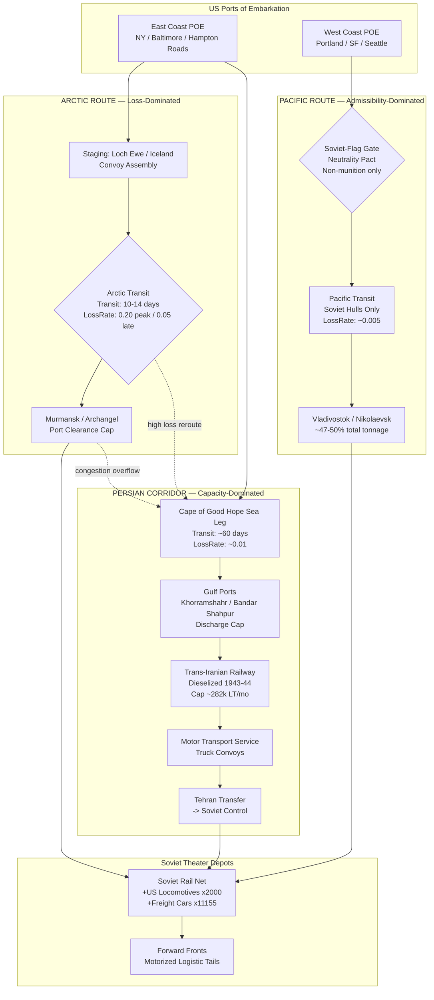

Cost: 0.272355

# Chapter 27: Aid to the USSR in the Later War Years
## Reference Manual & Simulation-Specification Document
### US Army Green Book — *Global Logistics and Strategy: 1943–1945*

---

## 1. Strategic Context & Modern Historical Perspective

### 1.1 The Strategic Paradox

The delivery of Lend-Lease aid to the Soviet Union between 1943 and 1945 constitutes one of the most instructive case studies in the divergence between grand strategic intent and the immovable physics of maritime logistics. At the Casablanca Conference (SYMBOL, January 1943), the Combined Chiefs of Staff reaffirmed that sustaining the Soviet war effort was a first-order strategic priority—the Eastern Front absorbed roughly two-thirds of German ground combat power, and any collapse or negotiated Soviet withdrawal would have rendered OVERLORD infeasible. Yet the aspirational tonnage protocols negotiated in the Moscow Protocols (First through Fourth) repeatedly outran the material capacity of the global shipping pool.

The paradox was acute: the *fastest* route (the Arctic run to Murmansk and Archangel) was also the *most vulnerable*, passing within air and U-boat range of German bases in occupied Norway. The *safest* route (the Persian Corridor) was constrained not by enemy interdiction but by the catastrophic underdevelopment of Iranian and Iraqi rail, road, and port infrastructure. The *highest-volume* route (the Pacific route to Vladivostok) was legally constrained by the Soviet-Japanese Neutrality Pact of April 1941, which required all cargo to move in Soviet-flagged hulls and forbade the shipment of overt war matériel through waters Japan controlled.

This tripartite constraint set created a classic multi-commodity flow optimization problem under heterogeneous risk. The planners at the Combined Shipping Adjustment Board (CSAB) and the War Shipping Administration (WSA) confronted the reality that the *marginal ton* of Liberty ship deadweight allocated to the Soviet aid program was a ton unavailable for the Mediterranean buildup (HUSKY/AVALANCHE), the cross-Channel concentration (BOLERO), or the Pacific advance. At TRIDENT (May 1943) and QUADRANT (Quebec, August 1943), the shipping constraint was explicitly recognized as the binding limit on *all* Allied offensive scheduling. The SEXTANT/EUREKA conferences (Cairo–Tehran, November–December 1943) saw Stalin extract firm delivery commitments precisely because the political value of continued Soviet offensive pressure exceeded the marginal logistic cost of diverting hulls.

### 1.2 Inter-Service and Coalition Tensions

The institutional friction ran along several fault lines. First, the **US Army Services of Supply (SOS)**, reorganized as Army Service Forces (ASF) under LTG Brehon Somervell, controlled the Persian Gulf Command (PGC), which by December 1943 was a fully Americanized theater of operations. This created friction with the **British**, who had originally opened the corridor (Paiforce) and who retained political primacy in Iran under the Anglo-Soviet occupation. The handover of port and rail operation at Khorramshahr, Bandar Shahpur, and the Trans-Iranian Railway from British to American management in 1943 was a delicate coalition negotiation, resolved largely in favor of American operational efficiency (the US brought in dieselization, dispatcher-controlled rail operation, and truck assembly plants).

Second, the **Army–Navy shipping allocation dispute** was chronic. The Navy's control of combat-loaded shipping for amphibious operations competed directly with the WSA's merchant pool. Arctic convoys required heavy escort commitments (destroyers, escort carriers, cruiser covering forces) that the Royal Navy and US Navy grudgingly provided, and the near-annihilation of convoy PQ-17 (July 1942) demonstrated how escort-allocation politics could produce catastrophic outcomes.

Third, the **US–British pooling arrangements** under CSAB meant that "British" and "American" tonnage was fungible in principle but jealously guarded in practice, with each nation's Ministry of War Transport / WSA tracking its own bottom balances.

### 1.3 Historical Era Context: The Three Routes

- **The Arctic Convoys (Murmansk/Archangel):** The politically visible route. Transit time from Loch Ewe or Iceland to the Kola Inlet was roughly 10–14 days. It was the shortest sea distance but ran a gauntlet of Luftwaffe torpedo-bombers (KG 26/30), U-boats, and surface raiders (*Tirpitz*, *Scharnhorst*). Winter darkness offered concealment at the cost of appalling weather and ice.

- **The Persian Corridor:** Cargo moved from US East Coast POEs around the Cape of Good Hope (or via the Mediterranean once cleared in 1944) to Persian Gulf ports, thence overland ~700+ miles by rail and the Motor Transport Service to transfer points at the Soviet frontier (Tehran, then to Soviet control). Transit was long (75+ days port-to-port) but essentially immune to enemy action once in the Gulf.

- **The Soviet-flagged Pacific Route:** From US West Coast POEs (Portland, San Francisco, Seattle) to Vladivostok, Nikolaevsk, and Petropavlovsk. Because the USSR remained neutral toward Japan until August 1945, only Soviet-flagged vessels could safely transit. This route carried non-military cargo (foodstuffs, raw materials, petroleum, industrial equipment) and, by volume, was the workhorse.

### 1.4 Modern Analytical Insights

Post-war declassification and decades of scholarship (notably the work integrating Soviet archival releases after 1991) have inverted the popular hierarchy of the routes. The Arctic route, though it carried the emotional weight of the alliance, delivered roughly **23%** of total tonnage. The Persian Corridor delivered roughly **27%**, and the Pacific route delivered **approximately 47–50%** of all Lend-Lease cargo to the USSR. This is the single most important corrective for any high-fidelity simulation: risk salience is *not* a proxy for logistic significance.

The Arctic attrition rate—peaking near **20% cargo loss** during the 1942–43 crisis (PQ-17 lost 24 of 35 ships)—must be modeled as a stochastic loss coefficient with high variance and strong seasonality. The Persian Corridor's constraint was throughput, not survival: it should be modeled as a **hard capacity cap** governed by port clearance and rail lift, asymptotically approaching **~280,000+ long tons/month** by 1944–45 after American dieselization. The Pacific route's constraint was neither loss nor throughput but **legal/political admissibility** and Soviet hull availability. This produces three qualitatively distinct constraint types—loss-dominated, capacity-dominated, and admissibility-dominated—which is precisely what makes this chapter a rich simulation subject.

---

## 2. High-Fidelity Simulation Parameters & Real-World Metrics

| Parameter | Value | Historical Explanation & Strategic Rationale | Simulation Representation |
|---|---|---|---|
| Peak monthly tonnage, Persian Corridor (PGC) | **~282,097 long tons (July 1944)** | After full American assumption and dieselization of the Trans-Iranian Railway and expansion of Gulf ports, PGC clearance peaked. Represents the throughput ceiling of a capacity-dominated corridor. | **Dynamic capacity cap** `maxMonthlyTons`, ramping with an infrastructure-maturity coefficient over 1943–44. |
| Total US-supplied trucks + jeeps to USSR | **~409,500 (approx. 375,883 trucks + ~51,500 jeeps by war's end; ~427,000 vehicles total incl. all types)** | Provided the operational mobility (the "Studebaker army") that motorized Soviet deep-operation logistics tails in 1944–45. | **Static cumulative constant**; feeds a mobility-multiplier on Soviet operational tempo. |
| Arctic Route peak attrition | **~20% (peak crisis 1942–43; PQ-17 ≈ 68% loss as worst-case single convoy)** | Reflects concentrated Luftwaffe/U-boat/surface threat off Norway. High variance, strongly seasonal. | **Stochastic loss coefficient** `lossRate` with seasonal modifier and convoy-level variance draw. |
| Arctic transit time | **~10–14 days** | Shortest sea leg; speed was its sole advantage. | **Transit-days constant** per route. |
| Persian Corridor transit (port-to-frontier) | **~75–90 days total origin-to-Soviet** | Long haul via Cape + overland lift. | **Additive transit stages** (sea leg + overland leg). |
| Pacific Route share of total tonnage | **~47–50%** | Legally admissible only in Soviet hulls; carried non-munition bulk. | **Admissibility gate** + Soviet-hull availability cap. |
| Total Lend-Lease to USSR (all routes) | **~17.5 million long tons** | Aggregate program scale for normalization. | **Program-level normalization constant.** |
| Locomotives delivered | **~1,981 steam + ~66 diesel (≈2,000)** | Revolutionized Soviet rail lift as domestic production shifted to armor. | **Static constant** feeding rail-lift capacity function. |
| Freight cars delivered | **~11,155** | Multiplied Soviet operational rail throughput. | **Static constant**, rail-capacity coefficient. |
| Aviation fuel / high-octane petroleum | **~2.6 million tons** | Bulk petroleum flow, distinct commodity class. | **Separate commodity flow** with own capacity. |

---

## 3. Logistical Network Topology (Mermaid.js)



---

## 4. Mathematical Modeling & Simulation Formulas

### 4.1 Core Attrition Model

$$C_{delivered} = C_{initial} \cdot (1 - L_{rate})$$

where $C_{initial}$ is dispatched tonnage and $L_{rate} \in [0,1]$ is the route loss coefficient.

### 4.2 Multi-Route Risk-Weighted Allocation

Let $R = \{a, p, v\}$ denote Arctic, Persian, Pacific routes. Decision variables $x_r$ = tons allocated to route $r$. Maximize **net expected delivered tonnage**:

$$\max_{x_r} \; Z = \sum_{r \in R} x_r \cdot (1 - L_r) \cdot A_r$$

where $A_r \in \{0,1\}$ is the admissibility gate (Pacific munitions $\Rightarrow A_v = 0$).

Subject to:

$$\sum_{r \in R} x_r = T_{total} \quad \text{(total dispatch conservation)}$$

$$x_r \le K_r \quad \forall r \quad \text{(per-route capacity caps)}$$

$$x_v \le H_v \quad \text{(Soviet-hull availability on Pacific)}$$

$$x_r \ge 0 \quad \forall r$$

### 4.3 Capacity Ramp (Persian Corridor Maturity)

$$K_p(t) = K_p^{\max} \cdot \left(1 - e^{-\lambda (t - t_0)}\right)$$

where $t_0$ is the American takeover epoch and $\lambda$ the dieselization/infrastructure ramp rate.

### 4.4 Seasonal Arctic Loss

$$L_a(m) = L_a^{base} + \Delta_L \cdot \cos\!\left(\frac{2\pi (m - m_{peak})}{12}\right)$$

with $m$ the month index and $m_{peak}$ the summer daylight peak-threat month.

### 4.5 Expected Transit Time (Multi-Stage)

$$D_r = \sum_{s \in \text{stages}(r)} d_s$$

### 4.6 Effective Rail Lift Multiplier (US Rolling Stock)

$$M_{rail} = 1 + \frac{\alpha \cdot N_{loco} + \beta \cdot N_{cars}}{\text{BaselineCapacity}}$$

**Explanation.** The objective $Z$ maximizes tonnage that actually *arrives*, correctly penalizing the fast-but-lossy Arctic route relative to the slow-but-secure Persian and Pacific routes. The admissibility gate $A_v$ formalizes the Neutrality-Pact constraint. The capacity ramp $K_p(t)$ captures the empirical fact that Persian throughput grew from tens of thousands to ~282,000 LT/month as Americans dieselized rail and expanded ports. The rail multiplier $M_{rail}$ propagates delivered rolling stock into downstream Soviet operational lift.

---

## 5. Compile-Safe Scala 3.8.3 Domain Model

```scala
package Logistics.SovietAid

import scala.math.exp
import scala.math.cos
import scala.math.Pi
import scala.math.max
import scala.math.min

opaque type Tons = Double
object Tons:
  def apply(v: Double): Tons = v
  extension (t: Tons)
    def value: Double = t
    def +(o: Tons): Tons = t + o
    def *(f: Double): Tons = t * f

opaque type Days = Double
object Days:
  def apply(v: Double): Days = v
  extension (d: Days)
    def value: Double = d
    def +(o: Days): Days = d + o

opaque type Rate = Double
object Rate:
  def apply(v: Double): Rate = max(0.0, min(1.0, v))
  extension (r: Rate)
    def value: Double = r

enum CargoClass:
  case DryGeneral
  case Munitions
  case BulkPetroleum
  case RollingStock

enum RouteId:
  case Arctic
  case Persian
  case Pacific

enum RouteState:
  case Open
  case Congested
  case Blocked

final case class RouteSpecs(
    name: String,
    lossRate: Double,
    transitDays: Double
)

final case class RouteProfile(
    id: RouteId,
    specs: RouteSpecs,
    monthlyCapacity: Tons,
    hullCap: Tons,
    admitsMunitions: Boolean,
    state: RouteState
)

final case class Allocation(route: RouteId, dispatched: Tons)

final case class DeliveryResult(
    route: RouteId,
    dispatched: Tons,
    delivered: Tons,
    lost: Tons,
    transit: Days,
    admitted: Boolean
)

object SovietRouteRiskModel:

  def expectedDelivery(initialTons: Double, specs: RouteSpecs): Double =
    if specs.lossRate < 0.0 then initialTons
    else if specs.lossRate >= 1.0 then 0.0
    else initialTons * (1.0 - specs.lossRate)

  def isAdmissible(profile: RouteProfile, cargo: CargoClass): Boolean =
    if profile.state == RouteState.Blocked then false
    else if cargo == CargoClass.Munitions && !profile.admitsMunitions then false
    else true

  def effectiveCapacity(profile: RouteProfile): Tons =
    val hard: Double = min(profile.monthlyCapacity.value, profile.hullCap.value)
    profile.state match
      case RouteState.Open      => Tons(hard)
      case RouteState.Congested => Tons(hard * 0.6)
      case RouteState.Blocked   => Tons(0.0)

  def deliver(
      profile: RouteProfile,
      dispatched: Tons,
      cargo: CargoClass
  ): DeliveryResult =
    val admitted: Boolean = isAdmissible(profile, cargo)
    val cap: Double = effectiveCapacity(profile).value
    val accepted: Double =
      if !admitted then 0.0 else min(dispatched.value, cap)
    val delivered: Double =
      expectedDelivery(accepted, profile.specs)
    val lost: Double = accepted - delivered
    DeliveryResult(
      route = profile.id,
      dispatched = Tons(dispatched.value),
      delivered = Tons(delivered),
      lost = Tons(lost),
      transit = Days(profile.specs.transitDays),
      admitted = admitted
    )

object CapacityDynamics:

  def persianRamp(
      maxTons: Tons,
      lambda: Double,
      monthIndex: Double,
      takeoverMonth: Double
  ): Tons =
    val t: Double = max(0.0, monthIndex - takeoverMonth)
    val factor: Double = 1.0 - exp(-lambda * t)
    Tons(maxTons.value * factor)

  def seasonalArcticLoss(
      baseLoss: Rate,
      amplitude: Double,
      monthIndex: Double,
      peakThreatMonth: Double
  ): Rate =
    val seasonal: Double =
      baseLoss.value + amplitude * cos(2.0 * Pi * (monthIndex - peakThreatMonth) / 12.0)
    Rate(seasonal)

  def railLiftMultiplier(
      locomotives: Int,
      freightCars: Int,
      alpha: Double,
      beta: Double,
      baselineCapacity: Double
  ): Double =
    val safeBaseline: Double = if baselineCapacity <= 0.0 then 1.0 else baselineCapacity
    1.0 + (alpha * locomotives.toDouble + beta * freightCars.toDouble) / safeBaseline

object AllocationOptimizer:

  def netExpected(profile: RouteProfile, dispatched: Tons, cargo: CargoClass): Tons =
    SovietRouteRiskModel.deliver(profile, dispatched, cargo).delivered

  def greedyRiskWeighted(
      totalDispatch: Tons,
      profiles: List[RouteProfile],
      cargo: CargoClass
  ): List[DeliveryResult] =
    val ranked: List[RouteProfile] =
      profiles
        .filter(p => SovietRouteRiskModel.isAdmissible(p, cargo))
        .sortBy(p => -(1.0 - p.specs.lossRate))
    val (results, _) =
      ranked.foldLeft((List.empty[DeliveryResult], totalDispatch.value)):
        case ((acc, remaining), profile) =>
          val cap: Double = SovietRouteRiskModel.effectiveCapacity(profile).value
          val assign: Double = min(remaining, cap)
          val res: DeliveryResult =
            SovietRouteRiskModel.deliver(profile, Tons(assign), cargo)
          (res :: acc, remaining - assign)
    results.reverse

  def totalDelivered(results: List[DeliveryResult]): Tons =
    Tons(results.foldLeft(0.0)((sum, r) => sum + r.delivered.value))

object SimulationHarness:

  val arctic: RouteProfile =
    RouteProfile(
      id = RouteId.Arctic,
      specs = RouteSpecs("Arctic-Murmansk", 0.20, 12.0),
      monthlyCapacity = Tons(120000.0),
      hullCap = Tons(120000.0),
      admitsMunitions = true,
      state = RouteState.Open
    )

  val persian: RouteProfile =
    RouteProfile(
      id = RouteId.Persian,
      specs = RouteSpecs("Persian-Corridor", 0.01, 82.0),
      monthlyCapacity = Tons(282097.0),
      hullCap = Tons(282097.0),
      admitsMunitions = true,
      state = RouteState.Open
    )

  val pacific: RouteProfile =
    RouteProfile(
      id = RouteId.Pacific,
      specs = RouteSpecs("Pacific-Vladivostok", 0.005, 20.0),
      monthlyCapacity = Tons(400000.0),
      hullCap = Tons(350000.0),
      admitsMunitions = false,
      state = RouteState.Open
    )

  def run(totalTons: Double, cargo: CargoClass): List[DeliveryResult] =
    AllocationOptimizer.greedyRiskWeighted(
      Tons(totalTons),
      List(arctic, persian, pacific),
      cargo
    )

  @main def demo(): Unit =
    val dryResults: List[DeliveryResult] = run(600000.0, CargoClass.DryGeneral)
    val munitionResults: List[DeliveryResult] = run(600000.0, CargoClass.Munitions)
    val dryTotal: Double = AllocationOptimizer.totalDelivered(dryResults).value
    val munTotal: Double = AllocationOptimizer.totalDelivered(munitionResults).value
    val railMult: Double =
      CapacityDynamics.railLiftMultiplier(2000, 11155, 5.0, 0.5, 100000.0)
    println(s"Dry general delivered: $dryTotal LT")
    println(s"Munitions delivered:   $munTotal LT")
    println(s"Soviet rail lift multiplier: $railMult")
    dryResults.foreach: r =>
      println(s"${r.route}: disp=${r.dispatched.value} del=${r.delivered.value} lost=${r.lost.value} admit=${r.admitted}")
```

---

## 6. Graduate-Level Operational Analysis

### 6.1 Persian Corridor vs. Arctic Route: Advantages and Constraints

The comparison is best framed as a trade-off between **time-value of delivery** and **expected-value survivability**, complicated by fundamentally different limiting factors.

The **Arctic Route** offered a decisive advantage in *transit latency*: 10–14 days from Icelandic assembly to the Kola Inlet, versus 75–90 days origin-to-frontier via Persia. In an operational-tempo sense, matériel arriving via the Arctic in a fortnight could influence a front sector within the same operational cycle, whereas Persian-Corridor cargo effectively belonged to the *next* strategic season. This latency advantage mattered most in the 1941–42 crisis, when the marginal value of *any* immediate delivery to a collapsing front was extremely high—a classic case where the discount rate on delivery time dwarfed loss considerations.

But the Arctic route's binding constraint was **stochastic attrition with catastrophic tail risk**. A ~20% mean loss rate is itself severe, but the true problem is variance: PQ-17's ~68% loss demonstrates that the loss distribution was heavy-tailed, driven by concentrated German air-sea power off Norway and by escort-allocation decisions outside the convoy's control. From an operations-research standpoint, the Arctic route delivered *high expected tonnage per ton-day of transit but with unacceptable variance*, and every ton lost also destroyed the hull, the escort effort, and the trained crew—a compounded loss the simple $C \cdot (1 - L)$ model understates. The route was also seasonally bimodal: summer daylight maximized threat while easing navigation; winter darkness reduced threat but imposed brutal ice and weather.

The **Persian Corridor**, by contrast, was constrained not by survival (loss rates ~1%, essentially deterministic) but by **throughput ceilings**—a capacity-dominated regime. Its limiting factors were port discharge rate at Khorramshahr and Bandar Shahpur, the single-track Trans-Iranian Railway's ruling grades and water-scarce steam operation, and motor-transport road capacity. The American contribution—dieselization (immune to Iran's water scarcity), centralized dispatcher-controlled train operation, and truck-assembly plants—raised clearance from a trickle to ~282,000 LT/month by mid-1944. The corridor's great virtue was *predictability*: planners could commit tonnage against a near-deterministic delivery function, invaluable for sustaining a long-horizon buildup. Its cost was the long pipeline fill—tens of thousands of tons perpetually in transit, representing enormous working-capital tie-up in scarce hull-days.

The correct simulation insight is that these routes occupy **orthogonal risk axes**: the Arctic is variance-limited, the Persian is capacity-limited. A robust allocation policy therefore uses the Persian Corridor as the deterministic *base load* and treats the Arctic as a high-value *surge channel* activated when time-criticality justifies its variance—precisely the historical pattern once Persian capacity matured.

### 6.2 US Locomotives and Rolling Stock: The Rail Revolution of 1944–45

Soviet strategic mobility in the deep-operation offensives of 1944–45 (Bagration, Vistula–Oder, the Manchurian campaign) was underwritten by a rail-transport transformation that US Lend-Lease rolling stock made possible. As Soviet locomotive and freight-car production collapsed—domestic industry was reallocated almost entirely to armor, artillery, and aircraft—the delivery of ~2,000 locomotives and ~11,000+ freight cars, together with rail, wheelsets, and signaling equipment, replenished an attriting network at precisely the moment operational demand peaked.

The mechanism is captured by the rail-lift multiplier $M_{rail} = 1 + (\alpha N_{loco} + \beta N_{cars}) / \text{Baseline}$. American locomotives were not merely additive units; they were high-tractive-effort machines that raised train tonnage per path on the strategically decisive lines feeding the front. Because Soviet operational art depended on *massing* men and matériel for short, overwhelming offensive pulses along narrow axes, the binding constraint was often the ability to *build up* a front's supply base within a compressed pre-offensive window. Additional locomotives increased the number of trains that could be pushed through a given rail corridor per day; additional freight cars increased the standing lift capacity, reducing the turnaround-limited throughput bottleneck.

Crucially, the rail contribution **compounded** with the ~400,000 trucks delivered. Rail moved masses of matériel to railheads at strategic depth; the "Studebaker army" of trucks then executed the operational-to-tactical last leg across the road-poor Soviet interior, sustaining the exploitation phase beyond railhead—the classic failure point of continental offensives. Together, locomotives and trucks extended the *culmination point* of Soviet offensives, allowing the Red Army to sustain deep thrusts (300+ km) that would earlier have stalled at the limit of horse-and-rail logistics. In simulation terms, the rolling stock feeds the depot-to-front edge capacity, while the truck count sets a mobility multiplier on the rate at which delivered tonnage converts into sustained forward combat power—the two together transforming raw delivered tons into realized operational tempo.
