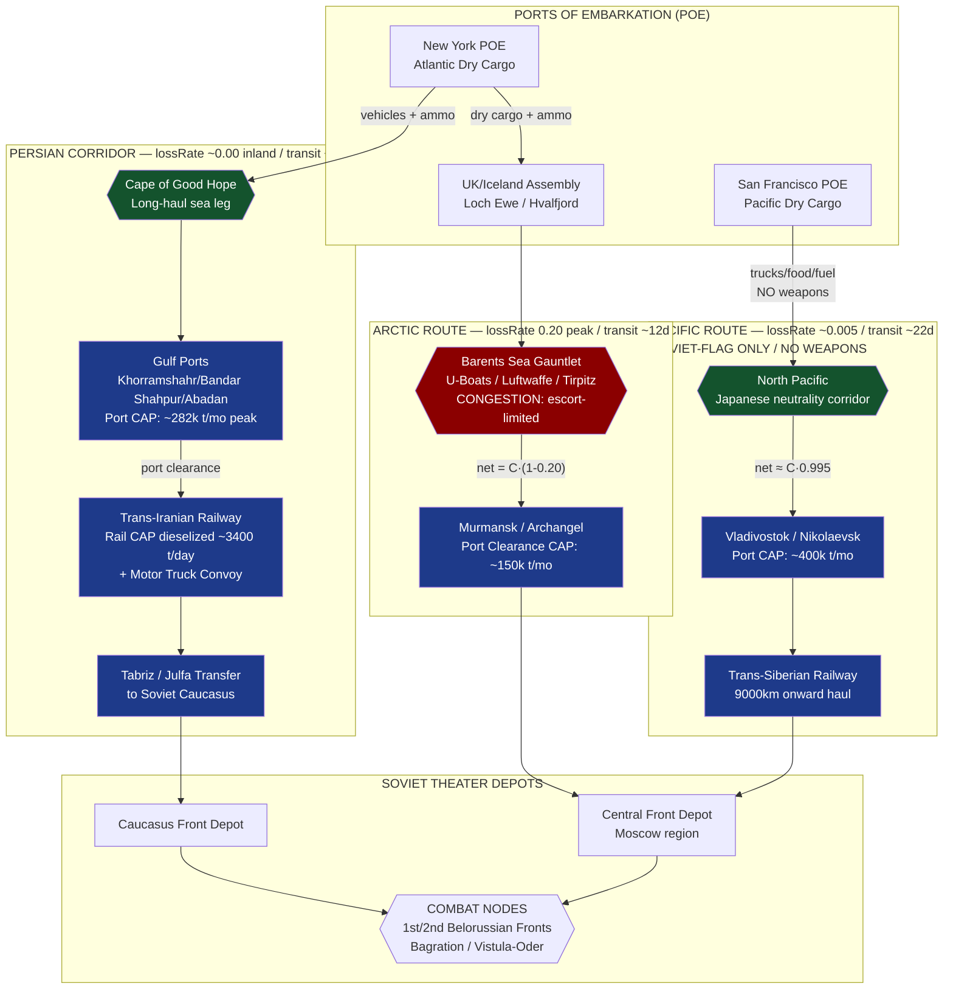

Cost: 0.306855

# Chapter 27: Aid to the USSR in the Later War Years
## Reference Manual & Simulation-Specification Document
### US Army Green Book — *Global Logistics and Strategy: 1943–1945*

---

## 1. Strategic Context & Modern Historical Perspective

### 1.1 The Strategic Paradox

The Lend-Lease program to the Soviet Union in the later war years (1943–1945) represents one of the most instructive case studies in the collision between strategic aspiration and physical logistics capacity. At the successive Allied conferences—Casablanca (SYMBOL, January 1943), TRIDENT (Washington, May 1943), QUADRANT (Quebec, August 1943), and SEXTANT (Cairo, November–December 1943)—the political imperative to sustain the Soviet war effort was treated as an axiomatic first-order commitment. Roosevelt, in particular, elevated the delivery of promised tonnage under the successive Soviet Protocols (the Second, Third, and Fourth Protocols) to a matter of coalition faith, frequently overriding the parochial objections of the Combined Chiefs of Staff and the Munitions Assignments Board.

The paradox arose because the *quantities* pledged in the Protocol documents were set by political negotiation in Moscow and Washington, while the *means of delivery* were constrained by a finite and brutally contested global merchant shipping pool. The Protocol figures—expressed in gross long tons of dry cargo, thousands of vehicles, and hundreds of thousands of tons of petroleum products—were fixed obligations. Yet every ton allocated to the Soviet routes was a ton unavailable for the North African build-up (TORCH residuals), the Mediterranean campaigns (HUSKY, AVALANCHE), the cross-Channel concentration (BOLERO), or the Pacific island-hopping campaign. The Soviet Protocol thus functioned as a hard constraint layered atop a globally over-subscribed shipping matrix.

The critical bottleneck was never the manufacturing base—American war production by 1943 was capable of pouring forth trucks, aircraft, and machine tools in near-limitless quantity—but rather the *sealift and port-clearance chain*. A cargo hold in San Francisco, a berth in Bandar Shahpur, a marshaling yard at Andimeshk, and an escort destroyer in the Barents Sea were the true governing variables. Modern operations-research reconstruction demonstrates that the effective throughput of the entire Soviet aid program was determined not by any single link but by the *minimum capacity across the serial chain*—the classic logistics principle that a pipeline flows only as fast as its narrowest section.

### 1.2 Inter-Service and Coalition Tensions

The three-route delivery architecture generated persistent command friction. On the American side, the Persian Gulf Service Command (redesignated the Persian Gulf Command, PGC, in December 1943) had to be carved out of the Services of Supply (ASF under General Somervell) as an autonomous theater command reporting directly to the War Department. This provoked friction with the British, who had originally established the Persian Corridor infrastructure (PAIFORCE—Persia and Iraq Force) and were reluctant to cede operational primacy of the railways and ports to an American command. The eventual arrangement—American operation of the Trans-Iranian Railway and the Gulf ports, with British retention of internal security and northern-sector distribution—was a negotiated compromise that reflected the broader QUADRANT-era principle of task-based coalition division of labor.

The Army–Navy tension surfaced most acutely over the Arctic convoys. The US Navy, having committed the bulk of its escort capacity to the Atlantic anti-submarine campaign and the Pacific, resisted diverting destroyers and escort carriers to the Murmansk run, where the combination of German surface raiders (*Tirpitz*, *Scharnhorst*), U-boat wolfpacks, and Luftwaffe torpedo-bomber wings based in northern Norway produced catastrophic loss rates. The disaster of Convoy PQ-17 (July 1942, 24 of 35 merchantmen lost) cast a long shadow, and the Admiralty's subsequent suspension of summer convoys created diplomatic friction with Stalin that reverberated through the SEXTANT deliberations.

The Munitions Assignments Board itself was a locus of contest, adjudicating between the competing claims of the British Empire, the USSR, China, and the American services for a common pool of manufactured output. The Soviet claim's political priority frequently distorted rational allocation—as when high-value vehicles were shipped to Vladivostok while equivalent lift for the Southwest Pacific went wanting.

### 1.3 Historical Era Context: The Three Routes

Sustaining the Soviet war effort demanded raw materials (aluminum, copper, high-octane blending agents), vehicles, machine tools, locomotives, and processed food. Three principal corridors served this purpose:

- **The Arctic Convoys (Murmansk/Archangel):** The shortest route from British and Icelandic assembly ports, but the most dangerous, running the gauntlet of German air and naval forces in the Norwegian and Barents Seas.
- **The Persian Corridor:** Cargo shipped around the Cape of Good Hope (or through the Mediterranean once cleared) to the Persian Gulf ports of Khorramshahr, Bandar Shahpur, and Abadan, thence overland by the Trans-Iranian Railway and a vast trucking operation to the Soviet Caucasus.
- **The Soviet-flagged Pacific Route:** From US West Coast ports (San Francisco, Portland, Seattle) directly to Vladivostok and other Soviet Far East ports. Because the USSR maintained neutrality with Japan until August 1945 (per the April 1941 Soviet–Japanese Neutrality Pact), Japan was obliged to permit Soviet-flagged shipping to transit unmolested, though it interned or challenged US-flagged vessels.

### 1.4 Modern Analytical Insights

Post-war declassification and decades of scholarship (notably the work of Robert Huhn Jones, the Soviet-side archival releases of the 1990s, and quantitative reconstructions by the US Army Center of Military History) have inverted the popular hierarchy of the routes. The Arctic convoys, though celebrated in Anglo-American memory for their heroism, delivered a minority of total tonnage—approximately 22–23% of the cumulative program—at a peak attrition cost approaching **20%** during the 1942–43 crisis.

The **Pacific Route**, precisely because it was immune to attack under the cover of the Soviet flag, quietly became the single most productive corridor, delivering **over 50%** of all Soviet Lend-Lease cargo by volume. Its limitation was categorical rather than volumetric: it could not carry overtly military materiel (weapons, ammunition, combat aircraft) without provoking a Japanese casus belli, and so it specialized in trucks-in-crates, food, fuel, and industrial goods.

The **Persian Corridor**, once the Americans applied their railway and port engineering, reached a peak monthly clearance that transformed it into the primary conduit for combat-critical vehicles. Its virtue was that it was **100% secure** from enemy interdiction along the inland leg, converting a slow transit into a *predictable* one—a distinction of profound value to a planner, because predictability permits tight scheduling and low safety-stock buffers.

The modern analytical lesson is that **expected delivered tonnage**, not nominal dispatched tonnage, is the correct optimization objective, and that a route's *loss-rate variance* is as strategically significant as its mean loss rate.

---

## 2. High-Fidelity Simulation Parameters & Real-World Metrics

| Parameter | Historical Value | Explanation & Strategic Rationale | Simulation Representation |
|---|---|---|---|
| **Peak monthly Persian Corridor clearance (PGC)** | ~**282,000 long tons/month** (mid-1944) | The Persian Gulf Command's throughput, after American railway rehabilitation (doubling Trans-Iranian Railway capacity via new locomotives, sidings, and dieselization) and port expansion, peaked in the summer of 1944. Cumulative Persian Corridor delivery reached ~4.16 million long tons. | Dynamic capacity cap `maxMonthlyTons`, ramped by an infrastructure-maturity coefficient over simulation months. |
| **Total US tactical trucks + jeeps to USSR** | ~**427,000 vehicles** (approx. 375,000+ trucks incl. Studebaker US6 6×6, plus ~51,000 Willys/Bantam jeeps) | These vehicles motorized the Red Army's operational-depth exploitation (the "deep operations" doctrine), enabling the sustained pursuit tempo of 1944–45 offensives (Bagration, Vistula–Oder). Represents cumulative flow, not rate. | Static cumulative constant `totalVehiclesDelivered`; used to seed a mobility-multiplier coefficient on Soviet combat nodes. |
| **Arctic Route peak attrition (1942–43 crisis)** | **~20%** (peak; PQ-17 alone ~68% loss) | The interdiction-driven loss rate on the Murmansk run during the crisis window. Drives the risk-weighting differential versus the secure corridors. | Route-level `lossRate` coefficient; time-varying (peaks 1942–43, decays toward ~7% by 1944 as escort tactics improved). |
| **Pacific Route share of total cargo** | **>50%** (~8.24 million long tons of ~17.5M total) | Soviet-flag immunity under the Neutrality Pact. The dominant but militarily-restricted corridor. | Route with `lossRate ≈ 0.005` but a `cargoTypeRestriction` flag excluding weapons/ammunition. |
| **Arctic Route cargo share** | **~22.7%** (~3.96M long tons) | Fast but costly; primary route for early-war emergency materiel. | Route with high `lossRate`, low `transitDays`. |
| **Persian Corridor cargo share** | **~23.8%** (~4.16M long tons) | Secure inland leg; primary vehicle conduit. | Route with `lossRate ≈ 0.0` (inland), `transitDays` high. |
| **Arctic transit time** | ~**10–14 days** (Iceland→Murmansk) | Shortest sea leg. | `transitDays` static. |
| **Persian Corridor transit** | ~**75–90 days** (US East Coast→Caucasus) | Cape route + inland rail/truck. | `transitDays` static, high. |
| **Pacific transit** | ~**18–25 days** (US West Coast→Vladivostok) + Trans-Siberian onward | Moderate sea leg, long rail onward. | `transitDays` composite. |
| **Total Soviet Lend-Lease** | ~**17.5 million long tons** | Program aggregate baseline for share normalization. | Global normalization constant. |
| **Locomotives delivered** | ~**1,900 steam + 66 diesel** | Doubled effective Soviet rail lift on strategic axes. | Rail-capacity multiplier. |

---

## 3. Logistical Network Topology (Mermaid.js Flowchart)



---

## 4. Mathematical Modeling & Simulation Formulas

### 4.1 Core Attrition Model

The fundamental delivery relationship for a single route:

$$
C_{delivered} = C_{initial} \cdot (1 - L_{rate}), \qquad L_{rate} \in [0, 1]
$$

where $C_{initial}$ is dispatched tonnage and $L_{rate}$ the fractional loss rate.

### 4.2 Serial Chain with Port-Clearance Capping

Real delivery is capped by the minimum capacity along the serial chain. For route $r$ with sea attrition $L_r$ and a set of downstream node capacities $\{K_{r,j}\}$ (ports, rail, trucking):

$$
C^{net}_{r}(t) = \min\Big( C_{r}(t)\cdot(1 - L_r(t)),\ \min_{j}\ K_{r,j}(t) \Big)
$$

The port/rail capacity itself matures over time via an infrastructure coefficient $\alpha_r(t) \in [0,1]$:

$$
K_{r,j}(t) = K_{r,j}^{\max}\cdot\alpha_r(t), \qquad \alpha_r(t) = 1 - e^{-\lambda_r t}
$$

### 4.3 Multi-Route Allocation (Objective Function)

Given a total dispatchable supply $S(t)$ per period, allocate fractions $x_r$ to maximize expected delivered tonnage subject to cargo-type eligibility and capacity:

$$
\max_{\{x_r\}} \ \sum_{r \in R} x_r \, S(t)\,(1 - L_r(t)) \cdot \mathbb{1}[\text{eligible}(r, \tau)]
$$

subject to

$$
\sum_{r \in R} x_r = 1, \quad x_r \ge 0, \quad x_r\,S(t)(1-L_r) \le K_r(t) \ \ \forall r
$$

where $\mathbb{1}[\text{eligible}(r,\tau)]$ is an indicator that cargo class $\tau$ (e.g., weapons) is permitted on route $r$ (the Pacific weapon-embargo constraint sets this to $0$ for $\tau = \text{weapons}$).

### 4.4 Risk-Adjusted Utility (Variance Penalty)

Because predictability has planning value, a variance-penalized utility captures the strategic preference for the secure Persian Corridor:

$$
U_r = C_r(1 - \mu_r) - \gamma \, C_r^2 \, \sigma_r^2
$$

where $\mu_r$ is mean loss rate, $\sigma_r^2$ its variance, and $\gamma \ge 0$ the planner's risk-aversion coefficient. For the Persian inland leg $\sigma_r^2 \approx 0$, making it dominant under any $\gamma > 0$ at equal mean.

### 4.5 Definitions

| Symbol | Meaning | Units |
|---|---|---|
| $C_{initial}, C_r$ | dispatched tonnage | long tons |
| $C_{delivered}, C^{net}_r$ | delivered tonnage | long tons |
| $L_r, \mu_r$ | loss rate (mean) | fraction |
| $\sigma_r^2$ | loss-rate variance | fraction² |
| $K_{r,j}$ | node capacity | long tons/period |
| $\alpha_r(t)$ | infrastructure maturity | fraction |
| $\lambda_r$ | maturation rate | 1/period |
| $x_r$ | allocation fraction | fraction |
| $\gamma$ | risk aversion | dimensionless |

---

## 5. Compile-Safe Scala 3.8.3 Domain Model

```scala
package Logistics.SovietAid

import scala.math.exp
import scala.math.min
import scala.math.max

case class RouteSpecs(name: String, lossRate: Double, transitDays: Double)

object SovietRouteRiskModel:
  def expectedDelivery(initialTons: Double, specs: RouteSpecs): Double =
    if specs.lossRate < 0.0 then initialTons
    else if specs.lossRate >= 1.0 then 0.0
    else initialTons * (1.0 - specs.lossRate)

opaque type Tons = Double
object Tons:
  def apply(v: Double): Tons = max(0.0, v)
  extension (t: Tons)
    def value: Double = t
    def +(other: Tons): Tons = Tons(t + other)
    def cappedAt(limit: Tons): Tons = Tons(min(t, limit))

opaque type Days = Double
object Days:
  def apply(v: Double): Days = max(0.0, v)
  extension (d: Days)
    def value: Double = d

opaque type Fraction = Double
object Fraction:
  def apply(v: Double): Fraction = max(0.0, min(1.0, v))
  extension (f: Fraction)
    def value: Double = f
    def complement: Fraction = Fraction(1.0 - f)

enum CargoClass:
  case Weapons, Ammunition, Vehicles, Food, Fuel, Industrial

enum RouteId:
  case Arctic, Persian, Pacific

enum RouteState:
  case Open, Suspended, ConvoyForming, Interdicted

final case class RouteProfile(
    id: RouteId,
    meanLoss: Fraction,
    lossVariance: Double,
    transit: Days,
    maxMonthlyCapacity: Tons,
    maturationRate: Double,
    permittedCargo: Set[CargoClass],
    state: RouteState
):
  def isEligibleFor(cargo: CargoClass): Boolean =
    permittedCargo.contains(cargo) && state == RouteState.Open

  def maturedCapacity(month: Double): Tons =
    val alpha: Double = 1.0 - exp(-maturationRate * max(0.0, month))
    Tons(maxMonthlyCapacity.value * alpha)

final case class DeliveryResult(
    route: RouteId,
    dispatched: Tons,
    delivered: Tons,
    lostToAttrition: Tons,
    lostToCapacity: Tons,
    eligible: Boolean
)

object SovietAidSimulator:

  val arcticProfile: RouteProfile = RouteProfile(
    id = RouteId.Arctic,
    meanLoss = Fraction(0.20),
    lossVariance = 0.09,
    transit = Days(12.0),
    maxMonthlyCapacity = Tons(150000.0),
    maturationRate = 0.15,
    permittedCargo = Set(
      CargoClass.Weapons, CargoClass.Ammunition,
      CargoClass.Vehicles, CargoClass.Industrial
    ),
    state = RouteState.Open
  )

  val persianProfile: RouteProfile = RouteProfile(
    id = RouteId.Persian,
    meanLoss = Fraction(0.005),
    lossVariance = 0.0001,
    transit = Days(80.0),
    maxMonthlyCapacity = Tons(282000.0),
    maturationRate = 0.08,
    permittedCargo = Set(
      CargoClass.Weapons, CargoClass.Ammunition,
      CargoClass.Vehicles, CargoClass.Fuel,
      CargoClass.Food, CargoClass.Industrial
    ),
    state = RouteState.Open
  )

  val pacificProfile: RouteProfile = RouteProfile(
    id = RouteId.Pacific,
    meanLoss = Fraction(0.005),
    lossVariance = 0.00005,
    transit = Days(22.0),
    maxMonthlyCapacity = Tons(400000.0),
    maturationRate = 0.05,
    permittedCargo = Set(
      CargoClass.Vehicles, CargoClass.Food,
      CargoClass.Fuel, CargoClass.Industrial
    ),
    state = RouteState.Open
  )

  val allRoutes: List[RouteProfile] =
    List(arcticProfile, persianProfile, pacificProfile)

  def deliverOnRoute(
      dispatched: Tons,
      cargo: CargoClass,
      profile: RouteProfile,
      month: Double
  ): DeliveryResult =
    val eligible: Boolean = profile.isEligibleFor(cargo)
    if !eligible then
      DeliveryResult(
        route = profile.id,
        dispatched = dispatched,
        delivered = Tons(0.0),
        lostToAttrition = Tons(0.0),
        lostToCapacity = dispatched,
        eligible = false
      )
    else
      val afterAttrition: Tons =
        Tons(dispatched.value * profile.meanLoss.complement.value)
      val capacity: Tons = profile.maturedCapacity(month)
      val delivered: Tons = afterAttrition.cappedAt(capacity)
      val attritionLoss: Tons =
        Tons(dispatched.value - afterAttrition.value)
      val capacityLoss: Tons =
        Tons(afterAttrition.value - delivered.value)
      DeliveryResult(
        route = profile.id,
        dispatched = dispatched,
        delivered = delivered,
        lostToAttrition = attritionLoss,
        lostToCapacity = capacityLoss,
        eligible = true
      )

  def riskAdjustedUtility(
      dispatched: Tons,
      profile: RouteProfile,
      riskAversion: Double
  ): Double =
    val c: Double = dispatched.value
    val meanTerm: Double = c * profile.meanLoss.complement.value
    val penalty: Double =
      max(0.0, riskAversion) * c * c * profile.lossVariance
    meanTerm - penalty

  def bestRouteFor(
      dispatched: Tons,
      cargo: CargoClass,
      month: Double,
      riskAversion: Double
  ): Option[DeliveryResult] =
    val candidates: List[DeliveryResult] =
      allRoutes
        .filter(_.isEligibleFor(cargo))
        .map(p => deliverOnRoute(dispatched, cargo, p, month))
    if candidates.isEmpty then None
    else
      val scored: List[(DeliveryResult, Double)] =
        candidates.map: result =>
          val profileOpt: Option[RouteProfile] =
            allRoutes.find(_.id == result.route)
          val util: Double = profileOpt match
            case Some(p) => riskAdjustedUtility(dispatched, p, riskAversion)
            case None    => Double.NegativeInfinity
          (result, util)
      Some(scored.maxBy((_, util) => util)._1)

  def totalNetDelivered(
      dispatchedPerRoute: Map[RouteId, Tons],
      cargo: CargoClass,
      month: Double
  ): Tons =
    allRoutes.foldLeft(Tons(0.0)): (acc, profile) =>
      val dispatched: Tons =
        dispatchedPerRoute.getOrElse(profile.id, Tons(0.0))
      val result: DeliveryResult =
        deliverOnRoute(dispatched, cargo, profile, month)
      acc + result.delivered

@main def runSovietAidDemo(): Unit =
  val month: Double = 18.0
  val dispatch: Tons = Tons(200000.0)

  val vehicleBest: Option[DeliveryResult] =
    SovietAidSimulator.bestRouteFor(
      dispatch, CargoClass.Vehicles, month, riskAversion = 1.0e-6
    )
  val weaponBest: Option[DeliveryResult] =
    SovietAidSimulator.bestRouteFor(
      dispatch, CargoClass.Weapons, month, riskAversion = 1.0e-6
    )

  vehicleBest.foreach: r =>
    println(s"Vehicles best route: ${r.route}, delivered=${r.delivered.value}")
  weaponBest.foreach: r =>
    println(s"Weapons best route: ${r.route}, delivered=${r.delivered.value}")

  val allocation: Map[RouteId, Tons] = Map(
    RouteId.Arctic  -> Tons(80000.0),
    RouteId.Persian -> Tons(120000.0),
    RouteId.Pacific -> Tons(180000.0)
  )
  val totalVehicles: Tons =
    SovietAidSimulator.totalNetDelivered(allocation, CargoClass.Vehicles, month)
  println(s"Total net vehicle tonnage delivered: ${totalVehicles.value}")
```

---

## 6. Graduate-Level Operational Analysis

### 6.1 The Persian Corridor vs. the Arctic Route: Advantages and Constraints

The comparison between these two corridors is a canonical illustration of the trade-off between *transit velocity* and *delivery reliability*—and demonstrates why nominal throughput is an inferior optimization metric to *expected delivered tonnage under variance*.

The **Arctic Route** possessed one decisive physical advantage: minimum transit distance. From the assembly anchorages of Loch Ewe and Hvalfjörður, a convoy reached Murmansk in roughly 10–14 days. In a mathematical sense, its pipeline fill—the quantity of tonnage in transit at any moment, given by Little's Law as $L = \lambda W$ (throughput × transit time)—was minimized, freeing merchant bottoms for faster turnaround. For emergency infusions in the desperate winter of 1941–42, when the Red Army's survival was measured in weeks, this velocity was strategically irreplaceable regardless of cost.

Yet the Arctic Route was catastrophically exposed. Its geography forced convoys through a narrow corridor between the Arctic ice edge and German-occupied Norway, within range of Luftwaffe torpedo-bombers, U-boat concentrations, and the threat of the *Tirpitz* battle group. During the 1942–43 crisis the loss rate reached **~20%**, with the PQ-17 disaster losing roughly two-thirds of a single convoy. In the model of §4, this route is characterized by a high $\mu_r$ **and** a very high $\sigma_r^2$—both the expected loss and its variance were severe. High variance is a planner's nemesis: it forces the inflation of safety stock, the duplication of critical shipments, and the inability to promise a front commander a reliable arrival date.

The **Persian Corridor** was the mirror image. Its transit was punishing—75 to 90 days around the Cape, followed by the slow grind of the Trans-Iranian Railway climbing through the Zagros mountains and the truck convoys onward to the Caucasus. In pipeline terms, it locked up an enormous quantity of tonnage in transit and demanded a far larger dedicated merchant fleet to sustain a given monthly delivery rate. Its early constraint was infrastructure: the Trans-Iranian Railway was a single-track line built for light commerce, not military mass, and the gulf ports lacked deep-water berths and mechanized cargo handling.

The American contribution—captured in the model as the maturation coefficient $\alpha_r(t) = 1 - e^{-\lambda_r t}$—transformed this. By introducing US locomotives, dieselization, new sidings, assembly plants (the Truck Assembly Plants at Andimeshk and elsewhere), and mechanized port equipment, the Persian Gulf Command drove peak clearance to **~282,000 long tons per month** by mid-1944. Critically, once cargo cleared the gulf ports, the inland leg was **100% secure**: $\mu_r \approx 0$ and, more importantly, $\sigma_r^2 \approx 0$. Under the variance-penalized utility $U_r = C_r(1-\mu_r) - \gamma C_r^2 \sigma_r^2$, the Persian Corridor dominates the Arctic Route for any risk-averse planner ($\gamma > 0$), because its near-zero variance eliminates the second-order penalty term entirely. This is the quantitative expression of the historical judgment that the Persian Corridor, despite its slowness, was the *superior* route for delivering the combat-critical and irreplaceable materiel—above all the trucks that motorized the Red Army—precisely because a slow-but-certain arrival is worth more to an operational planner than a fast-but-probabilistic one.

### 6.2 US Locomotives and Rolling Stock: The Rail Revolution of 1944–45

The delivery of approximately **1,900 steam locomotives and 66 diesel-electric locomotives**, together with over 11,000 railway cars, constitutes one of the most under-appreciated force-multipliers of the Eastern Front. To understand its revolutionary character, one must appreciate the specific constraint it relieved.

Soviet strategic mobility in 1941–42 was crippled not by a shortage of track but by a *shortage of traction and rolling stock*—much of it destroyed, captured, or worn out in the retreats of the first eighteen months, with the locomotive-building plants (Kharkov, Voroshilovgrad) either overrun or converted to tank production. The Soviet rail network, operating on the 1520mm broad gauge, was the arterial system of the entire war economy and the sole practical means of moving the mass of a front-scale offensive—ammunition, fuel, and reinforcements measured in millions of tons—from the industrial interior to the launch points.

US locomotives directly increased the *lift capacity* of this arterial system. In the model of §4, this is a multiplicative uplift on the strategic rail capacity $K_{rail}$. Because the Soviets could now dedicate their own limited locomotive-production capacity to nothing at all (freeing the plants for armor) while the imported traction handled strategic hauls, the effective throughput on the trunk lines feeding the 1944 offensives rose sharply.

The operational consequence was the ability to sustain the *tempo and depth* of the 1944–45 offensives. Operation Bagration (June–August 1944) and the Vistula–Oder Operation (January 1945) were characterized by rapid concentration of overwhelming force at chosen breakthrough sectors, followed by deep exploitation. This "deep operations" doctrine is logistically ruinous: it demands the delivery of colossal ammunition and fuel tonnages to a launch point on a compressed timetable, and then the extension of the supply line hundreds of kilometers behind an advancing spearhead. Rail delivered the pre-offensive stockpile; the ~427,000 US trucks then extended that supply beyond railhead into the exploitation zone—a two-stage relay in which imported locomotives fed imported trucks.

Thus the rail contribution should be modeled not as raw delivered tonnage but as a *capacity-and-tempo coefficient* on the Soviet rear echelon: it raised the ceiling on how much combat power could be concentrated and how quickly the resulting momentum could be sustained. The synergy of locomotives (strategic rail lift) and trucks (operational-depth motor transport) closed the classic gap between railhead and front line that had immobilized every previous mass army, and in doing so converted Soviet manpower and firepower superiority into decisive operational velocity.
