Cost: 0.23581875

### 1. Strategic Context & Modern Historical Perspective

Aid to the Soviet Union in the later war years was not simply a bilateral transfer of matériel. It was a global allocation problem involving scarce merchant hulls, escorts, port labor, railway capacity, petroleum distribution, industrial production, and political credibility. By 1943 the central question was no longer whether the Soviet Union would survive. The operational question was how Allied resources could most efficiently accelerate Soviet offensives while the United States and Britain simultaneously accumulated forces for the Mediterranean campaigns, the strategic bombing offensive, the Pacific advance, and ultimately OVERLORD.

The Soviet Union’s most acute material deficiencies differed from those commonly emphasized in wartime propaganda. Soviet industry produced enormous quantities of tanks, artillery pieces, mortars, and small arms. Lend-Lease was most consequential where it relieved structural bottlenecks: trucks, jeeps, locomotives, railway cars, rails, aviation gasoline, explosives, aluminum, copper, machine tools, communications equipment, food concentrates, and industrial machinery. These commodities increased the mobility and endurance of Soviet forces and permitted Soviet industry to concentrate on combat systems. Their strategic value therefore cannot be measured merely by comparing American tanks with Soviet tank production. A Studebaker truck, railway locomotive, or ton of high-octane fuel had a network-wide effect on the Soviet Union’s ability to transform factory output into operational combat power.

#### The strategic paradox

The Allied conferences at Casablanca, TRIDENT, QUADRANT, and SEXTANT generated expansive and partially competing strategic commitments. Casablanca confirmed the continuation of aid to the Soviet Union while assigning resources to the Mediterranean, the bomber offensive, and the buildup in Britain. TRIDENT and QUADRANT refined the concentration required for the cross-Channel attack but did not eliminate Pacific or Mediterranean requirements. SEXTANT added further commitments in Southeast Asia and the Pacific. Each decision was strategically defensible in isolation. Collectively, however, they imposed demands exceeding the immediately available pool of shipping, landing craft, escort vessels, port capacity, and trained service troops.

The key distinction was between nominal shipping tonnage and effective transport capacity. A merchant ship could not be treated as an abstract number of deadweight tons. Its military productivity depended on cargo compatibility, stowage factor, port turnaround, voyage distance, convoy assembly time, escort availability, repair status, and the probability of loss or diversion. A hull allocated to the Persian Gulf might be committed for several months because it had to sail around the Cape of Good Hope, discharge at a constrained Iranian port, and return. A ship employed on an Arctic convoy had a shorter oceanic route but required scarce escorts, faced weather-related delays, and could be lost with its cargo. A Soviet-flagged ship in the Pacific avoided the escort burden but had to remain within the political and operational limits of Soviet-Japanese neutrality.

Combat-loaded ships created an additional distortion. Assault shipping needed for amphibious operations could not be managed as ordinary commercial lift. Combat loading sacrificed volumetric efficiency so that weapons, vehicles, and supplies could be unloaded in tactical sequence. Landing ships, attack transports, and specially configured cargo vessels were therefore withheld from ordinary Lend-Lease traffic even when they appeared in aggregate shipping statistics. Conversely, vessels loaded economically for Soviet aid were poorly suited to immediate amphibious employment. Conference-level promises thus collided with the nonfungibility of hulls and cargo configurations.

Port capacity created a second paradox. Increasing ocean lift did not necessarily increase delivery if the receiving port, railway, or inland depot was already saturated. Bandar Shahpur, Khorramshahr, Basra, and related Persian Gulf installations had to discharge vessels, sort mixed cargo, assemble vehicles, and move matériel north through Iran. Congestion could immobilize ships at anchor and consume the very shipping capacity that additional allocations were intended to create. The practical capacity of a route was consequently the minimum capacity of its port, assembly, line-haul, and transfer stages—not the nominal capacity of its ocean leg.

#### The three principal routes

The Arctic route connected British and North American loading areas with Murmansk and Archangel. It was geographically direct and strategically dramatic. Cargo arriving at Murmansk could enter the Soviet rail system comparatively quickly, while Archangel was useful when ice conditions permitted. The route’s disadvantage was concentrated exposure to German submarines, aircraft, surface forces, mines, Arctic weather, and limited daylight or darkness depending on the season. Escort requirements competed directly with the Atlantic antisubmarine campaign, Mediterranean operations, and preparations for OVERLORD.

The destruction of Convoy PQ-17 in July 1942 illustrates the difference between average and tail risk. Twenty-four of its thirty-five merchant ships were sunk after the convoy dispersed, a ship-loss proportion of approximately 68.6 percent. That catastrophe was not the normal Arctic loss rate, but it demonstrated that a route with acceptable long-run averages could generate operationally catastrophic single-convoy outcomes. During the broader 1942 crisis, northern sailings are often modeled with loss coefficients approaching 20 percent, depending on the denominator and convoy set selected. Over the entire war the route’s aggregate cargo-loss proportion was much lower. A serious simulation must therefore distinguish a campaign-average rate from a crisis-state or convoy-specific rate.

The Persian Corridor was much longer but progressively more reliable. Cargo generally moved from American ports around the Cape of Good Hope to Persian Gulf ports, then by Iranian railways, motor transport, and petroleum pipelines to Soviet receiving points near the Caspian and Transcaucasian frontier. The corridor’s significance lay in controllability. The Allies could expand ports, construct depots, import locomotives and trucks, reorganize railway operations, and place American service organizations over critical stages. Its risk was primarily congestion, equipment failure, heat, terrain, labor productivity, and long turnaround rather than hostile interdiction.

The common description of the Persian Corridor as “100 percent secure” should be understood as an operational-planning approximation, not a literal loss-free condition. Cargo could still be damaged, pilfered, misrouted, delayed, or lost through accidents. Ships remained exposed during long ocean approaches. Nevertheless, compared with the Arctic route, the corridor had negligible enemy-induced attrition after Allied control of Iran had been established. Its output was therefore more predictable and could be increased through engineering and management.

The Pacific route was the largest or near-largest route under most accounting conventions. Cargo was loaded principally at American and Canadian Pacific ports and carried to Vladivostok and other Soviet Far Eastern destinations in Soviet-flagged vessels. The legal-political condition was decisive: the Soviet Union remained neutral in the Pacific war until August 1945, and Japan was therefore not formally entitled to treat Soviet merchant ships as enemy vessels. American- or British-flagged ships could not use the route on the same basis.

This neutrality also constrained cargo selection and fleet employment. Soviet ships could be stopped, inspected, or politically harassed, and the route could not be treated as an openly escorted Allied military lane. Cargo arriving at Vladivostok then faced a very long inland movement over the Trans-Siberian Railway. The route was thus safe from the type of concentrated interdiction experienced by PQ convoys but expensive in railcar-days and locomotive capacity. It was especially appropriate for high-volume cargo whose delivery was important but not immediately time-critical.

Assertions that the Pacific route carried “over 50 percent” of all Soviet Lend-Lease depend on the denominator. Official American route tables commonly assign approximately 8.244 million long tons, or 47.1 percent of roughly 17.5 million long tons shipped, to the Pacific route. It exceeds 50 percent in some delivered-tonnage tabulations that exclude undelivered cargo, apply different date boundaries, or group Soviet-operated auxiliary routes differently. For simulation purposes, the route should be described as carrying approximately half of aggregate tonnage, with the precise share attached to a declared accounting basis.

#### Inter-service and coalition tensions

The Army Service Forces and theater service commands sought regular schedules, economical loading, balanced port flows, and maximum ton-mile productivity. Combat commanders prioritized operational urgency and retained the authority to demand shipping, vehicles, and service units for immediate campaigns. The Navy controlled convoying, routing, escorts, and many aspects of vessel availability. Consequently, the Army could possess cargo and nominal shipping allocations without possessing the naval resources necessary to move them on the desired schedule.

The Arctic convoy controversy was particularly sensitive. The Soviet government regarded suspension or reduction of convoys as evidence that its allies were failing to share the burden of war. British naval authorities, responsible for much of the escort system, had to weigh Soviet political demands against the threat from U-boats, Luftwaffe units, and German surface ships based in Norway. The United States could promise cargo but could not unilaterally guarantee British escort capacity or safe passage through Arctic waters.

Anglo-American pooling arrangements produced further friction. Pooling improved global utilization by allowing ships to be routed according to coalition need rather than flag, but it also obscured national accountability. British and American authorities used different accounting systems, had different imperial and theater obligations, and sometimes disagreed over which requirement deserved priority. Soviet authorities, meanwhile, cared principally about physical delivery at the agreed transfer point, not the internal Allied explanation for delay.

Within the Persian Gulf Command, disputes arose over command jurisdiction, civilian contractors, British railway interests, Iranian sovereignty, Soviet receiving procedures, and whether resources should support local theater needs or the Soviet pipeline. Vehicle assembly was a notable systems problem. Shipping trucks in knocked-down form saved cubic space, but assembly plants required labor, components, quality control, and a steady flow of matched kits. An imbalance between vehicle bodies, engines, tires, and small parts could create large inventories without producing usable trucks.

#### Material and operational significance

By 1944–45, Lend-Lease’s greatest Soviet contribution was increasingly visible in operational reach. American trucks supported artillery movement, supply columns, engineer formations, and the motorization of rifle-unit support echelons. Imported locomotives and rolling stock helped move forces from strategic rear areas to fronts advancing hundreds of kilometers westward. Food reduced pressure on Soviet agriculture and military ration systems. Telephone cable, radios, explosives, metals, and machine tools supported functions not apparent in simple weapon counts.

Lend-Lease did not substitute for the Soviet Union’s enormous human and industrial effort, nor did it independently cause Soviet victory. Its influence was complementary and nonlinear. By relieving transport, fuel, communications, and industrial bottlenecks, it raised the usable output of Soviet production and reduced the logistical pauses otherwise required after major offensives. In a division-level simulation, aid should therefore modify mobility, rail throughput, vehicle availability, maintenance, supply radius, and operational tempo—not merely add equipment points to Soviet inventories.

Modern scholarship also revises the popular hierarchy of routes. Arctic convoys dominate public memory because they combined heroism, severe weather, and dramatic combat losses. In aggregate tonnage, however, the Pacific and Persian routes were at least as important and generally more predictable. The Arctic route provided speed and political visibility; the Persian Corridor provided engineered reliability; and the Pacific route provided strategic mass. The Soviet aid system succeeded because these routes were complementary rather than interchangeable.

---

### 2. High-Fidelity Simulation Parameters & Real-World Metrics

All tonnage values below should be stored with an explicit unit and accounting basis. Contemporary American records normally use **long tons**: one long ton equals 2,240 pounds or approximately 1.016047 metric tonnes.

| Parameter | Historical value | Scope and historical explanation | Recommended simulation representation |
|---|---:|---|---|
| Persian Corridor peak monthly clearance | **282,097 long tons in July 1944** | Commonly cited Persian Gulf Command peak for cargo delivered or cleared through the corridor to Soviet custody. It reflected expanded Gulf ports, improved Iranian State Railway operation, truck transport, depots, and vehicle assembly. Equivalent to about **286,625 metric tonnes** or **315,949 short tons**. Tables based on ship discharge rather than Soviet transfer may produce different monthly peaks. | A **time-indexed capacity observation**, not a permanent route capacity. Use as the July 1944 realized throughput ceiling after ramp-up. Derive a daily equivalent of about **9,100 long tons/day** for a 31-day month, while preserving port, rail, and road sub-capacities. |
| Persian Corridor aggregate route tonnage | **Approximately 4.160 million long tons** | Standard American route accounting assigns about 23.8% of total Soviet-aid tonnage to the Persian Gulf route. The figure may include cargo shipped rather than only cargo physically acknowledged at Soviet transfer points. | Historical calibration total. Track `loaded`, `discharged`, `transferred`, and `delivered` separately. |
| U.S.-supplied tactical trucks | **Approximately 427,284 trucks** under the broad official truck accounting | Frequently cited American Lend-Lease tabulation. Classification can include light, medium, and heavy trucks and may overlap with vehicle categories called “jeeps” in secondary literature. Studebaker US6 trucks were especially important, but were only part of the total. | Inventory inflow by vehicle class, payload, drive configuration, arrival date, and route. Do not convert directly into active vehicles; apply assembly, acceptance, maintenance, and attrition delays. |
| U.S.-supplied jeeps | **Approximately 50,501 jeeps** | A widely used separate jeep total. Some tables report roughly 51,500 and others include ¼-ton vehicles within a broader truck total. | Separate `LightUtilityVehicle` category. Apply lower payload but higher staff, reconnaissance, liaison, and command utility. |
| Combined trucks plus jeeps under separate-category accounting | **Approximately 477,785 vehicles** | Sum of 427,284 trucks and 50,501 jeeps. This is valid only where the source treats jeeps as additional to the truck total. Alternative tabulations give approximately **375,883 trucks plus 51,503 jeeps = 427,386 vehicles**, demonstrating the classification issue. | Store both raw source categories and a normalized category mapping. Never add values until overlap flags and definitions are verified. A calibrated scenario may use **~427,000 total truck/jeep vehicles** or **~478,000**, depending on source ontology. |
| Arctic crisis-period merchant-ship attrition coefficient | **Approximately 20%** | Appropriate as a peak-crisis planning coefficient for selected 1942–43 northern convoy periods. It is not the whole-war rate. Risk varied sharply with escort strength, weather, intelligence, German deployments, and convoy orders. | Dynamic `lossRate` for `ArcticCrisis`, bounded in `[0,1]`. Use stochastic convoy-level losses rather than deducting exactly 20% from every shipment. |
| PQ-17 merchant-ship loss | **24 of 35 ships; 68.6%** | Extreme July 1942 tail event after the convoy was ordered to scatter. Cargo loss was also catastrophic. This event should not be used as the ordinary Arctic coefficient. | Rare-event scenario or conditional distribution tail. Trigger through command failure, enemy surface threat, escort withdrawal, and convoy dispersal states. |
| Pacific route tonnage | **Approximately 8.244 million long tons** | About 47.1% of the standard 17.5-million-long-ton American route total. More-than-50% claims use different denominators or delivered-tonnage definitions. | High-volume, low-enemy-loss route with a large inland rail burden. Capacity tied to Soviet-flag hull availability, Pacific port handling, and Trans-Siberian train paths. |
| Arctic/North Russia route tonnage | **Approximately 3.964 million long tons** | About 22.7% of standard route-accounting tonnage. Fast relative to the Persian route but seasonally constrained and exposed to concentrated enemy action. | Low-to-medium transit time, high variance, convoy departure windows, escort resource constraints, and state-dependent attrition. |
| Black Sea route tonnage | **Approximately 681,000 long tons** | Became useful in the final war period after the strategic situation changed in southeastern Europe and the Turkish Straits/Black Sea system became usable for relevant movements. | Late-war route activated by political and military prerequisites. |
| Soviet Arctic route tonnage | **Approximately 452,000 long tons** | Soviet-operated traffic through the Bering Strait and Northern Sea Route under specialized seasonal conditions. | Seasonal auxiliary route with ice-class and navigation constraints. |
| Total standard U.S. route-accounting tonnage | **Approximately 17.501 million long tons** | Sum of Pacific, Persian Gulf, North Russia, Black Sea, and Soviet Arctic route figures. This is a shipped-route accounting total and should not automatically be equated with Soviet receipt. | Scenario validation total, with separate ledger states for shipment and receipt. |
| Steam locomotives supplied | **1,981** | Predominantly robust American freight locomotives suited to heavy mainline service. They arrived when Soviet locomotive production had been greatly reduced in favor of weapons. | Discrete assets with tractive effort, availability, maintenance, fuel, gauge compatibility, and train-cycle parameters. |
| Diesel-electric locomotives supplied | **66** | Smaller in number than steam locomotives but valuable for specialized service and operating flexibility. | Separate locomotive class with different fuel and maintenance model. |
| Railway cars supplied | **Approximately 11,155** | Increased wagon availability and reduced the number of loads delayed for lack of rolling stock. | Discrete rolling-stock pool measured in car-days and payload-ton-days, not merely car count. |
| Railway rails supplied | **Approximately 622,000 long tons** | Helped restore damaged lines, expand sidings, and support heavier traffic. Exact totals differ by inclusion and period. | Infrastructure stock consumed by repair, double-tracking, siding construction, and axle-load upgrades. |
| Pacific enemy-loss coefficient before August 1945 | **Near zero, but not literally zero** | Soviet neutrality with Japan protected Soviet-flagged ships from systematic wartime attack, although inspections, accidents, weather, and political interference remained. | Very low hostile-loss probability plus noncombat loss and inspection-delay distributions. |
| Persian Corridor hostile-loss coefficient | **Near zero within the controlled corridor** | Allied occupation and control made enemy interdiction negligible compared with Arctic operations. Ocean approach, accident, pilferage, and handling losses remained. | Set hostile attrition near zero; model process loss, congestion, breakdowns, and spoilage separately. |

**Database rule:** every quantity should carry at least `source`, `unit`, `startDate`, `endDate`, `accountingStage`, and `categoryDefinition`. The truck/jeep discrepancy is a prime example of why a simulator must not store historical numbers without an ontology.

---

### 3. Logistical Network Topology (Detailed Mermaid.js Flowchart)

```mermaid
flowchart LR
    subgraph PROD["North American Production and Consolidation"]
        FACT["Factories<br/>vehicles, rails, locomotives,<br/>ammunition, food, metals"]
        INDEP["Inland depots and railheads<br/>cargo matching and documentation"]
        VPACK["Vehicle packing plants<br/>assembled or knocked-down kits"]
        FACT --> INDEP
        FACT --> VPACK
        VPACK --> INDEP
    end

    subgraph ATL["Atlantic and Gulf Ports of Embarkation"]
        NYC["New York POE<br/>berths, cranes, storage"]
        BAL["Baltimore and other Atlantic POEs"]
        GULF["U.S. Gulf POEs"]
        UKSTG["British staging and convoy assembly<br/>Iceland and northern Britain"]
    end

    subgraph PAC["Pacific Ports of Embarkation"]
        PNW["Seattle and Portland area POEs"]
        SFO["San Francisco Bay POEs"]
        CAN["Canadian Pacific ports"]
        FLAG["Soviet-flag hull pool<br/>neutrality-constrained capacity"]
    end

    INDEP --> NYC
    INDEP --> BAL
    INDEP --> GULF
    INDEP --> PNW
    INDEP --> SFO
    INDEP --> CAN

    subgraph ARCTIC["Arctic Convoy Route"]
        ARCASM["Convoy assembly queue<br/>delay: escorts, weather, sailing cycle"]
        NORSEA["Norwegian and Barents Seas<br/>dynamic loss: normal to crisis"]
        MUR["Murmansk discharge<br/>ice-free but attack-exposed"]
        ARCH["Archangel discharge<br/>seasonal ice constraint"]
        KOLA["Kola reception depots"]
    end

    NYC -->|Atlantic feeder traffic| UKSTG
    BAL -->|Atlantic feeder traffic| UKSTG
    UKSTG --> ARCASM
    ARCASM -->|escort capacity cap| NORSEA
    NORSEA -->|short route; high variance| MUR
    NORSEA -->|seasonal alternative| ARCH
    MUR --> KOLA
    ARCH --> KOLA

    subgraph PERSIA["Persian Corridor"]
        CAPE["Cape of Good Hope sea leg<br/>long hull-cycle time"]
        BASRA["Basra and Shatt al-Arab facilities"]
        KHOR["Khorramshahr port<br/>berth and lighterage constraints"]
        BSH["Bandar Shahpur port<br/>rail-interface constraint"]
        ANDI["Andimeshk vehicle assembly<br/>kit matching and inspection"]
        AHVAZ["Ahvaz depots and road staging"]
        ISR["Iranian State Railway<br/>grades, locomotives, passing loops"]
        ROAD["Motor transport columns<br/>fuel, tires, driver-hours"]
        TEH["Tehran area depots<br/>sorting and northbound dispatch"]
        CASP["Caspian ports and transshipment"]
        JOLFA["Julfa and Transcaucasian transfer points"]
        SOVREC["Soviet acceptance depots"]
    end

    NYC -->|commercial loading| CAPE
    BAL -->|commercial loading| CAPE
    GULF -->|commercial loading| CAPE
    CAPE -->|ocean hull-days; low hostile loss| BASRA
    CAPE --> KHOR
    CAPE --> BSH
    BASRA --> AHVAZ
    KHOR --> ANDI
    KHOR --> AHVAZ
    BSH --> ISR
    ANDI -->|completed vehicles| ROAD
    AHVAZ --> ROAD
    ISR -->|rail bottleneck| TEH
    ROAD -->|road bottleneck| TEH
    TEH --> CASP
    TEH --> JOLFA
    CASP --> SOVREC
    JOLFA --> SOVREC

    subgraph PACROUTE["Soviet-Flagged Pacific Route"]
        LOADQ["Pacific loading queue<br/>Soviet hull availability"]
        NPA["North Pacific passage<br/>weather and inspection delay"]
        VLAD["Vladivostok discharge<br/>berth and rail-interface capacity"]
        NAKH["Nakhodka and Far Eastern depots"]
        TSR["Trans-Siberian Railway<br/>train-path and wagon-day constraint"]
    end

    PNW --> FLAG
    SFO --> FLAG
    CAN --> FLAG
    FLAG --> LOADQ
    LOADQ -->|neutral Soviet flag required| NPA
    NPA --> VLAD
    NPA --> NAKH
    VLAD --> TSR
    NAKH --> TSR

    subgraph USSR["Soviet Strategic Distribution Network"]
        WEST["Western strategic depots"]
        MOS["Moscow and central rail nodes"]
        UKR["Ukrainian and southern depots"]
        FRONT1["1st Baltic and Belorussian fronts"]
        FRONT2["Ukrainian fronts"]
        FRONT3["Northern and Karelian fronts"]
        DIV["Army and division supply echelons<br/>railhead to truck column"]
        COMBAT["Combat units<br/>daily consumption and vehicle attrition"]
    end

    KOLA -->|northern railways| MOS
    SOVREC -->|Caucasus rail network| UKR
    TSR -->|high rail-distance cost| MOS
    MOS --> WEST
    WEST --> FRONT1
    UKR --> FRONT2
    KOLA --> FRONT3
    FRONT1 --> DIV
    FRONT2 --> DIV
    FRONT3 --> DIV
    DIV --> COMBAT

    CONG["Congestion state<br/>queue grows when inflow exceeds clearance"]
    LOSS["Risk engine<br/>ship loss, cargo loss, damage, delay"]
    ALT["Routing controller<br/>cost, urgency, risk, and capacity"]

    ARCASM -.-> CONG
    KHOR -.-> CONG
    BSH -.-> CONG
    VLAD -.-> CONG
    NORSEA -.-> LOSS
    NPA -.-> LOSS
    CAPE -.-> LOSS
    ALT -.-> ARCASM
    ALT -.-> CAPE
    ALT -.-> LOADQ
```



The topology must be evaluated as a capacitated network. The effective Persian throughput is not the sum of its rail and road capacity; it is bounded by the relevant series bottleneck and by transfer losses. Pacific cargo consumes both ship-days and exceptionally large numbers of Soviet railcar-days. Arctic cargo consumes escort-days and carries a highly skewed loss distribution.

---

### 4. Mathematical Modeling & Simulation Formulas

#### 4.1 Sets, indices, and parameters

Let:

- $r \in R$ denote routes: Arctic, Persian, Pacific, and auxiliary routes.
- $a \in A_r$ denote arcs or processing stages on route $r$.
- $k \in K$ denote cargo classes.
- $t \in T$ denote discrete time periods.
- $x_{rkt}$ denote cargo dispatched on route $r$.
- $y_{rkt}$ denote expected cargo delivered.
- $L_{rt}$ denote route loss rate.
- $\tau_{rt}$ denote expected transit time.
- $U_{akt}$ denote capacity of arc $a$ for cargo class $k$.
- $D_{kt}$ denote Soviet demand.
- $s_k$ denote ship-space or stowage factor.
- $h_r$ denote merchant-hull days required per dispatched ton.
- $e_r$ denote escort-days required per dispatched ton.
- $H_t$ and $E_t$ denote available hull-day and escort-day budgets.
- $q_{nt}$ denote the queue at node $n$.
- $\mu_{nt}$ denote node clearance capacity.
- $v_k$ denote the military value per delivered ton.
- $\lambda$ denote the penalty assigned to risk.
- $\gamma$ denote the penalty assigned to delay.

#### 4.2 Basic expected-delivery relationship

The prompt’s fundamental relationship is:

$$
C_{\text{delivered}}
=
C_{\text{initial}}\left(1-L_{\text{rate}}\right)
$$

For a 10,000-ton Arctic dispatch under a 20 percent crisis coefficient:

$$
C_{\text{delivered}}
=
10{,}000(1-0.20)
=
8{,}000 \text{ tons}
$$

This is an expectation, not a claim that every convoy loses exactly 20 percent. If losses occur at ship level, the realized outcome is discrete and can be much more variable.

For route, cargo, and time indices:

$$
y_{rkt}
=
x_{rkt}\left(1-L_{rkt}\right)
$$

Where cargo-specific vulnerability may be modeled by:

$$
L_{rkt}
=
1-\left(1-p^{\text{ship}}_{rt}\right)
  \left(1-p^{\text{handling}}_{rkt}\right)
  \left(1-p^{\text{spoilage}}_{rkt}\right)
$$

This prevents independent loss probabilities from being added incorrectly.

#### 4.3 Multi-stage survival

If a route has several stages, the expected surviving quantity is:

$$
y_{rkt}
=
x_{rkt}
\prod_{a \in A_r}
\left(1-L_{arkt}\right)
$$

For the Persian Corridor, the stages may include ocean transit, port handling, vehicle assembly, Iranian line-haul, and Soviet transfer. Enemy loss might be negligible, but handling and process losses remain nonzero.

#### 4.4 Capacity constraints

For every arc:

$$
\sum_{k \in K} s_k x_{arkt}
\leq
U_{art}
$$

The effective route capacity for a pure series network is:

$$
C^{\text{effective}}_{rt}
=
\min_{a \in A_r}
\left(U_{art}\eta_{art}\right)
$$

where $\eta_{art}$ is the stage’s operating efficiency.

For the July 1944 Persian calibration:

$$
\sum_k y_{\text{Persian},k,\text{Jul44}}
\leq
282{,}097
\quad \text{long tons/month}
$$

This ceiling should apply to the historically corresponding accounting stage—preferably transfer or clearance to Soviet custody—not indiscriminately to every port discharge variable.

#### 4.5 Queue and congestion dynamics

Let $I_{nt}$ be inflow to node $n$. Then:

$$
q_{n,t+1}
=
\max\left[
0,\,
q_{nt}+I_{nt}-\mu_{nt}
\right]
$$

Congestion delay can be approximated by:

$$
d^{\text{queue}}_{nt}
=
\frac{q_{nt}}{\max(\mu_{nt},\epsilon)}
$$

where $\epsilon>0$ prevents division by zero.

Total route time becomes:

$$
\tau^{\text{total}}_{rt}
=
\tau^{\text{sailing}}_{rt}
+
\sum_{n \in N_r}d^{\text{queue}}_{nt}
+
\tau^{\text{inland}}_{rt}
$$

This formulation captures why adding ships to an already congested Persian Gulf port can reduce global efficiency by increasing ship waiting time.

#### 4.6 Hull-day and escort constraints

Long routes consume more of the shipping pool per ton:

$$
\sum_{r,k} h_r x_{rkt}
\leq
H_t
$$

Arctic convoying also consumes escort resources:

$$
\sum_{r,k} e_r x_{rkt}
\leq
E_t
$$

For the Persian route, $h_r$ is high because of the Cape voyage and turnaround. For the Arctic route, $e_r$ is high while $h_r$ may be lower. The Pacific route is constrained by the Soviet-flagged subset of the merchant fleet:

$$
\sum_k h_{\text{Pacific}}x_{\text{Pacific},k,t}
\leq
H^{\text{SovietFlag}}_t
$$

#### 4.7 Demand and urgency

Delivered cargo cannot satisfy more demand than exists:

$$
0
\leq
z_{kt}
\leq
D_{kt}
$$

$$
z_{kt}
\leq
\sum_r y_{rk,t-\tau_{rt}}
$$

Urgent cargo can be penalized for lateness:

$$
P^{\text{late}}_{rkt}
=
\alpha_k
\max\left(0,\tau_{rt}-\tau_k^{\max}\right)
$$

This tends to favor the Arctic route for highly urgent cargo when its risk is acceptable, while bulk, less time-sensitive cargo tends to favor Persian or Pacific movement.

#### 4.8 Risk-weighted optimization objective

A deterministic expected-value objective is:

$$
\max_x
\left[
\sum_{r,k,t}
v_k x_{rkt}(1-L_{rkt})
-
\lambda\sum_{r,k,t}x_{rkt}L_{rkt}
-
\gamma\sum_{r,k,t}x_{rkt}\tau_{rt}
\right]
$$

A fuller strategic model should include variance or conditional value at risk:

$$
\max_x
\left[
\mathbb{E}(V_{\text{delivered}})
-
\beta\,\mathrm{CVaR}_{\alpha}
\left(V_{\text{lost}}\right)
\right]
$$

This is important for Arctic convoys. Two routes may have identical expected delivery, yet the route with a low probability of catastrophic failure can be preferable when loss of one convoy would disrupt a scheduled offensive.

#### 4.9 Stochastic ship-level realization

For ships $i=1,\ldots,n_r$:

$$
Z_{irt}
\sim
\operatorname{Bernoulli}(1-p_{irt})
$$

$$
Y_{rt}
=
\sum_{i=1}^{n_r}
c_{irt} Z_{irt}
$$

where $c_{irt}$ is cargo aboard ship $i$. Correlated attack conditions can be represented by a convoy-state variable $\theta_{rt}$:

$$
p_{irt}
=
\sigma\left(
\beta_0
+\beta_1\theta^{\text{air}}_{rt}
+\beta_2\theta^{\text{submarine}}_{rt}
+\beta_3\theta^{\text{surface}}_{rt}
-\beta_4\theta^{\text{escort}}_{rt}
\right)
$$

Here $\sigma(z)=1/(1+e^{-z})$. Correlation is necessary because convoy losses are not independent when ships share weather, escort decisions, and enemy concentration.

---

### 5. Compile-Safe Scala 3.8.3 Domain Model

```scala
package Logistics.SovietAid

case class RouteSpecs(name: String, lossRate: Double, transitDays: Double)

object SovietRouteRiskModel:
  def expectedDelivery(initialTons: Double, specs: RouteSpecs): Double =
    if specs.lossRate < 0.0 then initialTons
    else if specs.lossRate >= 1.0 then 0.0
    else initialTons * (1.0 - specs.lossRate)

sealed trait DomainError derives CanEqual:
  def message: String

final case class InvalidValue(field: String, value: Double, reason: String)
    extends DomainError:
  val message: String = s"$field=$value is invalid: $reason"

final case class InvalidTransition(from: ShipmentPhase, event: String)
    extends DomainError:
  val message: String = s"Cannot apply $event while shipment is in state $from"

final case class UnknownRoute(routeId: RouteId) extends DomainError:
  val message: String = s"Unknown route: ${routeId.value}"

final case class CapacityExceeded(
    routeId: RouteId,
    requested: Tons,
    available: Tons
) extends DomainError:
  val message: String =
    s"Route ${routeId.value} requested ${requested.value} tons with ${available.value} tons available"

object Tons:
  opaque type Tons = Double

  val zero: Tons = 0.0

  def from(value: Double): Either[DomainError, Tons] =
    if !java.lang.Double.isFinite(value) then
      Left(InvalidValue("tons", value, "value must be finite"))
    else if value < 0.0 then
      Left(InvalidValue("tons", value, "value must be non-negative"))
    else Right(value)

  def nonNegative(value: Double): Tons =
    if !java.lang.Double.isFinite(value) || value <= 0.0 then 0.0 else value

  extension (value: Tons)
    def value: Double = value
    def +(other: Tons): Tons = value + other
    def -(other: Tons): Tons = nonNegative(value - other.value)
    def *(factor: Double): Tons = nonNegative(value * factor)
    def min(other: Tons): Tons = if value <= other.value then value else other
    def max(other: Tons): Tons = if value >= other.value then value else other

type Tons = Tons.Tons

object Days:
  opaque type Days = Double

  val zero: Days = 0.0

  def from(value: Double): Either[DomainError, Days] =
    if !java.lang.Double.isFinite(value) then
      Left(InvalidValue("days", value, "value must be finite"))
    else if value < 0.0 then
      Left(InvalidValue("days", value, "value must be non-negative"))
    else Right(value)

  def nonNegative(value: Double): Days =
    if !java.lang.Double.isFinite(value) || value <= 0.0 then 0.0 else value

  extension (value: Days)
    def value: Double = value
    def +(other: Days): Days = value + other
    def -(other: Days): Days = nonNegative(value - other.value)
    def *(factor: Double): Days = nonNegative(value * factor)

type Days = Days.Days

object NauticalMiles:
  opaque type NauticalMiles = Double

  val zero: NauticalMiles = 0.0

  def from(value: Double): Either[DomainError, NauticalMiles] =
    if !java.lang.Double.isFinite(value) then
      Left(InvalidValue("nauticalMiles", value, "value must be finite"))
    else if value < 0.0 then
      Left(InvalidValue("nauticalMiles", value, "value must be non-negative"))
    else Right(value)

  extension (value: NauticalMiles)
    def value: Double = value

type NauticalMiles = NauticalMiles.NauticalMiles

object Probability:
  opaque type Probability = Double

  val zero: Probability = 0.0
  val one: Probability = 1.0

  def from(value: Double): Either[DomainError, Probability] =
    if !java.lang.Double.isFinite(value) then
      Left(InvalidValue("probability", value, "value must be finite"))
    else if value < 0.0 || value > 1.0 then
      Left(InvalidValue("probability", value, "value must be between 0 and 1"))
    else Right(value)

  def clamp(value: Double): Probability =
    if java.lang.Double.isNaN(value) || value <= 0.0 then 0.0
    else if value >= 1.0 then 1.0
    else value

  extension (value: Probability)
    def value: Double = value
    def complement: Probability = 1.0 - value

type Probability = Probability.Probability

object TonsPerDay:
  opaque type TonsPerDay = Double

  val zero: TonsPerDay = 0.0

  def from(value: Double): Either[DomainError, TonsPerDay] =
    if !java.lang.Double.isFinite(value) then
      Left(InvalidValue("tonsPerDay", value, "value must be finite"))
    else if value < 0.0 then
      Left(InvalidValue("tonsPerDay", value, "value must be non-negative"))
    else Right(value)

  extension (value: TonsPerDay)
    def value: Double = value
    def capacityFor(days: Days): Tons =
      Tons.nonNegative(value * days.value)

type TonsPerDay = TonsPerDay.TonsPerDay

final case class RouteId(value: String) derives CanEqual

enum RouteKind derives CanEqual:
  case Arctic
  case Persian
  case Pacific
  case BlackSea
  case SovietArctic

enum CargoKind derives CanEqual:
  case DryCargo
  case BulkPetroleum
  case Ammunition
  case Vehicles
  case Locomotives
  case RollingStock
  case IndustrialMachinery
  case Food
  case RawMaterials

enum RouteCondition derives CanEqual:
  case Open
  case Congested
  case WeatherDelayed
  case EscortLimited
  case Closed

enum ShipmentPhase derives CanEqual:
  case Planned
  case Queued
  case Loaded
  case InTransit
  case AtTransferPoint
  case Delivered
  case PartiallyLost
  case Lost
  case Cancelled

final case class Route(
    id: RouteId,
    name: String,
    kind: RouteKind,
    distance: NauticalMiles,
    nominalTransit: Days,
    dailyCapacity: TonsPerDay,
    lossRate: Probability,
    condition: RouteCondition,
    requiresSovietFlag: Boolean,
    requiresEscort: Boolean
) derives CanEqual:
  def expectedDelivery(initial: Tons): Tons =
    initial * lossRate.complement.value

  def periodCapacity(period: Days): Tons =
    condition match
      case RouteCondition.Closed => Tons.zero
      case RouteCondition.Congested =>
        dailyCapacity.capacityFor(period) * 0.75
      case RouteCondition.WeatherDelayed =>
        dailyCapacity.capacityFor(period) * 0.60
      case RouteCondition.EscortLimited =>
        dailyCapacity.capacityFor(period) * 0.50
      case RouteCondition.Open =>
        dailyCapacity.capacityFor(period)

  def effectiveTransit: Days =
    condition match
      case RouteCondition.Open => nominalTransit
      case RouteCondition.Congested => nominalTransit * 1.35
      case RouteCondition.WeatherDelayed => nominalTransit * 1.60
      case RouteCondition.EscortLimited => nominalTransit * 1.25
      case RouteCondition.Closed => nominalTransit

final case class CargoManifest(
    kind: CargoKind,
    tons: Tons,
    militaryValuePerTon: Double,
    maximumUsefulDelay: Days
) derives CanEqual:
  def totalMilitaryValue: Double =
    tons.value * math.max(0.0, militaryValuePerTon)

final case class ShipmentId(value: String) derives CanEqual

final case class Shipment(
    id: ShipmentId,
    routeId: RouteId,
    manifest: CargoManifest,
    phase: ShipmentPhase,
    currentTons: Tons,
    elapsed: Days,
    expectedArrival: Days
) derives CanEqual:
  def isTerminal: Boolean =
    phase match
      case ShipmentPhase.Delivered => true
      case ShipmentPhase.Lost => true
      case ShipmentPhase.Cancelled => true
      case _ => false

  def militaryValueRemaining: Double =
    currentTons.value * math.max(0.0, manifest.militaryValuePerTon)

enum ShipmentEvent derives CanEqual:
  case Queue
  case Load
  case Dispatch
  case Advance(days: Days)
  case ReachTransferPoint
  case CompleteDelivery
  case ApplyLoss(fraction: Probability)
  case Cancel

final case class RouteAllocation(
    routeId: RouteId,
    requested: Tons,
    accepted: Tons,
    expectedDelivered: Tons,
    expectedTransit: Days
) derives CanEqual

final case class NetworkState(
    routes: Map[RouteId, Route],
    shipments: Map[ShipmentId, Shipment],
    queuedTons: Map[RouteId, Tons],
    simulationDay: Days
) derives CanEqual:
  def route(routeId: RouteId): Either[DomainError, Route] =
    routes.get(routeId) match
      case Some(value) => Right(value)
      case None => Left(UnknownRoute(routeId))

  def queuedFor(routeId: RouteId): Tons =
    queuedTons.getOrElse(routeId, Tons.zero)

object RouteFactory:
  def create(
      id: String,
      name: String,
      kind: RouteKind,
      distance: Double,
      transitDays: Double,
      dailyCapacity: Double,
      lossRate: Double,
      condition: RouteCondition,
      requiresSovietFlag: Boolean,
      requiresEscort: Boolean
  ): Either[DomainError, Route] =
    NauticalMiles.from(distance).flatMap: validDistance =>
      Days.from(transitDays).flatMap: validTransit =>
        TonsPerDay.from(dailyCapacity).flatMap: validCapacity =>
          Probability.from(lossRate).map: validLoss =>
            Route(
              RouteId(id),
              name,
              kind,
              validDistance,
              validTransit,
              validCapacity,
              validLoss,
              condition,
              requiresSovietFlag,
              requiresEscort
            )

object AllocationModel:
  def allocate(
      route: Route,
      requested: Tons,
      period: Days,
      alreadyCommitted: Tons
  ): RouteAllocation =
    val residualCapacity: Tons =
      route.periodCapacity(period) - alreadyCommitted
    val accepted: Tons =
      requested.min(residualCapacity)
    RouteAllocation(
      route.id,
      requested,
      accepted,
      route.expectedDelivery(accepted),
      route.effectiveTransit
    )

  def riskAdjustedValue(
      allocation: RouteAllocation,
      manifest: CargoManifest,
      delayPenaltyPerDay: Double
  ): Double =
    val grossValue: Double =
      allocation.expectedDelivered.value *
        math.max(0.0, manifest.militaryValuePerTon)
    val excessDelay: Double =
      math.max(
        0.0,
        allocation.expectedTransit.value - manifest.maximumUsefulDelay.value
      )
    val delayPenalty: Double =
      excessDelay *
        math.max(0.0, delayPenaltyPerDay) *
        allocation.expectedDelivered.value
    math.max(0.0, grossValue - delayPenalty)

object ShipmentStateMachine:
  def transition(
      shipment: Shipment,
      event: ShipmentEvent
  ): Either[DomainError, Shipment] =
    event match
      case ShipmentEvent.Queue =>
        requirePhase(shipment, ShipmentPhase.Planned, "Queue").map: _ =>
          shipment.copy(phase = ShipmentPhase.Queued)

      case ShipmentEvent.Load =>
        requirePhase(shipment, ShipmentPhase.Queued, "Load").map: _ =>
          shipment.copy(phase = ShipmentPhase.Loaded)

      case ShipmentEvent.Dispatch =>
        requirePhase(shipment, ShipmentPhase.Loaded, "Dispatch").map: _ =>
          shipment.copy(phase = ShipmentPhase.InTransit)

      case ShipmentEvent.Advance(days) =>
        if shipment.phase != ShipmentPhase.InTransit then
          Left(InvalidTransition(shipment.phase, "Advance"))
        else
          Right(shipment.copy(elapsed = shipment.elapsed + days))

      case ShipmentEvent.ReachTransferPoint =>
        requirePhase(
          shipment,
          ShipmentPhase.InTransit,
          "ReachTransferPoint"
        ).map: _ =>
          shipment.copy(phase = ShipmentPhase.AtTransferPoint)

      case ShipmentEvent.CompleteDelivery =>
        requirePhase(
          shipment,
          ShipmentPhase.AtTransferPoint,
          "CompleteDelivery"
        ).map: _ =>
          shipment.copy(phase = ShipmentPhase.Delivered)

      case ShipmentEvent.ApplyLoss(fraction) =>
        applyLoss(shipment, fraction)

      case ShipmentEvent.Cancel =>
        if shipment.isTerminal then
          Left(InvalidTransition(shipment.phase, "Cancel"))
        else
          Right(shipment.copy(phase = ShipmentPhase.Cancelled))

  private def requirePhase(
      shipment: Shipment,
      required: ShipmentPhase,
      event: String
  ): Either[DomainError, Unit] =
    if shipment.phase == required then Right(())
    else Left(InvalidTransition(shipment.phase, event))

  private def applyLoss(
      shipment: Shipment,
      fraction: Probability
  ): Either[DomainError, Shipment] =
    shipment.phase match
      case ShipmentPhase.InTransit | ShipmentPhase.AtTransferPoint =>
        val surviving: Tons =
          shipment.currentTons * fraction.complement.value
        val nextPhase: ShipmentPhase =
          if surviving.value <= 0.0 then ShipmentPhase.Lost
          else if surviving.value < shipment.currentTons.value then
            ShipmentPhase.PartiallyLost
          else shipment.phase
        Right(shipment.copy(currentTons = surviving, phase = nextPhase))
      case _ =>
        Left(InvalidTransition(shipment.phase, "ApplyLoss"))

object NetworkSimulator:
  def dispatch(
      state: NetworkState,
      shipment: Shipment,
      period: Days
  ): Either[DomainError, NetworkState] =
    state.route(shipment.routeId).flatMap: route =>
      if route.condition == RouteCondition.Closed then
        Left(
          CapacityExceeded(
            route.id,
            shipment.currentTons,
            Tons.zero
          )
        )
      else
        val committed: Tons = state.queuedFor(route.id)
        val allocation: RouteAllocation =
          AllocationModel.allocate(
            route,
            shipment.currentTons,
            period,
            committed
          )
        if allocation.accepted.value < shipment.currentTons.value then
          Left(
            CapacityExceeded(
              route.id,
              shipment.currentTons,
              allocation.accepted
            )
          )
        else
          val dispatched: Shipment =
            shipment.copy(
              phase = ShipmentPhase.InTransit,
              expectedArrival = route.effectiveTransit
            )
          val newQueue: Tons = committed + allocation.accepted
          Right(
            state.copy(
              shipments = state.shipments.updated(shipment.id, dispatched),
              queuedTons = state.queuedTons.updated(route.id, newQueue)
            )
          )

  def advanceClock(
      state: NetworkState,
      days: Days
  ): NetworkState =
    val advanced: Map[ShipmentId, Shipment] =
      state.shipments.map: entry =>
        val shipmentId: ShipmentId = entry._1
        val shipment: Shipment = entry._2
        val updated: Shipment =
          if shipment.phase == ShipmentPhase.InTransit then
            shipment.copy(elapsed = shipment.elapsed + days)
          else shipment
        shipmentId -> updated
    state.copy(
      shipments = advanced,
      simulationDay = state.simulationDay + days
    )

object HistoricalCalibration:
  val persianPeakMonthlyLongTons: Tons =
    Tons.nonNegative(282097.0)

  val arcticCrisisLossRate: Probability =
    Probability.clamp(0.20)

  val pq17ShipLossRate: Probability =
    Probability.clamp(24.0 / 35.0)

  val broadTruckCount: Int = 427284
  val jeepCount: Int = 50501
  val combinedSeparateCategoryVehicleCount: Int =
    broadTruckCount + jeepCount

  val steamLocomotiveCount: Int = 1981
  val dieselElectricLocomotiveCount: Int = 66
  val railwayCarCount: Int = 11155
```

The compatibility `RouteSpecs` model preserves the requested API. The stronger domain layer prevents accidental mixing of tons, days, probabilities, and distances; distinguishes expected losses from realized state transitions; and models route closure, congestion, delay, allocation, and shipment lifecycle explicitly.

---

### 6. Graduate-Level Operational Analysis

#### Compare the strategic advantages and physical constraints of the Persian Corridor against the Arctic Route

The Persian Corridor and Arctic route occupied different points in the risk–time–capacity design space. The Arctic route minimized geographic distance to Soviet receiving ports but maximized exposure to concentrated enemy action. The Persian Corridor accepted long ocean and inland transit in return for a highly controllable and comparatively secure pipeline.

The Arctic route’s principal advantage was responsiveness. Murmansk remained ice-free, and cargo discharged there could enter northern Soviet railways without crossing the entire Eurasian landmass. For high-value, time-sensitive cargo—aircraft, radios, ammunition components, machine tools, or matériel associated with a near-term Soviet requirement—the shorter route could outweigh its higher loss probability. It also had political value disproportionate to tonnage. Visible convoys demonstrated that Britain and the United States were accepting direct combat risk to aid the Soviet Union.

Its physical constraints were severe. A convoy required merchant hulls, destroyers, corvettes, minesweepers, rescue ships, oilers, naval air coverage, and intelligence support. It sailed as a synchronized batch rather than a continuous flow. Cargo might wait for convoy assembly even when ships and ports were individually ready. German airfields and naval bases in Norway placed much of the route within striking distance. Arctic weather reduced aircraft and escort effectiveness, damaged ships, generated icing, and complicated formation keeping.

The Arctic route therefore had a lumpy arrival process. If convoy $j$ carried $C_j$ tons and had survival variable $Z_j$, then:

$$
Y_t=\sum_{j \in J_t}C_jZ_j
$$

Even where $\mathbb{E}[Y_t]$ was acceptable, $\operatorname{Var}(Y_t)$ could be strategically dangerous. A single major loss could eliminate a month’s delivery of scarce cargo. The PQ-17 disaster demonstrates that convoy outcomes were also correlated: one command decision or perceived surface threat affected nearly every ship simultaneously.

The Persian Corridor had the opposite profile. Its maritime leg was long, consuming many hull-days:

$$
H_r
\approx
\frac{2D_r}{v_r}
+
T^{\text{loading}}_r
+
T^{\text{discharge}}_r
+
T^{\text{queue}}_r
$$

where $D_r$ is one-way distance and $v_r$ is average speed. Even with negligible hostile loss, this long cycle reduced annual tonnage per ship. It also made the route unsuitable for emergencies because cargo dispatched in response to a crisis might arrive after the requirement had changed.

Once inside the corridor, cargo passed through numerous serial constraints. Port discharge depended on berths, lighterage, cranes, storage, and labor. Vehicles shipped knocked down required assembly and testing. Northbound traffic depended on the Iranian State Railway and parallel truck routes. Iran’s terrain imposed grades, curves, heat, water-supply requirements for steam locomotives, tire wear, and engine stress. Cargo had to be transferred to Soviet representatives at controlled points and then absorbed into Soviet transport.

The governing relationship was:

$$
C_{\text{Persian}}
=
\min
\left(
C_{\text{port}},
C_{\text{assembly}},
C_{\text{rail}},
C_{\text{road}},
C_{\text{transfer}}
\right)
$$

If rail capacity was 250,000 tons per month but Soviet acceptance capacity was 200,000, the additional 50,000 tons of theoretical railway capacity produced inventory accumulation rather than delivery. This made systems engineering more valuable than merely assigning additional ships.

Unlike Arctic losses, however, Persian constraints were susceptible to cumulative managerial improvement. Engineers could enlarge yards, add sidings, install cranes, reorganize train schedules, standardize manifests, improve maintenance, and allocate more trucks. The rise to 282,097 long tons in July 1944 was the product of such improvements. Capacity was endogenous: investment today increased throughput later.

The Persian route also supported better cargo regularity. A stable daily or weekly flow reduced inventory shocks in the Soviet receiving system. In operational research terms, the corridor traded a higher mean lead time for lower lead-time and loss variance. For bulk raw materials, food, vehicles, rails, and industrial machinery, that trade was often favorable.

Accordingly, an optimized policy would not choose one route exclusively. It would assign urgent, compact, high-value cargo to the Arctic route when escort and threat conditions were favorable; assign predictable bulk flows to the Persian Corridor; and use the Pacific route for high-volume cargo compatible with neutrality and long inland haulage. Diversification also reduced common-mode failure:

$$
\operatorname{Var}\left(\sum_r Y_r\right)
=
\sum_r \operatorname{Var}(Y_r)
+
2\sum_{r<s}\operatorname{Cov}(Y_r,Y_s)
$$

Because the three routes had different threat and bottleneck structures, their covariance was comparatively low. Route diversification therefore reduced aggregate delivery variance even when it did not maximize the expected tonnage of every individual shipment.

#### How did U.S.-supplied locomotives and rolling stock revolutionize Soviet military rail transport during 1944–45?

The significance of American locomotives and rolling stock lay in the state of the Soviet transport system after several years of invasion, evacuation, destruction, and reconstruction. Soviet railway workshops and heavy industrial plants had been diverted toward tanks, artillery, and other direct combat requirements. The advancing Red Army also inherited a widening logistical problem: each westward movement increased the distance from intact Soviet industrial regions while entering territory where bridges, yards, signaling systems, water points, and track had been destroyed.

A railway’s military capacity is not determined solely by track mileage. A simplified line-capacity relationship is:

$$
Q
=
N_{\text{paths}}
\cdot
W_{\text{train}}
\cdot
A_{\text{loco}}
\cdot
A_{\text{wagon}}
\cdot
\eta_{\text{terminal}}
$$

where:

- $N_{\text{paths}}$ is the number of train paths;
- $W_{\text{train}}$ is payload per train;
- $A_{\text{loco}}$ is locomotive availability;
- $A_{\text{wagon}}$ is wagon availability;
- $\eta_{\text{terminal}}$ is yard and terminal efficiency.

A shortage in any one factor depresses the entire system. Additional track is of little value without locomotives. Locomotives are underused without serviceable wagons. Both become immobilized if terminals cannot unload and return equipment.

The approximately 1,981 American steam locomotives were strategically important because they entered a system whose domestic new-locomotive output had been severely curtailed. They did not merely replace destroyed engines one for one. Their standardized design, heavy freight capability, and concentration on mainline service increased train weight and released other Soviet locomotives for secondary lines. The 66 diesel-electric locomotives added specialized flexibility, although they were numerically much less important.

The approximately 11,155 railway cars expanded the pool of available wagon-days. A wagon’s contribution is best expressed as:

$$
P_{\text{wagon}}
=
\frac{W_{\text{payload}}\cdot A}
{T_{\text{cycle}}}
$$

where $T_{\text{cycle}}$ includes loading, outbound transit, unloading, return movement, and queueing. American rolling stock increased the numerator by providing additional payload capacity. Better scheduling, terminals, and turnaround reduced the denominator. The combined effect could be much larger than the nominal percentage increase in wagon count.

Imported rails were equally important. An advancing army must restore lines, replace destroyed sections, build sidings, and sometimes convert or reconstruct track. More sidings increase the number of trains that can pass on single-track lines; stronger rails permit heavier axle loads; repaired yards reduce classification time. Thus rails, locomotives, and cars formed a complementary capital package.

The operational effect became especially important during the 1944–45 offensives. Soviet fronts consumed enormous quantities of artillery ammunition, fuel, food, engineer stores, and replacement equipment. Tactical trucks could move supplies from railheads to armies and divisions, but trucks were economically unsuitable for replacing long-distance rail movement. If $c_t$ is truck cost per ton-kilometer and $c_r$ is rail cost, then for long distances:

$$
c_t \gg c_r
$$

Using trucks for strategic haul would consume fuel, tires, drivers, and maintenance capacity needed near the front. Railways moved mass economically to forward depots; trucks provided operational distribution from those depots. Lend-Lease strengthened both layers simultaneously.

This produced a multiplicative effect. Greater rail throughput advanced the effective railhead. More trucks then extended the supply radius beyond it. If daily divisional sustainment demand is $d$ and available truck payload is $P$, the approximate road lift requirement grows with round-trip distance:

$$
V_{\text{required}}
\propto
\frac{d \cdot 2D}{P \cdot v \cdot A}
$$

Moving the railhead closer to the front reduces $D$, thereby reducing the number of trucks required for the same daily delivery. The released vehicles can support additional formations, artillery displacement, exploitation, or reserve movement.

American railway equipment therefore did not “revolutionize” Soviet transport by replacing Soviet expertise or by constituting the majority of all Soviet railway assets. Its importance was marginal and bottleneck-oriented: it arrived in large quantities when Soviet new production was constrained and when operational demand was peaking. It enabled the Soviet system to sustain heavier, longer, and more frequent movements while domestic industry concentrated on weapons.

For simulation purposes, locomotives should not provide a flat combat modifier. They should increase available locomotive-days, train weight, and route capacity, subject to maintenance, crews, fuel, water, track condition, and terminal constraints. Rolling stock should reduce cargo queueing and improve wagon availability. Rails should accelerate infrastructure repair and increase future line capacity. The resulting improvements should then propagate into shorter supply delays, more reliable ammunition and fuel delivery, a forward shift in railheads, lower strategic truck consumption, and a higher probability that Soviet divisions can maintain offensive tempo after the initial breakthrough.
