Cost: 0.23665875

### 1. Strategic Context & Modern Historical Perspective

#### The character of Soviet aid after 1943

By the later war years, aid to the Soviet Union had ceased to be an emergency improvisation and had become a mature, globally distributed logistics system. Its strategic purpose also changed. In 1941–42, Anglo-American deliveries had been intended principally to prevent Soviet military collapse. By 1944–45, the Soviet Union possessed a vast indigenous armaments industry east of the Urals and was producing most of its own tanks, artillery, small arms, and combat aircraft. Western aid therefore became increasingly important not as a substitute for Soviet weapons production, but as a means of removing bottlenecks in Soviet operational mobility and industrial output.

The most consequential commodities were trucks, jeeps, locomotives, railway cars, rails, aviation gasoline, petroleum products, aluminum, copper, explosives, machine tools, communications equipment, food, clothing, and specialized industrial machinery. These were enabling resources. They allowed Soviet factories to concentrate on weapons rather than transport equipment, improved the mobility of artillery and logistical echelons, and helped the Red Army sustain increasingly deep offensives from Belorussia and Ukraine into Poland, the Balkans, East Prussia, and Germany.

This distinction is essential for simulation. Lend-Lease should not be modeled simply as an additive pool of tanks or aircraft. Much of its military effect was multiplicative: imported transport and industrial goods increased the utilization, movement rate, and operational endurance of Soviet-produced combat power.

#### The strategic paradox

The central logistical paradox was that Allied strategic commitments expanded faster than the physical system that had to support them. Casablanca, TRIDENT, QUADRANT, SEXTANT, and subsequent conferences generated interlocking commitments to the Mediterranean, the Combined Bomber Offensive, the invasion of northwest Europe, the war against Japan, support for China, and continuing aid to the Soviet Union. Conference decisions could allocate strategic priority, but they could not instantly create merchant hulls, escorts, landing craft, rail capacity, port labor, locomotives, warehouses, or inland transportation.

The aggregate merchant-shipping position improved markedly during 1943 as American ship construction exceeded Axis sinkings. Yet the easing of the global tonnage shortage did not eliminate local bottlenecks. A ship was only useful if it was of an appropriate type, available at the correct port, properly loaded, escorted where necessary, and capable of being discharged into a functioning inland network. Tankers could not replace dry-cargo ships; Liberty ships could not substitute for scarce assault transports; and ships accumulated at congested ports represented immobilized capacity even if they remained technically part of the shipping pool.

High-level planning often treated tonnage as fungible. Operational logistics did not. A ton of crated vehicles required more measurement capacity and handling effort than a ton of dense metal. Petroleum required tankers, pipelines, drums, or specialized storage. Locomotives demanded heavy-lift equipment, deck space, suitable unloading facilities, and compatible railway infrastructure. Combat-loaded ships reserved space for accessibility and tactical sequence rather than maximum cubic utilization. A vessel loaded for an amphibious assault therefore carried less commercial deadweight cargo than the same ship loaded for ordinary port discharge.

Soviet-aid schedules competed with other strategic demands at several levels:

1. **Ocean shipping:** Merchant ships assigned to Soviet cargo were unavailable for the United Kingdom, Mediterranean, Pacific, or cross-Channel buildup.
2. **Escort capacity:** Arctic convoys consumed destroyers, cruisers, escort carriers, aircraft, and fleet support that could otherwise protect Atlantic or Mediterranean traffic.
3. **American port capacity:** Pacific cargo shared West Coast rail terminals and ports with the expanding war against Japan.
4. **Iranian port and rail clearance:** Persian Gulf deliveries were limited less by ocean lift than by the rate at which Khorramshahr, Bandar Shahpur, Basra-area installations, the Trans-Iranian Railway, and motor routes could clear arriving cargo.
5. **Soviet receiving capacity:** Vladivostok and the Trans-Siberian Railway had to carry both Lend-Lease traffic and Soviet domestic military and economic movements.
6. **Specialized production:** Locomotives, railway cars, trucks, aviation fuel, and machine tools competed with direct American military requirements.

The result was a system in which “allocated,” “shipped,” “arrived,” “discharged,” “transferred to Soviet custody,” and “available to a front” were different states. A high-fidelity simulator must preserve those distinctions.

#### The three principal routes

##### Arctic route

The Arctic route connected British and North American ports with Murmansk and Archangel. Its chief advantage was speed. Once organized and sailed, an Arctic convoy could place cargo in European Russia much sooner than cargo moving through Iran or across Siberia. Murmansk was ice-free for most or all of the year because of the North Atlantic current and had rail access to the Soviet interior. Archangel offered additional discharge capacity but was constrained by seasonal ice and the White Sea navigation cycle.

The route’s liabilities were exceptional. Ships had to pass through waters exposed to German submarines, aircraft, surface forces, mines, severe weather, icing, poor visibility, and polar seasonal extremes. Convoys also required heavy escort concentrations. The disaster of PQ-17 in July 1942—24 of 35 merchant ships lost after the convoy scattered—demonstrated the catastrophic tail risk hidden by average-loss statistics.

The often-used 20 percent Arctic attrition coefficient is best understood as a crisis-period planning value rather than a universal route average. Overall losses across the full multiyear Arctic program were much lower, approximately 6–7 percent of merchant sailings depending on counting rules. Individual convoy and restricted-period results varied enormously. Thus, Arctic risk should be dynamic and convoy-specific, not a permanent 0.20 loss applied to every voyage.

##### Persian Corridor

The Persian Corridor was slower but far more predictable. Cargo entered through Persian Gulf ports, especially Khorramshahr and Bandar Shahpur, then moved north by the Trans-Iranian Railway or long-distance motor transport to Soviet transfer points. The United States progressively expanded port facilities, assembled trucks, improved highways, added locomotives and rolling stock, reorganized railway operations, and instituted more rigorous movement control.

Its security is sometimes summarized as “100 percent secure.” This means that, unlike the Arctic route, it was not subject to sustained enemy interdiction and did not suffer meaningful combat losses after the Axis threat to the region receded. It does not mean that every ton arrived without shrinkage, damage, delay, pilferage, accident, weather exposure, or administrative loss. For simulation purposes, enemy-loss probability can be set close to zero, while handling losses and delay variance remain nonzero.

The corridor’s governing constraint was inland clearance. Increasing ship arrivals without increasing rail and road movement merely created port congestion. American engineering and operational control transformed the corridor from a low-capacity route into a major pipeline. Persian Gulf Command deliveries reached a reported monthly high of **282,097 long tons in July 1944**, commonly rounded to 282,000 long tons.

The corridor’s strategic advantage was low variance. Its transit time was longer than that of a successful Arctic convoy, but arrivals were much easier to schedule. In operational-research terms, it offered lower expected loss and substantially lower tail risk at the cost of more handling stages and a longer lead time.

##### Soviet Pacific route

The Pacific route carried cargo from American and Canadian West Coast ports to Vladivostok and other Soviet Far Eastern ports. Until August 1945, the Soviet Union remained formally neutral in the Pacific war. Consequently, Soviet-flagged and Soviet-operated vessels were essential. American-flagged ships carrying war matériel through Japanese-controlled waters would have been exposed to seizure or attack and could have created a diplomatic crisis.

Japanese authorities inspected or monitored Soviet traffic, and politically sensitive cargoes were constrained, but the route remained open. From Vladivostok, cargo had to move thousands of kilometers over the Trans-Siberian Railway. The route was therefore maritime-secure relative to the Arctic but rail-intensive and slow. It also competed with Soviet Far Eastern military requirements and with ordinary domestic movements.

Claims that the Pacific route delivered “over 50 percent” of all Soviet Lend-Lease require a denominator qualification. It accounted for roughly half, and in some U.S.-origin or selected-period tabulations more than half, of relevant tonnage. In broader Allied totals, commonly cited figures place it near 47–50 percent. The simulator should store route totals together with their accounting basis rather than treating percentages from different datasets as interchangeable.

#### Coalition and inter-service tensions

Soviet aid was administered through a coalition system whose members had different priorities and accounting practices. The British had organized early Arctic shipments and remained deeply involved in convoy escort and northern operations. The United States supplied an increasing share of the cargo and merchant shipping. The Soviets demanded fulfillment of protocol commitments but generally resisted Allied interference in the internal distribution of cargo after transfer.

British and American shipping authorities also differed over pooling, route selection, and the balance between national and combined control. A ship nominally available to a combined pool might be restricted by flag, crew, insurance, port compatibility, or military assignment. The British tended to emphasize the immediate operational and naval dangers of Arctic movements; American planners were often more willing to emphasize throughput targets derived from protocol schedules. Neither perspective was irrational: one focused on promised output, the other on the marginal naval cost and risk of producing it.

Within the American system, the Army Service Forces and Services of Supply sought stable movement programs, standardized cargo documentation, and efficient ship utilization. Theater and combat commanders demanded priority for immediate operations. The Navy controlled convoy schedules, escorts, and many port-to-port security decisions, while Army logisticians controlled much of the cargo procurement and inland movement. A shipment could therefore possess high political priority but still be delayed by naval risk judgments, port congestion, unavailable railcars, or incompatible loading plans.

Persian Gulf operations revealed another command issue: throughput depended on unified control across ports, railways, roads, assembly plants, and depots. Fragmented responsibility encouraged local optimization. Port operators could maximize discharge while overwhelming railway yards; railway managers could maximize train movement while delivering commodities in the wrong sequence; truck-assembly plants could complete vehicles faster than Soviet receiving personnel accepted them. Effective corridor management required end-to-end regulation rather than independent productivity targets.

#### Modern assessment of material significance

Postwar Soviet narratives often minimized Lend-Lease because the great majority of Soviet weapons were domestically manufactured and because acknowledging dependence carried political costs. Some Western accounts committed the opposite error by treating aid as the principal cause of Soviet victory. Modern scholarship supports a more discriminating conclusion.

The Soviet Union would not necessarily have collapsed without Lend-Lease, particularly after surviving 1941–42. Nevertheless, the speed, reach, and logistical sustainability of the 1944–45 offensives would probably have been reduced. American trucks motorized supply columns, artillery tractors, headquarters, bridging units, and operational exploitation forces. Imported rails, locomotives, and rolling stock helped reconstruct and operate transport networks behind advancing armies. Food aid released agricultural and transportation resources; aviation gasoline improved the performance and availability of aircraft; and metals, explosives, and machine tools relieved industrial bottlenecks.

The decisive analytical point is that logistics aid changed the relationship between tactical victory and operational exploitation. A rifle division could march, but ammunition, fuel, bridging stores, artillery, workshops, and replacement personnel could not all move at marching speed without a large transport system. Lend-Lease vehicles and railway equipment increased the probability that Soviet forces could continue advancing after breaking through a German defensive zone. Aid was therefore not merely inventory. It was an increase in system throughput, tempo, and resilience.

---

### 2. High-Fidelity Simulation Parameters & Real-World Metrics

| Parameter | Historical value | Scope and qualification | Simulation representation |
|---|---:|---|---|
| Persian Corridor peak monthly Soviet-aid clearance | **282,097 long tons in July 1944** | Reported high point of deliveries under Persian Gulf Command; frequently rounded to 282,000 long tons. One long ton equals 2,240 lb or approximately 1.016 metric tonnes. This was achieved by the mature corridor after port, road, railway, vehicle-assembly, and movement-control improvements. | Use **282,097 long tons/month** as a calibrated peak system-throughput cap, not as normal capacity for the entire war. Effective capacity should equal the minimum of port discharge, inland rail, road, assembly, and Soviet acceptance capacity. Apply seasonal and disruption multipliers. |
| U.S.-supplied trucks and jeeps delivered to the USSR | **427,284 vehicles in the standard U.S. truck total** | The standard official figure is 427,284 trucks. Detailed tabulations commonly identify approximately **51,503 jeeps/light ¼-ton vehicles** within the broad motor-vehicle or truck accounting, leaving roughly 375,781 heavier trucks by subtraction. Sources differ in whether jeeps are displayed separately, so they must not be added again to the 427,284 aggregate unless a dataset explicitly excludes them. | Store `totalTruckCategory = 427284` and `jeepSubset = 51503`. Model vehicles by payload, reliability, fuel demand, spare-parts demand, and allocation role. Avoid double counting. |
| Arctic crisis-period merchant-cargo attrition coefficient | **20% planning coefficient** | Appropriate as a stylized peak-crisis coefficient for 1942-era risk comparisons. It is not the full-war route average. The PQ-17 disaster was much worse: 24 of 35 merchant ships were lost, about 68.6%. Across the entire Arctic program, merchant-ship loss was closer to 6–7%, depending on counting rules. | Use a **dynamic loss probability**, with 0.20 representing a crisis state. Convoy-specific risk should depend on season, escort strength, enemy submarine and air posture, routing, intelligence, and surface-fleet threat. Include correlated catastrophic-loss events rather than applying only independent tonnage shrinkage. |
| Persian Corridor enemy attrition | **Approximately 0% after route stabilization** | “100% secure” denotes negligible enemy interdiction, not zero handling loss or accident risk. | Separate `combatLossRate` from `handlingLossRate`. Combat loss may be 0.000–0.002 by scenario; handling and damage losses remain positive. |
| PQ-17 convoy loss | **24 of 35 merchant ships; 68.6%** | Extreme convoy-level outcome caused by the order to scatter and subsequent air and submarine attacks. It should not be generalized to every Arctic sailing. | Tail-risk or disaster-state calibration. Use correlated Bernoulli or regime-switching loss processes. |
| Approximate full-program Arctic merchant loss rate | **About 6–7% of merchant sailings** | Aggregate rate across the Arctic convoy program; precise value varies with inclusion of independent sailings, return voyages, and ships damaged versus sunk. | Baseline multiyear calibration target rather than a monthly constant. |
| Pacific share of aid tonnage | **Approximately 47–50%; above 50% in some restricted U.S.-origin or period-specific tabulations** | Percentage is denominator-sensitive. The route was the largest single tonnage channel, but blanket claims of “over 50% of all Allied Lend-Lease” are not valid for every accounting series. | Store absolute tons and metadata for origin, date range, and commodity inclusion. Derive shares at query time. |
| Persian Corridor nominal peak daily equivalent | **9,403 long tons/day over a 30-day planning month** | Derived from 282,097 ÷ 30. Actual daily flow would fluctuate with ship arrivals, train schedules, and acceptance cycles. | Use as a diagnostic average, not a daily hard cap. Daily capacity should include queueing and batch arrivals. |
| Long-ton conversion | **1 long ton = 1.0160469088 metric tonnes** | Necessary because U.S. wartime reports may use long tons, short tons, or measurement tons. | Attach mass units to every database field and convert only at interfaces. Never mix weight tons with measurement tons. |
| Arctic route lead-time characteristic | **Shortest major route, but high variance** | Actual duration varied with convoy assembly, weather, diversions, waiting, discharge, and onward rail movement. | Use a distribution rather than a single transit time. Include convoy-cycle waiting and seasonal closure effects at Archangel. |
| Persian route lead-time characteristic | **Longer, multistage, low combat-risk** | Required ocean transit, Gulf discharge, inland rail or road haul, transfer to Soviet control, and movement through the Caucasus. | Model as a series network. Total lead time is the sum of queue, service, transport, and handoff delays at each leg. |
| Pacific route political constraint | **Soviet-flag requirement through August 1945** | Soviet neutrality toward Japan permitted traffic but constrained flags, cargo presentation, and route operation. | Route eligibility constraint: before Soviet entry into the Pacific war, assign only eligible Soviet-flag capacity to the final ocean leg. |

**Recommended database caution:** “Delivered” must carry a status qualifier. The relevant states are at least: requisitioned, allocated, loaded, sailed, arrived at receiving port, discharged, accepted by Soviet representatives, entered Soviet inland transport, and available to an operational formation.

---

### 3. Logistical Network Topology (Detailed Mermaid.js Flowchart)

```mermaid
flowchart LR
    classDef source fill:#d9edf7,stroke:#2a6f97,stroke-width:2px
    classDef port fill:#f8f1d4,stroke:#9a7b16,stroke-width:2px
    classDef route fill:#e8def8,stroke:#6941a5,stroke-width:2px
    classDef depot fill:#dff2df,stroke:#3f7d3f,stroke-width:2px
    classDef risk fill:#f7d6d6,stroke:#a22f2f,stroke-width:2px
    classDef combat fill:#ffd9b3,stroke:#a85d00,stroke-width:2px
    classDef constraint fill:#eeeeee,stroke:#555555,stroke-dasharray: 5 5

    subgraph NA["North American Production and Inland Concentration"]
        IND["Factories and agricultural sources<br/>trucks, locomotives, rails, metals,<br/>food, petroleum, ammunition"]:::source
        RAD["U.S./Canadian inland depots<br/>rail classification and cargo documentation"]:::depot
        EPOE["East Coast POEs<br/>New York, Boston, Halifax feeder system"]:::port
        WPOE["West Coast POEs<br/>Seattle, Portland, San Francisco region"]:::port
        GPOE["Gulf and Atlantic POEs<br/>cargo routed toward Persian Gulf"]:::port

        IND -->|"Domestic rail allocation"| RAD
        RAD -->|"Arctic cargo"| EPOE
        RAD -->|"Pacific cargo"| WPOE
        RAD -->|"Persian cargo"| GPOE
    end

    subgraph UK["British Assembly and Arctic Convoy Staging"]
        UKPORT["British ports and depots<br/>Liverpool, Clyde, Loch Ewe system"]:::port
        ICE["Iceland staging and escort rendezvous"]:::depot
        ARCTIC["Arctic convoy sea leg<br/>fast route; severe seasonal variance"]:::route
        THREAT["German air, submarine, mine,<br/>and surface-fleet threat state"]:::risk
        ESCORT["Escort allocation<br/>destroyers, cruisers, carriers, aircraft"]:::constraint

        EPOE -->|"Atlantic feeder convoy"| UKPORT
        UKPORT -->|"Convoy assembly delay"| ICE
        ICE -->|"Convoy dispatch in batches"| ARCTIC
        THREAT -.->|"Dynamic loss coefficient<br/>baseline to crisis 20%; extreme tail higher"| ARCTIC
        ESCORT -.->|"Escort scarcity controls sailing interval and loss"| ARCTIC
    end

    subgraph NORTH["Northern Soviet Receiving System"]
        MUR["Murmansk<br/>ice-free principal port<br/>berth and discharge limits"]:::port
        ARCH["Archangel<br/>White Sea port<br/>seasonal ice constraint"]:::port
        KIROV["Kirov/Murmansk Railway<br/>single-route vulnerability and repair delays"]:::route
        NDEP["Northern receiving depots<br/>inspection, custody transfer, classification"]:::depot

        ARCTIC -->|"Risk-weighted surviving tonnage"| MUR
        ARCTIC -->|"Seasonally available diversion"| ARCH
        MUR -->|"Rail clearance cap"| KIROV
        ARCH -->|"Seasonal rail clearance"| NDEP
        KIROV --> NDEP
    end

    subgraph PERSIA["Persian Corridor"]
        OCEANP["Atlantic–Indian Ocean shipping<br/>Cape or Suez routing by scenario"]:::route
        KHOR["Khorramshahr port complex<br/>berths, cranes, lighterage, storage"]:::port
        BSH["Bandar Shahpur port<br/>rail-connected Gulf terminal"]:::port
        BASRA["Basra-area support and staging"]:::port
        ASSY["Vehicle assembly plants<br/>assembly parts, acceptance, road dispatch"]:::depot
        TIR["Trans-Iranian Railway<br/>locomotive, gradient, siding,<br/>and yard constraints"]:::route
        ROAD["Motor transport route<br/>fuel, tires, drivers, maintenance constraints"]:::route
        TEH["Tehran/Qazvin regulation depots<br/>sorting and northbound movement control"]:::depot
        CASP["Caspian transfer points<br/>Bandar Shah and associated nodes"]:::port
        JULFA["Julfa and Caucasus transfer routes"]:::port
        PEAK["Mature corridor cap<br/>282,097 long tons in July 1944"]:::constraint

        GPOE -->|"Dry cargo and vehicles"| OCEANP
        OCEANP -->|"Ship arrival batches"| KHOR
        OCEANP -->|"Alternative discharge"| BSH
        OCEANP --> BASRA

        KHOR -->|"Port clearance"| ASSY
        KHOR -->|"Rail cargo"| TIR
        BSH -->|"Direct rail clearance"| TIR
        BASRA -->|"Feeder movement"| KHOR

        ASSY -->|"Drive-away truck deliveries"| ROAD
        TIR -->|"Rail throughput"| TEH
        ROAD -->|"Road throughput"| TEH
        TEH -->|"Caspian alternative"| CASP
        TEH -->|"Caucasus alternative"| JULFA

        PEAK -.->|"System cap is minimum of<br/>port, rail, road, and acceptance capacity"| KHOR
        PEAK -.-> TIR
        PEAK -.-> ROAD
    end

    subgraph PACIFIC["Soviet-Flagged Pacific Route"]
        FLAG["Political eligibility gate<br/>Soviet-flagged ships before August 1945"]:::constraint
        PACSEA["North Pacific sea route<br/>low combat loss, long scheduling cycle"]:::route
        VLAD["Vladivostok<br/>berth, labor, yard, and storage limits"]:::port
        FARDEP["Far Eastern receiving depots"]:::depot
        TSR["Trans-Siberian Railway<br/>very long haul; wagon and train-path competition"]:::route
        JAPAN["Japanese observation and inspection risk<br/>diplomatic rather than normal convoy combat"]:::risk

        WPOE -->|"Cargo assigned to Soviet bottoms"| FLAG
        FLAG -->|"Eligible ship capacity"| PACSEA
        JAPAN -.->|"Political delay or cargo restriction"| PACSEA
        PACSEA --> VLAD
        VLAD -->|"Port clearance"| FARDEP
        FARDEP -->|"Rail movement west"| TSR
    end

    subgraph USSR["Soviet National Distribution and Combat Support"]
        MOS["Central and western strategic depots<br/>Moscow–Volga distribution region"]:::depot
        CAUC["Caucasus and southern depots"]:::depot
        RAILREC["Railway reconstruction echelons<br/>rails, locomotives, rolling stock"]:::depot
        TRUCKPOOL["STAVKA and front motor-transport pools<br/>trucks, jeeps, tankers, workshops"]:::depot
        INDUSTRY["Soviet industry<br/>metals, machine tools, chemicals,<br/>petroleum and food inputs"]:::depot

        BF["Belorussian Front support nodes"]:::combat
        UF["Ukrainian Front support nodes"]:::combat
        BALTIC["Baltic and northern front support nodes"]:::combat
        FE["Far Eastern Front support nodes"]:::combat

        NDEP -->|"Northern rail distribution"| MOS
        CASP -->|"Soviet custody and inland movement"| CAUC
        JULFA --> CAUC
        TSR --> MOS
        TSR --> FE

        MOS --> RAILREC
        MOS --> TRUCKPOOL
        MOS --> INDUSTRY
        CAUC --> TRUCKPOOL
        CAUC --> INDUSTRY

        RAILREC -->|"Restored rail capacity and shorter repair lag"| BF
        RAILREC --> UF
        TRUCKPOOL -->|"Last operational mile<br/>fuel and maintenance constrained"| BF
        TRUCKPOOL --> UF
        NDEP --> BALTIC
        FE -->|"After August 1945"| FE
    end

    CONG1["Congestion rule:<br/>queue delay rises nonlinearly as utilization approaches 1.0"]:::constraint
    CONG2["Alternative-routing rule:<br/>reallocate only if flag, cargo, port,<br/>escort, and inland-capacity constraints permit"]:::constraint
    LOSS["Net expected tonnage:<br/>loaded tons × survival × handling efficiency"]:::constraint

    CONG1 -.-> KHOR
    CONG1 -.-> VLAD
    CONG1 -.-> MUR
    CONG1 -.-> TIR
    CONG1 -.-> TSR
    CONG2 -.-> ARCTIC
    CONG2 -.-> OCEANP
    CONG2 -.-> PACSEA
    LOSS -.-> MOS
```



The topology deliberately separates maritime arrival from operational availability. The terminal node for a shipment is not the receiving port but the Soviet depot or front support node at which the commodity can generate military utility.

---

### 4. Mathematical Modeling & Simulation Formulas

#### 4.1 Sets and indices

Let:

- $r \in R$ denote strategic routes: Arctic, Persian, and Pacific.
- $l \in L_r$ denote the legs belonging to route $r$.
- $n \in N$ denote ports, depots, transfer points, and rail junctions.
- $k \in K$ denote cargo classes.
- $t \in T$ denote discrete planning periods.
- $\tau_{rl}$ denote the transit lag on route leg $l$.
- $f \in F$ denote Soviet fronts or final demand areas.

Cargo classes should distinguish at least:

- dry general cargo,
- vehicles,
- locomotives and rolling stock,
- ammunition and explosives,
- packaged petroleum,
- bulk petroleum,
- food,
- industrial machinery and metals.

#### 4.2 Decision variables

- $x_{rk t}$: tons of cargo class $k$ dispatched onto route $r$ in period $t$.
- $y_{rlkt}$: tons entering leg $l$ of route $r$.
- $z_{nkt}$: inventory of cargo $k$ at node $n$.
- $d_{fkt}$: tons of cargo $k$ delivered to front $f$.
- $q_{nkt}$: cargo waiting in a queue at node $n$.
- $s_{kt}$: unmet Soviet protocol or operational demand.
- $v_{jft}$: vehicles of type $j$ allocated to front $f$.
- $u_{n t}$: utilization of node $n$.

#### 4.3 Basic expected-delivery relationship

The requested concept is:

$$
C_{\text{delivered}} = C_{\text{initial}} \cdot (1-L_{\text{rate}})
$$

For route- and cargo-specific losses:

$$
E[D_{rkt}] = x_{rkt}\left(1-L^{\text{combat}}_{rt}\right)
\left(1-L^{\text{handling}}_{rkt}\right)
$$

The distinction matters because Arctic combat losses may be severe while Persian handling losses occur without enemy action.

For a multileg route:

$$
E[D_{rkt}] =
x_{rkt}
\prod_{l \in L_r}
\left(1-L_{rlkt}\right)
$$

This multiplicative form prevents the incorrect addition of overlapping loss percentages.

#### 4.4 Correlated convoy risk

Independent expected shrinkage is inadequate for Arctic convoys because losses were correlated. Let $G_{rt}$ be a route-risk regime:

$$
G_{rt} \in
\{\text{Normal},\text{Elevated},\text{Crisis},\text{Catastrophic}\}
$$

Then:

$$
P(L_{rt}=\ell_g \mid G_{rt}=g)=1
$$

and:

$$
P(G_{rt}=g)
=
f(\text{season},\text{escort},\text{enemy air strength},
\text{U-boat strength},\text{intelligence},\text{routing})
$$

A crisis calibration may use:

$$
\ell_{\text{Crisis}} = 0.20
$$

while a PQ-17-type catastrophic realization may use:

$$
\ell_{\text{Catastrophic}} \approx \frac{24}{35}=0.6857
$$

The expected result across regimes is:

$$
E[D_{rkt}]
=
x_{rkt}
\sum_g P(G_{rt}=g)(1-\ell_g)
$$

#### 4.5 Capacity constraints

Every route is a series system. Its realizable capacity is governed by the minimum-capacity leg:

$$
C^{\text{effective}}_{rt}
=
\min_{l \in L_r}
C_{rlt}
$$

For the mature Persian Corridor peak:

$$
C^{\text{effective}}_{\text{Persian, July 1944}}
\leq 282{,}097
\quad \text{long tons/month}
$$

Commodity flow must satisfy:

$$
\sum_k a_{lk}y_{rlkt} \leq C_{rlt}
$$

where $a_{lk}$ is a capacity-consumption coefficient. For example, one weight ton of crated vehicles may consume more ship cubic capacity or handling time than one ton of dense metal.

Port constraints are:

$$
\sum_{r,k} h_{nk}y_{rnkt} \leq H_{nt}
$$

where $H_{nt}$ is crane, berth, labor, storage, or discharge capacity and $h_{nk}$ is handling effort per ton.

Rail constraints are:

$$
\sum_k w_k y_{\text{rail},kt}
\leq
N^{\text{trains}}_t
\cdot
W^{\text{train}}_t
$$

subject to wagon availability:

$$
\sum_k b_k y_{\text{rail},kt}
\leq
W^{\text{available wagons}}_t
\cdot
\text{turns}_t
$$

#### 4.6 Inventory balance and transit lag

At node $n$:

$$
z_{nk,t+1}
=
z_{nkt}
+
\sum_{l \in \text{In}(n)}
y_{lk,t-\tau_l}(1-L_{lkt})
-
\sum_{l \in \text{Out}(n)}
y_{lkt}
-
d_{nkt}
$$

The time lag is crucial. Cargo dispatched from Seattle in period $t$ cannot be credited immediately to a Soviet front. It must survive maritime transit, port queues, discharge, Soviet acceptance, and Trans-Siberian rail movement.

#### 4.7 Congestion delay

As node utilization approaches capacity, delay should increase nonlinearly:

$$
u_{nt} =
\frac{\lambda_{nt}}{\mu_{nt}}
$$

where $\lambda_{nt}$ is arriving demand and $\mu_{nt}$ is service capacity.

A practical deterministic approximation is:

$$
\Delta T_{nt}
=
\alpha_n
\frac{u_{nt}}{1-u_{nt}}
\qquad 0 \leq u_{nt}<1
$$

with a simulation safety cap:

$$
\Delta T_{nt}
=
\min
\left(
\Delta T^{\max}_n,
\alpha_n \frac{u_{nt}}{1-u_{nt}}
\right)
$$

At $u_{nt}\geq1$, new cargo should normally be queued or rejected rather than assigned a finite nominal delay.

#### 4.8 Political and eligibility constraints

Before August 1945, Pacific cargo is constrained by Soviet-flag capacity:

$$
\sum_k x_{\text{Pacific},k,t}
\leq
C^{\text{Soviet-flag}}_t
\qquad
t < \text{August 1945}
$$

Cargo eligibility may also impose:

$$
x_{rkt}=0
\quad
\text{if } E_{rkt}=0
$$

where $E_{rkt}$ is a binary route-cargo eligibility parameter.

#### 4.9 Objective function

A simple expected-tonnage objective is:

$$
\max
\sum_{r,k,t}
\omega_k
x_{rkt}
(1-L_{rkt})
$$

A better operational objective discounts delay, risk variance, and unmet demand:

$$
\max
\left[
\sum_{f,k,t}
\omega_{fk}
e^{-\rho_k T_{fkt}}
d_{fkt}
-
\sum_{k,t}\pi_k s_{kt}
-
\sum_{r,k,t}\gamma_r \operatorname{Var}(D_{rkt})
\right]
$$

where:

- $\omega_{fk}$ is the military utility of cargo $k$ at front $f$;
- $\rho_k$ is the time-decay coefficient;
- $\pi_k$ is the penalty for unmet demand;
- $\gamma_r$ is risk aversion;
- $T_{fkt}$ is total delivery time.

This formulation explains why the fastest route is not always optimal. Arctic cargo may have higher time value but also higher variance and escort cost. Persian and Pacific cargo may arrive later but with much greater predictability.

---

### 5. Compile-Safe Scala 3.8.3 Domain Model

```scala
package Logistics.SovietAid

opaque type Tons = Double

object Tons:
  def apply(value: Double): Tons =
    require(value.isFinite && value >= 0.0, "Tons must be finite and non-negative")
    value

  val Zero: Tons = Tons(0.0)

  extension (value: Tons)
    def toDouble: Double = value
    def +(other: Tons): Tons = Tons(value + other)
    def -(other: Tons): Tons = Tons(math.max(0.0, value - other))
    def *(factor: Double): Tons = Tons(value * math.max(0.0, factor))
    def <=(other: Tons): Boolean = value <= other
    def <(other: Tons): Boolean = value < other

opaque type Days = Double

object Days:
  def apply(value: Double): Days =
    require(value.isFinite && value >= 0.0, "Days must be finite and non-negative")
    value

  val Zero: Days = Days(0.0)

  extension (value: Days)
    def toDouble: Double = value
    def +(other: Days): Days = Days(value + other)
    def -(other: Days): Days = Days(math.max(0.0, value - other))

opaque type Probability = Double

object Probability:
  def apply(value: Double): Probability =
    require(value.isFinite && value >= 0.0 && value <= 1.0,
      "Probability must be finite and between zero and one")
    value

  val Zero: Probability = Probability(0.0)
  val One: Probability = Probability(1.0)

  extension (value: Probability)
    def toDouble: Double = value
    def complement: Probability = Probability(1.0 - value)

opaque type RouteId = String

object RouteId:
  def apply(value: String): RouteId =
    require(value.nonEmpty, "Route identifier must be non-empty")
    value

  extension (value: RouteId)
    def text: String = value

opaque type NodeId = String

object NodeId:
  def apply(value: String): NodeId =
    require(value.nonEmpty, "Node identifier must be non-empty")
    value

  extension (value: NodeId)
    def text: String = value

opaque type ShipmentId = String

object ShipmentId:
  def apply(value: String): ShipmentId =
    require(value.nonEmpty, "Shipment identifier must be non-empty")
    value

  extension (value: ShipmentId)
    def text: String = value

enum RouteKind derives CanEqual:
  case Arctic
  case PersianCorridor
  case Pacific

enum CargoKind derives CanEqual:
  case GeneralDryCargo
  case TacticalVehicles
  case Locomotives
  case RollingStock
  case Ammunition
  case Explosives
  case PackagedPetroleum
  case BulkPetroleum
  case Food
  case IndustrialMachinery
  case StrategicMetals

enum NodeKind derives CanEqual:
  case ProductionCenter
  case PortOfEmbarkation
  case ConvoyStagingArea
  case ReceivingPort
  case RailwayJunction
  case VehicleAssemblyPlant
  case TransferDepot
  case StrategicDepot
  case FrontSupportNode

enum RouteStatus derives CanEqual:
  case Operating
  case Degraded(
      capacityFactor: Double,
      additionalLossRate: Double,
      additionalDelay: Days
  )
  case Closed

enum ShipmentStatus derives CanEqual:
  case Planned
  case InTransit
  case Arrived
  case Rejected

enum FlagRequirement derives CanEqual:
  case AnyAlliedFlag
  case SovietFlagOnly

enum MassUnit derives CanEqual:
  case LongTon
  case MetricTonne

final case class RouteSpecs(
    name: String,
    lossRate: Double,
    transitDays: Double
)

object SovietRouteRiskModel:
  def expectedDelivery(initialTons: Double, specs: RouteSpecs): Double =
    if specs.lossRate < 0.0 then initialTons
    else if specs.lossRate >= 1.0 then 0.0
    else initialTons * (1.0 - specs.lossRate)

  def expectedDelivery(initialTons: Tons, lossRate: Probability): Tons =
    Tons(initialTons.toDouble * lossRate.complement.toDouble)

final case class LogisticsNode(
    id: NodeId,
    name: String,
    kind: NodeKind,
    monthlyHandlingCapacity: Tons,
    storageCapacity: Tons
):
  require(name.nonEmpty, "Node name must be non-empty")

final case class RouteDefinition(
    id: RouteId,
    name: String,
    kind: RouteKind,
    origin: NodeId,
    destination: NodeId,
    monthlyCapacity: Tons,
    baseLossRate: Probability,
    handlingLossRate: Probability,
    baseTransitTime: Days,
    congestionAlphaDays: Days,
    maximumCongestionDelay: Days,
    flagRequirement: FlagRequirement,
    eligibleCargo: Set[CargoKind]
):
  require(name.nonEmpty, "Route name must be non-empty")
  require(origin != destination, "Route origin and destination must differ")
  require(eligibleCargo.nonEmpty, "A route must accept at least one cargo kind")

  def combinedBaseLossRate: Probability =
    val combatSurvival: Double = 1.0 - baseLossRate.toDouble
    val handlingSurvival: Double = 1.0 - handlingLossRate.toDouble
    Probability(1.0 - combatSurvival * handlingSurvival)

final case class RouteRuntimeState(
    definition: RouteDefinition,
    status: RouteStatus,
    dispatchedThisPeriod: Tons
):
  def effectiveCapacity: Tons =
    status match
      case RouteStatus.Operating =>
        definition.monthlyCapacity
      case RouteStatus.Degraded(capacityFactor, _, _) =>
        Tons(definition.monthlyCapacity.toDouble * clamp(capacityFactor, 0.0, 1.0))
      case RouteStatus.Closed =>
        Tons.Zero

  def effectiveLossRate: Probability =
    status match
      case RouteStatus.Operating =>
        definition.combinedBaseLossRate
      case RouteStatus.Degraded(_, additionalLossRate, _) =>
        Probability(
          clamp(
            definition.combinedBaseLossRate.toDouble + additionalLossRate,
            0.0,
            1.0
          )
        )
      case RouteStatus.Closed =>
        Probability.One

  def statusDelay: Days =
    status match
      case RouteStatus.Operating =>
        Days.Zero
      case RouteStatus.Degraded(_, _, additionalDelay) =>
        additionalDelay
      case RouteStatus.Closed =>
        Days.Zero

  def remainingCapacity: Tons =
    effectiveCapacity - dispatchedThisPeriod

  private def clamp(value: Double, minimum: Double, maximum: Double): Double =
    math.max(minimum, math.min(maximum, value))

final case class Shipment(
    id: ShipmentId,
    routeId: RouteId,
    cargo: CargoKind,
    loadedTons: Tons,
    expectedSurvivingTons: Tons,
    remainingTransitTime: Days,
    status: ShipmentStatus
)

final case class NetworkState(
    elapsedTime: Days,
    routes: Map[RouteId, RouteRuntimeState],
    shipments: Map[ShipmentId, Shipment],
    deliveredByCargo: Map[CargoKind, Tons]
):
  def deliveredTons(cargo: CargoKind): Tons =
    deliveredByCargo.getOrElse(cargo, Tons.Zero)

sealed trait SimulationEvent derives CanEqual

final case class DispatchCargo(
    shipmentId: ShipmentId,
    routeId: RouteId,
    cargo: CargoKind,
    tons: Tons,
    usesSovietFlag: Boolean
) extends SimulationEvent

final case class AdvanceClock(days: Days) extends SimulationEvent

final case class ChangeRouteStatus(
    routeId: RouteId,
    status: RouteStatus
) extends SimulationEvent

enum SimulationError derives CanEqual:
  case UnknownRoute(routeId: RouteId)
  case DuplicateShipment(shipmentId: ShipmentId)
  case RouteUnavailable(routeId: RouteId)
  case CargoIneligible(routeId: RouteId, cargo: CargoKind)
  case FlagRestriction(routeId: RouteId)
  case CapacityExceeded(routeId: RouteId, requested: Tons, available: Tons)
  case InvalidStatus(reason: String)

object SovietAidSimulation:
  private val PlanningPeriodDays: Double = 30.0

  def initialState(routes: Vector[RouteDefinition]): NetworkState =
    val runtimeRoutes: Map[RouteId, RouteRuntimeState] =
      routes.map: route =>
        route.id -> RouteRuntimeState(
          definition = route,
          status = RouteStatus.Operating,
          dispatchedThisPeriod = Tons.Zero
        )
      .toMap

    NetworkState(
      elapsedTime = Days.Zero,
      routes = runtimeRoutes,
      shipments = Map.empty[ShipmentId, Shipment],
      deliveredByCargo = Map.empty[CargoKind, Tons]
    )

  def transition(
      state: NetworkState,
      event: SimulationEvent
  ): Either[SimulationError, NetworkState] =
    event match
      case dispatch: DispatchCargo =>
        dispatchCargo(state, dispatch)
      case advance: AdvanceClock =>
        Right(advanceClock(state, advance.days))
      case change: ChangeRouteStatus =>
        changeRouteStatus(state, change)

  private def dispatchCargo(
      state: NetworkState,
      command: DispatchCargo
  ): Either[SimulationError, NetworkState] =
    if state.shipments.contains(command.shipmentId) then
      Left(SimulationError.DuplicateShipment(command.shipmentId))
    else
      state.routes.get(command.routeId) match
        case None =>
          Left(SimulationError.UnknownRoute(command.routeId))
        case Some(routeState) =>
          validateDispatch(routeState, command) match
            case Left(error) =>
              Left(error)
            case Right(validRoute) =>
              val capacity: Tons = validRoute.effectiveCapacity
              val projectedTons: Double =
                validRoute.dispatchedThisPeriod.toDouble + command.tons.toDouble
              val utilization: Double =
                if capacity.toDouble <= 0.0 then 1.0
                else projectedTons / capacity.toDouble
              val congestionDelay: Days =
                calculateCongestionDelay(validRoute.definition, utilization)
              val totalTransitTime: Days =
                validRoute.definition.baseTransitTime +
                  validRoute.statusDelay +
                  congestionDelay
              val expectedTons: Tons =
                SovietRouteRiskModel.expectedDelivery(
                  command.tons,
                  validRoute.effectiveLossRate
                )
              val shipment: Shipment =
                Shipment(
                  id = command.shipmentId,
                  routeId = command.routeId,
                  cargo = command.cargo,
                  loadedTons = command.tons,
                  expectedSurvivingTons = expectedTons,
                  remainingTransitTime = totalTransitTime,
                  status = ShipmentStatus.InTransit
                )
              val updatedRoute: RouteRuntimeState =
                validRoute.copy(
                  dispatchedThisPeriod =
                    validRoute.dispatchedThisPeriod + command.tons
                )
              Right(
                state.copy(
                  routes = state.routes.updated(command.routeId, updatedRoute),
                  shipments =
                    state.shipments.updated(command.shipmentId, shipment)
                )
              )

  private def validateDispatch(
      routeState: RouteRuntimeState,
      command: DispatchCargo
  ): Either[SimulationError, RouteRuntimeState] =
    routeState.status match
      case RouteStatus.Closed =>
        Left(SimulationError.RouteUnavailable(command.routeId))
      case _ =>
        if !routeState.definition.eligibleCargo.contains(command.cargo) then
          Left(
            SimulationError.CargoIneligible(command.routeId, command.cargo)
          )
        else if routeState.definition.flagRequirement ==
            FlagRequirement.SovietFlagOnly && !command.usesSovietFlag
        then
          Left(SimulationError.FlagRestriction(command.routeId))
        else if command.tons.toDouble > routeState.remainingCapacity.toDouble then
          Left(
            SimulationError.CapacityExceeded(
              command.routeId,
              command.tons,
              routeState.remainingCapacity
            )
          )
        else
          Right(routeState)

  private def calculateCongestionDelay(
      route: RouteDefinition,
      utilization: Double
  ): Days =
    if utilization <= 0.0 then Days.Zero
    else if utilization >= 1.0 then route.maximumCongestionDelay
    else
      val estimated: Double =
        route.congestionAlphaDays.toDouble * utilization / (1.0 - utilization)
      Days(math.min(estimated, route.maximumCongestionDelay.toDouble))

  private def advanceClock(state: NetworkState, days: Days): NetworkState =
    val previousPeriod: Long =
      math.floor(state.elapsedTime.toDouble / PlanningPeriodDays).toLong
    val newTime: Days = state.elapsedTime + days
    val newPeriod: Long =
      math.floor(newTime.toDouble / PlanningPeriodDays).toLong
    val periodChanged: Boolean = newPeriod > previousPeriod

    val resetRoutes: Map[RouteId, RouteRuntimeState] =
      state.routes.map: entry =>
        val routeId: RouteId = entry._1
        val routeState: RouteRuntimeState = entry._2
        val updated: RouteRuntimeState =
          if periodChanged then
            routeState.copy(dispatchedThisPeriod = Tons.Zero)
          else routeState
        routeId -> updated

    val initialDelivered: Map[CargoKind, Tons] = state.deliveredByCargo

    val advanced:
        (Map[ShipmentId, Shipment], Map[CargoKind, Tons]) =
      state.shipments.values.foldLeft(
        (Map.empty[ShipmentId, Shipment], initialDelivered)
      ): (accumulator, shipment) =>
        val shipmentMap: Map[ShipmentId, Shipment] = accumulator._1
        val deliveryMap: Map[CargoKind, Tons] = accumulator._2

        shipment.status match
          case ShipmentStatus.InTransit
              if days.toDouble >= shipment.remainingTransitTime.toDouble =>
            val arrived: Shipment =
              shipment.copy(
                remainingTransitTime = Days.Zero,
                status = ShipmentStatus.Arrived
              )
            val previousDelivered: Tons =
              deliveryMap.getOrElse(shipment.cargo, Tons.Zero)
            (
              shipmentMap.updated(shipment.id, arrived),
              deliveryMap.updated(
                shipment.cargo,
                previousDelivered + shipment.expectedSurvivingTons
              )
            )
          case ShipmentStatus.InTransit =>
            val moving: Shipment =
              shipment.copy(
                remainingTransitTime =
                  shipment.remainingTransitTime - days
              )
            (
              shipmentMap.updated(shipment.id, moving),
              deliveryMap
            )
          case _ =>
            (
              shipmentMap.updated(shipment.id, shipment),
              deliveryMap
            )

    state.copy(
      elapsedTime = newTime,
      routes = resetRoutes,
      shipments = advanced._1,
      deliveredByCargo = advanced._2
    )

  private def changeRouteStatus(
      state: NetworkState,
      command: ChangeRouteStatus
  ): Either[SimulationError, NetworkState] =
    state.routes.get(command.routeId) match
      case None =>
        Left(SimulationError.UnknownRoute(command.routeId))
      case Some(routeState) =>
        validateStatus(command.status) match
          case Left(error) =>
            Left(error)
          case Right(validStatus) =>
            val updated: RouteRuntimeState =
              routeState.copy(status = validStatus)
            Right(
              state.copy(
                routes = state.routes.updated(command.routeId, updated)
              )
            )

  private def validateStatus(
      status: RouteStatus
  ): Either[SimulationError, RouteStatus] =
    status match
      case degraded: RouteStatus.Degraded =>
        val validCapacity: Boolean =
          degraded.capacityFactor.isFinite &&
            degraded.capacityFactor >= 0.0 &&
            degraded.capacityFactor <= 1.0
        val validLoss: Boolean =
          degraded.additionalLossRate.isFinite &&
            degraded.additionalLossRate >= 0.0 &&
            degraded.additionalLossRate <= 1.0

        if !validCapacity then
          Left(
            SimulationError.InvalidStatus(
              "Capacity factor must be between zero and one"
            )
          )
        else if !validLoss then
          Left(
            SimulationError.InvalidStatus(
              "Additional loss rate must be between zero and one"
            )
          )
        else Right(degraded)
      case other =>
        Right(other)

object HistoricalCalibration:
  val PersianPeakMonthlyLongTons: Tons = Tons(282097.0)
  val SovietTruckCategoryTotal: Int = 427284
  val JeepSubset: Int = 51503
  val HeavierTruckRemainder: Int =
    SovietTruckCategoryTotal - JeepSubset
  val ArcticCrisisLossRate: Probability = Probability(0.20)
  val Pq17MerchantShipLossRate: Probability =
    Probability(24.0 / 35.0)
  val LongTonToMetricTonnes: Double = 1.0160469088

  val AllCargoKinds: Set[CargoKind] =
    Set(
      CargoKind.GeneralDryCargo,
      CargoKind.TacticalVehicles,
      CargoKind.Locomotives,
      CargoKind.RollingStock,
      CargoKind.Ammunition,
      CargoKind.Explosives,
      CargoKind.PackagedPetroleum,
      CargoKind.BulkPetroleum,
      CargoKind.Food,
      CargoKind.IndustrialMachinery,
      CargoKind.StrategicMetals
    )
```

This model represents deterministic expected delivery. A stochastic execution layer can sample convoy-risk regimes and replace `expectedSurvivingTons` with a realized quantity while retaining the same route, capacity, and state-transition structures.

---

### 6. Graduate-Level Operational Analysis

#### Persian Corridor versus the Arctic Route

The Persian Corridor and Arctic route solved different optimization problems.

The Arctic route minimized geographical distance and, when successful, minimized delivery time to European Russia. Cargo landed at Murmansk or Archangel could enter the Soviet rail network relatively close to the principal wartime fronts and industrial centers. This made the route particularly attractive for commodities with high time sensitivity: aircraft, aviation fuel, ammunition, specialized weapons, communications equipment, and items needed to satisfy urgent political commitments.

Its principal weakness was not merely a high mean loss rate but high variance and correlated risk. Convoys sailed in batches. Enemy contact could therefore destroy a large fraction of one period’s deliveries at once. The loss distribution was fat-tailed: many convoys arrived with limited losses, while a small number suffered catastrophically. Escort requirements imposed an additional opportunity cost not visible in cargo-tonnage statistics. Destroyers, cruisers, aircraft, escort carriers, and intelligence resources devoted to an Arctic convoy could not simultaneously support Atlantic, Mediterranean, or invasion operations.

Arctic capacity was also discontinuous. Weather, polar darkness, summer daylight, ice, convoy cycles, and naval intelligence could open or close the route as an operational proposition. Archangel’s seasonal limitations and the vulnerability of the Murmansk railway added downstream constraints. Thus, its nominal short transit time did not guarantee a short or predictable total lead time.

The Persian Corridor had the opposite profile. It required a long ocean voyage and a difficult inland movement across Iran. Cargo was handled repeatedly: discharge, storage, classification, railway loading or truck assembly, northbound movement, transfer to Soviet custody, and further movement through the Caucasus. Each handoff added delay and potential handling loss.

Yet the corridor’s enemy attrition was negligible. Once the political and military security of Iran had been established, its risks were predominantly engineering and administrative rather than tactical. Those risks were more controllable. Port capacity could be increased with cranes, berths, storage, and labor. Railway capacity could be raised through locomotives, rolling stock, signaling, maintenance, sidings, and operating discipline. Road throughput could be improved with vehicles, workshops, tires, fuel points, and traffic regulation.

This made the Persian Corridor a capacity-development problem. Its throughput followed a learning and investment curve rather than the threat-driven oscillation of the Arctic route. The July 1944 peak of 282,097 long tons represented the output of the entire linked system. It cannot correctly be attributed to port discharge alone. If Gulf ports had discharged more cargo than railways and roads could clear, inventory would have accumulated on the quays and in transit sheds, eventually reducing ship turnaround.

The route comparison can be expressed through expected discounted delivery:

$$
U_r =
C_r(1-L_r)e^{-\rho T_r}
-
\gamma \operatorname{Var}(D_r)
-
\eta E_r
$$

where $E_r$ is escort or security-resource cost. The Arctic route may dominate for a highly perishable military requirement with a large $\rho$, provided escorts are available and the threat state is tolerable. The Persian route dominates when cargo is bulky, demand is predictable, risk aversion is high, and time discounting is moderate.

The two routes were therefore complementary. The optimal Allied policy was not to choose one exclusively but to create a portfolio. Arctic movements supplied speed and political visibility. Persian movements supplied stable volume. The Pacific route supplied the greatest sustained tonnage but imposed a very long inland rail haul and political flag constraints.

#### Locomotives, rolling stock, and the Soviet offensives of 1944–45

American railway aid affected Soviet operations through capacity, reliability, and substitution.

The Soviet railway system suffered enormous losses during the German invasion and retreat. Track, bridges, stations, locomotives, repair facilities, and rolling stock were destroyed, captured, evacuated, or worn out. Soviet forces also had to restore railways behind rapidly advancing fronts. The logistical problem was not simply possession of track. A functioning railway required locomotives, serviceable wagons, coal and water facilities, train crews, signaling, dispatching, bridges, classification yards, and repair workshops.

Imported locomotives and rolling stock increased the number of usable train sets and allowed scarce Soviet industrial capacity to remain concentrated on weapons. Approximately 1,900 American steam locomotives, together with diesel locomotives and more than 11,000 railway cars in several categories, are commonly associated with the Lend-Lease program. Their significance was disproportionate to their share of the total Soviet locomotive inventory because they arrived during a period when new Soviet locomotive production had been sharply reduced and when operational demand was expanding westward.

Railway capacity can be approximated as:

$$
Q_{\text{rail}}
=
N_{\text{serviceable locomotives}}
\cdot
W_{\text{average train}}
\cdot
\frac{A}{T_{\text{turnaround}}}
$$

where $A$ represents network and crew availability. Lend-Lease influenced several terms simultaneously:

1. **More serviceable locomotives:** Additional motive power increased the number of trains that could be operated.
2. **More rolling stock:** Locomotives without wagons could not generate useful freight movement. Imported flatcars, gondolas, tank cars, and other specialized cars reduced composition bottlenecks.
3. **Improved reliability:** Standardized new equipment reduced breakdown-related variance compared with worn or hastily repaired stock.
4. **Reduced turnaround time:** Adequate rolling stock allowed less waiting for empty cars and improved the balance between forward and return movements.
5. **Industrial substitution:** Soviet factories did not need to divert as much capacity from tanks, guns, and ammunition to locomotive production.
6. **Specialized transport:** Flatcars supported heavy equipment; tank cars improved fuel movement; repair and machinery cars supported railway reconstruction.

The operational effect became particularly important during offensives such as Bagration. Soviet armies could advance faster than a reconstructed railway could be restored to full operation. This produced a moving logistical discontinuity. Supplies first traveled by rail to the current railhead and then shifted to motor transport for the final distance. As the front moved west, that road distance increased until railway troops restored track and bridges and moved the railhead forward.

American locomotives and trucks therefore formed a coupled system:

$$
Q_{\text{front}}
=
\min
\left(
Q_{\text{strategic rail}},
Q_{\text{railhead transfer}},
Q_{\text{motor transport}},
Q_{\text{front acceptance}}
\right)
$$

Increasing truck strength without increasing rail delivery would merely exhaust railhead stocks. Increasing rail delivery without adequate trucks would create congestion at the railhead. The combined provision of locomotives, rolling stock, trucks, fuel, tires, and maintenance equipment increased the throughput of the entire chain.

The effect should not be represented as a simple percentage bonus to Soviet combat strength. A more credible simulation applies railway aid to:

- train-path utilization;
- locomotive availability;
- wagon availability by cargo class;
- mean time between failures;
- repair turnaround;
- railhead advance rate;
- strategic redeployment time;
- supply accumulation before an offensive;
- daily tonnage delivered to front-level depots.

At division level, the impact appears indirectly. Better strategic rail movement raises the probability that armies and fronts receive ammunition, fuel, replacements, and bridging equipment on schedule. It also allows formations to be redeployed between sectors more rapidly. Motor vehicles then carry those resources from railheads to army, corps, and divisional depots.

The resulting operational advantage is not unlimited. Railways remain constrained by destroyed bridges, gauge restoration, congestion, enemy air attack, traffic-control errors, and the geometry of the network. Nor does additional transport eliminate fuel consumption or maintenance demand. Every new locomotive and truck creates its own support burden.

Nevertheless, during 1944–45, Allied railway and motor-transport aid helped convert Soviet industrial mass into sustained operational depth. It reduced the time between breakthrough and logistical culmination, supported the forward relocation of supply bases, and enabled the Red Army to maintain pressure over distances that would have been substantially more difficult to support using surviving indigenous transport alone.
