Cost: 0

# Reference Manual & Simulation Specification
## Chapter 27 — *Global Logistics and Strategy: 1943–1945* (Coakley & Leighton, OCmh, 1968): **Aid to the USSR in the Later War Years**

**Document class:** Principal OR Analyst / Military Logistics Historian / Systems Architecture Specification
**Intended consumer:** Division-level WWII logistics simulation engine (database schema, network topology, state-transition kernel)

---

## 1. Strategic Context & Modern Historical Perspective

### 1.1 Positioning of the Chapter

Chapter 27 of the second Leighton–Coakley volume captures the period in which aid to the Soviet Union ceased to be an improvised emergency measure and matured into a permanent, institutionalized logistical pipeline — one that had to be reconciled, month by month, with the absolutely finite shipping, port-clearance, and inland-transport resources of the Grand Alliance. Between the expiration of the Third Protocol (30 June 1943) and the abrupt termination of Lend-Lease in May 1945, the Soviet aid program was no longer governed primarily by the question *"can we supply Russia?"* but by a far subtler operational-research question: **given a bounded global shipping pool, three physically dissimilar corridors, and a coalition whose political commitments outran its tonnage, how should scarce lift be allocated to maximize net expected delivered tonnage at the consuming front?** That framing — demand vectors set by conference diplomacy, supply constraints set by physics — is the analytical spine of this chapter and of this specification.

### 1.2 The Strategic Paradox: Conference Promises versus Pool Physics

The conference architecture of 1943 — Casablanca (January), TRIDENT (May), QUADRANT (August), and the Moscow Foreign Ministers' meeting followed by SEXTANT/EUREKA at Cairo–Tehran (November–December) — repeatedly reaffirmed the political sanctity of sustaining the Red Army. Yet every one of these political instruments collided with the same hard constraints:

- **The global dry-cargo pool was a closed system.** Every ton-month allocated to Soviet protocols was subtracted from BOLERO/OVERLORD buildup, Mediterranean follow-on operations (HUSKY, AVALANCHE, SHINGLE, DRAGOON), British minimum imports (~26 million tons/year), and the accelerating Pacific buildup. The Combined Chiefs of Staff and the Combined Shipping Adjustment Board managed this as a zero-sum allocation problem; the Soviet aid line item survived politically precisely because losing Russia militarily was priced higher than any single Anglo-American operation.
- **Combat loading and bulk carriage are incompatible ship configurations.** Vessels combat-loaded for amphibious operations carry a fraction of their nominal deadweight in usable cargo and cannot be cheaply converted. The OVERLORD buildup in 1943–44 therefore absorbed hulls that could not simply be "surged" to Persian Gulf or Arctic service without degrading assault capability — a trade-off invisible in diplomatic minutes but central to the shipping officers' spreadsheets.
- **Port clearance, not ocean tonnage, was frequently the binding constraint.** US East Coast ports congested severely in 1943; Murmansk offered only on the order of ten to twelve deep-water berths under continuous Luftwaffe mining; Archangel was ice-limited; Persian Gulf terminals were shallow-draft and rail-head-limited; Vladivostok was wholly Soviet-controlled. Conference targets were stated in tons; the system delivered tons only as fast as the narrowest downstream gate allowed — a textbook serial-queue bottleneck (formalized in §4, Equation 3).

The result was a chronic, structurally stable gap: Soviet procurement requests (channeled through the Soviet Government Purchasing Commission in Washington) habitually exceeded allocated shipping by a substantial margin, and the gap was managed not by resolving it but by rationing, prioritization memos, and diplomatic friction.

### 1.3 Inter-Service and Coalition Friction

The chapter documents friction at four distinct layers, all of which must be modeled as *decision-latency and efficiency penalties* in any faithful simulator:

1. **ASF versus theaters (Services of Supply vs. combat commands).** General Somervell's Army Service Forces defended global shipping as a single fungible pool under centralized allocation; theater commanders (Eisenhower above all, once OVERLORD acquired its fixed date at TRIDENT) demanded protected, dedicated lift. Soviet aid sat awkwardly between these camps: it consumed pool capacity without producing a US combat outcome, making it perpetually vulnerable in internal prioritization fights even while being politically untouchable.
2. **Army versus Navy.** On the West Coast, loading priorities, port labor, and the Alaska–Siberia air ferry interface (Air Transport Command at Ladd Field versus Navy Alaskan Sector interests) generated persistent jurisdictional negotiation. The Arctic run imposed a different Navy–Army tension: escort scarcity (British Home Fleet destroyers, USN contributions) versus the Army's insistence that convoy suspension after PQ-17 was strategically intolerable.
3. **US–British pooling arrangements.** Under the Combined Shipping Adjustment Board, hulls were pooled but national aid programs were not. In Persia, the British — who had occupied Iran with the USSR in August 1941 and initially ran the corridor — retained responsibility for British-aid traffic while the American mission (the Iranian District of USAFIME, then the Persian Gulf Service Command, formalized as the **Persian Gulf Command under Maj. Gen. Donald H. Connolly in December 1943**) built a parallel American-aid flow through the same ports, the same Trans-Iranian Railway, and the same Caspian feeder fleet. Coordination occurred through joint committees; competition occurred through everything else.
4. **Allied–Soviet asymmetry.** The USSR accepted tonnage but rejected integration: no joint manning of Vladivostok, no Western observation of inland Siberian distribution, unilateral control of Caspian handoffs, and acceptance committees (not Western dispatchers) at ALSIB delivery points. Ambassador Harriman's repeated cables on Soviet non-cooperation in operational planning are a running theme; the simulator should treat the Soviet segment of each corridor as a **black-box region with exogenous, non-observable service rates**.

### 1.4 Historical Era Context: Three Corridors, One Program

Sustaining the Soviet war effort required moving raw materials, vehicles, machinery, food, and fuels across three radically dissimilar pipelines:

- **The Arctic Convoys (Murmansk/Archangel).** The fastest route — roughly 10–14 days from Scottish/Icelandic staging — but the only one under direct attack. After the PQ-17 catastrophe (July 1942, 24 of 35 ships lost) and the near-disaster of PQ-18, sailings were suspended and resumed in December 1942 as the JW/RA series. The Battle of the Barents Sea (31 December 1942) and the crippling of *Tirpitz* progressively collapsed the threat envelope; by 1944 the route's loss coefficient had fallen by an order of magnitude.
- **The Persian Corridor.** Slow (60–90 days door-to-door via the Cape of Good Hope), but effectively inviolate: 100% secure from enemy action, constrained instead by infrastructure. US Army engineers raised Trans-Iranian Railway throughput from under a thousand tons per day to a multiple of that, ran thousands of 2.5-ton trucks on parallel routes, assembled vehicles at Andimeshk and aircraft at Abadan, and pushed cargo across the Caspian to Baku and Astrakhan — directly feeding the southern and southwestern fronts.
- **The Soviet-Flag Pacific Route.** Because the USSR was neutral toward Japan until August 1945, only Soviet-flag ships could legally make the run from US West Coast ports to Vladivostok. Japanese interference was real but bounded (detentions, occasional sinkings); losses stayed near one percent. This quiet route — politically invisible because neither ally advertised it — carried roughly **half of all Soviet Lend-Lease tonnage**, supplemented by the ALSIB air ferry (Fairbanks to Krasnoyarsk) that delivered nearly eight thousand combat aircraft.

### 1.5 Modern Analytical Insights (Post-War Scholarship and Archives)

Decades of scholarship — the official Persian Gulf Command history (Motter), and post-1991 archival work by Mark Harrison, Boris Sokolov, Albert Weeks, and Hubert van Tuyll — have inverted the public's mental map of the program:

- **Tonnage truth:** The Pacific route (~8.24 million long tons, ≈50%) and the Persian Corridor (~4.16 million tons, ≈25%) together dwarfed the celebrated Arctic run (~3.96 million tons, ≈24%). The Arctic route was a *tempo* instrument and a strategic-fixation instrument (it pinned the Luftwaffe and Kriegsmarine, and a garrison eventually exceeding 300,000 troops, in Norway and Finland); it was never the mass carrier.
- **Risk-adjusted throughput:** The Arctic route's aggregate hull-loss coefficient during the 1942 crisis window reached roughly 20 percent (with PQ-17 as a 68.6-percent fat-tail outlier), yet its speed preserved a favorable *net* delivery rate per ship-cycle compared with nothing else available in 1941–42. Once the Persian Corridor and Pacific route matured, expected-value logic — not heroics — dictated allocation, and the tonnage statistics reflect exactly that optimization.
- **Niches, not averages:** Harrison's accounting shows Lend-Lease totaling on the order of 4–5 percent of Soviet wartime national income — modest in aggregate, decisive in concentration: ~57.8 percent of Soviet aviation-gasoline supply, a majority of the aluminum intake, over 400,000 trucks and jeeps (against sharply curtailed domestic truck output), ~1,981 locomotives and 11,155 railcars against near-zero domestic locomotive production, and food flows that Mikoyan and Khrushchev later testified were operationally significant from 1943 onward.
- **The mobility thesis:** The modern consensus holds that Lend-Lease did not win the war for the USSR but *compressed* it — enabling the deep operations of 1943–45 (Bagration's ~500 km in five weeks; Vistula-Oder's ~500 km in three weeks) that a truck-starved, locomotive-starved Red Army could not have sustained. Counterfactual modeling suggests prolongation on the order of 8–12 months or more.

For the simulator, Chapter 27 therefore supplies unusually clean OR primitives: a multi-route network with heterogeneous loss processes, capacity ladders, political priority weights, and a black-box terminal segment — the exact structure formalized below.

---

## 2. High-Fidelity Simulation Parameters & Real-World Metrics

**Notation convention:** Values marked **[C]** are canonical/single-source figures suitable as static constants. Values marked **[K]** are compiled figures exhibiting minor archival variance (±1–3%); the simulator should store the stated value and attach the variance band as metadata. Representation codes: `STATIC_CONST`, `DYNAMIC_CAP(t)`, `COEFFICIENT`, `STATE_VAR`, `CAPACITY_LADDER`.

### 2.1 Headline Metrics (Explicitly Requested)

| ID | Metric | Value | Unit | Historical Basis & Strategic Rationale | Simulator Representation |
|---|---|---|---|---|---|
| PC-PEAK | **Peak monthly tonnage cleared through the Persian Corridor (Persian Gulf Command)** | **≈ 300,000** (observed peak band 250,000–330,000) [K] | long tons/month | Achieved in the late-1944 maturity phase after railway/truck/port upgrades; represents the design ceiling toward which PGC engineers planned. Rationale: models the corridor as a hard serial-bottleneck cap — ocean arrival above this rate merely queues at anchorage. | `DYNAMIC_CAP(t)` — monthly upper bound on Persian-route intake; grows along a 1942→1944 capacity ladder |
| VEH-COMB | **Total US-supplied tactical trucks + jeeps delivered to USSR by 1945** | **427,386** (375,883 trucks + 51,503 jeeps) [K] | vehicles | Compiled from US delivery ledgers corroborated by Soviet receipt records; some tabulations round to ≈427,000. Rationale: the single largest mobility lever of the program; by May 1945 the majority of the Red Army's ~665,000-truck motor pool was US-origin. | `STATIC_CONST` (stock) driving a motor-pool availability state variable with attrition/spares sub-model |
| ARC-LOSS | **Arctic-route cargo-ship attrition rate, peak crisis 1942–43** | **≈ 0.20** aggregate hull-loss coefficient (planning band 0.15–0.30; PQ-17 single-convoy outlier 0.686; full-war aggregate ≈ 0.07) [K] | fraction of dispatched hulls | Reflects the Apr–Nov 1942 threat environment (PQ-13→PQ-18); collapses to ≤0.01–0.03 after Barents Sea (Dec 1942) and *Tirpitz* disablement (Sep 1944). Rationale: time-varying hazard input to risk-weighted route selection. | `COEFFICIENT`, time-indexed: piecewise-constant hazard multiplier by threat epoch |

### 2.2 Route Throughput, Distance, and Timing Constants

| ID | Metric | Value | Unit | Basis / Rationale | Representation |
|---|---|---|---|---|---|
| RT-TOTAL-PAC | Pacific route cumulative tonnage | 8,243,000 [C] | LT | Soviet receipt-side compilation; ≈50% of program | `STATIC_CONST` (validation target) |
| RT-TOTAL-PER | Persian Corridor cumulative tonnage | 4,160,000 [C] | LT | PGC ledgers | `STATIC_CONST` |
| RT-TOTAL-ARC | Arctic route cumulative tonnage | 3,964,000 [C] | LT | Convoy ledgers PQ/JW/RA | `STATIC_CONST` |
| TR-ARC | Arctic transit, staging→Murmansk | 10–14 | days | Fastest lane; polar-night ops feasible | `STATIC_CONST` per leg |
| TR-PAC | West Coast→Vladivostok transit | 18–22 | days | ~4,300–4,700 nm great-circle | `STATIC_CONST` |
| TR-PER | Persian door-to-door (ocean leg 45–75 d) | 60–90 | days | Via Cape of Good Hope, ~12,500–13,500 nm | `STATIC_CONST` |
| DS-ARC / DS-PAC / DS-PER | Route distances | ~1,900 / ~4,500 / ~12,800 | nm | Scapa–Murmansk / Puget–Vladivostok / East Coast–Gulf via Cape | `STATIC_CONST` |
| CYC-ARC / CYC-PAC / CYC-PER | Ship round-trip cycle (load+transit+discharge+return) | ~45 / ~60 / ~150 | days | Drives hull-count requirement (§4 Eq. 4) | `STATIC_CONST` |
| PAY-LIB | Typical Liberty-ship cargo lift | ~9,000 | LT | Deadweight 10,850; Soviet-aid stowage factor | `STATIC_CONST` |

### 2.3 Infrastructure Capacity Ladders

| ID | Metric | Value | Unit | Basis / Rationale | Representation |
|---|---|---|---|---|---|
| TIR-1942 | Trans-Iranian Railway throughput, 1942 baseline | < 1,000 | t/day | Pre-upgrade bottleneck | `CAPACITY_LADDER` step 1 |
| TIR-1944 | Trans-Iranian Railway throughput, upgraded | ~5,000–6,600 [K] | t/day | US Army engineer operating overhaul (water, signaling, rolling stock, double-shift crews) | `CAPACITY_LADDER` step 2 |
| TRK-PERS | Dedicated corridor truck fleet | ~5,400 [K] | × 2.5-t trucks | Parallel highway route Ahwaz–Andimeshk–Tehran | `DYNAMIC_CAP(t)` |
| PGC-STR | Persian Gulf Command peak strength | ~27,000–30,000 [K] | personnel | Fixed-capital investment proxy for amortization analysis | `STATIC_CONST` |
| MURM-BERTH | Murmansk deep-water berths | ~10–12 [K] | berths | Binding port gate; mining damage reduces effective berths | `DYNAMIC_CAP(t)` with damage state |
| ARCH-ICE | Archangel seasonal closure | Dec–May (partial, icebreaker-assisted) | months | Winter route-split driver | Calendar gate |
| VVO-CTRL | Vladivostok clearance | Soviet-controlled; Western visibility = 0 | — | Black-box terminal segment; exogenous service rate | Exogenous `STATE_VAR` |
| GAUGE-BRK | Gauge transshipment penalty (1,435 mm → 1,524 mm / Caspian ferry) | handling-efficiency coefficient ≈ 0.95–0.97 [K] | fraction | Applied at Caspian handoff | `COEFFICIENT` |

### 2.4 Material Delivery Stocks (by V-E Day)

| ID | Metric | Value | Unit | Basis | Representation |
|---|---|---|---|---|---|
| MAT-LOC | Locomotives delivered (US, all types incl. broad-gauge 2-10-0s and diesel road-switchers) | 1,981 [C] | units | Against Soviet wartime domestic production of only ~120 — see §6.2 | `STATIC_CONST` |
| MAT-CAR | Rolling stock (cars/flatcars/gondolas) | 11,155 [C] | units | Network-capacity multiplier | `STATIC_CONST` |
| MAT-RAIL | Rail tonnage delivered | ~622,100 [K] | LT | Roughly half of Soviet 1943–45 rail-laying input | `STATIC_CONST` |
| MAT-ALSIB | Aircraft delivered via ALSIB air ferry | 7,926 [C] | aircraft | Ladd Field acceptance ledger | `STATIC_CONST` |
| MAT-AIRCRAFT | US aircraft, all delivery modes | ~14,795 [K] | aircraft | Plus ~3,300 British | `STATIC_CONST` |
| MAT-TANKS | US tanks delivered | ~7,054 [K] | vehicles | Soviet core armor remained domestic | `STATIC_CONST` |
| MAT-AVGAS | Share of Soviet aviation-gasoline supply from LL | 57.8% [C] | % | Includes high-octane blendstock | `COEFFICIENT` on VVS sortie generation |
| MAT-AL | Aluminum delivered | 328,081 [C] | LT | ≈ half of Soviet consumption; airframe-critical | `STATIC_CONST` |
| MAT-FOOD | Food deliveries | ~4,480,000 [C] | LT | Caloric floor 1943+ | `STATIC_CONST` |
| SOVFLOT | Soviet-flag Pacific fleet | ~120–160 ships; ~800+ voyages; losses <1% [K] | — | Neutrality shield vis-à-vis Japan | Fleet-size `STATE_VAR` |
| BLK-SEA | Black Sea littoral route (open Aug 1944) | < 5% of tonnage [K] | share | Straits transit post-Romanian collapse | Minor lane, late unlock |

---

## 3. Logistical Network Topology (Mermaid.js)

**Simulation focus:** Risk-weighted route delivery and net expected tonnage — the dispatcher node evaluates $E[\text{net}_r]=x_r(1-p_r)\eta_r$ per candidate lane under the active threat epoch and allocates the dry-cargo pool subject to caps.

```mermaid
flowchart LR

  classDef poe fill:#1f3b57,stroke:#0d1f2d,color:#ffffff
  classDef sea fill:#123a4d,stroke:#0a222e,color:#e8f1f5
  classDef infra fill:#4a3b1f,stroke:#2b2110,color:#f5ecd8
  classDef soviet fill:#3d1f4d,stroke:#24102e,color:#f0e4f5
  classDef front fill:#6e1414,stroke:#3d0a0a,color:#ffe8e8
  classDef ctrl fill:#2d2d2d,stroke:#111111,color:#ffffff

  DSP{{"ROUTE DISPATCHER<br/>maximize sum of E-net-r<br/>subject to pool K and caps kappa-r"}}:::ctrl

  subgraph CONUS["POINTS OF EMBARKATION - UNITED STATES"]
    direction LR
    POEEC["East Coast POE<br/>New York - Hampton Roads"]:::poe
    POEWC["West Coast POE<br/>Seattle - Portland - San Francisco - Los Angeles"]:::poe
  end

  subgraph ARCTIC["ARCTIC PIPELINE - PQ AND JW SERIES"]
    direction LR
    UKSTG["UK Staging<br/>Loch Ewe - Scapa Flow - Clyde"]:::sea
    ISLSTG["Hvalfjordur Iceland<br/>staging anchor"]:::sea
    MURM["Murmansk<br/>10-12 deep-water berths<br/>mined approaches - polar night ops"]:::sea
    ARCHA["Archangel<br/>ice-restricted Dec-May"]:::sea
    NORTHD["Northern Theater Railheads<br/>single-track bottlenecks"]:::infra
  end

  subgraph PERSIAN["PERSIAN CORRIDOR - PERSIAN GULF COMMAND"]
    direction LR
    CAPE["Cape of Good Hope<br/>unescorted deep-water leg"]:::sea
    GULFP["Khorramshahr - Basra - Abadan<br/>shallow-draft complex<br/>aircraft assembly"]:::infra
    SHAHPUR["Bandar Shahpur<br/>deep-water rail head"]:::infra
    TIRRAIL["Trans-Iranian Railway<br/>cap 5,000-6,600 t per day<br/>Andimeshk vehicle plant"]:::infra
    TEHRAN["Tehran Marshalling<br/>parallel truck route 5,400 x 2.5-t"]:::infra
    CASPP["Caspian Ports<br/>Bandar Shah - Pahlavi - Noshahr"]:::infra
    CASPSEA["Caspian Feeder Fleet<br/>barges and tankers"]:::soviet
    BAKU["Baku - Astrakhan handoff"]:::soviet
  end

  subgraph PACIFIC["PACIFIC FERRY - SOVIET FLAG NEUTRALITY SHIELD"]
    direction LR
    VVO["Vladivostok<br/>Soviet-controlled handling<br/>Western visibility zero"]:::soviet
    TSR["Trans-Siberian east-to-west flow"]:::soviet
    SIBD["Urals - Siberia Depots"]:::soviet
  end

  subgraph ALSIB["ALSIB AIR FERRY"]
    direction LR
    GFMT["Great Falls Montana hub"]:::poe
    LADD["Ladd Field Fairbanks<br/>Soviet acceptance committee"]:::poe
    SIBAIR["Siberian stage fields<br/>Uelkal - Yakutsk - Kirensk"]:::soviet
    KRAS["Krasnoyarsk delivery"]:::soviet
  end

  subgraph FRONTS["CONSUMING FRONT SECTORS"]
    direction TB
    FLEN["Leningrad Axis"]:::front
    FMOS["Moscow-West Axis"]:::front
    FCAU["Caucasus - Stalingrad Axis"]:::front
    FBAG["Belorussia - Bagration 1944"]:::front
    FBER["Vistula-Oder - Berlin 1945"]:::front
    FMAN["Manchuria - August 1945"]:::front
  end

  DSP -.->|"dry-cargo pool K"| POEEC
  DSP -.->|"dry-cargo pool K"| POEWC
  DSP -.->|"escort allocation"| UKSTG

  POEEC ==>|"westbound join 2,800 nm"| UKSTG
  UKSTG ==>|"PQ-JW assembly<br/>risk-weighted sailing decision"| ISLSTG
  ISLSTG ==>|"Bear Gap 1,200-1,400 nm<br/>loss coeff 0.20 crisis to 0.01 late war"| MURM
  ISLSTG ==>|"White Sea approach<br/>seasonal ice gate"| ARCHA
  MURM -->|"rail cap bound"| NORTHD
  ARCHA -->|"rail cap bound"| NORTHD
  NORTHD --> FMOS
  NORTHD --> FLEN
  NORTHD --> FBAG

  POEEC ==>|"via Cape 12,500-13,500 nm<br/>ocean leg 60-75 days"| CAPE
  CAPE ==> GULFP
  CAPE ==> SHAHPUR
  GULFP -->|"rail shuttle"| TIRRAIL
  SHAHPUR ==>|"mainline north"| TIRRAIL
  TIRRAIL ==> TEHRAN
  GULFP -.->|"parallel truck route"| TEHRAN
  TEHRAN ==> CASPP
  CASPP ==>|"feeder tonnage"| CASPSEA
  CASPSEA ==> BAKU
  BAKU --> FCAU
  BAKU -.->|"Volga feed"| FMOS

  POEWC ==>|"Soviet-flag only 4,300-4,700 nm<br/>loss under 1 pct - 18-22 days"| VVO
  VVO ==> TSR
  TSR ==> SIBD
  SIBD --> FMOS
  SIBD --> FBAG
  SIBD --> FBER
  TSR -.->|"1945 redeployment surge"| FMAN

  GFMT ==> LADD
  LADD ==>|"stage hops"| SIBAIR
  SIBAIR ==> KRAS
  KRAS --> SIBD
```



---

## 4. Mathematical Modeling & Simulation Formulas

### 4.1 Core Delivery Model (Hazard-Rate Formulation)

Each route $r \in R=\{\text{ARC},\text{PER},\text{PAC},\text{BS},\text{ALSIB}\}$ is characterized by a voyage loss probability $p_r(t)$, door-to-door transit $\tau_r$, and handling efficiency $\eta_r$. Convert the discrete loss probability into a daily hazard intensity:

$$
\lambda_r(t) \;=\; -\frac{\ln\!\big(1-p_r(t)\big)}{\tau_r},
\qquad
S_r \;=\; e^{-\lambda_r(t)\,\tau_r} \;=\; 1-p_r(t)
$$

$$
\boxed{\;D_r(x_r,t) \;=\; x_r \cdot e^{-\lambda_r(t)\tau_r}\cdot \eta_r \;=\; x_r\,(1-p_r(t))\,\eta_r\;}
$$

where $x_r$ is gross tonnage loaded and $D_r$ is expected *net* tonnage received. This generalizes the seed formula $C_{delivered}=C_{initial}(1-L_{rate})$ by (a) making $L_{rate}$ time-varying through threat epochs, and (b) appending the handling/transshipment coefficient $\eta_r$ (gauge breaks, Caspian ferry, port damage).

### 4.2 The Allocator's Problem (Linear Program with Box Constraints)

$$
\max_{\{x_r\}} \;\sum_{r\in R} w_r\, x_r\,(1-p_r(t))\,\eta_r
\qquad
\text{s.t.}\;\; \sum_{r\in R} x_r \le K(t),\quad 0 \le x_r \le \kappa_r(t)
$$

- $K(t)$: monthly dry-cargo pool available to the Soviet program after OVERLORD/Mediterranean/Pacific/British-import draws.
- $\kappa_r(t)$: route throughput cap — for the Persian Corridor this is the **serial bottleneck**:

$$
\kappa_{\text{PER}}(t)=\min\!\big(\kappa_{\text{gulf berths}},\,\kappa_{\text{TIR rail}},\,\kappa_{\text{truck}},\,\kappa_{\text{Caspian}}\big),
\qquad
S_{\text{PER}}=\prod_{i\in \text{segments}}(1-q_i)
$$

Because the objective is separable and linear with box constraints, the **greedy fill by marginal yield** $m_r=(1-p_r)\eta_r$ (descending) is provably optimal — implemented verbatim in §5's `FleetAllocator`.

### 4.3 Hull-Cycle Constraint (Little's-Law Form)

Shipping is not money; hulls cycle. With round-trip cycle $c_r$, payload $P_r$, and month length $T_m=30$:

$$
N_r \;=\; \frac{x_r\, c_r}{P_r\, T_m}
\qquad\Longrightarrow\qquad
x_r^{\max} \;=\; \frac{N_r\, P_r\, T_m}{c_r}
$$

This couples the allocator to the finite hull inventory and explains why slow routes demand disproportionate hull commitments per delivered ton.

### 4.4 Risk-Adjusted (Mean–Variance) Extension

Convoys are granular; variance matters. With per-ship loss variance $\sigma_r^2=p_r(1-p_r)$ and risk-aversion $\rho$:

$$
U \;=\; \sum_r \mu_r x_r \;-\; \rho \sum_r \sigma_r^2 x_r^2,
\qquad \mu_r=(1-p_r)\eta_r
$$

Positive $\rho$ penalizes concentration in any single lane and formally reproduces the historical behavior of spreading lift across all three corridors even when one dominated on expected value.

### 4.5 Threshold Reliability for a Single Convoy

For a convoy of $n$ ships, probability of at least $m$ arriving:

$$
P(X\ge m)=\sum_{k=m}^{n}\binom{n}{k}(1-p)^k p^{\,n-k}
\;\approx\;
1-\Phi\!\left(\frac{m-n(1-p)}{\sqrt{n\,p(1-p)}}\right)
$$

Calibration example (PQ-17 class event): $n=35$, $p=0.686$ yields $E[X]\approx 11$ arrivals — the fat-tail event that drove the 1942 suspension decision.

### 4.6 Worked Calibration (Simulator Defaults)

**Late-war epoch (Sep 1944–May 1945), pool $K=1{,}200{,}000$ t/month:** marginal yields — Pacific $0.978$, Persian $0.969$, Black Sea $0.945$, Arctic $0.921$ (effective loss $0.20\times0.05=0.01$). Greedy fill grants Pacific 450k, Persian 300k, Black Sea 60k, Arctic 200k, ALSIB 2.5k → **expected net ≈ 974,000 t**, leaving 187.5k of pool unabsorbable — correctly reproducing the historical fact that by late 1944 the binding constraints were corridor caps and Soviet reception, not US shipping.

**Crisis epoch (Apr–Nov 1942), pool $K=600{,}000$ t, depressed caps (ARC 120k / PER 80k / PAC 150k):** yields — Pacific $0.978$, Persian $0.969$, Arctic $0.8\times0.93=0.744$. Greedy fill delivers ≈ **313,500 t net** and visibly prefers the Pacific lane — reproducing the empirical ≈50% Pacific share. The mathematics *is* the history.

---

## 5. Compile-Safe Scala 3 Domain Model

```scala
package Logistics.SovietAid

import scala.annotation.tailrec
import scala.math.ceil
import scala.math.exp
import scala.math.log

// ===========================================================================
// Units of measure: zero-cost opaque types with validated constructors.
// ===========================================================================

opaque type Tons = Double

object Tons:
  def apply(raw: Double): Tons =
    require(raw >= 0.0 && !raw.isNaN, s"Tons must be finite and non-negative, received: $raw")
    raw

  def zero: Tons = 0.0

  extension (t: Tons)
    def rawValue: Double = t
    def +(other: Tons): Tons = t + other
    def -(other: Tons): Tons =
      val result = t - other
      if result < 0.0 then Tons.zero else result
    def *(factor: Double): Tons = t * factor
    def scaled(factor: Double): Tons = t * factor
    def ratioTo(other: Tons): Double =
      if other == 0.0 then 0.0 else t / other
    def <(other: Tons): Boolean = t < other
    def <=(other: Tons): Boolean = t <= other
    def >(other: Tons): Boolean = t > other
    def >=(other: Tons): Boolean = t >= other
    def min(other: Tons): Tons = if t <= other then t else other
    def max(other: Tons): Tons = if t >= other then t else other

opaque type Days = Double

object Days:
  def apply(raw: Double): Days =
    require(raw >= 0.0 && !raw.isNaN, s"Days must be finite and non-negative, received: $raw")
    raw

  extension (d: Days)
    def rawValue: Double = d
    def +(other: Days): Days = d + other
    def dividedBy(divisor: Double): Double = d / divisor

opaque type NauticalMiles = Double

object NauticalMiles:
  def apply(raw: Double): NauticalMiles =
    require(raw >= 0.0 && !raw.isNaN, s"NauticalMiles must be finite and non-negative, received: $raw")
    raw

  extension (nm: NauticalMiles)
    def rawValue: Double = nm

opaque type LossFraction = Double

object LossFraction:
  def unsafe(raw: Double): LossFraction =
    require(raw >= 0.0 && raw <= 1.0 && !raw.isNaN, s"LossFraction must lie in [0,1], received: $raw")
    raw

  def make(raw: Double): Either[DomainError, LossFraction] =
    if raw.isNaN || raw < 0.0 || raw > 1.0 then
      Left(DomainError.OutOfRange("LossFraction", raw))
    else
      Right(raw)

  def clamp(raw: Double): LossFraction =
    if raw.isNaN || raw < 0.0 then 0.0
    else if raw > 1.0 then 1.0
    else raw

  extension (lf: LossFraction)
    def rawValue: Double = lf
    def complement: LossFraction = 1.0 - lf
    def scale(factor: Double): LossFraction = LossFraction.clamp(lf * factor)

opaque type HazardRate = Double

object HazardRate:
  val MaxPlausible: HazardRate = 20.0

  def ofLoss(loss: LossFraction, overDays: Days): HazardRate =
    if loss.rawValue >= 1.0 then MaxPlausible
    else if overDays.rawValue <= 0.0 then MaxPlausible
    else -log(1.0 - loss.rawValue) / overDays.rawValue

  extension (h: HazardRate)
    def rawValue: Double = h
    def survivalOver(days: Days): Double = exp(-h * days.rawValue)

// ===========================================================================
// Domain enumerations.
// ===========================================================================

enum RouteId(val displayName: String):
  case ArcticConvoy     extends RouteId("Arctic Convoy Lane (PQ/JW)")
  case PersianCorridor  extends RouteId("Persian Corridor (PGC)")
  case PacificFerry     extends RouteId("Soviet-Flag Pacific Ferry")
  case BlackSeaLittoral extends RouteId("Black Sea Littoral (1944-45)")
  case AirFerryALSIB    extends RouteId("ALSIB Air Ferry")

enum ThreatEpoch(val label: String, val arcticLossMultiplier: Double):
  case EarlyBuildup extends ThreatEpoch("Jan 1942 - Mar 1942", 0.50)
  case PeakCrisis   extends ThreatEpoch("Apr 1942 - Nov 1942", 1.00)
  case PostBarents  extends ThreatEpoch("Dec 1942 - Mar 1943", 0.35)
  case AttritionWar extends ThreatEpoch("Apr 1943 - Aug 1944", 0.15)
  case LateWar      extends ThreatEpoch("Sep 1944 - May 1945", 0.05)

enum TransportMode:
  case OceanConvoy, CoastalFeeder, Railway, HighwayTruck, InlandWaterway, AirFerry

enum ConvoyStage:
  case Assembling, LoadedAwaitingSail, EnRoute, Discharging, ClosedOut

object ConvoyStage:
  def legalSuccessors(stage: ConvoyStage): Set[ConvoyStage] = stage match
    case ConvoyStage.Assembling         => Set(ConvoyStage.LoadedAwaitingSail)
    case ConvoyStage.LoadedAwaitingSail => Set(ConvoyStage.EnRoute)
    case ConvoyStage.EnRoute            => Set(ConvoyStage.Discharging)
    case ConvoyStage.Discharging        => Set(ConvoyStage.ClosedOut)
    case ConvoyStage.ClosedOut          => Set.empty[ConvoyStage]

// ===========================================================================
// Error taxonomy.
// ===========================================================================

enum DomainError(val message: String):
  case OutOfRange(field: String, value: Double) extends DomainError(s"Field ${field} out of range: ${value}")
  case InvalidTransition(from: ConvoyStage, to: ConvoyStage) extends DomainError(s"Illegal convoy transition: ${from} -> ${to}")
  case UnknownNode(nodeId: String) extends DomainError(s"Unknown network node id: ${nodeId}")
  case DuplicateNodeId(nodeId: String) extends DomainError(s"Duplicate network node id: ${nodeId}")
  case UnreachableTarget(fromId: String, toId: String) extends DomainError(s"No lane path exists from ${fromId} to ${toId}")

// ===========================================================================
// Route specification and physics.
// ===========================================================================

final case class RouteSpecs(
  id: RouteId,
  name: String,
  baseLossRate: LossFraction,
  transitDays: Days,
  distanceNm: NauticalMiles,
  monthlyCapacity: Tons,
  handlingEfficiency: Double,
  roundTripCycleDays: Days,
  payloadPerShipTons: Tons,
  closureMonths: Set[Int] = Set.empty[Int]
):
  require(handlingEfficiency > 0.0 && handlingEfficiency <= 1.0,
    s"handlingEfficiency must lie in (0,1], received: ${handlingEfficiency}")
  require(roundTripCycleDays.rawValue >= transitDays.rawValue,
    s"roundTripCycleDays (${roundTripCycleDays.rawValue}) must be >= transitDays (${transitDays.rawValue})")

  def isOperationalIn(month: Int): Boolean = !closureMonths.contains(month)

  def effectiveLossRate(epoch: ThreatEpoch): LossFraction =
    val multiplier = id match
      case RouteId.ArcticConvoy => epoch.arcticLossMultiplier
      case _                    => 1.0
    baseLossRate.scale(multiplier)

  def dailyHazard(epoch: ThreatEpoch): HazardRate =
    HazardRate.ofLoss(effectiveLossRate(epoch), transitDays)

  def survivalProbability(epoch: ThreatEpoch): Double =
    dailyHazard(epoch).survivalOver(transitDays)

  def expectedDelivery(initialTons: Tons, epoch: ThreatEpoch): Tons =
    initialTons.scaled(survivalProbability(epoch) * handlingEfficiency)

  def monthlyNetThroughput(epoch: ThreatEpoch): Tons =
    monthlyCapacity.scaled(survivalProbability(epoch) * handlingEfficiency)

  def shipsRequiredFor(monthlyTarget: Tons): Int =
    val perShipPerMonth: Double =
      payloadPerShipTons.rawValue * (30.0 / roundTripCycleDays.rawValue)
    if perShipPerMonth <= 0.0 then 0
    else ceil(monthlyTarget.rawValue / perShipPerMonth).toInt

  def effectiveTonMilesPerDay(epoch: ThreatEpoch): Double =
    val net = monthlyNetThroughput(epoch).rawValue
    if transitDays.rawValue <= 0.0 then 0.0
    else net * distanceNm.rawValue / transitDays.rawValue

  def withMonthlyCapacity(newCapacity: Tons): RouteSpecs = copy(monthlyCapacity = newCapacity)

final case class CapatedRoute(specs: RouteSpecs, epoch: ThreatEpoch):
  def marginalNetYield: Double = specs.survivalProbability(epoch) * specs.handlingEfficiency
  def netMonthlyCapacity: Tons = specs.monthlyNetThroughput(epoch)

// ===========================================================================
// Convoy lifecycle state machine.
// ===========================================================================

final case class Convoy(
  id: String,
  route: RouteId,
  stage: ConvoyStage,
  shipsDispatched: Int,
  grossTonnage: Tons
)

object ConvoyOps:
  def advance(convoy: Convoy, next: ConvoyStage): Either[DomainError, Convoy] =
    if ConvoyStage.legalSuccessors(convoy.stage).contains(next) then
      Right(convoy.copy(stage = next))
    else
      Left(DomainError.InvalidTransition(convoy.stage, next))

  def expectedSurvivingShips(convoy: Convoy, specs: RouteSpecs, epoch: ThreatEpoch): Double =
    convoy.shipsDispatched.toDouble * specs.survivalProbability(epoch)

// ===========================================================================
// Fleet allocation: greedy optimum for the separable linear program.
// ===========================================================================

final case class AllocationResult(
  assignments: Map[RouteId, Tons],
  unallocatedPool: Tons,
  expectedDelivered: Tons
)

object FleetAllocator:
  def allocate(pool: Tons, candidates: List[CapatedRoute]): AllocationResult =
    val ranked: List[CapatedRoute] = candidates.sortBy(candidate => -candidate.marginalNetYield)

    @tailrec
    def loop(
      remaining: List[CapatedRoute],
      poolLeft: Tons,
      acc: Map[RouteId, Tons],
      delivered: Tons
    ): (Map[RouteId, Tons], Tons, Tons) =
      remaining match
        case Nil => (acc, poolLeft, delivered)
        case head :: tail =>
          if poolLeft <= Tons.zero then loop(Nil, poolLeft, acc, delivered)
          else
            val grant: Tons = poolLeft.min(head.specs.monthlyCapacity)
            val net: Tons = head.specs.expectedDelivery(grant, head.epoch)
            loop(tail, poolLeft - grant, acc.updated(head.specs.id, grant), delivered + net)

    val (assignments, leftover, delivered) = loop(ranked, pool, Map.empty[RouteId, Tons], Tons.zero)
    AllocationResult(assignments, leftover, delivered)

// ===========================================================================
// Physical network topology with path-level risk aggregation.
// ===========================================================================

sealed trait NodeKind
object NodeKind:
  case object PointOfEmbarcation extends NodeKind
  case object MaritimeStaging extends NodeKind
  case object EntryPort extends NodeKind
  case object CorridorHub extends NodeKind
  case object HandoffPort extends NodeKind
  final case class TheaterDepot(region: String) extends NodeKind
  final case class FrontSector(name: String) extends NodeKind

final case class NetworkNode(
  id: String,
  label: String,
  kind: NodeKind,
  monthlyClearanceCap: Option[Tons]
)

final case class Lane(
  fromId: String,
  toId: String,
  mode: TransportMode,
  specs: RouteSpecs
)

final case class PathReport(
  laneSequence: Vector[Lane],
  totalDistanceNm: NauticalMiles,
  totalTransitDays: Days,
  endToEndSurvival: Double,
  expectedDeliveredTons: Tons,
  effectiveTonMilesPerDay: Double
)

final case class LogiNetwork private (
  nodes: Map[String, NetworkNode],
  lanes: Vector[Lane]
):

  def lanesFrom(nodeId: String): Vector[Lane] =
    lanes.filter(_.fromId == nodeId)

  def findPath(fromId: String, toId: String): Option[Vector[Lane]] =
    @tailrec
    def search(
      frontier: Vector[(String, Vector[Lane])],
      visited: Set[String]
    ): Option[Vector[Lane]] =
      frontier match
        case Vector() => None
        case (currentId, path) +: rest =>
          if currentId == toId then Some(path)
          else if visited.contains(currentId) then search(rest, visited)
          else
            val expansions: Vector[(String, Vector[Lane])] =
              lanesFrom(currentId)
                .filterNot(lane => visited.contains(lane.toId))
                .map(lane => (lane.toId, path :+ lane))
            search(rest ++ expansions, visited + currentId)

    if fromId == toId then Some(Vector.empty[Lane])
    else search(Vector((fromId, Vector.empty[Lane])), Set.empty[String])

  def pathReport(
    originLoad: Tons,
    fromId: String,
    toId: String,
    epoch: ThreatEpoch
  ): Either[DomainError, PathReport] =
    findPath(fromId, toId) match
      case None => Left(DomainError.UnreachableTarget(fromId, toId))
      case Some(path) =>
        if path.isEmpty then Left(DomainError.UnreachableTarget(fromId, toId))
        else
          val dist: Double = path.foldLeft(0.0)((acc, lane) => acc + lane.specs.distanceNm.rawValue)
          val days: Double = path.foldLeft(0.0)((acc, lane) => acc + lane.specs.transitDays.rawValue)
          val survival: Double = path.foldLeft(1.0)((acc, lane) =>
            acc * lane.specs.survivalProbability(epoch) * lane.specs.handlingEfficiency)
          val delivered: Tons = originLoad.scaled(survival)
          val tonMilesPerDay: Double =
            if days <= 0.0 then 0.0 else delivered.rawValue * dist / days
          Right(PathReport(path, NauticalMiles(dist), Days(days), survival, delivered, tonMilesPerDay))

object LogiNetwork:
  def build(nodeList: List[NetworkNode], laneList: List[Lane]): Either[DomainError, LogiNetwork] =
    val ids: List[String] = nodeList.map(_.id)
    val duplicates: List[String] = ids.diff(ids.distinct)
    if duplicates.nonEmpty then Left(DomainError.DuplicateNodeId(duplicates.head))
    else
      val idSet: Set[String] = ids.toSet
      val dangling: List[Lane] =
        laneList.filterNot(lane => idSet.contains(lane.fromId) && idSet.contains(lane.toId))
      if dangling.nonEmpty then Left(DomainError.UnknownNode(dangling.head.fromId))
      else
        val index: Map[String, NetworkNode] = nodeList.map(node => node.id -> node).toMap
        Right(LogiNetwork(index, laneList.toVector))

// ===========================================================================
// Historical constants (reference manual Section 2 values).
// ===========================================================================

object HistoricalConstants:
  val PersianCorridorPeakMonthlyClearance: Tons = Tons(300000.0)
  val PersianCorridorObservedPeakBand: (Tons, Tons) = (Tons(250000.0), Tons(330000.0))
  val PersianCorridorCumulativeTonnage: Tons = Tons(4160000.0)
  val PacificRouteCumulativeTonnage: Tons = Tons(8243000.0)
  val ArcticRouteCumulativeTonnage: Tons = Tons(3964000.0)
  val UsTrucksDelivered: Int = 375883
  val UsJeepsDelivered: Int = 51503
  val UsTacticalTrucksAndJeeps: Int = UsTrucksDelivered + UsJeepsDelivered
  val ArcticCrisisAggregateLossCoefficient: LossFraction = LossFraction.unsafe(0.20)
  val PQ17SingleConvoyLossRate: LossFraction = LossFraction.unsafe(0.686)
  val ArcticFullWarAggregateLossRate: LossFraction = LossFraction.unsafe(0.07)
  val LocomotivesDelivered: Int = 1981
  val RollingStockCarsDelivered: Int = 11155
  val RailTonnageDelivered: Tons = Tons(622100.0)
  val AircraftDeliveredViaALSIB: Int = 7926
  val AviationGasolineShareOfSovietSupply: Double = 0.578
  val AluminumTonnageDelivered: Tons = Tons(328081.0)
  val FoodTonnageDelivered: Tons = Tons(4480000.0)
  val UsAircraftDeliveredAllModes: Int = 14795
  val UsTankDeliveriesAllTypes: Int = 7054
  val SovietDomesticLocomotiveProduction1942to1945: Int = 120

// ===========================================================================
// Calibrated historical route instances.
// ===========================================================================

object HistoricalRoutes:
  val Arctic: RouteSpecs = RouteSpecs(
    id = RouteId.ArcticConvoy,
    name = "Scapa - Hvalfjordur - Murmansk/Archangel",
    baseLossRate = LossFraction.unsafe(0.20),
    transitDays = Days(12.0),
    distanceNm = NauticalMiles(1900.0),
    monthlyCapacity = Tons(200000.0),
    handlingEfficiency = 0.93,
    roundTripCycleDays = Days(45.0),
    payloadPerShipTons = Tons(8000.0),
    closureMonths = Set(1, 2, 12)
  )

  val Persian: RouteSpecs = RouteSpecs(
    id = RouteId.PersianCorridor,
    name = "East Coast - Cape - Persian Gulf - Trans-Iranian - Caspian",
    baseLossRate = LossFraction.unsafe(0.001),
    transitDays = Days(75.0),
    distanceNm = NauticalMiles(12800.0),
    monthlyCapacity = Tons(300000.0),
    handlingEfficiency = 0.97,
    roundTripCycleDays = Days(150.0),
    payloadPerShipTons = Tons(9000.0)
  )

  val Pacific: RouteSpecs = RouteSpecs(
    id = RouteId.PacificFerry,
    name = "West Coast - Vladivostok (Soviet flag)",
    baseLossRate = LossFraction.unsafe(0.002),
    transitDays = Days(20.0),
    distanceNm = NauticalMiles(4500.0),
    monthlyCapacity = Tons(450000.0),
    handlingEfficiency = 0.98,
    roundTripCycleDays = Days(60.0),
    payloadPerShipTons = Tons(7500.0)
  )

  val BlackSea: RouteSpecs = RouteSpecs(
    id = RouteId.BlackSeaLittoral,
    name = "Mediterranean - Straits - Odessa (opens Aug 1944)",
    baseLossRate = LossFraction.unsafe(0.010),
    transitDays = Days(9.0),
    distanceNm = NauticalMiles(1400.0),
    monthlyCapacity = Tons(60000.0),
    handlingEfficiency = 0.95,
    roundTripCycleDays = Days(30.0),
    payloadPerShipTons = Tons(5000.0)
  )

  val AirFerry: RouteSpecs = RouteSpecs(
    id = RouteId.AirFerryALSIB,
    name = "Great Falls - Ladd Field - Krasnoyarsk",
    baseLossRate = LossFraction.unsafe(0.020),
    transitDays = Days(6.0),
    distanceNm = NauticalMiles(5000.0),
    monthlyCapacity = Tons(2500.0),
    handlingEfficiency = 0.99,
    roundTripCycleDays = Days(6.0),
    payloadPerShipTons = Tons(8.0)
  )

  val NorthernRailFeed: RouteSpecs = Arctic.copy(
    name = "Murmansk/Archangel inland rail feed",
    baseLossRate = LossFraction.unsafe(0.005),
    transitDays = Days(5.0),
    distanceNm = NauticalMiles(450.0),
    monthlyCapacity = Tons(180000.0),
    roundTripCycleDays = Days(10.0),
    payloadPerShipTons = Tons(900.0),
    closureMonths = Set.empty[Int]
  )

  val all: List[RouteSpecs] = List(Arctic, Persian, Pacific, BlackSea, AirFerry)

// ===========================================================================
// Scenario runner: risk-weighted comparison and epoch allocations.
// ===========================================================================

object ScenarioRunner:

  def compareRouteRisk(originLoad: Tons, epoch: ThreatEpoch): Vector[(RouteId, Tons)] =
    HistoricalRoutes.all
      .map(specs => specs.id -> specs.expectedDelivery(originLoad, epoch))
      .sortBy(pair => -pair._2.rawValue)
      .toVector

  def runLateWarAllocation(monthlyPool: Tons): AllocationResult =
    val candidates: List[CapatedRoute] =
      HistoricalRoutes.all.map(specs => CapatedRoute(specs, ThreatEpoch.LateWar))
    FleetAllocator.allocate(monthlyPool, candidates)

  def runCrisisAllocation(monthlyPool: Tons): AllocationResult =
    val epoch: ThreatEpoch = ThreatEpoch.PeakCrisis
    val constrained: List[CapatedRoute] = List(
      CapatedRoute(HistoricalRoutes.Arctic.withMonthlyCapacity(Tons(120000.0)), epoch),
      CapatedRoute(HistoricalRoutes.Persian.withMonthlyCapacity(Tons(80000.0)), epoch),
      CapatedRoute(HistoricalRoutes.Pacific.withMonthlyCapacity(Tons(150000.0)), epoch)
    )
    FleetAllocator.allocate(monthlyPool, constrained)

  def arcticPipelineNetwork(): Either[DomainError, LogiNetwork] =
    val nodeList: List[NetworkNode] = List(
      NetworkNode("POE-EC", "US East Coast POE", NodeKind.PointOfEmbarcation, None),
      NetworkNode("STG-UK", "Loch Ewe / Scapa Flow", NodeKind.MaritimeStaging, None),
      NetworkNode("STG-ISL", "Hvalfjordur, Iceland", NodeKind.MaritimeStaging, None),
      NetworkNode("PORT-MUR", "Murmansk", NodeKind.EntryPort, Some(Tons(150000.0))),
      NetworkNode("PORT-ARH", "Archangel", NodeKind.EntryPort, Some(Tons(120000.0))),
      NetworkNode("DEPOT-NORTH", "Northern Theater Railhead", NodeKind.TheaterDepot("Northern Axis"), None),
      NetworkNode("FRONT-MOSCOW", "Moscow-West Axis", NodeKind.FrontSector("Moscow"), None)
    )
    val laneList: List[Lane] = List(
      Lane("POE-EC", "STG-UK", TransportMode.OceanConvoy, HistoricalRoutes.Arctic),
      Lane("STG-UK", "STG-ISL", TransportMode.OceanConvoy, HistoricalRoutes.Arctic),
      Lane("STG-ISL", "PORT-MUR", TransportMode.OceanConvoy, HistoricalRoutes.Arctic),
      Lane("STG-ISL", "PORT-ARH", TransportMode.OceanConvoy, HistoricalRoutes.Arctic),
      Lane("PORT-MUR", "DEPOT-NORTH", TransportMode.Railway, HistoricalRoutes.NorthernRailFeed),
      Lane("PORT-ARH", "DEPOT-NORTH", TransportMode.Railway, HistoricalRoutes.NorthernRailFeed),
      Lane("DEPOT-NORTH", "FRONT-MOSCOW", TransportMode.Railway, HistoricalRoutes.NorthernRailFeed)
    )
    LogiNetwork.build(nodeList, laneList)

  def arcticPathExample(originLoad: Tons, epoch: ThreatEpoch): Either[DomainError, PathReport] =
    arcticPipelineNetwork().flatMap(network => network.pathReport(originLoad, "POE-EC", "FRONT-MOSCOW", epoch))
```

---

## 6. Graduate-Level Operational Analysis

### 6.1 The Persian Corridor versus the Arctic Route: Advantages, Constraints, and the Reliability–Latency–Capital Trade-off

Frame both corridors as solutions to the same maximization problem (§4.2) with opposite parameter signatures. The Arctic route is a **low-capital, high-hazard, low-latency** system: its fixed costs were escort flotillas and convoy doctrine; its variable costs were hulls and crews exposed to a hazard process whose epoch means ranged from ~0.20 (crisis) to ~0.01 (late war), with a demonstrably fat tail (PQ-17: $n=35$, $p=0.686$, $E[X]\approx 11$ survivors). Its overwhelming virtue was speed: a 12-day transit meant a hull cycling at ~45-day periods could deliver $P\cdot 30/45 \approx 5{,}300$ t/month per ship *gross*, and even at crisis-era survival $0.8$ it out-delivered anything else available in 1941–42. Its vices were threefold: (i) **variance**, which under the mean–variance objective $U=\sum\mu_r x_r-\rho\sum\sigma_r^2x_r^2$ imposes a real utility penalty and, worse, produces *clumpy* arrivals useless for just-in-time front consumption; (ii) **capacity ceilings** set by Murmansk's ~10–12 berths, Archangel's ice calendar, and northern rail single-tracking — a serial bottleneck independent of how many hulls were committed; and (iii) **strategic externalities that cut both ways**: the route pinned ~300,000+ Axis troops and a meaningful share of the Luftwaffe in Scandinavia (a benefit no tonnage ledger records), but each suspension — as after PQ-17 — generated disproportionate coalition political damage because Stalin read convoy pauses as evidence of a deliberate Western strategy of fighting to the last Russian.

The Persian Corridor is the mirror image: **high-capital, near-zero-hazard, high-latency**. It required occupying Iran diplomatically (the 1941 Anglo-Soviet intervention), importing an entire US Army command (~27,000–30,000 personnel at peak), rebuilding a railway from <1,000 to ~5,000–6,600 t/day, standing up vehicle and aircraft assembly lines at Andimeshk and Abadan, and chartering the Caspian feeder fleet — an enormous sunk cost amortized against a loss coefficient of essentially zero ($S_{PER}=\prod_i(1-q_i)\approx 0.97$ end-to-end, dominated by transshipment, not enemy action). Its 60–90-day latency and 150-day hull cycles meant terrible per-hull productivity ($\approx 1{,}800$ t/month/ship gross), which is precisely why it could never have won the 1941 emergency — but its capacity ladder climbed monotonically and its output was *smooth*, feeding the Caucasus and Volga axes (Baku, Astrakhan) that guarded Soviet oil. The cumulative verdict is unambiguous: ~4.16 million tons via Persia versus ~3.96 million via the Arctic — the slow, secure, capital-heavy corridor out-delivered the fast, heroic one, exactly as expected-value reasoning predicts once the horizon exceeds a few quarters. **Simulation implication:** these are complements, not substitutes. The Arctic lane should be modeled with a time-varying hazard and an escort opportunity-cost term charged against the Atlantic anti-submarine budget; the Persian lane with a capacity ladder and a one-time capital-expenditure state transition; and the dispatcher should exhibit the historically observed regime shift — hazard-dominated route choice in 1942, cap-dominated route choice from 1944.

### 6.2 US Locomotives and Rolling Stock, 1944–45: The Queueing Revolution on Soviet Rails

The Red Army of 1943–45 was, in the strictest logistical sense, a **rail-network-bound system**: roughly 85–90 percent of its long-haul freight moved by rail, and every deep operation was a race between ammunition consumption and line capacity. The Soviet domestic locomotive industry had effectively been annihilated by the 1941 evacuation — wartime output collapsed to quantities on the order of a few dozen machines *per year* (roughly 120 total across 1942–45), while track, bridges, and water towers lay wrecked across hundreds of thousands of square kilometers. Into this vacuum the United States injected **1,981 locomotives, 11,155 items of rolling stock, and ~622,100 tons of rail** — meaning that American-built motive power constituted on the order of nine-tenths of all Soviet locomotive *additions* during the war years, and Lend-Lease rail roughly half of the 1943–45 relaying program.

The mechanism of impact is best expressed in queueing terms: a rail line is a server whose service rate $\mu$ scales with available, serviceable motive power and car supply. US deliveries acted as an exogenous step-function increase in $\mu$ beginning in 1943 and compounding through 1944–45. Three engineering details mattered disproportionately. First, the **broad-gauge (1,524 mm) 2-10-0 "Decapod" freight locomotives** arrived built to Soviet gauge — zero conversion delay, immediate mainline service, high adhesive weight for damaged-track conditions. Second, **Alco RSD-1 diesel-electrics** eliminated the steam locomotive's fatal dependency on water and coaling points across the arid and war-devastated eastern lines — a fuel-logistics decoupling that multiplied effective route availability. Third, the **flatcar influx** enabled tank-on-wagon movement, simultaneously accelerating operational redeployment and cutting track wear from tracked-vehicle marches.

The operational payoffs are visible in the 1944–45 campaign geometry. STAVKA's signature maneuver — lateral redistribution of entire tank armies between fronts under maskirovka cover before Bagration, then the vertical surge to the Vistula and Oder — presupposed a rail system whose service rate could absorb scheduled troop trains *plus* the ammunition tonnage of offensives firing at densities inconceivable in 1942. The terminal proof is August 1945: the Manchurian operation shifted over a million men and their sustainment thousands of kilometers along the Trans-Siberian in weeks, a flow physically impossible without the locomotive and car stock accumulated since 1943. The counterfactual follows directly from the queueing identity: halve effective $\mu$ and either offensive tempo halves or front width contracts; either way the war lengthens by the order of the Harrison-style estimates (8–12+ months). **Simulation implication:** represent the Soviet rail layer as an M/G/c-style server array whose channel count $c(t)$ jumps discretely with Lend-Lease arrival events (locomotive batches as `STATE_VAR` increments), with the 1944–45 offensives modeled as demand pulses whose feasibility test is precisely $x_{ammo} \le \mu(t)\cdot T_{window}$ — the same allocator mathematics of §4, applied one echelon deeper into the receiving system.
