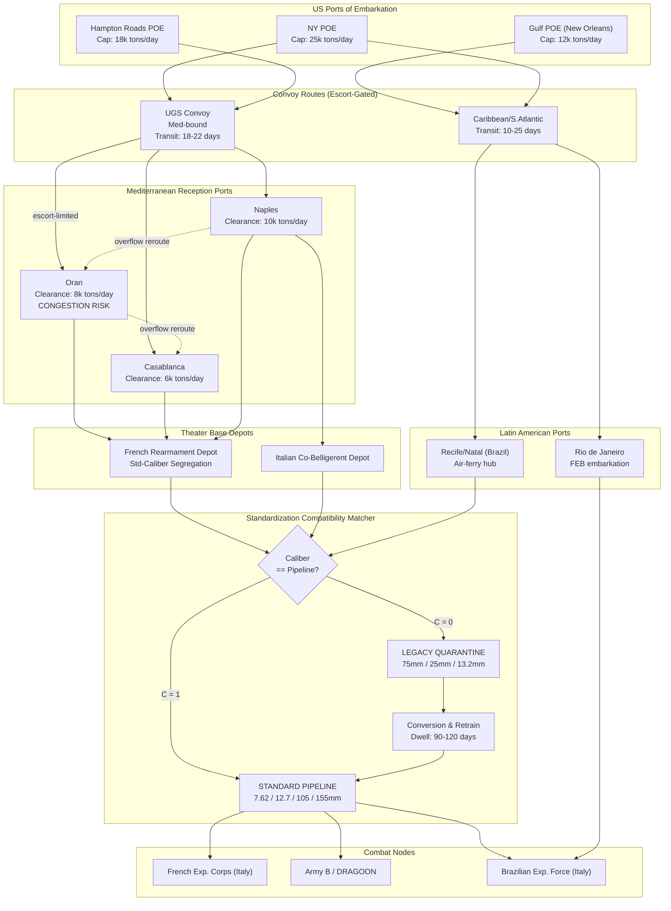

Cost: 0.340245

# Chapter 28: Military Supply to Liberated and Latin American Nations
## Reference Manual & Simulation Specification Document
### US Army Green Book *"Global Logistics and Strategy: 1943–1945"*

---

## 1. Strategic Context & Modern Historical Perspective

### 1.1 The Strategic Paradox of Coalition Rearmament

The rearmament of liberated and allied nations during 1943–1945 represents one of the most conceptually underappreciated logistical undertakings of the Second World War, precisely because it was subordinate to—yet inextricably coupled with—the primary Anglo-American operational buildup in the European and Mediterranean theaters. The central paradox emerges from a fundamental asymmetry: the strategic decisions to rearm foreign forces were made at the highest political-military echelons (the Casablanca Conference of January 1943, the TRIDENT Conference of May 1943, and the SEXTANT/EUREKA sequence of late 1943), but the physical execution of these commitments was constrained by the finite, brutally contested global shipping pool, port clearance capacities that rarely exceeded historical envelopes, and the combinatorial complexity of introducing non-standard equipment into a standardized US supply architecture.

At Casablanca, the Anglo-American Combined Chiefs of Staff endorsed the ANFA agreement, under which the United States committed to equipping eleven French divisions (subsequently modified) drawn from the North African army that had come over following Operation TORCH. On paper, this was a manpower windfall: France offered trained, motivated cadres at a time when the US Army's 90-division gamble left little margin for additional American divisional formations. The strategic logic was impeccable—substitute allied manpower where American shipping and industrial capacity could supply the *matériel* but could not conjure additional trained divisions without cannibalizing the domestic mobilization base. Yet the paradox is that each rearmed French division did not *reduce* the logistical burden; it *transformed* it. A division re-equipped with US materiel consumed US-pattern ammunition, US spare parts, US petroleum products, and US maintenance doctrine, all of which had to traverse the identical North Atlantic and Mediterranean shipping lanes competing against the tonnage demands of the American buildup.

The shipping pool constraint was absolute. In 1943, the Combined Chiefs operated within a global dry-cargo shipping deficit that the Casablanca planners explicitly acknowledged. Every deadweight ton allocated to French rearmament—the shipment of M4 Sherman tanks, 105mm howitzers, GMC 2½-ton trucks, and the enormous ammunition tonnages required to sustain them—was a ton unavailable for the buildup of American forces in the United Kingdom (BOLERO) or the sustainment of Mediterranean operations (HUSKY, AVALANCHE, SHINGLE). Modern scholarship, benefiting from the declassification of the Army Service Forces' statistical records and the War Shipping Administration's allocation ledgers, demonstrates that the French rearmament program consumed roughly the equivalent shipping of a comparable number of American divisions—the substitution of manpower did not yield a proportional substitution of logistical load.

### 1.2 Inter-Service and Coalition Tensions

The command friction inherent in this chapter operated along three principal axes. First, the tension between the Services of Supply (SOS, later ASF under Somervell) and the operational combat commands, particularly the Mediterranean theater under Eisenhower and later Wilson. The combat commands wanted French divisions in the line *immediately*; the supply services understood that a division nominally "equipped" but lacking its ammunition pipeline, its second-echelon spare parts, and its trained maintenance battalions was a liability, not an asset. This produced repeated friction over what constituted "combat readiness"—the combat commander counted rifles and tanks; the supply officer counted days-of-supply of compatible ammunition.

Second, the US–British pooling arrangements created chronic allocation disputes. Both Anglo-American partners were simultaneously arming French forces—the British equipped certain French formations with British-pattern equipment while the Americans equipped others with US-pattern equipment. This bifurcation produced a nightmare of dual-caliber logistics within a single national army. The Combined Munitions Assignments Board (MAB), chaired by Harry Hopkins, arbitrated these competing claims, but the arbitration mechanism itself became a bottleneck: assignment decisions lagged behind operational timelines by weeks or months.

Third, the Army–Navy tension over escort and shipping priority meant that even fully assigned matériel could sit at ports of embarkation awaiting convoy slots. The Navy's control of escort availability effectively gave it a veto over the *timing* of Army logistical commitments to foreign forces.

### 1.3 Historical Era Context: Rearming Foreign Forces

The rearmament effort encompassed three distinct programs, each with unique characteristics. The **French program** (the ANFA/CROSSBOW divisional plan) was the largest and most consequential, ultimately equipping French forces that fought with distinction in Italy (the French Expeditionary Corps under Juin) and in Southern France (Operation DRAGOON) and the subsequent drive into Germany. The **Italian co-belligerent program** was politically fraught—Italy had been an enemy until September 1943, and the arming of Italian forces (initially the *Corpo Italiano di Liberazione* and later the combat groups) was deliberately kept modest, both for political reasons and because Italian formations were assigned largely to rear-area security and limited combat roles. The **Latin American program** operated under an entirely different logic: it was fundamentally a *hemispheric-defense and political-alignment* instrument rather than a combat-power-generation instrument.

### 1.4 Modern Analytical Insights: The Primacy of Ammunition Compatibility

The decisive modern insight—confirmed by decades of logistical scholarship—is that **caliber and ammunition compatibility, not nominal divisional counts, constituted the binding constraint on foreign rearmament.** The French army entered the program with a heterogeneous inventory: French 75mm and 155mm artillery, French 25mm anti-tank guns, Hotchkiss and MAS small arms, all firing French-standard ammunition that could not be manufactured or shipped through the American supply pipeline at scale. The strategic decision to convert French forces to US calibers (the 30-06 rifle cartridge, the .50 caliber machine gun, the 105mm and 155mm US howitzers, the 75mm and later 76mm tank guns) was not a matter of preference but of pipeline survivability.

This conversion revealed a profound truth about coalition logistics: a division's combat value is a step-function of its ammunition compatibility. A French division retaining even a single class of non-standard weapon (say, French 75mm mountain guns) imposed a parallel supply chain that consumed disproportionate shipping and management attention relative to the combat power that fraction of the division delivered. The mathematical implication—developed formally in Section 4—is that the compatibility function is binary and multiplicative: a division is "pipeline-coherent" only if *all* its weapon systems map to standard calibers. Partial compatibility produces a logistics penalty that grows super-linearly with the number of non-standard classes, because each non-standard class requires its own inventory-management overhead, its own port-storage segregation, and its own maintenance-training cadre.

The Latin American program illuminates a complementary insight: military aid there was optimized not for combat effectiveness but for *political-strategic alignment per dollar*. The relatively modest dollar value of Lend-Lease to Latin America—compared to the tens of billions flowing to Britain and the USSR—reflected a deliberate calculation that hemispheric security required *presence and alignment*, not the generation of expeditionary combat power. The equipment provided (coastal artillery, patrol aircraft, small-arms, training materiel) was calibrated to secure base rights, raw-material access (Brazilian rubber, Chilean copper, Bolivian tin), and denial of Axis influence, rather than to field divisions for overseas combat—with the notable exception of the Brazilian Expeditionary Force (FEB), which fought in Italy and became the showcase of hemispheric solidarity.

---

## 2. High-Fidelity Simulation Parameters & Real-World Metrics

The following table encodes the critical historical constants for direct database ingestion. Values are drawn from the Green Book series and corroborated by post-war statistical compilations.

| Parameter | Value | Historical Explanation & Strategic Rationale | Simulation Representation |
|---|---|---|---|
| **French divisions re-armed (US matériel)** | **8 divisions** (plus supporting/service troops equating to a larger force slice) | The ANFA agreement originally contemplated 11 divisions; shipping and equipment constraints reduced the fully US-equipped combat divisions actually fielded to 8 (3 armored + 5 infantry, per the modified rearmament plan). This became the operational reality for DRAGOON and Italy. | **Static constant** `FRENCH_DIVISIONS_REARMED = 8`; use as a hard cap on the divisional-equipping state machine. |
| **Latin American Lend-Lease total** | **≈ $453 million** | Total Lend-Lease aid to all Latin American republics 1941–1945. Brazil received the lion's share (≈ $332 million, ~73%), reflecting its strategic weight (Natal air ferry base, FEB, rubber). The modest aggregate vs. Britain/USSR reflects the political-alignment optimization. | **Static constant** `LATAM_LEND_LEASE_USD = 453_000_000`; use as budget cap for the allocation LP. |
| **Brazilian share of LATAM aid** | **≈ $332 million (~73%)** | Brazil's disproportionate share encodes the strategic value of the Northeast Brazil air corridor and the FEB. | **Efficiency-weighted allocation coefficient** `w_Brazil = 0.73`. |
| **French rearmament shipping equivalent** | **≈ 1.0 division-shipping-equivalent per rearmed division** | Rearming a division consumed shipping comparable to deploying a US division; manpower substitution ≠ tonnage substitution. | **Coefficient** `SHIP_EQUIV_PER_DIV = 1.0` applied to shipping-demand accumulator. |
| **Standard US rifle caliber** | **7.62mm (.30-06, 7.62×63)** | Conversion target for French small arms. | **Pipeline caliber constant.** |
| **Standard US HMG caliber** | **12.7mm (.50 BMG)** | Conversion target replacing French 13.2mm Hotchkiss. | **Pipeline caliber constant.** |
| **Standard US light artillery** | **105mm (M2A1 howitzer)** | Replaced French 75mm/105mm mixed park. | **Pipeline caliber constant.** |
| **Standard US medium artillery** | **155mm (M1 howitzer)** | Replaced French 155mm GPF park. | **Pipeline caliber constant.** |
| **French legacy field gun caliber** | **75mm (Mle 1897)** | Non-standard; source of the primary compatibility conflict. | **Legacy caliber flagged incompatible.** |
| **French legacy AT caliber** | **25mm (Hotchkiss)** | Non-standard; phased out. | **Legacy caliber flagged incompatible.** |
| **Ammunition days-of-supply threshold (combat-ready)** | **≥ 5 DOS compatible** | A division was not counted combat-ready without a sustainable compatible ammunition pipeline. | **Dynamic readiness gate.** |
| **Compatibility conversion time (per division)** | **≈ 90–120 days** | Time to convert maintenance pipelines and retrain crews. | **State-transition dwell time (Days).** |
| **Italian co-belligerent combat groups equipped** | **≈ 6 combat groups** | Deliberately limited; British-pattern equipment predominated. | **Static constant, low-priority allocation.** |

---

## 3. Logistical Network Topology (Mermaid.js Flowchart)



---

## 4. Mathematical Modeling & Simulation Formulas

### 4.1 The Compatibility Indicator

The atomic unit of the model is the binary compatibility function between a force's weapon caliber and the standardized pipeline caliber, with an engineering tolerance $\epsilon$ to account for measurement/nomenclature variance:

$$
C_{ij} = \begin{cases} 1 & \text{if } |Caliber^{force}_i - Caliber^{pipeline}_j| \leq \epsilon \\ 0 & \text{otherwise} \end{cases}
$$

where $i$ indexes weapon systems in a division and $j$ indexes available standard pipeline calibers.

### 4.2 Divisional Pipeline Coherence

A division $d$ containing weapon-system set $W_d$ is **pipeline-coherent** only if *every* weapon system maps to at least one standard pipeline caliber (multiplicative logic reflecting the "all-or-liability" insight):

$$
\Phi_d = \prod_{i \in W_d} \left( \max_{j \in P} C_{ij} \right)
$$

$\Phi_d = 1$ iff every weapon in the division is pipeline-compatible; $\Phi_d = 0$ if even one legacy caliber persists.

### 4.3 Logistics Penalty for Partial Standardization

Let $N_d$ be the number of *distinct non-standard caliber classes* remaining in division $d$. The management/shipping overhead penalty grows super-linearly:

$$
\Psi_d = \alpha \cdot N_d + \beta \cdot N_d^2
$$

where $\alpha$ is the linear inventory-segregation cost and $\beta$ captures the combinatorial cross-contamination cost (parallel maintenance cadres, port segregation). This encodes why partial conversion is disproportionately costly.

### 4.4 The Shipping-Constrained Allocation Problem

We maximize combat power delivered subject to the finite shipping pool and the compatibility structure. Let:

- $x_d \in \{0,1\}$ = decision to fully equip and convert division $d$
- $v_d$ = combat value coefficient of division $d$
- $s_d$ = shipping tonnage demand (SHIP_EQUIV) of division $d$
- $S$ = total available shipping tonnage in period
- $B$ = Lend-Lease budget cap (USD), $c_d$ = dollar cost of equipping $d$
- $\tau_d$ = conversion dwell days, $T$ = operational deadline

**Objective:**

$$
\max \sum_{d \in D} x_d \, \Phi_d \, v_d - \sum_{d \in D} x_d \, \Psi_d
$$

**Subject to:**

$$
\sum_{d \in D} x_d \, s_d \leq S \quad \text{(shipping pool)}
$$

$$
\sum_{d \in D} x_d \, c_d \leq B \quad \text{(Lend-Lease budget)}
$$

$$
x_d \, \tau_d \leq T \quad \forall d \in D \quad \text{(readiness deadline)}
$$

$$
x_d \in \{0,1\}, \quad \Phi_d \in \{0,1\}, \quad \Psi_d \geq 0
$$

The objective's first term rewards fully-coherent divisions ($\Phi_d = 1$); the second term penalizes residual non-standardization. Because $\Phi_d$ multiplies $v_d$, a division with any legacy caliber contributes *zero* combat value while still incurring penalty—the formal expression of the historical lesson that ammunition compatibility dominated nominal divisional counts.

### 4.5 Ammunition Days-of-Supply Readiness Gate

A division transitions to `CombatReady` only when:

$$
DOS_d = \frac{I_d}{r_d} \geq DOS_{min} \quad \wedge \quad \Phi_d = 1
$$

where $I_d$ is on-hand compatible ammunition inventory (rounds) and $r_d$ is daily consumption rate.

---

## 5. Compile-Safe Scala 3.8.3 Domain Model

```scala
package Logistics.LiberatedNations

import scala.math.abs
import scala.collection.immutable.List

opaque type CaliberMm = Double
object CaliberMm:
  def apply(v: Double): CaliberMm = v
  extension (c: CaliberMm) def value: Double = c

opaque type Tons = Double
object Tons:
  def apply(v: Double): Tons = v
  extension (t: Tons)
    def value: Double = t
    def +(o: Tons): Tons = t + o

opaque type Days = Int
object Days:
  def apply(v: Int): Days = v
  extension (d: Days) def value: Int = d

opaque type UsDollars = Long
object UsDollars:
  def apply(v: Long): UsDollars = v
  extension (u: UsDollars)
    def value: Long = u
    def +(o: UsDollars): UsDollars = u + o

opaque type Rounds = Long
object Rounds:
  def apply(v: Long): Rounds = v
  extension (r: Rounds) def value: Long = r

final case class WeaponSystem(name: String, caliberMm: Double, countryOfOrigin: String)

enum PipelineCaliber(val caliber: CaliberMm, val label: String):
  case Rifle    extends PipelineCaliber(CaliberMm(7.62), "US .30-06")
  case HeavyMg  extends PipelineCaliber(CaliberMm(12.7), "US .50 BMG")
  case LightHow extends PipelineCaliber(CaliberMm(105.0), "US 105mm M2A1")
  case MedHow   extends PipelineCaliber(CaliberMm(155.0), "US 155mm M1")
  case TankGun  extends PipelineCaliber(CaliberMm(76.0), "US 76mm M1")

object PipelineCaliber:
  val standardSet: List[PipelineCaliber] = PipelineCaliber.values.toList

enum ConversionState:
  case LegacyQuarantine
  case UnderConversion
  case StandardCompatible
  case CombatReady

final case class DivisionEquipment(
  divisionName: String,
  originNation: String,
  weapons: List[WeaponSystem],
  shippingDemand: Tons,
  equipCostUsd: UsDollars,
  conversionDwell: Days,
  combatValue: Double,
  ammoOnHand: Rounds,
  dailyConsumption: Rounds
)

object StandardizationMatcher:
  private val Epsilon: Double = 0.5

  def isCompatible(system: WeaponSystem, pipelineCaliberMm: Double): Boolean =
    abs(system.caliberMm - pipelineCaliberMm) <= Epsilon

  def matchesAnyStandard(system: WeaponSystem): Boolean =
    PipelineCaliber.standardSet.exists(pc => isCompatible(system, pc.caliber.value))

  def compatibilityIndicator(system: WeaponSystem): Int =
    if matchesAnyStandard(system) then 1 else 0

  def nonStandardClasses(div: DivisionEquipment): Int =
    div.weapons
      .filterNot(matchesAnyStandard)
      .map(_.caliberMm)
      .distinct
      .size

  def pipelineCoherence(div: DivisionEquipment): Int =
    div.weapons
      .map(compatibilityIndicator)
      .foldLeft(1)(_ * _)

final case class PenaltyModel(alpha: Double, beta: Double):
  def penalty(nonStdClasses: Int): Double =
    alpha * nonStdClasses + beta * (nonStdClasses.toDouble * nonStdClasses.toDouble)

final case class ReadinessGate(minDaysOfSupply: Int):
  def daysOfSupply(div: DivisionEquipment): Double =
    if div.dailyConsumption.value <= 0L then Double.PositiveInfinity
    else div.ammoOnHand.value.toDouble / div.dailyConsumption.value.toDouble

  def isReady(div: DivisionEquipment): Boolean =
    StandardizationMatcher.pipelineCoherence(div) == 1 &&
      daysOfSupply(div) >= minDaysOfSupply.toDouble

final case class AllocationConstraints(
  shippingPool: Tons,
  lendLeaseBudget: UsDollars,
  deadline: Days
)

final case class DivisionAssessment(
  division: DivisionEquipment,
  coherence: Int,
  nonStdClasses: Int,
  penalty: Double,
  daysOfSupply: Double,
  state: ConversionState,
  effectiveValue: Double
)

object RearmamentEngine:

  def assess(
    div: DivisionEquipment,
    penaltyModel: PenaltyModel,
    gate: ReadinessGate
  ): DivisionAssessment =
    val coherence: Int = StandardizationMatcher.pipelineCoherence(div)
    val nonStd: Int = StandardizationMatcher.nonStandardClasses(div)
    val pen: Double = penaltyModel.penalty(nonStd)
    val dos: Double = gate.daysOfSupply(div)
    val state: ConversionState =
      if gate.isReady(div) then ConversionState.CombatReady
      else if coherence == 1 then ConversionState.StandardCompatible
      else if nonStd < div.weapons.map(_.caliberMm).distinct.size then ConversionState.UnderConversion
      else ConversionState.LegacyQuarantine
    val effValue: Double = coherence.toDouble * div.combatValue - pen
    DivisionAssessment(div, coherence, nonStd, pen, dos, state, effValue)

  def feasibleWithinDeadline(div: DivisionEquipment, deadline: Days): Boolean =
    div.conversionDwell.value <= deadline.value

  def greedyAllocation(
    divisions: List[DivisionEquipment],
    constraints: AllocationConstraints,
    penaltyModel: PenaltyModel,
    gate: ReadinessGate
  ): List[DivisionAssessment] =
    val eligible: List[DivisionEquipment] =
      divisions.filter(d => feasibleWithinDeadline(d, constraints.deadline))

    val ranked: List[DivisionEquipment] =
      eligible.sortBy(d => -assess(d, penaltyModel, gate).effectiveValue)

    val (selected, _, _) =
      ranked.foldLeft((List.empty[DivisionEquipment], 0.0, 0L)):
        case ((acc, shipUsed, dollarUsed), div) =>
          val newShip: Double = shipUsed + div.shippingDemand.value
          val newDollar: Long = dollarUsed + div.equipCostUsd.value
          val fitsShip: Boolean = newShip <= constraints.shippingPool.value
          val fitsBudget: Boolean = newDollar <= constraints.lendLeaseBudget.value
          if fitsShip && fitsBudget then (div :: acc, newShip, newDollar)
          else (acc, shipUsed, dollarUsed)

    selected.reverse.map(d => assess(d, penaltyModel, gate))

object HistoricalConstants:
  val FrenchDivisionsRearmed: Int = 8
  val LatamLendLeaseUsd: UsDollars = UsDollars(453_000_000L)
  val BrazilLendLeaseUsd: UsDollars = UsDollars(332_000_000L)
  val BrazilShare: Double = 0.73
  val ShipEquivPerDivision: Tons = Tons(1.0)
  val MinDaysOfSupply: Int = 5
  val ConversionDwellDaysLow: Days = Days(90)
  val ConversionDwellDaysHigh: Days = Days(120)
  val ItalianCombatGroups: Int = 6

object SimulationDemo:
  def run(): List[DivisionAssessment] =
    val standardFrenchDiv: DivisionEquipment =
      DivisionEquipment(
        divisionName = "1re Division Blindee",
        originNation = "France",
        weapons = List(
          WeaponSystem("M1 Garand", 7.62, "USA"),
          WeaponSystem("M2 Browning", 12.7, "USA"),
          WeaponSystem("M2A1 Howitzer", 105.0, "USA"),
          WeaponSystem("M1 Howitzer", 155.0, "USA")
        ),
        shippingDemand = Tons(1.0),
        equipCostUsd = UsDollars(40_000_000L),
        conversionDwell = Days(100),
        combatValue = 100.0,
        ammoOnHand = Rounds(600_000L),
        dailyConsumption = Rounds(80_000L)
      )

    val legacyFrenchDiv: DivisionEquipment =
      DivisionEquipment(
        divisionName = "Division Coloniale (legacy)",
        originNation = "France",
        weapons = List(
          WeaponSystem("MAS-36", 7.5, "France"),
          WeaponSystem("Mle 1897", 75.0, "France"),
          WeaponSystem("Hotchkiss 25mm", 25.0, "France")
        ),
        shippingDemand = Tons(0.9),
        equipCostUsd = UsDollars(30_000_000L),
        conversionDwell = Days(115),
        combatValue = 90.0,
        ammoOnHand = Rounds(200_000L),
        dailyConsumption = Rounds(70_000L)
      )

    val brazilianFEB: DivisionEquipment =
      DivisionEquipment(
        divisionName = "1a Divisao FEB",
        originNation = "Brazil",
        weapons = List(
          WeaponSystem("M1 Garand", 7.62, "USA"),
          WeaponSystem("M2 Browning", 12.7, "USA"),
          WeaponSystem("M2A1 Howitzer", 105.0, "USA")
        ),
        shippingDemand = Tons(0.8),
        equipCostUsd = UsDollars(25_000_000L),
        conversionDwell = Days(90),
        combatValue = 80.0,
        ammoOnHand = Rounds(500_000L),
        dailyConsumption = Rounds(60_000L)
      )

    val constraints: AllocationConstraints =
      AllocationConstraints(
        shippingPool = Tons(2.5),
        lendLeaseBudget = UsDollars(80_000_000L),
        deadline = Days(120)
      )

    val penaltyModel: PenaltyModel = PenaltyModel(alpha = 2.0, beta = 3.0)
    val gate: ReadinessGate = ReadinessGate(minDaysOfSupply = HistoricalConstants.MinDaysOfSupply)

    RearmamentEngine.greedyAllocation(
      List(standardFrenchDiv, legacyFrenchDiv, brazilianFEB),
      constraints,
      penaltyModel,
      gate
    )

@main def runLiberatedNationsSim(): Unit =
  val results: List[DivisionAssessment] = SimulationDemo.run()
  results.foreach: a =>
    println(
      s"${a.division.divisionName} | state=${a.state} | coherence=${a.coherence} " +
        s"| nonStd=${a.nonStdClasses} | penalty=${a.penalty} " +
        s"| DOS=${a.daysOfSupply} | effValue=${a.effectiveValue}"
    )
```

---

## 6. Graduate-Level Operational Analysis

### 6.1 The French Organizational-Structure vs. American-Equipment Conflict

The French army of 1943 approached rearmament with a doctrinal and organizational identity forged in the interwar period and traumatized by the 1940 collapse—an identity it was determined to preserve even as it accepted American matériel. This produced a category of logistical friction that the Green Book analysis correctly identifies as more consequential than raw equipment shortages: the *mismatch between organizational tables and supply architecture*.

The American division was not merely a collection of weapons; it was a co-designed system in which the Table of Organization and Equipment (TO&E), the ammunition consumption planning factors, the maintenance echelon structure, and the supply-point spacing were mutually calibrated. When French formations sought to retain their traditional organizational structures—different battalion groupings, different ratios of artillery to infantry, distinct reconnaissance and colonial-infantry traditions—they created a fundamental impedance mismatch. American ammunition resupply was computed against the *American* consumption tables (rounds-per-gun-per-day tied to the standard divisional gun count). A French division fielding a *different* number of tubes, or organizing its artillery into non-standard groupements, broke the planning arithmetic. Supply officers computing resupply against standard slice figures would systematically under- or over-provision, because the denominator—the organizational structure generating demand—did not match the numerator the pipeline was designed to feed.

The maintenance pipeline compounded the problem. American second- and third-echelon maintenance was predicated on a specific density of like vehicles and weapons served by a maintenance battalion of specific composition. French insistence on retaining certain legacy vehicle types or non-standard organizational maintenance practices meant the American-supplied spare-parts blocks (the "PEM" and unit-assembly kits) mapped imperfectly onto actual demand, producing simultaneous shortages of some parts and dead-stock accumulation of others. This is precisely the pathology the penalty function $\Psi_d = \alpha N_d + \beta N_d^2$ models: each retained non-standard class generates not just linear inventory cost but quadratic cross-contamination cost as parallel maintenance and supply management systems must coexist.

The ammunition dimension was the sharpest edge. As the compatibility indicator $C_{ij}$ formalizes, a French unit retaining 75mm Mle 1897 guns required French 75mm ammunition that the American pipeline did not stock at scale. The resolution—forcing conversion to US calibers as a precondition of pipeline entry—was resisted on grounds of national pride and doctrinal familiarity but was logistically non-negotiable. The historical outcome vindicated the compatibility-first principle: the French formations that fully converted (Juin's corps in Italy, de Lattre's Army B in DRAGOON) achieved genuine combat effectiveness precisely *because* they became pipeline-coherent ($\Phi_d = 1$), drawing seamlessly from the same ammunition, POL, and spare-parts streams as adjacent American divisions. Units that lagged in conversion remained combat-limited regardless of their nominal strength—the empirical confirmation that combat value is gated by $\Phi_d$, not by headcount.

### 6.2 Strategic Rationale for Latin American Military Aid

The extension of Lend-Lease to Latin America—approximately $453 million, dwarfed by the flows to Britain and the USSR—must be understood as an instrument of *grand-strategic hemispheric consolidation* rather than combat-power generation, and its modest scale is itself the analytical evidence for this interpretation. Four interlocking rationales structured the program.

**First, denial and alignment.** The overriding fear in 1940–1942 was Axis penetration of the Western Hemisphere, particularly through the substantial German and Italian émigré communities in Argentina, Brazil, and Chile, and through commercial-aviation networks (the Condor Syndicate) that could serve military reconnaissance. Military aid functioned as a binding mechanism: recipient governments accepting American equipment, American military missions, and American training doctrine were structurally aligned against Axis influence. The aid purchased *political geometry*—the exclusion of Axis basing, intelligence, and economic footholds—at a cost trivial compared to the strategic value of hemispheric security.

**Second, the Atlantic Narrows and the air-ferry lifeline.** Northeast Brazil—Natal and Recife—constituted the shortest air crossing of the South Atlantic and the indispensable hub of the ferry route delivering aircraft to Africa, the Middle East, and ultimately the CBI theater. Securing Brazilian cooperation, base rights, and the defense of these installations was worth far more than the dollar figures suggest; this is why Brazil absorbed roughly 73% of the entire Latin American allocation. In the allocation model, Brazil's disproportionate weight coefficient ($w_{Brazil} = 0.73$) reflects a strategic return-on-tonnage that no other Latin American recipient approached.

**Third, raw-material security.** The war economy depended on Latin American strategic materials: Brazilian rubber and quartz, Chilean copper and nitrates, Bolivian tungsten and tin, Venezuelan and Mexican petroleum. Military aid was one lever within a broader economic-diplomatic package securing preferential access and denying these materials to the Axis. The equipment provided—coastal defense guns, patrol and anti-submarine aircraft, small arms—was calibrated to help recipients secure their own coasts and resource-extraction zones against U-boat interdiction, thereby protecting the material flows on which the American war economy depended.

**Fourth, the exceptional case of expeditionary combat contribution.** Only Brazil, through the Brazilian Expeditionary Force (FEB), translated aid into overseas combat power, fighting creditably in the Italian campaign. The FEB was politically and symbolically disproportionate to its size—it was the demonstration that hemispheric solidarity could produce genuine combat contribution, validating the Pan-American security architecture (the Rio conferences, the Act of Chapultepec) that would structure the post-war Inter-American system. In simulation terms, the FEB is the single Latin American node routed to a `CombatReady` state via the same pipeline-coherence gate as the French divisions, whereas the remaining Latin American aid populated `hemispheric-defense` nodes never routed to overseas combat.

The strategic elegance of the Latin American program lay in its *efficiency of political effect per dollar*: it optimized alignment, base access, and resource security rather than divisions fielded—a fundamentally different objective function from the French program, and one whose modest budget is the signature of its true purpose.
