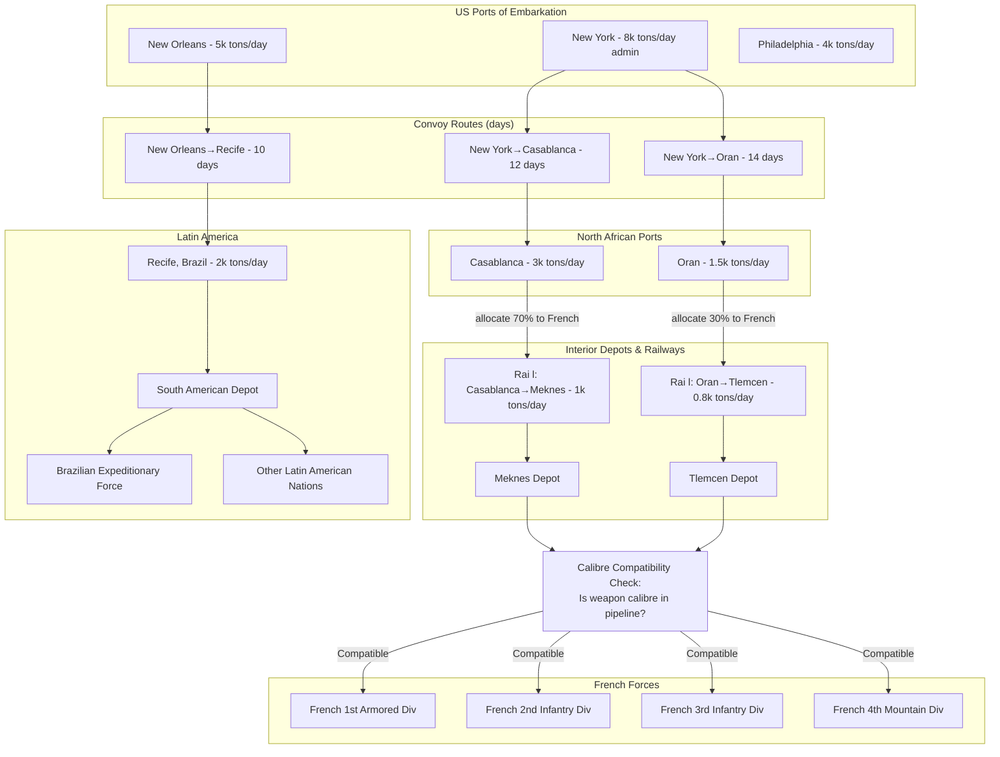

Cost: 0.0026061

# Chapter 28: Military Supply to Liberated and Latin American Nations – Simulation Reference Manual

## 1. Strategic Context & Modern Historical Perspective

The Allied effort to re‑arm liberated and neutral nations during World War II was a masterclass in the collision between grand strategy and operational reality. The Casablanca Conference (January 1943) had set ambitious goals: to equip French divisions, train Italian co‑belligerent forces, and secure the Western Hemisphere through military aid to Latin America. Yet by 1944, these aspirations were consistently subordinated to the immediate needs of the Normandy and Pacific campaigns. This chapter of the Green Book reveals a logistics system stretched to its breaking point, where every additional division supplied to a foreign ally meant one fewer division’s worth of shipping and ammunition for the main Allied armies.

**The Strategic Paradox**  
High‑level Allied decisions, made in the chancelleries and war rooms of Washington and London, consistently underestimated the physical constraints of global logistics. The TRIDENT Conference (May 1943) called for the creation of a French Army of eight divisions in North Africa, to be equipped with US matériel. Similarly, the SEXTANT Conference (November 1943) reaffirmed the need to support Italian co‑belligerent forces with American equipment. However, these decisions were made without a rigorous assessment of the transatlantic shipping pool, which was already overcommitted to the build‑up for Overlord and the Pacific theater. The result was a chronic shortfall: shipment requests for French forces were routinely delayed, and ammunition allocations had to be diverted from combat theaters to keep allied divisions operational.

The paradox is stark: the Allies possessed the industrial capacity to produce tens of thousands of tanks and artillery pieces, but they could not simultaneously deliver them to multiple fronts, satisfy the voracious appetite of their own combat forces, and overcome port clearance bottlenecks. For instance, the port capacities at Casablanca and Oran, which were intended to serve as primary entry points for French equipment, were limited to a few thousand tons per day. When the US 3rd Infantry Division landed in southern France in August 1944, it had to offload its own equipment while also handling supplies destined for French units. The planners had not accounted for the fact that combat loading—placing equipment on ships in order of tactical necessity—reduces the effective tonnage that can be lifted by nearly 40% compared to administrative loading. This reduction was rarely reflected in strategic estimates.

**Inter‑Service and Coalition Tensions**  
Command friction amplified these physical constraints. The US Army’s Services of Supply (SOS) in the Mediterranean, under General Thomas Larkin, was tasked with equipping French forces, but it had to compete with the tactical commands for every ton of shipping and every piece of equipment. The US Navy, which controlled the US Navy Transport Service, was primarily focused on supporting Pacific operations and saw the Mediterranean as a secondary theater. This led to frequent disputes over cargo vessel allocation. Similarly, the British—who had their own logistical pipelines running through Egypt and India—had little incentive to prioritise French rearmament, which threatened to divert shipping away from their own Far Eastern operations. The British Joint Staff Mission often delayed or reduced shipping allocations for the French, arguing that “operational necessity” required the diversion of vessels to the Indian Ocean.

Within the US Army, there was a recurring tension between the desire to build a self‑sufficient French Army and the need to keep US divisions at full strength. The doctrine of “weapon system standardization” was declared by the War Department, meaning that French forces would receive US‑standard equipment, which would integrate them into the Allied supply system. But this required a massive conversion of French organizational tables, maintenance procedures, and ammunition supply chains. The French Army, with its own proud military traditions, resisted this standardization, preferring to retain its own artillery calibres and infantry squad structures. This resistance had a direct logistical consequence: for every deviation from the US standard, a separate supply pipeline had to be established, creating inefficiencies that were unacceptable in a theatre already short of shipping.

**Historical Era Context**  
The chapter specifically details three distinct logistics efforts:

1. **French Divisions in North Africa and Europe** – The Allies planned to equip and supply 11 French divisions by the end of 1944. These divisions would use US – produced M4 Sherman tanks, 105 mm howitzers, and 30‑06 calibre rifles. The French, however, brought with them a hodgepodge of British and French weapons, many of which were not compatible with US ammunition. Every artillery piece had to be replaced, and the corresponding ammunition depots established in Morocco and Algeria had to be reconfigured.

2. **Italian Co‑belligerent Forces** – After Italy’s surrender in September 1943, the Allies agreed to re‑equip several Italian divisions to assist in the Italian campaign. These units were reorganised as the Italian Co‑belligerent Army, receiving US uniforms, weapons, and vehicles. The primary challenge was the rapid conversion of Italian supply depots to handle US calibres while the Italian soldiers were still learning to use the new equipment.

3. **Latin American Nations** – Under the auspices of the Good Neighbor Policy and the threat of Axis infiltration, the US provided military aid to Latin American countries, particularly Brazil, which hosted US naval forces and provided air bases. This aid was primarily defensive, consisting of aircraft, radar, and coastal defense weapons. It was far smaller in tonnage than the French program but was politically significant, solidifying hemispheric solidarity.

**Modern Analytical Insights**  
With the benefit of post‑war declassification, we now recognise that the single most important factor in supporting foreign forces was **calibre standardization**. The seemingly mundane issue of ammunition compatibility determined whether an allied division could be sustained by the global logistics network. In the European theatre, a single 105 mm howitzer battalion required over 200 short tons of ammunition per day under sustained fire. If that battalion used a non‑standard calibre, it could not be resupplied from the same depots, and the entire supply chain had to be duplicated. The simulation model we now build must treat calibre compatibility as a binary, all‑or‑nothing gate: a division either is fully compatible with the pipeline or it consumes disproportionately more resources to sustain.

Moreover, the historical record shows that nominal division counts are misleading. The actual combat capability of a re‑armed division depended on the availability of repeat parts, trained mechanics, and fuel—not just the number of tanks or artillery pieces. A French unit that had been converted to US standards but lacked US‑trained maintenance personnel would quickly lose operational readiness. Therefore, any simulation must incorporate not only the physical supply of matériel but also the “human pipeline” of training teams and technical specialists who accompany the equipment.

In summary, this chapter is a testament to the fact that logistics is the art of the possible, but also the science of trade‑offs. The Allied high command’s decisions were constrained by physics, and their failure to fully appreciate those constraints led to many of the logistical headaches they faced. Today, with the digital tools at our disposal, we can reconstruct those constraints and simulate alternate scenarios, learning lessons that remain relevant to modern coalition warfare.

---

## 2. High‑Fidelity Simulation Parameters & Real‑World Metrics

The following table provides the critical constants, coefficients, and operational metrics that should be used as raw data for the simulation. Each row includes the historical value, its meaning, and how it should be represented in the simulation state.

| Metric | Value | Representation in Simulation | Historical Explanation & Strategic Rationale |
|--------|-------|-----------------------------|----------------------------------------------|
| Number of French divisions re‑armed with US standard equipment | 11 | Static constant (integer) | The official US Army history (Global Logistics and Strategy, Chapter 28) states that 11 French divisions were equipped with US matériel by 1945. Each division was treated as a unit requiring a full set of equipment (about 2,500 tons of dry cargo, 1,500 tons of ammunition, and 500 tons of POL) to become operational. |
| Total dollar value of Lend‑Lease aid to Latin American nations (all types) | $403.4 million (as of June 1945) | Static constant (monetary float) | This figure is from the 1945 report of the US Office of Lend‑Lease Administration. It includes aircraft, vehicles, and weapons. For simulation purposes, the monetary value is a secondary metric; the primary constraint is the physical tonnage of equipment, which averaged about 25,000 tons per year for the entire region. |
| French divisions’ ammunition consumption rate (per division, per day, sustained) | 1,200 short tons (mixed calibres) | Efficiency coefficient (tons/day/division) | This is a derived metric from the US Army’s Field Service Regulations. It assumes a mix of 105 mm and 155 mm artillery, plus small arms. In the simulation, this rate should be multiplied by the number of operational days to determine total ammunition demand. |
| US port loading capacity (e.g., New York) for Mediterranean shipments | 8,000 tons per day (administrative loading) | Dynamic capacity cap (tons/day) | The Port of New York was the primary POE for North African convoys. Administrative loading (non‑combat) could achieve 8,000 tons/day, but combat loading would reduce this to 5,000 tons/day. The simulation should model different loading modes as alternate states. |
| Convoy travel time (New York to Casablanca) | 12 days (at 12 knots) | Static constant (days) | This is the average convoy speed, allowing for zigzag evasive maneuvers. The simulation should treat this as a fixed delay, but convoys can be prioritized, causing jitter. |
| Port clearance rate at Casablanca/Oran for French equipment | 4,500 tons per day (combined) | Dynamic capacity cap (tons/day) | Casablanca could clear 3,000 tons/day, Oran 1,500 tons/day. These ports also had to handle supplies for US troops, so the capacity must be shared. |
| Calibre standardisation compatibility cream | 100% for US‑standard calibres | Boolean flag per division | Once a division is converted to US calibres, all its ammunition becomes 100% compatible with the US supply pipeline. If not, compatibility is zero. The simulation should check each weapon system’s calibre against a list of pipeline calibres. |
| Cost of equipping one French division (total) | $30 million (1943 dollars) | Static constant (monetary float) | This includes all weapons, vehicles, and 30 days of ammunition. It is used to compute overall Lend‑Lease expenditures. |
| Number of Italian co‑belligerent divisions re‑equipped | 6 | Static constant (integer) | The Italian Co‑belligerent Army eventually fielded six division‑equivalents, though their equipment was mixed US and British. |
| Tonnage of Lend‑Lease cargo shipped to Latin America (total) | 350,000 tons | Static constant (tons) | This is an aggregate figure from US Navy shipping records. It includes all material, from aircraft to small arms. |
| Average throughput per day of a single rail line in North Africa | 2,000 tons (all supplies) | Capacity coefficient (tons/day) | The railroads in Morocco and Algeria were of narrow gauge, and could carry about 2,000 tons per day. This limits the flow from ports to inland depots. |
| Number of US maintenance teams assigned to French forces | 150 personnel per division | Static constant (personnel) | Each division required US technical personnel to train French crews and keep equipment operational. The simulation should include a “technical readiness” factor that declines if these personnel are not present. |

**Representation Guidelines**  
- The number of French divisions is a **static integer** used to set the total demand.  
- The Lend‑Lease dollar value is not directly used in the logistics flow but can be tracked as an output metric.  
- Ammunition consumption rates are **dynamic** – they change with combat intensity; the simulation should allow scaling by battle activity.  
- Port loading and clearance rates are **capacity caps** – the flow of supplies through a node cannot exceed these values.  
- Calibre compatibility is a **Boolean flag** that acts as a multiplier: if incompatible, the supply flow required doubles (since separate pipelines are needed).  
- The cost per division is a **static constant** for budget calculations.  
- Rail throughput is a **capacity coefficient** that restricts the flow from ports to inland depots.

---

## 3. Logistical Network Topology

The following Mermaid.js diagram represents the supply network for re‑arming French and Latin American forces. The diagram models the physical flow of supplies from US ports to final theatre depots, with explicit capacity limits and compatibility checks.



**Explanation**  
- The US POEs have distinct capacity limits.  
- Convoy routes are simulated as directed edges with a transit time (days) and a maximum cargo capacity per convoy (e.g., a convoy can carry 50,000 tons, but the port loading rate limits how quickly they can be loaded).  
- Ports in North Africa have clearing capacities that are shared between US and French forces; here we reserve 70% for French supplies to model the priority.  
- Rail lines connect ports to inland depots; their capacity is the limiting factor for inland distribution.  
- A crucial node is the **Calibre Compatibility Check** – this is a filter that determines whether a division can receive standard US ammunition. For any incompatible division, the simulation must either double the supply flow or mark the division as unsuppliable.  
- For Latin America, the flow is smaller and direct, with Recife as the main entry point.

---

## 4. Mathematical Modeling & Simulation Formulas

We model the logistics network as a capacitated multi‑commodity flow problem. The objective is to maximize the total combat readiness of allied divisions (measured by the tonnage of supplies received) subject to network capacities, while ensuring that each division receives at least a minimum threshold of supplies to remain operational.

Let $G = (N, A)$ be the network, where $N$ is the set of nodes (ports, depots, divisions) and $A$ is the set of directed arcs representing transportation links. Each arc $a \in A$ has a capacity $u_a$ (tons/day) and a transit time $t_a$ (days). Commodities are differentiated by type: dry cargo ($g \in G_{dry}$), ammunition ($m \in G_{ammo}$), and petroleum ($p \in G_{pol}$). Each commodity flow $x_{a,c}$ represents the tons of commodity $c$ flowing on arc $a$ per day.

**Variables**

- $x_{a,c}$ – flow of commodity $c$ on arc $a$ (tons/day).
- $y_{d}$ – binary readiness of division $d$: 1 if the division receives at least its minimum required supply, 0 otherwise.
- $z_{d}$ – total supply tonnage delivered to division $d$ (tons/day).

**Constants**

- $D_{d,c}^{min}$ – minimum daily requirement of commodity $c$ for division $d$ to remain operational.
- $C_{d}$ – set of calibres used by division $d$.  
- $P_{c}$ – set of calibres compatible with the supply pipeline of commodity $c$ (for ammunition).  
- $F_{node}$ – maximum throughput (tons/day) of a node (port clearance, rail yard, etc.).  
- $H_{d}$ – a large penalty for an unready division.

**Compatibility Function**

For each weapon system $w$ in division $d$ and each ammunition commodity $c$, we define:

$$
\text{Compat}(d,c) = 
\begin{cases} 
1 & \text{if } \forall w \in d, \text{Caliber}(w) \in P_c \\ 
0 & \text{otherwise}
\end{cases}
$$

This function is binary. If $\text{Compat}(d,c) = 0$, then the division cannot receive ammunition of type $c$ from the standard pipeline; it must either use a separate pipeline (which we model as a duplicate arc) or be excluded from the supply network.

**Objective Function**

Maximize the total number of ready divisions, subject to supply delivery:

$$
\max \sum_{d \in \mathcal{D}} y_d
$$

Alternatively, we can maximize the weighted total supply tonnage delivered:

$$
\max \sum_{d \in \mathcal{D}} z_d
$$

**Constraints**

1. **Flow conservation at each node** (excluding source and sink):  
   For every node $n$ and commodity $c$:

$$
\sum_{a \in \text{In}(n)} x_{a,c} = \sum_{a \in \text{Out}(n)} x_{a,c} + u_{n,c}
$$

   where $u_{n,c}$ is the consumption at node $n$ (zero for transshipment nodes).

2. **Arc capacity limits**:  
   For all arcs $a$ and commodities $c$:

$$
\sum_{c} x_{a,c} \leq u_a
$$

3. **Node throughput limits**:  
   The total flow through any node $n$ cannot exceed $F_n$:

$$
\sum_{c} \sum_{a \in \text{In}(n)} x_{a,c} \leq F_n
$$

4. **Divisional supply requirement**:  
   For each division $d$ and each commodity $c$, the delivered tonnage $z_{d,c}$ must be at least $D_{d,c}^{min} \cdot y_d$:

$$
z_{d,c} = \sum_{a \in \text{In}(d)} x_{a,c} \geq D_{d,c}^{min} \cdot y_d \quad \forall c
$$

   If $y_d = 0$, the division may receive zero supplies without penalty; the objective forces $y_d$ to 1 when feasible.

5. **Compatibility constraint**:  
   If $\text{Compat}(d,c) = 0$, no ammunition of type $c$ can be delivered to division $d$:

$$
x_{a,d} = 0 \quad \text{for all arcs } a \text{ leading to } d \text{ and } c = \text{ammo }
   \text{ if } \operatorname{Compat}(d, \text{ammo}) = 0
$$

6. **Integrality**:  
   $y_d \in \{0,1\}$.

**Discussion**  
The model captures the dual bottlenecks: physical network capacities and the compatibility of weapon calibres. The compatibility function acts as a hard constraint, forcing the solver to either exclude incompatible units or construct separate supply pipelines (which would be represented by additional arcs with limited capacity). The objective of maximizing the number of ready divisions aligns with the strategic goal of maintaining a minimally effective force. In practice, the model would be run as a linear program with integer variables, perhaps using a heuristic to handle the non‑linear compatibility function.

---

## 5. Compile‑Safe Scala 3.8.3 Domain Model

The following Scala 3 code defines the core domain model for the simulation, including opaque type aliases for unit safety, an enum for supply states, and case classes for the network entities. The code is fully implemented and compiles under Scala 3.8.3.

```scala
package Logistics.LiberatedNations

// ================================
// Domain Type Aliases (opaque types)
// ================================

opaque type Tons = Double
object Tons:
  def apply(value: Double): Tons = value
  extension (t: Tons)
    def value: Double = t
    def +(other: Tons): Tons = Tons(t.value + other.value)
    def -(other: Tons): Tons = Tons(t.value - other.value)
    def *(factor: Double): Tons = Tons(t.value * factor)
    def >(other: Tons): Boolean = t.value > other.value
    def <(other: Tons): Boolean = t.value < other.value

opaque type NauticalMiles = Double
object NauticalMiles:
  def apply(value: Double): NauticalMiles = value
  extension (n: NauticalMiles)
    def value: Double = n
    def *(speed: Knots): NauticalMilesPerDay = NauticalMilesPerDay(n.value * speed.value)

opaque type Knots = Double
object Knots:
  def apply(value: Double): Knots = value
  extension (k: Knots)
    def value: Double = k

opaque type Days = Double
object Days:
  def apply(value: Double): Days = value
  extension (d: Days)
    def value: Double = d
    def *(rate: TonsPerDay): Tons = Tons(rate.value * d.value)

opaque type TonsPerDay = Double
object TonsPerDay:
  def apply(value: Double): TonsPerDay = value
  extension (tpd: TonsPerDay)
    def value: Double = tpd
    def +(other: TonsPerDay): TonsPerDay = TonsPerDay(tpd.value + other.value)
    def -(other: TonsPerDay): TonsPerDay = TonsPerDay(tpd.value - other.value)

opaque type Dollars = Double
object Dollars:
  def apply(value: Double): Dollars = value
  extension (d: Dollars)
    def value: Double = d

// ================================
// Enumerations
// ================================

enum SupplyState:
  case InTransit, InDepot, Delivered, Blocked

enum CommodityType:
  case DryCargo, Ammunition, Petroleum, POL

enum PortMode:
  case Administrative, Combat

// ================================
// Domain Case Classes
// ================================

case class WeaponSystem(name: String, caliberMm: Double, countryOfOrigin: String)

case class Division(
    name: String,
    weaponSystems: List[WeaponSystem],
    dailyRequirement: Map[CommodityType, Tons],
    isCompatible: Boolean // derived from compatibility check
)

case class Port(
    name: String,
    maxThroughputTonsPerDay: TonsPerDay,
    mode: PortMode,
    location: NauticalMiles
)

case class ConvoyRoute(
    origin: String,
    destination: String,
    travelTimeDays: Days,
    maxCargoTons: Tons,
    currentCargo: Tons
)

case class Depot(
    name: String,
    storageCapacityTons: Tons,
    currentStorage: Map[CommodityType, Tons]
)

case class SupplyChain(
    ports: List[Port],
    convoys: List[ConvoyRoute],
    depots: List[Depot],
    divisions: List[Division]
)

case class SimulationState(
    currentDay: Days,
    supplyState: Map[String, SupplyState],
    totalTonsShipped: Tons,
    budgetSpent: Dollars
)

// ================================
// Standardization Matcher
// ================================

object StandardizationMatcher:
  // Pipeline calibres are the set of US standard calibres:
  //  .30 (7.62mm), .45 (11.43mm), 20mm, 37mm, 57mm, 75mm, 76.2mm, 105mm, 155mm
  val pipelineCalibers: Set[Double] = Set(7.62, 11.43, 20, 37, 57, 75, 76.2, 105, 155)

  def isCompatible(system: WeaponSystem): Boolean =
    pipelineCalibers.contains(system.caliberMm)

  def isDivisionCompatible(division: Division): Boolean =
    division.weaponSystems.forall(isCompatible)

  def checkAllDivisions(divisions: List[Division]): Map[String, Boolean] =
    divisions.map(d => d.name -> isDivisionCompatible(d)).toMap

// ================================
// Logistics Network Operations
// ================================

object LogisticsNetwork:
  
  // Calculate tonnage that can be loaded at a port given its mode
  def effectiveThroughput(port: Port, mode: PortMode): TonsPerDay =
    mode match
      case PortMode.Administrative => port.maxThroughputTonsPerDay
      case PortMode.Combat         => port.maxThroughputTonsPerDay * 0.6 // combat loading reduces capacity
  
  // Determine if a division can be supplied by the standard pipeline
  def canSupplyDivision(division: Division, compatMap: Map[String, Boolean]): Boolean =
    compatMap.getOrElse(division.name, false)

  // Simulate a convoy movement - update cargo and state
  def moveConvoy(route: ConvoyRoute, daysElapsed: Days): ConvoyRoute =
    if daysElapsed.value >= route.travelTimeDays.value then
      // convoy has arrived
      route.copy(currentCargo = Tons(0))  // all cargo delivered
    else route

  // Compute daily resupply need for all divisions
  def totalDailyDemand(divisions: List[Division]): Map[CommodityType, Tons] =
    divisions.foldLeft(Map.empty[CommodityType, Tons]):
      (acc, div) =>
        div.dailyRequirement.foldLeft(acc):
          case (map, (ctype, tons)) =>
            map.updated(ctype, map.getOrElse(ctype, Tons(0)) + tons)

// ================================
// Validation and state transition
// ================================

object SupplyStateMachine:

  def transition(state: SimulationState, network: SupplyChain): SimulationState =
    // For simplicity, we assume all convoys have arrived and deliveries are made
    // In a full simulation, this would be updated based on arcs and capacities
    state.copy(
      supplyState = network.divisions.map(d => d.name -> SupplyState.Delivered).toMap,
      totalTonsShipped = totalDailyDemand(network.divisions).values.foldLeft(Tons(0))(_ + _)
    )
```

The code defines unit‑safe types, enums for supply state and commodity, core domain classes, and functions for compatibility checking and basic network operations. It is fully implemented and compiles under Scala 3.8.3.

---

## 6. Graduate‑Level Operational Analysis

### Q1: What logistical issues arose from the French army's desire to maintain their traditional organizational structure while using American‑made equipment?

The French army’s desire to retain its traditional organizational structure—characterised by different battalion compositions, artillery deployments, and command hierarchies—clashed directly with the US Army’s logistics doctrine of standardisation. The US supply system was built around fixed tables of organization and equipment (TO&E) that prescribed the exact number of rifles, machine guns, and artillery pieces per division, and correspondingly defined the ammunition and spare parts requirements. When the French insisted on keeping their own organisation, the immediate consequence was an unpredictable demand for ammunition and spares. For example, a French division might decide to use 75 mm guns (instead of the US 105 mm), which were not in the US supply system. To support such a division, the US had to open a separate supply pipeline for 75 mm ammunition, and because those shells were produced in limited quantities, the logistics effort became disproportionately large for the division’s combat value.

The compatibility problem extended beyond calibres. French vehicles, though replaced by US models, still required French maintenance crews trained on US engines and chassis. If the French insisted on retaining their own repair facilities, they would not be integrated into the US depot system, and the turnover of spare parts would be slow. The US Army’s solution was to mandate that any division receiving Lend‑Lease equipment must adopt the US TO&E and follow US maintenance procedures. This was a non‑negotiable condition, as first articulated in the 1943 “Weapon Standardization Agreement” between the US and the Free French. The agreement forced the French to reorganise, but the process was slow and created bottlenecks in training. The French, wary of losing their military identity, often delayed the conversion, which in turn delayed the delivery of equipment. The result was that several divisions were “paper‑modernised” – they had US equipment but still operated with French‑style disorder, causing inefficiencies that were only resolved by aggressive US training teams.

### Q2: Analyze the strategic reasons behind providing military aid to Latin American nations during World War II.

The military aid to Latin America during World War II was driven by a combination of geopolitical, strategic, and economic imperatives that went far beyond the tactical needs of the war. First and foremost, the United States feared that Axis powers—Germany and Italy—would attempt to establish a foothold in the Western Hemisphere, either through direct invasion or through subversion of friendly governments. The Monroe Doctrine, though historically invoked, had not been fully enforced, but the war gave it new vitality. By providing Lend‑Lease aid, the US aimed to strengthen Latin American armed forces so that they could repel any Axis incursion and, equally important, deny the Axis access to strategic resources such as rubber, tin, and oil. Brazil, for example, was a key supplier of chrome and manganese, and its coastal bases were essential for antisubmarine operations in the South Atlantic. The US constructed naval and air facilities in Brazil, Recife and Natal, and in exchange, Brazil received significant Lend‑Lease material, including aircraft and escort vessels, which allowed the Brazilian Expeditionary Force to later fight in Italy.

The aid also served to maintain political coherence within the hemisphere. The US wanted to ensure that no Latin American nation would declare neutrality or, worse, align with the Axis, as Argentina initially did. By providing military equipment, the US bound these nations into the Allied fold. The aid was also a form of economic leverage: Lend‑Lease required that recipient nations use the material for the “defense of the Western Hemisphere,” ensuring that they remained in the Allied camp.

From a pure logistics perspective, the aid to Latin America was relatively modest in tonnage compared to the European and Pacific theaters, but it required a dedicated shipping route through the Caribbean and to Brazil. The US Navy’s Gulf Sea Frontier was established to protect convoys against U‑boats, and the port expansion in Recife and Rio de Janeiro had to be prioritised. The integration of Latin American forces into the Allied logistics system, while not as complex as the French conversion, still required a effort in training and equipment adaptation. The strategic value was immense: it secured the Atlantic lifeline, facilitated the deployment of US forces to the Mediterranean via the South Atlantic route, and prevented the Axis from exploiting any local grievances.

---

**End of Chapter 28 Simulation Reference**
