Cost: 0.249489375

## 1. Strategic Context & Modern Historical Perspective

Chapter 28 of *Global Logistics and Strategy: 1943–1945* concerns a class of military logistics problem fundamentally different from supplying an established American field army. The United States was not merely shipping matériel to overseas consumers. It was attempting to create, reconstitute, or politically sustain foreign military establishments whose doctrine, tables of organization, calibers, maintenance practices, training systems, and administrative institutions had developed independently of the American supply system. French forces in North Africa, Italian co-belligerent formations, and the armed forces of the Latin American republics therefore constituted distinct logistical conversion projects. Each required political authorization, equipment allocation, ocean transport, reception infrastructure, training, maintenance support, ammunition provisioning, and a continuing replacement pipeline.

The central operational lesson is that a foreign division did not become usable merely because it received a nominal “division set” of American equipment. It became usable only when its organization, personnel, ammunition supply, workshops, spare-parts catalogues, communications equipment, transport fleet, and replacement system could sustain that equipment in combat.

### The strategic paradox

The strategic paradox was the divergence between high-level coalition plans and the physical logistics system needed to execute them. Conferences such as Casablanca, TRIDENT, QUADRANT, and SEXTANT generated strategic decisions in the language of forces, target dates, theaters, and campaigns. Logistics agencies had to translate those decisions into shiploads, convoy allocations, port discharge schedules, rail movements, depot stocks, training cycles, and replacement factors.

At Casablanca in January 1943, the United States accepted a substantial commitment to rearm French forces in North Africa. The initial program contemplated eleven French divisions—eight infantry and three armored—together with supporting forces. This commitment had strategic attractions. French manpower was already geographically positioned near the Mediterranean theater, and rearming it promised to increase Allied combat power without transporting an equivalent number of American soldiers across the Atlantic. The apparent economy, however, concealed the scale of the supporting burden. Equipment for foreign divisions competed for the same production, shipping, and port capacity as equipment for American divisions preparing for operations in Sicily, Italy, the Pacific, and ultimately northwest Europe.

The rearmament objective was subsequently reduced to a more executable program of eight divisions, conventionally represented as five infantry and three armored divisions. That reduction was not simply a political retreat or a judgment on French military quality. It reflected the inability of the global allocation system to provide every authorized formation with a complete and sustainable equipment package at the requested time.

A division set was not a single homogeneous cargo unit. It included vehicles, artillery, small arms, radios, engineer equipment, medical equipment, maintenance tools, spare assemblies, and initial ammunition. Different cargo components imposed different constraints. Vehicles consumed large amounts of cubic capacity and required roll-on or lift-on handling. Ammunition was dense, hazardous, and subject to stowage segregation. Radios and optical instruments were high-value and sensitive to moisture or shock. Petroleum support required tankers, pipelines, drums, or jerricans rather than ordinary dry-cargo space. A formation might therefore appear nearly complete in aggregate accounting while remaining unusable because a small number of critical categories—radios, prime movers, fire-control instruments, tires, or ammunition—had not arrived.

Combat loading imposed a further penalty. A merchant vessel optimized for maximum tonnage utilization could be loaded by cargo category and destination, but an assault or combat-loaded vessel had to make equipment available in the sequence required by the landing force. Combat loading lowered effective carrying capacity and increased planning and handling time. High-level decisions that added another division to an invasion force thus created a disproportionately large demand for specialized shipping and port labor.

Port capacity was likewise not equivalent to nominal berth or crane capacity. Effective throughput was constrained by the slowest linked process:

1. arrival and anchorage control;
2. berth availability;
3. unloading labor and cargo-handling equipment;
4. covered and open storage;
5. documentation and cargo identification;
6. truck and rail clearance;
7. availability of inland depots; and
8. the receiving army’s ability to accept and distribute equipment.

Casablanca, Oran, and Algiers were major nodes in French rearmament, but congestion could transfer from ship to quay, from quay to transit shed, or from transit shed to railhead. A port that discharged cargo faster than the inland system could clear it merely converted ship delay into quay congestion. Similar effects arose later at Mediterranean ports supporting French forces advancing from southern France.

The same global pool of shipping also supported the British Empire, Soviet Lend-Lease, China, Pacific operations, Mediterranean operations, and the accumulation for OVERLORD. TRIDENT and QUADRANT intensified the requirement to preserve the cross-Channel build-up, while SEXTANT reaffirmed commitments in Asia and the Pacific. French rearmament, Italian support, and Latin American aid therefore occupied politically protected but materially contested positions in a global allocation system.

### Inter-service and coalition tensions

Responsibility was fragmented. The War Department, Army Service Forces, theater commanders, Munitions Assignments machinery, Lend-Lease Administration, Navy, War Shipping Administration, State Department, and foreign military missions all influenced the pipeline. Their objectives did not always coincide.

Army Service Forces and theater Services of Supply generally sought standardized requisitions, complete documentation, balanced division sets, economical ship loading, and predictable port operations. Combat commanders preferred immediate delivery of whichever items would place formations in action fastest. These preferences created tension between systemic efficiency and immediate tactical utility. A theater commander might request accelerated shipment of tanks and artillery while service agencies warned that the receiving force lacked workshops, recovery vehicles, mechanics, or ammunition stocks.

Army–Navy friction arose from competition for shipping, landing craft, escorts, petroleum distribution, and specialized communications equipment. Naval authorities also had to protect convoy schedules and limit hazardous-cargo combinations. A politically urgent shipment could not simply be inserted into a convoy without consequences for loading plans, escorts, sailing dates, and destination port capacity.

Anglo-American pooling arrangements introduced additional complications. Pooling was efficient only when accounting categories, specifications, and theater priorities were mutually accepted. The British had longstanding supply relationships with Polish, Greek, Yugoslav, Italian, and Free French forces and often preferred to support them through British organizations and calibers. The Americans increasingly sought to sustain formations equipped with American matériel through American channels. This could divide a foreign army into separate logistical populations.

French politics magnified the problem. The forces associated with General Henri Giraud and those associated with General Charles de Gaulle did not initially form a politically unified institution. Allocation decisions could be interpreted as recognition of one faction over another. American officials wanted French manpower used promptly but were reluctant to permit equipment transfers to become an uncontrolled expansion program. French authorities, meanwhile, viewed rearmament as a restoration of national sovereignty and military status, not simply as an auxiliary manpower scheme.

### French organizational continuity versus American standardization

French leaders sought to preserve national command arrangements, regimental identities, rank structures, and tactical traditions. Yet American equipment was manufactured and packaged for American tables of organization and equipment. A French division organized differently from a U.S. infantry or armored division could not receive an American division set without adaptation.

The mismatch affected:

- the number and type of infantry battalions;
- artillery grouping and fire-control arrangements;
- reconnaissance organizations;
- engineer and signal units;
- vehicle density;
- maintenance echelons;
- staff and communications procedures;
- allocation of antitank and antiaircraft weapons; and
- the ratio of combat troops to service troops.

If the French retained a traditional organizational element for which no American equipment package existed, planners had to design a special issue scale. Conversely, if the United States supplied a complete American package, the French had to reorganize personnel and command relationships around it. Either choice imposed costs.

Caliber conversion was particularly important. French forces had used several small-arms and artillery ammunition families, including 7.5 mm rifle and machine-gun ammunition, older 8 mm Lebel ammunition, 25 mm and 47 mm antitank ammunition, and French-pattern 75 mm artillery ammunition. American rearmament introduced .30-caliber and .50-caliber small-arms ammunition, 37 mm and 57 mm antitank ammunition, and American 75 mm, 105 mm, and 155 mm artillery families.

Nominal caliber alone did not guarantee interchangeability. French and American 75 mm rounds, for example, could have different cartridge cases, chamber dimensions, propellant charges, fuzes, and pressure limits. A modern simulator should therefore treat caliber equality as a first-level screening rule, not a complete ammunition compatibility test. True compatibility requires a match among ammunition family, chamber specification, projectile and fuze interface, permitted charge, and weapon model.

The conversion burden extended to maintenance. Mechanics had to learn American engine types, electrical systems, lubricants, technical manuals, parts nomenclature, and preventive-maintenance procedures. French units also needed translators, bilingual catalogues, tool sets, recovery vehicles, and stock-control systems. A vehicle delivered without the correct filters, tires, spark plugs, bearings, or recovery support could quickly become a nonoperational asset.

This experience demonstrates why ammunition and maintenance compatibility mattered more than nominal division counts. Eleven partially equipped divisions using several incompatible ammunition families could generate less effective combat power than eight formations with complete, standardized pipelines.

### Italian co-belligerent forces

The Italian case differed from the French one. After the September 1943 armistice, the Allies had to decide how far to rebuild Italian forces and what missions they should perform. Italy possessed manpower and surviving military institutions but suffered from political distrust, disorganization, equipment losses, German occupation, and a fragmented industrial base.

British authorities generally carried the larger direct responsibility for equipping Italian combat formations, while American channels contributed selected equipment, subsistence, transport, communications matériel, and broader theater support. The Allies initially emphasized labor, security, service, mule transport, and auxiliary units because such formations could provide operational value with a smaller demand for scarce heavy weapons. The later Italian combat groups were more capable but still represented a controlled rearmament policy rather than unrestricted restoration of the pre-armistice army.

In simulation terms, Italian co-belligerent forces should not be modeled simply as another recipient of an American division set. They should possess mixed-source inventories, political ceilings on force expansion, higher initial heterogeneity, and potentially greater dependence on British depots or captured Italian stocks.

### Latin American military assistance

Military aid to Latin America served strategic purposes disproportionate to the region’s direct battlefield contribution. The primary goals were hemispheric defense, security of the Panama Canal, protection of Caribbean and South Atlantic sea lanes, access to bases, antisubmarine patrols, air-ferry routes, and reliable supplies of strategic materials. Brazil was especially important because its northeastern salient offered the shortest practical air and sea connection between the Western Hemisphere and West Africa. Natal, Recife, Belém, and related facilities became essential nodes in the South Atlantic transport and antisubmarine network.

Aid also served a political and institutional purpose. By replacing European matériel with American weapons, aircraft, vehicles, and communications equipment, the United States reduced Axis influence and promoted long-term military interoperability. Training missions and equipment transfers tied Latin American armed forces to American doctrine, spare-parts systems, and procurement channels.

The policy was nevertheless selective. The United States did not possess unlimited matériel, and some recipient governments had authoritarian characteristics, internal rivalries, territorial disputes, or uncertain commitments to external defense. Washington therefore balanced strategic utility against the danger that transferred equipment might be used for domestic coercion or regional conflict.

Brazil received the predominant share because it provided bases, naval and air cooperation, strategic geography, and eventually the Brazilian Expeditionary Force in Italy. Mexico likewise contributed through base cooperation, raw materials, air patrols, and the 201st Fighter Squadron. For many other republics, aid was aimed more at coastal defense, aviation, communications, and political alignment than at creating expeditionary divisions.

The reported wartime Lend-Lease value for Latin American nations was approximately **$493 million in wartime dollars**. This was small relative to total American Lend-Lease but strategically significant because it purchased access, cooperation, standardization, and security across a vast maritime flank.

### Modern analytical interpretation

Modern logistical analysis treats these programs as capability-conversion networks rather than simple transfer accounts. The relevant output was not the number of rifles, vehicles, or division sets delivered. It was the number of combat-ready formations whose recurring demands could be met by a stable supply network.

Four conclusions follow:

1. **Initial issue and sustainment are separate resources.** A division may be equipped once but immobilized later if replacement parts and ammunition are absent.
2. **Standardization is multidimensional.** Caliber, ammunition family, vehicle model, radio frequency, lubricant specification, and maintenance tooling must all be considered.
3. **The weakest critical item controls readiness.** Combat effectiveness behaves more like a bottleneck or Leontief production function than an additive inventory total.
4. **Political value and combat value are not identical.** A shipment to a Latin American airfield or an Italian service unit could release more American combat power than a larger shipment devoted to a nominal foreign combat formation.

---

## 2. High-Fidelity Simulation Parameters & Real-World Metrics

### Historical constants and recommended database representation

| Parameter | Historical value | Interpretation and qualification | Simulation representation |
|---|---:|---|---|
| Initial French rearmament objective | **11 divisions** | The Casablanca/Anfa concept contemplated **8 infantry and 3 armored divisions**. This was an authorized planning objective, not the number ultimately completed under the standardized program. | Static `AuthorizedForceCeiling`. Never treat it as delivered combat power. |
| Revised and substantially completed French standardized program | **8 divisions** | The executable program is conventionally represented as **5 infantry and 3 armored divisions** equipped principally with standard U.S. matériel. This is the appropriate answer to the number of French divisions rearmed under the realized standard program. | Static historical outcome: `RealizedDivisionSets = 8`. Individual formations should still have separate readiness and completeness states. |
| French infantry divisions in revised program | **5** | Infantry formations required fewer tanks but substantial motor transport, artillery, radios, and ammunition. | Force-type count; instantiate five division entities with separate equipment ledgers. |
| French armored divisions in revised program | **3** | Armored divisions had much higher vehicle, petroleum, maintenance, recovery, and spare-parts burdens. | Force-type count with elevated fuel, vehicle-replacement, workshop, and shipping coefficients. |
| Total wartime Lend-Lease aid to Latin American nations | **$493,000,000** | Canonical aggregate reported for Latin American defense articles and services, in nominal wartime dollars. Published totals can vary slightly with reporting cut-off dates and whether services, transfers, or final adjustments are counted. | Static nominal-dollar accounting constant. Store basis year, valuation method, and source category; do not use directly as cargo tonnage. |
| Brazil’s relative share | **Predominant; roughly three quarters of the regional program** | Brazil’s strategic geography, bases, naval cooperation, air route, and expeditionary contribution justified priority. Exact subtotals vary by accounting convention. | Allocation weight or historical scenario constraint, not a universal fixed physical ratio. |
| Basic caliber compatibility coefficient | **0 or 1** | A weapon is initially eligible for a pipeline only if its caliber matches the ammunition pipeline. | Binary compatibility matrix $C_{wp}$. |
| Full ammunition compatibility coefficient | **0 or 1**, based on ammunition family | Equal nominal caliber is necessary but not sufficient. Cartridge dimensions, chambering, propellant, projectile, fuze, and pressure limits must match. | Binary matrix $A_{wp}$ layered after caliber screening. |
| Division completeness threshold | Scenario-dependent; recommended **0.90** for “equipped,” **0.95** for “combat ready” | Historical accounting often called a formation equipped despite shortages in selected categories. A simulator needs explicit thresholds. | Dynamic readiness coefficient; use minimum weighted completeness across critical categories. |
| Initial ammunition stock objective | Recommended scenario band: **15–30 days of supply** | Exact theater stocks varied. A division without recurring ammunition replenishment was not sustainably equipped. | Dynamic stock target, expressed as days of supply rather than a historical universal constant. |
| Maintenance conversion lag | Recommended scenario band: **30–120 days** | Depends on technical complexity, translation, instructor availability, workshop installation, and prior mechanical competence. | Stochastic or scenario-dependent training delay. |
| Cargo cube penalty for motorized/armored equipment | Scenario coefficient, typically greater than dry cargo | Tanks, trucks, trailers, and recovery equipment often exhausted cubic or heavy-lift capacity before nominal deadweight tonnage. | Commodity-specific ship stowage coefficient. |
| Combat-loading efficiency | Recommended modeling range: **0.65–0.85** of commercial stowage capacity | Combat loading sacrifices density to make cargo available in tactical sequence. It is operation- and ship-specific. | Dynamic capacity multiplier applied to assault shipping. |
| Port effective-throughput rule | Minimum of discharge, storage, and inland-clearance capacities | Berth capacity alone overstates output. | Node throughput constraint: $Q_n=\min(D_n,S_n,R_n)$. |
| Port congestion threshold | Utilization above **0.85** should produce nonlinear delay | Not a chapter-specific measured constant, but a defensible queueing approximation. Delay rises sharply as utilization approaches one. | Dynamic delay coefficient or queueing function. |
| Armored-force petroleum burden | Higher than infantry by force-specific factor | Armored formations generated larger requirements for gasoline, lubricants, tank transporters, and maintenance. | Force-type fuel coefficient; calibrate by equipment inventory and movement rate. |
| Foreign-equipment conversion state | Legacy → Mixed → Converting → Standardized → Combat Ready | Rearmament was a process, not a binary delivery event. | Finite-state machine with equipment, training, ammunition, and maintenance guards. |

### Core database constants

For a canonical historical scenario:

```text
FrenchInitialAuthorizedDivisions = 11
FrenchInitialAuthorizedInfantryDivisions = 8
FrenchInitialAuthorizedArmoredDivisions = 3

FrenchRealizedStandardizedDivisions = 8
FrenchRealizedInfantryDivisions = 5
FrenchRealizedArmoredDivisions = 3

LatinAmericaLendLeaseNominalUsd = 493000000
LatinAmericaLendLeasePriceBasis = "Nominal wartime U.S. dollars"
```

The simulator should preserve the distinction between the eleven-division authorization and the eight-division realized program. Conflating them would turn a planning ceiling into an accomplished output.

---

## 3. Logistical Network Topology

```mermaid
flowchart LR
  subgraph CONUS["Continental United States: production, assembly, and ports of embarkation"]
    P1["Small-arms and artillery plants<br/>Calibers and ammunition families"]
    P2["Vehicle and tank plants<br/>High cube and heavy lift"]
    P3["Signal, engineer, medical, and maintenance production"]
    P4["Petroleum refineries and bulk terminals"]
    D1["Army depots<br/>Inspection, packing, division-set assembly"]
    M1{"Standardization Compatibility Matcher<br/>Caliber + ammunition family + weapon model"}
    H1["New York POE<br/>Dry cargo and technical stores"]
    H2["Hampton Roads POE<br/>Vehicles, ammunition, heavy equipment"]
    H3["Gulf POEs<br/>Latin America and alternative Atlantic routing"]
    T1["Tanker terminals<br/>Bulk petroleum"]

    P1 --> D1
    P2 --> D1
    P3 --> D1
    P4 --> T1
    D1 --> M1
    M1 -->|"Compatible issue lot"| H1
    M1 -->|"Compatible issue lot"| H2
    M1 -->|"Hemispheric allocation"| H3
    M1 -->|"Rejected or conversion required"| D1
  end

  subgraph ATL["Atlantic shipping and convoy allocation"]
    S1{"Global shipping pool<br/>Deadweight, cube, escort, and sailing constraints"}
    C1["North Atlantic and Gibraltar convoys<br/>Weather and submarine risk"]
    C2["South Atlantic convoy route<br/>Caribbean-Brazil-West Africa"]
    C3["Mediterranean convoy route<br/>Gibraltar to North Africa or Italy"]
    C4["Alternative routing<br/>Transshipment or delayed sailing"]
    CL["Combat-load preparation<br/>Capacity multiplier 0.65-0.85"]

    H1 --> S1
    H2 --> S1
    H3 --> S1
    T1 --> S1
    S1 -->|"North African program"| C1
    S1 -->|"Latin American program"| C2
    S1 -->|"Italian and Mediterranean support"| C3
    S1 -->|"No berth, escort, or ship available"| C4
    C1 --> CL
    C3 --> CL
  end

  subgraph NAF["French rearmament network in North Africa"]
    CAS["Casablanca port<br/>Berth and rail-clearance limits"]
    ORA["Oran port<br/>Congestion and staging limits"]
    ALG["Algiers port<br/>Command and distribution node"]
    ALTNA["Alternative North African discharge<br/>Used when principal ports saturate"]
    QNA{"Port clearance gate<br/>Effective capacity = min(discharge, storage, rail/truck clearance)"}
    DEPNA["North African base depots<br/>Weapons, vehicles, ammunition, spares"]
    TRN["French conversion and training centers<br/>Drivers, mechanics, radio operators, artillery crews"]
    WNA{"Weapon-system matcher<br/>Legacy French versus U.S. pipeline"}
    FLEG["Legacy French formations<br/>7.5 mm, 8 mm, 25 mm, 47 mm, French 75 mm"]
    FMIX["Mixed-equipment state<br/>High SKU and training burden"]
    FSTD["Standardized French formations<br/>U.S. ammunition and maintenance pipeline"]
    F8["Realized program<br/>5 infantry + 3 armored divisions"]
    FCOM["Combat nodes<br/>Italy, southern France, and northwest Europe"]

    C1 --> CAS
    C1 --> ORA
    C1 --> ALG
    C4 --> ALTNA
    CAS --> QNA
    ORA --> QNA
    ALG --> QNA
    ALTNA --> QNA
    QNA -->|"Within inland-clearance capacity"| DEPNA
    QNA -->|"Excess cargo"| CAS
    DEPNA --> WNA
    FLEG --> WNA
    WNA -->|"Mismatch: segregate, retrain, or replace"| FMIX
    WNA -->|"Matched weapon and ammunition family"| TRN
    FMIX --> TRN
    TRN -->|"Equipment complete + trained + maintenance ready"| FSTD
    FSTD --> F8
    F8 --> FCOM
  end

  subgraph ITA["Italian co-belligerent support network"]
    NAP["Naples port and depots<br/>Major congestion risk"]
    TAR["Taranto and southern ports<br/>Alternative discharge"]
    BPOOL["British-led equipment and depot channels"]
    USITA["Selected U.S. food, transport, signal, and service support"]
    IMIX{"Mixed-source compatibility gate<br/>Italian, British, captured, and U.S. stocks"}
    ISVC["Italian service, labor, security, and transport units"]
    ICG["Italian combat groups"]
    ICOM["Italian campaign combat nodes"]

    C3 --> NAP
    C3 --> TAR
    NAP --> USITA
    TAR --> USITA
    BPOOL --> IMIX
    USITA --> IMIX
    IMIX -->|"Limited heavy rearmament"| ICG
    IMIX -->|"Lower equipment burden"| ISVC
    ICG --> ICOM
    ISVC --> ICOM
  end

  subgraph LATAM["Latin American military-assistance network"]
    CAR["Caribbean and Panama routes<br/>Canal and sea-lane defense"]
    MEX["Mexican ports and air bases"]
    BRA1["Recife and Natal<br/>South Atlantic air and naval hinge"]
    BRA2["Rio de Janeiro and southern Brazilian ports"]
    OTH["Other Latin American ports<br/>Selective coastal, air, and ground-defense aid"]
    QLA{"Recipient absorption gate<br/>Port, training, storage, and political allocation limits"}
    LDEP["National military depots<br/>U.S.-pattern stock segregation"]
    LTRN["U.S. military missions and training establishments"]
    LPAT["Coastal defense and antisubmarine patrol nodes"]
    BEF["Brazilian Expeditionary Force staging"]
    MEX201["Mexican 201st Fighter Squadron support"]

    C2 --> CAR
    C2 --> MEX
    C2 --> BRA1
    C2 --> BRA2
    C2 --> OTH
    CAR --> QLA
    MEX --> QLA
    BRA1 --> QLA
    BRA2 --> QLA
    OTH --> QLA
    QLA -->|"Accepted within storage and training capacity"| LDEP
    QLA -->|"Excess or incompatible"| C4
    LDEP --> LTRN
    LTRN --> LPAT
    LTRN --> BEF
    LTRN --> MEX201
    BEF -->|"South Atlantic and Mediterranean movement"| ICOM
  end

  subgraph CONTROL["Simulation control and feedback"]
    INV["Inventory ledger<br/>Tons, cube, rounds, vehicles, fuel"]
    DELAY["Congestion model<br/>Queue delay increases nonlinearly above 85 percent utilization"]
    READ["Readiness evaluator<br/>Minimum critical-category completeness"]
    FEED["Requisition and replacement feedback<br/>Losses, consumption, and deadlined equipment"]

    QNA --> DELAY
    QLA --> DELAY
    NAP --> DELAY
    DEPNA --> INV
    LDEP --> INV
    USITA --> INV
    INV --> READ
    FCOM --> FEED
    ICOM --> FEED
    LPAT --> FEED
    FEED --> S1
    READ --> FCOM
    READ --> ICOM
  end
```



The topology separates four capacities that should not be collapsed into a single “shipping” value:

- ocean lift capacity;
- port discharge capacity;
- port clearance and inland transport capacity;
- recipient absorption and conversion capacity.

A cargo lot is useful only if it passes all four.

---

## 4. Mathematical Modeling & Simulation Formulas

### 4.1 Sets and indices

Let:

- $F$ be the set of recipient forces;
- $W$ be the set of weapon systems;
- $A$ be the set of ammunition families;
- $K$ be the set of cargo commodities;
- $N$ be the set of ports, depots, training centers, and combat nodes;
- $E$ be the set of directed transportation arcs;
- $V$ be the set of vessel or convoy classes;
- $T$ be the set of discrete time periods;
- $R$ be the set of equipment-readiness categories.

Representative readiness categories are weapons, ammunition, vehicles, communications, maintenance, fuel, trained crews, and replacement parts.

### 4.2 Compatibility

The required first-stage caliber matcher is:

$$
C_{wp} =
\begin{cases}
1, & \text{if } Caliber_{w}=Caliber_{p} \\
0, & \text{otherwise}
\end{cases}
$$

Equivalently, for a force-level test:

$$
\text{Mathematical Concept: } C =
\begin{cases}
1 & \text{if } Caliber_{force} = Caliber_{pipeline} \\
0 & \text{otherwise}
\end{cases}
$$

In floating-point implementation, a tolerance should normally be applied:

$$
C_{wp}^{(\epsilon)} =
\begin{cases}
1, & \left|Caliber_w-Caliber_p\right|\leq\epsilon \\
0, & \text{otherwise}
\end{cases}
$$

Caliber equality is not sufficient for historical ammunition interchangeability. Define:

$$
A_{wp} =
C_{wp}
\cdot I(Family_w=Family_p)
\cdot I(Chamber_w=Chamber_p)
\cdot I(Pressure_w \geq Pressure_p)
\cdot I(FuzeInterface_w=FuzeInterface_p)
$$

where $I(\cdot)$ is an indicator function. The effective issue coefficient is:

$$
G_{wp}=C_{wp}A_{wp}
$$

A weapon can draw ammunition from pipeline $p$ only if $G_{wp}=1$.

### 4.3 Decision variables

Let:

- $x_{ek t}\geq0$: tons of commodity $k$ sent over arc $e$ during period $t$;
- $y_{v t}\in\mathbb{Z}_{\geq0}$: ships or convoy spaces of class $v$ assigned in period $t$;
- $z_{fwt}\in\mathbb{Z}_{\geq0}$: weapons of type $w$ issued to force $f$;
- $q_{fat}\geq0$: rounds of ammunition family $a$ delivered to force $f$;
- $s_{nkt}\geq0$: inventory of commodity $k$ at node $n$;
- $b_{nkt}\geq0$: unmet demand or backlog;
- $u_{nt}\in[0,1]$: node utilization;
- $\delta_{ft}\in\{0,1\}$: whether force $f$ is combat ready;
- $h_{ft}\in[0,1]$: aggregate readiness of force $f$;
- $m_{ft}\in[0,1]$: maintenance-system maturity;
- $\tau_{ft}\in[0,1]$: training completion;
- $\sigma_{ft}\in[0,1]$: standardization completion.

### 4.4 Transportation capacity

For each arc:

$$
\sum_{k\in K} x_{ekt}\leq Cap^{weight}_{et}
$$

Because cargo cube can bind before deadweight tonnage:

$$
\sum_{k\in K} Cube_k x_{ekt}\leq Cap^{cube}_{et}
$$

Heavy-lift capacity imposes:

$$
\sum_{k\in K_{heavy}} Lift_k x_{ekt}\leq Cap^{heavy}_{et}
$$

For combat-loaded shipping:

$$
Cap^{effective}_{et}=\eta^{combat}_{et}Cap^{commercial}_{et}
$$

with:

$$
0<\eta^{combat}_{et}<1
$$

A defensible scenario range is $0.65\leq\eta^{combat}_{et}\leq0.85$, subject to ship and operation.

### 4.5 Port and inland-clearance bottlenecks

Effective port throughput is:

$$
Q_{nt}=
\min
\left(
D_{nt}^{discharge},
S_{nt}^{storage},
R_{nt}^{rail},
R_{nt}^{road},
L_{nt}^{labor}
\right)
$$

Thus:

$$
\sum_{e\in In(n)}\sum_k x_{ekt}\leq Q_{nt}
$$

A simple nonlinear congestion delay is:

$$
Delay_{nt}=
\begin{cases}
Delay_n^0, & u_{nt}\leq u_n^* \\
Delay_n^0+\alpha_n
\left(
\frac{u_{nt}-u_n^*}{1-u_{nt}}
\right)^2,
& u_n^*<u_{nt}<1
\end{cases}
$$

where a useful simulation threshold is $u_n^*=0.85$. This is a modeling coefficient rather than a universal historical constant.

### 4.6 Inventory conservation

For each node, commodity, and period:

$$
s_{nk,t+1}
=
s_{nkt}
+
\sum_{e\in In(n)}x_{ekt}
-
\sum_{e\in Out(n)}x_{ekt}
-
Issue_{nkt}
-
Loss_{nkt}
$$

For ammunition:

$$
Ammo_{fa,t+1}
=
Ammo_{fat}
+
q_{fat}
-
Fire_{fat}
-
Waste_{fat}
-
Loss_{fat}
$$

For fuel:

$$
Fuel_{f,t+1}
=
Fuel_{ft}
+
Delivery^{fuel}_{ft}
-
Rate_f^{fuel}\cdot Movement_{ft}
-
Loss^{fuel}_{ft}
$$

### 4.7 Standardization and readiness

Let $Req_{frt}$ be the requirement for force $f$ in category $r$, and $Avail_{frt}$ the usable quantity. Category completeness is:

$$
\rho_{frt}
=
\min\left(1,\frac{Avail_{frt}}{Req_{frt}}\right)
$$

A bottleneck-based readiness function is preferable to an arithmetic average:

$$
h_{ft}
=
\min_{r\in R}
\left(
w_{fr}\rho_{frt}
\right)
$$

Alternatively, when weights are normalized and no category may be zero:

$$
h_{ft}
=
\prod_{r\in R}
\rho_{frt}^{w_{fr}}
$$

The force becomes combat ready only if all gating conditions are met:

$$
\delta_{ft}=1
\iff
\begin{cases}
h_{ft}\geq\theta_f,\\
\tau_{ft}\geq\tau_f^{min},\\
m_{ft}\geq m_f^{min},\\
\sigma_{ft}\geq\sigma_f^{min},\\
DOS_{ft}^{ammo}\geq DOS_f^{min},\\
DOS_{ft}^{fuel}\geq DOS_f^{min}.
\end{cases}
$$

Days of supply are:

$$
DOS_{ft}^{k}
=
\frac{Stock_{ft}^{k}}
{\max(\varepsilon,ConsumptionRate_{ft}^{k})}
$$

### 4.8 Conversion dynamics

A simple conversion equation is:

$$
\sigma_{f,t+1}
=
\min
\left[
1,\,
\sigma_{ft}
+
\beta_f^{training}I_{ft}
+
\beta_f^{equipment}E_{ft}
+
\beta_f^{documentation}D_{ft}
-
\gamma_f^{mixed}H_{ft}
\right]
$$

where:

- $I_{ft}$ is instructor effort;
- $E_{ft}$ is completeness of standardized equipment;
- $D_{ft}$ is availability of translated documentation;
- $H_{ft}$ is equipment heterogeneity;
- $\gamma_f^{mixed}$ is the penalty imposed by parallel legacy and U.S. systems.

A force with mixed equipment therefore progresses more slowly unless segregated into internally standardized sub-formations.

### 4.9 Optimization objective

A multiobjective allocation model can maximize coalition combat power while penalizing delay, incompatibility, and political shortfall:

$$
\max Z
=
\sum_{f\in F}\sum_{t\in T}
V_f\delta_{ft}
-
\lambda_1\sum_{n,t}Delay_{nt}
-
\lambda_2\sum_{f,w,p,t}(1-G_{wp})z_{fwpt}
-
\lambda_3\sum_{n,k,t}b_{nkt}
-
\lambda_4\sum_{f,t}H_{ft}
$$

Here $V_f$ may include combat value and political-strategic value. For Latin American recipients, base access, antisubmarine coverage, and hemisphere defense can be modeled as explicit benefits rather than pretending every aid transfer produced a field division.

A foreign-force allocation must also respect American and global demands:

$$
\sum_f Allocation_{fkt}
+
USDemand_{kt}
+
BritishPool_{kt}
+
SovietDemand_{kt}
+
PacificDemand_{kt}
\leq
Production_{kt}+Inventory_{kt}
$$

This constraint expresses the central strategic paradox: conference decisions generated demands against a finite common pool.

---

## 5. Compile-Safe Scala 3.8.3 Domain Model

```scala
package Logistics.LiberatedNations

import scala.collection.immutable.Map
import scala.collection.immutable.Set
import scala.collection.immutable.Vector
import scala.math.abs

opaque type Tons = Double

object Tons:
  def from(value: Double): Either[String, Tons] =
    if value.isFinite && value >= 0.0 then Right(value)
    else Left(s"Invalid tonnage: $value")

  def unsafe(value: Double): Tons =
    require(value.isFinite && value >= 0.0, s"Invalid tonnage: $value")
    value

  val Zero: Tons = 0.0

  extension (value: Tons)
    def amount: Double = value
    def +(other: Tons): Tons = value + other
    def -(other: Tons): Tons = Tons.unsafe(value - other)
    def min(other: Tons): Tons = Tons.unsafe(math.min(value, other))
    def <=(other: Tons): Boolean = value <= other
    def <(other: Tons): Boolean = value < other

opaque type Days = Double

object Days:
  def from(value: Double): Either[String, Days] =
    if value.isFinite && value >= 0.0 then Right(value)
    else Left(s"Invalid number of days: $value")

  def unsafe(value: Double): Days =
    require(value.isFinite && value >= 0.0, s"Invalid number of days: $value")
    value

  val Zero: Days = 0.0

  extension (value: Days)
    def amount: Double = value
    def +(other: Days): Days = Days.unsafe(value + other)
    def >(other: Days): Boolean = value > other

opaque type NauticalMiles = Double

object NauticalMiles:
  def from(value: Double): Either[String, NauticalMiles] =
    if value.isFinite && value >= 0.0 then Right(value)
    else Left(s"Invalid nautical-mile distance: $value")

  def unsafe(value: Double): NauticalMiles =
    require(
      value.isFinite && value >= 0.0,
      s"Invalid nautical-mile distance: $value"
    )
    value

  extension (value: NauticalMiles)
    def amount: Double = value

opaque type UsDollars = Long

object UsDollars:
  def from(value: Long): Either[String, UsDollars] =
    if value >= 0L then Right(value)
    else Left(s"Invalid dollar value: $value")

  def unsafe(value: Long): UsDollars =
    require(value >= 0L, s"Invalid dollar value: $value")
    value

  extension (value: UsDollars)
    def amount: Long = value

opaque type NodeId = String

object NodeId:
  def from(value: String): Either[String, NodeId] =
    val normalized: String = value.trim
    if normalized.nonEmpty then Right(normalized)
    else Left("Node identifier must not be empty")

  def unsafe(value: String): NodeId =
    val normalized: String = value.trim
    require(normalized.nonEmpty, "Node identifier must not be empty")
    normalized

  extension (value: NodeId)
    def text: String = value

opaque type RouteId = String

object RouteId:
  def from(value: String): Either[String, RouteId] =
    val normalized: String = value.trim
    if normalized.nonEmpty then Right(normalized)
    else Left("Route identifier must not be empty")

  def unsafe(value: String): RouteId =
    val normalized: String = value.trim
    require(normalized.nonEmpty, "Route identifier must not be empty")
    normalized

  extension (value: RouteId)
    def text: String = value

opaque type ForceId = String

object ForceId:
  def from(value: String): Either[String, ForceId] =
    val normalized: String = value.trim
    if normalized.nonEmpty then Right(normalized)
    else Left("Force identifier must not be empty")

  def unsafe(value: String): ForceId =
    val normalized: String = value.trim
    require(normalized.nonEmpty, "Force identifier must not be empty")
    normalized

  extension (value: ForceId)
    def text: String = value

opaque type Fraction = Double

object Fraction:
  def from(value: Double): Either[String, Fraction] =
    if value.isFinite && value >= 0.0 && value <= 1.0 then Right(value)
    else Left(s"Fraction must be between zero and one: $value")

  def unsafe(value: Double): Fraction =
    require(
      value.isFinite && value >= 0.0 && value <= 1.0,
      s"Fraction must be between zero and one: $value"
    )
    value

  val Zero: Fraction = 0.0
  val One: Fraction = 1.0

  extension (value: Fraction)
    def amount: Double = value

enum CargoClass:
  case Weapons
  case Ammunition
  case Vehicles
  case SpareParts
  case Petroleum
  case Communications
  case Medical
  case GeneralStores

enum NodeKind:
  case Factory
  case Depot
  case PortOfEmbarkation
  case OceanPort
  case TrainingCenter
  case TheaterDepot
  case CombatNode

enum ForceType:
  case InfantryDivision
  case ArmoredDivision
  case CombatGroup
  case ServiceFormation
  case AirUnit
  case NavalUnit

enum RecipientNation:
  case France
  case Italy
  case Brazil
  case Mexico
  case OtherLatinAmericanNation

enum ForceReadiness:
  case LegacyEquipped
  case MixedEquipment
  case Converting
  case Standardized
  case CombatReady
  case Degraded

enum Compatibility:
  case Compatible
  case CaliberMismatch
  case AmmunitionFamilyMismatch
  case UnsupportedWeapon
  case NoCaliberRequired

final case class WeaponSystem(
    name: String,
    caliberMm: Double,
    countryOfOrigin: String
):
  require(name.trim.nonEmpty, "Weapon-system name must not be empty")
  require(
    caliberMm.isFinite && caliberMm > 0.0,
    "Weapon-system caliber must be positive and finite"
  )
  require(
    countryOfOrigin.trim.nonEmpty,
    "Country of origin must not be empty"
  )

final case class AmmunitionFamily(
    name: String,
    caliberMm: Double,
    chamberCode: String,
    countryOfOrigin: String
):
  require(name.trim.nonEmpty, "Ammunition-family name must not be empty")
  require(
    caliberMm.isFinite && caliberMm > 0.0,
    "Ammunition caliber must be positive and finite"
  )
  require(chamberCode.trim.nonEmpty, "Chamber code must not be empty")
  require(
    countryOfOrigin.trim.nonEmpty,
    "Country of origin must not be empty"
  )

final case class PipelineSpecification(
    name: String,
    ammunitionFamilies: Set[AmmunitionFamily],
    supportedWeapons: Set[String],
    caliberToleranceMm: Double
):
  require(name.trim.nonEmpty, "Pipeline name must not be empty")
  require(
    caliberToleranceMm.isFinite && caliberToleranceMm >= 0.0,
    "Caliber tolerance must be finite and nonnegative"
  )

object StandardizationMatcher:
  def isCompatible(
      system: WeaponSystem,
      pipelineCaliberMm: Double
  ): Boolean =
    system.caliberMm == pipelineCaliberMm

  def isCaliberCompatible(
      system: WeaponSystem,
      pipelineCaliberMm: Double,
      toleranceMm: Double
  ): Boolean =
    toleranceMm.isFinite &&
      toleranceMm >= 0.0 &&
      pipelineCaliberMm.isFinite &&
      abs(system.caliberMm - pipelineCaliberMm) <= toleranceMm

  def evaluate(
      system: WeaponSystem,
      ammunition: Option[AmmunitionFamily],
      pipeline: PipelineSpecification
  ): Compatibility =
    ammunition match
      case None =>
        Compatibility.NoCaliberRequired
      case Some(family) =>
        val caliberMatches: Boolean =
          isCaliberCompatible(
            system,
            family.caliberMm,
            pipeline.caliberToleranceMm
          )
        val familySupported: Boolean =
          pipeline.ammunitionFamilies.contains(family)
        val weaponSupported: Boolean =
          pipeline.supportedWeapons.contains(system.name)

        if !caliberMatches then Compatibility.CaliberMismatch
        else if !familySupported then Compatibility.AmmunitionFamilyMismatch
        else if !weaponSupported then Compatibility.UnsupportedWeapon
        else Compatibility.Compatible

final case class LogisticsNode(
    id: NodeId,
    name: String,
    kind: NodeKind,
    dailyHandlingCapacity: Tons,
    storageCapacity: Tons,
    congestionThreshold: Fraction
):
  require(name.trim.nonEmpty, "Logistics-node name must not be empty")

final case class LogisticsRoute(
    id: RouteId,
    origin: NodeId,
    destination: NodeId,
    distance: NauticalMiles,
    dailyWeightCapacity: Tons,
    combatLoadingEfficiency: Fraction,
    riskOfLoss: Fraction
):
  require(origin != destination, "Route endpoints must be different")

  def effectiveDailyCapacity: Tons =
    Tons.unsafe(
      dailyWeightCapacity.amount * combatLoadingEfficiency.amount
    )

final case class StockKey(
    cargoClass: CargoClass,
    ammunitionFamily: Option[AmmunitionFamily]
)

final case class ForceRequirement(
    cargoClass: CargoClass,
    requiredTons: Tons,
    critical: Boolean
)

final case class ForeignForce(
    id: ForceId,
    name: String,
    nation: RecipientNation,
    forceType: ForceType,
    location: NodeId,
    readiness: ForceReadiness,
    requirements: Vector[ForceRequirement],
    assignedWeapons: Vector[WeaponSystem],
    trainingCompletion: Fraction,
    maintenanceMaturity: Fraction,
    standardizationCompletion: Fraction
):
  require(name.trim.nonEmpty, "Force name must not be empty")

  def criticalRequirements: Vector[ForceRequirement] =
    requirements.filter(_.critical)

final case class ShipmentOrder(
    routeId: RouteId,
    cargo: StockKey,
    amount: Tons,
    recipientForce: Option[ForceId]
)

final case class HistoricalParameters(
    initialAuthorizedFrenchDivisions: Int,
    realizedFrenchDivisions: Int,
    realizedFrenchInfantryDivisions: Int,
    realizedFrenchArmoredDivisions: Int,
    latinAmericanLendLease: UsDollars
):
  require(
    initialAuthorizedFrenchDivisions >= realizedFrenchDivisions,
    "Realized divisions cannot exceed the initial authorization"
  )
  require(
    realizedFrenchInfantryDivisions +
      realizedFrenchArmoredDivisions == realizedFrenchDivisions,
    "French divisional subtotals must equal the realized total"
  )

object HistoricalParameters:
  val Chapter28: HistoricalParameters =
    HistoricalParameters(
      initialAuthorizedFrenchDivisions = 11,
      realizedFrenchDivisions = 8,
      realizedFrenchInfantryDivisions = 5,
      realizedFrenchArmoredDivisions = 3,
      latinAmericanLendLease = UsDollars.unsafe(493000000L)
    )

final case class SimulationState(
    elapsedDays: Days,
    nodes: Map[NodeId, LogisticsNode],
    routes: Vector[LogisticsRoute],
    forces: Map[ForceId, ForeignForce],
    inventories: Map[NodeId, Map[StockKey, Tons]],
    routeUsage: Map[RouteId, Tons]
):
  def inventoryAt(nodeId: NodeId, stockKey: StockKey): Tons =
    inventories
      .get(nodeId)
      .flatMap(_.get(stockKey))
      .getOrElse(Tons.Zero)

  def routeById(routeId: RouteId): Option[LogisticsRoute] =
    routes.find(_.id == routeId)

enum SimulationError:
  case UnknownRoute(routeId: RouteId)
  case UnknownForce(forceId: ForceId)
  case MissingNode(nodeId: NodeId)
  case RouteCapacityExceeded(
      routeId: RouteId,
      requested: Tons,
      available: Tons
  )
  case NodeStorageExceeded(
      nodeId: NodeId,
      requested: Tons,
      available: Tons
  )
  case InvalidStateTransition(
      forceId: ForceId,
      from: ForceReadiness,
      to: ForceReadiness
  )
  case ReadinessGateFailed(forceId: ForceId, reason: String)

sealed trait SimulationCommand

final case class AdvanceTime(days: Days) extends SimulationCommand

final case class RouteShipment(order: ShipmentOrder)
    extends SimulationCommand

final case class ChangeForceReadiness(
    forceId: ForceId,
    next: ForceReadiness
) extends SimulationCommand

object ReadinessTransitions:
  def isAllowed(
      current: ForceReadiness,
      next: ForceReadiness
  ): Boolean =
    (current, next) match
      case (
            ForceReadiness.LegacyEquipped,
            ForceReadiness.MixedEquipment
          ) =>
        true
      case (
            ForceReadiness.LegacyEquipped,
            ForceReadiness.Converting
          ) =>
        true
      case (
            ForceReadiness.MixedEquipment,
            ForceReadiness.Converting
          ) =>
        true
      case (
            ForceReadiness.Converting,
            ForceReadiness.Standardized
          ) =>
        true
      case (
            ForceReadiness.Standardized,
            ForceReadiness.CombatReady
          ) =>
        true
      case (
            ForceReadiness.CombatReady,
            ForceReadiness.Degraded
          ) =>
        true
      case (
            ForceReadiness.Degraded,
            ForceReadiness.Standardized
          ) =>
        true
      case (from, to) if from == to =>
        true
      case _ =>
        false

object ReadinessEvaluator:
  private val CombatReadyThreshold: Double = 0.95

  def categoryCompleteness(
      force: ForeignForce,
      state: SimulationState,
      requirement: ForceRequirement
  ): Double =
    if requirement.requiredTons.amount == 0.0 then 1.0
    else
      val available: Double =
        state.inventoryAt(
          force.location,
          StockKey(requirement.cargoClass, None)
        ).amount
      math.min(1.0, available / requirement.requiredTons.amount)

  def bottleneckCompleteness(
      force: ForeignForce,
      state: SimulationState
  ): Double =
    val critical: Vector[ForceRequirement] = force.criticalRequirements

    if critical.isEmpty then 1.0
    else
      critical
        .map(requirement =>
          categoryCompleteness(force, state, requirement)
        )
        .min

  def canBecomeCombatReady(
      force: ForeignForce,
      state: SimulationState
  ): Either[String, Unit] =
    val completeness: Double = bottleneckCompleteness(force, state)

    if completeness < CombatReadyThreshold then
      Left(
        s"Critical equipment completeness is $completeness, below $CombatReadyThreshold"
      )
    else if force.trainingCompletion.amount < CombatReadyThreshold then
      Left("Training completion is below the combat-ready threshold")
    else if force.maintenanceMaturity.amount < CombatReadyThreshold then
      Left("Maintenance maturity is below the combat-ready threshold")
    else if force.standardizationCompletion.amount < CombatReadyThreshold then
      Left("Standardization completion is below the combat-ready threshold")
    else Right(())

object LogisticsSimulation:
  private def routeAvailableCapacity(
      state: SimulationState,
      route: LogisticsRoute
  ): Tons =
    val used: Tons =
      state.routeUsage.getOrElse(route.id, Tons.Zero)
    val effective: Double = route.effectiveDailyCapacity.amount
    val remaining: Double = math.max(0.0, effective - used.amount)
    Tons.unsafe(remaining)

  private def nodeCurrentInventory(
      state: SimulationState,
      nodeId: NodeId
  ): Tons =
    val total: Double =
      state.inventories
        .getOrElse(nodeId, Map.empty[StockKey, Tons])
        .values
        .iterator
        .map(_.amount)
        .sum
    Tons.unsafe(total)

  private def nodeAvailableStorage(
      state: SimulationState,
      node: LogisticsNode
  ): Tons =
    val current: Tons = nodeCurrentInventory(state, node.id)
    Tons.unsafe(
      math.max(0.0, node.storageCapacity.amount - current.amount)
    )

  private def applyShipment(
      state: SimulationState,
      order: ShipmentOrder
  ): Either[SimulationError, SimulationState] =
    state.routeById(order.routeId) match
      case None =>
        Left(SimulationError.UnknownRoute(order.routeId))
      case Some(route) =>
        state.nodes.get(route.destination) match
          case None =>
            Left(SimulationError.MissingNode(route.destination))
          case Some(destinationNode) =>
            val routeAvailable: Tons =
              routeAvailableCapacity(state, route)

            if order.amount.amount > routeAvailable.amount then
              Left(
                SimulationError.RouteCapacityExceeded(
                  route.id,
                  order.amount,
                  routeAvailable
                )
              )
            else
              val storageAvailable: Tons =
                nodeAvailableStorage(state, destinationNode)

              if order.amount.amount > storageAvailable.amount then
                Left(
                  SimulationError.NodeStorageExceeded(
                    destinationNode.id,
                    order.amount,
                    storageAvailable
                  )
                )
              else
                val nodeInventory: Map[StockKey, Tons] =
                  state.inventories.getOrElse(
                    destinationNode.id,
                    Map.empty[StockKey, Tons]
                  )
                val previousStock: Tons =
                  nodeInventory.getOrElse(order.cargo, Tons.Zero)
                val updatedNodeInventory: Map[StockKey, Tons] =
                  nodeInventory.updated(
                    order.cargo,
                    previousStock + order.amount
                  )
                val updatedInventories
                    : Map[NodeId, Map[StockKey, Tons]] =
                  state.inventories.updated(
                    destinationNode.id,
                    updatedNodeInventory
                  )
                val previousRouteUse: Tons =
                  state.routeUsage.getOrElse(route.id, Tons.Zero)
                val updatedRouteUsage: Map[RouteId, Tons] =
                  state.routeUsage.updated(
                    route.id,
                    previousRouteUse + order.amount
                  )

                Right(
                  state.copy(
                    inventories = updatedInventories,
                    routeUsage = updatedRouteUsage
                  )
                )

  private def applyReadinessChange(
      state: SimulationState,
      command: ChangeForceReadiness
  ): Either[SimulationError, SimulationState] =
    state.forces.get(command.forceId) match
      case None =>
        Left(SimulationError.UnknownForce(command.forceId))
      case Some(force) =>
        if !ReadinessTransitions.isAllowed(
            force.readiness,
            command.next
          )
        then
          Left(
            SimulationError.InvalidStateTransition(
              force.id,
              force.readiness,
              command.next
            )
          )
        else if command.next == ForceReadiness.CombatReady then
          ReadinessEvaluator
            .canBecomeCombatReady(force, state)
            .left
            .map(reason =>
              SimulationError.ReadinessGateFailed(force.id, reason)
            )
            .map(_ =>
              state.copy(
                forces = state.forces.updated(
                  force.id,
                  force.copy(readiness = command.next)
                )
              )
            )
        else
          Right(
            state.copy(
              forces = state.forces.updated(
                force.id,
                force.copy(readiness = command.next)
              )
            )
          )

  def execute(
      state: SimulationState,
      command: SimulationCommand
  ): Either[SimulationError, SimulationState] =
    command match
      case AdvanceTime(days) =>
        Right(
          state.copy(
            elapsedDays = state.elapsedDays + days,
            routeUsage = Map.empty[RouteId, Tons]
          )
        )
      case RouteShipment(order) =>
        applyShipment(state, order)
      case readinessCommand: ChangeForceReadiness =>
        applyReadinessChange(state, readinessCommand)
```

This model makes several deliberate distinctions:

- historical authorization versus realized formations;
- cargo tonnage versus monetary Lend-Lease value;
- nominal caliber matching versus ammunition-family matching;
- equipment delivery versus standardization;
- standardization versus combat readiness;
- route capacity versus destination storage capacity; and
- legal state transitions versus readiness-gate satisfaction.

---

## 6. Graduate-Level Operational Analysis

### What logistical issues arose from the French Army’s desire to maintain its traditional organizational structure while using American-made equipment?

The fundamental difficulty was that an equipment package embodies an organization. American tables of equipment were not neutral catalogues from which any army could select matériel without consequence. They reflected American assumptions about division structure, motorization, fire support, communications, maintenance, and administrative depth.

A U.S. infantry division’s equipment scale assumed a particular number of infantry battalions, artillery battalions, antitank weapons, engineer elements, signal units, trucks, workshops, and headquarters. If a French division retained a different organization, one of two undesirable outcomes followed.

First, the French formation could accept the American equipment package and modify its structure. This maximized logistical standardization but disrupted personnel assignments, command relationships, tactical doctrine, and institutional identity. Retraining was required not just at operator level but throughout the command system. Staff officers had to learn American communications procedures, artillery coordination methods, maintenance reporting, and requisition practices.

Second, the French could preserve their organization and receive a specially tailored issue. This reduced organizational disruption but multiplied supply complexity. Every deviation from the American table required a special calculation of weapons, vehicles, radios, ammunition, and spare parts. The resulting formation was neither fully French-equipped nor a standard American-pattern division. It became a bespoke logistical object.

#### Ammunition heterogeneity

Ammunition was the most immediate constraint. Legacy French and American calibers had to be segregated throughout the pipeline. The required separation extended through:

- requisition documents;
- depot storage locations;
- ship stowage;
- port transit areas;
- unit ammunition points;
- vehicle loads; and
- battlefield resupply.

The presence of two calibers in the same formation increased the number of stock-keeping units and the probability of misdelivery. If a truck carrying incompatible ammunition arrived at a unit under fire, the tonnage had no immediate combat value.

Moreover, nominal caliber matching could be deceptive. A French-pattern 75 mm weapon did not automatically accept an American 75 mm round. The simulator should therefore use hierarchical compatibility:

$$
\text{Usable ammunition}
=
\text{caliber match}
\times
\text{cartridge-family match}
\times
\text{weapon authorization}
$$

Any zero makes the delivered ammunition unusable.

#### Vehicle and maintenance consequences

American equipment substantially increased French mobility but also increased petroleum and maintenance demands. Trucks and armored vehicles required:

- gasoline and lubricants of suitable specification;
- tires and tubes;
- batteries and electrical components;
- filters, belts, plugs, bearings, and gaskets;
- recovery and towing vehicles;
- machine tools and welding equipment;
- mechanics trained on American engines; and
- translated technical publications.

A division could possess the authorized number of vehicles while suffering low operational availability. Let $V_f$ be vehicles possessed and $a_f$ the availability fraction. Effective vehicles are:

$$
V_f^{effective}=a_fV_f
$$

If $a_f=0.60$, a nominal fleet of 3,000 vehicles produces only 1,800 immediately usable vehicles. Issuing additional vehicles without improving maintenance might raise the denominator of the maintenance problem faster than it raised mobility.

#### Communications and command

Radio standardization affected more than equipment counts. Frequencies, crystals, batteries, call-sign procedures, encryption, net organization, and operator training had to align. A French headquarters organized around different communications assumptions could not automatically exploit an American radio allocation. Lack of communications reduced the utility of artillery, armor, and motor transport even when those material categories were complete.

#### Service-unit deficit

French planners understandably emphasized combat arms because visible infantry, armor, and artillery restored national military power. American logisticians emphasized service units because those units sustained the combat arms. Shortages of mechanics, ordnance personnel, quartermaster transport, medical units, and signal specialists could prevent an otherwise equipped division from becoming operational.

This can be expressed as a bottleneck production function:

$$
CombatPower_f
=
PotentialPower_f
\cdot
\min
\left(
\rho_{weapons},
\rho_{ammunition},
\rho_{vehicles},
\rho_{fuel},
\rho_{communications},
\rho_{maintenance},
\rho_{training}
\right)
$$

If maintenance completeness is $0.55$, no abundance of rifles can raise aggregate sustainable combat power above the maintenance bottleneck without changing the underlying model.

#### Replacement and casualty systems

Standardization also had to extend beyond the initial formation. Battle losses created demand for replacement weapons, vehicles, crews, and specialists. If French replacement personnel were trained on legacy weapons while front-line divisions used American weapons, the replacement system itself became incompatible. Training depots therefore had to mirror the equipment of combat formations.

The French desire to retain national structure was strategically understandable. Military organizations are political institutions, and France intended to re-emerge as a sovereign great power. Yet every organizational exception carried a measurable logistics cost. The successful compromise was not the complete Americanization of the French Army, but the creation of sufficiently standardized equipment populations within a French national command framework.

### Analyze the strategic reasons behind providing military aid to Latin American nations during World War II

Latin American Lend-Lease should be evaluated as a theater-shaping investment rather than solely as a transfer of battlefield equipment.

#### Hemispheric defense

The first purpose was denial. The United States sought to prevent Axis access to bases, ports, airfields, communications facilities, and politically influential military establishments in the Western Hemisphere. Before the war, several Latin American armies used European equipment and employed European military missions. American aid displaced those relationships and reduced the possibility that Axis states could exploit them.

The Panama Canal was the most strategically sensitive fixed asset in the hemisphere. It allowed U.S. naval forces and shipping to move between oceans without circumnavigating South America. Aid to states near the Caribbean and canal approaches strengthened air warning, coastal defense, patrol, and internal security.

#### South Atlantic communications

Brazil’s northeastern salient was critical to the shortest transatlantic route to West Africa. Aircraft and high-priority cargo could move through Florida, the Caribbean, northeastern Brazil, Ascension Island, and Africa. Recife and Natal also supported antisubmarine operations and convoy protection.

The strategic return on aid can be represented as:

$$
ROI_i
=
\frac{
BaseAccess_i
+
ShippingLossesAvoided_i
+
USForcesReleased_i
+
StrategicMaterials_i
+
CoalitionCombatContribution_i
}{
AidCost_i
}
$$

This need not be expressed in dollars alone. Avoiding the loss of even a small number of tankers or troopships could justify a significant aid program.

#### Local substitution for American forces

Equipment supplied to a recipient nation could permit local troops to guard airfields, ports, refineries, communications centers, and coastlines. That released American personnel and equipment for offensive theaters.

If $L_i$ local troops can replace $U_i$ American troops in static defense, the effective reinforcement generated by aid is:

$$
EffectiveReinforcement_i=U_i
$$

even if the recipient formation never leaves its home country. This is why judging the program solely by expeditionary divisions understates its strategic value.

#### Antisubmarine warfare

German submarines operated in the Caribbean and South Atlantic and threatened petroleum, bauxite, strategic materials, and military traffic. Patrol aircraft, coastal craft, radios, radar, depth charges, and base improvements had network effects. A patrol aircraft had little value without fuel, maintenance, weather reporting, communications, trained crews, and a functioning airfield. Aid therefore had to create systems, not merely inventories.

Brazil’s naval and air cooperation was particularly valuable in narrowing patrol gaps and securing the South Atlantic route.

#### Strategic materials and economic security

Latin America supplied materials including bauxite, copper, nitrates, rubber substitutes, quartz crystal, petroleum, and other commodities important to industrial mobilization. Military assistance supported broader diplomatic arrangements that secured these flows and protected production and transport infrastructure.

The exchange was not a simple purchase, but the strategic linkage was real:

$$
MilitaryAid
\rightarrow
PoliticalCooperation
\rightarrow
BaseAndMaterialAccess
\rightarrow
GreaterAlliedLogisticsCapacity
$$

#### Coalition participation and political legitimacy

Brazil’s expeditionary commitment to Italy and Mexico’s aviation contribution had military and symbolic importance. They demonstrated that the conflict was not exclusively a North Atlantic coalition war. Participation strengthened the diplomatic legitimacy of the Allied cause and gave recipient armed forces practical experience with American doctrine and supply systems.

The Brazilian Expeditionary Force also illustrates the importance of standardization. Once committed overseas, it had to draw from a theater logistics system dominated by U.S. equipment and procedures. A nationally distinct force could operate effectively only if its weapons, ammunition, transport, communications, and maintenance arrangements were integrated with that system.

#### Long-term standardization

Aid shifted Latin American military procurement toward the United States. This created enduring dependence on American ammunition, spares, training, and technical assistance. From a systems perspective, standardization produced increasing returns:

$$
AverageSupportCost
=
\frac{
FixedTrainingCost
+
FixedDepotCost
+
VariableSupplyCost
}{
NumberOfStandardizedUnits
}
$$

As more recipient units adopted the same equipment family, fixed costs were spread over a larger population. However, this benefit appeared only if the United States resisted excessive proliferation of weapon models.

#### Political risk

Aid also carried risks. Equipment could alter domestic civil-military balances, strengthen authoritarian governments, or intensify regional rivalries. Recipient absorption capacity varied widely. A country might accept aircraft without enough pilots, mechanics, fuel storage, or spare parts to sustain them.

Consequently, the optimal allocation was not:

$$
\max \text{Equipment Delivered}
$$

but rather:

$$
\max
\left(
\text{Hemispheric Security}
+
\text{Base Access}
+
\text{Shipping Protection}
+
\text{Coalition Contribution}
\right)
-
\left(
\text{Diversion Cost}
+
\text{Political Risk}
+
\text{Support Burden}
\right)
$$

The approximately **$493 million** regional Lend-Lease program was therefore modest in comparison with aid to the principal Allied powers but potentially high-leverage. Its main return consisted of secure geography, protected transport networks, local substitution for U.S. forces, strategic materials, and long-term interoperability—not the creation of a large Latin American field army.
