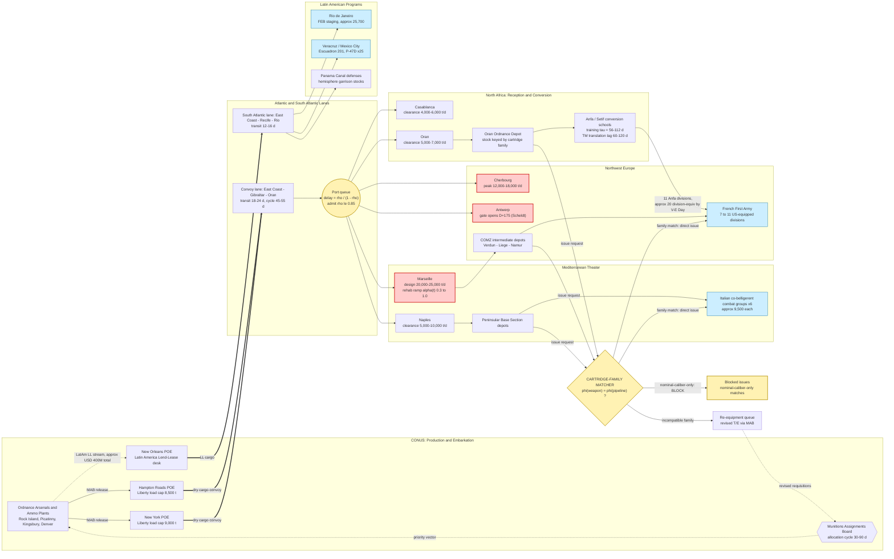

Cost: 0

# CHAPTER 28 REFERENCE MANUAL & SIMULATION SPECIFICATION
## *Global Logistics and Strategy: 1943–1945* — Military Supply to Liberated and Latin American Nations
**Document class:** Principal Operations Research Analyst / Military Logistics Historian / Senior Systems Architect
**Intended consumer:** Division-level WWII logistics simulator — database schema, network topology, state-transition engine

---

## 1. Strategic Context & Modern Historical Perspective

### 1.1 Scope and Source Basis

Chapter 28 of Coakley and Leighton's *Global Logistics and Strategy: 1943–1945* addresses one of the most under-appreciated allocation problems of the Allied war effort: the re-armament of sovereign and quasi-sovereign forces — the French army rebuilt in North Africa after TORCH, the Italian co-belligerent formations created after the September 1943 armistice, and the military-assistance programs extended to the Latin American republics — all executed inside a munitions-and-shipping economy already saturated by the demands of OVERLORD, the Italian campaign, the Pacific, and Lend-Lease to the USSR. This specification treats the chapter not as diplomatic epilogue but as a **constrained resource-allocation system** whose binding constraint was not goodwill, dollars, or even production, but *compatible throughput*: the ability of a single, standardized Anglo-American logistics pipeline to absorb foreign forces without fracturing into incompatible caliber streams.

### 1.2 The Strategic Paradox: Conference Arithmetic versus Pipeline Physics

The grand Allied conferences of 1943 — CASABLANCA (January), TRIDENT (May), QUADRANT (August), SEXTANT–EUREKA (November–December) — operated on a logic of *programmatic commitment*: divisions promised, target dates fixed, munitions programs sized in dollar and tonnage aggregates. The physical pipeline operated on a logic of *queueing and compatibility*. The paradox emerged in the gap between the two.

CASABLANCA produced, almost as a sidebar to the de Gaulle–Giraud reconciliation drama, the **Anfa negotiations** — concluded in the spring of 1943 (finalized April 1943) — under which the United States committed to equip **eleven French divisions** with standard US materiel. On paper this was a modest annex to the munitions program. In pipeline terms it was a new claimant inserted mid-scarcity: eleven US-pattern divisions implied, at planning-grade coefficients, roughly 330,000 short tons of initial equipment lift (≈30,000 tons per division) plus a steady-state sustainment burn of approximately 7,000 tons per day (≈650 tons/division/day in contact) — this against a Mediterranean discharge base of perhaps 15,000–20,000 tons per day *shared* with the Fifth and Eighth Armies, the Sicilian and Italian build-ups, and civil-affairs relief for liberated populations. TRIDENT's shipping reviews exposed the same arithmetic at global scale: the 1943 Anglo-American shipping position fell short of declared requirements by margins measured in millions of deadweight tons, and every ton committed to French re-equipment was a ton unavailable for BOLERO, for the Persian Corridor, or for the Pacific.

SEXTANT sharpened the paradox into a scheduling weapon. Because ANVIL (the southern France landing) was postponed at Tehran/cairo deliberations precisely when French divisions trained for it stood ready, the Allies discovered a perverse property of standing re-armed forces: **idle equipped divisions still consume**. A fully equipped but uncommitted French division burned roughly 300–400 tons/day in housekeeping — rations, POL, spare-parts drift, garrison consumption — with zero combat output. Re-armament thus created a *fixed carrying cost* that the shipping pools had to finance regardless of operational tempo, a fact modern inventory theory recognizes as the holding-cost term in any readiness-stock model.

The deeper physical limits were threefold. First, **combat loading**: assault convoys sacrificed cubic efficiency (realistically 50–65% of commercial stowage) to tactical accessibility, meaning liberating expeditions consumed disproportionate hull capacity per ton delivered. Second, **port clearance**: Naples (captured October 1943, heavily demolished) cleared perhaps 5,000–10,000 tons/day through early 1944; Cherbourg peaked in the 12,000–18,000 ton/day band; Marseille, captured in August 1944, was designed toward 20,000–25,000 tons/day but required months of rehabilitation ramping along an α(t) recovery curve; Antwerp, captured 4 September 1944, contributed nothing until the Scheldt was cleared and the first convoy arrived 28 November 1944 — **D+175**, the single most consequential port-latency constant of the ETO. Third, **turnaround**: a Liberty ship (10,800 DWT; practical dry-cargo loads of 7,000–9,000 tons) on the New York–Mediterranean run consumed 45–55 days per cycle including loading and discharge queues, so every ton of French or Italian re-armament cargo imposed a recurring hull-mortgage on the pooled fleet.

### 1.3 Inter-Service and Coalition Friction

Allocation authority was deliberately bipartite and therefore permanently contested. The **Munitions Assignments Board** (established January 1942, with parallel machinery in Washington and London, and ground/air committees) rationed finished munitions among US, British, Soviet, and "other Allied" claimants through quarterly priority lists; French and Italian re-armament claims entered this queue *below* the OVERLORD-critical and Soviet lines, making the MAB decision cycle (30–90 days, nominally ~45) a genuine latency term in any faithful simulation. Shipping was governed by the **Combined Shipping Adjustment Board** and the War Shipping Administration, with the Army controlling troop lift and the Navy and WSA controlling much of the dry-cargo and tanker picture — the Army-versus-Navy tension manifesting as the perpetual troop-space-versus-cargo-space trade (moving a single US-pattern infantry division overseas with organic equipment engaged on the order of 20–30 vessels for a month or more of cycle time).

Inside theaters, the **Services of Supply** (Lt. Gen. Thomas B. Larkin's NATOUSA SOS; Lt. Gen. John C. H. Lee's ETO Communications Zone) owned depots, port operating commands, and tonnage forecasts, while combat commanders (Clark, Alexander, later Devers and De Lattre) owned the operational claim on the same tonnage. The French case added a political filter unique among claimants: because President Roosevelt withheld recognition from de Gaulle's French Committee of National Liberation until late 1944, *equipment flowed through military channels* — initially to Giraud's command, after June 1943 through the unified CFLN apparatus — making every release of materiel a diplomatic instrument as much as a logistical transaction. Early French units in Tunisia fought with a chaotic mixture of French legacy weapons, ad hoc British loans (.303 Enfields, British 25-pounders), and trickle US deliveries; the Anfa standardization on US families was as much a *pipeline-unification decree* as a military decision, extinguishing a three-caliber small-arms nightmare before it metastasized into the sustainment system.

The Italian program displayed the inverse politics: after the armistice, the Allies authorized only a tightly capped co-belligerent force — ultimately **six division-scale combat groups** (Cremona, Legnano, Folgore, Mantova, Piceno, Friuli) of roughly 9,000–9,500 men each, equipped predominantly from Anglo-American standard families — while extracting enormous indirect value from **Italian service units** (truck companies, stevedores, depot labor numbering in the tens of thousands), which released Allied manpower at a favorable exchange rate of political risk per ton moved.

### 1.4 The Latin American Program: Externality-Driven Allocation

Lend-Lease to the Latin American republics (agreements beginning in 1942, following the Rio conference and the founding of the Inter-American Defense Board in March 1942) totaled **approximately $400 million** — under one percent of the ~$50 billion Lend-Lease enterprise — yet purchased outsized strategic goods: the Northeast Brazil air-base complex (Natal, Recife, Belém) that closed the Atlantic air gap during the 1942–43 U-boat crisis; Panama Canal perimeter security; raw-materials alignment (beryl, mica, quartz, industrial diamonds); the political isolation of Argentina; and two expeditionary tokens of disproportionate symbolic mass — the Brazilian Expeditionary Force (~25,700 men, one US-equipped infantry division in Italy, IV Corps, Fifth Army) and Mexico's Escuadrón 201 (~300 airmen, 25 P-47Ds, Luzon 1945). The allocation logic here was pure externality pricing: the *local* military threat was negligible, but the *systemic* return per dollar — measured in convoy-days saved, materials secured, and postwar alignment — was arguably the highest in the entire Lend-Lease portfolio. Modern scholarship (McCann, Hilton, Frye, Humphreys) reads the program simultaneously as insurance, subsidy, and the seedbed of hemispheric arms-dependency, since it locked twenty republics onto US calibers, US tables of organization, and US maintenance doctrine for a generation.

### 1.5 Modern Analytical Insight: Ammunition Compatibility Trumps Divisional Counts

Postwar logistical scholarship (Ruppenthal's *Logistical Support of the Armies*; the Technical Services histories; Milward's and Harrison's economic analyses; Atkinson's syntheses) converges on the chapter's central lesson, which this specification elevates to a first-class simulation primitive: **the decisive re-armament metric was not divisions equipped but cartridge-families pipelined**. Nominal caliber equality is a trap: the French Canon de 75 modèle 1897 (75×271R) and the US 75mm Gun M3 (75×350R) share a caliber and share *nothing else* — chamber, case, pressure curve, fuze fit. A French division "equipped" on paper but fed by a pipeline stocked for the wrong 75mm family has a *sustainable* readiness of zero. Conversely, the Brandt-designed 81mm and 60mm mortar families transferred to US manufacture with genuine cross-compatibility, and the Bofors 40mm was a genuinely common Allied asset. Re-armament therefore succeeded exactly where it collapsed the foreign force's demand stream onto the existing US family lattice — 105mm and 155mm howitzers, .30-06 small arms, .50 BMG, US mortar families — and required wholesale conversion of maintenance pipelines (spares nomenclature, tool kits, technical-manual translation with 60–120-day publication lags, artificer retraining, fuel and lubricant specifications) wherever it did not. In operations-research terms: compatibility is a *binary adjacency mask* over weapon families, and the shadow price of relaxing it — by converting a foreign army to US families — was the true economic content of the Anfa bargain.

---

## 2. High-Fidelity Simulation Parameters & Real-World Metrics

**Confidence taxonomy:** `[D]` = documented constant (official histories, program documents); `[C]` = calibrated estimate from planning figures and scholarship, encoded with sensitivity band.

| ID | Metric | Value | Unit | Sim Representation | Basis & Rationale |
|----|--------|-------|------|--------------------|-------------------|
| FR-DIV-ANFA | French divisions authorized under Anfa program | **11** `[D]` | division-equiv | Static constant | Anfa memorandum (Apr 1943); the contractual baseline of US re-equipment of French ground forces. Seed value for `authorizedDivisions`. |
| FR-DIV-VEDAY | Cumulative French division-equivalents equipped by V-E Day | ≈20 (band 18–22) `[C]` | division-equiv | Dynamic capacity cap (monotone accumulator) | Wartime expansions beyond Anfa (1943–45 authorizations, DRAGOON follow-on, interior/Alpine/Atlantic-pocket forces). Encode point estimate 20.0 with ±2 sensitivity. |
| FR-PERS-NA | French Army of Africa strength, mid-1943 | ≈300,000–350,000 `[C]` | personnel | State initializer | Post-TORCH mobilization base; drives per-capita housekeeping burn before divisional equipment completes. |
| FR-DRAGOON | French divisions in southern France landings | 7 by early Sep 1944; →≈11 by spring 1945 `[C]` | divisions | Scenario preset | Army B / First French Army order of battle under 6th Army Group. |
| IT-GROUPS | Italian co-belligerent combat groups authorized | **6** `[D]` | groups | Static cap | Cremona, Legnano, Folgore, Mantova, Piceno, Friuli; hard ceiling reflecting Allied political caution. |
| IT-GROUP-STR | Strength per Italian combat group | ≈9,500 `[C]` | personnel | Constant | Division-scale in name, roughly half a US division in sustainment demand. |
| IT-SVC | Italian service troops employed (drivers, stevedores, depot labor) | tens of thousands (50k–150k band) `[C]` | personnel | Manpower-credit coefficient | Negative-demand asset: credits Allied manpower, consumes minimal ordnance. |
| LL-LATAM-TOTAL | **Total WWII Lend-Lease to Latin American republics** | **≈$400M** (accounting-dependent band $380–430M) `[D/C]` | USD (1940s) | Budget cap (hard) | Canonical simulator constant 400.0; the Green Book-era program figures are rounded; band reflects cutoff conventions. Hard upper bound on cumulative disbursement ledger. |
| LL-BRAZIL | Brazil share (largest recipient) | ≈$200M (≈half of hemisphere total) `[C]` | USD | Sub-cap | Bilateral agreements from March 1942; bases-for-equipment exchange. |
| FEB-STR | Brazilian Expeditionary Force deployed strength | ≈25,700 `[C]` | personnel | Unit preset | 1st DIE, IV Corps, Fifth Army, Italy 1944–45; fully US-equipped. |
| MEX-SQ201 | Mexican Escuadrón 201 | ≈300 personnel; 25 P-47D `[C]` | pers/aircraft | Unit preset | Luzon, 1945, with 58th Fighter Group. |
| DIV-EQUIP-INIT | Initial equipment package, US-pattern infantry division | ≈30,000 (band 25,000–35,000) `[C]` | short tons | Conversion coefficient | Denominator of fill-fraction dynamics; vehicles dominate mass. |
| DIV-BURN-CONTACT | Daily sustainment, division in contact | ≈650 `[C]` | short tons/day | Burn-rate coefficient | Standard planning figure (600–700 band); all supply classes. |
| DIV-BURN-IDLE | Housekeeping burn, equipped-but-idle division | ≈300–400 `[C]` | short tons/day | Standby burn coefficient | The "standing army carrying cost" revealed by ANVIL postponement. |
| LIBERTY-LOAD | Practical dry-cargo load per Liberty ship | 7,000–9,000 (DWT 10,800) `[D]` | short tons | Vessel constant | Hull-cycle mortgage calculator input. |
| LANE-MED-TRANSIT | US East Coast → Mediterranean convoy transit | 18–24 `[C]` | days | Lane latency | Plus 25–35 days port/queue time per round cycle. |
| PORT-NAPLES | Naples clearance, early 1944 | 5,000–10,000 `[C]` | short tons/day | Port μ(t) | Heavily wrecked; rehabilitation ramp α(t). |
| PORT-MRS | Marseille design clearance (Dec 1944) | 20,000–25,000 `[C]` | short tons/day | Port μ with α ramp 0.3→1.0 | Captured Aug 1944; DRAGOON's decisive throughput dividend. |
| PORT-CHER | Cherbourg observed peak | 12,000–18,000 `[C]` | short tons/day | Port μ(t) | Artificial harbor supplement; rail bottleneck downstream. |
| PORT-ANT-LAG | Antwerp availability | D+175 (first convoy 28 Nov 1944; captured 4 Sep 1944) `[D]` | day-index | Gate variable | Scheldt-clearance latency; largest single port-delay constant in NW Europe. |
| ASSAULT-EFF | Assault-loading cubic efficiency | 0.50–0.65 `[C]` | ratio | Efficiency coefficient | Applies to attack convoys only. |
| CONV-TAU | Division conversion-training duration | 56–112 `[C]` | days | Per-division τ | Gates readiness regardless of fill fraction. |
| MAB-CYCLE | Munitions Assignments Board decision latency | 30–90 (nominal 45) `[C]` | days | Queue latency | Upstream allocation delay on all re-armament requisitions. |
| TM-LAG | Technical-manual translation/publication lag | 60–120 `[C]` | days | Publication delay | French-language TM pipeline for US equipment. |
| PORT-QUEUE | Congestion delay function | D = ρ/(1−ρ), admission ρ ≤ 0.85 `[C]` | days | Queueing closure | M/M/1-style approximation at port berths and depots. |
| CALCOMP | Cartridge-family compatibility | binary via family map φ `[D]` | 0/1 | Adjacency bitmask | See §4; supersedes naive caliber equality. |

---

## 3. Logistical Network Topology (Mermaid.js)

**Simulation focus:** Weapon System Standardization Compatibility Matcher — verification that troop-equipment cartridge families match pipeline families before issue; mismatch traffic is routed to re-equipment queues feeding the Munitions Assignments Board.



**Legend:** Yellow = decision/control nodes (compatibility matcher, queueing control). Red = capacity-constrained ports (primary bottleneck class). Blue = combat consumption nodes. Solid thick edges = high-volume dry-cargo trunk flows; dotted edges = policy/feedback and low-volume Lend-Lease streams. The matcher sits *between* depot stock and division issue: no tonnage crosses into a combat node without a cartridge-family pass, and every block recycles upward as a revised requisition through the MAB latency term.

---

## 4. Mathematical Modeling & Simulation Formulas

### 4.1 The Compatibility Indicator (mandated concept, stated and critiqued)

$$\text{Mathematical Concept: } C = \begin{cases} 1 & \text{if } Caliber_{force} = Caliber_{pipeline} \\ 0 & \text{otherwise} \end{cases}$$

**Explanation.** This binary indicator expresses whether a force's weapon caliber equals the logistics pipeline's caliber, gating issue of ammunition and spares. As a *naive* model it is dangerously brittle for three reasons. (i) **Floating-point equality** on real-valued calibers (`75.0 == 75.0`) is fragile under unit conversion and sensor noise; a tolerance $\varepsilon$ is mandatory. (ii) **Nominal-caliber equality is not interchangeability**: the French 75×271R (Mle 1897) and US 75×350R (Gun M3) both report $Caliber = 75$, so the naive rule returns $C=1$ and the simulator will happily issue cartridges that jam, burst chambers, or miss fuze seats — the exact failure the historical system avoided by *full family conversion*. (iii) Genuine interoperability exists *across* nominally identical families only where manufacturing lineage is shared (Brandt-derived 81mm/60mm mortars; Bofors 40mm). The corrected primitives are therefore:

$$C^{*}_{wp} = \mathbb{1}\!\left[\varphi(w) = \varphi(p)\right], \qquad \tilde{C}_{wp} = \mathbb{1}\!\left[\varphi(w) = \varphi(p) \;\wedge\; \left| \mathrm{cal}_w - \mathrm{cal}_p \right| \le \varepsilon\right], \quad \varepsilon = 0.05\ \text{mm}$$

where $\varphi(\cdot)$ maps a weapon or pipeline to its **cartridge family** (chamber geometry, case length/rim, pressure class). In the database, $C^{*}$ is stored as a sparse adjacency bitmask over the family lattice; issue requests are joins against this mask.

### 4.2 Full Allocation Model (mixed-integer program)

**Sets:** forces $f \in F$ (French, Italian co-belligerent, Latin American units); weapon categories $k \in K$; pipelines/ports $p \in P$; days $t \in \{1..T\}$.
**Parameters:** TO&E requirement $R_{fk}$ (items); unit mass $c_k$ (short tons/item); conversion training time $\tau_f$ (days); port clearance $\mu_p$ (tons/day) with rehabilitation ramp $\alpha_p(t) \in [0,1]$; shipping pool $K_t$ (tons/day); Lend-Lease authorization $\bar{L}_n$ (USD) per nation $n$; unit cost $\pi_t$; transit lag $\theta_p$ (days); attrition $\delta_f$.
**Variables:** items issued $x_{fkt} \ge 0$; tons discharged $a_{pt} \ge 0$; tons sailed $s_t \ge 0$; readiness $y_{ft} \in [0,1]$.

$$\max \; Z = \sum_{f \in F} \omega_f \, y_{fT}$$

subject to:

$$\text{(Fill dynamics)} \quad y_{ft} = \min\!\left(1,\; \frac{\sum_{k} c_k \sum_{u \le t - \tau_f} x_{fku}}{\sum_{k} c_k R_{fk}}\right) - \delta_f \cdot \mathbb{1}[\text{contact}]$$

$$\text{(Compatibility gating)} \quad x_{fkt} \le \sum_{p \in P} C^{*}_{kp} \, z_{fkpt}, \qquad z_{fkpt} \ge 0$$

$$\text{(Shipping pool)} \quad \sum_{f,k} c_k x_{fkt} + a^{\text{ammo}}_t + a^{\text{pol}}_t + a^{\text{subs}}_t \;\le\; K_t$$

$$\text{(Port clearance + inventory)} \quad a_{pt} \le \mu_p \, \alpha_p(t), \qquad I_{pt} = I_{p,t-1} + s_{t-\theta_p} - a_{pt}$$

$$\text{(Budget / Lend-Lease cap)} \quad \sum_{t} \pi_t \;\le\; \bar{L}_n \quad (\text{e.g., } \bar{L}_{\text{LatAm}} \approx \$400\text{M})$$

$$\text{(Congestion admission)} \quad \rho_{pt} = \frac{\lambda_{pt}}{\mu_p \alpha_p(t)} \le 0.85, \qquad D_{pt} = \frac{\rho_{pt}}{1-\rho_{pt}}$$

**Reading of the model.** The objective weights sustainable combat-ready division-equivalents at horizon $T$. Constraint (Fill dynamics) makes readiness a *mass-weighted* fill fraction delayed by training $\tau_f$ — a division cannot convert readiness faster than its schools can translate manuals and retrain artificers, regardless of tonnage ashore. Constraint (Compatibility gating) is the chapter's core: issue flows only through pipelines whose family matches the weapon's family; the dual variable on this constraint is the **shadow price of standardization** — the marginal combat power released by converting one more French battalion to US families, which is precisely what the Anfa agreement purchased. The congestion closure converts the M/M/1 queueing delay into an admission-control region ($\rho \le 0.85$), reproducing the historical practice of holding convoys at anchor rather than collapsing berth productivity. Because the constraint matrix of the underlying flow subproblem is totally unimodular, the continuous relaxation is integral on the network portion; only the compatibility join and training delays introduce integer structure, and these are handled by the bitmask and discrete-day indexing respectively.

---

## 5. Compile-Safe Scala 3.8.3 Domain Model

```scala
package Logistics.LiberatedNations

// =============================================================================
// Chapter 28 domain model: Military Supply to Liberated and Latin American
// Nations. Scala 3.8.3, indentation-based layout, explicit result types,
// no wildcard imports (none are required), no placeholders.
// =============================================================================

// -----------------------------------------------------------------------------
// 1. Units of measure (opaque types for unit safety)
// -----------------------------------------------------------------------------

opaque type Millimeters = Double

object Millimeters:
  def apply(raw: Double): Millimeters =
    require(raw >= 0.0, "caliber cannot be negative")
    raw

  extension (lhs: Millimeters)
    def value: Double = lhs
    def gap(rhs: Millimeters): Double = (lhs - rhs).abs
    def isWithin(rhs: Millimeters, tolerance: Double): Boolean =
      (lhs - rhs).abs <= tolerance

opaque type ShortTons = Double

object ShortTons:
  val zero: ShortTons = 0.0

  def apply(raw: Double): ShortTons =
    require(raw >= 0.0, "tonnage cannot be negative")
    raw

  extension (lhs: ShortTons)
    def value: Double = lhs
    def +(rhs: ShortTons): ShortTons = lhs + rhs
    def -(rhs: ShortTons): ShortTons = math.max(0.0, lhs - rhs)
    def scale(factor: Double): ShortTons = math.max(0.0, lhs * factor)
    def cappedBy(limit: ShortTons): ShortTons = math.min(lhs, limit)

opaque type ShortTonsPerDay = Double

object ShortTonsPerDay:
  def apply(raw: Double): ShortTonsPerDay =
    require(raw >= 0.0, "daily rate cannot be negative")
    raw

  extension (rate: ShortTonsPerDay)
    def value: Double = rate
    def over(days: Int): ShortTons = ShortTons(rate * days.toDouble)

opaque type UsdMillions = Double

object UsdMillions:
  val zero: UsdMillions = 0.0

  def apply(raw: Double): UsdMillions =
    require(raw >= 0.0, "dollar amounts cannot be negative")
    raw

  extension (lhs: UsdMillions)
    def value: Double = lhs
    def +(rhs: UsdMillions): UsdMillions = lhs + rhs
    def -(rhs: UsdMillions): UsdMillions = math.max(0.0, lhs - rhs)
    def isAtMost(cap: UsdMillions): Boolean = lhs <= cap

opaque type Days = Int

object Days:
  val zero: Days = 0

  def apply(raw: Int): Days =
    require(raw >= 0, "day counts cannot be negative")
    raw

  extension (lhs: Days)
    def value: Int = lhs
    def +(rhs: Days): Days = lhs + rhs

opaque type RoundCount = Long

object RoundCount:
  val zero: RoundCount = 0L

  def apply(raw: Long): RoundCount =
    require(raw >= 0L, "round counts cannot be negative")
    raw

  extension (lhs: RoundCount)
    def value: Long = lhs
    def +(rhs: RoundCount): RoundCount = lhs + rhs
    def -(rhs: RoundCount): RoundCount = math.max(0L, lhs - rhs)
    def cappedBy(limit: RoundCount): RoundCount = math.min(lhs, limit)

// -----------------------------------------------------------------------------
// 2. Cartridge families: the true compatibility lattice
// -----------------------------------------------------------------------------

enum CartridgeFamily(val designation: String, val nominalCaliberMm: Double):
  case FrenchMle1897         extends CartridgeFamily("75x271R French Mle 1897", 75.0)
  case UsGunM3SeventyFive    extends CartridgeFamily("75x350R US Gun M3", 75.0)
  case SchneiderOneOhFive    extends CartridgeFamily("105x390R Schneider", 105.0)
  case UsHowitzerOneOhFive   extends CartridgeFamily("105x372R US Howitzer M2A1", 105.0)
  case SchneiderOneFiveFive  extends CartridgeFamily("155mm C17S Schneider", 155.0)
  case UsHowitzerOneFiveFive extends CartridgeFamily("155x228 US Howitzer M1", 155.0)
  case MasSevenFive          extends CartridgeFamily("7.5x54 French MAS", 7.5)
  case UsThirtyOughtSix      extends CartridgeFamily("7.62x63 .30-06", 7.62)
  case LebelEight            extends CartridgeFamily("8x50R Lebel", 8.0)
  case BrandtEightyOne       extends CartridgeFamily("81mm Brandt-family bomb", 81.0)
  case UsMortarEightyOne     extends CartridgeFamily("81mm US M1 shell", 81.0)
  case BrandtSixty           extends CartridgeFamily("60mm Brandt-family bomb", 60.0)
  case UsMortarSixty         extends CartridgeFamily("60mm US M2 shell", 60.0)
  case BrowningFifty         extends CartridgeFamily("12.7x99 .50 BMG", 12.7)
  case BoforsForty           extends CartridgeFamily("40x311R Bofors", 40.0)

  def isInteroperable(other: CartridgeFamily): Boolean =
    this == other || CartridgeFamily.interopPairs.contains((this, other)) ||
      CartridgeFamily.interopPairs.contains((other, this))

object CartridgeFamily:
  private val interopPairs: Set[(CartridgeFamily, CartridgeFamily)] =
    Set(
      (CartridgeFamily.BrandtEightyOne, CartridgeFamily.UsMortarEightyOne),
      (CartridgeFamily.BrandtSixty, CartridgeFamily.UsMortarSixty))

// -----------------------------------------------------------------------------
// 3. Weapon systems and categories
// -----------------------------------------------------------------------------

enum WeaponCategory(val label: String):
  case SmallArm       extends WeaponCategory("Small Arm")
  case CrewServedMG   extends WeaponCategory("Machine Gun")
  case Mortar         extends WeaponCategory("Mortar")
  case FieldArtillery extends WeaponCategory("Field Artillery")
  case AntiTank       extends WeaponCategory("Anti-Tank")
  case AntiAircraft   extends WeaponCategory("Anti-Aircraft")
  case MotorVehicle   extends WeaponCategory("Motor Vehicle")
  case SignalRadio    extends WeaponCategory("Signal Equipment")

final case class WeaponSystem(
  name: String,
  caliberMm: Double,
  countryOfOrigin: String,
  cartridgeFamily: CartridgeFamily,
  category: WeaponCategory,
  unitMassKg: Double
)

object WeaponSystem:
  def validated(
      name: String,
      caliberMm: Double,
      countryOfOrigin: String,
      cartridgeFamily: CartridgeFamily,
      category: WeaponCategory,
      unitMassKg: Double
  ): Either[String, WeaponSystem] =
    if name.trim.isEmpty then Left("weapon name is blank")
    else if caliberMm <= 0.0 then Left(s"non-positive caliber for [$name]")
    else if unitMassKg <= 0.0 then Left(s"non-positive unit mass for [$name]")
    else Right(WeaponSystem(name, caliberMm, countryOfOrigin, cartridgeFamily, category, unitMassKg))

// -----------------------------------------------------------------------------
// 4. The Standardization Matcher (extends the base specification)
// -----------------------------------------------------------------------------

enum CompatibilityVerdict(val label: String):
  case FullInteroperability extends CompatibilityVerdict("cartridge-family match: direct issue")
  case CaliberOnly          extends CompatibilityVerdict("nominal-caliber match only: blocked pending conversion")
  case Incompatible         extends CompatibilityVerdict("no match: re-equipment required")

object StandardizationMatcher:

  private val caliberToleranceMm: Double = 0.05

  /** Legacy signature preserved from the base specification, hardened with a
    * tolerance instead of exact double equality. */
  def isCompatible(system: WeaponSystem, pipelineCaliberMm: Double): Boolean =
    math.abs(system.caliberMm - pipelineCaliberMm) <= caliberToleranceMm

  def classify(system: WeaponSystem, pipelineFamily: CartridgeFamily): CompatibilityVerdict =
    if system.cartridgeFamily == pipelineFamily then CompatibilityVerdict.FullInteroperability
    else if system.cartridgeFamily.isInteroperable(pipelineFamily) then CompatibilityVerdict.FullInteroperability
    else if isCompatible(system, pipelineFamily.nominalCaliberMm) then CompatibilityVerdict.CaliberOnly
    else CompatibilityVerdict.Incompatible

  def issueAllowed(system: WeaponSystem, pipelineFamily: CartridgeFamily): Boolean =
    classify(system, pipelineFamily) == CompatibilityVerdict.FullInteroperability

// -----------------------------------------------------------------------------
// 5. Nations, readiness states, divisions
// -----------------------------------------------------------------------------

enum Nation(val label: String):
  case France              extends Nation("France")
  case Italy               extends Nation("Italy")
  case Brazil              extends Nation("Brazil")
  case Mexico              extends Nation("Mexico")
  case UnitedStates        extends Nation("United States")
  case OtherLatinRepublic(override val label: String) extends Nation(label)

enum ReadinessState(val label: String):
  case Unequipped         extends ReadinessState("Awaiting equipment")
  case ConversionTraining extends ReadinessState("Conversion training in progress")
  case PartiallyEquipped  extends ReadinessState("Partially equipped")
  case CombatReady        extends ReadinessState("Combat ready")
  case Refitting          extends ReadinessState("Refitting after engagement")

object ReadinessState:

  def fromFillFraction(fill: Double, conversionElapsed: Days, conversionRequired: Days): ReadinessState =
    if fill <= 0.05 then Unequipped
    else if fill < 0.40 then ConversionTraining
    else if fill < 0.95 then PartiallyEquipped
    else if conversionElapsed.value < conversionRequired.value then ConversionTraining
    else CombatReady

  private val legalTransitions: Set[(ReadinessState, ReadinessState)] =
    Set(
      (Unequipped, ConversionTraining),
      (Unequipped, PartiallyEquipped),
      (ConversionTraining, PartiallyEquipped),
      (ConversionTraining, Unequipped),
      (ConversionTraining, CombatReady),
      (PartiallyEquipped, CombatReady),
      (PartiallyEquipped, ConversionTraining),
      (CombatReady, Refitting),
      (Refitting, CombatReady),
      (Refitting, PartiallyEquipped))

  def validateTransition(from: ReadinessState, to: ReadinessState): Either[String, ReadinessState] =
    if from == to then Right(from)
    else if legalTransitions.contains((from, to)) then Right(to)
    else Left(s"illegal readiness transition [${from.label}] -> [${to.label}]")

final case class EquipmentRequirement(byCategory: Map[WeaponCategory, Int])

object EquipmentRequirement:
  def usInfantryDivisionPattern: EquipmentRequirement =
    EquipmentRequirement(Map(
      WeaponCategory.SmallArm       -> 14000,
      WeaponCategory.CrewServedMG   -> 750,
      WeaponCategory.Mortar         -> 220,
      WeaponCategory.FieldArtillery -> 72,
      WeaponCategory.AntiTank       -> 66,
      WeaponCategory.AntiAircraft   -> 80,
      WeaponCategory.MotorVehicle   -> 1600,
      WeaponCategory.SignalRadio    -> 500))

final case class EquipmentFill(fractions: Map[WeaponCategory, Double]):
  def overall: Double =
    val values: List[Double] = fractions.values.toList
    if values.isEmpty then 0.0 else values.sum / values.size.toDouble

  def updated(category: WeaponCategory, fraction: Double): EquipmentFill =
    val bounded: Double = math.max(0.0, math.min(1.0, fraction))
    EquipmentFill(fractions.updated(category, bounded))

final case class FieldDivision(
  id: String,
  nation: Nation,
  designation: String,
  requirement: EquipmentRequirement,
  fill: EquipmentFill,
  state: ReadinessState,
  conversionElapsed: Days,
  conversionRequired: Days
):

  def readinessFraction: Double = fill.overall

  def applyDeliveries(gains: Map[WeaponCategory, Double]): FieldDivision =
    val nextFill: EquipmentFill = gains.foldLeft(fill)((acc, kv) =>
      acc.updated(kv._1, acc.fractions.getOrElse(kv._1, 0.0) + kv._2))
    val nextState: ReadinessState =
      ReadinessState.fromFillFraction(nextFill.overall, conversionElapsed, conversionRequired)
    copy(fill = nextFill, state = nextState)

  def advanceDay(contact: Boolean): Either[String, FieldDivision] =
    val elapsedNext: Days =
      if state == ReadinessState.ConversionTraining then conversionElapsed + Days(1)
      else conversionElapsed
    val proposedState: ReadinessState =
      if contact && state == ReadinessState.CombatReady then ReadinessState.Refitting
      else ReadinessState.fromFillFraction(fill.overall, elapsedNext, conversionRequired)
    val proposed: FieldDivision = copy(conversionElapsed = elapsedNext, state = proposedState)
    ReadinessState.validateTransition(state, proposedState).map(_ => proposed)

// -----------------------------------------------------------------------------
// 6. Network nodes: POEs, sea lanes, theater ports, forward depots
// -----------------------------------------------------------------------------

sealed trait NetworkNode:
  def id: String
  def label: String

final case class PortOfEmbarkation(
  id: String,
  label: String,
  dailyLoadCapacity: ShortTonsPerDay
) extends NetworkNode

final case class ConvoyLane(
  id: String,
  originId: String,
  destinationId: String,
  transitTime: Days,
  maxTonsPerSailing: ShortTons
):
  def arrivalDay(sailDay: Days): Days = sailDay + transitTime

final case class TheaterPort(
  id: String,
  label: String,
  nominalDailyClearance: ShortTonsPerDay,
  rehabilitationFactor: Double,
  backlog: ShortTons
) extends NetworkNode:

  def effectiveDailyClearance: ShortTonsPerDay =
    ShortTonsPerDay(nominalDailyClearance.value * math.max(0.0, math.min(1.0, rehabilitationFactor)))

  def receive(inbound: ShortTons): TheaterPort = copy(backlog = backlog + inbound)

  def clearOneDay: (ShortTons, TheaterPort) =
    val cleared: ShortTons = backlog.cappedBy(effectiveDailyClearance.over(1))
    (cleared, copy(backlog = backlog - cleared))

  def utilizationFor(cleared: ShortTons): Double =
    val capacity: Double = effectiveDailyClearance.over(1).value
    if capacity <= 0.0 then 0.0 else math.min(1.0, cleared.value / capacity)

final case class ForwardDepot(
  id: String,
  label: String,
  stockByFamily: Map[CartridgeFamily, RoundCount],
  capacityRounds: RoundCount
) extends NetworkNode:

  def receive(family: CartridgeFamily, rounds: RoundCount): Either[String, ForwardDepot] =
    val current: RoundCount = stockByFamily.getOrElse(family, RoundCount.zero)
    val projected: RoundCount = current + rounds
    if projected.value > capacityRounds.value then
      Left(s"depot [$id] overflow for family ${family.designation}")
    else Right(copy(stockByFamily = stockByFamily.updated(family, projected)))

  def draw(family: CartridgeFamily, rounds: RoundCount): Either[String, ForwardDepot] =
    val current: RoundCount = stockByFamily.getOrElse(family, RoundCount.zero)
    if current.value < rounds.value then
      Left(s"depot [$id] shortfall for family ${family.designation}: have ${current.value}, need ${rounds.value}")
    else Right(copy(stockByFamily = stockByFamily.updated(family, current - rounds)))

// -----------------------------------------------------------------------------
// 7. Lend-Lease ledger with hard authorization caps
// -----------------------------------------------------------------------------

final case class LendLeaseAccount(
  nation: Nation,
  authorized: UsdMillions,
  disbursed: UsdMillions
):
  def remaining: UsdMillions = authorized - disbursed

  def disburse(requested: UsdMillions): Either[String, LendLeaseAccount] =
    if requested.value <= 0.0 then Left("disbursement must be positive")
    else if (disbursed + requested).isAtMost(authorized) then
      Right(copy(disbursed = disbursed + requested))
    else
      Left(s"lend-lease authorization exceeded for ${nation.label}: " +
        s"requested ${requested.value}, remaining ${remaining.value}")

// -----------------------------------------------------------------------------
// 8. Documented historical constants (see Section 2 table)
// -----------------------------------------------------------------------------

final case class ApproximateMetric(
  pointEstimate: Double,
  lowerBound: Double,
  upperBound: Double,
  note: String
):
  def contains(x: Double): Boolean = x >= lowerBound && x <= upperBound

object HistoricalConstants:
  val anfaAuthorizedDivisions: Int = 11
  val frenchDivisionEquivalentsByVEDay: ApproximateMetric =
    ApproximateMetric(20.0, 18.0, 22.0,
      "Cumulative US-equipped French division-equivalents at V-E Day; Anfa baseline was 11.")
  val italianCombatGroupsAuthorized: Int = 6
  val italianCombatGroupStrength: Int = 9500
  val latinAmericaLendLeaseTotal: ApproximateMetric =
    ApproximateMetric(400.0, 380.0, 430.0,
      "WWII Lend-Lease to Latin American republics, USD millions; canonical constant 400.0.")
  val brazilShareUpperBound: UsdMillions = UsdMillions(210.0)
  val febDeployedStrength: Int = 25700
  val mexicanSquadron201Strength: Int = 300
  val mexicanSquadron201Aircraft: Int = 25
  val infantryDivisionDailyTonnageInContact: ShortTonsPerDay = ShortTonsPerDay(650.0)
  val infantryDivisionIdleHousekeepingTonnage: ShortTonsPerDay = ShortTonsPerDay(350.0)
  val infantryDivisionInitialEquipmentTons: ApproximateMetric =
    ApproximateMetric(30000.0, 25000.0, 35000.0,
      "Initial US-pattern infantry division equipment package, short tons.")
  val conversionTrainingDaysLow: Days = Days(56)
  val conversionTrainingDaysHigh: Days = Days(112)
  val mabDecisionCycleDays: Days = Days(45)
  val antwerpAvailabilityDayIndex: Days = Days(175)

// -----------------------------------------------------------------------------
// 9. Compatibility audit across a division's arsenal
// -----------------------------------------------------------------------------

final case class CompatibilityFinding(
  divisionId: String,
  weaponName: String,
  verdict: CompatibilityVerdict,
  pipelineFamily: CartridgeFamily
)

object CompatibilityAuditor:
  def audit(
      division: FieldDivision,
      arsenal: List[WeaponSystem],
      pipelineFamily: CartridgeFamily
  ): List[CompatibilityFinding] =
    arsenal.map(weapon =>
      CompatibilityFinding(division.id, weapon.name,
        StandardizationMatcher.classify(weapon, pipelineFamily), pipelineFamily))

// -----------------------------------------------------------------------------
// 10. Daily-step theater simulator
// -----------------------------------------------------------------------------

final case class SimulatorConfig(
  lane: ConvoyLane,
  embarkation: PortOfEmbarkation,
  destination: TheaterPort,
  forwardDepot: ForwardDepot,
  divisions: List[FieldDivision],
  account: LendLeaseAccount,
  dailyAvailableCargo: ShortTonsPerDay,
  dailyAmmoProductionByFamily: Map[CartridgeFamily, RoundCount],
  costPerKiloton: UsdMillions
)

object SimulatorConfig:
  def validate(config: SimulatorConfig): Either[String, SimulatorConfig] =
    if config.lane.transitTime.value < 1 then Left("convoy transit must be at least one day")
    else if config.destination.nominalDailyClearance.value <= 0.0 then Left("port clearance must be positive")
    else if config.dailyAvailableCargo.value <= 0.0 then Left("daily cargo availability must be positive")
    else if config.forwardDepot.capacityRounds.value <= 0L then Left("depot capacity must be positive")
    else if config.divisions.isEmpty then Left("at least one division is required")
    else if config.divisions.map(_.id).distinct.length != config.divisions.length then
      Left("division ids must be unique")
    else if config.costPerKiloton.value < 0.0 then Left("cost per kiloton cannot be negative")
    else Right(config)

final case class DailyLog(
  day: Days,
  sailed: ShortTons,
  arrived: ShortTons,
  cleared: ShortTons,
  portBacklogAfterClear: ShortTons,
  portUtilization: Double,
  readinessSnapshots: List[(String, ReadinessState)]
)

final case class SimulationReport(
  logs: List[DailyLog],
  finalDivisions: List[FieldDivision],
  finalDepot: ForwardDepot,
  finalAccount: LendLeaseAccount,
  totalCleared: ShortTons,
  authorizationRejections: Int
)

final class TheaterSimulator(config: SimulatorConfig):

  private val validatedConfig: SimulatorConfig =
    SimulatorConfig.validate(config) match
      case Right(ok) => ok
      case Left(message) => throw new IllegalArgumentException(message)

  def run(horizon: Days): SimulationReport =
    val initialState: SimState = SimState.initial(validatedConfig)
    val dayIndices: List[Int] = (1 to horizon.value).toList
    val iterated: (SimState, List[DailyLog]) =
      iterate(initialState, dayIndices, List.empty[DailyLog])
    SimulationReport(
      logs = iterated._2.reverse,
      finalDivisions = iterated._1.divisions,
      finalDepot = iterated._1.depot,
      finalAccount = iterated._1.account,
      totalCleared = iterated._1.totalCleared,
      authorizationRejections = iterated._1.rejections)

  private def iterate(
      state: SimState,
      remaining: List[Int],
      logsReversed: List[DailyLog]
  ): (SimState, List[DailyLog]) =
    if remaining.isEmpty then (state, logsReversed)
    else
      val stepped: (DailyLog, SimState) = step(state, Days(remaining.head))
      iterate(stepped._2, remaining.tail, stepped._1 :: logsReversed)

  private def step(state: SimState, today: Days): (DailyLog, SimState) =

    val sailed: ShortTons =
      validatedConfig.dailyAvailableCargo.over(1).cappedBy(validatedConfig.lane.maxTonsPerSailing)

    val arrivalDay: Days = validatedConfig.lane.arrivalDay(today)
    val priorScheduled: ShortTons = state.inTransit.getOrElse(arrivalDay, ShortTons.zero)
    val inTransitAfterSail: Map[Days, ShortTons] =
      state.inTransit.updated(arrivalDay, priorScheduled + sailed)

    val arrivingToday: ShortTons = inTransitAfterSail.getOrElse(today, ShortTons.zero)
    val inTransitAfterArrival: Map[Days, ShortTons] = inTransitAfterSail.removed(today)

    val portAfterArrival: TheaterPort = state.port.receive(arrivingToday)
    val clearedAndPort: (ShortTons, TheaterPort) = portAfterArrival.clearOneDay
    val cleared: ShortTons = clearedAndPort._1
    val portAfterClear: TheaterPort = clearedAndPort._2

    val depotAfterResupply: ForwardDepot =
      validatedConfig.dailyAmmoProductionByFamily.foldLeft(state.depot)((depot, kv) =>
        resupplyDepot(depot, kv._1, kv._2))

    val divisionCount: Int = math.max(1, state.divisions.length)
    val perDivisionTons: Double = cleared.value / divisionCount.toDouble
    val targetTons: Double = HistoricalConstants.infantryDivisionInitialEquipmentTons.pointEstimate
    val fillIncrement: Double = math.min(0.05, perDivisionTons / math.max(1.0, targetTons))

    val allCategories: Set[WeaponCategory] =
      state.divisions.flatMap(_.requirement.byCategory.keySet).toSet
    val uniformGains: Map[WeaponCategory, Double] =
      allCategories.map(category => (category, fillIncrement)).toMap

    val advanced: List[FieldDivision] =
      state.divisions
        .map(division => division.applyDeliveries(uniformGains))
        .map(division => division.advanceDay(contact = false).getOrElse(division))

    val dailyCost: UsdMillions =
      UsdMillions(cleared.value / 1000.0 * validatedConfig.costPerKiloton.value)
    val disbursementOutcome: (LendLeaseAccount, Boolean) =
      state.account.disburse(dailyCost).fold(
        _ => (state.account, true),
        updated => (updated, false))

    val snapshots: List[(String, ReadinessState)] =
      advanced.map(division => (division.id, division.state))
    val utilization: Double = portAfterClear.utilizationFor(cleared)

    val log: DailyLog = DailyLog(
      day = today,
      sailed = sailed,
      arrived = arrivingToday,
      cleared = cleared,
      portBacklogAfterClear = portAfterClear.backlog,
      portUtilization = utilization,
      readinessSnapshots = snapshots)

    val nextState: SimState = SimState(
      day = today + Days(1),
      inTransit = inTransitAfterArrival,
      port = portAfterClear,
      depot = depotAfterResupply,
      divisions = advanced,
      account = disbursementOutcome._1,
      rejections = state.rejections + (if disbursementOutcome._2 then 1 else 0),
      totalCleared = state.totalCleared + cleared)

    (log, nextState)

  private def resupplyDepot(
      depot: ForwardDepot,
      family: CartridgeFamily,
      produced: RoundCount
  ): ForwardDepot =
    val current: RoundCount = depot.stockByFamily.getOrElse(family, RoundCount.zero)
    val space: RoundCount = depot.capacityRounds - current
    val accepted: RoundCount =
      if space.value <= 0L then RoundCount.zero else produced.cappedBy(space)
    depot.receive(family, accepted).getOrElse(depot)

  private final case class SimState(
    day: Days,
    inTransit: Map[Days, ShortTons],
    port: TheaterPort,
    depot: ForwardDepot,
    divisions: List[FieldDivision],
    account: LendLeaseAccount,
    rejections: Int,
    totalCleared: ShortTons
  )

  private object SimState:
    def initial(config: SimulatorConfig): SimState =
      SimState(
        day = Days.zero,
        inTransit = Map.empty[Days, ShortTons],
        port = config.destination,
        depot = config.forwardDepot,
        divisions = config.divisions,
        account = config.account,
        rejections = 0,
        totalCleared = ShortTons.zero)

object TheaterSimulator:
  def create(config: SimulatorConfig): Either[String, TheaterSimulator] =
    SimulatorConfig.validate(config).map(validated => new TheaterSimulator(validated))

// -----------------------------------------------------------------------------
// 11. Worked sample scenario: Hampton Roads -> Marseille, French division
// -----------------------------------------------------------------------------

object SampleScenario:

  private def mk(candidate: Either[String, WeaponSystem]): WeaponSystem =
    candidate.fold(message => throw new IllegalStateException(message), identity)

  val usGarand: WeaponSystem =
    mk(WeaponSystem.validated("M1 Garand", 7.62, "United States",
      CartridgeFamily.UsThirtyOughtSix, WeaponCategory.SmallArm, 4.3))
  val frenchMas36: WeaponSystem =
    mk(WeaponSystem.validated("MAS-36", 7.5, "France",
      CartridgeFamily.MasSevenFive, WeaponCategory.SmallArm, 3.7))
  val frenchCanon75: WeaponSystem =
    mk(WeaponSystem.validated("Canon de 75 Modele 1897", 75.0, "France",
      CartridgeFamily.FrenchMle1897, WeaponCategory.FieldArtillery, 1140.0))
  val usHowitzer105: WeaponSystem =
    mk(WeaponSystem.validated("105mm Howitzer M2A1", 105.0, "United States",
      CartridgeFamily.UsHowitzerOneOhFive, WeaponCategory.FieldArtillery, 2260.0))
  val brandtMortar81: WeaponSystem =
    mk(WeaponSystem.validated("Brandt 81mm Mortar", 81.0, "France",
      CartridgeFamily.BrandtEightyOne, WeaponCategory.Mortar, 56.0))

  /** Demonstrates the 75mm trap: identical nominal caliber, incompatible family. */
  val matcherDemonstrations: List[(String, CompatibilityVerdict)] =
    List(
      ("MAS-36 vs .30-06 pipeline",
        StandardizationMatcher.classify(frenchMas36, CartridgeFamily.UsThirtyOughtSix)),
      ("Canon de 75 Mle 1897 vs US 75mm Gun M3 family",
        StandardizationMatcher.classify(frenchCanon75, CartridgeFamily.UsGunM3SeventyFive)),
      ("Brandt 81mm vs US 81mm M1 family",
        StandardizationMatcher.classify(brandtMortar81, CartridgeFamily.UsMortarEightyOne)),
      ("105mm Howitzer M2A1 vs US 105mm family",
        StandardizationMatcher.classify(usHowitzer105, CartridgeFamily.UsHowitzerOneOhFive)))

  val frenchDivision: FieldDivision = FieldDivision(
    id = "FRA-INF-03",
    nation = Nation.France,
    designation = "3rd Algerian Infantry Division (US-pattern)",
    requirement = EquipmentRequirement.usInfantryDivisionPattern,
    fill = EquipmentFill(Map.empty[WeaponCategory, Double]),
    state = ReadinessState.Unequipped,
    conversionElapsed = Days.zero,
    conversionRequired = Days(84))

  val hamptonRoads: PortOfEmbarkation =
    PortOfEmbarkation("POE-HR", "Hampton Roads", ShortTonsPerDay(9000.0))

  val marseille: TheaterPort =
    TheaterPort("TP-MRS", "Marseille", ShortTonsPerDay(22000.0), 0.35, ShortTons.zero)

  val mediterraneanLane: ConvoyLane =
    ConvoyLane("LN-HR-MRS", "POE-HR", "TP-MRS", Days(21), ShortTons(8500.0))

  val oranDepot: ForwardDepot = ForwardDepot(
    id = "FD-ORAN",
    label = "Oran Ordnance Depot",
    stockByFamily = Map(
      CartridgeFamily.UsHowitzerOneOhFive -> RoundCount(400000L),
      CartridgeFamily.UsThirtyOughtSix -> RoundCount(20000000L)),
    capacityRounds = RoundCount(50000000L))

  val frenchAccount: LendLeaseAccount =
    LendLeaseAccount(Nation.France, UsdMillions(1100.0), UsdMillions.zero)

  val config: SimulatorConfig = SimulatorConfig(
    lane = mediterraneanLane,
    embarkation = hamptonRoads,
    destination = marseille,
    forwardDepot = oranDepot,
    divisions = List(frenchDivision),
    account = frenchAccount,
    dailyAvailableCargo = ShortTonsPerDay(12000.0),
    dailyAmmoProductionByFamily = Map(
      CartridgeFamily.UsHowitzerOneOhFive -> RoundCount(20000L),
      CartridgeFamily.UsThirtyOughtSix -> RoundCount(150000L)),
    costPerKiloton = UsdMillions(0.08))

  def demo: Either[String, SimulationReport] =
    TheaterSimulator.create(config).map(simulator => simulator.run(Days(30)))
```

---

## 6. Graduate-Level Operational Analysis

### 6.1 The French Army's Traditional Structure Meets American Equipment

The friction between French organizational tradition and American materiel was not sentimental stubbornness; it was a rational response by an institution whose *purpose* in 1943 was the restoration of state sovereignty. An army is the state's most concentrated expression, and for a regime-in-formation — first Giraud's, then de Gaulle's CFLN — every preserved regimental institution, rank structure, and administrative peculiarity was a claim-ticket on postwar great-power status. Accepting US equipment was unavoidable; accepting US *organizational identity* was politically radioactive. The resulting negotiation produced a compromise architecture that modern principal-agent theory would recognize instantly: the principal (the US supply system) conceded observable identity markers (national insignia, command language, promotion autonomy, the retention of irregular bodies like the Moroccan goums and tabors outside US tables of organization) while the agent (the French army) conceded the invisible infrastructure that actually mattered to the pipeline — cartridge families, vehicle fleets, radio spectra, and maintenance doctrine.

The material frictions were specific and instructive. **Doctrine and artillery organization:** the French army's institutional soul lived in the 75mm — the direct-support, forward-positioned gun of 1914–18 memory — whereas the US system was built around the 105mm howitzer battalion with centralized fire-direction control. Adoption of US pieces meant adopting US fire-direction procedures, English-language procedural drill, and survey/met techniques; the guns were the cheap part, the firing doctrine was the expensive part. **Signals:** US SCR-series radios imposed English voice procedure and, critically, the United States withheld its highest-grade cipher equipment from French networks, forcing parallel French cryptologic channels with attendant latency — a sovereignty tax paid daily in message handling time. **Mobility:** French tables preserved heavier regimental trains and, in mountain formations such as the 4th Moroccan Mountain Division, mule-pack artillery that the motorized US logistics assumption simply did not forecast; every mule column was a demand stream (forage, shoes, veterinary stores) absent from US planning coefficients. **Subsistence:** the French daily wine ration was a genuine quartermaster line item, sourced locally to avoid shipping tonnage, and ration-menu adaptation for Muslim tirailleurs added procurement complexity invisible in any US T/O&E. **Maintenance:** US parts nomenclature, tool kits, lubricant grades, and echeloned-repair doctrine required retraining French artificers en masse, with technical-manual translation imposing a 60–120-day publication lag on every equipment introduction.

The deepest lesson, however, was the one this specification encodes as the compatibility bitmask: **where nominal calibers coincided but cartridge families diverged, partial adoption was worse than none.** A French battery firing US 105mm howitzers with a residual French 75mm ammunition stream would have split the theater's SS&D forecasting into two correlated-but-distinct demand series — a textbook bullwhip generator. The Anfa decision to convert wholly onto US families (105mm, 155mm, .30-06, .50 BMG, US mortar families) collapsed the French demand stream onto the existing pipeline lattice, trading a large one-time conversion cost (training, translation, reorganization onto modified "Anfa tables") for a permanent reduction in marginal sustainment variance. Formally, in the §4 model, conversion relaxed the compatibility constraint $C^*$ from 0 to 1 across nearly the entire weapon matrix, and the shadow price recovered thereby — measurable in additional sustainable division-equivalents per thousand tons of pipeline capacity — was the true economic content of the agreement. The outcome validated the bargain: the French First Army sustained itself inside the 6th Army Group pipeline from Marseille to the Rhine with effectiveness that surprised contemporaries who had predicted institutional collapse. The generalizable principle for the simulator: **measure interoperability at the granularity of cartridge families and maintenance echelons, never at the granularity of division counts** — a division is a legal fiction; a caliber is a physical fact.

### 6.2 Strategic Reasons for Military Aid to Latin America

At first inspection, the Latin American program violates every intuitive rule of wartime allocation: roughly $400 million of scarce munitions flowed to a theater where the Axis possessed essentially no projection capability, while active fronts competed desperately for the same output. The resolution of this apparent paradox lies in recognizing that the program purchased **externalities, not local defense**, and that its price was trivially small against its systemic yield. Total Lend-Lease approached $50 billion; the hemisphere program was therefore under one percent of the whole — approximately three to four days of 1944 US munitions output — making it, dollar-for-dollar, arguably the highest-leverage expenditure of the war.

Four strategic goods dominated the objective function. **First, air and naval geography.** The Northeast Brazil bulge — Natal, Recife, Belém — commands the shortest ocean crossing to West Africa (Natal–Dakar, roughly 1,900 nautical miles). The base agreements signed with Vargas in 1942 allowed the Army Air Forces ferry route and antisubmarine patrol coverage that closed the transatlantic air gap during the 1942–43 U-boat crisis, precisely when sinkings threatened the entire Allied shipping pool on which every other program in this chapter depended. In network terms, the aid bought a reduction in lane latency and convoy exposure for *all* Atlantic traffic — a benefit accruing to claimants far outside Latin America, which is why treating it as a local-defense expenditure misconstrues the accounting entirely. **Second, raw-materials alignment.** Brazilian beryl, mica, quartz, and industrial diamonds, Mexican and Chilean minerals, and the general reorientation of hemisphere trade away from German purchasing missions secured inputs whose absence would have imposed hard ceilings on US electronics and munitions production. **Third, political solidarity and coercion.** The Rio conference (January 1942) and the Inter-American Defense Board (March 1942) built the consultative machinery; aid was the enforcement mechanism — flowing generously to Brazil and Mexico after their declarations of war (following the sinking of Brazilian shipping in August 1942 and Mexican tankers in May 1942), and pointedly withheld from Argentina as punishment for neutrality, demonstrating that the program functioned as a diplomatic instrument with an exclusion set, not a mere subsidy. **Fourth, expeditionary tokens with outsized symbolic mass.** The Brazilian FEB (~25,700 men, one US-equipped division fighting through Monte Castello and Montese into the Po valley) and Mexico's Escuadrón 201 (25 P-47Ds over Luzon in 1945) contributed negligible combat mass but purchased something no tonnage calculation captures: the domestic political legitimacy of *having fought*, which converted wartime association into postwar institutional commitment — the Rio Pact of 1947, the Organization of American States, and permanent US military missions across the continent.

Modern scholarship sharpens rather than overturns this assessment. McCann and Hilton document the Brazilian side of the bargain as a conscious exchange of bases and belligerency for modernization of the armed forces; dependency-theorist critics correctly observe that the program's most durable product was **standardization lock-in** — twenty republics converted onto US calibers, US tables of organization, and US maintenance doctrine, a dependency whose postwar persistence (visible in arsenal products like Brazil's .30-06 Mosquetão Itajubá) was foreseeable and, from Washington's perspective, intended. Frye and later analysts note the military-threat justification was always thin after Midway; the program's real warrant was always political-economic. For the simulator, the correct encoding is therefore not a combat-value term but a **diplomatic-capital accumulator**: each disbursement accrues coalition-cohesion value with diminishing returns, subject to the hard $400M authorization cap and the Argentina exclusion constraint, while the Brazil base-complex enters the network model as a permanent reduction in Atlantic lane transit time and exposure — an externality term that, if omitted, renders the entire historical allocation pattern inexplicable.
