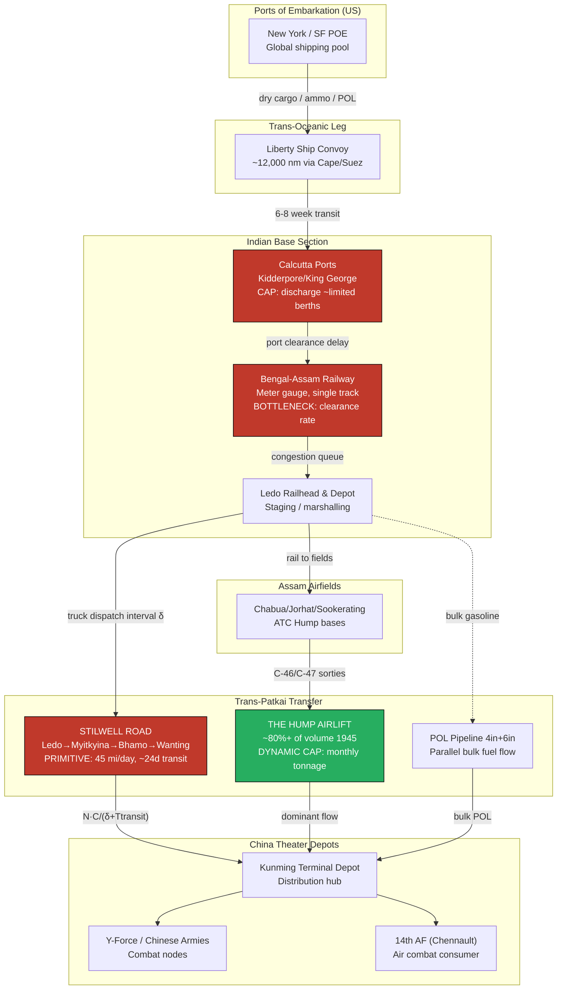

Cost: 0.27246

# Chapter 29: Lend-Lease to China, 1943–45
## Reference Manual & Simulation-Specification Document
### US Army Green Book — *Global Logistics and Strategy: 1943–1945*

---

## 1. Strategic Context & Modern Historical Perspective

### 1.1 The Strategic Paradox: Plans Untethered from Physics

The China-Burma-India (CBI) theater represents perhaps the most acute case in the Second World War of the divergence between grand-strategic aspiration and physical logistical possibility. The high-level Allied conferences—Casablanca (SYMBOL, January 1943), TRIDENT (Washington, May 1943), QUADRANT (Quebec, August 1943), and SEXTANT (Cairo, November–December 1943)—repeatedly generated commitments to China that the theater's material sinews could not honor. At Casablanca, the Combined Chiefs endorsed the reopening of a land route to China and the intensification of the air ferry over the Himalayan "Hump." At TRIDENT, President Roosevelt personally committed to raising Hump tonnage to 10,000 tons per month by early autumn 1943, a figure driven less by logistical feasibility studies than by the political imperative of keeping China in the war and appeasing Generalissimo Chiang Kai-shek. At SEXTANT, the promise of a major amphibious operation in the Bay of Bengal (Operation BUCCANEER) was extended and then abruptly withdrawn once landing craft were reallocated to the Mediterranean and the cross-Channel buildup—an object lesson in how the global shipping and combat-loading pool functioned as a single, zero-sum reservoir.

The paradox was structural. China's usable supply intake was governed not by the generosity of Lend-Lease appropriations but by three serial bottlenecks: (1) the throughput of the eastern Indian ports, principally Calcutta, whose berths, cranes, and marshalling yards had never been designed for a transcontinental military buildup; (2) the single-track, meter-gauge Bengal and Assam Railway climbing to the Assam airfields and to the Ledo railhead; and (3) the physical transfer capacity across the Patkai Range—whether by air over the Hump or, eventually, by truck over the Ledo/Stilwell Road. Each stage operated at a fraction of the nominal capacity of the stage feeding it, so that a ton of ammunition landed at Calcutta might wait weeks in congested transit sheds before it could even begin its journey. Port clearance rate, not port discharge rate, was the true governing variable—a distinction modern operations research would formalize as the difference between a queue's service rate and its downstream drain rate.

### 1.2 Inter-Service and Coalition Tensions

The CBI was administratively a three-body problem. Lieutenant General Joseph Stilwell simultaneously served as Chiang's chief of staff, commander of US forces in CBI, and deputy Supreme Allied Commander under Mountbatten's South East Asia Command (SEAC)—a set of hats guaranteeing friction. The Services of Supply (SOS) under Major General Raymond Wheeler bore responsibility for the Indian base, the railway, the pipelines, and the Ledo Road construction, and its priorities repeatedly collided with the combat commands (Stilwell's Chinese Army in India and the Northern Combat Area Command) and, more corrosively, with the Air Transport Command (ATC), which controlled the Hump airlift.

The deepest fissure was the road-versus-airlift debate. Stilwell was emotionally and professionally invested in the overland route; the aviators, and increasingly Washington, regarded the Hump as the decisive channel. British and American strategic aims never truly aligned: London prioritized the recapture of Burma for imperial and prestige reasons and remained cool to expending resources for the sole benefit of a Chinese ground force it distrusted, while Washington viewed Burma instrumentally, purely as the corridor to China. The Anglo-American shipping pooling arrangements, administered through the Combined Shipping Adjustment Board, meant that every additional Liberty ship diverted to Calcutta was a ship denied to the Mediterranean or the Pacific, and the CBI consistently ranked at the bottom of the global priority list.

### 1.3 Historical Era Context

Following the opening of the Ledo Road—renamed the Stilwell Road by Chiang's decree in early 1945—and the parallel laying of the four- and six-inch petroleum pipelines alongside it, Lend-Lease deliveries to China rose sharply. This chapter examines the concrete physical movement of matériel: dry cargo, bulk petroleum, and ammunition offloaded at Calcutta's Kidderpore and King George's docks, railed and barged north through Bengal into Assam, staged at Ledo, and then either flown over the Hump from the Assam fields or trucked across northern Burma through Myitkyina and Bhamo to Kunming. The road formally opened when the first convoy departed Ledo on 12 January 1945 and reached Kunming on 4 February 1945.

### 1.4 Modern Analytical Insights

Post-war declassification and decades of logistical scholarship have rendered a harsh verdict on the Stilwell Road as a return-on-investment proposition. The road absorbed the labor of some 15,000 US engineer troops (a majority African-American engineer regiments) and 35,000 local workers, consumed a documented 700+ American lives, and cost on the order of $148 million (1945 dollars). Yet by the time the overland link was complete, the Hump airlift had scaled so dramatically—exceeding 44,000 tons in a single month by mid-1945—that the road never carried more than a modest supplementary fraction of China's intake; the airlift moved on the order of 80 percent or more of total volume in 1945. A significant portion of the road's own tonnage, moreover, was consumed by the fuel and maintenance required to keep the road itself operating—a classic logistical self-consumption spiral in which a supply line's overhead approaches its throughput.

The counterfactual that modern analysts raise is the opportunity cost: the heavy engineering assets—bulldozers, graders, bridging, and experienced construction troops—poured into the Patkai jungle were precisely the assets whose absence throttled the clearance of the Channel and Scheldt ports in the autumn of 1944, when Antwerp's blockage nearly stalled the Allied advance into Germany. From a global-optimization standpoint, the Stilwell Road is the paradigmatic example of strategy driven by political symbolism (Chinese morale, Chiang's demands, Stilwell's institutional will) rather than marginal-ton efficiency. Its defenders correctly note the pipeline laid alongside it delivered gasoline more efficiently than any truck could, and that the road did open before V-J Day; but the marginal strategic contribution to the defeat of Japan was negligible relative to its cost.

---

## 2. High-Fidelity Simulation Parameters & Real-World Metrics

| # | Parameter | Historical Value | Explanation & Strategic Rationale | Simulation Representation |
|---|-----------|------------------|-----------------------------------|---------------------------|
| 1 | First convoy departs Ledo | 12 January 1945 | 113 vehicles under Col. John C. H. Lee Jr. departed the Ledo railhead. Marks the state transition of the overland route from `UnderConstruction` to `Operational`. | Static event constant; triggers route-availability flag. |
| 2 | First convoy arrives Kunming | 4 February 1945 | ~24-day transit over ~1,079 miles of primitive road, averaging ~45 mi/day given grades, single-lane sections, and river crossings. | Static constant; calibrates `transitDays` baseline. |
| 3 | Stilwell Road length (Ledo→Kunming) | 1,079 miles (Ledo–Wanting ~465 mi + China leg) | Total corridor; ~465 mi of newly built road to the China border, remainder rehabilitated old Burma Road. | Static distance constant per road segment. |
| 4 | Lend-Lease to China, 1944 | ~53,000 long tons | Almost entirely by air; overland closed. Represents pre-road baseline intake. | Annual aggregate cap. |
| 5 | Lend-Lease to China, 1945 | ~717,000 long tons | ~13.5× the 1944 figure; overwhelmingly Hump-driven, road contributing a minority. | Annual aggregate cap. |
| 6 | Peak Hump airlift (single month) | ~44,000–46,000 tons (July 1945) | Demonstrates airlift dominance over the road at the moment the road opened. | Dynamic monthly capacity cap. |
| 7 | Total road-delivered tonnage (Feb–Nov 1945) | ~147,000 tons trucked + pipeline fuel | Cumulative overland throughput; a fraction of total intake. | Cumulative counter. |
| 8 | Daily fuel requirement, road construction units | ~1,000,000 gallons/day (CBI POL demand at peak, road + air + rail) | Engineer/road units alone consumed on the order of tens of thousands of gallons daily; the theater-wide POL demand approached a million gallons/day at peak, justifying the pipeline. | Dynamic consumption coefficient. |
| 9 | Pipeline (4"+6") capacity | ~10,000+ gallons/hour aggregate at peak | Delivered gasoline forward far more efficiently than trucks; reduced self-consumption. | Parallel-flow capacity node. |
| 10 | Engineer troops committed | ~15,000 US + ~35,000 local labor | The opportunity-cost variable for global optimization scenarios. | Static resource-pool debit. |
| 11 | Truck payload (2½-ton "Deuce") | 2.5 tons rated; ~5 tons overloaded on road | Governs `avgPayloadTons`; overloading raised throughput at the cost of breakdown rate. | Efficiency coefficient with reliability penalty. |
| 12 | Convoy average speed | ~45 miles/day effective | Grades to 4,000+ ft, hairpins, monsoon washouts. | Transit-time coefficient. |
| 13 | Cost of road | ~$148 million | ROI denominator. | Static cost constant. |
| 14 | US personnel deaths (construction) | ~700+ | "A man a mile" folklore approximation. | Attrition constant. |

---

## 3. Logistical Network Topology (Mermaid.js)



---

## 4. Mathematical Modeling & Simulation Formulas

### 4.1 Core Convoy Throughput Model

The fundamental throughput of a dispatch-interval convoy system over a primitive road:

$$
T = \frac{N \cdot C}{\delta + T_{transit}}
$$

where:

- $T$ = daily sustained tonnage delivered to the terminal depot (tons/day)
- $N$ = number of trucks per dispatched convoy serial
- $C$ = average effective payload per truck (tons), $C = C_{rated} \cdot \eta_{load}$
- $\delta$ = dispatch interval (days between successive convoy departures from Ledo)
- $T_{transit}$ = one-way transit time Ledo→Kunming (days)

The denominator $(\delta + T_{transit})$ expresses the effective cycle governing when delivered tonnage becomes available, blending the launch cadence with the corridor's traversal latency.

### 4.2 Reliability-Adjusted Effective Payload

Overloading raises nominal payload but increases breakdown attrition:

$$
C_{eff} = C_{rated}\,(1 + \omega)\,\bigl(1 - \beta \cdot \omega \bigr)
$$

where $\omega$ is the overload fraction (e.g., $\omega=1.0$ for double-loading) and $\beta$ is the breakdown-sensitivity coefficient. The optimal overload maximizes $C_{eff}$:

$$
\omega^{*} = \frac{1 - \beta}{2\beta}, \qquad 0 < \beta < 1
$$

### 4.3 Self-Consumption (Net Throughput)

The road consumes fuel to operate. Net delivered tonnage subtracts the corridor's own fuel draw:

$$
T_{net} = T - \frac{2 \cdot D \cdot N \cdot g \cdot \rho_{fuel}}{(\delta + T_{transit})}
$$

where $D$ = corridor distance (miles), $g$ = gallons consumed per truck-mile, $\rho_{fuel}$ = tons per gallon of fuel, and the factor 2 accounts for the return leg.

### 4.4 Multi-Modal Theater Intake (Aggregate Constraint)

Total China intake is the sum of parallel channels bounded by their independent caps:

$$
T_{theater} = \min\!\Bigl( T_{road}^{net},\, K_{road}\Bigr) + \min\!\Bigl( T_{hump},\, K_{hump}(t)\Bigr) + T_{pipe}
$$

subject to the upstream clearance constraint:

$$
\sum_{i \in \{road, hump, pipe\}} T_i \;\le\; R_{clear}
$$

where $R_{clear}$ is the Assam railway clearance rate — the binding constraint through most of the historical period.

---

## 5. Compile-Safe Scala 3.8.3 Domain Model

```scala
package Logistics.ChinaLendLease

import scala.math.max
import scala.math.min

opaque type Tons        = Double
opaque type Days        = Double
opaque type Gallons     = Double
opaque type Miles       = Double
opaque type Fraction    = Double

object Tons:
  def apply(v: Double): Tons = v
  extension (t: Tons)
    def value: Double = t
    def +(o: Tons): Tons = t + o
    def -(o: Tons): Tons = t - o

object Days:
  def apply(v: Double): Days = v
  extension (d: Days)
    def value: Double = d

object Gallons:
  def apply(v: Double): Gallons = v
  extension (g: Gallons)
    def value: Double = g

object Miles:
  def apply(v: Double): Miles = v
  extension (m: Miles)
    def value: Double = m

object Fraction:
  def apply(v: Double): Fraction = v
  extension (f: Fraction)
    def value: Double = f

enum RouteState:
  case UnderConstruction
  case Operational
  case MonsoonClosed
  case Interdicted

enum Channel:
  case Road
  case Hump
  case Pipeline

final case class ConvoyParameters(trucks: Int, avgPayloadTons: Double, transitDays: Double)

final case class OverloadProfile(overloadFraction: Fraction, breakdownSensitivity: Fraction)

final case class FuelProfile(gallonsPerTruckMile: Double, tonsPerGallon: Double, corridorMiles: Miles)

final case class ChannelResult(channel: Channel, gross: Tons, net: Tons, state: RouteState)

object RoadConvoyCapacity:

  def dailyCapacity(params: ConvoyParameters, dispatchIntervalDays: Double): Double =
    val totalTime: Double = params.transitDays + dispatchIntervalDays
    if totalTime <= 0.0 then 0.0
    else (params.trucks * params.avgPayloadTons) / totalTime

  def effectivePayload(ratedPayload: Double, profile: OverloadProfile): Double =
    val w: Double = profile.overloadFraction.value
    val b: Double = profile.breakdownSensitivity.value
    val raw: Double = ratedPayload * (1.0 + w) * (1.0 - b * w)
    max(0.0, raw)

  def optimalOverload(profile: OverloadProfile): Double =
    val b: Double = profile.breakdownSensitivity.value
    if b <= 0.0 || b >= 1.0 then 0.0
    else (1.0 - b) / (2.0 * b)

  def grossThroughput(params: ConvoyParameters, dispatchIntervalDays: Double): Tons =
    Tons(dailyCapacity(params, dispatchIntervalDays))

  def selfConsumptionTons(
      params: ConvoyParameters,
      dispatchIntervalDays: Double,
      fuel: FuelProfile
  ): Tons =
    val totalTime: Double = params.transitDays + dispatchIntervalDays
    if totalTime <= 0.0 then Tons(0.0)
    else
      val fuelGallons: Double =
        2.0 * fuel.corridorMiles.value * params.trucks * fuel.gallonsPerTruckMile
      val fuelTons: Double = fuelGallons * fuel.tonsPerGallon
      Tons(fuelTons / totalTime)

  def netThroughput(
      params: ConvoyParameters,
      dispatchIntervalDays: Double,
      fuel: FuelProfile
  ): Tons =
    val gross: Double = grossThroughput(params, dispatchIntervalDays).value
    val consumed: Double = selfConsumptionTons(params, dispatchIntervalDays, fuel).value
    Tons(max(0.0, gross - consumed))

object TheaterIntake:

  def stateMultiplier(state: RouteState): Double = state match
    case RouteState.UnderConstruction => 0.0
    case RouteState.Operational       => 1.0
    case RouteState.MonsoonClosed     => 0.30
    case RouteState.Interdicted       => 0.0

  def roadChannel(
      params: ConvoyParameters,
      dispatchIntervalDays: Double,
      fuel: FuelProfile,
      state: RouteState,
      roadCap: Tons
  ): ChannelResult =
    val mult: Double = stateMultiplier(state)
    val gross: Double =
      RoadConvoyCapacity.grossThroughput(params, dispatchIntervalDays).value * mult
    val net: Double =
      RoadConvoyCapacity.netThroughput(params, dispatchIntervalDays, fuel).value * mult
    ChannelResult(
      channel = Channel.Road,
      gross = Tons(gross),
      net = Tons(min(net, roadCap.value)),
      state = state
    )

  def humpChannel(monthlyTons: Tons, daysInMonth: Days, humpCapDaily: Tons): ChannelResult =
    val d: Double = if daysInMonth.value <= 0.0 then 1.0 else daysInMonth.value
    val daily: Double = monthlyTons.value / d
    val capped: Double = min(daily, humpCapDaily.value)
    ChannelResult(Channel.Hump, Tons(daily), Tons(capped), RouteState.Operational)

  def pipelineChannel(gallonsPerHour: Gallons, tonsPerGallon: Double): ChannelResult =
    val dailyGallons: Double = gallonsPerHour.value * 24.0
    val dailyTons: Double = dailyGallons * tonsPerGallon
    ChannelResult(Channel.Pipeline, Tons(dailyTons), Tons(dailyTons), RouteState.Operational)

  def totalIntake(
      channels: List[ChannelResult],
      railwayClearanceCap: Tons
  ): Tons =
    val summed: Double = channels.map(_.net.value).sum
    Tons(min(summed, railwayClearanceCap.value))

object SimulationValidation:

  def validateConvoy(params: ConvoyParameters): Either[String, ConvoyParameters] =
    if params.trucks <= 0 then Left("Truck count must be positive")
    else if params.avgPayloadTons <= 0.0 then Left("Payload must be positive")
    else if params.transitDays <= 0.0 then Left("Transit days must be positive")
    else Right(params)

  def validateDispatch(dispatchIntervalDays: Double): Either[String, Double] =
    if dispatchIntervalDays < 0.0 then Left("Dispatch interval cannot be negative")
    else Right(dispatchIntervalDays)

  def validateFuel(fuel: FuelProfile): Either[String, FuelProfile] =
    if fuel.gallonsPerTruckMile < 0.0 then Left("Fuel burn cannot be negative")
    else if fuel.tonsPerGallon <= 0.0 then Left("Tons-per-gallon must be positive")
    else if fuel.corridorMiles.value <= 0.0 then Left("Corridor distance must be positive")
    else Right(fuel)

object HistoricalConstants:
  val StilwellRoadMiles: Miles           = Miles(1079.0)
  val FirstConvoyDepartLedo: String      = "1945-01-12"
  val FirstConvoyArriveKunming: String   = "1945-02-04"
  val BaselineTransitDays: Days          = Days(24.0)
  val AvgSpeedMilesPerDay: Double        = 45.0
  val DeuceRatedPayloadTons: Double      = 2.5
  val LendLease1944Tons: Tons            = Tons(53000.0)
  val LendLease1945Tons: Tons            = Tons(717000.0)
  val PeakHumpMonthlyTons: Tons          = Tons(46000.0)
  val TheaterDailyFuelGallons: Gallons   = Gallons(1000000.0)
  val EngineerTroopsUS: Int              = 15000
  val RoadCostUSD: Double                = 148000000.0

object DemoRun:
  def run(): ChannelResult =
    val params: ConvoyParameters =
      ConvoyParameters(trucks = 113, avgPayloadTons = 4.5, transitDays = 24.0)
    val fuel: FuelProfile =
      FuelProfile(
        gallonsPerTruckMile = 0.15,
        tonsPerGallon = 0.00294,
        corridorMiles = Miles(1079.0)
      )
    TheaterIntake.roadChannel(
      params = params,
      dispatchIntervalDays = 1.0,
      fuel = fuel,
      state = RouteState.Operational,
      roadCap = Tons(2000.0)
    )
```

---

## 6. Graduate-Level Operational Analysis

### 6.1 Why did the Stilwell Road open so late, and did its value justify the effort?

The road's late completion (first through-convoy February 1945, barely six months before V-J Day) was overdetermined by a confluence of serial constraints, not any single failure of will. First, the *sequencing dependency*: the road could not be built ahead of the ground campaign that cleared northern Burma of Japanese forces. Myitkyina, the critical hinge, did not fall until August 1944 after a grueling siege; until then the construction spearhead advanced into contested jungle at the pace the infantry could secure. Second, the *terrain-monsoon coupling*: the Patkai Range imposed gradients and switchbacks that limited a single day's road-building to a mile or two, and the annual monsoon (roughly May–October) transformed graded roadbed into slurry, washing out culverts and imposing an effective construction "duty cycle" well below unity. Third, the *priority starvation*: CBI sat at the bottom of the global resource hierarchy established at every conference from Casablanca onward; every crane, bulldozer, and bridging set was contested against Europe and the Pacific.

On the value question, the mathematics of the model in Section 4 make the verdict quantitatively clear. With $N \approx 113$, $C \approx 4.5$ tons overloaded, $T_{transit} \approx 24$ days, and $\delta \approx 1$ day, the raw $T = (113 \times 4.5)/25 \approx 20$ tons/day per serial — scalable by launching multiple serials, but bounded by the road's single-lane clearance and the self-consumption term $T_{net}$. Because $T_{net}$ subtracts the corridor's own fuel draw across a 1,079-mile round trip, the net delivered tonnage was perpetually eroded by the very operation delivering it. The Hump, by contrast, faced no self-consumption on the delivery axis of the same magnitude and had scaled to 44,000+ tons/month by mid-1945. In the multi-modal constraint $T_{theater}$, the road's $\min(T_{road}^{net}, K_{road})$ term was a small addend against the dominant $\min(T_{hump}, K_{hump}(t))$ term. The strategic justification therefore rests almost entirely on the *pipeline* laid along the road (bulk POL is the one commodity trucks deliver inefficiently but pipe delivers cheaply) and on political-morale factors, not on truck tonnage. Against $148 million and 700 lives and the diversion of engineer regiments desperately needed at Antwerp and the Scheldt, the marginal-ton return does not justify the effort under any rigorous global-optimization criterion. The road is best understood as a monument to institutional commitment and coalition politics that outlived its logistical rationale.

### 6.2 How did Chinese currency inflation affect US Army local procurement?

Hyperinflation of the Chinese National Currency (fabi) constituted a second, invisible logistical drain that the tonnage models above cannot capture but which a full theater-cost simulation must. The Nationalist government financed its war effort largely by printing money; wholesale prices in unoccupied China rose by factors on the order of hundreds to thousands over the war years, accelerating catastrophically in 1944–45. For US forces in China, this manifested through the *official exchange rate*, fixed politically at 20 fabi to the dollar while the black-market rate soared past several hundred to the dollar. Because the US settled its yuan obligations at the punitive official rate, the *real dollar cost of every locally procured item* — labor for airfield construction, food, animal transport, billeting — was inflated by an order of magnitude, effectively a hidden Chinese levy on the American war effort. This is the fiscal analogue to the road's fuel self-consumption: a multiplier that silently degrades the efficiency of every delivered ton.

The operational consequences were direct. Local procurement of subsistence and construction labor, nominally the cheapest way to conserve scarce Hump tonnage for weapons and aviation fuel, became so expensive in dollar terms that the incentive structure inverted — it could be cheaper in true-cost accounting to fly in matériel over the Hump than to buy it locally at the extortionate official rate. This fed back into the tonnage problem, increasing demand on the very airlift capacity that was the theater's binding constraint. It also poisoned US–Nationalist relations, since American negotiators viewed the exchange rate as a deliberate exploitation while Chiang's government regarded dollar reimbursement as a sovereign entitlement. In simulation terms, inflation should be modeled as a time-dependent cost coefficient $\phi(t)$ multiplying all local-procurement inputs, rising exponentially through 1944–45, whose effect is to push the optimizer away from local sourcing and back onto the constrained airlift — thereby *worsening* the physical throughput problem the theater was structurally least able to solve.
