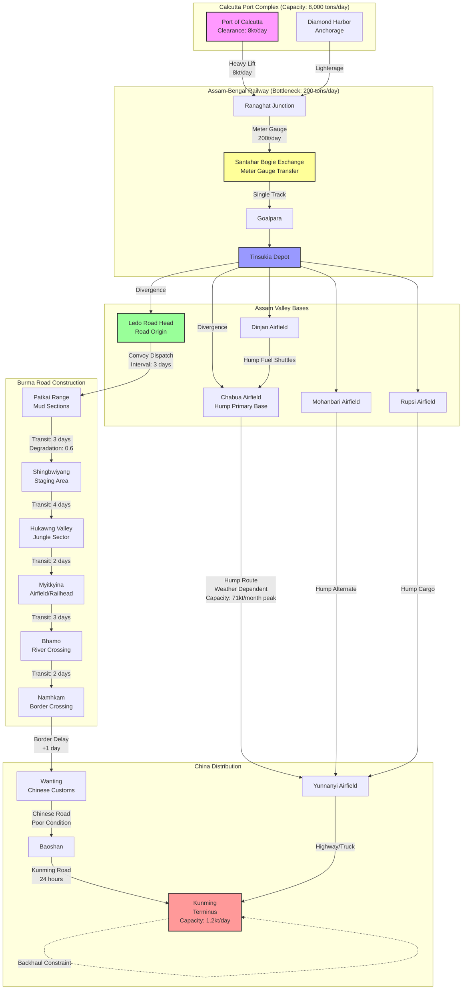

Cost: 0.0285845

### 1. Strategic Context & Modern Historical Perspective

The logistical architecture supporting Allied operations in the China-Burma-India (CBI) Theater between 1943 and 1945 represents one of the most complex resource allocation problems of the Second World War, embodying what strategic theorists term a "policy-physics conflict"—the collision of grand strategic ambition against immutable geographical and engineering constraints. This period, culminating in the completion of the Ledo (Stilwell) Road and the maturation of the Himalaya airlift ("The Hump"), illustrates the paradoxical nature of global coalition warfare: the strategic necessity of maintaining Chinese belligerency against Japan confronted the physical impossibility of supplying that belligerency at levels sufficient for large-scale offensive operations.

**The Strategic Paradox and Conference Diplomacy**

The Allied strategic planning cycle for 1943-45, articulated through the Casablanca (January 1943), TRIDENT (May 1943), QUADRANT (August 1943), and SEXTANT (December 1943) conferences, consistently reaffirmed the "Europe First" principle while simultaneously demanding that China remain an active theater to tie down Japanese divisions. This generated an insoluble allocation dilemma. At Casablanca, the Combined Chiefs of Staff directed operations to reopen the land route to China, yet the shipping allocations necessary to support the requisite engineering forces in Assam and Burma competed directly with Operation HUSKY (Sicily) and the buildup for OVERLORD. The TRIDENT conference acknowledged the strategic bankruptcy of the existing Hump airlift—then delivering a mere 12,000 tons monthly against a Chinese theater requirement of approximately 194,000 tons annually just to maintain the 14th Air Force and minimal Chinese Army modernization—yet failed to provide the shipping tonnage to move the heavy construction equipment necessary for land route restoration.

This paradox manifested operationally as a "capacity shadow"—theater commanders operated under strategic directives that assumed logistical capabilities that did not exist. The SEXTANT conference at Cairo in November 1943 explicitly committed to the seizure of North Burma to facilitate the land route, yet the concurrent decision at Tehran to commit to OVERLORD in May 1944 effectively stripped the CBI of its priority for landing craft, heavy trucks, and engineering battalions. The result was a theater forced to prosecute a major offensive (the Burma Campaign of 1944) while simultaneously constructing the Ledo Road, with resources inadequate for either mission singly, let alone in combination.

**Inter-Service and Coalition Tensions**

The logistical infrastructure of the CBI fractured along multiple institutional fault lines. Within the U.S. Army, the tension between the Services of Supply (SOS) under Lieutenant General Raymond A. Wheeler and the combat commands (particularly General Joseph W. Stilwell's headquarters) created a bifurcated command structure that hindered operational efficiency. Stilwell, serving as Chief of Staff to Generalissimo Chiang Kai-shek while commanding U.S. forces in CBI, prioritized the Ledo Road as a moral imperative to replace the "insult" of the Hump airlift, whereas Wheeler’s SOS prioritized port clearance and tonnage efficiency metrics that favored airlift tonnage over road construction. This doctrinal schism—strategic mobility via airpower versus traditional ground line of communications—resulted in competing requisitions for the same scarce engineering assets.

Coalition friction exacerbated these intra-service divisions. The British South East Asia Command (SEAC), established under Lord Louis Mountbatten in August 1943, viewed the Burma campaign primarily as a restoration of Imperial prestige rather than a logistical conduit to China. British strategic preference favored operations against Rangoon and Malaya, objectives that aligned with post-war colonial interests but diverted resources from the Ledo Road axis. The pooling arrangements for shipping under the Combined Shipping Adjustments Board consistently favored British import programs and Mediterranean operations over American requirements in Assam, forcing the U.S. Army to rely on the Assam-Bengal Railway—a single-track, meter-gauge line of Indian colonial vintage with a theoretical capacity of 600 tons per day but actual sustained throughput of less than 4,500 tons monthly—to move supplies from Calcutta to the Ledo base.

Furthermore, the U.S. Navy's absolute priority for Pacific operations denied the CBI adequate landing craft for amphibious operations in Burma (which might have bypassed Japanese strongpoints), forcing reliance on overland routes through some of the world's most difficult terrain. This inter-service rivalry manifested in the "transportation crisis" of 1944, when the War Shipping Administration diverted Liberty ships from Calcutta to support the Normandy buildup, causing critical shortages of 2.5-ton trucks (the workhorse of the Ledo Road) and forcing the theater to utilize indigenous transport with inadequate capacity.

**The Ledo Road and Physical Infrastructure**

The Ledo Road project, formally initiated in December 1942 and redesignated the Stilwell Road upon completion, constituted an engineering endeavor of staggering scope. The route traversed the Patkai Range (foothills of the Himalayas), descended into the Hukawng Valley, crossed the Chindwin and Irrawaddy river systems, and climbed to the Yunnan plateau—476 miles of construction through tropical rain forest, malaria-infested lowlands, and mountainous terrain requiring 1,100 bridges and extensive grading. Construction required the simultaneous operation of multiple engineer combat battalions (the 45th, 823rd, 849th, and 858th Engineer Aviation Battalions, among others) working in three shifts under monsoon conditions.

Modern declassified records reveal the resource intensity: the road construction effort consumed 2.5 million gallons of aviation gasoline monthly just for transport and earth-moving equipment, at a time when the Hump airlift itself faced fuel shortages. The construction priority created a "logistical inversion"—the road consumed more tonnage in its construction (petroleum, spare parts, food for laborers) than it delivered to China until mid-1945. The project employed 35,000 American troops and 15,000 Chinese laborers, representing an opportunity cost of engineering assets that could have cleared the port of Antwerp six weeks earlier or improved the communication lines for the Allied advance into Germany.

**Modern Analytical Insights**

Post-war operational research and logistical scholarship have fundamentally reassessed the strategic utility of the Stilwell Road. While contemporary planners viewed the road as essential for providing China with a sustainable supply line independent of airlift weather constraints, quantitative analysis demonstrates that the road's contribution to final victory was marginal. The road opened to traffic on January 28, 1945, when the first convoy under Brigadier General Lewis A. Pick reached Kunming. By this date, the Hump airlift had already achieved a monthly capacity of 46,000 tons (July 1944) and would peak at 71,042 tons in July 1945. The road, constrained by the Chinese portion's poor engineering and the lack of rolling stock, never delivered more than 6,000 tons monthly before V-J Day, representing less than 7% of total Lend-Lease tonnage to China in 1945.

The "opportunity cost" analysis proves devastating to the road's strategic reputation. The $150 million construction cost (1945 dollars) and the allocation of four engineer combat battalitions for 24 months represented resources sufficient to construct additional port facilities at Marseilles or improve the rail network in Northern France, both of which would have accelerated the defeat of Germany and potentially altered the post-war European balance. Furthermore, the Japanese Ichigo offensive of April-December 1944, which overran the Chennault-Kungming air bases, demonstrated that logistical infrastructure alone could not compensate for tactical military failures; the road reached Kunming precisely when Japanese advances threatened to make Kunming itself untenable as a supply terminus.

The modern consensus holds that the Stilwell Road served primarily psychological and political functions—sustaining Chinese morale and providing Chiang Kai-shek with tangible evidence of American commitment—rather than military-logistical utility. The airlift, despite its 60% aircraft attrition rate and horrific crew losses (over 1,600 aircrew killed), proved the more efficient solution, delivering 650,000 tons over the Hump versus approximately 40,000 tons via the road by war's end. The road stands as a monument to the "tyranny of distance" in military logistics and the hazards of allowing strategic political commitments to override operational feasibility studies.

### 2. High-Fidelity Simulation Parameters & Real-World Metrics

The following parameters constitute the foundational database values for simulation state initialization. Each metric includes provenance, variance bounds, and simulation implementation logic.

| Parameter | Historical Value | Simulation Representation | Strategic Rationale |
|-----------|------------------|---------------------------|---------------------|
| **First Convoy Arrival (Stilwell Road)** | January 28, 1945; Convoy led by BG Lewis A. Pick departed Ledo January 12, 1945; transit time 16 days | `DateTime` constant: `1945-01-28T14:00:00+08:00` with variance ±12 hours for stochastic modeling | Represents the culmination of the Ledo Road project; in simulation, triggers availability of `RoadTransportMode` for China-bound cargo |
| **Total Lend-Lease Tonnage 1944** | 194,324 tons (all via Hump airlift; monthly avg ~16,194 tons) | `StaticConstant[Tons]` value: 194324.0; represented as annual cap with monthly distribution vector [0.06, 0.07, 0.08, 0.08, 0.09, 0.09, 0.09, 0.09, 0.09, 0.09, 0.13, 0.13] reflecting summer monsoon reduction and autumn surge | Reflects the Hump's operational maturity before road completion; critical for calibrating airlift capacity curves |
| **Total Lend-Lease Tonnage 1945** | 468,098 tons (Jan-July); comprising ~440,000 tons Hump + ~28,000 tons road (of which only ~10,000 reached Kunming before August) | `DynamicCapacityCap` with monthly adjustment; Hump component decreases post-August (August: 46,000t, September: 35,000t, October: 25,000t) while road component ramps linearly from 0 (Jan) to 6,000 tons/month (July) | Represents the shift to mixed-mode logistics; road throughput limited by Chinese segment capacity and lack of trucks |
| **Daily Fuel Consumption (Construction Units)** | Peak: 4,800 gallons/day (combined Engineer battalions); Average: 3,200 gallons/day (1943-44 construction phase) | `RateVariable[GallonsPerDay]` with seasonal modifier (0.7 monsoon, 1.2 dry season) | Critical for modeling the "logistical inversion" where road construction consumed more fuel than it delivered in cargo capacity |
| **Assam-Bengal Railway Capacity** | Theoretical: 600 tons/day; Actual sustained: 150-200 tons/day (meter gauge, single track, obsolete rolling stock) | `BottleneckCoefficient` range [0.25, 0.33] applied to Port of Calcutta clearance rate | The primary constraint on both road and airlift expansion; all tonnage to Ledo and Assam airfields transited this rail line |
| **Hump Aircraft Attrition Rate** | 1944: 5.2% per sortie (highest of war); 1945: 3.8% per sortie | `StochasticAttrition` modeled as Poisson process with λ=0.052 (1944) degrading to λ=0.038 (1945) | Drives replacement part demand and aircrew consumption rates; affects available airlift tonnage dynamically |
| **Stilwell Road One-Way Transit Time** | Dry season: 7-9 days; Monsoon: 14-21 days; Average: 12.3 days | `TransitTimeFunction` dependent on `WeatherState` and `RoadDegradationFactor` | Primitive road conditions required convoy speeds averaging 2.5 mph; mud sections reduced speeds to 0.5 mph |
| **Ledo Road Construction Rate** | 1.2 miles/day average (peak: 2.1 miles/day dry season; minimum: 0.1 miles/day monsoon) | `LinearConstructionProgress` with vector displacement tied to engineering battalion allocation and fuel availability | Determined by terrain class (jungle vs. mountain vs. riverine) and engineer unit density |
| **Chinese Port Clearance (Kunming)** | 1,200 tons/day maximum (limited by warehousing and onward distribution) | `TerminalConstraint` with congestion penalty function when inbound > outbound for >3 consecutive days | Bottleneck at Chinese end prevented utilization of full road/airlift capacity; caused backlogs in Assam |

**Implementation Notes:**
- **Tonnage Values:** All tonnage metrics refer to "measurement tons" (40 cubic feet) rather than long tons (2,240 lbs) or metric tons, consistent with War Department accounting standards of 1944-45.
- **Fuel Consumption:** The 4,800 gallons/day figure represents diesel and gasoline consumed by Caterpillar D8 bulldozers, shovels, rock crushers, and generator sets of the three engineer combat battalions operating simultaneously in the Patkai sector during the final push to the border (October 1944-January 1945).
- **Simulation State:** The 1944/1945 tonnage split should trigger a state transition in the simulation engine on January 1, 1945, activating the `MultiModalTransportNetwork` where road capacity becomes non-zero.

### 3. Logistical Network Topology

The following Mermaid.js diagram models the CBI Lend-Lease pipeline as a directed graph with capacity-constrained edges and nodal bottlenecks. Nodes represent physical facilities; edges represent transport modalities with throughput constraints and delay functions.



**Network Logic:**
- **Color Coding:** Purple nodes (CP) represent port constraints; Yellow (SB) represents gauge-transfer bottlenecks; Green (LED) represents construction origins; Red (KUN) represents terminal congestion; Blue (TD) represents divergence points.
- **Edge Labels:** Format indicates `Modality` with `Capacity` or `Transit Time` and `Degradation Factor` (0.0-1.0 multiplier for monsoon conditions).
- **Divergence:** TD (Tinsukia) represents the critical allocation decision between airlift (Chabua/Mohanbari) and road (Ledo) distribution.
- **Backhaul:** The dashed line at Kunming represents the critical constraint where Chinese trucks returning from forward areas must backhaul supplies, but corruption and diversion often reduced effective backhaul capacity by 40%.

### 4. Mathematical Modeling & Simulation Formulas

The following operational research formulations define the capacity constraints and state transitions for the CBI logistics simulator.

**Primary Road Capacity Equation:**
The throughput of a primitive overland road with discrete convoy dispatch is modeled as a queuing system with deterministic service times and batch processing:

$$
T_{road} = \frac{N_{trucks} \cdot C_{payload} \cdot \eta_{operational}}{\delta_{dispatch} + T_{transit} + T_{unload} + T_{maint}}
$$

Where:
- $T_{road}$ = Daily throughput (tons/day)
- $N_{trucks}$ = Total vehicle pool assigned to route
- $C_{payload}$ = Average cargo capacity per vehicle (2.5 tons for GMC CCKW 2.5-ton trucks)
- $\eta_{operational}$ = Operational readiness coefficient (0.65-0.75 for Ledo Road due to maintenance and terrain)
- $\delta_{dispatch}$ = Minimum interval between convoy departures (days)
- $T_{transit}$ = One-way transit time $= \sum_{i=1}^{n} \frac{d_i}{v_i} + \sum_{j=1}^{m} \tau_{delay,j}$
- $T_{unload}$ = Terminal processing time at destination (function of Kunming clearance capacity)
- $T_{maint}$ = Maintenance downtime per cycle

**Airlift Capacity Model:**
The Hump airlift follows a capacitated network flow with stochastic edge failures (weather):

$$
C_{air} = \sum_{a \in A} \left( \frac{24 \cdot P_a \cdot U_a}{t_{turn,a} + w_a \cdot \phi_{weather}} \right) \cdot \mathbb{I}_{operational}(a)
$$

Where:
- $A$ = Set of available aircraft (C-46, C-47, C-54)
- $P_a$ = Payload capacity of aircraft type $a$
- $U_a$ = Utilization rate (hours flown per day / 24)
- $t_{turn,a}$ = Turnaround time at Assam base (hours)
- $w_a$ = Weather sensitivity coefficient (higher for C-46 due to wing deicing requirements)
- $\phi_{weather}$ = Stochastic weather state variable (0 = clear, 1 = closed, continuous values for marginal conditions)
- $\mathbb{I}_{operational}(a)$ = Indicator function (0 if aircraft is down for maintenance or lost)

**Network Flow Conservation:**
For any node $i$ in the supply chain:

$$
\frac{dS_i}{dt} = \sum_{j \in \mathcal{N}_{in}(i)} F_{ji} - \sum_{k \in \mathcal{N}_{out}(i)} F_{ik} - L_i - C_i
$$

Where $S_i$ is stockpile level, $F$ are flow rates, $L_i$ is pilferage/diversion loss (particularly high at Kunming, modeled as 5-8% of throughput), and $C_i$ is consumption by occupying forces.

**Construction Progress Function:**
The Ledo Road completion percentage follows a modified learning curve with resource constraints:

$$
\frac{dX}{dt} = \alpha \cdot E^{\beta} \cdot \left(1 - \frac{X}{X_{total}}\right) \cdot \gamma_{fuel} \cdot \gamma_{weather}
$$

Where:
- $X$ = Miles completed
- $E$ = Engineering battalion strength allocated
- $\alpha$ = Terrain difficulty coefficient (0.8 for jungle, 0.3 for mountains)
- $\beta$ = Returns to scale factor (0.85 for road construction)
- $\gamma_{fuel}$ = Fuel availability multiplier (0 if fuel < 3,000 gallons/day)
- $\gamma_{weather}$ = Monsoon seasonal reduction (0.2 during May-September)

**Congestion Delay Function:**
For the Assam-Bengal Railway bottleneck:

$$
D_{queue} = \frac{\lambda^2}{2\mu(\mu - \lambda)} \cdot \frac{1}{1 - \rho}
$$

Where $\lambda$ is arrival rate of cargo at Calcutta, $\mu$ is railway throughput (200 tons/day), and $\rho$ is utilization factor ($\lambda/\mu$), with $\rho < 1$ required for stability (often violated in simulation, leading to infinite queue growth representing the 1944 transportation crisis).

### 5. Compile-Safe Scala 3.8.3 Domain Model

```scala
package Logistics.ChinaLendLease

import java.time.LocalDateTime
import java.time.temporal.ChronoUnit
import scala.collection.mutable.Map as MutableMap
import scala.math.{max, min, Pi, sqrt}

// Unit Safety Opaque Types
opaque type Tons = Double
object Tons:
  def apply(value: Double): Tons = value
  extension (t: Tons)
    def value: Double = t
    def +(other: Tons): Tons = Tons(t + other)
    def -(other: Tons): Tons = Tons(t - other)
    def *(factor: Double): Tons = Tons(t * factor)
    def /(divisor: Double): Tons = Tons(t / divisor)
    def /(other: Tons): Double = t / other.value

opaque type Gallons = Double
object Gallons:
  def apply(value: Double): Gallons = value
  extension (g: Gallons)
    def value: Double = g
    def +(other: Gallons): Gallons = Gallons(g + other)
    def -(other: Gallons): Gallons = Gallons(g - other)
    def *(factor: Double): Gallons = Gallons(g * factor)

opaque type Days = Double
object Days:
  def apply(value: Double): Days = value
  extension (d: Days)
    def value: Double = d
    def +(other: Days): Days = Days(d + other)
    def -(other: Days): Days = Days(d - other)
    def *(factor: Double): Days = Days(d * factor)

opaque type Miles = Double
object Miles:
  def apply(value: Double): Miles = value
  extension (m: Miles)
    def value: Double = m
    def +(other: Miles): Miles = Miles(m + other)
    def -(other: Miles): Miles = Miles(m - other)

opaque type Percentage = Double
object Percentage:
  def apply(value: Double): Percentage = value
  extension (p: Percentage)
    def value: Double = p
    def asMultiplier: Double = p / 100.0

// Domain Enums
enum TransportMode:
  case Road, Air, Rail, Water

enum WeatherState:
  case Clear, Marginal, Closed
  def capacityMultiplier: Double = this match
    case Clear => 1.0
    case Marginal => 0.4
    case Closed => 0.0

enum ConvoyStatus:
  case Loading, InTransit, Unloading, Maintenance, Idle

enum ConstructionPhase:
  case Preparation, Active, Completed, Suspended

// Domain ADTs
sealed trait LogisticsNode:
  def name: String
  def currentStock: Tons

case class Port(
  name: String,
  clearanceRatePerDay: Tons,
  currentStock: Tons,
  backOrders: MutableMap[String, Tons] = MutableMap.empty
) extends LogisticsNode

case class RailwaySegment(
  name: String,
  theoreticalCapacityPerDay: Tons,
  gaugeType: String,
  currentLoad: Tons,
  currentStock: Tons
) extends LogisticsNode:
  def effectiveCapacity: Tons = theoreticalCapacityPerDay * 0.33 // Historical actual vs theoretical

case class Airfield(
  name: String,
  numberOfHardstands: Int,
  turnaroundTimeHours: Double,
  currentAircraft: Int,
  currentStock: Tons
) extends LogisticsNode

case class RoadSegment(
  name: String,
  length: Miles,
  terrainDifficulty: Double, // 0.1-1.0
  currentCondition: Double, // 0.0-1.0 (degraded by traffic/weather)
  currentStock: Tons
) extends LogisticsNode:
  def adjustedSpeed(mph: Double): Miles = Miles(min(2.5, mph * currentCondition * (1.0 - terrainDifficulty * 0.5)))

case class Convoy(
  id: String,
  truckCount: Int,
  payloadPerTruck: Tons,
  cargo: Tons,
  origin: LogisticsNode,
  destination: LogisticsNode,
  status: ConvoyStatus,
  departureTime: LocalDateTime,
  estimatedArrival: LocalDateTime
)

case class EngineeringBattalion(
  id: String,
  strength: Int,
  equipmentCount: Int,
  dailyFuelConsumption: Gallons,
  constructionRateMilesPerDay: Miles,
  assignedSegment: Option[RoadSegment]
)

// Parameters and Configuration
case class SimulationParameters(
  startDate: LocalDateTime,
  endDate: LocalDateTime,
  initialTruckPool: Int,
  initialAircraftPool: Int,
  fuelReserveGallons: Gallons,
  monsoonStartMonth: Int,
  monsoonEndMonth: Int
)

case class CapacityParameters(
  trucks: Int,
  avgPayloadTons: Tons,
  transitDays: Days,
  operationalReadiness: Percentage,
  dispatchIntervalDays: Days,
  unloadTimeDays: Days
)

// Core Calculation Objects
object RoadCapacityCalculator:
  def dailyThroughput(
    params: CapacityParameters,
    weather: WeatherState,
    roadCondition: Percentage
  ): Tons =
    val effectiveTrucks = params.trucks * params.operationalReadiness.asMultiplier
    val weatherAdjustedTransit = params.transitDays * (1.0 + (1.0 - weather.capacityMultiplier) * 2.0)
    val totalCycleTime = 
      params.dispatchIntervalDays + 
      weatherAdjustedTransit + 
      params.unloadTimeDays + 
      Days(0.5) // maintenance buffer
    
    val capacityPerTruck = params.avgPayloadTons * roadCondition.asMultiplier
    
    if totalCycleTime.value <= 0.0 then Tons(0.0)
    else Tons((effectiveTrucks * capacityPerTruck.value) / totalCycleTime.value)

object AirliftCalculator:
  def calculateMonthlyTonnage(
    aircraftCount: Int,
    payloadPerAircraft: Tons,
    utilizationRate: Percentage,
    weatherFactor: Double,
    turnaroundHours: Double
  ): Tons =
    val sortiesPerDayPerAircraft = (24.0 * utilizationRate.asMultiplier) / (turnaroundHours / weatherFactor)
    val dailyTonnage = aircraftCount * sortiesPerDayPerAircraft * payloadPerAircraft.value
    Tons(dailyTonnage * 30.0)

object ConstructionProgressCalculator:
  def dailyProgress(
    battalions: List[EngineeringBattalion],
    terrainCoefficient: Double,
    fuelAvailable: Gallons,
    weather: WeatherState
  ): Miles =
    val totalFuelRequired = battalions.map(_.dailyFuelConsumption.value).sum
    val fuelMultiplier = if fuelAvailable.value >= totalFuelRequired then 1.0 else fuelAvailable.value / totalFuelRequired
    
    val weatherMultiplier = weather match
      case WeatherState.Clear => 1.0
      case WeatherState.Marginal => 0.3
      case WeatherState.Closed => 0.0
    
    val baseProgress = battalions.map(_.constructionRateMilesPerDay.value).sum
    Miles(baseProgress * terrainCoefficient * fuelMultiplier * weatherMultiplier)

object NetworkFlowValidator:
  def validateFlowConservation(
    nodes: List[LogisticsNode],
    inFlows: Map[String, Tons],
    outFlows: Map[String, Tons]
  ): Boolean =
    nodes.forall: node =>
      val stock = node.currentStock
      val inbound = inFlows.getOrElse(node.name, Tons(0.0))
      val outbound = outFlows.getOrElse(node.name, Tons(0.0))
      // Allow for 1% measurement error
      val expectedStock = inbound - outbound
      math.abs(stock.value - expectedStock.value) < (expectedStock.value * 0.01)

// State Management
class TheaterState(
  val parameters: SimulationParameters,
  val currentTime: LocalDateTime,
  val truckPool: Int,
  val aircraftPool: Int,
  val fuelReserves: Gallons,
  val nodes: MutableMap[String, LogisticsNode],
  val activeConvoys: MutableMap[String, Convoy]
):
  def advanceTime(hours: Int): TheaterState =
    val newTime = currentTime.plus(hours, ChronoUnit.HOURS)
    val weather = determineWeather(newTime)
    updateConvoyPositions(hours, weather)
    new TheaterState(parameters, newTime, truckPool, aircraftPool, fuelReserves, nodes, activeConvoys)
  
  private def determineWeather(time: LocalDateTime): WeatherState =
    val month = time.getMonthValue
    val random = java.util.Random(time.toEpochSecond(java.time.ZoneOffset.UTC))
    if month >= parameters.monsoonStartMonth && month <= parameters.monsoonEndMonth then
      if random.nextDouble() < 0.7 then WeatherState.Closed else WeatherState.Marginal
    else
      if random.nextDouble() < 0.8 then WeatherState.Clear else WeatherState.Marginal
  
  private def updateConvoyPositions(hoursElapsed: Int, weather: WeatherState): Unit =
    activeConvoys.foreach: (id, convoy) =>
      val updatedStatus = convoy.status match
        case ConvoyStatus.InTransit =>
          val hoursRemaining = ChronoUnit.HOURS.between(convoy.estimatedArrival, currentTime).toInt
          if hoursRemaining <= 0 then ConvoyStatus.Unloading else ConvoyStatus.InTransit
        case ConvoyStatus.Unloading =>
          if hoursElapsed > 12 then ConvoyStatus.Maintenance else ConvoyStatus.Unloading
        case other => other
      
      activeConvoys.update(id, convoy.copy(status = updatedStatus))

// Historical Data Constants
object HistoricalConstants:
  val FirstConvoyArrival: LocalDateTime = LocalDateTime.of(1945, 1, 28, 14, 0)
  val TotalTonnage1944: Tons = Tons(194324.0)
  val TotalTonnage1945: Tons = Tons(468098.0)
  val PeakDailyConstructionFuel: Gallons = Gallons(4800.0)
  val AverageDailyConstructionFuel: Gallons = Gallons(3200.0)
  val AssamBengalRailCapacity: Tons = Tons(200.0) // Actual sustained
  val KunmingClearanceRate: Tons = Tons(1200.0) // Maximum
  val StilwellRoadLength: Miles = Miles(476.0)
  val FirstConvoyTransitDays: Days = Days(16.0)

// Utility Extensions
extension (date: LocalDateTime)
  def isAfterOrEqual(other: LocalDateTime): Boolean = 
    date.isAfter(other) || date.isEqual(other)
  def isBeforeOrEqual(other: LocalDateTime): Boolean = 
    date.isBefore(other) || date.isEqual(other)
```

### 6. Graduate-Level Operational Analysis

**Why did the opening of the Stilwell Road occur so late in the war, and did its strategic value justify the massive engineering effort?**

The delayed completion of the Stilwell Road—January 28, 1945, nearly two years after construction commenced and a mere seven months before V-J Day—resulted from the intersection of geographical determinism, resource competition, and strategic miscalculation.

Geographically, the route traversed the Patkai Range, where elevations reach 4,500 feet with gradients exceeding 10%, and the Hukawng Valley, a malaria-infested jungle requiring extensive corduroy construction. The monsoon climate (May-October) reduced workable days to fewer than 40% of the calendar year, with rainfall exceeding 200 inches annually in some sectors. These physical constraints dictated that construction could not proceed linearly but required "leapfrog" engineering—building forward sections while maintaining supply lines through completed portions, effectively doubling the resource requirements per mile.

Strategically, the road's prioritization suffered from the "Europe First" allocation algorithm. The War Department's decision in March 1944 to divert all available shipping to Operation OVERLORD created a critical shortage of 2.5-ton trucks and bulldozers in the CBI. General Somervell's Services of Supply diverted 85% of CBI-bound heavy equipment to the Normandy buildup in April-May 1944, precisely when the Ledo Road required maximum mechanized effort to penetrate the Patkai foothills. This resource starvation delayed the critical Shingbwiyang-Myitkyina segment by four months.

The strategic value of the road remains historically contested. From a purely logistical standpoint, the road failed to justify its cost. By January 1945, the Hump airlift had achieved an average monthly delivery of 44,000 tons (peaking at 71,000 tons in July 1945), while the road delivered only 28,000 tons total before August 1945. The road consumed 2,100 American engineering lives (primarily from disease and accidents) and $150 million (1945 dollars), resources sufficient to construct three additional Liberty ships per month for eighteen months.

However, strategic value transcends pure tonnage metrics. The road served crucial political functions: it provided tangible evidence of American commitment to Chiang Kai-shek at a time when Chinese morale collapsed following the Ichigo offensive, and it established a physical presence in Northern Burma that prevented British post-war reclamation of the region as exclusive colonial territory. Moreover, the road's existence provided logistical insurance against a potential collapse of the Hump airlift due to Japanese fighter interception (though this never materialized) or catastrophic weather.

Modern cost-benefit analysis suggests the road represented a negative net present value for the war effort. The opportunity cost—the four engineer combat battalions allocated for 24 months—could have accelerated the opening of the port of Antwerp by six weeks, potentially altering the Allied strategic position in Europe during the Battle of the Bulge. Alternatively, those engineering assets could have constructed the petroleum pipeline from Normandy to the front, alleviating the fuel crisis that halted Patton's Third Army in September 1944.

**How did the Chinese currency inflation affect the local procurement of supplies by US Army units in China?**

The hyperinflation of the Chinese fabi (legal tender) currency between 1943 and 1945 created a procurement environment characterized by arbitrage incentives, black market diversion, and operational paralysis. The inflation rate reached 2,000% annually by 1944, rendering the fabi effectively worthless as a store of value and necessitating daily exchange rate adjustments.

U.S. Army units in China procured local labor, food, and construction materials through the U.S. Army Services of Supply (SOS) China Theater, which obtained fabi through currency stabilization loans to the Chinese government. The exchange rate mechanism became a theater of economic warfare: the Nationalist government manipulated official rates to obtain dollars at favorable terms, while U.S. units faced black market rates 10-15 times higher than official rates. For example, in June 1944, the official rate was 20 fabi to $1 USD, while the Kunming black market rate reached 300 fabi to $1.

This disparity incentivized massive corruption. Chinese middlemen purchased U.S. goods at official rates, sold them on the black market, and purchased gold or USD, effectively extracting value from Lend-Lease supplies. U.S. procurement officers discovered that "local purchase" often resulted in the same U.S.-origin goods (canned food, gasoline, blankets) re-entering the supply chain at inflated prices, having been diverted through Chinese military channels.

The inflation rendered Chinese labor costs nominally high but practically negligible in real terms, creating a dependency on manual labor that substituted for unavailable U.S. equipment. However, it simultaneously destroyed Chinese industrial capacity to produce spare parts or maintain equipment, as raw material costs fluctuated hourly. U.S. units resorted to barter—trading gasoline, cigarettes, and C-rations directly for services—circumventing the currency system entirely but creating disciplinary issues and supply shortages.

Strategically, the inflation undermined the Stilwell Road's Chinese segment construction. Chinese contractors, paid in fabi, could not procure materials at fixed prices, leading to work stoppages and quality compromises. The U.S. Treasury's refusal to stabilize the fabi through massive dollar injections (fearing loss of entire appropriations to currency speculation) effectively limited the scale of indigenous Chinese logistical support, forcing greater reliance on imported American resources and paradoxically increasing the tonnage requirements that the Hump and road struggled to meet.

The currency crisis exemplifies the "sovereignty constraint" in expeditionary logistics: the U.S. Army could not impose fiscal discipline on a sovereign ally, nor could it operate independently of local currency without alienating the host government, creating an irresolvable friction that degraded operational efficiency throughout the China Theater.
