Cost: 0.1719835

## 1. Strategic Context & Modern Historical Perspective

### The China logistics problem after 1942

By 1943, Allied support to China was governed less by the nominal quantity of matériel allocated under Lend-Lease than by the capacity of a long, discontinuous, and politically fragmented transportation system. Japanese seizure of Rangoon and closure of the prewar Burma Road in 1942 had severed China’s only practicable high-capacity surface connection with the Indian Ocean. Thereafter, supplies destined for China had to move through a chain comprising ocean shipping to India, discharge at congested Indian ports, rail movement across the subcontinent, transshipment into Assam, and either air movement over “the Hump” or eventual surface movement through northern Burma.

This distinction between allocation and delivery is essential. A ton “allocated to China,” a ton shipped from the United States, a ton landed in India, a ton received in Assam, and a ton delivered to Kunming represented different logistical states. Months or even years could separate them. Losses, diversions, storage congestion, rail delays, weather, incompatible documentation, and theater-level reallocation intervened at every stage. A simulator must therefore avoid treating Lend-Lease as an instantaneous transfer between national inventories. It was a staged flow through a capacity-constrained network.

The overland solution was the Ledo Road, later officially renamed the Stilwell Road. It began at Ledo in Assam, crossed the Patkai Range into northern Burma, passed through Shingbwiyang, Myitkyina, and Bhamo, and joined the old Burma Road near Mong Yu. From there traffic continued through Wanting and Lashio’s wider road network toward Kunming. The project depended upon combat operations to secure northern Burma, the construction or rehabilitation of hundreds of miles of road, bridge building in monsoon country, and installation of parallel petroleum pipelines.

The first through convoy did not arrive at Kunming until **4 February 1945**. By then the operational setting that had justified the project had changed substantially.

### The strategic paradox

At Casablanca in January 1943, TRIDENT in May, QUADRANT in August, and SEXTANT in November–December, Allied leaders repeatedly affirmed the desirability of sustaining China as a belligerent, establishing air power in China, reopening land communications, and conducting operations in Burma. These commitments coexisted with preparations for the invasion of northwest Europe, the Mediterranean campaigns, the Pacific offensives, the strategic bombing campaign, and the global antisubmarine war.

The resulting paradox was that conference decisions could create missions but could not create ships, port berths, locomotives, landing craft, trucks, engineers, aviation fuel, or trained transportation personnel. Strategic plans were often framed in terms of divisions, air groups, or offensives, while execution depended on lower-level variables such as ship turnaround time, hatch productivity, railcar availability, bridge classifications, depot clearance, pipeline pumping capacity, and the number of serviceable trucks completing a round trip.

The India–China pipeline exposed this mismatch especially clearly. Ocean transport to India was only the first stage. Calcutta and other ports had to handle military cargo while supporting the Indian civil economy, British imperial forces, and operations throughout Southeast Asia. Cargo then entered the Indian railway system, which was divided among different gauges, administrative jurisdictions, and operating companies. Transshipment was required at several points, and the Bengal and Assam railway approaches had limited capacity. Even when a ship discharged on schedule, cargo could accumulate in port or intermediate depots because inland clearance was slower than ocean arrival.

Combat loading introduced a related problem. Ships loaded for tactical discharge sacrificed volumetric efficiency for accessibility, while ships commercially loaded for maximum capacity could take longer to unload and sort. A cargo needed urgently in Assam might be buried beneath less urgent consignments. Theater priorities could also change during a ship’s voyage. The physical packing sequence thus became a strategic variable.

Conference-level promises to China were consequently constrained by the minimum throughput of a serial network:

$$
Q_{\text{China}} \leq
\min
\left(
Q_{\text{ocean}},
Q_{\text{port}},
Q_{\text{Indian rail}},
Q_{\text{Assam}},
Q_{\text{Hump}}+Q_{\text{road}}+Q_{\text{pipeline}}
\right)
$$

Expanding one stage without expanding the next often moved the queue rather than eliminating it. More shipping could increase congestion at Calcutta. More rail arrivals could overwhelm Assam depots. More aircraft could be ineffective without fuel, maintenance, airfield construction, weather forecasting, and replacement crews.

### Coalition and inter-service tensions

The India–Burma–China system was not under a single sovereign or operational authority. American, British, Indian, and Chinese organizations shared infrastructure but pursued partially different goals.

The British viewed India as both a major base and a politically vulnerable imperial possession. They had obligations to defend India, recover Burma, sustain the Indian economy, and support operations in Southeast Asia. American leaders, particularly General Joseph W. Stilwell, emphasized reopening communications with China and creating effective Chinese combat forces. Chiang Kai-shek’s government sought matériel but resisted arrangements that threatened Chinese sovereignty, weakened its control over forces, or strengthened political and military rivals.

American command arrangements were themselves divided. Stilwell simultaneously served in several roles, including theater commander, Chiang’s chief of staff, and commander concerned with Chinese forces in India. The Army Air Forces prioritized Hump tonnage and the support of air operations in China. The Services of Supply had to maintain the ports, railway interfaces, depots, truck fleets, construction projects, pipelines, hospitals, and base installations from which combat operations depended. Combat commanders naturally demanded forward concentration of personnel and equipment; service commanders warned that combat power could not be sustained if line-of-communications requirements were underfunded.

The Hump also generated priority disputes. Aviation gasoline, bombs, spare parts, communications equipment, and airfield supplies competed with weapons and equipment for Chinese ground forces. A ton of aviation fuel delivered to China could directly support air operations but consumed significant additional fuel and maintenance effort during air transport. A truck delivered over the Stilwell Road was simultaneously a cargo item and, potentially, part of the transport system. If retained in China, it increased Chinese mobility; if returned, it supported repeated convoy operations. In practice, many first-run vehicles were delivered as Lend-Lease and did not return, making nominal convoy payload calculations misleading unless the vehicle itself is counted as delivered matériel.

Army–Navy and Anglo-American shipping-pool tensions appeared farther upstream. Shipping was globally pooled in principle, but assignments had opportunity costs. Hulls serving India could not simultaneously support buildup in Britain, Mediterranean operations, or Pacific advances. British and American planners used different accounting conventions and did not always agree on which cargoes, ships, or theater activities should receive priority. The scarcity was not merely aggregate deadweight tonnage. Scarce ship types, tanker space, refrigerated capacity, escorts, landing ships, and ships capable of operating particular ports were not interchangeable.

### Construction of the Ledo–Stilwell Road

The road’s late opening was not primarily the result of simple administrative delay. It reflected the interaction of terrain, weather, combat, disease, and construction logistics. The route crossed steep mountain country and river systems in one of the world’s heaviest monsoon environments. Road cuts failed, embankments washed out, bridges were repeatedly endangered, and traffic transformed inadequately surfaced sections into mud. Malaria, scrub typhus, dysentery, and other diseases reduced effective labor strength. Heavy equipment had to be imported, maintained, fueled, and supplied with replacement parts at the end of an already weak line of communications.

Construction could advance only as northern Burma was secured. Myitkyina was especially important because of its airfield, road position, and place in the broader communications network. Japanese resistance and the 1944 campaign delayed the ability to establish a reliable through route. Even after a trace existed, a road was not operationally complete merely because a vehicle had traversed it once. Bridges, drainage, surfacing, workshops, traffic-control points, fuel stocks, recovery vehicles, and maintenance detachments were required for sustained convoy operation.

Road construction units in Burma required approximately **200,000 gallons of fuel per day** at peak construction intensity. This figure illustrates the project’s recursive burden: the transport system consumed large quantities of the very transport capacity it was intended to expand. Bulldozers, graders, compressors, dump trucks, tractors, bridging equipment, generators, and support vehicles all required petroleum. The associated pipeline reduced dependence on fuel trucks, but building and operating that pipeline imposed additional engineering and maintenance requirements.

### The Hump and the changing value of the road

The original strategic case for the road assumed that air transport alone could not deliver the volume required to sustain China. In 1942 and 1943 this was reasonable. Early Hump operations suffered from inadequate aircraft, airfields, navigational aids, weather forecasting, maintenance capacity, and command arrangements. Flights crossed some of the world’s most difficult terrain in severe weather and within reach of Japanese aircraft. Loss rates and maintenance demands were high.

By late 1944 and 1945, however, the Hump had become a substantially more mature industrial air-transport system. Improved aircraft, including the C-46 and later C-54 on suitable routes, expanded airfields, better weather services, standardized maintenance, stronger traffic control, and increased fuel availability produced a large rise in throughput. At the moment the road finally opened, air transport was already carrying the dominant share of supplies entering China. Depending on the period and whether pipeline petroleum is counted separately, air transport accounted for more than four-fifths of forward China deliveries around the transition to through-road operations.

The road nevertheless had qualities that airlift lacked. It could deliver vehicles, bulky engineering equipment, and cargoes that were inefficient or hazardous to carry by air. Surface transport had lower direct energy costs per ton-mile once the route was established, and the road provided redundancy. The pipeline beside the route was particularly important because liquid fuel could move without tying up an equivalent number of cargo trucks.

Yet these advantages must be evaluated against timing and sunk cost. Through service began only six months before Japan’s surrender. The road never approached the long-run strategic importance anticipated in 1942–43. Its effective wartime utilization period was too short to amortize the enormous engineering investment.

### Modern assessment and the European counterfactual

Modern scholarship generally regards the Stilwell Road as an extraordinary engineering accomplishment but a weak strategic investment when evaluated solely by delivered wartime tonnage. Its estimated financial cost, extensive equipment requirements, large engineer force, fuel consumption, and disease burden were disproportionate to the relatively brief period of through operation. The Hump, despite high aircraft and personnel losses, expanded more quickly and ultimately delivered the dominant fraction of wartime supplies reaching China.

The common counterfactual—that the same heavy engineering resources could have cleared ports or rehabilitated railways in Europe—has merit but requires qualification. Engineer battalions, bulldozers, bridging sets, trucks, petroleum equipment, and shipping space were genuinely scarce global resources. European port clearance after the Normandy invasion, particularly the struggle to develop Cherbourg and later Antwerp, demonstrates the value of such assets. Nevertheless, resources already deployed in India and Burma were not instantly transferable. Redeployment would have consumed shipping, time, and organizational effort, while specialized tropical-road experience did not map perfectly onto port reconstruction. The strongest criticism is therefore not that every resource could have been moved directly to Europe, but that the Allied allocation process committed substantial globally scarce capacity to a project whose strategic payoff was highly sensitive to completion date.

The road also served political and coalition purposes that a narrow ton-mile comparison omits. It demonstrated continued Allied commitment to China, helped sustain Chinese participation in the war, supported northern Burma operations, and provided a visible replacement for the lost Burma Road. These effects are difficult to quantify but should not be treated as nonexistent. A high-fidelity simulation should consequently model both material utility and political value. The historically correct conclusion is not that the road had no utility, but that its marginal military utility in 1945 was much lower than planners had expected when the project was approved.

---

## 2. High-Fidelity Simulation Parameters & Real-World Metrics

### Core historical constants

The tonnage figures below use **short tons** unless otherwise stated. This is essential because British and some theater records also used long tons, while shipping records sometimes used measurement tons. Database records should preserve the original unit and conversion provenance rather than silently normalizing unlike series.

| Parameter | Historical value | Scope and interpretation | Simulation representation |
|---|---:|---|---|
| First through convoy departure from Ledo | **12 January 1945** | The first convoy to traverse the completed connection left Ledo under Brig. Gen. Lewis A. Pick. Departure did not mean the route had reached stable operational capacity. | `LocalDate` event enabling `TrialOperations`; do not immediately set road capacity to its mature maximum. |
| First truck convoy arrival at Kunming | **4 February 1945** | The first convoy, commonly reported as 113 vehicles, reached Kunming after passing through northern Burma and connecting with the old Burma Road. | Fixed milestone. Transitions the route from `TrialOperations` to `Open`, subject to bridge, security, and maintenance conditions. |
| Transit time of first convoy | **23 elapsed days** | Difference between 12 January and 4 February, using elapsed-date subtraction. The convoy included ceremonies, inspections, difficult road segments, and initial-route friction; this is not a universal steady-state travel time. | Initial observed transit duration. Use as a calibration point, not an immutable duration. |
| Lend-Lease tonnage delivered into China, 1944 | **Approximately 268,000 short tons** | Predominantly Hump airlift, including U.S. Army Air Forces/ATC and associated forward movement. Exact totals vary slightly by accounting cutoff and treatment of CNAC, petroleum, mail, and passenger baggage. | Annual validation target. Store as an observed aggregate with source-series metadata, not as a capacity constant. |
| Lend-Lease tonnage delivered into China, 1945 | **Approximately 735,000 short tons** | Combined wartime delivery by air, road, and pipeline during the greatly expanded 1945 system. Published totals vary where the reporting period ends at V-J Day rather than 31 December. | Annual or war-period validation target. Break into route-specific observations before calibrating arc capacities. |
| Peak daily fuel requirement of Burma road-construction organization | **Approximately 200,000 U.S. gallons per day** | Fuel for road and associated construction activity, including heavy equipment, dump trucks, tractors, graders, generators, and support vehicles. It represents a peak planning requirement rather than a constant for every project phase. | Dynamic internal demand. Subtract from theater fuel inventory before assigning petroleum to outbound cargo or combat formations. |
| U.S. gallon to liters | **3.785411784 L** | Exact modern conversion. | Static conversion constant. |
| Short ton to kilograms | **907.18474 kg** | Exact conversion. | Static conversion constant. |
| Long ton to short tons | **1.12 short tons** | A long ton is 2,240 lb; a short ton is 2,000 lb. | Static conversion coefficient. |
| Nominal first-convoy vehicle count | **113 vehicles** | Often cited for the first Ledo–Kunming convoy. Vehicles themselves were partly delivery items, so “payload” and “delivered vehicle mass” must be separated. | Integer convoy attribute. Each vehicle has `returnsToOrigin: Boolean`. |
| Approximate road length, Ledo to Kunming | **About 1,079 road miles / 1,736 km** | Route length depends on endpoints and period-specific alignments. The newly built Ledo section was shorter than the full Ledo–Kunming route because it joined the old Burma Road. | Route geometry, not a single capacity. Divide into segments with independent speeds and failure rates. |
| Approximate project cost | **About US$150 million in wartime dollars** | Frequently cited construction cost; accounting boundaries vary. It excludes some combat, air-support, and broader theater overhead. | Strategic-resource expenditure and scenario-cost metric, not operating capacity. |
| Road wartime delivery before Japanese surrender | **Roughly 129,000 short tons, depending on cutoff and accounting series** | Lower than Hump delivery and achieved over only a short period. Some tabulations count trucks delivered to China differently from cargo carried by them. | Route-level calibration observation with a defined start and end date. |
| Hump cumulative delivery | **More than 650,000 short tons in commonly cited ATC series** | Total varies by whether CNAC and other operators are included and by temporal boundary. | Independent route observation. Never merge with road totals without checking overlap. |
| Typical monsoon operating penalty for primitive roads | **Scenario coefficient: 0.35–0.70 of dry-season capacity** | Not a single historical constant. Rainfall, drainage, surfacing, and maintenance determine the actual effect. | Dynamic efficiency coefficient sampled by segment and month. |
| Practical truck availability | **Scenario coefficient: 0.55–0.85** | Represents vehicles not deadlined for maintenance, damaged, awaiting parts, or assigned elsewhere. | Fleet-state coefficient derived from maintenance records, not a universal constant. |
| Congestion threshold | **0.80–0.90 of nominal segment capacity** | Queues and speed degradation generally become nonlinear before nominal saturation. | Trigger for a congestion-delay function. |
| Cargo loss and damage | **Scenario coefficient: 0.1–2.0% per road movement** | Depends on pilferage, weatherproofing, accident rates, cargo class, and handling frequency. | Stochastic attrition by segment and transshipment event. |

### Data-handling cautions

1. **Delivered, forwarded, and discharged tonnage are not interchangeable.** A shipment discharged at Calcutta had not yet been delivered to China.
2. **Petroleum requires separate treatment.** Pipeline gallons should be converted by product density, not by a generic gallon-to-ton coefficient.
3. **Vehicles can be cargo and carriers simultaneously.** A new truck driven one-way to China contributes its own delivered mass and may carry additional cargo.
4. **Calendar-year totals differ from wartime cutoffs.** The 1945 figure should carry a field such as `observationEndDate`.
5. **Do not calibrate road capacity from the first convoy alone.** Its transit time included startup friction and ceremonial delays and occurred before stable dispatch operations.

---

## 3. Logistical Network Topology

```mermaid
flowchart LR
    classDef port fill:#24527a,color:#fff,stroke:#16364f,stroke-width:2px
    classDef rail fill:#735d2d,color:#fff,stroke:#493914,stroke-width:2px
    classDef depot fill:#4f6f52,color:#fff,stroke:#2e432f,stroke-width:2px
    classDef road fill:#8a5a44,color:#fff,stroke:#563326,stroke-width:2px
    classDef air fill:#4169a1,color:#fff,stroke:#223b61,stroke-width:2px
    classDef pipe fill:#7a477a,color:#fff,stroke:#472747,stroke-width:2px
    classDef combat fill:#8b3030,color:#fff,stroke:#501b1b,stroke-width:2px
    classDef control fill:#555,color:#fff,stroke:#222,stroke-width:2px

    subgraph CONUS["United States: procurement and ports of embarkation"]
        FACT["Factories and depots<br/>Weapons, trucks, ammunition,<br/>engineering plant, POL"]:::depot
        WP["West Coast POEs<br/>San Francisco and Los Angeles"]:::port
        EP["East and Gulf Coast POEs<br/>Routing via Atlantic, Cape,<br/>or Persian/Indian Ocean services"]:::port
        FACT -->|"Rail allocation; production delay"| WP
        FACT -->|"Rail allocation; production delay"| EP
    end

    subgraph OCEAN["Global ocean movement"]
        PAC["Pacific routing<br/>Available only for selected destinations<br/>and subject to Japanese interdiction"]:::control
        CAPE["Cape of Good Hope route<br/>Long voyage and high ship-day consumption"]:::control
        SHIPQ["Shipping pool queue<br/>Hull availability, tanker scarcity,<br/>convoy schedules, combat loading"]:::control
    end

    WP -->|"Dry cargo and vehicles"| SHIPQ
    EP -->|"Dry cargo and POL"| SHIPQ
    SHIPQ -->|"Alternative routing"| PAC
    SHIPQ -->|"Principal India routing"| CAPE

    subgraph INDIA_PORTS["Indian ports and port-clearance system"]
        CAL["Calcutta<br/>Primary eastern port<br/>Berth and inland-clearance constraints"]:::port
        KAR["Karachi / western Indian ports<br/>Longer inland rail haul"]:::port
        BOM["Bombay<br/>Alternative discharge and depot route"]:::port
        PORTQ["Port transit sheds and sorting yards<br/>Congestion if discharge exceeds rail clearance"]:::control
    end

    CAPE -->|"Ocean cargo; voyage measured in weeks"| CAL
    CAPE --> KAR
    CAPE --> BOM
    CAL -->|"Discharge and documentation delay"| PORTQ
    KAR -->|"Rail routing"| PORTQ
    BOM -->|"Rail routing"| PORTQ

    subgraph INDIA_RAIL["Indian rail and river line of communications"]
        BEN["Bengal rail network<br/>Mixed traffic and gauge constraints"]:::rail
        PANDU["Pandu / Gauhati transshipment<br/>Brahmaputra crossing and handling delay"]:::rail
        BONG["Bongaigaon and Assam approaches<br/>Single-track bottlenecks"]:::rail
        TINS["Tinsukia and upper Assam railhead"]:::rail
        RAILQ["Railcar pool<br/>Locomotive availability, axle limits,<br/>civilian and military priorities"]:::control
    end

    PORTQ -->|"Rail dispatch limited by cars and locomotives"| BEN
    BEN --> RAILQ
    RAILQ -->|"Gauge and ferry interfaces"| PANDU
    PANDU --> BONG
    BONG -->|"Upper Assam capacity cap"| TINS

    subgraph ASSAM["Assam terminal and staging complex"]
        LEDODEP["Ledo base depots<br/>Convoy assembly, workshops,<br/>road-construction stores"]:::depot
        CHAB["Chabua airfield complex<br/>Hump origin"]:::air
        DIN["Dinjan and associated airfields<br/>Alternate air dispatch"]:::air
        POLA["Assam POL storage<br/>Road fuel, aviation gasoline,<br/>pipeline injection"]:::depot
        MAINT["Truck and heavy-equipment maintenance<br/>Parts and recovery bottleneck"]:::control
    end

    TINS -->|"Dry cargo"| LEDODEP
    TINS -->|"Air priority cargo"| CHAB
    TINS --> DIN
    TINS -->|"Tank cars and packaged POL"| POLA
    LEDODEP --> MAINT
    POLA --> MAINT

    subgraph BURMA_ROAD["Ledo–Stilwell Road: segmented primitive-road model"]
        LEDO["Ledo dispatch point<br/>Convoy interval control"]:::road
        PAT["Patkai Range / Pangsau Pass<br/>Steep grades, slides, low speed"]:::road
        SHING["Shingbwiyang<br/>Intermediate depot and recovery point"]:::depot
        HUK["Hukawng Valley<br/>Monsoon mud and bridge exposure"]:::road
        MYIT["Myitkyina<br/>Major depot, airfield, road junction"]:::depot
        BHAMO["Bhamo<br/>River crossing and bridge constraint"]:::road
        MONG["Mong Yu junction<br/>Connection to old Burma Road"]:::road
        WANT["Wanting border transshipment and control"]:::depot
        ROADQ["Traffic-control state<br/>Headway, one-way sections,<br/>bridge queues, disabled vehicles"]:::control
    end

    LEDODEP -->|"Load, inspect, marshal"| LEDO
    LEDO -->|"Segment cap varies by weather"| PAT
    PAT -->|"Slide-clearance delays"| SHING
    SHING --> HUK
    HUK -->|"Security and bridge constraints"| MYIT
    MYIT -->|"Repair, refuel, re-form convoys"| BHAMO
    BHAMO -->|"Bridge classification limits"| MONG
    MONG -->|"Old Burma Road section"| WANT
    ROADQ -.-> PAT
    ROADQ -.-> HUK
    ROADQ -.-> BHAMO
    MAINT -.->|"Availability coefficient"| ROADQ

    subgraph PIPELINE["Parallel petroleum pipeline"]
        INJECT["Ledo injection station"]:::pipe
        PMP1["Intermediate pump stations<br/>Power and maintenance dependency"]:::pipe
        MYITPOL["Myitkyina POL storage"]:::pipe
        BHAMPOL["Bhamo / forward POL storage"]:::pipe
        KUNPOL["Kunming POL terminal"]:::pipe
    end

    POLA --> INJECT
    INJECT -->|"Hydraulic capacity cap"| PMP1
    PMP1 -->|"Leakage and pump downtime"| MYITPOL
    MYITPOL --> BHAMPOL
    BHAMPOL --> KUNPOL

    subgraph HUMP["India–China air route"]
        AIRCTRL["ATC traffic control<br/>Aircraft, crews, weather,<br/>maintenance and fuel constraints"]:::control
        HUMPW["Hump western route<br/>Severe weather and terrain risk"]:::air
        HUNAN["Northern or lower-threat variants<br/>Route depends on Japanese positions"]:::air
        KUNAIR["Kunming air terminals<br/>Ramp, unloading, and storage limits"]:::air
    end

    CHAB --> AIRCTRL
    DIN --> AIRCTRL
    POLA -->|"Aviation gasoline consumed before payload moves"| AIRCTRL
    AIRCTRL -->|"High-priority cargo"| HUMPW
    AIRCTRL -->|"Weather and threat alternative"| HUNAN
    HUMPW --> KUNAIR
    HUNAN --> KUNAIR

    subgraph CHINA["China reception and onward distribution"]
        KUNDEP["Kunming central depots<br/>Receipt, inspection, allocation"]:::depot
        YFORCE["Y-Force and Chinese ground armies<br/>Weapons, ammunition, vehicles"]:::combat
        AIR14["Fourteenth Air Force<br/>Aviation fuel, bombs, spares"]:::combat
        EAST["Eastern China airfields and depots<br/>Further road and air movement"]:::depot
        PROC["Local procurement market<br/>Affected by inflation and exchange rates"]:::control
    end

    WANT -->|"Road convoy arrival and customs control"| KUNDEP
    KUNPOL --> KUNDEP
    KUNAIR -->|"Air-delivered cargo"| KUNDEP
    KUNDEP -->|"Priority allocation"| YFORCE
    KUNDEP -->|"High-value air cargo"| AIR14
    KUNDEP -->|"Secondary distribution"| EAST
    PROC -->|"Food, labor, construction materials"| KUNDEP
```



### Topological implementation notes

Each road segment should be a separate directed arc. A single Ledo–Kunming capacity value would conceal bridge queues, slope-specific speeds, weather closures, and intermediate maintenance. The effective route throughput is ordinarily bounded by the least-capable segment, but temporary depots permit inventory accumulation between segments. Therefore, a strict minimum-capacity rule applies only to long-run steady state; daily simulation requires explicit queues and storage.

Alternative air and road routes share upstream rail, depot, labor, and fuel resources. They are not independent capacities. Increasing Hump traffic can reduce road activity if both compete for Assam fuel or rail clearance.

---

## 4. Mathematical Modeling & Simulation Formulas

### 4.1 Primitive convoy throughput

The requested base expression is:

$$
T=\frac{N\cdot C}{\delta+T_{\text{transit}}}
$$

where:

- $T$ = average delivered throughput in tons per day;
- $N$ = number of trucks committed to the convoy cycle;
- $C$ = average effective payload per truck, in tons;
- $\delta$ = dispatch, loading, marshalling, and release interval, in days;
- $T_{\text{transit}}$ = modeled transit time in days.

This formula is appropriate when $N$ represents the fleet tied up for one complete operating cycle. If $T_{\text{transit}}$ describes only the loaded outbound journey and vehicles must return, then the denominator must include return movement:

$$
T=
\frac{N C}
{T_{\text{load}}+T_{\text{out}}+T_{\text{unload}}
+T_{\text{return}}+T_{\text{maintenance}}}
$$

For one-way delivery trucks that remain in China:

$$
T_{\text{one-way}}
=
\frac{N C}
{T_{\text{load}}+T_{\text{out}}+T_{\text{unload}}}
$$

but the fleet inventory at origin declines by $N$ after dispatch.

### 4.2 Effective payload

Nominal payload must be reduced for availability, terrain, security, and packaging:

$$
C_{\text{eff}}
=
C_{\text{rated}}
\eta_{\text{load}}
\eta_{\text{terrain}}
\eta_{\text{weather}}
\eta_{\text{security}}
$$

with each $\eta \in [0,1]$.

Truck availability is:

$$
N_{\text{available}}
=
N_{\text{owned}}
-
N_{\text{maintenance}}
-
N_{\text{damaged}}
-
N_{\text{other missions}}
$$

or, in coefficient form,

$$
N_{\text{available}}=N_{\text{owned}}\eta_{\text{availability}}
$$

The dispatched truck count must satisfy:

$$
N_{\text{dispatch}}\leq N_{\text{available}}
$$

### 4.3 Segment travel time

For route segments $a\in A$:

$$
T_{\text{transit}}
=
\sum_{a\in A}
\left(
\frac{d_a}{v_a}
+
q_a
+
h_a
\right)
$$

where:

- $d_a$ = segment distance;
- $v_a$ = effective convoy speed;
- $q_a$ = congestion delay;
- $h_a$ = expected interruption from bridge failure, landslide, accident, enemy action, or recovery operations.

Effective speed can be modeled as:

$$
v_a
=
v_a^0
\eta_{a,\text{grade}}
\eta_{a,\text{surface}}
\eta_{a,\text{weather}}
\eta_{a,\text{visibility}}
$$

### 4.4 Congestion delay

Let route utilization be:

$$
\rho_a=\frac{x_a}{K_a}
$$

where $x_a$ is attempted flow and $K_a$ is sustainable capacity. A nonlinear deterministic delay function is:

$$
q_a
=
q_a^0
\left[
1+\alpha_a
\left(
\frac{x_a}{K_a}
\right)^{\beta_a}
\right]
$$

with typical calibration values $\alpha_a>0$ and $\beta_a\geq2$.

For a queue-theoretic approximation using an $M/M/1$ service station:

$$
W_a=\frac{1}{\mu_a-\lambda_a}
\qquad
\text{for }
\lambda_a<\mu_a
$$

where $\lambda_a$ is convoy arrival rate and $\mu_a$ is service rate. If $\lambda_a\geq\mu_a$, the queue is unstable and dispatch must be throttled.

### 4.5 Weather-dependent road capacity

Let $K_a^0$ be dry-season capacity:

$$
K_{a,t}
=
K_a^0
\eta_{a,t}^{\text{weather}}
\eta_{a,t}^{\text{maintenance}}
\eta_{a,t}^{\text{security}}
\eta_{a,t}^{\text{bridge}}
$$

The complete route’s same-day flow is constrained by:

$$
x_{a,t}\leq K_{a,t}
$$

For a serial route without intermediate inventory:

$$
Q_t^{\text{route}}\leq \min_{a\in A}K_{a,t}
$$

With intermediate depots, node balance is required:

$$
I_{i,t+1}
=
I_{i,t}
+
\sum_{a\in\delta^-(i)}
x_{a,t-\tau_a}(1-\ell_a)
-
\sum_{a\in\delta^+(i)}
x_{a,t}
-
D_{i,t}
$$

where:

- $I_{i,t}$ = inventory at node $i$;
- $\tau_a$ = transit lag on arc $a$;
- $\ell_a$ = cargo-loss fraction;
- $D_{i,t}$ = local consumption or diversion.

### 4.6 Fuel constraint

For trucks:

$$
F_{\text{convoy}}
=
\sum_{a\in A}
N
\frac{d_a}{e_a}
\phi_a
+
F_{\text{idle}}
+
F_{\text{recovery}}
$$

where:

- $e_a$ = baseline fuel economy in miles per gallon;
- $\phi_a\geq1$ = terrain and road-condition multiplier.

The daily theater balance is:

$$
F_{t+1}
=
F_t
+
F_t^{\text{receipts}}
-
F_t^{\text{air}}
-
F_t^{\text{road}}
-
F_t^{\text{construction}}
-
F_t^{\text{other}}
$$

with the historical peak construction demand represented by:

$$
F_t^{\text{construction}}\leq 200{,}000
\quad\text{gallons per day}
$$

unless the simulation scenario explicitly changes project intensity.

### 4.7 Multimodal allocation model

Let $r\in\{\text{air},\text{road},\text{pipeline}\}$ and $k$ denote cargo class.

Decision variable:

$$
x_{rkt}=\text{quantity of cargo class }k
\text{ dispatched on route }r\text{ during period }t
$$

A suitable objective is to maximize weighted effective delivery:

$$
\max
\sum_t
\sum_r
\sum_k
p_{kt}
x_{rkt}
s_{rk}
-
\sum_t
\sum_r
c_r x_{rkt}
-
\sum_t
\sum_r
\gamma_r E_{rt}
$$

where:

- $p_{kt}$ = military priority or shortage value;
- $s_{rk}$ = probability that cargo survives and arrives serviceable;
- $c_r$ = resource cost per ton;
- $E_{rt}$ = expected losses or disruptions;
- $\gamma_r$ = penalty assigned to those losses.

Subject to route capacity:

$$
\sum_k x_{rkt}\leq K_{rt}
$$

cargo availability:

$$
\sum_r x_{rkt}\leq S_{kt}
$$

shared rail capacity:

$$
\sum_{r,k} a_{rk}x_{rkt}\leq K_t^{\text{rail}}
$$

shared fuel:

$$
\sum_{r,k} f_{rk}x_{rkt}
+
F_t^{\text{construction}}
\leq F_t^{\text{available}}
$$

cargo compatibility:

$$
x_{rkt}=0
\quad\text{if route }r\text{ cannot carry class }k
$$

and nonnegativity:

$$
x_{rkt}\geq0
$$

This formulation captures the central operational issue: Hump, road, and pipeline throughput cannot be optimized independently because they compete for upstream rail capacity, fuel, depot labor, and maintenance resources.

---

## 5. Compile-Safe Scala 3.8.3 Domain Model

```scala
package Logistics.ChinaLendLease

import java.time.LocalDate
import scala.math.max
import scala.math.min

final case class ConvoyParameters(
  trucks: Int,
  avgPayloadTons: Double,
  transitDays: Double
)

object RoadConvoyCapacity:
  def dailyCapacity(
    params: ConvoyParameters,
    dispatchIntervalDays: Double
  ): Double =
    val totalTime: Double =
      params.transitDays + dispatchIntervalDays

    if totalTime <= 0.0 then 0.0
    else
      val validTrucks: Int = max(0, params.trucks)
      val validPayload: Double = max(0.0, params.avgPayloadTons)
      validTrucks.toDouble * validPayload / totalTime

object Units:
  opaque type Tons = Double
  opaque type TonsPerDay = Double
  opaque type Days = Double
  opaque type Miles = Double
  opaque type MilesPerDay = Double
  opaque type Gallons = Double
  opaque type GallonsPerDay = Double
  opaque type Fraction = Double

  private def finiteNonNegative(value: Double): Boolean =
    value.isFinite && value >= 0.0

  object Tons:
    def from(value: Double): Either[String, Tons] =
      if finiteNonNegative(value) then Right(value)
      else Left("Tons must be finite and non-negative")

    def zero: Tons = 0.0

  extension (value: Tons)
    def toDouble: Double = value
    def +(other: Tons): Tons = value + other
    def -(other: Tons): Tons = max(0.0, value - other)
    def *(factor: Fraction): Tons = value * factor
    def minWith(other: Tons): Tons = min(value, other)

  object TonsPerDay:
    def from(value: Double): Either[String, TonsPerDay] =
      if finiteNonNegative(value) then Right(value)
      else Left("Tons per day must be finite and non-negative")

    def zero: TonsPerDay = 0.0

  extension (value: TonsPerDay)
    def toDouble: Double = value
    def *(days: Days): Tons = value * days.toDouble
    def *(factor: Fraction): TonsPerDay = value * factor
    def minWith(other: TonsPerDay): TonsPerDay = min(value, other)

  object Days:
    def from(value: Double): Either[String, Days] =
      if finiteNonNegative(value) then Right(value)
      else Left("Days must be finite and non-negative")

    def zero: Days = 0.0

  extension (value: Days)
    def toDouble: Double = value
    def +(other: Days): Days = value + other

  object Miles:
    def from(value: Double): Either[String, Miles] =
      if finiteNonNegative(value) then Right(value)
      else Left("Miles must be finite and non-negative")

    def zero: Miles = 0.0

  extension (value: Miles)
    def toDouble: Double = value

  object MilesPerDay:
    def from(value: Double): Either[String, MilesPerDay] =
      if value.isFinite && value > 0.0 then Right(value)
      else Left("Miles per day must be finite and positive")

  extension (value: MilesPerDay)
    def toDouble: Double = value

  object Gallons:
    def from(value: Double): Either[String, Gallons] =
      if finiteNonNegative(value) then Right(value)
      else Left("Gallons must be finite and non-negative")

    def zero: Gallons = 0.0

  extension (value: Gallons)
    def toDouble: Double = value
    def +(other: Gallons): Gallons = value + other
    def -(other: Gallons): Gallons = max(0.0, value - other)

  object GallonsPerDay:
    def from(value: Double): Either[String, GallonsPerDay] =
      if finiteNonNegative(value) then Right(value)
      else Left("Gallons per day must be finite and non-negative")

    def zero: GallonsPerDay = 0.0

  extension (value: GallonsPerDay)
    def toDouble: Double = value
    def *(days: Days): Gallons = value * days.toDouble

  object Fraction:
    def from(value: Double): Either[String, Fraction] =
      if value.isFinite && value >= 0.0 && value <= 1.0 then Right(value)
      else Left("Fraction must be finite and between zero and one")

    def zero: Fraction = 0.0
    def one: Fraction = 1.0

  extension (value: Fraction)
    def toDouble: Double = value
    def complement: Fraction = 1.0 - value
    def *(other: Fraction): Fraction = value * other

import Logistics.ChinaLendLease.Units.Days
import Logistics.ChinaLendLease.Units.Fraction
import Logistics.ChinaLendLease.Units.Gallons
import Logistics.ChinaLendLease.Units.GallonsPerDay
import Logistics.ChinaLendLease.Units.Miles
import Logistics.ChinaLendLease.Units.MilesPerDay
import Logistics.ChinaLendLease.Units.Tons
import Logistics.ChinaLendLease.Units.TonsPerDay

opaque type NodeId = String

object NodeId:
  def from(value: String): Either[String, NodeId] =
    val normalized: String = value.trim
    if normalized.nonEmpty then Right(normalized)
    else Left("Node identifier must not be empty")

  extension (value: NodeId)
    def text: String = value

opaque type ArcId = String

object ArcId:
  def from(value: String): Either[String, ArcId] =
    val normalized: String = value.trim
    if normalized.nonEmpty then Right(normalized)
    else Left("Arc identifier must not be empty")

  extension (value: ArcId)
    def text: String = value

opaque type ConvoyId = String

object ConvoyId:
  def from(value: String): Either[String, ConvoyId] =
    val normalized: String = value.trim
    if normalized.nonEmpty then Right(normalized)
    else Left("Convoy identifier must not be empty")

  extension (value: ConvoyId)
    def text: String = value

enum CargoType:
  case DryCargo
  case Ammunition
  case AviationFuel
  case MotorFuel
  case Vehicles
  case EngineeringEquipment
  case MedicalSupplies
  case PersonnelSustainment

enum NodeKind:
  case Port
  case Railhead
  case Depot
  case Airfield
  case RoadStagingArea
  case PipelineTerminal
  case CombatFormation

enum TransportMode:
  case Ocean
  case Rail
  case Road
  case Air
  case Pipeline

enum RoadCondition:
  case Dry
  case Wet
  case Monsoon
  case Damaged
  case Closed

enum RouteStatus:
  case Planned
  case UnderConstruction
  case TrialOperations
  case Open
  case Restricted
  case Closed

enum ConvoyStatus:
  case Forming
  case Ready
  case Dispatched
  case InTransit
  case Delayed
  case Arrived
  case Unloading
  case Completed
  case Cancelled

sealed trait DomainError:
  def message: String

object DomainError:
  final case class ValidationFailure(message: String) extends DomainError
  final case class InvalidTransition(message: String) extends DomainError
  final case class InsufficientInventory(message: String) extends DomainError
  final case class InsufficientFuel(message: String) extends DomainError
  final case class MissingNode(message: String) extends DomainError
  final case class MissingArc(message: String) extends DomainError
  final case class RouteUnavailable(message: String) extends DomainError

final case class LogisticsNode(
  id: NodeId,
  name: String,
  kind: NodeKind,
  storageCapacity: Tons,
  fuelCapacity: Gallons
)

final case class CargoLot(
  cargoType: CargoType,
  quantity: Tons,
  priority: Int
)

object CargoLot:
  def validated(
    cargoType: CargoType,
    quantity: Tons,
    priority: Int
  ): Either[DomainError, CargoLot] =
    if priority < 0 then
      Left(DomainError.ValidationFailure("Cargo priority must be non-negative"))
    else
      Right(CargoLot(cargoType, quantity, priority))

final case class Inventory(
  cargo: Map[CargoType, Tons],
  fuel: Gallons
):
  def quantityOf(cargoType: CargoType): Tons =
    cargo.getOrElse(cargoType, Tons.zero)

  def totalCargo: Tons =
    cargo.values.foldLeft(Tons.zero)((sum: Tons, value: Tons) => sum + value)

  def addCargo(cargoType: CargoType, quantity: Tons): Inventory =
    val updated: Tons = quantityOf(cargoType) + quantity
    copy(cargo = cargo.updated(cargoType, updated))

  def removeCargo(
    cargoType: CargoType,
    quantity: Tons
  ): Either[DomainError, Inventory] =
    val available: Tons = quantityOf(cargoType)
    if available.toDouble < quantity.toDouble then
      Left(
        DomainError.InsufficientInventory(
          "Requested cargo exceeds available inventory"
        )
      )
    else
      Right(copy(cargo = cargo.updated(cargoType, available - quantity)))

  def addFuel(quantity: Gallons): Inventory =
    copy(fuel = fuel + quantity)

  def removeFuel(quantity: Gallons): Either[DomainError, Inventory] =
    if fuel.toDouble < quantity.toDouble then
      Left(DomainError.InsufficientFuel("Requested fuel exceeds inventory"))
    else
      Right(copy(fuel = fuel - quantity))

object Inventory:
  def empty: Inventory =
    Inventory(Map.empty[CargoType, Tons], Gallons.zero)

final case class RoadModifiers(
  loadEfficiency: Fraction,
  terrainEfficiency: Fraction,
  weatherEfficiency: Fraction,
  securityEfficiency: Fraction,
  maintenanceEfficiency: Fraction
):
  def combined: Fraction =
    loadEfficiency *
      terrainEfficiency *
      weatherEfficiency *
      securityEfficiency *
      maintenanceEfficiency

final case class TransportArc(
  id: ArcId,
  origin: NodeId,
  destination: NodeId,
  mode: TransportMode,
  distance: Miles,
  freeFlowSpeed: MilesPerDay,
  nominalCapacity: TonsPerDay,
  baseDelay: Days,
  cargoLossRate: Fraction,
  fuelGallonsPerVehicleMile: Double,
  status: RouteStatus
):
  def freeFlowTravelDays: Days =
    val movementDays: Double =
      distance.toDouble / freeFlowSpeed.toDouble
    Days.from(movementDays).fold(
      (_: String) => Days.zero,
      (days: Days) => days
    )

  def operational: Boolean =
    status == RouteStatus.Open ||
      status == RouteStatus.Restricted ||
      status == RouteStatus.TrialOperations

final case class ArcOperatingState(
  arc: TransportArc,
  condition: RoadCondition,
  capacityModifier: Fraction,
  queuedTons: Tons,
  currentFlow: TonsPerDay
):
  def effectiveCapacity: TonsPerDay =
    if !arc.operational || condition == RoadCondition.Closed then
      TonsPerDay.zero
    else
      arc.nominalCapacity * capacityModifier

  def utilization: Double =
    val capacity: Double = effectiveCapacity.toDouble
    if capacity <= 0.0 then 0.0
    else currentFlow.toDouble / capacity

  def congestionDelay(alpha: Double, beta: Double): Days =
    val safeAlpha: Double = max(0.0, alpha)
    val safeBeta: Double = max(1.0, beta)
    val ratio: Double = max(0.0, utilization)
    val delay: Double =
      arc.baseDelay.toDouble *
        (1.0 + safeAlpha * math.pow(ratio, safeBeta))

    Days.from(delay).fold(
      (_: String) => Days.zero,
      (days: Days) => days
    )

final case class TruckFleet(
  owned: Int,
  maintenance: Int,
  damaged: Int,
  otherMissions: Int,
  ratedPayloadPerTruck: Tons
):
  def available: Int =
    max(0, owned - maintenance - damaged - otherMissions)

  def payloadCapacity(modifiers: RoadModifiers): Tons =
    val truckCount: Double = available.toDouble
    val nominal: Double = truckCount * ratedPayloadPerTruck.toDouble
    val effective: Double = nominal * modifiers.combined.toDouble
    Tons.from(effective).fold(
      (_: String) => Tons.zero,
      (tons: Tons) => tons
    )

final case class Convoy(
  id: ConvoyId,
  origin: NodeId,
  destination: NodeId,
  route: Vector[ArcId],
  fleet: TruckFleet,
  cargo: Vector[CargoLot],
  status: ConvoyStatus,
  dispatchDate: Option[LocalDate],
  expectedArrivalDate: Option[LocalDate],
  oneWayDelivery: Boolean
):
  def cargoTons: Tons =
    cargo.foldLeft(Tons.zero)(
      (sum: Tons, lot: CargoLot) => sum + lot.quantity
    )

  def transitionTo(
    next: ConvoyStatus
  ): Either[DomainError, Convoy] =
    val valid: Boolean =
      (status, next) match
        case (ConvoyStatus.Forming, ConvoyStatus.Ready) => true
        case (ConvoyStatus.Forming, ConvoyStatus.Cancelled) => true
        case (ConvoyStatus.Ready, ConvoyStatus.Dispatched) => true
        case (ConvoyStatus.Ready, ConvoyStatus.Cancelled) => true
        case (ConvoyStatus.Dispatched, ConvoyStatus.InTransit) => true
        case (ConvoyStatus.InTransit, ConvoyStatus.Delayed) => true
        case (ConvoyStatus.Delayed, ConvoyStatus.InTransit) => true
        case (ConvoyStatus.InTransit, ConvoyStatus.Arrived) => true
        case (ConvoyStatus.Arrived, ConvoyStatus.Unloading) => true
        case (ConvoyStatus.Unloading, ConvoyStatus.Completed) => true
        case _ => false

    if valid then Right(copy(status = next))
    else
      Left(
        DomainError.InvalidTransition(
          s"Invalid convoy transition from $status to $next"
        )
      )

final case class ConstructionDemand(
  roadFuelPerDay: GallonsPerDay,
  engineeringCargoPerDay: TonsPerDay,
  active: Boolean
):
  def fuelRequired(days: Days): Gallons =
    if active then roadFuelPerDay * days
    else Gallons.zero

final case class HistoricalCalibration(
  firstConvoyDeparture: LocalDate,
  firstConvoyArrival: LocalDate,
  delivered1944: Tons,
  delivered1945: Tons,
  peakConstructionFuelPerDay: GallonsPerDay
)

object HistoricalCalibration:
  def chinaLendLease: Either[DomainError, HistoricalCalibration] =
    for
      tons1944 <- Tons.from(268000.0).left.map(
        (message: String) => DomainError.ValidationFailure(message)
      )
      tons1945 <- Tons.from(735000.0).left.map(
        (message: String) => DomainError.ValidationFailure(message)
      )
      fuel <- GallonsPerDay.from(200000.0).left.map(
        (message: String) => DomainError.ValidationFailure(message)
      )
    yield
      HistoricalCalibration(
        firstConvoyDeparture = LocalDate.of(1945, 1, 12),
        firstConvoyArrival = LocalDate.of(1945, 2, 4),
        delivered1944 = tons1944,
        delivered1945 = tons1945,
        peakConstructionFuelPerDay = fuel
      )

final case class NetworkState(
  date: LocalDate,
  nodes: Map[NodeId, LogisticsNode],
  inventories: Map[NodeId, Inventory],
  arcs: Map[ArcId, ArcOperatingState],
  convoys: Map[ConvoyId, Convoy]
):
  def inventoryAt(nodeId: NodeId): Inventory =
    inventories.getOrElse(nodeId, Inventory.empty)

  def arcState(arcId: ArcId): Either[DomainError, ArcOperatingState] =
    arcs.get(arcId) match
      case Some(value: ArcOperatingState) => Right(value)
      case None =>
        Left(DomainError.MissingArc("Arc does not exist in network state"))

  def convoy(convoyId: ConvoyId): Either[DomainError, Convoy] =
    convoys.get(convoyId) match
      case Some(value: Convoy) => Right(value)
      case None =>
        Left(DomainError.ValidationFailure("Convoy does not exist"))

  def updateInventory(nodeId: NodeId, inventory: Inventory): NetworkState =
    copy(inventories = inventories.updated(nodeId, inventory))

  def updateConvoy(convoyValue: Convoy): NetworkState =
    copy(convoys = convoys.updated(convoyValue.id, convoyValue))

object TypedRoadConvoyCapacity:
  def dailyCapacity(
    fleet: TruckFleet,
    modifiers: RoadModifiers,
    dispatchInterval: Days,
    transitTime: Days
  ): TonsPerDay =
    val cycleDays: Double =
      dispatchInterval.toDouble + transitTime.toDouble

    if cycleDays <= 0.0 then TonsPerDay.zero
    else
      val payload: Double =
        fleet.payloadCapacity(modifiers).toDouble

      TonsPerDay.from(payload / cycleDays).fold(
        (_: String) => TonsPerDay.zero,
        (capacity: TonsPerDay) => capacity
      )

  def routeCapacity(
    convoyCapacity: TonsPerDay,
    segmentCapacities: Vector[TonsPerDay]
  ): TonsPerDay =
    segmentCapacities.foldLeft(convoyCapacity)(
      (current: TonsPerDay, segment: TonsPerDay) =>
        current.minWith(segment)
    )

object FuelModel:
  def convoyFuelRequirement(
    trucks: Int,
    routeMiles: Miles,
    gallonsPerVehicleMile: Double,
    idleAndRecoveryFactor: Double
  ): Either[DomainError, Gallons] =
    if trucks < 0 then
      Left(
        DomainError.ValidationFailure(
          "Truck count must be non-negative"
        )
      )
    else if
      !gallonsPerVehicleMile.isFinite ||
      gallonsPerVehicleMile < 0.0
    then
      Left(
        DomainError.ValidationFailure(
          "Fuel rate must be finite and non-negative"
        )
      )
    else if
      !idleAndRecoveryFactor.isFinite ||
      idleAndRecoveryFactor < 1.0
    then
      Left(
        DomainError.ValidationFailure(
          "Idle and recovery factor must be at least one"
        )
      )
    else
      val required: Double =
        trucks.toDouble *
          routeMiles.toDouble *
          gallonsPerVehicleMile *
          idleAndRecoveryFactor

      Gallons.from(required).left.map(
        (message: String) => DomainError.ValidationFailure(message)
      )

object FlowModel:
  def deliverableTons(
    requested: Tons,
    availableInventory: Tons,
    routeCapacity: TonsPerDay,
    period: Days,
    lossRate: Fraction
  ): Tons =
    val periodCapacity: Tons = routeCapacity * period
    val dispatched: Tons =
      requested
        .minWith(availableInventory)
        .minWith(periodCapacity)

    dispatched * lossRate.complement

  def nextInventory(
    current: Tons,
    receipts: Tons,
    dispatches: Tons,
    localDemand: Tons
  ): Tons =
    val beforeDemand: Tons = current + receipts
    val afterDispatch: Tons = beforeDemand - dispatches
    afterDispatch - localDemand

object SimulationEngine:
  def transitionConvoy(
    state: NetworkState,
    convoyId: ConvoyId,
    nextStatus: ConvoyStatus
  ): Either[DomainError, NetworkState] =
    for
      current <- state.convoy(convoyId)
      updated <- current.transitionTo(nextStatus)
    yield state.updateConvoy(updated)

  def consumeConstructionFuel(
    state: NetworkState,
    nodeId: NodeId,
    demand: ConstructionDemand,
    period: Days
  ): Either[DomainError, NetworkState] =
    if !state.nodes.contains(nodeId) then
      Left(DomainError.MissingNode("Construction node does not exist"))
    else
      val inventory: Inventory = state.inventoryAt(nodeId)
      val required: Gallons = demand.fuelRequired(period)

      inventory.removeFuel(required).map(
        (updated: Inventory) => state.updateInventory(nodeId, updated)
      )

  def advanceDate(state: NetworkState, wholeDays: Long): NetworkState =
    val nonNegativeDays: Long = max(0L, wholeDays)
    state.copy(date = state.date.plusDays(nonNegativeDays))
```

The model separates raw historical calibration values from dynamic capacities. It also distinguishes nominal road capacity, fleet availability, cargo inventory, fuel inventory, route status, convoy state, congestion, and construction consumption.

---

## 6. Graduate-Level Operational Analysis

### Why did the Stilwell Road open so late, and did its value justify the engineering effort?

The road opened late because its completion depended on a tightly coupled sequence of military and engineering prerequisites. It was not simply a civil road project conducted behind a secure front. The alignment entered enemy-held northern Burma, so construction progress depended on the advance of Allied and Chinese forces. Terrain reconnaissance, clearing, grading, drainage, bridge erection, depot establishment, and pipeline construction often followed closely behind combat operations.

Northern Burma imposed unusually severe physical constraints. The Patkai approaches contained steep grades and unstable slopes. The monsoon generated rainfall capable of overwhelming temporary drainage and converting unfinished roadbeds into mud. River crossings demanded bridges whose classification had to accommodate heavy trucks and engineering machinery. A narrow mountain road could be nominally open yet operationally fragile: one collapsed bridge, landslide, or disabled vehicle could block traffic for hours or days.

The labor and machinery system also had to sustain itself. Let $E_t$ be productive engineering effort, $M_t$ be available machinery, $F_t$ be fuel, $P_t$ be spare parts, and $H_t$ be medically effective labor. A simplified construction production function is:

$$
\Delta R_t
=
A
E_t^\alpha
M_t^\beta
F_t^\gamma
P_t^\delta
H_t^\epsilon
W_t
$$

where $W_t\in[0,1]$ represents weather and ground conditions. If any essential input approached zero, marginal output from the others collapsed. Additional labor could not substitute fully for bulldozers, and bulldozers without fuel or replacement tracks did not create road capacity.

Completion was further delayed because “road completion” had several meanings. An engineer reconnaissance party might establish a trace; a jeep might traverse it; a ceremonial convoy might complete the journey; and a sustained heavy-traffic route might still be months apart. Strategic planning often treated these states too loosely. The first convoy’s arrival on 4 February 1945 demonstrated connectivity, not mature throughput.

Whether the effort was justified depends on the objective function.

If the objective is narrowly:

$$
\max
\frac{\text{wartime tons delivered to China}}
{\text{engineering, shipping, fuel, and personnel cost}}
$$

the road performs poorly. It became operational too late, carried much less than the Hump, and consumed extraordinary resources. The Hump had already undergone a nonlinear capacity expansion by early 1945. Better aircraft utilization, more fields, improved maintenance, and increased aviation-fuel supply transformed airlift from an emergency expedient into the dominant delivery system.

If the objective includes strategic redundancy, delivery of trucks and heavy equipment, pipeline petroleum, support to the northern Burma campaign, and political reassurance to China, the road’s value increases:

$$
V_{\text{road}}
=
V_{\text{cargo}}
+
V_{\text{pipeline}}
+
V_{\text{redundancy}}
+
V_{\text{campaign}}
+
V_{\text{coalition}}
-
C_{\text{construction}}
-
C_{\text{operation}}
-
C_{\text{opportunity}}
$$

The most difficult term is $V_{\text{coalition}}$. Maintaining China in the war tied down Japanese forces and supported American air operations, but the relationship between delivered tonnage and Chinese strategic effectiveness was weak and politically mediated. Supplies did not automatically become combat power. Distribution within China, command relationships, corruption, training, and Chiang Kai-shek’s concern with internal rivals affected their use.

The road’s ex ante and ex post evaluations must also be separated. In 1942–43, planners could not know with certainty that Hump capacity would expand as dramatically as it did or that Japan would surrender in August 1945. A redundant overland route had rational insurance value. By late 1944, however, updated information reduced the road’s expected marginal payoff. The problem was that much of its cost was already sunk, political commitment was high, and completion itself had become an institutional objective.

Thus, the balanced conclusion is:

- **As an engineering and campaign-support achievement:** exceptional.
- **As insurance against failure of the Hump:** defensible when originally conceived.
- **As a source of wartime tonnage after February 1945:** materially useful but secondary.
- **As a globally optimized use of scarce Allied engineering resources:** probably inferior to alternative allocations.
- **As a project judged solely by wartime cost per ton delivered:** difficult to justify.

A simulator should permit this conclusion to emerge endogenously. It should not assign the road an arbitrary “failure” flag. Its utility should depend on completion date, Japanese surrender date, Hump growth, petroleum demand, truck-delivery requirements, and the political value assigned to maintaining a visible land connection.

### How did Chinese currency inflation affect local U.S. Army procurement?

Chinese wartime inflation transformed local procurement from a seemingly economical supplement to imported supply into a major financial, administrative, and political problem. The Nationalist government financed a large portion of its war effort through monetary expansion because its tax base had contracted, productive regions had been lost, and normal trade had been disrupted. The resulting growth of the currency supply greatly exceeded the supply of marketable goods.

A basic representation is:

$$
P_t
=
P_0
\frac{M_t/M_0}{Y_t/Y_0}
\frac{1}{V_t}
$$

where $P_t$ is the price level, $M_t$ the money supply, $Y_t$ available real output, and $V_t$ a confidence or velocity-related term. In wartime China, money creation rose while accessible output and transport capacity deteriorated. Declining confidence accelerated the movement out of currency and into goods, foreign exchange, gold, or inventories.

For U.S. units, local procurement included food, labor, lodging, construction materials, transport services, and miscellaneous supplies. Initially, buying locally could save Hump tonnage. A ton of rice procured near an American base did not have to be flown from India. The logistical value of local procurement was therefore:

$$
V_{\text{local}}
=
C_{\text{avoided transport}}
-
C_{\text{cash}}
-
C_{\text{market disruption}}
-
C_{\text{administration}}
$$

Inflation rapidly increased the second and third terms.

If a procurement office estimated a requirement at price $P_0$ but payment occurred after delay $\Delta t$, the actual nominal cost became:

$$
P_{t+\Delta t}
=
P_t(1+\pi)^{\Delta t}
$$

where $\pi$ is the effective inflation rate per period. At extreme inflation rates, appropriations and exchange allocations became obsolete before contracts were executed. Vendors demanded renegotiation, advance payment, payment in stable currency, or compensation in goods. Fixed-price contracting became impracticable.

Exchange rates created another distortion. The official conversion between U.S. dollars and Chinese currency often failed to reflect purchasing power or black-market conditions. If:

- $e_o$ = official Chinese-currency units per dollar;
- $e_m$ = market exchange rate;
- $e_m \gg e_o$,

then dollar-accounting based on $e_o$ exaggerated the apparent dollar cost of local purchases while still failing to provide Chinese suppliers with a stable store of value. Conversely, injecting currency at an administratively favorable rate could add further inflationary pressure.

American procurement also competed with Chinese civilian and military demand. The U.S. Army’s ability to pay high prices could draw food, building materials, carts, animals, and labor away from local consumers or Chinese forces. This generated distributional effects not captured by dollar expenditure. The real opportunity cost of requisitioning grain near an airfield might be civilian scarcity or reduced supply to a Chinese formation.

The relevant constraint was therefore not nominal currency alone:

$$
Q_t^{\text{local}}
\leq
\min
\left(
Q_t^{\text{physical supply}},
Q_t^{\text{market willingness}},
Q_t^{\text{transport access}},
Q_t^{\text{political authorization}}
\right)
$$

Printing or transferring more Chinese currency could raise nominal bids but could not create additional rice, timber, coal, trucks, or labor. Beyond a point it merely increased prices.

Inflation also imposed administrative costs:

1. **More frequent contract revision.** Price schedules became obsolete quickly.
2. **Larger cash requirements.** Payroll and procurement required enormous nominal sums.
3. **Accounting instability.** Costs across months could not be compared without deflation.
4. **Arbitrage and corruption risk.** Differences between official, negotiated, and black-market exchange rates created opportunities for diversion.
5. **Supplier reluctance.** Vendors preferred commodities or hard currency to depreciating notes.
6. **Labor instability.** Nominal wages had to be adjusted repeatedly to maintain real compensation.
7. **Political resentment.** High American bids could be blamed for local shortages and price escalation.

For simulation, local procurement should not be represented as an unlimited market at a fixed price. A suitable model is:

$$
P_{k,t}
=
P_{k,t-1}
\left[
1+\pi_t
+\alpha_k
\left(
\frac{D_{k,t}}{S_{k,t}}
\right)^{\beta_k}
\right]
$$

where $D_{k,t}$ includes American, Chinese military, and civilian demand. Local supply should decline or become less price-elastic when transport disruption isolates producing areas.

A procurement action should produce at least four state changes:

- increase U.S. inventory;
- decrease local civilian or market inventory;
- increase local currency circulation;
- alter political-friction and inflation indices.

The central lesson is that local procurement saved strategic transportation only when real local surpluses existed. Currency was a claim on goods, not a substitute for them. Under severe inflation, additional purchasing power could redistribute scarcity but could not solve it.
