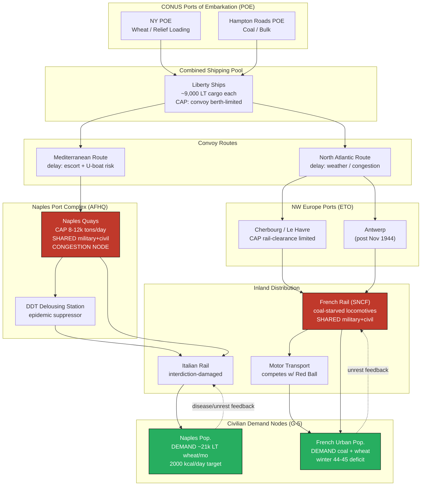

Cost: 0.33071

# CHAPTER 30: THE ARMY AND CIVILIAN SUPPLY: I
## Reference Manual & Simulation-Specification Document
### US Army Green Book — *Global Logistics and Strategy: 1943–1945*

---

## 1. Strategic Context & Modern Historical Perspective

### 1.1 The Strategic Paradox: Grand Design Versus Physical Ceilings

The central logistical tension examined in Chapter 30 arises from a paradox that recurred throughout Allied wartime planning: the strategic decisions ratified at the great inter-Allied conferences (Casablanca in January 1943, TRIDENT in May 1943, QUADRANT in August 1943, and SEXTANT/EUREKA at Cairo-Tehran in November–December 1943) generated *combat* commitments whose logistical tails included an unbudgeted, politically unavoidable, and materially enormous liability—the feeding and preservation of the liberated civilian populations across whose territory those armies would advance.

When the Combined Chiefs of Staff apportioned shipping to sustain a division-slice in the Mediterranean or Northwest Europe, the calculus was framed almost entirely in terms of the "type load" of a combat formation: rations for the soldier, ammunition for the guns, POL (petroleum, oils, lubricants) for the vehicles, and construction materials for the engineers. What the strategic ledgers systematically undercounted—until the fall of Naples in October 1943 forced the issue into the open—was that the physical seizure of an urban-industrial population center converted the Army, instantly and involuntarily, into a municipal government responsible for the survival of millions of non-combatants.

The paradox is fundamentally one of *conservation of scarce tonnage*. The global dry-cargo shipping pool in 1943–44, even after the U-boat crisis had been broken in the mid-Atlantic (May 1943), remained the binding constraint on every theater. Each ton of wheat, coal, or medical supplies dispatched to sustain civilians was a ton not available for ammunition, engineer stores, or troop maintenance. The strategic planners at TRIDENT who scheduled the invasion of Sicily (HUSKY) and the follow-on advance up the Italian peninsula had not reserved shipping berths for the roughly 21,000 long tons of wheat per month that Naples alone would demand once the port was cleared. Port clearance rates—themselves throttled by demolished quays, sunken block-ships, and rail interdiction damage that the Allies had themselves inflicted from the air—meant that the *same congested berths* had to discharge both military maintenance cargo and civilian relief. This is the essential systems-architecture insight: **civilian relief and combat maintenance are not parallel pipelines but competing claimants on a single, capacity-limited port-and-inland-transport network.**

### 1.2 Inter-Service and Coalition Tensions

The friction lines ran in three directions simultaneously.

**Services of Supply (SOS/ASF) versus Combat Command.** Lieutenant General Brehon Somervell's Army Service Forces, which controlled the requisition and shipment pipeline from CONUS, resisted the open-ended absorption of civilian-relief tonnage into military requisitions because it corrupted the clean troop-basis computations on which shipping allocations depended. Theater commanders, conversely, demanded relief supplies as an operational necessity, not a charity, because a typhus epidemic in the rear (Naples suffered exactly this in the winter of 1943–44) or a bread riot could sever the lines of communication as effectively as an enemy counterattack.

**Army versus civilian agencies.** The War Department fought a prolonged bureaucratic campaign over *who should own* civilian supply. The compromise doctrine held that the Army would carry the burden only during the "military period"—the interval during which active operations made a civilian relief agency's presence impossible—after which responsibility would transfer to UNRRA (United Nations Relief and Rehabilitation Administration, established November 1943) and to reconstituted national governments. In practice the "military period" stretched for months because the shipping and distribution infrastructure that any civilian agency required *was* the military infrastructure.

**US versus British pooling.** Under the combined arrangements, civilian supply for jointly-occupied theaters (notably Italy under AFHQ) drew on a combined pool, generating persistent disputes over cost-sharing, source of supply (US Lend-Lease wheat versus British reserves already drawn down by three years of war), and shipping accountability. The British, whose own domestic ration was austere, were acutely sensitive to any suggestion that liberated Italians should be fed at levels approaching the British civilian standard.

### 1.3 Historical Era Context: The Birth of the G-5 Civil Affairs Function

As Allied armies broke out of the beachheads and into populated hinterlands, they encountered a spectacle the pre-war doctrine had scarcely anticipated: starving populations, collapsed water and sewage systems, non-functioning power grids, and the incubating conditions for epidemic disease. The response was institutional—the elevation of **Civil Affairs / Military Government** to a full general-staff section, **G-5**, parallel to G-1 (personnel), G-2 (intelligence), G-3 (operations), and G-4 (logistics). G-5 owned the problem of distributing emergency food, coal for heating and utilities, and medicine to liberated populations, and it did so by *drawing on the same G-4 transport and depot capacity* that sustained the fighting troops.

### 1.4 Modern Analytical Insights: "Prevent Disease and Unrest" as a Combat-Preservation Doctrine

The declassified record and subsequent scholarship make clear that civilian relief was never primarily humanitarian in its *justification*, even where it was humanitarian in its *effect*. The governing formula—**"to prevent disease and unrest"**—was a minimalist, operationally-grounded standard. The Army committed to supplying only the baseline of food and sanitation necessary to keep the rear areas from becoming vectors of typhus, dysentery, and typhoid (which would incapacitate troops as readily as civilians) and from erupting into the kind of disorder that would compel the diversion of combat forces to riot control and the consumption of forward-bound tonnage on internal security.

Naples is the paradigmatic case. The winter 1943–44 typhus outbreak—suppressed only by the mass application of DDT dusting, a genuinely novel epidemiological intervention—demonstrated that a diseased port city sitting astride the LOC was a direct threat to the Fifth Army's sustainment. The "prevent disease and unrest" doctrine thus reframed civilian relief from an optional moral good into a **mandatory line item in the theater's operational-security budget.** The modern operations-research reading is that civilian caloric and sanitation supply constitutes a *negative-feedback stabilizer* on the LOC: below a threshold, the probability of LOC disruption rises non-linearly; the doctrine's purpose was to purchase LOC reliability at the lowest tonnage cost, not to maximize civilian welfare.

The same logic governed the coal crisis in liberated France during the winter of 1944–45. Coal was simultaneously a civilian survival commodity (heat, cooking), a public-utility input (power stations, water pumping), and an industrial-recovery input (so that French mines and railways could resume self-sustaining operation). Its distribution competed directly with military rail and truck movement during the very months of the Ardennes counteroffensive, when every ton-mile of transport capacity was under maximum strain.

---

## 2. High-Fidelity Simulation Parameters & Real-World Metrics

| Parameter | Historical Value | Units | Simulation Representation | Historical Explanation & Strategic Rationale |
|---|---|---|---|---|
| **Naples monthly wheat import requirement** | **≈ 21,000** (commonly cited range 20,000–25,000) | long tons / month | **Dynamic capacity cap** (function of population served) | The reconstituted urban population of Naples and its environs required this wheat throughput to sustain the bread ration. It was the single largest civilian-supply line item in the Mediterranean and directly competed for Naples-port berth capacity with Fifth Army maintenance cargo. |
| **G-5 basic relief ration target** | **≈ 2,000** (planning band 1,800–2,000; distress-area floor near 1,500) | calories / person / day | **Static constant** (with policy-tier override) | The minimum caloric standard adopted to "prevent disease and unrest." Deliberately austere—below normal civilian consumption but above the starvation/disease threshold. Distinct from the German-zone standard, which was set lower for policy reasons. |
| **Wheat caloric density** | **≈ 3.3 × 10⁶** (≈ 3,300 kcal/kg × 1,000 kg) | kcal / metric ton | **Efficiency coefficient** (K in the tonnage equation) | Converts caloric demand into shippable tonnage. For long tons (1,016 kg) use ≈ 3.35 × 10⁶ kcal/LT. Governs the food-tonnage-per-capita conversion. |
| **Bread/flour extraction efficiency** | **≈ 0.72–0.85** | dimensionless | **Efficiency coefficient** | Milling and baking losses reduce delivered calories per ton of imported wheat; higher extraction rates were mandated to stretch scarce grain. |
| **Import-planning safety/pipeline factor** | **≈ 1.10–1.25** | multiplier | **Static coefficient** | Accounts for spoilage, pilferage, and pipeline fill; applied atop raw demand to set requisition levels. |
| **Naples port discharge capacity (post-rehab)** | **~8,000–12,000** (rising through winter 1943–44) | tons / day | **Dynamic capacity cap** (time-varying) | Shared bottleneck between military and civilian cargo; rose as engineers cleared block-ships and repaired quays. |
| **French winter 1944–45 coal deficit** | Multiple million tons unmet seasonal demand | metric tons | **Deficit state variable** | Domestic production collapse + transport starvation produced a heating/utility/industrial shortfall competing with military rail. |
| **Ship dry-cargo capacity (Liberty ship)** | **≈ 10,000** deadweight; ~9,000 cargo | long tons | **Static constant** | Unit of the shipping pool; converts tonnage demand into ship-sailings demand. |
| **DDT typhus-control dusting** | Millions dusted, Naples Dec 1943–Feb 1944 | persons | **Event trigger / epidemic-suppression flag** | Non-linear LOC-disruption suppressor; models the disease-feedback stabilizer. |

---

## 3. Logistical Network Topology (Mermaid.js Flowchart)



---

## 4. Mathematical Modeling & Simulation Formulas

### 4.1 Core Tonnage-Demand Model

The base relationship converts a population's caloric target into a monthly shippable tonnage:

$$
T_{food} = \frac{P \cdot C \cdot D_{month}}{K_{cal/ton}}
$$

where:

- $T_{food}$ = required food tonnage per month (long tons)
- $P$ = population served (persons)
- $C$ = per-capita caloric target (kcal/person/day), e.g. $C = 2000$
- $D_{month} = 30$ days
- $K_{cal/ton}$ = deliverable caloric density of the commodity (kcal/ton)

### 4.2 Extended Requisition Model with Losses

The raw demand must be inflated by pipeline, spoilage, and milling-loss factors, and deflated by extraction efficiency:

$$
T_{req} = \frac{P \cdot C \cdot D_{month}}{K_{cal/ton} \cdot \eta_{ext}} \cdot \phi_{pipeline}
$$

where:

- $\eta_{ext} \in (0,1]$ = milling/baking extraction efficiency (delivered kcal ÷ imported kcal), e.g. $0.80$
- $\phi_{pipeline} \ge 1$ = pipeline/spoilage/pilferage safety multiplier, e.g. $1.15$

### 4.3 Port-Constrained Fulfillment (the Bottleneck)

Actual delivered tonnage is capped by the *shared* civilian share of port discharge over the month:

$$
T_{delivered} = \min\!\left( T_{req}, \; \alpha_{civ} \cdot Q_{port} \cdot D_{month} \right)
$$

where:

- $Q_{port}$ = port discharge capacity (tons/day)
- $\alpha_{civ} \in [0,1]$ = fraction of port capacity allocated to civilian cargo (a policy/command decision variable)

### 4.4 Deficit and LOC-Disruption Risk

Define the caloric fulfillment ratio and a non-linear disruption-risk function:

$$
\rho = \frac{T_{delivered}}{T_{req}}, \qquad
R_{disrupt}(\rho) =
\begin{cases}
0 & \rho \ge 1 \\
\lambda \,(1-\rho)^{\gamma} & \rho < 1
\end{cases}
$$

where $\lambda > 0$ is a scaling constant, and $\gamma > 1$ encodes the convex (accelerating) growth of disease/unrest risk as the ration falls below target—the mathematical expression of the "prevent disease and unrest" doctrine.

### 4.5 Allocation Optimization (Multi-Node)

Across $n$ demand nodes sharing a fixed monthly civilian tonnage budget $B$, minimize aggregate LOC-disruption risk:

$$
\min_{\{T_i\}} \; \sum_{i=1}^{n} w_i \, R_{disrupt}\!\left(\frac{T_i}{T_{req,i}}\right)
\quad \text{s.t.} \quad \sum_{i=1}^{n} T_i \le B, \;\; 0 \le T_i \le T_{req,i}
$$

where $w_i$ weights each node's strategic importance (e.g., proximity to the LOC).

---

## 5. Compile-Safe Scala 3.8.3 Domain Model

```scala
package Logistics.CivilianSupplyI

import scala.math.pow
import scala.math.min
import scala.math.max

opaque type Population = Int
object Population:
  def apply(value: Int): Population = value
  extension (p: Population) def toInt: Int = p

opaque type Tons = Double
object Tons:
  def apply(value: Double): Tons = value
  extension (t: Tons)
    def toDouble: Double = t
    def +(other: Tons): Tons = t + other.toDouble
    def clampNonNeg: Tons = if t < 0.0 then 0.0 else t

opaque type Calories = Double
object Calories:
  def apply(value: Double): Calories = value
  extension (c: Calories) def toDouble: Double = c

opaque type Days = Int
object Days:
  def apply(value: Int): Days = value
  extension (d: Days) def toInt: Int = d

opaque type Ratio = Double
object Ratio:
  def apply(value: Double): Ratio = max(0.0, min(1.0, value))
  extension (r: Ratio) def toDouble: Double = r

/** Efficiency and pipeline coefficients with validation. */
final case class SupplyCoefficients(
    extractionEfficiency: Double,
    pipelineFactor: Double,
    caloriesPerTon: Double
):
  require(extractionEfficiency > 0.0 && extractionEfficiency <= 1.0, "extraction in (0,1]")
  require(pipelineFactor >= 1.0, "pipeline factor >= 1")
  require(caloriesPerTon > 0.0, "caloriesPerTon must be positive")

/** Historically-anchored default constants. */
object HistoricalDefaults:
  val BasicReliefRation: Double     = 2000.0        // kcal/person/day (G-5)
  val WheatCaloriesPerLongTon: Double = 3.35e6      // kcal per long ton
  val DefaultExtraction: Double     = 0.80          // milling/baking efficiency
  val DefaultPipeline: Double       = 1.15          // spoilage/pilferage buffer
  val DaysPerMonth: Days            = Days(30)
  val NaplesWheatMonthlyLT: Tons    = Tons(21000.0) // historical reference

  val WheatCoefficients: SupplyCoefficients =
    SupplyCoefficients(DefaultExtraction, DefaultPipeline, WheatCaloriesPerLongTon)

/** Command allocation posture for a shared port. */
enum PortPosture(val civilianShare: Ratio):
  case CombatPriority  extends PortPosture(Ratio(0.15))
  case Balanced        extends PortPosture(Ratio(0.35))
  case ReliefPriority  extends PortPosture(Ratio(0.60))

/** Fulfillment state classification. */
enum FulfillmentState:
  case FullySupplied
  case DisciplinedDeficit
  case DiseaseUnrestRisk
  case Collapse

object FulfillmentState:
  def classify(rho: Ratio): FulfillmentState =
    val r = rho.toDouble
    if r >= 1.0 then FullySupplied
    else if r >= 0.85 then DisciplinedDeficit
    else if r >= 0.55 then DiseaseUnrestRisk
    else Collapse

/** A civilian demand node (e.g., Naples). */
final case class DemandNode(
    name: String,
    population: Population,
    caloricTarget: Double,
    strategicWeight: Double
):
  require(caloricTarget > 0.0, "caloric target must be positive")
  require(strategicWeight >= 0.0, "weight must be non-negative")

/** Port discharge capacity model. */
final case class PortCapacity(tonsPerDay: Double):
  require(tonsPerDay >= 0.0, "capacity non-negative")
  def monthlyCivilianTons(posture: PortPosture, days: Days): Tons =
    Tons(tonsPerDay * posture.civilianShare.toDouble * days.toInt.toDouble)

/** Result of a single-node computation. */
final case class ReliefResult(
    node: String,
    rawRequirement: Tons,
    adjustedRequirement: Tons,
    delivered: Tons,
    fulfillmentRatio: Ratio,
    state: FulfillmentState,
    disruptionRisk: Double
)

object CaloricReliefModel:

  /** Base tonnage: T = (P * C * 30) / K. Preserves original signature. */
  def calculateTonnageRequired(
      pop: Population,
      caloricTarget: Double,
      caloriesPerTon: Double
  ): Double =
    if caloriesPerTon <= 0.0 then 0.0
    else
      val dailyCaloricTotal: Double   = pop.toInt.toDouble * caloricTarget
      val monthlyCaloricTotal: Double = dailyCaloricTotal * HistoricalDefaults.DaysPerMonth.toInt.toDouble
      monthlyCaloricTotal / caloriesPerTon

  /** Requisition tonnage adjusted for extraction losses and pipeline buffer. */
  def adjustedRequirement(
      node: DemandNode,
      coeff: SupplyCoefficients
  ): Tons =
    val base: Double = calculateTonnageRequired(
      node.population,
      node.caloricTarget,
      coeff.caloriesPerTon
    )
    Tons((base / coeff.extractionEfficiency) * coeff.pipelineFactor)

  /** Convex disruption-risk: lambda * (1 - rho)^gamma for rho < 1. */
  def disruptionRisk(
      rho: Ratio,
      lambda: Double,
      gamma: Double
  ): Double =
    val r: Double = rho.toDouble
    if r >= 1.0 then 0.0
    else lambda * pow(1.0 - r, gamma)

  /** Port-constrained single-node relief evaluation. */
  def evaluateNode(
      node: DemandNode,
      coeff: SupplyCoefficients,
      port: PortCapacity,
      posture: PortPosture,
      days: Days,
      lambda: Double,
      gamma: Double
  ): ReliefResult =
    val rawTons: Tons        = Tons(
      calculateTonnageRequired(node.population, node.caloricTarget, coeff.caloriesPerTon)
    )
    val reqTons: Tons        = adjustedRequirement(node, coeff)
    val civilianCap: Tons    = port.monthlyCivilianTons(posture, days)
    val deliveredTons: Tons  = Tons(min(reqTons.toDouble, civilianCap.toDouble))
    val ratioValue: Double   =
      if reqTons.toDouble <= 0.0 then 1.0
      else deliveredTons.toDouble / reqTons.toDouble
    val rho: Ratio           = Ratio(ratioValue)
    val state: FulfillmentState = FulfillmentState.classify(rho)
    val risk: Double         = disruptionRisk(rho, lambda, gamma)
    ReliefResult(
      node = node.name,
      rawRequirement = rawTons,
      adjustedRequirement = reqTons,
      delivered = deliveredTons,
      fulfillmentRatio = rho,
      state = state,
      disruptionRisk = risk
    )

/** Multi-node greedy allocation minimizing marginal disruption risk. */
object ReliefAllocator:

  private final case class NodePlan(node: DemandNode, requirement: Tons, allocated: Double)

  /** Distributes a fixed civilian tonnage budget across nodes,
    *  greedily reducing the highest-weighted marginal risk first. */
  def allocate(
      nodes: List[DemandNode],
      coeff: SupplyCoefficients,
      budget: Tons,
      lambda: Double,
      gamma: Double,
      stepTons: Double
  ): List[ReliefResult] =
    require(stepTons > 0.0, "allocation step must be positive")

    val initial: List[NodePlan] = nodes.map: n =>
      NodePlan(n, CaloricReliefModel.adjustedRequirement(n, coeff), 0.0)

    def marginalGain(plan: NodePlan): Double =
      val reqD: Double = plan.requirement.toDouble
      if reqD <= 0.0 || plan.allocated >= reqD then 0.0
      else
        val rhoNow: Double  = plan.allocated / reqD
        val rhoNext: Double = min(1.0, (plan.allocated + stepTons) / reqD)
        val riskNow: Double  = CaloricReliefModel.disruptionRisk(Ratio(rhoNow), lambda, gamma)
        val riskNext: Double = CaloricReliefModel.disruptionRisk(Ratio(rhoNext), lambda, gamma)
        plan.node.strategicWeight * (riskNow - riskNext)

    @annotation.tailrec
    def loop(plans: List[NodePlan], remaining: Double): List[NodePlan] =
      if remaining < stepTons then plans
      else
        val candidates: List[(NodePlan, Double)] =
          plans.map(p => (p, marginalGain(p)))
        val best: Option[(NodePlan, Double)] =
          candidates.filter(_._2 > 0.0).sortBy(-_._2).headOption
        best match
          case None => plans
          case Some((chosen, _)) =>
            val updated: List[NodePlan] = plans.map: p =>
              if p.node.name == chosen.node.name then
                p.copy(allocated = min(p.requirement.toDouble, p.allocated + stepTons))
              else p
            loop(updated, remaining - stepTons)

    val finalPlans: List[NodePlan] = loop(initial, budget.toDouble)

    finalPlans.map: p =>
      val reqD: Double   = p.requirement.toDouble
      val ratio: Double  = if reqD <= 0.0 then 1.0 else p.allocated / reqD
      val rho: Ratio     = Ratio(ratio)
      val rawTons: Tons  = Tons(
        CaloricReliefModel.calculateTonnageRequired(
          p.node.population, p.node.caloricTarget, coeff.caloriesPerTon
        )
      )
      ReliefResult(
        node = p.node.name,
        rawRequirement = rawTons,
        adjustedRequirement = p.requirement,
        delivered = Tons(p.allocated),
        fulfillmentRatio = rho,
        state = FulfillmentState.classify(rho),
        disruptionRisk = CaloricReliefModel.disruptionRisk(rho, lambda, gamma)
      )

/** Executable demonstration harness. */
object CivilianSupplySimulation:
  def main(args: Array[String]): Unit =
    val coeff: SupplyCoefficients = HistoricalDefaults.WheatCoefficients

    val naples: DemandNode = DemandNode(
      name = "Naples",
      population = Population(1000000),
      caloricTarget = HistoricalDefaults.BasicReliefRation,
      strategicWeight = 1.0
    )
    val rome: DemandNode = DemandNode(
      name = "Rome",
      population = Population(1500000),
      caloricTarget = HistoricalDefaults.BasicReliefRation,
      strategicWeight = 0.7
    )

    val port: PortCapacity = PortCapacity(tonsPerDay = 10000.0)

    val single: ReliefResult = CaloricReliefModel.evaluateNode(
      node = naples,
      coeff = coeff,
      port = port,
      posture = PortPosture.Balanced,
      days = HistoricalDefaults.DaysPerMonth,
      lambda = 1.0,
      gamma = 2.0
    )
    println(s"Single-node Naples: $single")

    val budget: Tons = port.monthlyCivilianTons(PortPosture.Balanced, HistoricalDefaults.DaysPerMonth)
    val alloc: List[ReliefResult] = ReliefAllocator.allocate(
      nodes = List(naples, rome),
      coeff = coeff,
      budget = budget,
      lambda = 1.0,
      gamma = 2.0,
      stepTons = 500.0
    )
    alloc.foreach(r => println(s"Allocated: $r"))
```

---

## 6. Graduate-Level Operational Analysis

### 6.1 Why the War Department Accepted the Civilian-Feeding Burden; the "Prevent Disease and Unrest" Doctrine

The War Department did not embrace civilian feeding out of institutional appetite—quite the opposite. The Army fought throughout 1943–45 to *bound* its liability and to transfer it as rapidly as possible to civilian successor agencies (UNRRA, the Foreign Economic Administration, restored national governments). It accepted the burden nonetheless because of an iron operational logic that can be reconstructed as a constrained-optimization argument.

Consider a theater commander whose objective is to sustain forward combat power. His line of communication passes through, and terminates at, population centers—Naples, Cherbourg, Antwerp, Paris. Two failure modes threaten the LOC from *within* the rear rather than from the enemy front. First, **epidemic disease**: a typhus or dysentery outbreak in a port city does not respect the civilian-military boundary; it infects the dock labor, the stevedores, the truck drivers, and eventually the garrison troops, degrading discharge and clearance rates precisely at the pinch point. Second, **civil disorder**: a starving urban population riots, loots depots, sabotages rail, or simply requires the diversion of combat troops to security duty. Both failure modes attack throughput, which is the scarce resource the entire strategic edifice depends upon.

The "prevent disease and unrest" doctrine is the *minimal-cost solution* to this problem. It does **not** commit the Army to restoring pre-war civilian living standards (which would consume ruinous tonnage). It commits the Army only to holding the civilian population *above the threshold at which disease and disorder become probable*. Mathematically, this is the recognition that the LOC-disruption risk function $R_{disrupt}(\rho)$ is *convex and threshold-like*: near $\rho = 1$ the marginal risk of a small deficit is negligible, but as $\rho$ falls below roughly 0.5–0.6 the risk rises steeply (the $\gamma > 1$ exponent in §4.4). The optimal policy therefore purchases fulfillment up to the "knee" of the curve—the ~1,500–2,000 kcal band—and no further. Every ton beyond the knee buys diminishing LOC-security returns while directly subtracting from combat maintenance.

Naples validated the doctrine empirically. The typhus epidemic of winter 1943–44 was the counterfactual made real: a diseased LOC terminal. Its suppression—by mass DDT delousing and by restoring the bread ration through the ~21,000-ton monthly wheat import—was undertaken and defended in explicitly military terms. The DDT campaign is, in modeling terms, an *event-triggered suppressor* that resets the disruption-risk trajectory; the wheat import is the *continuous stabilizer* that keeps $\rho$ above the knee. The two together illustrate that civilian supply, correctly understood, is a **combat-preservation investment** subject to the same tonnage-allocation discipline as ammunition or POL, and this is precisely why the burden could not be refused: refusing it did not save tonnage, it merely deferred and amplified the tonnage cost when the LOC eventually collapsed.

### 6.2 The Coal Distribution Crisis in France, Winter 1944–45

The French coal crisis of the winter of 1944–45 is the sharpest illustration in the entire theater of *transport* rather than *supply* as the binding constraint—and of the pathological feedback loops that arise when a single commodity is simultaneously a survival good, a utility input, and a self-referential transport enabler.

France in late 1944 did not lack coal in the ground; the northern coalfields (Nord–Pas-de-Calais) were largely intact and back in Allied hands. What France lacked was the ability to *move* the coal from pithead to consumer. The reasons were layered and mutually reinforcing:

**First, the railway had been deliberately destroyed by the Allies themselves.** The pre-invasion "Transportation Plan" air campaign, followed by tactical interdiction, had wrecked marshalling yards, bridges, and rolling stock precisely to paralyze German movement. That paralysis did not lift the moment the front moved east; the SNCF network in autumn 1944 was operating at a fraction of capacity, with locomotives, wagons, and repaired track all in critical shortage.

**Second—and this is the vicious circle—the railways ran on coal.** French locomotives were overwhelmingly steam-powered. A coal shortage throttled rail movement, and throttled rail movement prevented the distribution of the very coal that would relieve the shortage. This is a positive-feedback trap: below a critical throughput, the system cannot supply its own transport fuel, and delivery capacity spirals downward. In systems-modeling terms, coal transport is a state variable with a *self-consumption coefficient*, and when net-available-for-distribution (gross moved minus locomotive self-consumption) approaches zero, the deliverable surplus collapses non-linearly.

**Third, coal competed head-on with military traffic during the peak crisis month.** The Ardennes counteroffensive erupted on 16 December 1944, at the depth of the freezing winter. Every ton-mile of rail and truck capacity in the ETO was under maximum contention: ammunition and troops surging toward the Bulge, POL for the counterattacking armor, and simultaneously the civilian coal that Paris and other cities needed to keep power stations, water-pumping plants, and hospitals functioning and to keep the population from freezing. The military necessarily won the priority contest, deepening the civilian coal deficit at exactly the moment cold demand peaked.

**Fourth, the utility dimension propagated the failure.** Coal shortage meant power-station shutdowns, which meant water pumps failed, which raised the same disease-and-unrest specter the doctrine existed to prevent—now in the political capital, Paris, where disorder carried strategic and coalition-political weight far exceeding its tonnage. The freezing of water mains and the collapse of sanitation reproduced, in an industrial northern city in winter, the epidemic threat that DDT and wheat had contained in Naples.

The logistical lesson, and the modeling requirement, is that coal cannot be represented as a simple demand node fed by a linear pipeline. It must be modeled as a **coupled system**: a transport network whose own operability depends on the throughput of the commodity it carries, contending for shared capacity with a spiking military demand, feeding downstream utility nodes whose failure re-injects disease-and-unrest risk into the LOC. The historical outcome—chronic, only partially relieved shortage through the winter, alleviated only as rail rehabilitation and the opening of Antwerp gradually raised total network capacity in early 1945—reflects that no local "supply" fix was possible; only an increase in the *transport* ceiling could break the feedback trap. This is why Chapter 30's analysis treats civilian coal not as a relief line item but as a structural stress test of the entire theater transportation architecture.
