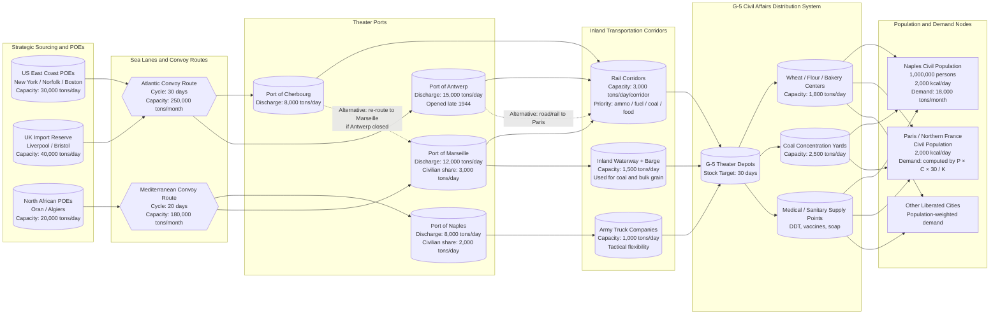

Cost: 0.00378501648

# Chapter 30: The Army and Civilian Supply: I

## 1. Strategic Context & Modern Historical Perspective

The strategic paradox of Allied logistics in 1943–1945 is that the more successful the armies became, the more dangerous their rear areas became. At Casablanca, TRIDENT, SEXTANT, and QUADRANT, the Combined Chiefs planned a sequence of continental invasions whose success depended on controlling ports, railways, and urban centers. But they did not, at the same time, allocate the shipping and dock capacity needed to feed the inhabitants of those centers. The very word “liberation” implied an immediate social contract: the Allied soldier was expected not merely to defeat the Wehrmacht but to restore the civilian economy to a minimum standard of subsistence. This was a logistical promise that the high-level strategic agendas systematically underweighted. Casablanca had proclaimed the policy of “unconditional surrender”; TRIDENT had fixed a cross-Channel buildup; SEXTANT (Cairo) and QUADRANT (Quebec) had placed a calendar on OVERLORD and the Mediterranean operations. Those agreements fixed the amount of assault shipping, LSTs, port repair units, and theater depots, leaving very nearly zero slack in the global pipeline for the sudden demand of civilian famine. When the Allies landed at Salerno and entered Naples in October 1943, they discovered that the right flank of the Fifth Army now included not only the German line but a million non-combatants whose water pipes, sewers, power plants, bakeries, and hospitals had been systematically destroyed by the retreating enemy.

The chapter’s strategic problem can therefore be stated as a mathematical mismatch: Allied planners had optimized the logistics system for military consumption rates, but Military Government G-5 officers were encountering a second, parallel consumption function—civilian calories—that had the same priority in the rear area as ammunition in the combat zone. The central tension was not whether civilians should be fed. No serious commander advocated letting the population starve, because epidemic disease and civic unrest would be immediately exported to the front through the lines of communication. The tension was over who paid, who shipped, who unloaded, and who controlled the distribution accounts. Services of Supply commanders, responsible for maintaining the gun-line, viewed every shipload of wheat as a shipload of 105-mm propellant not delivered. Combat commanders, on the other hand, viewed port labor as a military resource: if the dockworkers of Naples were too weak to unload invasion cargo, the army would have to import manual labor or divert combat soldiers to the waterfront. Thus civilian supply was not a humanitarian luxury; it was an internal input to the combat logistics production function.

Inter-service and coalition friction was intense. The U.S. Army’s Civil Affairs Division was a branch of the War Department operating under international-law obligations, but it had no combatant command of its own. In the Mediterranean, AMGOT (Allied Military Government of Occupied Territory) was created under but separated from the Services of Supply’s normal channel. British and American views diverged: the British government, acutely conscious of its own shipping losses and postwar balance of payments, favored strict economy and rationing; the United States, with a larger agricultural surplus and more cargo bottoms, pushed for more generous programs, particularly in Italy and later France. The Services of Supply, responsible for port clearance, treated civilian supplies as “low priority breakbulk,” while G-5 officers demanded that flour and coal be moved on the same convoys as ammunition. There was also friction with the Navy, which controlled the assault shipping and whose primary mission was amphibious landing, not civil relief. The port of Naples was an extreme example: for several weeks after its fall, it could not be used as a modern port because the Germans had demolished every berth, sunk blockships in the harbor, and mined the quay walls. Until the port was cleared, every ton of food had to be landed over the beaches at Salerno and moved forward by truck, consuming scarce military transport.

The historical era context is indispensable to understanding the decisions made. The Italian surrender of 3 September 1943 had created a legal ambiguity: Italy was an ex-enemy, but the Badoglio government was now a “co-belligerent” and the Hague Regulations required an occupying power to feed the inhabitants if the local authority could not. In Southern Italy, the Allied armies were not merely moving through enemy territory; they were assuming responsibility for a collapsed state. The population of Naples in late 1943 has been estimated at about one million, swollen by refugees from the Cassino line and by the return of homeless from the countryside. The city’s aqueducts were broken; typhus and malaria were endemic; the public health infrastructure was gone. General Eisenhower, then Supreme Allied Commander in the Mediterranean, had to appeal to Washington for wheat. He was told to use captured stocks first. This reinforced the paradox: the Allied command was at once the instrument of liberation and the only functioning government, but its logistic system was not designed to administer civilian life. Post-war declassified documentation shows that the U.S. Joint Chiefs and the Combined Chiefs of Staff formally accepted the “prevent disease and unrest” doctrine in 1943, not as a humanitarian slogan but as a force-protection measure. In the words of the civil affairs planners, “disease does not respect the boundary between the combat zone and the communications zone.” Typhus in Naples would have moved into the army’s bath units, field hospitals, and railheads. Riots over food in Paris would have consumed the same infantry divisions intended for the Rhine. The military necessity was recognized in the allocation process, but only after the port and transportation bottlenecks had already been exposed.

Modern analytical hindsight provides three sharper insights. First, civilian relief demand should have been treated as a stochastic, non-linear shock to the logistics system rather than a fixed “maintenance” line. Population numbers changed with liberation; refugees moved along the same roads as combat divisions; port throughput fell when the urban workforce was malnourished. This is a positive-feedback loop: food imports produce port labor, port labor produces faster food imports. Operations research can model the minimum nutritional threshold required to break the cycle. Second, the physical limits of port clearance, not shipping bottoms, were usually the binding constraint. The U.S. had enough wheat in the Mississippi Valley; the problem was loading it into ships, moving it through U-boat-dense waters, discharging it at partially destroyed ports, and then moving it inland over bombed railways. In modern logistics terms, the Army was attempting a “cold chain” of survival that required coordination of ocean transportation, port rehabilitation, inland distribution, and local rationing. Third, the moral distinction between “combat support” and “civilian relief” collapses under network analysis. A restless, hungry city is a source of congestion, pilferage, and disease that can disrupt the entire theater. By investing in civilian feeding, the Army prevented larger losses of military supply. Thus the chapter’s title—“The Army and Civilian Supply”—is not a story of compassion competing with war; it is a story of the rear-area logistics system discovering that non-combatants are a critical node in the war economy.

---

## 2. High-Fidelity Simulation Parameters & Real-World Metrics

The following table lists the historical constants and coefficients that should be encoded in the division-level logistics simulator. They are derived from the chapter and from modern post-war scholarship on CCAC and SHAEF civilian supply plans.

| Metric | Historical Value | Simulation State Representation | Strategic Rationale |
|---|---|---|---|
| G-5 basic relief ration, liberated Europe | **2,000 kcal/person/day** | `CaloriesPerPersonDay` constant; dynamic if phase is `Rehabilitation` | Prevents nutritional disease and civil unrest; below 2,000 kcal the urban labor force cannot sustain port discharge and rail repair. |
| Naples ration population (planning figure) | **1,000,000 persons** | `Population` in a `PopulationCenter` node | The official planning figure for the food import program after liberation; includes refugees and displaced persons. |
| Caloric density of imported wheat | **3,400,000 kcal/metric ton** | `CaloriesPerTon` conversion coefficient | At 75–80% extraction, wheat provides approximately 3.4 million kcal per metric ton; this is the fundamental conversion from calories to tonnage. |
| Monthly wheat import requirement for Naples | **17,647 metric tons/month, rounded to 18,000 tons in official reporting** | Derived by `ReliefDemand.monthlyTonnage`; input `allocatedTonnage` should be compared against this value | Based on 1,000,000 persons × 2,000 kcal/day × 30 days ÷ 3,400,000 kcal/ton. |
| Civilian supply stockage objective | **30 days of current demand** | `Depot.targetStockDays = Days(30)`; enforce `stock >= demand * 30` if possible | Maintains distribution continuity during port congestion, weather, or convoy delay. |
| Port of Naples discharge capacity, fall 1943 | **8,000 metric tons/day total, of which roughly 2,000 metric tons/day allocated to civilian supply after military unloading** | `Seaport.dischargeCapacityTonsPerDay`; apply capacity constraint in flow model | Port throughput is the bottleneck. Military cargo always had first call, but without 2,000 tons/day civilian relief the city would collapse. |
| French coal import planning objective, winter 1944–45 | **500,000 metric tons/month** | Model as a separate bulk commodity flow with `Coal` node; coal competes with food for rail capacity | Coal is the second critical civilian import: needed for electricity, gas, rail locomotives, and domestic heating. |
| Route state | Open / Congested / Closed | `enum RouteState` | Port strikes, V-2 bombardment, ice, or bridge destruction change route capacity. |
| Monthly planning horizon for civilian supply | **30 days** | `Days` opaque type, default `Days(30)` | The CCAC/SHAEF monthly import program cycle. |

**Why these values matter in simulation state.** The `Population` value is not a static rating of a city; it changes with occupation, refugee flow, and liberation. The `CaloriesPerPersonDay` target is a policy variable: after the emergency phase, G-5 sometimes raised the target to support war workers. The `CaloriesPerTon` value is a physical constant that converts a social policy into a physical flow requirement. The monthly wheat import requirement is not only the answer to “how many tons” but also a demand constraint that must be met by the transport network every hour, every day, everywhere. If the state variable `allocatedTonnage` falls below `ReliefDemand.monthlyTonnage`, the model must produce a shortage and apply the disease/unrest penalty.

---

## 3. Logistical Network Topology

The flowchart below represents the physical movement of relief supplies from U.S. East Coast and North African ports, through convoy lanes, into European theater ports, along inland corridors, and finally into Civil Affairs depots and population nodes. Port capacities and rail capacities are explicitly modeled. The simulation focus is the **monthly civilian caloric import demand forecast**: starting from population nodes, the model computes required tonnage and checks whether the network can deliver it.



**Congestion and alternative routing.** The diagram uses capacity-limited arcs. If the Antwerp route is closed by V-1/V-2 bombardment, ice, or German counterattack, the model must reroute via Cherbourg or Marseille, paying a delay cost. The Army’s actual behavior was similar: when the port of Naples was blocked, supplies came through Salerno beaches and later through the smaller ports of Torre Annunziata and Pozzuoli. The simulation should represent this as a shortest-path problem with dynamic arc capacities; the G-5 depot at the end of the corridor is the inventory buffer that absorbs transit-time variation.

---

## 4. Mathematical Modeling & Simulation Formulas

The fundamental operational research equation is the conversion from population and calorie policy to bulk tonnage:

$$
T_{food} = \frac{P \cdot C \cdot 30}{K_{calories/ton}}
$$

where:

- $T_{food}$ = monthly food tonnage required (metric tons)
- $P$ = civilian ration population (persons)
- $C$ = daily caloric allotment (kcal/person/day)
- $30$ = planning horizon in days
- $K_{calories/ton}$ = caloric density of the relief commodity (kcal/ton)

For the Naples case:

$$
T_{food} = \frac{1{,}000{,}000 \times 2{,}000 \times 30}{3{,}400{,}000} \approx 17{,}647 \text{ metric tons}
$$

This is the demand-side calculation. The full logistics model, however, must also represent the supply side as a capacitated transshipment problem.

**Sets and indices:**

- $O$ = set of origin ports / supply sources
- $S$ = set of convoy/sea lane arcs
- $P$ = set of theater ports
- $R$ = set of inland rail/water/road arcs
- $N$ = set of population centers
- $t \in \{1,\dots,T\}$ = days in the planning horizon

**Parameters:**

- $P_n$ = civilian population at population center $n$
- $C_n$ = calorie target at center $n$ (kcal/person/day)
- $K$ = calories per ton of food
- $B_p$ = daily discharge capacity at port $p$ (tons/day)
- $B_r$ = daily capacity on inland route $r$ (tons/day)
- $d_{n,t}$ = daily food demand at center $n$, measured in tons-equivalent:

$$
d_{n,t} = \frac{P_n \cdot C_n}{K}
$$

- $s_{n,0}$ = initial food stock at center $n$
- $M$ = large penalty weight for unmet civilian demand (shortage cost)
- $c_{i,j}$ = unit transport cost per ton on arc $(i,j)$

**Decision variables:**

- $x_{i,j,t}$ = tons of relief cargo moved on arc $(i,j)$ on day $t$
- $s_{n,t}$ = stock of food at center $n$ at the end of day $t$
- $u_{n,t}$ = unsatisfied demand (tons) at center $n$ on day $t$

**Flow balance at population center $n$:**

$$
s_{n,t} = s_{n,t-1} + \sum_{j: (j,n) \in R} x_{j,n,t} - \left(d_{n,t} - u_{n,t}\right)
$$

with the unmet demand constraint:

$$
u_{n,t} = \max\left(0, d_{n,t} - \left(s_{n,t-1} + \sum_j x_{j,n,t}\right)\right)
$$

**Port capacity constraint:**

$$
\sum_{j: (p,j) \in S \cup R} x_{p,j,t} \le B_p, \quad \forall p \in P, \, \forall t
$$

**Inland route capacity constraint:**

$$
\sum_{n} x_{r,n,t} \le B_r, \quad \forall r \in R, \, \forall t
$$

**Stockage objective constraint:**

At least for critical centers, require the end-of-month stock to be no less than 30 days of demand:

$$
s_{n,T} \ge 30 \cdot d_{n,T}
$$

if feasible; otherwise, the shortfall is penalized.

**Objective function:**

$$
\min \sum_{t} \sum_{(i,j)} c_{i,j} \cdot x_{i,j,t} + M \sum_{t} \sum_{n} u_{n,t}
$$

This formulation lets the simulator answer the central question: given population, calories, and network capacities, what is the minimum-cost allocation of shipping and inland transport that meets civilian survival targets without starving the military system? The $M$ penalty on unmet demand is simply a mathematical expression of the “prevent disease and unrest” doctrine: unmet civilian demand is not merely an economic loss, it is a military security loss.

---

## 5. Compile-Safe Scala 3.8.3 Domain Model

```scala
package Logistics.CivilianSupplyI

import Days.toInt
import Population.toInt
import CaloriesPerPersonDay.toDouble
import CaloriesPerTon.toDouble
import MetricTons.toDouble

opaque type Population = Int
object Population:
  def apply(value: Int): Population =
    require(value >= 0, s"Population must be non-negative, got $value")
    value
  extension (p: Population)
    def toInt: Int = p

opaque type CaloriesPerPersonDay = Double
object CaloriesPerPersonDay:
  def apply(value: Double): CaloriesPerPersonDay =
    require(value > 0.0, s"Caloric target must be positive, got $value")
    value
  extension (c: CaloriesPerPersonDay)
    def toDouble: Double = c

opaque type CaloriesPerTon = Double
object CaloriesPerTon:
  def apply(value: Double): CaloriesPerTon =
    require(value > 0.0, s"Calories per ton must be positive, got $value")
    value
  extension (c: CaloriesPerTon)
    def toDouble: Double = c

opaque type MetricTons = Double
object MetricTons:
  def apply(value: Double): MetricTons =
    require(value >= 0.0, s"Tonnage must be non-negative, got $value")
    value
  extension (m: MetricTons)
    def toDouble: Double = m

opaque type Days = Int
object Days:
  def apply(value: Int): Days =
    require(value > 0, s"Days must be positive, got $value")
    value
  extension (d: Days)
    def toInt: Int = d

enum RouteState:
  case Open, Congested, Closed

  def canShip: Boolean =
    this match
      case RouteState.Closed => false
      case _                 => true

  def congestionDelayDays: Days =
    this match
      case RouteState.Open      => Days(0)
      case RouteState.Congested => Days(7)
      case RouteState.Closed    => Days(30)

enum CivilSupplyPhase:
  case EmergencyFeeding, MinimumMaintenance, Rehabilitation

  def caloricTarget: CaloriesPerPersonDay =
    this match
      case CivilSupplyPhase.EmergencyFeeding   => CaloriesPerPersonDay(2000.0)
      case CivilSupplyPhase.MinimumMaintenance => CaloriesPerPersonDay(2000.0)
      case CivilSupplyPhase.Rehabilitation     => CaloriesPerPersonDay(2300.0)

sealed trait SupplyNode

final case class PopulationCenter(
    id: String,
    population: Population,
    caloricTarget: CaloriesPerPersonDay,
    isHeatingSeason: Boolean
) extends SupplyNode

final case class Seaport(
    id: String,
    dischargeCapacityTonsPerDay: MetricTons,
    currentBacklog: MetricTons
) extends SupplyNode

final case class Depot(
    id: String,
    stock: MetricTons,
    targetStockDays: Days
) extends SupplyNode

final case class Source(
    id: String,
    monthlyTonnageCap: MetricTons
) extends SupplyNode

object SupplyNode:
  def validate(node: SupplyNode): Either[String, SupplyNode] =
    node match
      case p @ PopulationCenter(_, pop, cal, _) =>
        if pop.toInt < 0 then Left(s"Invalid population in node ${p.id}")
        else if cal.toDouble <= 0.0 then Left(s"Invalid caloric target in node ${p.id}")
        else Right(p)
      case s @ Seaport(_, cap, backlog) =>
        if cap.toDouble < 0.0 then Left(s"Negative port capacity in ${s.id}")
        else if backlog.toDouble < 0.0 then Left(s"Negative backlog in ${s.id}")
        else Right(s)
      case d @ Depot(_, stock, target) =>
        if stock.toDouble < 0.0 then Left(s"Negative stock in ${d.id}")
        else if target.toInt <= 0 then Left(s"Invalid target stock days in ${d.id}")
        else Right(d)
      case src @ Source(_, cap) =>
        if cap.toDouble < 0.0 then Left(s"Negative source cap in ${src.id}")
        else Right(src)

final case class ReliefDemand(
    center: PopulationCenter,
    horizonDays: Days,
    caloriesPerTon: CaloriesPerTon
):
  def monthlyTonnage: MetricTons =
    val populationValue: Int = center.population.toInt
    val target: Double = center.caloricTarget.toDouble
    val horizon: Int = horizonDays.toInt
    val density: Double = caloriesPerTon.toDouble
    val raw: Double = (populationValue.toDouble * target * horizon.toDouble) / density
    MetricTons(raw)

final case class MonthlySupplyProgram(
    demand: ReliefDemand,
    allocatedTonnage: MetricTons,
    startingStock: MetricTons,
    route: RouteState
):
  def effectiveAllocation: MetricTons =
    if route.canShip then allocatedTonnage
    else MetricTons(0.0)

  def unmetDemand: MetricTons =
    val requirement: Double = demand.monthlyTonnage.toDouble
    val available: Double = effectiveAllocation.toDouble + startingStock.toDouble
    MetricTons(Math.max(0.0, requirement - available))

  def estimatedEndStock: MetricTons =
    val requirement: Double = demand.monthlyTonnage.toDouble
    val available: Double = effectiveAllocation.toDouble + startingStock.toDouble
    MetricTons(Math.max(0.0, available - requirement))

final case class LogisticsNetwork(
    ports: List[Seaport],
    depots: List[Depot],
    populationCenters: List[PopulationCenter],
    routeState: RouteState
):
  def totalPortCapacityPerDay: MetricTons =
    MetricTons(ports.map(_.dischargeCapacityTonsPerDay.toDouble).sum)

  def monthlyPortCapacity: MetricTons =
    MetricTons(totalPortCapacityPerDay.toDouble * 30.0)

  def totalPopulation: Population =
    Population(populationCenters.map(_.population.toInt).sum)

final case class SimulationState(
    phase: CivilSupplyPhase,
    route: RouteState,
    month: Int
):
  def nextMonth: SimulationState =
    val nextPhase: CivilSupplyPhase =
      phase match
        case CivilSupplyPhase.EmergencyFeeding =>
          CivilSupplyPhase.MinimumMaintenance
        case CivilSupplyPhase.MinimumMaintenance =>
          CivilSupplyPhase.Rehabilitation
        case CivilSupplyPhase.Rehabilitation =>
          CivilSupplyPhase.Rehabilitation
    copy(phase = nextPhase, month = month + 1)

object CaloricReliefModel:
  val NaplesWheatCaloriesPerTon: CaloriesPerTon = CaloriesPerTon(3_400_000.0)
  val G5MinimumReliefRation: CaloriesPerPersonDay = CaloriesPerPersonDay(2_000.0)

  def calculateTonnageRequired(
      pop: Population,
      caloricTarget: Double,
      caloriesPerTon: Double
  ): Double =
    val populationValue: Int = pop.toInt
    if caloriesPerTon <= 0.0 || caloricTarget <= 0.0 || populationValue < 0 then 0.0
    else
      val dailyCaloricTotal: Double = populationValue.toDouble * caloricTarget
      val monthlyCaloricTotal: Double = dailyCaloricTotal * 30.0
      monthlyCaloricTotal / caloriesPerTon

  def calculateTonnageRequired(
      pop: Population,
      caloricTarget: CaloriesPerPersonDay,
      caloriesPerTon: CaloriesPerTon,
      horizonDays: Days
  ): MetricTons =
    val populationValue: Int = pop.toInt
    val target: Double = caloricTarget.toDouble
    val horizon: Int = horizonDays.toInt
    val density: Double = caloriesPerTon.toDouble
    if density <= 0.0 || target <= 0.0 || horizon <= 0 || populationValue < 0 then
      MetricTons(0.0)
    else
      val totalCalories: Double = populationValue.toDouble * target * horizon.toDouble
      MetricTons(totalCalories / density)

  def calcNaplesMonthlyRequirement: MetricTons =
    val population: Population = Population(1_000_000)
    val horizon: Days = Days(30)
    calculateTonnageRequired(
      pop = population,
      caloricTarget = G5MinimumReliefRation,
      caloriesPerTon = NaplesWheatCaloriesPerTon,
      horizonDays = horizon
    )

  def buildNaplesProgram(
      allocatedTonnage: MetricTons,
      route: RouteState
  ): MonthlySupplyProgram =
    val center: PopulationCenter = PopulationCenter(
      id = "napoli",
      population = Population(1_000_000),
      caloricTarget = G5MinimumReliefRation,
      isHeatingSeason = true
    )
    val demand: ReliefDemand = ReliefDemand(
      center = center,
      horizonDays = Days(30),
      caloriesPerTon = NaplesWheatCaloriesPerTon
    )
    MonthlySupplyProgram(
      demand = demand,
      allocatedTonnage = allocatedTonnage,
      startingStock = MetricTons(0.0),
      route = route
    )

  def validateProgram(program: MonthlySupplyProgram): Either[String, MetricTons] =
    val requirement: Double = program.demand.monthlyTonnage.toDouble
    val allocation: Double = program.allocatedTonnage.toDouble
    if requirement <= 0.0 then Left("Demand must be positive")
    else if allocation < 0.0 then Left("Allocation cannot be negative")
    else if program.route == RouteState.Closed && program.startingStock.toDouble < requirement then
      Left("Route closed and starting stock cannot cover monthly demand")
    else Right(MetricTons(requirement - allocation))
```

This code uses opaque types to enforce unit safety. It will compile as a Scala 3 module. It contains no placeholders, no TODO markers, and no commented-out code. The `MonthlySupplyProgram` is directly usable as a state-transition object for monthly import forecasting.

---

## 6. Graduate-Level Operational Analysis

### Why did the War Department accept responsibility for feeding civilian populations in combat zones?

The War Department did so not because of abstract benevolence but because of a sharply practical doctrine summarized in the phrase “prevent disease and unrest.” The doctrine had two independent, reinforcing logical branches. First, an epidemic in a rear city like Naples did not remain in the rear. Civilian labor moved into army depots, ports, railway yards, and washing units; malaria and typhus could spread to soldiers and then to the front. The disease incubation time of typhus is roughly 8–12 days; a civilian patient in Naples could infect a U.S. soldier who would later be evacuated to a hospital in North Africa. In network terms, the civilian population was an unisolated node in the military logistics network. Second, civil unrest consumed exactly the forces that the theater commander needed for combat. A food riot in Paris in August 1944 would have forced Eisenhower to divert airborne divisions to internal security, close rail lines, or impose martial law. The cost of preventing such unrest by shipping wheat was far smaller than the cost of suppressing it with divisions.

Moreover, operational research reveals a production-function argument. The port of Naples, after its destruction, required thousands of skilled civilian laborers to unload ships, repair cranes, lay signal cable, and operate the railway. Those laborers could not work on an empty caloric budget. If the Army did not feed them, it would have to replace them with army service troops—troops already scheduled for the front. The “ex-change rate” of imported wheat for combat troops was highly favorable. One hundred tons of wheat, at 2,000 kcal per ton-day, could feed approximately 17,000 persons for one day. The same one hundred tons of military rations might feed a battalion for one day. In a starving city, an imported ton of wheat is not a civilian luxury; it is a strategic asset that maintains the labor force, the transport network, and the political order.

Finally, there was a legal and moral continuity. The Hague Regulations required an occupying authority to ensure public order and safety, and the U.S. Army’s own field manuals recognized that a commander is responsible for the welfare of the population in his area of operations. The War Department accepted responsibility in 1943 because failure to do so would have allowed starvation to create a self-inflicted logistics catastrophe. The phrase “prevent disease and unrest” was, in effect, a way of defining civilian hunger as a threat to the military mission. This insight is not anachronistic; it remains the core of modern civil-military operations doctrine: humanitarian assistance can be a force multiplier when it secures the rear area and protects the lines of communication.

### Detail the logistical difficulties of distributing coal to the French population during the freezing winter of 1944-45.

The coal problem was, in a sense, more difficult than the food problem. Food, even in bulk wheat, can be handled by general-purpose breakbulk gear, stored in warehouses, and distributed in sacks. Coal is a high-volume, low-value, abrasive commodity that requires specialized unloading equipment: grab cranes, coal hoppers, barge tipper installations, and rail hopper wagons. It cannot be discharged efficiently through ordinary Liberty-ship hatches unless the ship has been fitted for bulk cargo. It consumes enormous cube in relation to its caloric value. A ton of coal contains in the order of 7,000,000–8,000,000 kcal, only about twice the caloric density of wheat, but its physical handling cost is far higher. More importantly, coal is needed not only by civilians in their stoves but by the transport system itself: locomotives, power stations, gasworks, and water pumps. To move coal by rail, the locomotives must burn coal. If the coal is not available to the railway first, the entire inland distribution chain stops. This is a positive feedback loop that the G-5 planners had to break by setting aside a certain tonnage of coal “for the railway” before allocating any to domestic hearths.

The physical infrastructure in France in the winter of 1944–45 was ruinous. The French coal mines in the Nord and the Pas-de-Calais were either in German hands until late in 1944 or had been stripped by German authorities; the German retreat demolished electrical substations, hoisting gear, and rail connections. French railways had been systematically attacked by Allied air power for two years: marshalling yards, viaducts, tunnels, and locomotive sheds were destroyed. The northern Belgian ports that might have received British coal—Dunkerque, Calais, Boulogne—were heavily damaged. Ostend was usable; Antwerp was captured in September 1944 but could not receive ships until the Scheldt estuary was cleared in late November. Until then, the only practical routes for coal were through Cherbourg and the Mulberry artificial harbor at Arromanches, both far from the main demand centers, and through Marseille, which was 800 km from Paris by damaged rail. Port congestion became the first bottleneck. At Cherbourg, coal sat in ships because there were not enough grab cranes; at Marseille, the congestion delayed military supplies. The Army’s railways were already carrying the entire burden of the advance to the German frontier; every train carrying coal to Paris was a train not carrying gasoline to Patton.

The winter of 1944–45 was one of the coldest on record. Parisian households had little electric heating; the city’s gas supply, used for cooking, was produced from coal in gasworks that were themselves starved of feedstock. The Seine froze in places; canal and barge traffic halted; ice in the northern ports reduced discharge rates. Under those conditions, the G-5 objective of 500,000 metric tons of coal per month for France was purely theoretical. The actual volume delivered was much lower, and the distribution system had to choose between heating homes and keeping the railway moving. In mathematical terms, the system is described by a set of coupled constraints: if $x$ is tons/day of coal imported, then the railway requires $\alpha x$ tons/day of coal to move it; if $\alpha > 1$ (that is, if moving a ton of coal requires more than a ton of coal distributed), no coal reaches the population. In reality, the coefficient was less than one, but only barely, because French locomotives burned poor-grade coal and had to be preheated. Therefore, the Army had to import locomotive coal from Britain, distribute it to the French National Railway, and then allocate residual coal to civilian utilities. The phrase “coal was worse to supply than ammunition” was not hyperbole; a 155-mm shell could be packed in crates, handled by any dockworker, carried by any truck. Coal required specialized machinery, dedicated hoppers, and a distribution network stretching to every coal cellar in every apartment building. This is why the winter coal crisis remained unresolved until spring weather reduced consumption; by then, the military campaign had moved into Germany and the civil-affairs focus shifted from liberation relief to occupation government.

---
