Cost: 0.1406585

### 1. Strategic Context & Modern Historical Perspective

Chapter 30, “The Army and Civilian Supply: I,” addresses a logistical responsibility that prewar American doctrine had treated as secondary but that operational experience made unavoidable: an advancing army could not isolate its military supply system from the subsistence needs of the civilian population through which that system passed. Once Allied forces occupied or liberated a major city, port, mining district, or transportation center, the condition of its inhabitants became an immediate military variable. Hunger affected dock labor, rail operations, coal production, sanitation, public order, and the legitimacy of Allied military government. Epidemics and riots could consume transportation, medical, engineer, and security resources otherwise required by combat formations.

The resulting civilian-supply mission was neither conventional humanitarian relief nor full economic reconstruction. Army planners generally distinguished between emergency supplies necessary to avert disease and civil disorder and the broader rehabilitation of national economies. The former fell within military responsibility in operational areas; the latter was to pass as rapidly as possible to civilian relief agencies or restored national authorities. In practice, however, the boundary was unstable. Supplying enough grain to prevent starvation might require reopening mills, restoring electric power, providing coal, repairing railways, obtaining sacks, and assigning trucks. A supposedly narrow relief task therefore expanded into a systems problem involving nearly every part of the theater communications zone.

#### The strategic paradox

The central strategic paradox was that Allied grand strategy generated logistical obligations faster than the global transport system could absorb them. Casablanca, TRIDENT, QUADRANT, and SEXTANT produced decisions concerning Mediterranean operations, the buildup for OVERLORD, operations in the Pacific, aid to the Soviet Union and China, and the maintenance of forces already deployed overseas. These decisions were often expressed in divisions, target dates, and operational objectives. Yet their feasibility depended on less dramatic but binding variables: available dry-cargo shipping, tanker allocations, escort availability, port discharge rates, landing craft, rail capacity, depot labor, truck companies, and the speed with which ships could be turned around.

Civilian relief entered this already constrained system as an additional, uncertain demand. Food dispatched to Naples or North Africa occupied the same cargo holds, berths, cranes, rail wagons, and trucks required for ammunition, engineer stores, vehicles, and aviation fuel. A ton of wheat was not interchangeable with every military ton—the handling, stowage, packaging, and urgency differed—but all cargo eventually competed for portions of a common transport network.

High-level strategic plans could therefore be internally consistent on paper while being jointly infeasible in execution. Shipping tables might provide enough lift to move a scheduled quantity across the ocean, but that did not prove the destination port could discharge it. Nominal port capacity could be misleading when mines, wrecks, damaged cranes, shortages of barges, inadequate storage, labor absenteeism, or destroyed rail exits reduced effective throughput. Combat loading imposed another penalty. Cargo loaded for rapid tactical accessibility used ship volume less efficiently than commercial loading. Thus a ship’s deadweight tonnage did not translate directly into an equal quantity of usable operational lift.

Naples demonstrated this problem. Its capture gave the Allies a major port, but demolitions, wrecked utilities, damaged transportation, and widespread hunger simultaneously made the city a logistical asset and a liability. Food had to be imported not only because starvation was politically unacceptable but because hungry dockworkers, railwaymen, municipal employees, and truck drivers could not sustain the port-clearing system on which the Allied advance depended. Civilian supply consequently became an input into military port capacity rather than merely a deduction from it.

The same interdependence later appeared in France and Belgium. The rapid advance after the Normandy breakout outran rail reconstruction and generated an acute military motor-transport crisis. At precisely the same time, liberated cities required food and fuel. Coal was particularly difficult: it was bulky, had low value per transportation unit, and required functioning mines, washeries, railways, sidings, barges, and municipal distribution systems. Shipping coal from Britain could relieve selected emergencies, but it consumed scarce coastal shipping and port capacity. Moving it by truck was extraordinarily inefficient and accelerated vehicle and tire attrition.

#### Inter-service and coalition tensions

Civilian supply also exposed institutional conflicts. The War Department, Army Service Forces, theater Services of Supply organizations, civil-affairs staffs, combat commanders, the Navy, the Combined Chiefs of Staff, British ministries, and civilian relief agencies viewed the problem through different planning horizons.

Combat commanders tended to treat civilian cargo as subordinate to the immediate battle. Their concern was understandable: failure to deliver ammunition or fuel could halt an offensive. Civil-affairs officers, however, argued that insufficient food, medicine, water purification, or fuel would produce delayed but equally operational consequences. A food deficit might not immobilize a corps on the day it occurred, yet within weeks it could reduce port labor, spread disease, cause looting, and force tactical units to perform guard and distribution duties.

Services of Supply commanders faced a related dilemma. They were expected to deliver military cargo according to operational priorities while also supporting civil-affairs programs whose demand estimates were often incomplete. Population figures were uncertain; prewar consumption data could be obsolete; local stocks were hidden, destroyed, or unevenly distributed; black markets distorted official statistics; and harvest prospects could not be evaluated quickly. Relief demand was therefore stochastic, politically sensitive, and difficult to reconcile with rigid monthly shipping programs.

Army–Navy friction appeared in the allocation and employment of shipping, landing craft, port organizations, and amphibious lift. Naval authorities were responsible for the safety and scheduling of sea movement and resisted assumptions that ships could simply be retained as floating warehouses. Army authorities tended to focus on delivery to the theater but could underestimate convoy cycles, escort constraints, maintenance, and turnaround time. When destination ports were congested, ships remained idle at anchor, reducing the effective capacity of the entire global pool.

Anglo-American friction was subtler but persistent. British planning was shaped by years of blockade, import control, rationing, and centralized commodity management. British authorities generally favored combined allocation mechanisms and were acutely aware that civilian imports into the Mediterranean might compete with British national requirements. American officials were often more willing to expand production and shipment but were wary of open-ended commitments and of arrangements that might place American resources under British administrative control. Differences also arose over whether civilian relief should be nationally supplied, combined, theater-controlled, or administered through emerging international agencies.

Pooling did not eliminate scarcity; it redistributed authority over scarcity. Combined shipping arrangements improved global utilization but made local commanders dependent on decisions taken far from the theater. Conversely, unilateral national reservations protected specific programs while reducing the efficiency of the common pool. Civilian supply was particularly vulnerable because it lacked the institutional prestige of a named combat operation and could be cut when strategic estimates exceeded transport capacity.

#### From occupation doctrine to operational necessity

Prewar doctrine assumed that armies could live substantially apart from local civilian economies and that civilian relief would be temporary and limited. Mediterranean experience invalidated this assumption. In densely populated and import-dependent regions, the destruction or interruption of normal commerce immediately transferred responsibility to the occupying force. The issue was especially severe in cities whose food supply had historically arrived by sea or rail. Once those channels failed, no amount of local administrative authority could manufacture grain that was physically absent.

The Army’s Civil Affairs Division and theater G-5 sections therefore developed the principle that military authorities were responsible for supplies necessary to “prevent disease and unrest.” This phrase functioned as a limiting doctrine: the Army was not formally accepting responsibility for restoring prewar standards of living, but it would provide a minimum subsistence floor sufficient to preserve health, order, and military freedom of action. In liberated Europe, planning commonly used a basic target of approximately 2,000 calories per person per day.

The distinction between minimum relief and rehabilitation was conceptually useful but operationally porous. Calories could not be distributed without packaging, warehouses, security, local administration, bakeries, mills, fuel, and transport. Public health required water, sewage, soap, pharmaceuticals, and electric power. Coal supported household heating, but it also powered utilities, locomotives, factories, and food-processing plants. The Army therefore became involved in network restoration even when policy explicitly rejected responsibility for general economic reconstruction.

#### Modern analytical perspective

Modern logistics analysis confirms that civilian relief should be modeled as a coupled military–civil system. The population is not simply an exogenous consumer competing with the army. It is also a source of labor, transport services, intelligence, political stability, and epidemiological risk. Relief deliveries can increase effective military capacity by restoring port gangs, rail crews, miners, utility workers, and local police.

This creates a nonlinear relationship. Below a critical subsistence threshold, small reductions in deliveries can cause disproportionately large consequences: absenteeism rises, black markets intensify, disease resistance declines, theft increases, and civil unrest becomes more likely. Above the emergency threshold, additional calories have diminishing immediate military value. A simulator should therefore avoid modeling civilian relief solely as a linear political “score.” It should affect labor productivity, disease incidence, sabotage and unrest risk, local procurement, and infrastructure recovery.

Postwar scholarship also emphasizes distributional failure. A theater might import enough food in aggregate yet still experience severe hunger because milling capacity, urban transport, municipal records, ration cards, or retail channels had collapsed. Accordingly, port discharge should not equal civilian consumption. The model must include successive losses and delays: ocean transit, port handling, storage, milling or processing, inland transport, local distribution, spoilage, diversion, and black-market leakage.

Civilian relief was thus an economy-of-force measure. A relatively modest allocation of food, coal, medical supplies, and transport could prevent the diversion of combat troops to riot control, emergency trucking, burial details, quarantine enforcement, or municipal administration. The doctrine’s humanitarian and military purposes were mutually reinforcing: preserving civilian life protected the Allied line of communications, and protecting that line of communications accelerated liberation.

---

### 2. High-Fidelity Simulation Parameters & Real-World Metrics

The historical “ton” in wartime United States and British shipping documentation was often the long ton of 2,240 pounds, although measurement tons and metric tonnes also appeared. The simulator should store mass internally in metric tonnes or kilograms and preserve the source unit as metadata.

| Parameter | Historical or recommended value | Status | Simulation representation | Historical explanation and rationale |
|---|---:|---|---|---|
| Naples monthly wheat import requirement | **20,000 long tons/month** | Historical planning estimate | `DemandBaseline`, adjustable by population and local stocks | The post-liberation estimate reflected the dependence of Naples on imported grain and the collapse of ordinary commercial distribution. It should be treated as a baseline requirement, not a guaranteed delivery or fixed port allocation. In metric terms, 20,000 long tons equal approximately **20,321 metric tonnes**. |
| Basic liberated-Europe relief target | **2,000 kcal/person/day** | Historical planning target | Static doctrinal target with theater and period overrides | Civil-affairs planning adopted roughly 2,000 calories as an emergency subsistence objective intended to prevent serious malnutrition, disease, and unrest. It was below normal American consumption and did not imply a full peacetime diet. Actual rations could fall well below the target. |
| Planning month | **30 days** | Modeling convention reflected in the requested equation | Static time-step constant | Monthly shipping and commodity programs were commonly expressed in monthly periods. Calendar-sensitive simulations may substitute 28–31 days. |
| Long ton conversion | **1 long ton = 1,016.0469088 kg** | Physical constant | Static unit conversion | Required when reconciling British/US wartime tonnage with modern metric databases. |
| Metric tonne conversion | **1 metric tonne = 1,000 kg** | Physical constant | Static unit conversion | Recommended internal storage unit. |
| Wheat gross energy density | Approximately **3.3–3.5 million kcal/metric tonne** | Commodity-dependent modern estimate | Configurable commodity coefficient | Grain energy depends on variety, moisture, extraction rate, and whether the record concerns wheat, flour, or a mixed ration. It must not be treated as a universal constant. |
| Illustrative wheat coefficient | **3.40 million kcal/metric tonne** | Simulator default, not a chapter-specific constant | Default `CaloriesPerTon` | At 3,400 kcal/kg, one metric tonne contains 3.4 million gross kcal before losses. |
| Milling and edible-yield factor | **0.75–0.85** | Configurable analytical range | Processing efficiency coefficient | Imported wheat does not become edible bread calorie-for-calorie. Bran removal, milling losses, storage damage, and processing constraints reduce usable energy. |
| Port-to-consumer delivery efficiency | **0.75–0.95** in functioning systems; potentially lower in emergencies | Scenario-dependent | Multiplicative network efficiency | Represents handling loss, spoilage, pilferage, diversion, processing failure, and distribution breakdown. It must be applied after port discharge rather than embedded invisibly in port capacity. |
| Safety-stock coverage | **15–30 days** recommended for scenario design | Modeling parameter | Inventory policy | Not a single chapter-wide historical constant. A lower stock level increases vulnerability to convoy delay, port closure, weather, and labor disruption. |
| Caloric service ratio | Delivered edible calories divided by required calories | Derived metric | Dynamic state variable | Drives the transition among stable, strained, critical, and emergency civil states. |
| Naples benchmark population implied by the wheat estimate | Approximately **1.0–1.2 million**, depending on extraction and loss assumptions | Derived, not a fixed historical census | Validation range | At 2,000 kcal/day, one million persons require 60 billion kcal per 30-day month. With realistic wheat processing and distribution losses, this is broadly consistent with a requirement near 20,000 long tons. |
| Disease-risk threshold | Rising materially below approximately **90%** of the relief target when sustained | Simulator policy parameter | Nonlinear hazard trigger | Calorie deficiency interacts with sanitation, crowding, water quality, and season. The threshold should trigger increasing hazard rather than deterministic epidemic. |
| Severe-unrest threshold | Suggested below **70%** target coverage for multiple periods | Simulator policy parameter | State-transition threshold | This is an analytical default, not a universal historical law. Governance quality, expectations, policing, and distributional inequality modify the response. |
| Coal energy density | Roughly **6–8 MWh thermal/metric tonne**, varying by grade | Physical scenario coefficient | Commodity attribute | Useful for converting coal tonnage into heating, power, gasworks, or industrial output. Coal transport capacity, not caloric demand, is normally the binding constraint. |
| Port effective capacity | Nominal capacity × damage factor × labor factor × clearance factor | Derived | Dynamic capacity cap | Berth capacity alone is insufficient. Cargo must clear the quay into storage, rail, barge, or truck networks. |
| Combat-loading utilization | Lower than commercial stowage; scenario-specific | Dynamic efficiency coefficient | Vessel utilization factor | Combat loading sacrifices volumetric efficiency to make tactically urgent items accessible in the required unloading sequence. |
| Convoy-cycle capacity | Available ship deadweight × utilization ÷ round-trip cycle time | Derived | Dynamic shipping cap | Captures the fact that congestion or slow discharge removes ships from the global pool for longer periods. |

#### Database treatment of the two principal historical values

```text
NAPLES_WHEAT_REQUIREMENT_LONG_TONS_PER_30_DAY_MONTH = 20000
LIBERATED_EUROPE_BASIC_RELIEF_KCAL_PER_PERSON_DAY = 2000
```

The Naples value should be indexed by location, date range, commodity definition, and source unit. It should not be hard-coded as the demand of every scenario. The 2,000-calorie figure is better represented as a doctrinal target from which demand is calculated dynamically.

For example, using one million people, 2,000 kcal per day, and an effective delivered energy coefficient of 3.0 million kcal per tonne:

$$
T_{\text{food}}
=
\frac{1{,}000{,}000 \times 2{,}000 \times 30}
{3{,}000{,}000}
=
20{,}000\ \text{tonnes per month}.
$$

This illustrates why a requirement near 20,000 tons is physically plausible once processing and distribution losses are included.

---

### 3. Logistical Network Topology (Detailed Mermaid.js Flowchart)

```mermaid
flowchart LR
    subgraph ORIGIN["Strategic Supply Origins"]
        FARM_US["US Grain-Producing Regions<br/>Harvest and commercial stocks"]
        FARM_UK["British and Commonwealth Stocks<br/>Rationed import pool"]
        PROC["Elevators, Mills, and Bagging Plants<br/>Processing capacity limit"]
        ASF["Army Service Forces Allocation<br/>Military versus civilian priority"]
    end

    subgraph POE["Ports of Embarkation"]
        NY["New York POE<br/>Berth and rail-reception caps"]
        HAM["Hampton Roads POE<br/>Berth and storage caps"]
        UKP["British POEs<br/>Coastal and ocean shipping allocation"]
        STAGE["Transit Sheds and Staging Depots<br/>Storage congestion and cargo sequencing"]
    end

    subgraph SEA["Ocean and Mediterranean Shipping Network"]
        ATL["Atlantic Convoy Route<br/>Ship pool, escorts, weather, submarine risk"]
        GIB["Gibraltar Control Point<br/>Convoy scheduling delay"]
        MED["Mediterranean Convoy Route<br/>Air and naval risk"]
        SHIPQ["Destination Anchorage Queue<br/>Delay reduces global ship availability"]
    end

    subgraph THEATER["Mediterranean Theater Ports"]
        NAP["Port of Naples<br/>Damaged berths, wreck removal,<br/>cranes, labor, and clearance cap"]
        BARI["Bari Alternative Port<br/>Diversion and coastal forwarding"]
        TAR["Taranto Alternative Port<br/>Longer inland haul"]
        MINOR["Minor Italian Ports<br/>Low capacity and coastal craft dependence"]
    end

    subgraph CLEARANCE["Port Clearance and Theater Processing"]
        QUAY["Quayside Transit Area<br/>Hard congestion limit"]
        WH["Civilian-Supply Warehouses<br/>Inventory, spoilage, pilferage"]
        MILL["Mills and Bakeries<br/>Extraction rate and fuel constraint"]
        RAIL["Rail Clearance<br/>Locomotives, wagons, repaired track"]
        TRUCK["Truck Clearance<br/>Vehicle, tire, fuel, and driver limits"]
        BARGE["Barge and Coastal Craft<br/>Weather and craft availability"]
    end

    subgraph CIVIL["Civil Distribution System"]
        G5["Theater G-5 / Civil Affairs<br/>Forecasting and allocation"]
        AMG["Allied Military Government<br/>Ration cards and municipal coordination"]
        LOCAL["Municipal Depots<br/>Local storage and security"]
        RETAIL["Bakeries, Communal Kitchens,<br/>Hospitals, and Ration Shops"]
        POP["Civilian Population<br/>P persons at C kcal/person/day"]
    end

    subgraph FEEDBACK["Operational Feedback"]
        LABOR["Civilian Port and Rail Labor<br/>Productivity depends on nutrition"]
        HEALTH["Public Health State<br/>Disease and sanitation risk"]
        ORDER["Public Order State<br/>Unrest, theft, and policing burden"]
        COMBAT["Combat Army Supply Priority<br/>Fuel, ammunition, replacements"]
        LOC["Military Line of Communications<br/>Effective throughput"]
    end

    FARM_US -->|"grain by rail; elevator cap"| PROC
    FARM_UK -->|"pooled or national allocation"| PROC
    PROC -->|"bagged wheat or flour"| ASF
    ASF -->|"monthly shipping program"| NY
    ASF -->|"alternative US loading"| HAM
    FARM_UK -->|"British allocation"| UKP

    NY -->|"POE throughput cap"| STAGE
    HAM -->|"POE throughput cap"| STAGE
    UKP -->|"coastal or ocean lift cap"| ATL
    STAGE -->|"ship deadweight × stowage factor"| ATL
    ATL -->|"convoy cycle time"| GIB
    GIB -->|"Mediterranean routing control"| MED
    MED -->|"arrival rate may exceed discharge"| SHIPQ

    SHIPQ -->|"primary route"| NAP
    SHIPQ -->|"diversion if Naples congested"| BARI
    SHIPQ -->|"diversion if Naples unavailable"| TAR
    SHIPQ -->|"small-ship alternative"| MINOR

    NAP -->|"berth discharge cap"| QUAY
    QUAY -->|"warehouse intake cap"| WH
    QUAY -->|"direct rail clearance"| RAIL
    QUAY -->|"direct truck clearance"| TRUCK

    BARI -->|"rail forwarding delay"| RAIL
    TAR -->|"long inland route"| RAIL
    MINOR -->|"coastal transshipment"| BARGE

    WH -->|"release by civil-affairs priority"| MILL
    WH -->|"unprocessed emergency issue"| LOCAL
    MILL -->|"flour and bread yield"| LOCAL
    RAIL -->|"bulk movement"| LOCAL
    TRUCK -->|"flexible but fuel-intensive"| LOCAL
    BARGE -->|"coastal distribution"| LOCAL

    G5 -->|"forecast: P × C × days"| ASF
    G5 -->|"commodity allocation"| AMG
    AMG -->|"ration entitlement and controls"| LOCAL
    LOCAL -->|"last-mile capacity"| RETAIL
    RETAIL -->|"edible calories delivered"| POP

    POP -->|"nutrition affects attendance"| LABOR
    POP -->|"coverage deficit raises risk"| HEALTH
    POP -->|"inequity and shortage raise risk"| ORDER
    LABOR -->|"labor factor"| NAP
    LABOR -->|"crew availability"| RAIL
    HEALTH -->|"medical and quarantine burden"| LOC
    ORDER -->|"guards and transport diversion"| LOC
    COMBAT -->|"competes for ships, berths,<br/>railcars, trucks, and fuel"| ASF
    LOC -->|"supports forward forces"| COMBAT

    NAP -. "if quay inventory exceeds limit" .-> SHIPQ
    RAIL -. "track failure shifts cargo" .-> TRUCK
    TRUCK -. "fuel shortage shifts cargo" .-> RAIL
    HEALTH -. "epidemic reduces labor" .-> LABOR
    ORDER -. "unrest disrupts distribution" .-> LOCAL
```



The topology separates four capacities that should never be conflated:

1. **Ocean lift:** cargo that can be moved into the theater.
2. **Port discharge:** cargo that can be removed from ships.
3. **Port clearance:** cargo that can be moved away from the quay.
4. **Final distribution:** edible food that reaches consumers.

Effective throughput is bounded by the weakest stage:

$$
Q_{\text{effective},t}
=
\min
\left(
Q_{\text{shipping},t},
Q_{\text{discharge},t},
Q_{\text{clearance},t},
Q_{\text{processing},t},
Q_{\text{distribution},t}
\right).
$$

---

### 4. Mathematical Modeling & Simulation Formulas

#### 4.1 Basic caloric-demand equation

The requested core relation is:

$$
T_{\text{food}}
=
\frac{P \cdot C \cdot 30}
{K_{\text{calories/ton}}}.
$$

Where:

- $P$ = supported civilian population;
- $C$ = caloric target in kcal/person/day;
- $30$ = planning days per month;
- $K_{\text{calories/ton}}$ = usable delivered calories per ton;
- $T_{\text{food}}$ = required food tonnage per 30-day month.

If $K$ is the gross energy of food at the port rather than edible energy delivered to the population, losses must be modeled explicitly:

$$
T_{\text{import}}
=
\frac{P C D}
{K_{\text{gross}} \eta_m \eta_s \eta_d},
$$

where:

- $D$ = days in the planning period;
- $\eta_m$ = milling or processing yield;
- $\eta_s$ = storage and handling survival rate;
- $\eta_d$ = final-distribution efficiency.

Let:

$$
\eta_{\text{total}}=\eta_m\eta_s\eta_d.
$$

Then:

$$
K_{\text{effective}}
=
K_{\text{gross}}\eta_{\text{total}}.
$$

#### 4.2 Mixed food basket

A relief ration normally contains multiple commodities. Let $c \in \mathcal C$ index commodities.

- $x_c$ = tons of commodity $c$ delivered;
- $k_c$ = gross kcal/ton of commodity $c$;
- $\eta_c$ = edible-delivery efficiency;
- $a_{nc}$ = amount of nutrient $n$ per ton;
- $R_n$ = minimum required amount of nutrient $n$.

Delivered calories are:

$$
E
=
\sum_{c\in\mathcal C}
x_c k_c \eta_c.
$$

The caloric adequacy constraint is:

$$
\sum_{c\in\mathcal C}
x_c k_c \eta_c
\geq
P C D.
$$

Where nutritional composition is modeled:

$$
\sum_{c\in\mathcal C}
x_c a_{nc}\eta_c
\geq
P R_n D
\qquad
\forall n\in\mathcal N.
$$

This prevents a mathematically sufficient but nutritionally pathological all-grain solution.

#### 4.3 Time-expanded transportation network

Let:

- $\mathcal N$ = logistics nodes;
- $\mathcal A$ = directed transport arcs;
- $\mathcal C$ = commodities;
- $\mathcal T$ = planning periods;
- $f_{ijct}$ = tons of commodity $c$ dispatched from node $i$ to node $j$ in period $t$;
- $u_{ijt}$ = effective capacity of arc $(i,j)$ in period $t$;
- $\tau_{ij}$ = transit time in periods;
- $I_{ict}$ = inventory of commodity $c$ at node $i$ at the end of period $t$;
- $s_{ict}$ = exogenous supply entering node $i$;
- $q_{ict}$ = local consumption or issue;
- $\lambda_{ic}$ = storage-loss fraction;
- $H_{ic}$ = storage capacity.

Inventory conservation is:

$$
I_{ic,t}
=
(1-\lambda_{ic}) I_{ic,t-1}
+
s_{ict}
+
\sum_{j:(j,i)\in\mathcal A}
f_{jic,t-\tau_{ji}}
-
\sum_{j:(i,j)\in\mathcal A}
f_{ijct}
-
q_{ict}.
$$

Storage is constrained by:

$$
0 \leq I_{ict} \leq H_{ic}.
$$

Shared transport capacity is:

$$
\sum_{c\in\mathcal C}
v_c f_{ijct}
\leq
u_{ijt},
$$

where $v_c$ is a stowage or capacity-equivalence coefficient. It can represent weight, volume, refrigerated-space use, or handling burden.

#### 4.4 Dynamic port capacity

Nominal port capacity must be reduced by damage, labor, equipment, and clearance conditions:

$$
U^{port}_{pt}
=
\bar U_p
\delta_{pt}
\ell_{pt}
e_{pt}
r_{pt},
$$

where:

- $\bar U_p$ = nominal physical capacity;
- $\delta_{pt}$ = damage-availability factor;
- $\ell_{pt}$ = labor-productivity factor;
- $e_{pt}$ = cargo-handling equipment factor;
- $r_{pt}$ = inland-clearance factor.

Each coefficient lies in $[0,1]$. The clearance factor may be represented as:

$$
r_{pt}
=
\min
\left(
1,
\frac{U^{rail}_{pt}+U^{truck}_{pt}+U^{barge}_{pt}}
{\bar U_p}
\right).
$$

If quayside inventory exceeds safe storage, congestion reduces discharge:

$$
U^{effective}_{pt}
=
U^{port}_{pt}
\max
\left[
0,
1-\gamma_p
\left(
\frac{Q_{pt}}{Q^{max}_p}-1
\right)^+
\right],
$$

with $(z)^+=\max(0,z)$ and $\gamma_p$ the congestion sensitivity.

#### 4.5 Shipping-cycle capacity

Let:

- $W_s$ = deadweight capacity of ship $s$;
- $\rho_s$ = stowage utilization;
- $L_s$ = loading time;
- $V_s$ = outbound voyage time;
- $D_s$ = destination waiting and discharge time;
- $R_s$ = return voyage and refit time.

The round-trip cycle is:

$$
\Theta_s=L_s+V_s+D_s+R_s.
$$

Average monthly lift is:

$$
Q^{ship}_s
=
W_s\rho_s
\frac{D}{\Theta_s}.
$$

Port congestion increases $D_s$ and therefore reduces future shipping capacity even when no vessel is physically lost.

#### 4.6 Civilian service level and state transitions

The caloric service ratio is:

$$
\phi_t
=
\frac{E_t + E^{stock}_t}
{P_t C_t D_t}.
$$

A basic state classification can be:

$$
S_t=
\begin{cases}
\text{Stable}, & \phi_t \geq 1.00,\\
\text{Strained}, & 0.90 \leq \phi_t < 1.00,\\
\text{Critical}, & 0.70 \leq \phi_t < 0.90,\\
\text{Emergency}, & \phi_t < 0.70.
\end{cases}
$$

A disease hazard function should also include sanitation:

$$
h^{disease}_t
=
h_0
\exp
\left[
\alpha(1-\min(1,\phi_t))
+
\beta(1-\sigma_t)
+
\chi \kappa_t
\right],
$$

where:

- $\sigma_t$ = sanitation-service ratio;
- $\kappa_t$ = crowding or displacement index;
- $\alpha,\beta,\chi$ = calibrated sensitivities.

An unrest probability can use a logistic function:

$$
\Pr(U_t=1)
=
\frac{1}
{1+\exp\left[
-\left(
\theta_0
+\theta_1(1-\phi_t)
+\theta_2 g_t
+\theta_3 d_t
-\theta_4 a_t
\right)
\right]},
$$

where $g_t$ is distributional inequality, $d_t$ is duration of shortage, and $a_t$ is administrative effectiveness.

#### 4.7 Allocation objective

A theater optimizer must balance military and civilian shortfalls:

$$
\min
\left[
\sum_{t\in\mathcal T}
\left(
w_m U^{mil}_t
+
w_f U^{food}_t
+
w_h U^{health}_t
+
w_o U^{order}_t
\right)
+
\sum_{(i,j),c,t}
c_{ijc}f_{ijct}
\right].
$$

Subject to:

- shipping capacity;
- port discharge and clearance;
- rail, truck, and barge capacity;
- inventory balance;
- caloric and nutritional requirements;
- military minimum-delivery constraints;
- commodity availability;
- transit delays;
- storage constraints.

The weights $w_m$, $w_f$, $w_h$, and $w_o$ are command-policy values. A high-fidelity simulation should expose them to scenario control rather than concealing them in fixed code.

---

### 5. Compile-Safe Scala 3.8.3 Domain Model

```scala
package Logistics.CivilianSupplyI

opaque type Population = Int

object Population:
  def apply(value: Int): Population =
    if value < 0 then
      throw new IllegalArgumentException("Population must be non-negative")
    else value

  def from(value: Int): Either[String, Population] =
    if value < 0 then Left("Population must be non-negative")
    else Right(value)

  extension (p: Population)
    def toInt: Int = p

opaque type Tons = Double

object Tons:
  val Zero: Tons = 0.0

  def apply(value: Double): Tons =
    if !java.lang.Double.isFinite(value) || value < 0.0 then
      throw new IllegalArgumentException("Tons must be finite and non-negative")
    else value

  def from(value: Double): Either[String, Tons] =
    if !java.lang.Double.isFinite(value) then Left("Tons must be finite")
    else if value < 0.0 then Left("Tons must be non-negative")
    else Right(value)

  extension (value: Tons)
    def toDouble: Double = value
    def +(other: Tons): Tons = Tons(value + other)
    def -(other: Tons): Tons = Tons(java.lang.Math.max(0.0, value - other))
    def *(factor: Double): Tons = Tons(value * factor)
    def min(other: Tons): Tons = Tons(java.lang.Math.min(value, other))
    def max(other: Tons): Tons = Tons(java.lang.Math.max(value, other))

opaque type Days = Double

object Days:
  def apply(value: Double): Days =
    if !java.lang.Double.isFinite(value) || value <= 0.0 then
      throw new IllegalArgumentException("Days must be finite and positive")
    else value

  extension (value: Days)
    def toDouble: Double = value

opaque type CaloriesPerPersonDay = Double

object CaloriesPerPersonDay:
  def apply(value: Double): CaloriesPerPersonDay =
    if !java.lang.Double.isFinite(value) || value < 0.0 then
      throw new IllegalArgumentException(
        "Caloric target must be finite and non-negative"
      )
    else value

  extension (value: CaloriesPerPersonDay)
    def toDouble: Double = value

opaque type CaloriesPerTon = Double

object CaloriesPerTon:
  def apply(value: Double): CaloriesPerTon =
    if !java.lang.Double.isFinite(value) || value <= 0.0 then
      throw new IllegalArgumentException(
        "Calories per ton must be finite and positive"
      )
    else value

  extension (value: CaloriesPerTon)
    def toDouble: Double = value

opaque type Efficiency = Double

object Efficiency:
  val Zero: Efficiency = 0.0
  val Full: Efficiency = 1.0

  def apply(value: Double): Efficiency =
    if !java.lang.Double.isFinite(value) || value < 0.0 || value > 1.0 then
      throw new IllegalArgumentException(
        "Efficiency must be finite and between zero and one"
      )
    else value

  extension (value: Efficiency)
    def toDouble: Double = value
    def combine(other: Efficiency): Efficiency = Efficiency(value * other)

opaque type CoverageRatio = Double

object CoverageRatio:
  def apply(value: Double): CoverageRatio =
    if !java.lang.Double.isFinite(value) || value < 0.0 then
      throw new IllegalArgumentException(
        "Coverage ratio must be finite and non-negative"
      )
    else value

  extension (value: CoverageRatio)
    def toDouble: Double = value

opaque type NauticalMiles = Double

object NauticalMiles:
  def apply(value: Double): NauticalMiles =
    if !java.lang.Double.isFinite(value) || value < 0.0 then
      throw new IllegalArgumentException(
        "Nautical miles must be finite and non-negative"
      )
    else value

  extension (value: NauticalMiles)
    def toDouble: Double = value

opaque type NodeId = String

object NodeId:
  def apply(value: String): NodeId =
    val normalized: String = value.trim
    if normalized.isEmpty then
      throw new IllegalArgumentException("Node identifier must not be empty")
    else normalized

  extension (value: NodeId)
    def text: String = value

opaque type ArcId = String

object ArcId:
  def apply(value: String): ArcId =
    val normalized: String = value.trim
    if normalized.isEmpty then
      throw new IllegalArgumentException("Arc identifier must not be empty")
    else normalized

  extension (value: ArcId)
    def text: String = value

enum Commodity derives CanEqual:
  case Wheat
  case Flour
  case MixedFood
  case Coal
  case Medicine
  case Fuel
  case MilitaryCargo

enum NodeKind derives CanEqual:
  case ProductionArea
  case PortOfEmbarkation
  case OceanTransit
  case TheaterPort
  case Warehouse
  case ProcessingPlant
  case Railhead
  case MunicipalDepot
  case DistributionPoint
  case PopulationCenter

enum TransportMode derives CanEqual:
  case OceanShipping
  case CoastalShipping
  case Rail
  case Truck
  case Barge
  case LocalDistribution

enum ReliefState derives CanEqual:
  case Stable
  case Strained
  case Critical
  case Emergency

enum InfrastructureState derives CanEqual:
  case Operational
  case Degraded
  case Congested
  case Closed

final case class LogisticsNode(
  id: NodeId,
  name: String,
  kind: NodeKind,
  storageCapacity: Tons,
  handlingCapacityPerDay: Tons,
  infrastructureState: InfrastructureState
) derives CanEqual:
  def validate: Either[String, LogisticsNode] =
    if name.trim.isEmpty then Left("Node name must not be empty")
    else Right(this)

final case class TransportArc(
  id: ArcId,
  origin: NodeId,
  destination: NodeId,
  mode: TransportMode,
  distance: NauticalMiles,
  nominalCapacityPerDay: Tons,
  transitDays: Days,
  availability: Efficiency,
  congestionEfficiency: Efficiency
) derives CanEqual:
  def effectiveCapacityPerDay: Tons =
    val factor: Double =
      availability.toDouble * congestionEfficiency.toDouble
    nominalCapacityPerDay * factor

  def periodCapacity(period: Days): Tons =
    effectiveCapacityPerDay * period.toDouble

  def validate: Either[String, TransportArc] =
    if origin == destination then
      Left("Transport arc origin and destination must differ")
    else Right(this)

final case class FoodCommodityProfile(
  commodity: Commodity,
  grossCaloriesPerTon: CaloriesPerTon,
  processingEfficiency: Efficiency,
  storageEfficiency: Efficiency,
  distributionEfficiency: Efficiency
) derives CanEqual:
  def totalEfficiency: Efficiency =
    processingEfficiency
      .combine(storageEfficiency)
      .combine(distributionEfficiency)

  def effectiveCaloriesPerTon: CaloriesPerTon =
    CaloriesPerTon(
      grossCaloriesPerTon.toDouble * totalEfficiency.toDouble
    )

final case class ReliefPolicy(
  caloricTarget: CaloriesPerPersonDay,
  planningPeriod: Days,
  strainedThreshold: CoverageRatio,
  criticalThreshold: CoverageRatio
) derives CanEqual:
  def classify(coverage: CoverageRatio): ReliefState =
    val ratio: Double = coverage.toDouble
    if ratio >= 1.0 then ReliefState.Stable
    else if ratio >= strainedThreshold.toDouble then ReliefState.Strained
    else if ratio >= criticalThreshold.toDouble then ReliefState.Critical
    else ReliefState.Emergency

  def validate: Either[String, ReliefPolicy] =
    if strainedThreshold.toDouble > 1.0 then
      Left("Strained threshold must not exceed one")
    else if criticalThreshold.toDouble >= strainedThreshold.toDouble then
      Left("Critical threshold must be below the strained threshold")
    else Right(this)

object ReliefPolicy:
  val HistoricalEuropeanBaseline: ReliefPolicy =
    ReliefPolicy(
      caloricTarget = CaloriesPerPersonDay(2000.0),
      planningPeriod = Days(30.0),
      strainedThreshold = CoverageRatio(0.90),
      criticalThreshold = CoverageRatio(0.70)
    )

final case class CivilianDemand(
  population: Population,
  policy: ReliefPolicy,
  foodProfile: FoodCommodityProfile
) derives CanEqual:
  def requiredCalories: Double =
    population.toInt.toDouble *
      policy.caloricTarget.toDouble *
      policy.planningPeriod.toDouble

  def requiredTonnage: Tons =
    Tons(requiredCalories / foodProfile.effectiveCaloriesPerTon.toDouble)

final case class Shipment(
  commodity: Commodity,
  quantity: Tons,
  origin: NodeId,
  destination: NodeId,
  departureDay: Days,
  transitDays: Days
) derives CanEqual:
  def arrivalDay: Days =
    Days(departureDay.toDouble + transitDays.toDouble)

  def validate: Either[String, Shipment] =
    if origin == destination then
      Left("Shipment origin and destination must differ")
    else Right(this)

final case class PortCapacity(
  nominalPerDay: Tons,
  damageAvailability: Efficiency,
  laborAvailability: Efficiency,
  equipmentAvailability: Efficiency,
  clearanceAvailability: Efficiency
) derives CanEqual:
  def effectivePerDay: Tons =
    val factor: Double =
      damageAvailability.toDouble *
        laborAvailability.toDouble *
        equipmentAvailability.toDouble *
        clearanceAvailability.toDouble
    nominalPerDay * factor

  def effectiveFor(period: Days): Tons =
    effectivePerDay * period.toDouble

final case class CivilCondition(
  coverage: CoverageRatio,
  sanitationEfficiency: Efficiency,
  laborEfficiency: Efficiency,
  reliefState: ReliefState
) derives CanEqual:
  def diseasePressure: Double =
    val foodDeficit: Double =
      java.lang.Math.max(0.0, 1.0 - coverage.toDouble)
    val sanitationDeficit: Double =
      1.0 - sanitationEfficiency.toDouble
    java.lang.Math.exp(foodDeficit + sanitationDeficit) - 1.0

  def unrestPressure: Double =
    val deficit: Double =
      java.lang.Math.max(0.0, 1.0 - coverage.toDouble)
    val laborStress: Double =
      1.0 - laborEfficiency.toDouble
    1.0 / (1.0 + java.lang.Math.exp(-(4.0 * deficit + laborStress - 1.5)))

final case class PeriodResult(
  required: Tons,
  availableAtPort: Tons,
  portThroughput: Tons,
  distributed: Tons,
  unmetDemand: Tons,
  coverage: CoverageRatio,
  condition: CivilCondition
) derives CanEqual

final case class SimulationState(
  periodIndex: Int,
  inventory: Tons,
  condition: CivilCondition,
  cumulativeDelivered: Tons,
  cumulativeUnmet: Tons
) derives CanEqual:
  def advance(result: PeriodResult, endingInventory: Tons): SimulationState =
    SimulationState(
      periodIndex = periodIndex + 1,
      inventory = endingInventory,
      condition = result.condition,
      cumulativeDelivered = cumulativeDelivered + result.distributed,
      cumulativeUnmet = cumulativeUnmet + result.unmetDemand
    )

object SimulationState:
  def initial: SimulationState =
    SimulationState(
      periodIndex = 0,
      inventory = Tons.Zero,
      condition = CivilCondition(
        coverage = CoverageRatio(1.0),
        sanitationEfficiency = Efficiency.Full,
        laborEfficiency = Efficiency.Full,
        reliefState = ReliefState.Stable
      ),
      cumulativeDelivered = Tons.Zero,
      cumulativeUnmet = Tons.Zero
    )

object HistoricalConstants:
  val NaplesWheatLongTonsPerMonth: Tons = Tons(20000.0)
  val LongTonKilograms: Double = 1016.0469088
  val NaplesWheatMetricTonnesPerMonth: Tons =
    Tons(
      NaplesWheatLongTonsPerMonth.toDouble *
        LongTonKilograms /
        1000.0
    )
  val EuropeanReliefCaloriesPerPersonDay: CaloriesPerPersonDay =
    CaloriesPerPersonDay(2000.0)
  val StandardPlanningPeriod: Days = Days(30.0)

object CaloricReliefModel:
  def calculateTonnageRequired(
    pop: Population,
    caloricTarget: Double,
    caloriesPerTon: Double
  ): Double =
    if caloriesPerTon <= 0.0 then 0.0
    else
      val dailyCaloricTotal: Double =
        pop.toInt.toDouble * caloricTarget
      val monthlyCaloricTotal: Double =
        dailyCaloricTotal * 30.0
      monthlyCaloricTotal / caloriesPerTon

  def calculateTonnageRequired(
    demand: CivilianDemand
  ): Tons =
    demand.requiredTonnage

  def calculateCoverage(
    delivered: Tons,
    required: Tons
  ): CoverageRatio =
    if required.toDouble <= 0.0 then CoverageRatio(1.0)
    else CoverageRatio(delivered.toDouble / required.toDouble)

  def evaluatePeriod(
    demand: CivilianDemand,
    availableAtPort: Tons,
    portCapacity: PortCapacity,
    distributionCapacity: Tons,
    sanitationEfficiency: Efficiency,
    laborEfficiency: Efficiency
  ): PeriodResult =
    val required: Tons = demand.requiredTonnage
    val portThroughput: Tons =
      availableAtPort.min(
        portCapacity.effectiveFor(demand.policy.planningPeriod)
      )
    val distributed: Tons =
      portThroughput.min(distributionCapacity)
    val unmetDemand: Tons =
      required - distributed
    val coverage: CoverageRatio =
      calculateCoverage(distributed, required)
    val state: ReliefState =
      demand.policy.classify(coverage)
    val condition: CivilCondition =
      CivilCondition(
        coverage = coverage,
        sanitationEfficiency = sanitationEfficiency,
        laborEfficiency = laborEfficiency,
        reliefState = state
      )

    PeriodResult(
      required = required,
      availableAtPort = availableAtPort,
      portThroughput = portThroughput,
      distributed = distributed,
      unmetDemand = unmetDemand,
      coverage = coverage,
      condition = condition
    )

object NetworkValidation:
  def validateNodes(
    nodes: Vector[LogisticsNode]
  ): Either[String, Vector[LogisticsNode]] =
    val identifiers: Vector[NodeId] = nodes.map(_.id)
    if identifiers.distinct.size != identifiers.size then
      Left("Logistics node identifiers must be unique")
    else
      nodes.foldLeft[Either[String, Vector[LogisticsNode]]](
        Right(Vector.empty[LogisticsNode])
      ):
        case (Left(error), _) => Left(error)
        case (Right(validated), node) =>
          node.validate.map(validated :+ _)

  def validateArcs(
    nodes: Vector[LogisticsNode],
    arcs: Vector[TransportArc]
  ): Either[String, Vector[TransportArc]] =
    val nodeIds: Set[NodeId] = nodes.map(_.id).toSet
    val arcIds: Vector[ArcId] = arcs.map(_.id)

    if arcIds.distinct.size != arcIds.size then
      Left("Transport arc identifiers must be unique")
    else
      arcs.foldLeft[Either[String, Vector[TransportArc]]](
        Right(Vector.empty[TransportArc])
      ):
        case (Left(error), _) => Left(error)
        case (Right(validated), arc) =>
          if !nodeIds.contains(arc.origin) then
            Left(s"Unknown arc origin: ${arc.origin.text}")
          else if !nodeIds.contains(arc.destination) then
            Left(s"Unknown arc destination: ${arc.destination.text}")
          else
            arc.validate.map(validated :+ _)
```

The module provides:

- unit-safe population, tonnage, time, distance, efficiency, and caloric types;
- historical constants for Naples and the 2,000-kcal target;
- commodity-specific processing and distribution losses;
- port-capacity degradation;
- transport-network nodes and arcs;
- state transitions based on caloric coverage;
- disease and unrest pressure indicators;
- validated network construction;
- period-by-period accumulation of deliveries and deficits.

---

### 6. Graduate-Level Operational Analysis

#### Why did the War Department accept responsibility for feeding civilian populations in combat zones? What was the “prevent disease and unrest” doctrine?

The War Department accepted this responsibility because the distinction between military supply and civilian subsistence proved physically unsustainable in densely populated operational theaters. The Army could declare that feeding civilians was not a military mission, but such a declaration did not cause civilians to disappear from ports, rail corridors, cities, and communications zones. If commercial imports stopped and local stocks were exhausted, the occupying army became the only institution possessing ships, trucks, warehouses, communications, and coercive authority on the necessary scale.

The doctrinal formula “prevent disease and unrest” defined a minimum obligation. It did not promise restoration of prewar consumption or general economic prosperity. Instead, it required military authorities to provide enough food, medical supplies, sanitation material, and essential fuel to prevent civilian conditions from interfering with operations.

The doctrine rested on at least five military considerations.

**First, communicable disease ignored jurisdictional boundaries.** Typhus, typhoid, dysentery, malaria, tuberculosis, and other diseases could spread from undernourished civilian populations to prisoners, displaced persons, port laborers, and Allied troops. Malnutrition increased susceptibility and mortality. Collapsed water and sewer systems multiplied the danger. Therefore, calories, soap, water-purification chemicals, medical supplies, and sewer repair had preventive military value.

**Second, hunger threatened labor capacity.** Allied ports and railways depended heavily on civilian workers. Caloric deficiency reduced strength, attendance, and productivity. In formal terms, labor-adjusted port capacity can be represented as:

$$
U^{port}_{t}
=
\bar U^{port}
\ell(\phi_t)
\delta_t e_t r_t,
$$

where $\ell(\phi_t)$ declines as caloric coverage $\phi_t$ falls. If inadequate feeding reduces labor productivity by more than the fraction of port capacity consumed by food imports, relief is throughput-enhancing rather than throughput-reducing.

**Third, severe shortage produced security costs.** Hunger encouraged theft, looting, black-market activity, attacks on warehouses, and political agitation. Tactical formations might then be diverted to guard duties and crowd control. A small preventive allocation of food could cost less than the military resources required to suppress disorder.

**Fourth, legitimacy mattered.** Liberated populations expected conditions to improve after Axis withdrawal. When shortages continued, civilians often attributed them to Allied policy rather than to accumulated destruction. Failure to provide subsistence could damage cooperation with local authorities and resistance organizations, facilitate hostile propaganda, and undermine restored governments.

**Fifth, civilian collapse obstructed operational maneuver.** Refugees, abandoned children, disease controls, food riots, and disabled public transport could block roads and overload military medical and administrative systems. Relief was consequently an element of traffic management and rear-area security.

The doctrine should not be romanticized. Allied relief was uneven, frequently late, and subordinate to combat priorities. A 2,000-calorie planning target did not guarantee a 2,000-calorie ration. Aggregate supplies could coexist with acute local hunger, and black markets often redistributed food toward those with money or goods to exchange. Nonetheless, the policy represented an important systems insight: minimum civilian welfare was part of the production function of military power.

#### Logistical difficulties of distributing coal in France during the winter of 1944–45

Coal posed a fundamentally different problem from emergency food. Grain had high human-survival value per ton and could often be bagged and distributed through improvised channels. Coal was bulky, dirty, low-value per transport unit, and dependent on specialized infrastructure. Its usefulness also varied by grade and destination: household fuel, locomotive coal, coking coal, gasworks feedstock, and power-station coal were not perfectly interchangeable.

The first difficulty was **production disruption**. The northern French coalfields had suffered from occupation, underinvestment, combat damage, flooding, removal or destruction of equipment, electricity shortages, and disorganized management. Mine output depended on pumps, hoists, timber, explosives, spare parts, electric power, and adequately fed miners. Supplying food to miners could therefore increase coal production, which in turn restored electricity and transport. This was another coupled feedback system rather than a simple commodity-delivery problem.

The second difficulty was **railway destruction**. Coal is most efficiently moved in bulk by rail or inland waterway. France’s rail system had been heavily damaged by German demolition and by the Allied Transportation Plan designed to isolate the Normandy battlefield. Bridges, marshalling yards, signaling systems, locomotives, and rolling stock were unavailable or congested. Repaired lines were initially assigned to operationally urgent military traffic.

A rail line’s nominal capacity did not guarantee coal movement. The binding resource might be coal wagons rather than track. Wagons had to be assembled, routed, unloaded, and returned. Delayed unloading created a rolling-stock cycle problem analogous to delayed ship turnaround:

$$
Q_{\text{wagon}}
=
N_w W_w
\frac{D}
{\Theta_w},
$$

where $N_w$ is the number of wagons, $W_w$ their average load, and $\Theta_w$ the round-trip cycle. Increasing unloading delay reduced effective coal capacity without destroying a single wagon.

The third difficulty was **competition with military traffic**. During the pursuit across France and the subsequent operations toward the German frontier, the armies demanded fuel, ammunition, rations, engineer stores, replacements, and winter clothing. Coal movements used the same locomotives, crews, track slots, sidings, and yards. Commanders naturally gave priority to supplies that had an immediate relation to combat. Yet persistent coal deprivation degraded electric power, rail service, industrial repair, hospitals, bakeries, waterworks, and civilian morale.

The fourth difficulty was **port congestion and import limitations**. British coal could be shipped to French ports, but this transferred the bottleneck rather than eliminating it. Coal imports required vessels, berths, grabs or manual unloading, stockpiles, rail sidings, and inland distribution. Major ports were already handling military cargo. Coal dust and bulk handling could interfere with packaged stores, and coal occupied extensive storage space. Coastal shipping was useful but scarce, while barges depended on navigable waterways, intact locks, towage, and favorable water conditions.

The fifth difficulty was **the inefficiency of road movement**. Trucks could bridge short gaps between mine, railhead, municipal depot, and consumer, but long-distance truck movement of coal was economically destructive. Consider a truck carrying $q$ tons over a round trip of $2d$ kilometers. If it consumes $g$ liters per kilometer, fuel expenditure per ton delivered is:

$$
F_{\text{per ton}}
=
\frac{2dg}{q}.
$$

This excludes driver time, maintenance, tires, vehicle depreciation, loading delays, and empty return mileage. During the winter of 1944–45, trucks were already urgently needed for military supply. Using them to haul bulk coal over long distances exchanged a fuel and vehicle crisis for a heating crisis.

The sixth difficulty was **last-mile distribution**. Delivery to a city railhead did not mean delivery to households. Municipal authorities needed scales, sacks, carts, local trucks, ration records, storage yards, and personnel. Snow, ice, damaged streets, curfews, and fuel shortages reduced distribution capacity. Unequal access encouraged theft and black-market resale. Hospitals, bakeries, power stations, gasworks, and private households all claimed priority.

The seventh difficulty was **seasonality**. The winter requirement was immediate, but infrastructure repair and mine recovery required months. Coal demand also peaked when weather impaired transport and household stocks were lowest. This made delay unusually costly. A ton arriving in April could not fully compensate for a ton absent during January’s freezing conditions. The objective function must therefore include time-sensitive shortage penalties:

$$
\min
\sum_t
w_t U^{coal}_t,
\qquad
w_{\text{winter peak}}
>
w_{\text{spring}}.
$$

Finally, coal allocation involved a systems tradeoff between direct household relief and infrastructure restoration. Coal sent to a power station might indirectly support thousands of households through electricity, pumping, public transport, and industrial recovery. Coal issued directly for heating produced immediate welfare but might not restore productive capacity. An optimal allocation therefore required estimating marginal system effects:

$$
\text{Allocate the next ton to use } j
\text{ maximizing }
\frac{\Delta \text{military-civil utility}_j}
{\Delta \text{transport capacity consumed}_j}.
$$

The winter coal crisis illustrated the chapter’s larger lesson. Civilian supply could not be solved by placing additional cargo aboard ships. The decisive issue was the performance of an end-to-end network extending from production through ports, railways, warehouses, utilities, municipal depots, and households. In France, as in Naples, restoring civilian subsistence and restoring military communications were not separate undertakings. They were different outputs of the same damaged logistical system.
