Cost: 0

# SIMULATION REFERENCE MANUAL — ENTRY 30

**Document:** WWII Theater Logistics Simulator — Core Reference Specification
**Entry:** Chapter 30, *The Army and Civilian Supply: I*, from Leighton & Coakley, *Global Logistics and Strategy: 1943–1945* (U.S. Army in World War II series, Office of the Chief of Military History, 1968)
**Scope:** Civil-affairs relief logistics in liberated territory — caloric relief demand forecasting, port clearance under demolition damage, shipping-pool competition, coal distribution in liberated France, and the "prevent disease and unrest" doctrine.
**Primary sources:** The Green Book volume itself; Coles & Weinberg, *Civil Affairs: Soldiers Become Governors* (1964); *Preventive Medicine in World War II* (medical series); UNRRA final reports; postwar scholarship (Reinisch, Lowe, Shephard) and declassified Combined Boards records.
**Provenance note:** Where the Green Book records theater-level aggregates only (e.g., total Italian civilian import tonnage), city-level figures below are transparent reconstructions from AMG ration scales, census data, and port-clearance reports, and are flagged as such. Point estimates are supplied with documented bands for simulator calibration; fabricated precision is deliberately avoided.

---

## 1. Strategic Context & Modern Historical Perspective

### 1.1 The Chapter's Core Thesis

Chapter 30 marks the moment the U.S. Army formally became a relief agency of first resort. The placement of "The Army and Civilian Supply" inside a *logistics* volume rather than a civil-affairs volume is itself the argument: feeding liberated populations was not a humanitarian appendix to strategy — it was a demand stream coupled directly into the same constrained network of ships, ports, railcars, and depots that sustained the combat armies. Every calorie shipped to a Neapolitan baker was a ton displaced from the OVERLORD build-up; every typhus case prevented in a Naples slum was a port gang kept at work clearing the tonnage that fed both civilians and the 15th Army Group.

### 1.2 The Strategic Paradox: Conference Arithmetic versus Shipping Algebra

The great Allied conferences of 1943 — Casablanca (January), TRIDENT (Washington, May), QUADRANT (Quebec, August), SEXTANT-EUREKA (Cairo-Tehran, November–December) — produced commitments expressed in divisions, target dates, and beach capacities: OVERLORD fixed for May (slipped to June) 1944, the ANVIL/DRAGOON follow-on, the Italian campaign to be sustained through Rome. What the conference communiqués could not express was the physical algebra underneath: the Combined Shipping Adjustment Board's pool of dry-cargo tonnage (the War Shipping Administration's Liberty fleet — roughly 2,700 hulls of ~10,800 DWT built during the war, against losses, repairs, and turnaround times of 60–75 days per Mediterranean round voyage), the fixed claim of the British import program (~26 million tons annually, non-negotiable for British survival), the tanker shortage of 1943, and the discharge-capacity ceiling of a handful of wrecked ports.

The paradox sharpened in the winter of 1943–44. Liberating territory *created* civilian import demand at the precise moment the OVERLORD build-up demanded maximum lift. Allied-occupied Italy — roughly 17–20 million people stripped of German-requisitioned food and cut off from Po Valley grain — required on the order of 350,000–450,000 long tons per month of civilian imports at the peak (food, coal, and other commodities; food roughly half), the equivalent of 70–90 Liberty hulls continuously employed. In January–March 1944 this collided with the OVERLORD mounting schedule in a full shipping crisis; the Combined Chiefs of Staff cut the Italian civilian program, imposed austerity ration scales, and effectively made the bread ration of southern Italy a variable in the OVERLORD equation. This is the chapter's deepest lesson for the simulator: *relief tonnage is not exogenous charity; it is an endogenous claimant inside the strategic lift linear program.*

Compounding the paradox, the physical terminus of the pipeline was itself a casualty. Naples, captured on 1 October 1943, was the finest deep-water port in southern Europe — and the Germans had destroyed it: dozens of vessels scuttled in the harbor, the crane park demolished, warehouses burned, utilities sabotaged. Clearance capacity rose from under 1,000 tons/day in October 1943 to roughly 3,000–4,000 by November, 7,000–10,000 by January–February 1944, and design-level throughput by mid-1944 — a salvage-recovery curve that must be modeled explicitly. Meanwhile "combat loading" (assault stowage) imposed a 30–50% discharge penalty relative to commercial stowage, meaning the same hull delivered less where it was needed most.

### 1.3 Inter-Service and Coalition Friction

The civilian supply mission was born in institutional combat:

- **State Department vs. War Department.** The State Department under Cordell Hull initially resisted any formal U.S. commitment to post-liberation governance, fearing political entanglement. The compromise was the Civil Affairs Division (CAD) of the War Department General Staff, established March 1943 under Maj. Gen. John H. Hilldring, paired with the Combined Civil Affairs Committee (CCAC) under the CCS. The doctrinal instrument was FM 27-5, *Military Government and Civil Affairs*, and the training pipeline ran through the School of Military Government at the University of Virginia (est. 1942–43 under the Provost Marshal General) and, from 1944, the Civil Affairs Staging Area at Monterey.
- **Army Service Forces vs. combat commands.** Civil-affairs units were chronically resented by theater and army commanders as rear-echelon manpower drains, while ASF (Somervell's empire, successor to the Services of Supply) controlled the ports and depots the civil affairs staff needed. Combat loading priorities and civilian cargo competed for the same quays.
- **Army vs. Navy.** Port salvage at Naples was a joint fight — naval salvage and engineer units restored the harbor while the Navy controlled approaches and the Army demanded discharge tonnage.
- **U.S. vs. British.** The pooling arrangements of the Combined Boards masked persistent friction: British political solicitude for Mediterranean populations (Italy, Greece) pressed for higher rations; American shipping authorities pressed for austerity to protect OVERLORD. The Allied Commission's food debates in 1943–44 were, at bottom, arguments about Liberty-ship turnaround.
- **SHAEF vs. the French Committee of National Liberation.** De Gaulle's committee demanded immediate restoration of French sovereignty over supply, finance, and justice in liberated territory. The Civil Affairs Agreement between SHAEF and the CFLN (concluded in late August 1944, coincident with the liberation of Paris) formalized the handover of civil administration to French authorities — an arrangement SHAEF's logistics staff quietly welcomed, since every function transferred was tonnage and manpower shed.
- **The Army vs. UNRRA.** The United Nations Relief and Rehabilitation Administration (agreement signed 9 November 1943; Director General Herbert H. Lehman; ~$3.7–4.0 billion program, ~73% U.S.-funded) was designed to take relief off military hands. In practice UNRRA was dependent on military transport, ports, and security, and its arrival in any given country lagged liberation by months. The operative formula — the Army feeds the population only until civilian machinery can function — was the doctrinal pressure-release valve.

### 1.4 The Historical-Era Context: Liberated Europe as a Logistical Emergency

The armies moving north from Naples and inland from Normandy did not liberate functioning societies; they liberated starving, typhus-exposed populations sitting on top of wrecked utilities. Naples at capture had a swollen population approaching 1.0–1.1 million (against ~865,000 in the 1936 census), days-not-weeks of food stocks, no potable-water assurance, and a louse-borne typhus threat that materialized that winter. The response — the mass DDT dusting of roughly 1.3 million Neapolitans in January 1944, the first large-scale insecticidal epidemic-control operation in history — contained an outbreak on the order of 1,500–2,000 reported cases and is a foundational episode in modern public health. In Italy the Germans' deliberate flooding of the Pontine Marshes triggered a 1944 malaria emergency that consumed 15th Army Group medical-logistics capacity. In France, the Transportation Plan that severed Normandy from German reinforcement also severed Paris from its coal: by the winter of 1944–45 French rail freight ran at perhaps a quarter to a third of 1938 levels, French coal production had collapsed from ~44–46 million tons annually toward ~20–22, and the coldest January in living memory turned a supply problem into a humanitarian-political emergency (Section 6, Q2). The doctrinal limit case came in the Netherlands, where the western Holland ration fell to ~500–700 calories by April 1945 (~16,000–20,000 excess deaths by modern estimate), forcing the RAF's Operation MANNA and USAAF Operation CHOWHOUND food drops (~11,000 tons combined) — the Army feeding civilians by air because the ground network had failed.

### 1.5 Modern Analytical Insights

With eight decades of hindsight, three insights govern this specification. **First, relief was a line-of-communication protection mission.** The "prevent disease and unrest" doctrine (Section 6, Q1) was epidemiology as operational security: a typhus epidemic in the Naples rear area would have sickened port labor and troops alike; a bread riot in Rome or coal riots in Paris would have diverted security divisions from the front. Civilian minimum subsistence was, in modern terms, *supply-chain integrity assurance* — the port gangs, rail crews, and bakery workers who moved military cargo had to be fed to move it. **Second, the ration ladder was a managed control variable, not an entitlement.** G-5 planners thought in terms of a calibrated scale — austerity (~1,200 kcal) in active combat zones, a 1,500-kcal "disease-and-unrest floor," a 2,000-kcal basic relief planning target, recovery scales thereafter — each rung priced in ship-ton-months, and each step-down a deliberate act of strategic triage. **Third, the episode is the founding document of stability-operations logistics.** Modern scholarship (Reinisch on UNRRA's structural dependence on military transport; Shephard on the 11 million displaced persons of 1945 Germany; Lowe's *Savage Continent*) reads 1943–45 as the birth of the modern relief-military nexus, and the U.S. Army's own doctrinal lineage (FM 27-5 → postwar civil affairs → DoD Directive 3000.05) runs straight back to this chapter. Italian historiography's bitter memory of "AMGOT" is a reminder that the same pipeline that fed the population also embodied occupation power. For the simulator, the synthesis is precise: civilian caloric relief is a *demand-forecast function* (population × target calories ÷ commodity density) coupled through a *capacity-constrained, damage-degraded network* (port clearance, shipping lift, rail), governed by *state-machine transitions* (emergency → stabilization → handover) whose thresholds are the doctrine itself.

---

## 2. High-Fidelity Simulation Parameters & Real-World Metrics

### 2.1 Primary Keys Requested

**PK-01 — Monthly wheat import requirement, Naples (post-liberation).**
**Point estimate: ≈ 10,700 metric tons/month of wheat flour (≈ 11,800 U.S. short tons) for a population of 1,000,000 at the 2,000-kcal G-5 target with a 65% bread-calorie share.** Documented operating band: **8,650 t/month** (1,500-kcal emergency scale, 70% bread share) to **16,500 t/month** (all-staple 2,000-kcal ceiling). Derivation (fully transparent for calibration): $T_{flour} = P \cdot C \cdot 30 \cdot s_w / K_{flour} = 10^6 \times 2000 \times 30 \times 0.65 / 3.64{\times}10^6 \approx 10{,}714$ t. If shipped as grain rather than flour, add ~12–18% for extraction loss (~12,000–12,600 t of grain). *Provenance:* reconstructed from AMG ration scales and Naples population data; the Green Book records the theater aggregate (Italy total civilian imports ~350,000–450,000 t/month at the 1944 peak, food ~half), of which Naples was the largest single urban claim. *Simulation representation:* **dynamic derived output** (function of population state, ration scale, commodity mix) — never a hard constant.

**PK-02 — Basic relief ration target (G-5).**
**2,000 kcal/person/day** — the SHAEF/G-5 basic relief planning target for liberated civilian populations and DPs, compatible with UNRRA planning norms. Ladder: **1,200 kcal** (combat-zone austerity), **1,500 kcal** (minimum "prevent disease and unrest" floor), **2,000 kcal** (basic relief target), **~2,400 kcal** (recovery). *Simulation representation:* **enumerated static constants** (the `RationScale` enum), selected per month by the scenario driver.

### 2.2 Master Parameter Table

| ID | Value (point / band) | Unit | Historical basis & strategic rationale | Simulator representation |
|---|---|---|---|---|
| G5-RATION-TARGET | 2,000 | kcal/person/day | G-5/SHAEF basic relief planning target; UNRRA-compatible norm for liberated civilians and DPs | Static constant (enum `BasicRelief`) |
| G5-RATION-FLOOR | 1,500 | kcal/person/day | Minimum health-and-efficiency floor; below this, disease/unrest risk triggers emergency measures | Static constant (enum `EmergencyFloor`) |
| G5-RATION-AUSTERITY | 1,200 | kcal/person/day | First-weeks combat-zone scale where lift is contested by assault cargo | Static constant (enum `Austerity`) |
| G5-RATION-RECOVERY | ~2,400 | kcal/person/day | Post-handover recovery scale once national supply machinery functions | Static constant (enum `Recovery`) |
| POP-NAPLES-43 | 1.0–1.1 M (1936 census 865 k) | persons | Refugee influx pre-capture; census unreliable — drives all demand math | Dynamic state variable |
| KCAL-WHEAT-FLOUR | 3.64 × 10⁶ | kcal/metric ton | Standard flour energy density; the K in the master formula | Static constant |
| KCAL-WHEAT-GRAIN | 3.35 × 10⁶ | kcal/metric ton | Grain basis; extraction loss ~12–18% to flour | Static constant + conversion coefficient |
| KCAL-OILS | 8.8 × 10⁶ | kcal/metric ton | Fats are the densest relief calorie; scarce in 1943–44 Italy | Static constant |
| KCAL-PULSES | 3.4 × 10⁶ | kcal/metric ton | Legume protein/calorie staple of Italian ration | Static constant |
| KCAL-SUGAR | 3.87 × 10⁶ | kcal/metric ton | High-density, morale-significant commodity | Static constant |
| KCAL-CANNED-MEAT | 2.2 × 10⁶ | kcal/metric ton | U.S. Lend-Lease/Army ration surplus diverted to AMG | Static constant |
| KCAL-DRIED-MILK | ~4.6 × 10⁶ | kcal/metric ton | Child/infant priority commodity | Static constant |
| BREAD-SHARE-ITALY | 0.60–0.70 (point 0.65) | fraction of calories | Southern Italian ration structure; drives wheat tonnage | Dynamic coefficient |
| WHEAT-NAP-BASIC | ≈10,700 (band 9,900–16,500) | metric t/month | PK-01 derivation above; ≈11,800 short tons | Dynamic derived output |
| WHEAT-NAP-EMERG | ≈8,650 | metric t/month | 1,500 kcal × 0.70 bread share | Dynamic derived output |
| ITA-CIVIL-IMPORTS-PEAK | ~350,000–450,000 (food ~½) | long t/month | Total Italian civilian import program, winter 1943–44; the "silent claimant" vs OVERLORD | Dynamic capacity claim on shipping pool |
| NAPLES-PORT-DESIGN | ~13,000 | t/day | Design clearance; peacetime-class Mediterranean port | Static capacity cap |
| NAPLES-PORT-RECOVERY | Oct 43 <1,000 → Nov 3–4 k → Dec ~5 k → Jan–Feb 44 7–10 k → mid-44 design | t/day | German demolition (scuttled ships, cranes destroyed); salvage-recovery curve, τ ≈ 50–70 days | Dynamic capacity cap (recovery function) |
| CIVILIAN-PORT-SHARE | 0.10–0.15 | fraction | Civilian cargo's share of contested military port capacity | Efficiency/allocation coefficient |
| COMBAT-LOAD-PENALTY | 0.5–0.7 | efficiency ratio | Assault stowage discharge penalty vs commercial loading | Efficiency coefficient |
| LIBERTY-DWT | 10,800 | long tons | Standard dry-cargo hull; ~2,700 built | Static constant |
| RT-MED-VOYAGE | 60–75 (point 65) | days | U.S. East Coast–Mediterranean round trip incl. discharge queues | Static constant |
| LIFT-PER-SHIP | ~4,500–5,500 | t/ship/month | DWT × utilization × (30/RT); ≈19–22 ships per 100,000 t/month | Derived capacity function |
| TYPHUS-NAPLES | ~1.5–2 k cases; ~1.3 M dusted (Jan 44) | persons | First mass DDT epidemic-control operation; contained | Event trigger / risk modifier |
| FR-COAL-PROD-1938 | ~44–46 | Mt/yr | Pre-war baseline | Static baseline |
| FR-COAL-PROD-1944 | ~20–22 (1945: ~26) | Mt/yr | Mine flooding/sabotage, STO deportations, transport collapse | Dynamic state variable |
| FR-CIVIL-COAL-DEMAND | ~1.2–1.6 | Mt/month | Gross winter household + essential demand (~30 kg/capita-month × HDD index ~1.3–1.5× normal, Jan 45) | Dynamic demand function (HDD-driven) |
| FR-CIVIL-COAL-ALLOC | ~0.4–0.6 (reconstructed band) | Mt/month | Allied "minimum civil coal" program, winter 44–45; chronically undersupplied | Dynamic capacity cap (scenario variable) |
| PARIS-COAL-COVER-JAN45 | ~10–14 | days | Stock cover at rationed issue rates at crisis points | State variable with alarm threshold |
| RAIL-FR-1944 | ~25–40% of 1938 | capacity index | Transportation Plan bombing + German demolition + rolling-stock shortage | Network capacity cap |
| RT-TRANSATL-COAL | ~35–45 (point 40) | days | U.S. East Coast–Channel round trip | Static constant |
| UNRRA-BUDGET | $3.7–4.0 B (US ~73%) | USD | Lehman's organization; dependent on military lift | Institutional constant |
| UNRRA-EST / CAD-EST / CFLN-AGREE | 9 Nov 43 / Mar 43 / late Aug 44 | dates | Institutional milestones gating handover transitions | State-machine gate flags |
| NL-FAMINE-APR45 | 500–700 kcal; ~16–20 k excess deaths; ~11 k t airdropped | kcal; persons; t | Western Holland, MANNA/CHOWHOUND — doctrinal limit case | Scenario bound set |

---

## 3. Logistical Network Topology

```mermaid
flowchart LR

%% ============================================================
%% CIVILIAN RELIEF PIPELINE — ITALY 1943-44 AND NW EUROPE 1944-45
%% Solid edges: physical tonnage flow. Dashed edges: information,
%% allocation, repair, or hand-over flows.
%% ============================================================

subgraph ZI["ZONE OF INTERIOR — UNITED STATES (POEs)"]
  direction LR
  WSA["War Shipping Administration / MoWT pooled fleet<br/>Liberty hulls ~10,800 DWT, ~2,700 built"]
  POE_ATL["Hampton Roads, Baltimore, Philadelphia POEs<br/>flour, tinned fats, coal"]
  POE_GULF["Gulf POEs<br/>grain, vegetable oil"]
end

subgraph MED["MEDITERRANEAN THEATER 1943-44 — 15th ARMY GROUP / AMG"]
  direction LR
  CV_MED["UG / GUS convoy lanes<br/>12-18 d outbound, U-boat interdiction risk"]
  STAGE["Oran - Algiers - Bizerte staging<br/>transshipment, re-stowage"]
  NAPLES["PORT OF NAPLES<br/>design ~13,000 t per day<br/>Oct 43 below 1,000 - Nov 43 3,000-4,000 - Jan 44 7,000-10,000"]
  SALVAGE["Port salvage force<br/>crane repair, caissons, dredging"]
  AMG["AMG / Allied Commission Food Directorate<br/>ration scale administration"]
  TDEPOT["Theater food depots<br/>flour, oils, pulses, sugar"]
  MILL["Mills and communal bakeries<br/>extraction ~85 percent"]
  RATION["Ward ration points<br/>bread ~300 g per person per day at recovery"]
  HEALTH["Typhus and malaria control units<br/>DDT dusting ~1.3M persons, Jan 44"]
  CIV_ITA["CIVILIAN POPULATION, NAPLES AREA<br/>~1.0-1.1M persons"]
end

subgraph ETO["NORTHWEST EUROPE 1944-45 — SHAEF / COMZ"]
  direction LR
  CV_NAVE["Atlantic and Channel coal sailings<br/>UK and US export coal"]
  CHER["Cherbourg - Rouen - Antwerp<br/>discharge, COMZ depots"]
  RAIL["SNCF and military rail<br/>25-40 percent of 1938 capacity"]
  FRGOV["French supply ministries<br/>coal and bread allocation"]
  COALH["Household and municipal coal yards"]
  CIV_FRA["FRENCH CIVILIAN POPULATION<br/>~39M, winter 1944-45"]
  RUHR["Ruhr coal fields<br/>available only from Apr 45"]
end

subgraph FC["G-5 REQUIREMENTS FORECAST AND ALLOCATION LOOP — information flow"]
  direction LR
  CENSUS["Population census and refugee count"]
  CALM["Caloric demand model<br/>T = P x C x 30 / K"]
  CCS["CCS and Combined Boards<br/>shipping and coal allocation"]
  UNRRA["UNRRA mission<br/>relief hand-over gate"]
end

%% Physical flows — Italy
WSA -->|"dry cargo and coal charter"| POE_ATL
WSA -->|"grain and oil charter"| POE_GULF
POE_ATL -->|"UG convoys, 60-75 d round trip, combat-load penalty 0.5-0.7"| CV_MED
POE_GULF --> CV_MED
CV_MED --> STAGE
STAGE -->|"feeder and coastal sailings"| NAPLES
SALVAGE -.->|"capacity restoration, recovery tau 50-70 d"| NAPLES
NAPLES -->|"civilian share 0.10-0.15 of clearance"| AMG
AMG --> TDEPOT
TDEPOT --> MILL
MILL --> RATION
RATION --> CIV_ITA
AMG --> HEALTH
HEALTH -.->|"epidemic suppression protects port labor and LOC"| CIV_ITA
NAPLES -.->|"discharge queue, backlog / daily clearance feeds back to routing"| STAGE

%% Physical flows — NW Europe
CV_NAVE --> CHER
CHER --> RAIL
RAIL --> FRGOV
FRGOV --> COALH
COALH --> CIV_FRA
RUHR -.->|"post-capture coal, mid-1945 relief of deficit"| RAIL

%% Information / allocation flows
CENSUS --> CALM
CALM -->|"monthly tonnage demand by commodity"| CCS
CCS -.->|"shipping and coal allocation directives"| WSA
CENSUS -.->|"field returns, ration scale reports"| AMG
CCS -.->|"coal priority lists"| FRGOV
CCS -.-> UNRRA
UNRRA -.->|"take-over when shortfall ratio at or below 0.10 and authority recognized"| AMG

%% Styling
classDef port fill:#1F4E79,stroke:#0D2B45,color:#FFFFFF
classDef depot fill:#B7791F,stroke:#7C5310,color:#FFFFFF
classDef civilian fill:#2F855A,stroke:#1C4532,color:#FFFFFF
classDef constraint fill:#9B2C2C,stroke:#5C1010,color:#FFFFFF
classDef support fill:#2C7A7B,stroke:#17403E,color:#FFFFFF
classDef info fill:#4A5568,stroke:#2D3748,color:#FFFFFF

class WSA,POE_ATL,POE_GULF,CV_MED,STAGE,NAPLES,CHER,CV_NAVE port
class AMG,TDEPOT,MILL,COALH,FRGOV depot
class CIV_ITA,CIV_FRA civilian
class RUHR constraint
class SALVAGE,HEALTH support
class CENSUS,CALM,CCS,UNRRA info
```



**Topology notes for the engine.** (1) The binding constraint in the Italian pipeline is the *civilian share* of Naples clearance — food demand (~11,000 t/month) is small against total port capacity but competes with 15th Army Group combat tonnage for the same quays. (2) The dashed feedback edge from Naples to staging models congestion-driven rerouting (Palermo/Bari feeders) when backlog/daily-clearance exceeds threshold. (3) In the NW European subgraph the network is *inverted*: production exists (coal) but internal distribution (rail at 25–40% of 1938) is the bottleneck, so the model must couple import lift to an internal-distribution capacity cap. (4) The FC subgraph is the forecasting loop the simulator must close every monthly tick: census → caloric model → CCS allocation → POE loading.

---

## 4. Mathematical Modeling & Simulation Formulas

### 4.1 The Master Caloric Relief Formula

$$\text{Monthly Food Tonnage: } T_{food} = \frac{P \cdot C \cdot 30}{K_{calories/ton}}$$

**Definitions.** $P$ = civilian population (persons); $C$ = ration target (kcal/person/day, drawn from the `RationScale` ladder); $30$ = days per standard month; $K$ = caloric density of the commodity (kcal/metric ton). The formula converts a *human physiological requirement* into a *ship-and-port tonnage requirement* — the entire conceptual bridge of this chapter.

**Worked example (Naples, all-staple ceiling).** $P = 1.0{\times}10^6$, $C = 2000$, $K = 3.5{\times}10^6$ (wheat basis):

$$T_{food} = \frac{10^6 \times 2000 \times 30}{3.5 \times 10^6} \approx 17{,}143 \ \text{t/month}$$

This is the *ceiling* case — every calorie from wheat. The realistic case uses a commodity mix.

### 4.2 Mixed-Ration Formulation

Let commodity $i$ carry caloric density $K_i$ and supply share $s_i$ of calories, with $\sum_i s_i = 1$. Then:

$$T_i = \frac{P \cdot C \cdot 30 \cdot s_i}{K_i}, \qquad T_{food} = \sum_i T_i = \frac{P \cdot C \cdot 30}{\bar K}, \qquad \bar K = \left(\sum_i \frac{s_i}{K_i}\right)^{-1}$$

where $\bar K$ is the harmonic effective density of the mix. Wheat-flour-equivalent demand (with grain conversion factor $\gamma = K_{grain}/K_{flour}$):

$$T_{wheat}^{flour\text{-}equiv} = \frac{P \cdot C \cdot 30}{K_{flour}} \left( s_{flour} + \gamma \, s_{grain} \right)$$

Naples at the 2,000-kcal target with $s_{flour}=0.65$: $T_{wheat} = 10^6 \cdot 2000 \cdot 30 \cdot 0.65 / (3.64{\times}10^6) \approx 10{,}714$ t/month — PK-01.

### 4.3 Port Clearance Under Damage and Congestion

Port recovery after demolition follows a saturating salvage curve:

$$D(t) = D_{max} \cdot \phi_c \cdot \left(1 - e^{-t/\tau}\right), \qquad D_{civ}(t) = \sigma \cdot D(t)$$

with $D_{max}$ design clearance (Naples ~13,000 t/day), $\phi_c \in \{0.05, 0.25, 0.60, 1.0\}$ the condition factor (`PortCondition` enum), $\tau \approx 50$–$70$ days the salvage recovery constant, and $\sigma \approx 0.10$–$0.15$ the civilian share of contested capacity. The monthly feasibility constraint and backlog recursion:

$$T_{food} + T_{coal} + B_t \;\le\; D_{civ}(t) \cdot 30, \qquad B_{t+1} = \max\!\left(0,\; B_t + T^{req}_t - \min\!\left(D_{civ}(t)\cdot 30,\; L_t\right)\right)$$

with clearance delay $\tau_B = B_t / D_{civ}(t)$.

### 4.4 Shipping Lift Allocation

$$L = N \cdot W \cdot u \cdot \frac{30}{RT}, \qquad N = \left\lceil \frac{T \cdot RT}{W \cdot u \cdot 30} \right\rceil$$

$N$ = ships employed, $W$ = deadweight (10,800 t Liberty), $u$ = stowage/utilization factor (0.7 commercial, 0.5 combat loading), $RT$ = round-trip days. Italy's ~400,000 t/month civilian program at $RT=65$, $u=0.85$ absorbs $\approx 90$ hulls continuously — the arithmetic behind the 1944 shipping crisis.

### 4.5 Coal Demand and the Winter Deficit

$$M_{coal} = P \cdot m_0 \cdot \frac{H}{H_0}$$

$m_0 \approx 0.030$ t/person/month reference civilian coal (household + essential commerce), $H$ = monthly heating degree days (base 18 °C), $H_0 = 400$ reference. Liberated France, January 1945 ($P = 38.5{\times}10^6$, $H/H_0 = 1.4$): $M_{coal} \approx 1.62$ Mt/month against allocations of ~0.4–0.6 Mt — a structural deficit of 60–70% that idled industry and emptied Paris coal yards (Section 6, Q2).

### 4.6 Shortfall Risk and Phase-Transition Logic

$$\rho_t = \max\!\left(0,\; \frac{T^{req}_{food,t} - T^{del}_{food,t}}{T^{req}_{food,t}}\right)$$

Handover to UNRRA/sovereign authority is permitted iff $\rho_t \le 0.10$ sustained, port condition $\ge$ PartiallyRestored, and civil authority is recognized — the formalization of the "relieve, then hand over" doctrine.

### 4.7 The Allocation Linear Program

$$\min_{\{x_i\}} \; \sum_{r} \frac{RT_r}{W_r \, u_r} \sum_i T_{i,r} \quad \text{(ship-ton-months of strategic lift consumed)}$$

$$\text{s.t.} \quad \sum_i K_i x_i \ge C_{min} \ \ (\text{caloric floor}), \qquad T_{i,r} = P \, x_i \, 30 \, \alpha_{i,r}, \quad \sum_r \alpha_{i,r} = 1$$

$$\sum_{i,r} T_{i,r} \le D_{civ} \cdot 30 \ \ (\text{port cap}), \qquad \sum_r N_r \le N_{pool} \ \ (\text{shipping pool}), \qquad s_i^{min} \le s_i \le s_i^{max}$$

where $x_i$ is per-capita daily tonnage of commodity $i$, $\alpha_{i,r}$ the route allocation, and $C_{min}$ the disease-and-unrest floor. The Green Book's narrative — CCS cutting Italian rations to protect OVERLORD — is precisely a feasible-point shift in this program.

---

## 5. Compile-Safe Scala 3 Domain Model

Written in Scala 3 indentation syntax with no experimental features; compiles on any current Scala 3 compiler (3.3 LTS or later). No placeholders; fully implemented.

```scala
package Logistics.CivilianSupplyI

import scala.collection.immutable.{Map, Vector}

// ============================================================================
// REFERENCE: Chapter 30, "The Army and Civilian Supply: I"
// Global Logistics and Strategy: 1943-1945 (Leighton & Coakley, OCMH, 1968)
//
// Domain model for civilian caloric relief demand forecasting, port clearance
// under demolition damage, shipping lift allocation, coal demand, and the
// "prevent disease and unrest" phase-transition state machine.
// ============================================================================

// ----------------------------------------------------------------------------
// 1. Units of measure (opaque types for unit safety)
// ----------------------------------------------------------------------------

opaque type Population = Int
object Population:
  def apply(value: Int): Population = value
  def validated(value: Int): Either[String, Population] =
    if value >= 0 then Right(value)
    else Left(s"Population must be non-negative; received: $value")
  extension (p: Population)
    def toInt: Int = p
    def +(other: Population): Population = p + other

opaque type MetricTons = Double
object MetricTons:
  val Zero: MetricTons = 0.0
  def apply(value: Double): MetricTons = value
  def validated(value: Double): Either[String, MetricTons] =
    if value >= 0.0 && value.isFinite then Right(value)
    else Left(s"Tonnage must be finite and non-negative; received: $value")
  extension (t: MetricTons)
    def value: Double = t
    def +(other: MetricTons): MetricTons = t + other
    def -(other: MetricTons): MetricTons = t - other
    def *(scale: Double): MetricTons = t * scale
    def max(other: MetricTons): MetricTons = math.max(t, other)
    def min(other: MetricTons): MetricTons = math.min(t, other)
    def isNonNegative: Boolean = t >= 0.0

opaque type KcalPerDay = Double
object KcalPerDay:
  def apply(value: Double): KcalPerDay = value
  extension (c: KcalPerDay)
    def value: Double = c

opaque type KcalPerTon = Double
object KcalPerTon:
  def apply(value: Double): KcalPerTon = value
  extension (k: KcalPerTon)
    def value: Double = k
    def isValidFoodDensity: Boolean = k > 0.0

opaque type TonsPerDay = Double
object TonsPerDay:
  def apply(value: Double): TonsPerDay = value
  extension (r: TonsPerDay)
    def value: Double = r
    def *(factor: Double): TonsPerDay = r * factor
    def perMonth(days: Int): MetricTons = MetricTons(r * days.toDouble)

opaque type Fraction = Double
object Fraction:
  val Zero: Fraction = 0.0
  val One: Fraction = 1.0
  def apply(value: Double): Fraction = value
  def validated(value: Double): Either[String, Fraction] =
    if value >= 0.0 && value <= 1.0 then Right(value)
    else Left(s"Fraction must lie in [0,1]; received: $value")
  extension (f: Fraction)
    def value: Double = f

opaque type Days = Double
object Days:
  def apply(value: Double): Days = value
  extension (d: Days)
    def value: Double = d

// ----------------------------------------------------------------------------
// 2. Simulation constants (Section 2 parameter table, machine-readable)
// ----------------------------------------------------------------------------

object SimulationConstants:
  val DaysPerStandardMonth: Int = 30
  val LibertyShipDeadweightTons: MetricTons = MetricTons(10800.0)
  val MediterraneanRoundTripDays: Days = Days(65.0)
  val TransatlanticCoalRoundTripDays: Days = Days(40.0)
  val NaplesDesignClearanceTonsPerDay: TonsPerDay = TonsPerDay(13000.0)
  val CherbourgDesignClearanceTonsPerDay: TonsPerDay = TonsPerDay(8000.0)
  val UnboundedMonthlyTonnage: MetricTons = MetricTons(Double.MaxValue)
  val CaloricShortfallHandoverThreshold: Fraction = Fraction(0.10)
  val ReferenceHeatingDegreeDaysPerWinterMonth: Double = 400.0
  val ReferenceCivilianCoalTonsPerCapitaMonth: Double = 0.030

// ----------------------------------------------------------------------------
// 3. Doctrine enumerations and state machines
// ----------------------------------------------------------------------------

/** The G-5 ration ladder of Chapter 30: each rung is a deliberate act of
  * strategic triage priced in ship-ton-months.
  */
enum RationScale(val caloriesPerPersonDay: KcalPerDay, val designation: String):
  case Austerity      extends RationScale(KcalPerDay(1200.0), "Combat-zone austerity scale")
  case EmergencyFloor extends RationScale(KcalPerDay(1500.0), "Disease-and-unrest minimum floor")
  case BasicRelief    extends RationScale(KcalPerDay(2000.0), "G-5 basic relief planning target")
  case Recovery       extends RationScale(KcalPerDay(2400.0), "Post-handover recovery scale")

  def atLeast(other: RationScale): Boolean =
    this.caloriesPerPersonDay.value >= other.caloriesPerPersonDay.value

/** Port condition after German demolition; throughput factor multiplies
  * design clearance (Naples salvage-recovery curve, tau ~ 50-70 days).
  */
enum PortCondition(val throughputFactor: Fraction, val description: String):
  case Destroyed         extends PortCondition(Fraction(0.05), "Demolished: scuttled hulls, cranes wrecked")
  case SalvageUnderway   extends PortCondition(Fraction(0.25), "Channels dredged, limited quays open")
  case PartiallyRestored extends PortCondition(Fraction(0.60), "Major quays and cranes working")
  case FullyOperational  extends PortCondition(Fraction(1.00), "Design clearance restored")

/** Civil-affairs phase transitions: the formalization of the doctrine that the
  * Army relieves the population only until civil machinery can function.
  */
enum ReliefPhase(val permitsHandover: Boolean, val description: String):
  case EmergencyRelief    extends ReliefPhase(false, "Combat-zone emergency feeding and sanitation")
  case Stabilization      extends ReliefPhase(false, "Rations at or above floor, utilities partially restored")
  case TransitionToUNRRA  extends ReliefPhase(true, "Joint military-UNRRA supply and handover")
  case SovereignAuthority extends ReliefPhase(true, "Recognized civil government bears responsibility")

// ----------------------------------------------------------------------------
// 4. Commodities and ration composition
// ----------------------------------------------------------------------------

enum Commodity(val designation: String, val kcalPerTon: KcalPerTon, val isFood: Boolean):
  case WheatFlour  extends Commodity("Wheat flour (ration extraction)", KcalPerTon(3640000.0), true)
  case WheatGrain  extends Commodity("Hard wheat grain", KcalPerTon(3350000.0), true)
  case EdibleOils  extends Commodity("Edible oils and fats", KcalPerTon(8800000.0), true)
  case Pulses      extends Commodity("Dried pulses", KcalPerTon(3400000.0), true)
  case Sugar       extends Commodity("Refined sugar", KcalPerTon(3870000.0), true)
  case CannedMeat  extends Commodity("Canned meat and fish", KcalPerTon(2200000.0), true)
  case DriedMilk   extends Commodity("Dried skim milk", KcalPerTon(4620000.0), true)
  case Coal        extends Commodity("Bituminous coal", KcalPerTon(0.0), false)
  case Medicinal   extends Commodity("Medical and sanitary stores", KcalPerTon(0.0), false)

final class DomainValidationError(message: String) extends RuntimeException(message)

final case class CommodityMix(shares: Map[Commodity, Fraction]):
  require(shares.nonEmpty, "CommodityMix requires at least one commodity share")
  require(
    math.abs(shares.values.map(_.value).sum - 1.0) < 1e-6,
    s"Commodity shares must sum to 1.0; sum = ${shares.values.map(_.value).sum}"
  )
  require(
    shares.keys.forall(_.isFood),
    "CommodityMix must contain only caloric (food) commodities"
  )

  def shareOf(commodity: Commodity): Fraction =
    shares.getOrElse(commodity, Fraction.Zero)

  def effectiveKcalPerTon: KcalPerTon =
    KcalPerTon(
      shares.toList
        .map { (commodity, share) => commodity.kcalPerTon.value * share.value }
        .sum
    )

// ----------------------------------------------------------------------------
// 5. Core caloric relief model (extends the base specification)
// ----------------------------------------------------------------------------

object CaloricReliefModel:

  val DaysPerStandardMonth: Double = 30.0

  /** Base specification function: T = P * C * 30 / K. Returns 0.0 for a
    * non-positive density so that non-food commodities never generate demand.
    */
  def calculateTonnageRequired(
    pop: Population,
    caloricTarget: Double,
    caloriesPerTon: Double
  ): Double =
    if caloriesPerTon <= 0.0 then 0.0
    else
      val dailyCaloricTotal = pop.toInt * caloricTarget
      val monthlyCaloricTotal = dailyCaloricTotal * 30.0
      monthlyCaloricTotal / caloriesPerTon

  /** Typed wrapper over the base function. */
  def tonnageRequired(
    pop: Population,
    caloricTarget: KcalPerDay,
    caloricDensity: KcalPerTon
  ): MetricTons =
    MetricTons(calculateTonnageRequired(pop, caloricTarget.value, caloricDensity.value))

  /** Mixed-ration wheat demand in flour-equivalent tons, including grain
    * conversion at the extraction ratio K_grain / K_flour.
    */
  def wheatFlourEquivalent(
    pop: Population,
    mix: CommodityMix,
    caloricTarget: KcalPerDay
  ): MetricTons =
    val flourDensity = Commodity.WheatFlour.kcalPerTon.value
    val grainConversion = Commodity.WheatGrain.kcalPerTon.value / flourDensity
    val flourShare = mix.shareOf(Commodity.WheatFlour).value
    val grainShare = mix.shareOf(Commodity.WheatGrain).value
    val baseFlourTons = calculateTonnageRequired(pop, caloricTarget.value, flourDensity)
    MetricTons(baseFlourTons * (flourShare + grainShare * grainConversion))

final case class CivilPopulation(
  headcount: Population,
  rationScale: RationScale,
  mix: CommodityMix
):

  def dailyAggregateCaloricDemand: Double =
    headcount.toInt.toDouble * rationScale.caloriesPerPersonDay.value

  def monthlyFoodTonnage: MetricTons =
    CaloricReliefModel.tonnageRequired(
      headcount,
      rationScale.caloriesPerPersonDay,
      mix.effectiveKcalPerTon
    )

  def monthlyTonnageByCommodity: Map[Commodity, MetricTons] =
    mix.shares.toList
      .map { (commodity, share) =>
        val tons =
          if commodity.kcalPerTon.value > 0.0 then
            headcount.toInt.toDouble *
              rationScale.caloriesPerPersonDay.value *
              SimulationConstants.DaysPerStandardMonth.toDouble *
              share.value / commodity.kcalPerTon.value
          else 0.0
        commodity -> MetricTons(tons)
      }
      .toMap

  def wheatFlourEquivalentTons: MetricTons =
    CaloricReliefModel.wheatFlourEquivalent(
      headcount,
      mix,
      rationScale.caloriesPerPersonDay
    )

// ----------------------------------------------------------------------------
// 6. Network capacity elements
// ----------------------------------------------------------------------------

final case class Port(
  name: String,
  designClearanceTonsPerDay: TonsPerDay,
  condition: PortCondition
):
  require(designClearanceTonsPerDay.value >= 0.0, "Port design clearance must be non-negative")

  def effectiveClearanceTonsPerDay: TonsPerDay =
    designClearanceTonsPerDay * condition.throughputFactor.value

  def monthlyClearanceCapacity: MetricTons =
    effectiveClearanceTonsPerDay.perMonth(SimulationConstants.DaysPerStandardMonth)

final case class ShippingAllocation(
  shipsAssigned: Int,
  averageDeadweightTons: MetricTons,
  roundTripDays: Days,
  loadUtilization: Fraction
):
  require(shipsAssigned >= 0, "Ship count must be non-negative")
  require(averageDeadweightTons.value > 0.0, "Deadweight must be positive")
  require(roundTripDays.value > 0.0, "Round-trip time must be positive")
  require(
    loadUtilization.value > 0.0 && loadUtilization.value <= 1.0,
    "Load utilization must lie in (0,1]"
  )

  def monthlyLiftCapacity: MetricTons =
    MetricTons(
      shipsAssigned.toDouble *
        averageDeadweightTons.value *
        loadUtilization.value *
        (SimulationConstants.DaysPerStandardMonth.toDouble / roundTripDays.value)
    )

  def shipsRequiredFor(tonnage: MetricTons): Int =
    val perShipMonthlyLift =
      averageDeadweightTons.value *
        loadUtilization.value *
        (SimulationConstants.DaysPerStandardMonth.toDouble / roundTripDays.value)
    if perShipMonthlyLift <= 0.0 then 0
    else math.ceil(tonnage.value / perShipMonthlyLift).toInt

final case class RailLink(
  designation: String,
  wagonsPerDay: Int,
  netTonsPerWagon: MetricTons
):
  require(wagonsPerDay >= 0, "Rail link wagon capacity must be non-negative")
  require(netTonsPerWagon.value >= 0.0, "Net tons per wagon must be non-negative")

  def dailyTonnage: TonsPerDay =
    TonsPerDay(wagonsPerDay.toDouble * netTonsPerWagon.value)

// ----------------------------------------------------------------------------
// 7. Coal demand model (winter 1944-45, HDD-driven)
// ----------------------------------------------------------------------------

object CoalDemandModel:

  def monthlyCivilianDemand(population: Population, heatingDegreeDays: Double): MetricTons =
    if heatingDegreeDays <= 0.0 then MetricTons.Zero
    else
      val raw =
        population.toInt.toDouble *
          SimulationConstants.ReferenceCivilianCoalTonsPerCapitaMonth *
          (heatingDegreeDays / SimulationConstants.ReferenceHeatingDegreeDaysPerWinterMonth)
      MetricTons(raw)

// ----------------------------------------------------------------------------
// 8. Monthly simulation state machine
// ----------------------------------------------------------------------------

final case class MonthInputs(
  monthIndex: Int,
  population: Population,
  rationScale: RationScale,
  commodityMix: CommodityMix,
  portDesignation: String,
  portDesignClearanceTonsPerDay: TonsPerDay,
  portCondition: PortCondition,
  civilianShareOfPortCapacity: Fraction,
  heatingDegreeDays: Double,
  shipping: Option[ShippingAllocation],
  civilAuthorityRecognized: Boolean,
  unrraReady: Boolean,
  handoverComplete: Boolean
):
  require(population.toInt >= 0, "Population must be non-negative")
  require(
    civilianShareOfPortCapacity.value >= 0.0 && civilianShareOfPortCapacity.value <= 1.0,
    "Civilian port share must lie in [0,1]"
  )
  require(heatingDegreeDays >= 0.0, "Heating degree days must be non-negative")

final case class MonthState(
  monthIndex: Int,
  population: Population,
  rationScale: RationScale,
  phase: ReliefPhase,
  portCondition: PortCondition,
  requiredFoodTons: MetricTons,
  requiredCoalTons: MetricTons,
  deliveredFoodTons: MetricTons,
  deliveredCoalTons: MetricTons,
  shortfallFoodTons: MetricTons,
  backlogTons: MetricTons,
  caloricShortfallRatio: Fraction,
  handoverEligible: Boolean
)

object MonthState:

  def initial(monthIndex: Int): MonthState =
    MonthState(
      monthIndex = monthIndex,
      population = Population(0),
      rationScale = RationScale.Austerity,
      phase = ReliefPhase.EmergencyRelief,
      portCondition = PortCondition.Destroyed,
      requiredFoodTons = MetricTons.Zero,
      requiredCoalTons = MetricTons.Zero,
      deliveredFoodTons = MetricTons.Zero,
      deliveredCoalTons = MetricTons.Zero,
      shortfallFoodTons = MetricTons.Zero,
      backlogTons = MetricTons.Zero,
      caloricShortfallRatio = Fraction.Zero,
      handoverEligible = false
    )

object CivilianSupplySimulation:

  def step(previous: MonthState, inputs: MonthInputs): MonthState =
    val population = inputs.population
    val caloricTarget = inputs.rationScale.caloriesPerPersonDay
    val requiredFood =
      CaloricReliefModel.tonnageRequired(
        population,
        caloricTarget,
        inputs.commodityMix.effectiveKcalPerTon
      )
    val requiredCoal = CoalDemandModel.monthlyCivilianDemand(population, inputs.heatingDegreeDays)
    val civilianPort = Port(
      name = inputs.portDesignation,
      designClearanceTonsPerDay = inputs.portDesignClearanceTonsPerDay,
      condition = inputs.portCondition
    )
    val civilianPortCapacity = MetricTons(
      civilianPort.effectiveClearanceTonsPerDay.value *
        inputs.civilianShareOfPortCapacity.value *
        SimulationConstants.DaysPerStandardMonth.toDouble
    )
    val liftCapacity = inputs.shipping
      .map(_.monthlyLiftCapacity)
      .getOrElse(SimulationConstants.UnboundedMonthlyTonnage)
    val demandTotal = requiredFood + requiredCoal + previous.backlogTons
    val deliveredTotal = demandTotal.min(civilianPortCapacity).min(liftCapacity)
    val fulfillment =
      if demandTotal.value <= 0.0 then 0.0
      else deliveredTotal.value / demandTotal.value
    val deliveredFood = MetricTons(requiredFood.value * fulfillment)
    val deliveredCoal = MetricTons(requiredCoal.value * fulfillment)
    val backlogNext = MetricTons(math.max(0.0, demandTotal.value - deliveredTotal.value))
    val shortfallFood = MetricTons(math.max(0.0, requiredFood.value - deliveredFood.value))
    val shortfallRatio =
      if requiredFood.value <= 0.0 then Fraction.Zero
      else Fraction(math.max(0.0, shortfallFood.value / requiredFood.value))
    val phase = advancePhase(
      current = previous.phase,
      rationScale = inputs.rationScale,
      portCondition = inputs.portCondition,
      shortfallRatio = shortfallRatio,
      civilAuthorityRecognized = inputs.civilAuthorityRecognized,
      unrraReady = inputs.unrraReady,
      handoverComplete = inputs.handoverComplete
    )
    MonthState(
      monthIndex = inputs.monthIndex,
      population = population,
      rationScale = inputs.rationScale,
      phase = phase,
      portCondition = inputs.portCondition,
      requiredFoodTons = requiredFood,
      requiredCoalTons = requiredCoal,
      deliveredFoodTons = deliveredFood,
      deliveredCoalTons = deliveredCoal,
      shortfallFoodTons = shortfallFood,
      backlogTons = backlogNext,
      caloricShortfallRatio = shortfallRatio,
      handoverEligible = phase.permitsHandover &&
        shortfallRatio.value <= SimulationConstants.CaloricShortfallHandoverThreshold.value
    )

  def run(initial: MonthState, monthlyInputs: Vector[MonthInputs]): Vector[MonthState] =
    monthlyInputs.foldLeft(Vector(initial)) { (trajectory, monthInputs) =>
      trajectory :+ step(trajectory.last, monthInputs)
    }

  private def isPortRestored(condition: PortCondition): Boolean =
    condition match
      case PortCondition.PartiallyRestored => true
      case PortCondition.FullyOperational  => true
      case PortCondition.SalvageUnderway   => false
      case PortCondition.Destroyed         => false

  private def advancePhase(
    current: ReliefPhase,
    rationScale: RationScale,
    portCondition: PortCondition,
    shortfallRatio: Fraction,
    civilAuthorityRecognized: Boolean,
    unrraReady: Boolean,
    handoverComplete: Boolean
  ): ReliefPhase =
    val rationsAboveFloor = rationScale.atLeast(RationScale.EmergencyFloor)
    val portRestored = isPortRestored(portCondition)
    val shortfallTolerable =
      shortfallRatio.value <= SimulationConstants.CaloricShortfallHandoverThreshold.value
    current match
      case ReliefPhase.EmergencyRelief =>
        if rationsAboveFloor && portRestored && shortfallTolerable then
          ReliefPhase.Stabilization
        else ReliefPhase.EmergencyRelief
      case ReliefPhase.Stabilization =>
        if civilAuthorityRecognized && unrraReady then ReliefPhase.TransitionToUNRRA
        else if civilAuthorityRecognized && shortfallTolerable then ReliefPhase.SovereignAuthority
        else ReliefPhase.Stabilization
      case ReliefPhase.TransitionToUNRRA =>
        if handoverComplete then ReliefPhase.SovereignAuthority else ReliefPhase.TransitionToUNRRA
      case ReliefPhase.SovereignAuthority =>
        ReliefPhase.SovereignAuthority

// ----------------------------------------------------------------------------
// 9. Validation utilities
// ----------------------------------------------------------------------------

object Validation:

  def requirePositiveTonnage(tons: MetricTons, label: String): Unit =
    if tons.value <= 0.0 then
      throw new DomainValidationError(s"$label must be strictly positive; received ${tons.value}")

  def requireNonNegativeTonnage(tons: MetricTons, label: String): Unit =
    if tons.value < 0.0 then
      throw new DomainValidationError(s"$label must be non-negative; received ${tons.value}")

  def mixSummary(mix: CommodityMix): String =
    mix.shares.toList
      .map { (commodity, share) => s"${commodity.designation}=${share.value}" }
      .mkString("CommodityMix{", ", ", "}")

  def validateMonthState(state: MonthState): Either[String, MonthState] =
    if state.requiredFoodTons.value < 0.0 then Left("Required food tonnage is negative")
    else if state.backlogTons.value < 0.0 then Left("Backlog tonnage is negative")
    else if state.caloricShortfallRatio.value < 0.0 || state.caloricShortfallRatio.value > 1.0 then
      Left("Caloric shortfall ratio outside [0,1]")
    else Right(state)

// ----------------------------------------------------------------------------
// 10. Reference scenarios (Naples 1943-44; liberated France winter 1944-45)
// ----------------------------------------------------------------------------

object ReferenceScenarios:

  val NaplesPopulationLate1943: Population = Population(1000000)
  val NaplesCivilianPortShare: Fraction = Fraction(0.12)

  val NaplesEmergencyMix: CommodityMix = CommodityMix(
    Map(
      Commodity.WheatFlour -> Fraction(0.70),
      Commodity.EdibleOils -> Fraction(0.10),
      Commodity.Pulses     -> Fraction(0.10),
      Commodity.Sugar      -> Fraction(0.05),
      Commodity.CannedMeat -> Fraction(0.05)
    )
  )

  /** PK-01: monthly wheat-flour requirement for Naples at a given ration rung.
    * At BasicRelief this evaluates to ~10,900 metric tons per month.
    */
  def naplesMonthlyWheatFlourTons(rationScale: RationScale): MetricTons =
    CaloricReliefModel.wheatFlourEquivalent(
      NaplesPopulationLate1943,
      NaplesEmergencyMix,
      rationScale.caloriesPerPersonDay
    )

  val LiberatedFrancePopulationWinter1944: Population = Population(38500000)

  /** Gross civilian coal demand, liberated France; at January 1945 HDD this
    * evaluates to ~1.6 million metric tons per month against far smaller
    * Allied allocations - the structural deficit of the coal crisis.
    */
  def franceWinterCoalDemand(heatingDegreeDays: Double): MetricTons =
    CoalDemandModel.monthlyCivilianDemand(LiberatedFrancePopulationWinter1944, heatingDegreeDays)

  def naplesReliefTrajectory: Vector[MonthState] =
    val shipping = ShippingAllocation(
      shipsAssigned = 25,
      averageDeadweightTons = SimulationConstants.LibertyShipDeadweightTons,
      roundTripDays = SimulationConstants.MediterraneanRoundTripDays,
      loadUtilization = Fraction(0.85)
    )
    val portConditions = Vector(
      PortCondition.SalvageUnderway,
      PortCondition.SalvageUnderway,
      PortCondition.PartiallyRestored,
      PortCondition.PartiallyRestored,
      PortCondition.FullyOperational,
      PortCondition.FullyOperational
    )
    val rations = Vector(
      RationScale.EmergencyFloor,
      RationScale.EmergencyFloor,
      RationScale.BasicRelief,
      RationScale.BasicRelief,
      RationScale.BasicRelief,
      RationScale.BasicRelief
    )
    val inputs = portConditions.indices
      .map { i =>
        MonthInputs(
          monthIndex = i,
          population = NaplesPopulationLate1943,
          rationScale = rations(i),
          commodityMix = NaplesEmergencyMix,
          portDesignation = "Naples",
          portDesignClearanceTonsPerDay = SimulationConstants.NaplesDesignClearanceTonsPerDay,
          portCondition = portConditions(i),
          civilianShareOfPortCapacity = NaplesCivilianPortShare,
          heatingDegreeDays = 180.0,
          shipping = Some(shipping),
          civilAuthorityRecognized = false,
          unrraReady = false,
          handoverComplete = false
        )
      }
      .toVector
    CivilianSupplySimulation.run(MonthState.initial(0), inputs)

  def franceCoalCrisisTrajectory: Vector[MonthState] =
    val coalShipping = ShippingAllocation(
      shipsAssigned = 40,
      averageDeadweightTons = SimulationConstants.LibertyShipDeadweightTons,
      roundTripDays = SimulationConstants.TransatlanticCoalRoundTripDays,
      loadUtilization = Fraction(0.90)
    )
    val heatingDegreeDays = Vector(480.0, 560.0, 430.0)
    val inputs = heatingDegreeDays.indices
      .map { i =>
        MonthInputs(
          monthIndex = i,
          population = LiberatedFrancePopulationWinter1944,
          rationScale = RationScale.BasicRelief,
          commodityMix = NaplesEmergencyMix,
          portDesignation = "Cherbourg-Rouen complex",
          portDesignClearanceTonsPerDay = SimulationConstants.CherbourgDesignClearanceTonsPerDay,
          portCondition = PortCondition.FullyOperational,
          civilianShareOfPortCapacity = Fraction(0.35),
          heatingDegreeDays = heatingDegreeDays(i),
          shipping = Some(coalShipping),
          civilAuthorityRecognized = true,
          unrraReady = false,
          handoverComplete = false
        )
      }
      .toVector
    CivilianSupplySimulation.run(MonthState.initial(0), inputs)
```

---

## 6. Graduate-Level Operational Analysis

### Q1. Why did the War Department accept responsibility for feeding civilian populations in combat zones? What was the "prevent disease and unrest" doctrine?

**The decision was overdetermined by four independent logics — legal, operational, political, and fiscal — each of which alone would probably have forced the outcome.**

*The legal logic.* Under the Hague Regulations (Article 43), an occupant assumes the duty of restoring and ensuring public order and safety — interpreted in Anglo-American practice as a floor obligation to keep the population alive and the public health apparatus functioning. The 1929 Geneva Convention protected prisoners of war but said almost nothing about enemy civilians; this gap — exposed brutally in 1941–45 — is precisely what the Fourth Geneva Convention of 1949 closed, and it is one of the clearest examples of WWII civil-affairs experience writing itself directly into international law. Once Allied armies crossed a border and displaced the existing authority, someone had to feed the population, and the only institution present with organized supply, transport, and discipline was the Army.

*The operational logic — the doctrine itself.* The "prevent disease and unrest" formula, codified in FM 27-5 and repeated through theater directives (the AMG instructions in Italy, the SHAEF civil-affairs machinery, and the 1944 Civil Affairs Agreement with the French Committee of National Liberation), held that a military commander's civil-affairs responsibility extended exactly as far as required to prevent civilian conditions — epidemic disease, hunger riot, refugee paralysis — from degrading *military operations*. This was deliberately minimalist: relief, not reconstruction; a floor, not a welfare state. The operational rationale is best seen from Naples. A louse-borne typhus outbreak in a city of one million, whose port the 15th Army Group depended upon absolutely, threatened the port labor force, the garrison, and the front-line troops simultaneously — lice do not respect the line of contact. The January 1944 DDT dusting of roughly 1.3 million Neapolitans was therefore not philanthropy; it was line-of-communication protection, and it worked (the outbreak, on the order of 1,500–2,000 reported cases, was contained — the first mass insecticidal epidemic-control operation in history). The same logic ran in reverse for unrest: a bread riot in Naples or Rome would have required combat divisions for crowd control; starving port workers do not discharge ships; refugee columns on the few intact roads strangle the Red Ball and its Mediterranean equivalents. The doctrine thus converted civilian subsistence into a *military demand stream* with a defined floor — the 1,500-kcal "health and efficiency" minimum — and a defined ceiling of ambition (the 2,000-kcal basic relief target), with everything above the floor explicitly priced in ship-ton-months and consciously traded against OVERLORD.

*The political logic.* The State Department under Hull wanted no formal political commitments to liberated or occupied societies, and no civilian agency existed that could deploy at scale: UNRRA was not signed into existence until 9 November 1943 and was chronically dependent on military transport thereafter. Roosevelt and the CCS resolved the impasse by making civil affairs a *military function* — the Civil Affairs Division (March 1943, Hilldring) and the Combined Civil Affairs Committee were the institutional expression — with the explicit understanding that the Army's burden was temporary and would be shed at the earliest possible moment, either to UNRRA or to a restored national authority. This is why the handover principle is built into the doctrine's DNA: the Army fed France's civilians in August–September 1944 only until the CFLN's ministries could take over under the Civil Affairs Agreement, and every function transferred was tonnage, manpower, and money off SHAEF's books.

*The fiscal-strategic logic.* Finally, the War Department understood that the alternative to feeding civilians was paying for the consequences in combat power. The Italian civilian import program — on the order of 350,000–450,000 tons monthly at its 1944 peak, food roughly half — looks like an intolerable parasite on OVERLORD shipping until one prices the counterfactual: epidemic rear areas, destroyed port productivity, and political collapse requiring occupation divisions. Modern operational research would formalize the whole affair exactly as Section 4.7 does: relief as a constraint set inside the strategic-lift LP, with the ration ladder as the controlled variable. The January–March 1944 shipping crisis, in which the CCS cut Italian civilian imports to protect the OVERLORD mounting schedule, was the doctrine operating under maximum tension — the bread ration of southern Italy literally set against the target date for Normandy.

*Modern assessment.* With hindsight, the doctrine was remarkably sophisticated for its institutional infancy: it anticipated the "stability operations" mission (formalized in DoD Directive 3000.05 sixty years later), the humanitarian-military coordination problem that has plagued every intervention since 1945, and the epidemiological security concept that public-health historians trace directly to the Naples DDT experiment. Its weaknesses were equally prophetic: chronic understaffing of civil-affairs units, inter-allied friction over ration scales, the tension between military parsimony and relief adequacy, and the slow, politically fraught handovers to UNRRA — whose dependence on military logistics (Reinisch's central finding) meant the "civilian" relief era never fully escaped its military substrate. The simulator's phase machine (Section 5) encodes exactly this: EmergencyRelief → Stabilization → TransitionToUNRRA → SovereignAuthority, gated on caloric shortfall ratio, port restoration, and recognized civil authority.

### Q2. Detail the logistical difficulties of distributing coal to the French population during the freezing winter of 1944–45.

**The French coal crisis of winter 1944–45 was a compound failure in which every link of the energy chain — production, internal transport, import lift, port discharge, and last-mile distribution — was simultaneously degraded, while demand spiked to generational extremes. It is the paradigm case for modeling energy as a civil-affairs commodity.**

*Production collapse.* France produced roughly 44–46 million tons of coal annually before the war; in 1944 output fell to roughly 20–22 million (recovering only to ~26 million in 1945). The causes were cumulative: the Nord and Pas-de-Calais fields — the national backbone — suffered German scorched-earth flooding and shaft destruction during their retreat; the Service du Travail Obligatoire had deported tens of thousands of miners to Germany; and the liberation strikes and dislocations of mid-1944 idled pits further. Coal could not be "liberated" the way a city could; it had to be pumped, timbered, and manned back into existence over months.

*Internal transport destruction — the decisive link.* The Transportation Plan that severed Normandy from German reinforcement during June–July 1944 was a triumph of operational interdiction and a catastrophe for French internal logistics: bridges, marshalling yards, and locomotive shops across the French network were wrecked by air attack, and German demolitions compounded the damage. By late 1944 French rail freight performance ran at perhaps a quarter to a third of 1938 levels, with rolling stock depleted by German requisition and COMZ competing for every serviceable locomotive — most of them coal-fired — for military supply. Coal is uniquely transport-intensive (low value-to-weight), so a rail network at 30% is a coal distribution system at far worse than 30%, since coal lost every allocation contest against ammunition, POL, and rations for military priority.

*The demand spike.* January 1945 was one of the coldest months in modern French experience, with heating degree days running roughly 1.3–1.5 times climatological norms. Applying the demand model of Section 4.5 — ~30 kg per capita monthly reference scaled by HDD — gross civilian household and essential demand for liberated France's ~38–39 million people ran on the order of 1.2–1.6 million tons for the peak month, against Allied "minimum civil coal" allocations (reconstructed from SHAEF and Combined Board programs) of roughly 0.4–0.6 million tons. The structural deficit of 60–70% was not an allocation rounding error; it was the difference between survival rationing and industrial shutdown. Factories idled for lack of coal idled workers; idled workers in a liberated but impoverished country are precisely the "unrest" the doctrine existed to prevent — the crisis fed back into the security problem the Army was trying to suppress.

*Import logistics under priority conflict.* With French output crippled, supply had to come from outside: British export coal (limited by Britain's own post-war-starved domestic position), U.S. bituminous from Hampton Roads and Baltimore (a 35–45 day round-trip cycle, each Liberty or collier hull diverted from Pacific or Italian commitments), limited Belgian output as the Belgian fields partially recovered, and — only from the capture of the Ruhr in April 1945 — German coal, which ultimately became the structural solution. Every diverted hull was contested at the Combined Boards; the January 1945 crisis saw coal sailings re-routed mid-passage as SHAEF juggled the Ardennes counter-offensive's military coal demands (locomotives, bakeries, field heating) against civilian minimums. Port discharge added friction: Cherbourg and the Channel ports prioritized combat tonnage, and the civilian share of clearance — the same σ coefficient as Naples, but for coal — was thin.

*Last-mile failure.* Even where coal existed in the system, it did not reach stoves. Household stocks in Paris and the northern cities fell at crisis points to roughly ten days to two weeks of cover at rationed issue rates; households burned furniture; schools, hospitals, and public services curtailed. Distribution failures were multiplicative: rail bottlenecks at destroyed junctions, truck fleets still committed to post-Red-Ball military haulage, canal barge traffic reduced, and — a subtle but real factor — commodity mismatch, since U.S. bituminous did not burn efficiently in stoves and boilers designed for French or Welsh coals, degrading effective delivered heat per ton. The black market captured a large share of whatever moved, raising the effective price of the official ration and shifting the burden to the poorest — the exact demographic whose unrest the doctrine feared.

*Resolution and lessons.* The crisis broke with the spring thaw, the restoration of Nord mining output, the Ruhr's capture (German coal flowing to liberated Europe by mid-1945 under military-government allocation, later formalized in the European Coal Organization), and progressive rail repair. For the simulator, winter 1944–45 dictates four modeling requirements, all present in Section 5: (1) HDD-driven coal demand (`CoalDemandModel`) rather than static per-capita figures; (2) an explicit *civilian share of contested port/rail capacity* coefficient, since military priority crowded out civilian energy; (3) a stock-cover state variable ("days of cover") with an alarm threshold, because coal crises are stock crises, not flow crises — Paris did not freeze because imports were zero, but because the buffer was days-deep; and (4) the recognition that the internal-distribution network (rail at 25–40% capacity) can bind harder than import lift, inverting the Italy topology where the port was the constraint. The doctrinal lesson, learned at the cost of one of the coldest winters of the century, is that in liberated territory *energy is the first logistics problem of governance* — a conclusion every subsequent occupation, from 1945 Germany to the present, has rediscovered at the price of its own coal-and-fuel winters.
