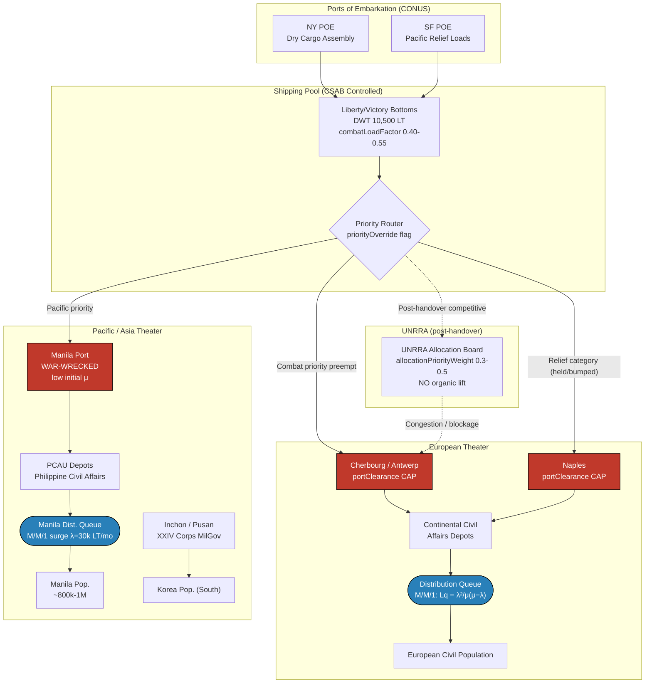

Cost: 0.267535

# Chapter 31: The Army and Civilian Supply: II
## Reference Manual & Simulation-Specification Document
### US Army Green Book — *Global Logistics and Strategy: 1943–1945*

---

## 1. Strategic Context & Modern Historical Perspective

### The Strategic Paradox: Grand Strategy Against the Iron Law of Tonnage

The civilian supply problem of 1943–1945 embodies the central paradox of coalition logistics: strategic ambition scaled faster than the physical shipping pool could accommodate. The great conferences—Casablanca (SYMBOL, January 1943), TRIDENT (May 1943), QUADRANT (Quebec, August 1943), and SEXTANT (Cairo, November–December 1943)—each ratified expanding operational commitments across the Mediterranean, Northwest Europe, the China-Burma-India theater, and the Central and Southwest Pacific. Each commitment implicitly assumed a lift capacity that did not yet exist in deployable form. The result was that civilian relief, categorized under the doctrine of "disease and unrest prevention" (the minimalist standard codified for military government), became the residual claimant on a shipping pool already oversubscribed by combat and combat-service loads.

The physical constraints were unforgiving and interlocking. The global dry-cargo shipping pool, even after the Liberty and Victory ship production surge peaked in 1943, was bounded by three sequential bottlenecks that no strategic directive could conjure away: (1) *combat loading inefficiency*, wherein tactical loading for assault operations reduced effective cubic utilization to as low as 40–50 percent of a vessel's deadweight, (2) *port clearance rates* at destination, which in devastated or primitive ports (Naples, Cherbourg, Manila) were throttled by wrecked cranes, blocked channels, sunken blockships, and destroyed rail marshalling yards, and (3) *inland transport capacity*, the truck-and-rail "last mile" that determined whether tonnage discharged at quayside actually reached consuming populations. Civilian supply competed for every unit of capacity at all three stages, and it competed from a position of doctrinal inferiority.

The paradox sharpened as the strategic center of gravity shifted. As the European war approached resolution in early 1945, the Combined Chiefs reaffirmed the priority of the Pacific war and the redeployment of forces across the globe (the "one-way" and "two-way" redeployment schemes). This meant that at the precise moment European civilian populations required maximum relief tonnage to survive the winter of 1944–45 and the reconstruction of 1945, the shipping pool was being reoriented toward the Pacific. Civilian supply thus faced a structural squeeze: rising demand, falling allocation priority.

### Inter-Service and Coalition Tensions

Command friction operated along at least four axes. First, the **Services of Supply (SOS/ASF) versus Combat Commands** tension: theater commanders (and their G-4s) controlled priority allocation within the theater, and combat requirements were rightly primary, but this meant civilian supply cargo often sat in "held" status or was bumped from convoys, arriving in unbalanced increments (flour without yeast, wheat without milling capacity, tinned goods without distribution transport).

Second, the **Army versus Navy** contest over shipping control, particularly acute in the Pacific where the Navy controlled amphibious lift and assault shipping schedules. Civilian relief for liberated Pacific territories depended on Army cargo shipping that the joint theater commands rationed against combat resupply.

Third, the **US versus British pooling arrangements** administered through the Combined Shipping Adjustment Board (CSAB) and the Combined Boards. Pooling was rational in aggregate but generated friction over which nation's relief obligations (British responsibilities in their zones and the Mediterranean versus US responsibilities) drew down the common pool.

Fourth, and most consequentially for this chapter, the **military (G-5 / Civil Affairs) versus civilian relief agency** tension—specifically the fraught hand-off to the United Nations Relief and Rehabilitation Administration (UNRRA).

### Historical Era Context: From Push to Pull

This chapter extends the civilian supply narrative into two theaters of profound difficulty: liberated Asia and the Pacific (notably Manila and Korea), and the wind-down of direct military responsibility in Europe. In the Pacific, the recapture of Manila in February–March 1945 produced one of the war's acute urban relief emergencies. The city, subjected to the catastrophic destruction of the Battle of Manila, contained a starving population of roughly 800,000 to 1,000,000 whose normal food import channels had collapsed. The Army, through its civil affairs organization and the Philippine Civil Affairs Units (PCAU), had to inject emergency rations immediately—an operation conducted under the strictest "disease and unrest" logic, competing against the concurrent Luzon combat campaign and the mounting Okinawa build-up.

Korea presented a different template: a liberated territory occupied post-surrender (from September 1945), where relief blended with military-government administration under XXIV Corps, and where the absence of a functioning civil administration and the partition at the 38th parallel severed the industrial north from the agricultural south.

### Modern Analytical Insights: The G-5-to-UNRRA Discontinuity

The transition of relief responsibility from G-5 to UNRRA was, in modern systems terms, a **hand-off between two fundamentally incompatible control architectures**. G-5 operated a *push system*: it forecast requirements, pre-stocked "Civil Affairs" and "Relief" categories, commandeered military shipping under theater priority, and used military priority routing to force supplies forward regardless of local market or distribution capacity. Its control loop was command-driven, with authority to preempt.

UNRRA, by contrast, was a *civilian coalition consortium* with no organic shipping, no priority-routing authority, and a governance structure requiring inter-governmental negotiation for allocations. When UNRRA assumed responsibility, it had to **compete** for scarce bottoms in the general shipping pool at a moment when the military still held overriding priority for the Pacific war and redeployment. The predictable consequence was a severe distribution discontinuity: supplies that G-5 could have pushed by fiat now waited in queue for civilian allocations, and European ports—already congested—experienced accumulation blockages as UNRRA cargo arrived out of phase with inland clearance capacity. The hand-off is best modeled not as a clean transfer of a functioning pipeline but as the *removal of a priority-override coefficient* from a network already operating near saturation. This is precisely why the transition, though administratively "complete" on paper, produced measurable relief shortfalls in late 1945.

The scholarly consensus, informed by post-war declassification of shipping records and by the histories of ASF and the Combined Boards, is that the civilian supply program succeeded in its narrow military objective—preventing the disease-and-unrest that would have imperiled operations—but that the transition to civilian relief agencies exposed the fragility of any relief architecture lacking dedicated lift and priority authority. The lesson institutionalized in later doctrine (and in the design of postwar humanitarian logistics) was that relief agencies require either dedicated transport or guaranteed priority allocations to function in a contested shipping environment.

---

## 2. High-Fidelity Simulation Parameters & Real-World Metrics

| Parameter | Value | Type in Sim | Historical Explanation & Rationale |
|---|---|---|---|
| **G-5 → UNRRA hand-over date (Europe)** | Beginning ~mid-1945; formal transfer of relief responsibility largely effected through late 1945 (military responsibility for UNRRA-eligible countries transferred progressively, with the principal European hand-off keyed to the post-V-E period, target 1 July / autumn 1945) | Static event constant `HANDOVER_DATE`; triggers removal of priority-override coefficient | The Army sought to divest relief responsibility as rapidly as combat conditions permitted, to free shipping and personnel for the Pacific. The hand-off removed the `priorityOverride` flag from civilian cargo, converting a push system to a competitive-allocation pull system. Model as a state transition that zeroes the preemption coefficient. |
| **Manila emergency food, first month post-liberation** | On the order of ~30,000+ long tons of relief supplies moved into the metropolitan area in the opening month; emergency ration base built toward feeding ~800,000–1,000,000 persons | Dynamic capacity injection `manilaReliefTonnage` | Emergency injection to prevent mass starvation in a destroyed city; represented as a surge inflow subject to port-clearance cap. Rationale: disease-and-unrest doctrine mandated immediate minimal-ration coverage. |
| **"Disease and unrest" ration standard** | ~2,000 calories/day baseline (subsistence floor), often initially 1,500–1,800 in acute shortage | Efficiency coefficient / demand generator `rationCalories` | Defines per-capita demand; multiply by population to yield tonnage demand λ input. |
| **Ration → tonnage conversion** | ~1.5–2.0 lbs dry ration equivalent per person-day | Static conversion constant `LBS_PER_PERSON_DAY` | Converts caloric demand to physical dry-cargo tonnage for queue λ. |
| **Combat-load cubic utilization** | 40–55% effective deadweight | Efficiency coefficient `combatLoadFactor` | Discounts nominal ship capacity for tactically loaded relief cargo. |
| **Port clearance rate (devastated port)** | Manila/Naples-class: severely reduced initial discharge, rising as repair progressed | Dynamic capacity cap `portClearanceTonsPerDay` | Governs μ at the port node; time-varying as reconstruction proceeds. |
| **Manila population served** | ~800,000–1,000,000 | Static demand base `servedPopulation` | Multiplier for demand generation. |
| **Liberty ship deadweight** | ~10,500 long tons DWT (~9,000 tons practical cargo) | Static constant `LIBERTY_DWT` | Base unit of convoy lift. |
| **UNRRA European allocation competition factor** | Post-handover, effective priority weight drops from override (1.0 preemptive) to competitive (~0.3–0.5 of pool share) | Efficiency coefficient `allocationPriorityWeight` | Represents loss of routing priority; principal driver of post-handover blockage. |

---

## 3. Logistical Network Topology (Mermaid.js)



---

## 4. Mathematical Modeling & Simulation Formulas

### 4.1 Single-Channel Queue at Distribution Stations (M/M/1)

The core relief-distribution model treats each distribution station as an M/M/1 queue: Poisson arrivals of supply/demand units at rate $\lambda$, exponential service at rate $\mu$, single server (single-channel clearance).

Define **traffic intensity** (utilization):
$$\rho = \frac{\lambda}{\mu}, \qquad 0 \le \rho < 1$$

The **average number in queue** (waiting, excluding in service):
$$L_q = \frac{\lambda^2}{\mu\,(\mu - \lambda)} = \frac{\rho^2}{1 - \rho}$$

Average number **in system**, average wait, and average time in system follow from Little's Law:
$$L = \frac{\rho}{1-\rho}, \qquad W_q = \frac{L_q}{\lambda} = \frac{\lambda}{\mu(\mu-\lambda)}, \qquad W = \frac{1}{\mu - \lambda}$$

**Stability condition:** the queue diverges ($L_q \to \infty$) as $\lambda \to \mu^-$. Physically, when relief demand rate approaches distribution service rate, backlog grows without bound — the mathematical signature of the Manila starvation emergency and the post-UNRRA European port blockage.

### 4.2 Priority-Override Coefficient (G-5 → UNRRA transition)

Effective port-directed inflow depends on an allocation priority weight $\alpha(t)$ that switches at the handover date $t_H$:
$$\lambda_{\text{eff}}(t) = \alpha(t)\cdot \lambda_{\text{nominal}}, \qquad \alpha(t)=\begin{cases} 1.0 & t < t_H \ \text{(G-5 preemptive push)}\\ \alpha_{U}\in[0.3,0.5] & t \ge t_H \ \text{(UNRRA competitive)}\end{cases}$$

Since $\lambda_{\text{eff}}$ falls at handover but the *demand* remains, the model represents blockage as a rise in **unmet demand backlog** $B$:
$$\frac{dB}{dt} = D(t) - \mu_{\text{delivered}}(t), \qquad \mu_{\text{delivered}} = \min\!\big(\lambda_{\text{eff}}(t),\ \mu_{\text{port}}(t)\big)$$

### 4.3 Port Clearance Allocation (constrained resource problem)

Given ships $s\in S$ carrying relief tonnage $c_s$ discounted by combat-load factor $f$, and ports $p\in P$ with time-varying clearance caps $K_p(t)$, maximize delivered relief subject to capacity:
$$\max \sum_{p\in P}\sum_{s\in S} f\, c_s\, x_{sp}$$
$$\text{s.t.}\quad \sum_{s} f\, c_s\, x_{sp} \le K_p(t)\ \forall p, \qquad \sum_p x_{sp} \le 1\ \forall s, \qquad x_{sp}\in\{0,1\}$$

where $x_{sp}=1$ assigns ship $s$ to port $p$. This is the classic capacitated assignment governing whether discharged tonnage clears the quay.

**Interpretation of $L_q = \frac{\lambda^2}{\mu(\mu-\lambda)}$:** As Manila's wrecked port kept $\mu$ low while emergency demand drove $\lambda$ high, $\rho \to 1$ and $L_q$ exploded — the queue of undistributed rations (and the human queue of the starving) grew super-linearly. Port reconstruction raised $\mu$, pulling $\rho$ down and collapsing $L_q$.

---

## 5. Compile-Safe Scala 3.8.3 Domain Model

```scala
package Logistics.CivilianSupplyII

import scala.math.pow
import scala.collection.immutable.List

opaque type Tons = Double
object Tons:
  def apply(v: Double): Tons = v
  extension (t: Tons)
    def value: Double = t
    def +(o: Tons): Tons = t + o
    def -(o: Tons): Tons = t - o

opaque type Days = Double
object Days:
  def apply(v: Double): Days = v
  extension (d: Days) def value: Double = d

opaque type RatePerMin = Double
object RatePerMin:
  def apply(v: Double): RatePerMin = v
  extension (r: RatePerMin) def value: Double = r

opaque type Weight = Double
object Weight:
  def apply(v: Double): Weight = v
  extension (w: Weight) def value: Double = w

enum ReliefControlPhase:
  case G5MilitaryPush
  case UnrraCompetitive

enum StationHealth:
  case Stable
  case NearSaturation
  case Diverging

final case class DistributionStation(
    arrivalRatePerMin: Double,
    serviceRatePerMin: Double
)

final case class ReliefContext(
    phase: ReliefControlPhase,
    handoverDay: Days,
    currentDay: Days,
    allocationPriorityWeight: Weight
)

final case class PortNode(
    name: String,
    clearanceTonsPerDay: Tons,
    combatLoadFactor: Double
)

final case class ShipLoad(
    id: String,
    deadweightTons: Tons
)

object ReliefDistributionQueue:

  final val LibertyDwt: Tons = Tons(10500.0)
  final val LbsPerPersonDay: Double = 1.75
  final val G5PriorityWeight: Weight = Weight(1.0)

  def trafficIntensity(station: DistributionStation): Double =
    station.arrivalRatePerMin / station.serviceRatePerMin

  def averageQueueLength(station: DistributionStation): Double =
    val l: Double = station.arrivalRatePerMin
    val m: Double = station.serviceRatePerMin
    if m > l && l >= 0.0 then (l * l) / (m * (m - l))
    else Double.PositiveInfinity

  def averageNumberInSystem(station: DistributionStation): Double =
    val rho: Double = trafficIntensity(station)
    if rho < 1.0 then rho / (1.0 - rho)
    else Double.PositiveInfinity

  def averageWaitInQueueMin(station: DistributionStation): Double =
    val lq: Double = averageQueueLength(station)
    if station.arrivalRatePerMin > 0.0 && lq.isFinite then
      lq / station.arrivalRatePerMin
    else Double.PositiveInfinity

  def averageTimeInSystemMin(station: DistributionStation): Double =
    val m: Double = station.serviceRatePerMin
    val l: Double = station.arrivalRatePerMin
    if m > l then 1.0 / (m - l) else Double.PositiveInfinity

  def classify(station: DistributionStation): StationHealth =
    val rho: Double = trafficIntensity(station)
    if rho >= 1.0 then StationHealth.Diverging
    else if rho >= 0.85 then StationHealth.NearSaturation
    else StationHealth.Stable

  def resolvePriorityWeight(ctx: ReliefContext): Weight =
    if ctx.currentDay.value < ctx.handoverDay.value then G5PriorityWeight
    else ctx.allocationPriorityWeight

  def activePhase(ctx: ReliefContext): ReliefControlPhase =
    if ctx.currentDay.value < ctx.handoverDay.value then
      ReliefControlPhase.G5MilitaryPush
    else ReliefControlPhase.UnrraCompetitive

  def effectiveArrivalRate(
      nominalRate: Double,
      ctx: ReliefContext
  ): Double =
    val w: Double = resolvePriorityWeight(ctx).value
    (nominalRate * w).max(0.0)

  def effectiveInflowStation(
      nominal: DistributionStation,
      ctx: ReliefContext
  ): DistributionStation =
    nominal.copy(arrivalRatePerMin =
      effectiveArrivalRate(nominal.arrivalRatePerMin, ctx)
    )

  def dailyDemandTons(population: Long): Tons =
    val lbs: Double = population.toDouble * LbsPerPersonDay
    Tons(lbs / 2240.0)

  def effectiveDischargeTons(port: PortNode, load: ShipLoad): Tons =
    val usable: Double = load.deadweightTons.value * port.combatLoadFactor
    Tons(usable.min(port.clearanceTonsPerDay.value))

  def unmetBacklogDelta(
      demand: Tons,
      delivered: Tons
  ): Tons =
    Tons((demand.value - delivered.value).max(0.0))

  def assignByCapacity(
      ships: List[ShipLoad],
      port: PortNode
  ): (List[ShipLoad], Tons) =
    val cap: Double = port.clearanceTonsPerDay.value
    val sorted: List[ShipLoad] =
      ships.sortBy(s => -s.deadweightTons.value)
    val folded: (List[ShipLoad], Double) =
      sorted.foldLeft((List.empty[ShipLoad], 0.0)):
        case ((acc, used), s) =>
          val usable: Double =
            s.deadweightTons.value * port.combatLoadFactor
          if used + usable <= cap then (s :: acc, used + usable)
          else (acc, used)
    (folded._1.reverse, Tons(folded._2))

  def rho2Over1MinusRho(station: DistributionStation): Double =
    val rho: Double = trafficIntensity(station)
    if rho < 1.0 then pow(rho, 2.0) / (1.0 - rho)
    else Double.PositiveInfinity

  def validate(station: DistributionStation): Either[String, DistributionStation] =
    if station.arrivalRatePerMin < 0.0 then
      Left("Arrival rate must be non-negative")
    else if station.serviceRatePerMin <= 0.0 then
      Left("Service rate must be strictly positive")
    else Right(station)
```

---

## 6. Graduate-Level Operational Analysis

### 6.1 Organizational Differences: Why the G-5 → UNRRA Transition Was Difficult

The difficulty was not administrative incompetence but a **structural mismatch in control architecture and resource authority**. Four differences dominate.

**Authority over lift.** G-5 was embedded within a command structure holding priority-routing authority. It could preempt convoy space under theater priority — a preemptive coefficient $\alpha=1.0$ in the model above. UNRRA possessed *no organic shipping* and no preemption authority; it drew on the general pool through inter-governmental allocation. At handover, $\alpha$ dropped to a competitive $0.3$–$0.5$, so even with demand $D(t)$ unchanged, $\lambda_{\text{eff}}$ collapsed and backlog $B$ accumulated per $\frac{dB}{dt} = D - \mu_{\text{delivered}}$.

**Control loop type.** G-5 ran a *push* system: forecast-driven, category-stocked, forcing supplies forward regardless of downstream absorption. UNRRA operated a *pull/negotiated* system requiring member-government agreement on allocations. Push systems tolerate downstream congestion by overwhelming it; pull systems are throttled by the slowest negotiating step. Grafting a pull governance layer onto a pipeline built for push produced phase mismatches — cargo arriving out of synchronization with inland clearance, the classic Mermaid `UN -.-> CHER` congestion edge.

**Timing against the Pacific pivot.** The handover coincided with the redeployment surge toward the Pacific. The military rationally retained overriding priority for combat and redeployment, so UNRRA competed for the *residual* pool at its thinnest. The transition therefore occurred at the worst possible point on the shipping-availability curve.

**Personnel and accountability discontinuity.** Military civil-affairs officers operated under unified command with disciplined reporting; UNRRA blended national contingents with heterogeneous procedures. The loss of a single accountable command node raised transaction costs at exactly the ports where congestion was most sensitive to coordination delay.

The net effect: on paper the pipeline transferred intact, but in operation the *priority-override coefficient* — the single most valuable asset G-5 held — could not be transferred, because it was a property of the command system, not of the supplies. This is the enduring doctrinal lesson: humanitarian relief without dedicated lift or guaranteed priority is a queue perpetually near saturation.

### 6.2 European Urban vs. Pacific Archipelago Relief: A Comparative Logistics Analysis

The two theaters differ along the axes that determine $\lambda$, $\mu$, and network topology.

**Demand density and geometry.** European urban relief (dense, contiguous, rail-connected cities) presented *high aggregate demand concentrated at fewer nodes* with generally surviving inland transport skeletons. The Philippine archipelago presented *distributed demand across islands* with negligible inter-island shore-to-shore capacity — every island node was effectively its own single-channel queue with its own $\mu$, and inter-island lift became an additional scarce resource layered atop ocean lift. Manila itself was an extreme point-demand: ~800,000–1,000,000 persons requiring ~30,000+ long tons in the first month, injected through a single wrecked port.

**Port and clearance state ($\mu$).** European ports (Antwerp, Cherbourg), though damaged, were large, deep, and mechanizable, so port clearance $\mu_{\text{port}}$ recovered relatively quickly and could sustain high throughput once congestion upstream was cleared. Manila's port was catastrophically wrecked by the Battle of Manila — sunken hulls, destroyed cranes, blocked channels — driving initial $\mu$ near zero. In the M/M/1 model, Manila spent its first weeks with $\rho \to 1$ and $L_q \to \infty$: the mathematical signature of famine. Only progressive reconstruction (rising $\mu(t)$) restored stability.

**Inland "last mile."** Europe's rail network, though bombed, was densely redundant and repairable; alternative routing existed. The Philippines lacked a comparable network — road and rail were sparse, and the PCAU distribution depended on truck columns and small craft, making the inland $\mu$ the binding constraint even after quayside discharge succeeded. In queue terms, Europe's bottleneck was often *port congestion* (a single high-capacity server), while the Pacific's was a *series of low-capacity servers* (port, then inter-island, then intra-island), each an independent M/M/1 whose product of utilizations compounded delay.

**Population survival buffer.** European populations, even in ruined cities, generally retained some residual local agriculture, black markets, and administrative structures — a nonzero "self-service" rate reducing effective $\lambda$ on the military pipeline. Manila's population, trapped in an obliterated city stripped of surrounding food access during the battle, had near-zero buffer: $\lambda$ was almost entirely military-supplied, making the emergency injection non-substitutable and time-critical.

**Synthesis.** Europe was a *high-throughput congestion problem* solvable by raising $\mu$ and clearing backlog — a capacity-management challenge. The Pacific archipelago was a *saturated, series-constrained emergency* where the binding constraint migrated island-to-island and where the initial $\mu \approx 0$ at Manila made it a pure survival race against $L_q$ divergence. The same M/M/1 mathematics describes both, but the parameter regimes — moderate $\rho$ recoverable in Europe versus $\rho \to 1$ in early Manila — explain why one was a management problem and the other a humanitarian catastrophe narrowly averted by the Army's disease-and-unrest emergency injection.
