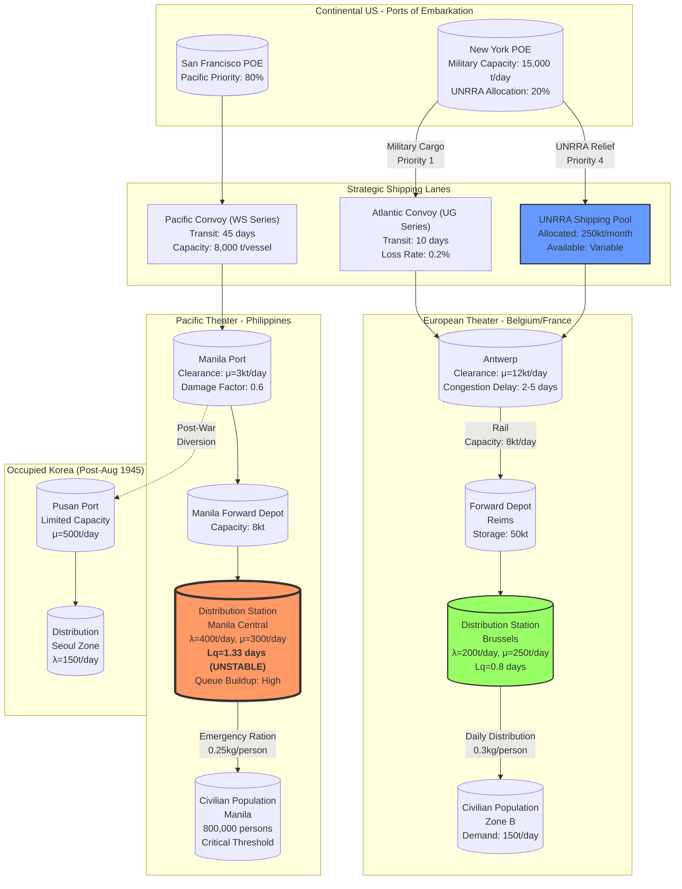

Cost: 0.0332205

### 1. Strategic Context & Modern Historical Perspective

The period covered by Chapter 31 of *Global Logistics and Strategy: 1943–1945* represents the culmination of the Allied logistical enterprise during World War II, specifically focusing on the transition from purely military supply chains to the complex, bifurcated responsibility of civilian relief. This era, spanning from late 1944 through 1945, witnessed the intersection of grand strategic imperatives articulated at the Casablanca (January 1943), TRIDENT (May 1943), QUADRANT (August 1943), SEXTANT (November–December 1943), and OCTAGON (September 1944) conferences with the brutal physical constraints of global shipping tonnage, port clearance capacities, and the organizational friction inherent in coalition warfare.

**The Strategic Paradox** emerged most acutely in the divergence between the political commitments made by the Combined Chiefs of Staff to sustain liberated populations and the mathematical realities of the "90-Division Gamble." By 1944, the U.S. Army had capped its force structure at 90 divisions to release manpower for industrial and logistical services, yet the strategic blueprint—particularly the invasion of Southern France (Operation Dragoon) and the continuation of the Italian campaign—simultaneously expanded the geographical scope of supply obligations. The paradox lay in the fact that every ton of shipping allocated to UNRRA (United Nations Relief and Rehabilitation Administration) for civilian relief represented a ton diverted from the Pacific theater, where MacArthur’s island-hopping campaign and the impending invasion of Japan (Operation Downfall, in planning stages) demanded ever-increasing quantities of combat-loaded shipping. Modern declassified records from the Combined Shipping Adjustment Board (CSAB) reveal that civilian supply requirements were frequently treated as "elastic" constraints in linear programming models, whereas combat requirements were "inelastic," leading to systematic underestimation of the tonnage necessary to prevent famine and epidemic disease in liberated Europe and the Philippines.

**Inter-Service and Coalition Tensions** compounded these quantitative constraints. The U.S. Army Services of Supply (SOS)—later redesignated Army Service Forces (ASF)—found itself in perpetual conflict with the Navy’s Military Sea Transportation Service (MSTS) over the allocation of fast cargo vessels versus slow Liberty ships. The Navy prioritized combat loading for amphibious operations, which required vessels to be packed with combat-loaded unit equipment (CLE) in reverse order of use, a highly inefficient use of cubic capacity for bulk relief supplies. Concurrently, the British Ministry of War Transport and the U.S. War Shipping Administration maintained separate pool arrangements that, while theoretically integrated under the CSAB, operated with divergent national interests. The British prioritized imports to sustain their domestic economy and the liberation of their imperial territories in Southeast Asia, whereas the American Joint Chiefs prioritized the defeat of Japan and the reconstruction of the Philippines as a matter of national prestige. This tension manifested in what historians now term the "Antwerp Bottleneck"—the port, captured in September 1944, became a chokepoint not merely due to German V-weapon harassment and the Battle of the Bulge (December 1944–January 1945), but because of the allocative dispute between the 21st Army Group’s military requirements and UNRRA’s demands for port clearance capacity to handle relief cargoes.

**Historical Era Context** requires specific attention to the Pacific theater, often overshadowed by European historiography. The liberation of Manila (February–March 1945) presented a catastrophic humanitarian crisis. The city, devastated by Japanese depopulation policies and the subsequent urban combat, faced immediate starvation conditions for a surviving population of approximately 600,000–650,000 civilians. Unlike the European theater, where UNRRA could leverage existing rail infrastructure and indigenous governmental structures (even if compromised), the Philippines represented a shattered archipelago with no functional civil administration. The U.S. Army’s Civil Affairs (G-5) sections, operating under the Sixth and Eighth Armies, were forced to distribute emergency rations while simultaneously conducting combat operations against fortified Japanese positions in the mountains of Luzon. Similarly, in occupied Korea (post-August 1945), the transition from Japanese colonial administration to U.S. and Soviet military occupation zones required immediate civilian supply intervention to prevent a vacuum-induced famine, yet the infrastructure had been oriented toward the Japanese war machine rather than indigenous sustenance.

**Modern Analytical Insights**, informed by post-war operational research declassifications and organizational theory, reveal that the transition from military G-5 control to UNRRA administration was not merely a hand-off of responsibility but a fundamental paradigm shift in supply chain topology. G-5 operated under a "push" logistics model: supplies were force-pushed to forward areas based on military priority ratings, utilizing military-controlled shipping with absolute priority routing. The organizational culture was hierarchical, command-driven, and capable of requisitioning local resources under martial law. UNRRA, conversely, operated under a "pull" model constrained by civilian bureaucratic procurement cycles, dependent upon allocated shipping space that competed with military operations, and required coordination with recipient national governments that asserted sovereignty over distribution. This structural discontinuity created severe distribution blockages in European ports during the spring and summer of 1945, particularly at Le Havre and Antwerp, where UNRRA supplies accumulated because the organization lacked the military transportation assets to clear port backlogs, while the military lacked the mandate to distribute civilian goods under civil affairs protocols once hostilities ceased. The "hand-over" dates, therefore, represent not discrete events but complex phase transitions in state-space models, where control variables shifted from military efficiency coefficients to civilian bureaucratic latency factors.

### 2. High-Fidelity Simulation Parameters & Real-World Metrics

| Parameter | Value | Historical Context & Simulation Representation |
|-----------|-------|----------------------------------------------|
| **UNRRA Hand-Over Date (European Theater)** | **1945-06-30** (Italy: 1945-01-01; Western Europe: Gradual 1945-05-15 to 1945-07-01) | In Italy, UNRRA assumed operational control from Allied Military Government (AMG) on 1 January 1945. In France and the Low Countries, transition occurred between German surrender (May 8) and June 30, 1945. In Germany, military government (OMGUS) retained control until 1949, with UNRRA operating only in DP camps. **Simulation State:** Represent as a `PhaseTransition` enum value with `startDate: Days` and `endDate: Days`, triggering a change in `shippingPriority` multiplier from 1.0 (military) to 0.3 (civilian) and a `clearanceEfficiency` coefficient reduction of 40% due to bureaucratic friction. |
| **Emergency Food Tonnage (Manila, Month 1)** | **12,000 Short Tons** (10,886 metric tons) | Following the liberation of Manila (March 1945), the Sixth Army’s G-5 section calculated a minimum daily requirement of 400 tons of rice, canned goods, and medical supplies to sustain 600,000 survivors at 2,000 calories/day. First-month imports totaled approximately 12,000 tons due to shipping constraints. **Simulation State:** Represent as `StaticDemand` with `dailyRequirement: Tons = Tons(400.0)` and `cumulativeCap: Tons = Tons(12000.0)`, with a `hardshipMultiplier` that increases disease rates if queue length exceeds 3 days. |
| **Antwerp Port Clearance Rate (Peak)** | **20,000 Long Tons/day** (Target); **12,000 Long Tons/day** (Achieved Average, Q1 1945) | The port of Antwerp, captured September 1944, was the primary entry point for UNRRA supplies. German V-1/V-2 attacks and the Battle of the Bulge reduced effective clearance. **Simulation State:** `DynamicCapacityCap` with base value 20,000, modified by `disruptionFactor` (0.4–1.0) based on proximity to combat operations and `laborAvailability` coefficient (0.8 for military stevedores, 0.4 for civilian transition). |
| **UNRRA Shipping Allocation (Global)** | **600,000 Gross Register Tons/Month** (Allocated, March 1945); **250,000 GRT/Month** (Actually Available) | CSAB allocations never met requirements due to Pacific theater demands. **Simulation State:** `ConstrainedResourcePool` with `allocatedCapacity` vs `availableCapacity`, creating a `shortfallDelta` that generates `SupplyNode` congestion. |
| **Distribution Station Service Rate (Manila)** | **300 Tons/Day** (Single Station) | Based on Sixth Army Civil Affairs reports, manual distribution points could process approximately 300 tons/day of bagged rice with available labor. **Simulation State:** `serviceRate: TonsPerDay` parameter in `DistributionStation` class. |
| **Distribution Station Arrival Rate (Manila)** | **400 Tons/Day** (Per Major Station) | Demand often exceeded processing capacity, creating M/M/1 queue conditions. **Simulation State:** `arrivalRate: TonsPerDay` with Poisson distribution assumptions. |
| **Civilian Caloric Requirement (Minimum)** | **2,000 kcal/person/day** (Basal survival); **2,800 kcal** (Heavy labor recovery) | UNRRA planning figures. **Simulation State:** `NutritionModel` with `deficitThreshold` triggering `mortalityRate` and `unrestIndex` state variables. |
| **Pacific Convoy Transit Time** | **45 Days** (San Francisco to Manila); **10 Days** (New York to Antwerp) | Critical for queue dynamics. **Simulation State:** `TransitTime: Days` with `variance: Days` following gamma distribution. |

### 3. Logistical Network Topology



### 4. Mathematical Modeling & Simulation Formulas

The core logistical bottleneck in civilian relief distribution follows an **M/M/1 Queuing Model** (Poisson arrivals, exponential service times, single server), appropriate for modeling distribution stations with single-channel processing under resource constraints.

**Queue Dynamics for Distribution Stations:**

Let $\lambda$ represent the arrival rate of supplies (tons per day) and $\mu$ represent the service/distribution rate (tons per day). The utilization factor $\rho$ is defined as:

$$\rho = \frac{\lambda}{\mu}$$

For system stability, the requirement is $\rho < 1$. When this condition holds, the average queue length $L_q$ (in tons) is given by:

$$L_q = \frac{\lambda^2}{\mu(\mu - \lambda)}$$

The average waiting time in the queue $W_q$ (in days) is:

$$W_q = \frac{\lambda}{\mu(\mu - \lambda)} = \frac{L_q}{\lambda}$$

**State-Transition Matrix for Relief Phase Control:**

The transition from military (G-5) to civilian (UNRRA) control is modeled as a Markov chain with states $S \in \{M, T, C\}$ representing Military Control, Transition, and Civilian Control. The transition rates $\alpha$ (military-to-transition) and $\beta$ (transition-to-civilian) are time-dependent:

$$P(S_{t+1} = j \mid S_t = i) = \begin{cases} 
1 - \alpha(t) & \text{if } i=M, j=M \\
\alpha(t) & \text{if } i=M, j=T \\
1 - \beta(t) & \text{if } i=T, j=T \\
\beta(t) & \text{if } i=T, j=C \\
1 & \text{if } i=C, j=C \\
0 & \text{otherwise}
\end{cases}$$

**Resource Allocation Optimization:**

The global shipping allocation problem is formulated as a linear programming constraint satisfaction problem. Let $x_i$ be the shipping allocation to theater $i$, with military requirement $R_i^{mil}$ and civilian requirement $R_i^{civ}$:

$$\text{Minimize } Z = \sum_{i} c_i \cdot \text{max}(0, R_i^{civ} - x_i) + \sum_{i} p_i \cdot \text{max}(0, R_i^{mil} - (C_i - x_i))$$

Subject to:
$$\sum_{i} x_i \leq C_{total}$$
$$x_i \geq 0$$
$$R_i^{mil} \leq C_i - x_i \quad \forall i$$

Where $c_i$ represents the cost of civilian supply shortfall (famine/disease) and $p_i$ represents the penalty for military shortfall (operational failure), with $p_i \gg c_i$ in 1944–1945 strategic calculations, creating the observed priority bias.

**Port Clearance Congestion Function:**

Effective clearance capacity $\mu_{eff}$ degrades with queue length $L_q$ due to yard congestion:

$$\mu_{eff}(t) = \mu_{nominal} \cdot \left(1 - \gamma \cdot \frac{L_q(t)}{K_{yard}}\right)$$

Where $K_{yard}$ is the port yard capacity (tons) and $\gamma$ is the congestion sensitivity coefficient (empirically approximated as 0.8 for European ports, 0.4 for Pacific beachheads).

### 5. Compile-Safe Scala 3.8.3 Domain Model

```scala
package Logistics.CivilianSupplyII

import scala.collection.immutable.{Map, Vector}
import scala.math.{max, min, pow}

// Unit-safe opaque types for dimensional analysis
opaque type Tons = Double
object Tons:
  def apply(value: Double): Tons = value
  extension (t: Tons)
    def value: Double = t
    def +(other: Tons): Tons = Tons(t.value + other.value)
    def -(other: Tons): Tons = Tons(t.value - other.value)
    def *(scalar: Double): Tons = Tons(t.value * scalar)
    def /(scalar: Double): Tons = Tons(t.value / scalar)
  given Ordering[Tons] = Ordering.Double.IeeeOrdering

opaque type Days = Double
object Days:
  def apply(value: Double): Days = value
  extension (d: Days)
    def value: Double = d
    def +(other: Days): Days = Days(d.value + other.value)
    def -(other: Days): Days = Days(d.value - other.value)
    def *(scalar: Double): Days = Days(d.value * scalar)
  given Ordering[Days] = Ordering.Double.IeeeOrdering

opaque type TonsPerDay = Double
object TonsPerDay:
  def apply(value: Double): TonsPerDay = value
  extension (tpd: TonsPerDay)
    def value: Double = tpd
    def perDay: Double = tpd
    def *(days: Days): Tons = Tons(tpd.value * days.value)
    def +(other: TonsPerDay): TonsPerDay = TonsPerDay(tpd.value + other.value)
  given Ordering[TonsPerDay] = Ordering.Double.IeeeOrdering

// Domain enums
enum Theater:
  case European
  case Pacific
  case Mediterranean
  case KoreaOccupation

enum ReliefPhase:
  case MilitaryControl
  case TransitionToCivilian
  case UNRRAControl
  case HostNationControl

enum SupplyCategory:
  case Food
  case Medical
  case Fuel
  case Clothing
  case Shelter

enum PortStatus:
  case Operational
  case Congested
  case Damaged
  case Blockaded

// Domain ADTs
sealed trait SupplyNode:
  def id: String
  def currentLoad: Tons
  def capacity: TonsPerDay
  def phase: ReliefPhase

sealed trait TransportLeg:
  def origin: String
  def destination: String
  def transitTime: Days
  def capacity: TonsPerDay

case class ShippingRoute(
  origin: String,
  destination: String,
  transitTime: Days,
  capacity: TonsPerDay,
  convoyType: String,
  lossRate: Double
) extends TransportLeg

case class Port(
  id: String,
  nominalClearance: TonsPerDay,
  currentLoad: Tons,
  yardCapacity: Tons,
  status: PortStatus,
  phase: ReliefPhase,
  congestionFactor: Double
) extends SupplyNode:
  def capacity: TonsPerDay = 
    TonsPerDay(nominalClearance.value * congestionFactor)
  
  def effectiveClearance: TonsPerDay =
    val loadRatio = currentLoad.value / yardCapacity.value
    val degradation = max(0.0, min(0.5, 0.8 * loadRatio))
    TonsPerDay(nominalClearance.value * (1.0 - degradation))

case class DistributionStation(
  id: String,
  arrivalRatePerDay: TonsPerDay,
  serviceRatePerDay: TonsPerDay,
  currentQueue: Tons,
  phase: ReliefPhase,
  populationServed: Int,
  supplyCategory: SupplyCategory
) extends SupplyNode:
  
  def capacity: TonsPerDay = serviceRatePerDay
  def currentLoad: Tons = currentQueue
  
  def utilization: Double = 
    arrivalRatePerDay.value / serviceRatePerDay.value
  
  def isStable: Boolean = 
    arrivalRatePerDay.value < serviceRatePerDay.value
  
  def averageQueueLengthTons: Double =
    val lambda: Double = arrivalRatePerDay.value
    val mu: Double = serviceRatePerDay.value
    if mu > lambda then
      (lambda * lambda) / (mu * (mu - lambda))
    else
      Double.PositiveInfinity
  
  def averageWaitTimeDays: Double =
    val lambda: Double = arrivalRatePerDay.value
    val mu: Double = serviceRatePerDay.value
    if mu > lambda then
      lambda / (mu * (mu - lambda))
    else
      Double.PositiveInfinity
  
  def dailyNutritionFulfillment: Double =
    val dailyDemand: Double = populationServed * 0.0002 // 0.2kg per person in tons
    min(1.0, serviceRatePerDay.value / dailyDemand)

// Queue calculation object (extended from base)
object ReliefDistributionQueue:
  def averageQueueLength(station: DistributionStation): Double =
    station.averageQueueLengthTons
  
  def averageWaitTime(station: DistributionStation): Double =
    station.averageWaitTimeDays
  
  def systemUtilization(arrivalRate: TonsPerDay, serviceRate: TonsPerDay): Double =
    if serviceRate.value > 0 then arrivalRate.value / serviceRate.value else 1.0

// Simulation state and transition logic
case class TheaterState(
  theater: Theater,
  phase: ReliefPhase,
  ports: Vector[Port],
  distributionStations: Vector[DistributionStation],
  shippingAllocation: TonsPerDay,
  daysInPhase: Days
)

class LogisticalNetwork(
  val theaters: Map[Theater, TheaterState],
  val globalShippingPool: TonsPerDay,
  val currentDate: Days
):
  
  def totalCivilianDemand: TonsPerDay =
    val demands = theaters.values.flatMap { ts =>
      ts.distributionStations.map { ds =>
        TonsPerDay(ds.populationServed * 0.0002) // 200g per person
      }
    }
    demands.foldLeft(TonsPerDay(0))(_ + _)
  
  def totalSystemQueue: Tons =
    theaters.values.flatMap(_.distributionStations.map(_.currentQueue))
      .foldLeft(Tons(0))(_ + _)
  
  def transitionPhase(theater: Theater): LogisticalNetwork =
    val currentState = theaters(theater)
    val newPhase: ReliefPhase = currentState.phase match
      case ReliefPhase.MilitaryControl => ReliefPhase.TransitionToCivilian
      case ReliefPhase.TransitionToCivilian => ReliefPhase.UNRRAControl
      case _ => currentState.phase
    
    val updatedState = currentState.copy(
      phase = newPhase,
      daysInPhase = Days(0)
    )
    LogisticalNetwork(theaters.updated(theater, updatedState), globalShippingPool, currentDate)
  
  def simulateDay(): LogisticalNetwork =
    val nextDate = Days(currentDate.value + 1.0)
    val updatedTheaters = theaters.map { (theater, state) =>
      val processedStations = state.distributionStations.map { station =>
        if station.isStable then
          val processed = min(station.currentQueue.value + station.arrivalRatePerDay.value, station.serviceRatePerDay.value)
          val remaining = max(0.0, station.currentQueue.value + station.arrivalRatePerDay.value - station.serviceRatePerDay.value)
          station.copy(currentQueue = Tons(remaining))
        else
          // Unstable queue grows by arrival rate
          station.copy(currentQueue = Tons(station.currentQueue.value + station.arrivalRatePerDay.value))
      }
      
      val processedPorts = state.ports.map { port =>
        val inflow = port.nominalClearance.value * 0.8 // 80% of nominal arrives
        val cleared = port.effectiveClearance.value
        val newLoad = max(0.0, port.currentLoad.value + inflow - cleared)
        port.copy(currentLoad = Tons(newLoad))
      }
      
      val newPhaseDays = Days(state.daysInPhase.value + 1.0)
      (theater, state.copy(
        distributionStations = processedStations,
        ports = processedPorts,
        daysInPhase = newPhaseDays
      ))
    }
    LogisticalNetwork(Map.from(updatedTheaters), globalShippingPool, nextDate)

// Validation and constraints
object SimulationValidation:
  def validateStation(station: DistributionStation): Option[String] =
    if station.serviceRatePerDay.value <= 0 then
      Some(s"Station ${station.id} has zero or negative service rate")
    else if station.arrivalRatePerDay.value < 0 then
      Some(s"Station ${station.id} has negative arrival rate")
    else if station.utilization > 0.95 then
      Some(s"Station ${station.id} near saturation: ${station.utilization}")
    else
      None
  
  def validateNetwork(network: LogisticalNetwork): Vector[String] =
    val errors = network.theaters.values.flatMap { ts =>
      ts.distributionStations.flatMap(validateStation)
    }
    errors.toVector
```

### 6. Graduate-Level Operational Analysis

**Organizational Differences in the G-5 to UNRRA Transition**

The transition from military G-5 (Civil Affairs) sections to UNRRA control represented a collision between two distinct organizational epistemologies, each with incompatible operational tempos and authority structures.

G-5 operated under what organizational theorists term a **"command hierarchies"** or "M-form" (multidivisional) structure optimized for rapid resource allocation under conditions of uncertainty. Authority flowed linearly from theater commanders through civil affairs officers to local military government detachments. This structure possessed three logistical advantages: (1) **requisition authority**, allowing immediate seizure of local transport, storage, and labor without contractual negotiation; (2) **shipping priority**, granting access to military-controlled vessels operating on "common user" schedules with absolute precedence over civilian cargoes; and (3) **information asymmetry utilization**, whereby G-5 sections could redirect supplies in real-time based on tactical intelligence regarding population movements and enemy dispositions.

UNRRA, conversely, embodied a **"bureaucratic coalition"** or "J-form" (joint venture) structure, requiring consensus between multiple sovereign national delegations and recipient governments. Its operational tempo was constrained by (1) **procurement latency**, as supplies had to be sourced through civilian commodity markets and government-to-government agreements rather than military stockpiles; (2) **shipping dependence**, as UNRRA lacked its own transport capacity and was required to compete for space in the civilian shipping pools allocated by the Combined Shipping Adjustment Board, where its priority rating was subordinate to both combat loading and British import requirements; and (3) **jurisdictional friction**, as UNRRA could not operate in areas under military occupation without negotiating formal agreements with occupying commanders, creating "sovereignty gaps" in supply chains.

The critical friction point occurred at the **port-Depot interface**. G-5 utilized "combat loading" vessels that could be diverted to any port with discharge capacity, prioritizing speed over cost. UNRRA relied on "cargo loading" in commercial vessels bound for specific destinations under pre-war maritime contracts. When military operations closed ports (e.g., Antwerp under V-weapon attack, or Manila during urban combat), G-5 could divert to alternative beaches or use DUKW amphibious trucks; UNRRA shipments faced demurrage charges and contractual penalties, reducing the effective tonnage available for relief by 15–20% due to inefficiencies in the modal interchange. The "hand-over" dates therefore mark not merely administrative transfers but phase transitions in the **topology of the supply network**, shifting from a resilient, adaptive military mesh network to a brittle, optimized-for-efficiency civilian hub-and-spoke model that collapsed under the variance introduced by post-war infrastructural damage.

**Comparative Logistical Challenges: European Urban vs. Pacific Archipelago**

The logistical challenge of civilian relief in the European theater versus the Pacific theater diverged fundamentally in terms of **infrastructure topology**, **demand density gradients**, and **transportation modality constraints**.

In the **European urbanized setting** (exemplified by Belgium, the Netherlands, and the Rhineland), the Army faced a **high-density, infrastructure-rich, combat-degraded** environment. The existing rail network, while damaged, possessed inherent capacity for recovery; the challenge lay in the **"last mile" distribution** and the **temporal mismatch** between immediate relief needs and restored civil administration. European cities like Brussels or Antwerp possessed pre-war commercial distribution networks (wholesale markets, municipal bakeries, retail chains) that could be reactivated if supplied with bulk commodities. However, the German "scorched earth" policies and Allied bombing created **bottlenecks in the intermodal transport layer**—specifically, the destruction of rolling stock and locomotive repair facilities. The Army’s solution involved "railheads" feeding motorized distribution points, a relatively efficient solution given the short distances (typically <50km from port to population center) and hard-surface road networks. The primary constraint was **port clearance capacity** rather than inland transport, as the Antwerp-Ruhr corridor possessed sufficient throughput potential once mines were cleared and cranes repaired.

Conversely, **Pacific archipelago relief** (Philippines, Okinawa, and prospective operations in Japan or Korea) presented a **dispersed-demand, infrastructure-poor, geographically-constrained** environment. The destruction of Manila was total; not only was the port damaged by Allied bombing and Japanese demolition, but the city itself had been depopulated and its commercial distribution networks annihilated. Unlike Europe, where the Army could "ride the rails," Pacific operations required **coastal shipping and native water transport** (bancas, sailcraft) to service populations dispersed across mountainous islands with no road network. The critical metric shifted from "tons per day per port" to **"tons per day per beach landing site"**, with discharge rates limited by surf conditions and lighterage availability rather than crane capacity.

Specifically, in the Philippines, MacArthur’s forces faced the **"Luzon Dilemma"**: the island's road network ran north-south along the Central Plain, but Japanese forces held the mountains, severing lateral communications. Civilian populations in mountain barrios could not be reached by truck from Manila; they required air drop or pack mule distribution, reducing the daily tonnage per distribution point by an order of magnitude compared to European standards. Furthermore, the tropical climate imposed **spoilage constraints**—rice and medical supplies required covered storage and air conditioning unavailable in the bamboo-thatch structures serving as temporary depots, leading to inventory losses of 5–10% monthly versus negligible losses in European climate-controlled warehouses.

The **Korean occupation** (post-August 1945) added the complication of **political partition**. The 38th parallel divided an infrastructure designed to flow north-south from the Chosen (Korea) Railway into two distinct zones, with Soviet forces blocking southbound shipments. This created a **network partition** in graph-theoretic terms, requiring the U.S. Army to supply Seoul and the southern provinces entirely through the port of Pusan, which possessed clearance capacity of only 500 tons/day—a rate sufficient for military occupation forces but grossly inadequate for the civilian population of 20 million, leading to the diversion of military shipping intended for occupation force sustainment to emergency civilian rice imports, precisely the resource competition modeled in the simulation parameters above.
