Cost: 0.1533185

### 1. Strategic Context & Modern Historical Perspective

Chapter 31 of *Global Logistics and Strategy: 1943–1945* concerns a category of military logistics that did not fit neatly within the conventional distinction between combat and service support: the supply of civilian populations in liberated, occupied, and war-devastated areas. Civilian relief was not simply humanitarian activity conducted alongside military operations. It was a component of theater strategy. Food shortages, epidemics, mass displacement, destroyed utilities, and economic collapse could immobilize ports, consume military transportation, provoke civil disorder, and impede the movement of combat formations. Conversely, every ton of food, seed, soap, medical material, or fuel allocated to civilian use competed with military cargo for procurement capacity, shipping space, port labor, railcars, trucks, and command attention.

The chapter’s central logistical problem is therefore one of coupled military-civilian demand under severe scarcity. The Army had to support combat forces while preventing civilian systems from collapsing in their wake. These requirements were interdependent: armies needed local labor, functioning roads, ports, hospitals, warehouses, and public-health systems, but sustaining those systems required cargo and transportation that military planners naturally preferred to reserve for combat.

#### The strategic paradox

The high-level Allied conference system produced plans whose aggregate logistical implications repeatedly exceeded immediately available transportation capacity. Casablanca in January 1943, TRIDENT in May, QUADRANT in August, SEXTANT in November–December, and subsequent conferences did more than establish strategic direction. Their decisions created overlapping cargo requirements for the Mediterranean, the United Kingdom, the Soviet aid program, China-Burma-India, the Central and Southwest Pacific, and eventually the reconstruction and relief of liberated territories.

Conference decisions were often expressed as objectives, force levels, or operational dates. The shipping system, however, operated through finite hulls, convoy cycles, port turnaround times, loading priorities, and commodity-specific constraints. A notional ship allocation did not guarantee useful delivered capacity. A vessel might spend days waiting for a berth, be loaded in an unsuitable sequence, or arrive at a destination whose warehouses, lighters, railways, or trucks could not clear the cargo. Combat-loaded ships were particularly inefficient in volumetric terms because equipment had to be stowed for tactical accessibility rather than maximum cargo density. Amphibious operations also sequestered shipping as floating reserve, retained assault vessels in theater, and imposed large requirements for landing craft that could not be substituted readily by ordinary dry-cargo tonnage.

Civilian supply magnified this paradox. Relief cargo often had low military priority until civilian distress threatened military operations. By that point the requirement became urgent, encouraging emergency shipments and disruptive priority changes. Food cargo was also heterogeneous. Bulk grain required milling, bagging, inland distribution, and often complementary ingredients. A population could not be sustained merely by reporting aggregate tons discharged. Nutritional composition, losses, cooking fuel, local transport, ration administration, and the ability to reach vulnerable neighborhoods all mattered.

The resulting system contained at least four distinct capacity limits:

1. **Ocean lift:** available deadweight or measurement tons in the relevant shipping pool.
2. **Port discharge:** berth productivity, lighterage, cranes, gangs, and working hours.
3. **Port clearance:** rail, road, barge, pipeline, and warehouse capacity for removing discharged cargo.
4. **Last-mile distribution:** trucks, local carts, ration cards, kitchens, distribution stations, and public-order controls.

The smallest effective capacity governed throughput. Increasing ocean lift could worsen theater performance when port clearance was already saturated, because additional vessels merely accumulated in anchorages and additional cargo congested quays and transit sheds.

#### Military priorities and civilian consequences

Military authorities generally treated civilian supply as a minimum essential program rather than a program of general economic recovery. The object was to prevent disease, starvation, unrest, and administrative breakdown while avoiding an open-ended commitment that would consume combat resources. This distinction explains the emphasis on “disease and unrest” scales, austere ration levels, emergency medical supplies, and carefully restricted commodity lists.

G-5 and civil-affairs organizations could nevertheless move supplies with unusual force once a requirement was accepted. They operated inside military command channels; could obtain theater priorities; could use Army depots, trucks, communications, and personnel; and could direct subordinate units. A military requisition was tied to an authoritative command structure. If a port, railway, or truck company had to be diverted, a commander could issue the order.

That command advantage was accompanied by serious weaknesses. Civil-affairs planners often received inadequate information concerning local populations and surviving stocks. Front-line commanders sometimes regarded civilian cargo as an intrusion on operational space. Supply agencies might object to requisitions that were poorly specified, submitted late, or unsupported by procurement lead times. Civil-affairs personnel also lacked the manpower to administer entire national distribution systems. Military control was thus powerful but temporary and frequently improvised.

#### Inter-service and coalition tensions

The Army’s civilian-supply program was embedded in a larger institutional contest over who controlled shipping and priorities. The War Department, Army Service Forces, theater Services of Supply, the Navy, the War Shipping Administration, the British Ministry of War Transport, combined boards, and theater combat commands each viewed capacity through a different operational lens.

Army Service Forces emphasized balanced supply pipelines, advance requisitioning, and economical use of shipping. Combat commanders emphasized immediate tactical readiness and reserves against uncertainty. The Navy required vessels, escorts, landing craft, and petroleum support for fleet operations. Civil-affairs staffs argued that food and medical supplies could be operationally decisive even though they were not ammunition or combat equipment.

British and American pooling arrangements introduced another level of friction. The British brought longer experience with import controls, imperial trade, rationing, and civilian administration, while the United States possessed growing production and shipping power. Combined arrangements could increase total efficiency, but they also obscured national accountability. Governments remained politically responsible to their publics even when shipping and procurement decisions were made through combined machinery. Differences in commodity standards, packaging, accounting, and the geographic allocation of scarce imports produced recurring disputes.

The transition to civilian relief organizations did not remove these conflicts. It changed the authority structure under which they were negotiated. The United Nations Relief and Rehabilitation Administration was an international civilian organization dependent on member contributions, diplomatic agreements, host-government consent, and shipping allocations. Unlike a theater G-5 section, it could not ordinarily command a military port battalion, seize trucks, or reclassify a vessel by operational order. Its authority was administrative and consensual rather than coercive.

#### The European hand-off and the port blockage problem

The commonly described transition “from the Army to UNRRA” was not a single universal transfer covering every category of relief in every European country. Sovereign governments, Allied military governments, occupation authorities, and UNRRA assumed different functions at different dates. The clearest operational milestone was **1 October 1945**, when UNRRA assumed responsibility for the administration and welfare of displaced persons in assembly centers in the western occupation zones. Even then, occupation armies continued to supply substantial services, transportation, security, and matériel. Germany and Austria also remained governed through occupation authorities; UNRRA was not a substitute sovereign government.

The hand-off exposed a fundamental systems mismatch. G-5 operated as a high-priority push organization. It estimated minimum needs, requisitioned supplies, and inserted those supplies into military procurement and transportation channels. Although this system could be wasteful and inflexible, it possessed priority authority and could compel subordinate agencies to act.

UNRRA was more dependent on a pull-and-allocation process. It had to establish requirements with governments or occupation authorities, obtain member-financed supplies, secure shipping, arrange reception, and negotiate inland distribution. It entered the system while the Pacific war was still consuming shipping and while Europe’s transport infrastructure was gravely damaged. Even after the Japanese surrender, troop redeployment and repatriation competed with relief cargo.

European ports consequently experienced a paradoxical combination of scarcity and congestion. Cargo might be scarce at the point of consumption yet blocked at a port. Ships could discharge faster than damaged rail systems and truck fleets could clear the quays. Warehouses filled with commodities awaiting documentation, destination instructions, rolling stock, or host-government acceptance. Poor cargo visibility compounded the problem: aggregate inventory records did not always reveal whether a port held balanced food packages or large quantities of one unusable component. The bottleneck was therefore not merely shipping. It was synchronized clearance and distribution.

Modern logistical scholarship interprets this as a failure of end-to-end pipeline control. Each organization could optimize its own segment while reducing overall performance. Procurement officials maximized acquisition, shipping agencies maximized vessel utilization, ports maximized discharge, and relief administrations tried to allocate commodities equitably. Without a single authority controlling the complete chain, excess inventory accumulated at interfaces.

#### Manila and the Pacific-Asian setting

Manila illustrated a different but equally severe relief problem. The city was liberated through intense urban combat in February 1945. Destruction of buildings, water systems, transport, warehouses, and markets coincided with mass displacement and acute food shortage. During the first month after liberation, Army agencies distributed approximately **7,000 short tons of emergency food** to Manila’s civilian population. This was an emergency operational issue, not evidence that the city’s ordinary economy had been restored.

The Philippine archipelago imposed transport penalties unlike those of continental Europe. Ocean cargo first had to enter a principal port or beachhead. Supplies then required transshipment to smaller vessels, movement among islands, and often manual handling at damaged or primitive landing points. Inland distribution depended on limited truck fleets and roads frequently damaged by combat or weather. Typhoons, monsoon conditions, surf, and inter-island sailing schedules introduced variability that a continental rail network did not.

A simulator should therefore distinguish between European and archipelagic relief networks. Europe had high-capacity infrastructure with heavily damaged links and severe node congestion. The Philippines had lower network density, more transshipment, greater weather exposure, and many isolated demand nodes. Manila was an exceptional high-volume urban node, but relief beyond Manila depended on decentralized water transport and local distribution.

Korea, occupied after the Japanese surrender, added another transition problem. Japanese imperial economic networks were abruptly severed; political authority was divided; repatriation and population movement altered demand; and military occupation forces inherited responsibility for food and public health without a mature replacement economy. Korea demonstrates that “liberation” could reduce rather than increase short-term logistical coherence. Existing systems might be politically unacceptable yet materially indispensable, and replacing them required administrative capacity that could not be improvised instantly.

#### Modern analytical interpretation

From a contemporary operations-research perspective, civilian relief should be modeled as a multi-commodity, multi-echelon flow network with endogenous demand, priority classes, perishable inventory, damaged infrastructure, and institutional transition costs. Authority itself is a logistical variable. A military organization may have a higher routing-compliance coefficient, faster requisition approval, and priority access to transport, while a civilian coalition may possess stronger long-term legitimacy but lower short-term command responsiveness.

The G-5-to-UNRRA transition was thus not simply an exchange of organizational labels. It changed the decision latency, priority regime, funding mechanism, data system, and ability to compel transportation. When ownership of cargo, port operations, inland transport, and beneficiary administration was fragmented, queues appeared at the interfaces. The historical lesson is that relief throughput is governed not only by physical tonnage but by the synchronization of authority, information, and transport.

---

### 2. High-Fidelity Simulation Parameters & Real-World Metrics

#### Historical and modeled constants

| Parameter | Historical value or recommended baseline | Unit | Historical explanation | Simulation representation |
|---|---:|---|---|---|
| UNRRA displaced-person relief hand-over in western Europe | **1 October 1945** | Date | UNRRA assumed responsibility for administering and caring for displaced persons in assembly centers in the western occupation zones. This was not a universal transfer of all European civilian supply. Occupation armies continued to provide security, transport, facilities, and substantial material support. | Static event date triggering an institutional-state transition. Do not set military support immediately to zero; apply a phased reduction. |
| End of military DP administration | **30 September 1945, 24:00 local administrative time** | Date-time boundary | Operational complement of the 1 October transfer date. Useful where a simulator processes daily events at midnight. | Deterministic state-transition boundary. |
| Manila emergency food distribution, first month after liberation | **Approximately 7,000 short tons** | Short tons | Army civil-affairs and supply agencies issued emergency food during the first month following liberation. The figure is a rounded historical aggregate and should not be interpreted as a sustained monthly rate or a complete nutritional accounting. | Initial emergency-distribution observation; use as a calibration target rather than a permanent capacity. |
| Manila food distribution, metric equivalent | **≈6,350 metric tonnes** | Metric tonnes | Conversion from 7,000 short tons using 0.90718474 metric tonnes per short ton. | Derived constant when the simulation uses SI units. |
| Manila average daily emergency issue | **≈233.3 short tons/day** | Short tons per day | Derived as 7,000 divided by a 30-day calibration month. Actual daily issues would have varied sharply with combat, port access, stocks, and distribution-station availability. | Calibration mean with stochastic day-to-day variation, not a hard cap. |
| Manila average hourly issue over continuous operation | **≈9.72 short tons/hour** | Short tons per hour | Derived continuous-flow equivalent. Historical stations did not operate uniformly for 24 hours, so an operating-hours correction is required. | Diagnostic rate only. For 10 operating hours per day, the effective issue rate becomes about 23.3 short tons per operating hour. |
| Short-ton conversion | **2,000** | lb/short ton | Standard United States wartime weight ton. Wartime sources may also employ long tons, measurement tons, or ship deadweight tons; those units must not be conflated. | Immutable unit conversion. |
| Short ton to metric tonne | **0.90718474** | t/short ton | Exact conventional conversion. | Immutable conversion coefficient. |
| Long ton to metric tonne | **1.01604691** | t/long ton | Required for British shipping and coalition records. | Immutable conversion coefficient. |
| Measurement ton | **40** | ft³/measurement ton | Shipping-space measure commonly used for volumetric cargo. It is not a weight. | Cargo-volume unit used in vessel stowage constraints. |
| M/M/1 queue stability condition | **$\lambda < \mu$** | Persons/minute | A single-channel distribution station has a finite steady-state queue only if mean service capacity exceeds mean arrival demand. | Hard validation rule for steady-state reporting. If violated, report an unstable queue or simulate transient growth. |
| Queue utilization | **$\rho=\lambda/\mu$** | Dimensionless | Measures station saturation. Queue length rises nonlinearly as utilization approaches unity. | Dynamic congestion coefficient. |
| Average M/M/1 queue length | **$L_q=\lambda^2/[\mu(\mu-\lambda)]$** | Persons | Expected number waiting, excluding the person being served. | Computed state metric. |
| Average waiting time in queue | **$W_q=\lambda/[\mu(\mu-\lambda)]$** | Minutes | Follows from Little’s law, $L_q=\lambda W_q$. | Computed welfare and disorder-risk metric. |
| Average time in station system | **$W=1/(\mu-\lambda)$** | Minutes | Includes both waiting and service. | Computed metric affecting crowd exposure and station throughput. |
| Port effective throughput | **$\min(C_b,C_d,C_c,C_i)$** | Tons/day | Effective output is limited by berth capacity, discharge handling, port clearance, or inland acceptance. | Dynamic bottleneck cap. |
| Damaged-infrastructure efficiency | **$0 \le \eta \le 1$** | Dimensionless | Represents reduced availability from destroyed bridges, cranes, railways, roads, utilities, and labor. | Multiplier on nominal arc or node capacity. |
| Military routing-compliance coefficient | Recommended baseline **0.90–0.98** | Dimensionless | Military command could compel subordinate transport and depot organizations to execute priorities. This range is a modeling assumption, not a chapter statistic. | Institutional efficiency coefficient, scenario-calibrated. |
| UNRRA initial routing-compliance coefficient | Recommended baseline **0.55–0.75** | Dimensionless | Represents dependence on negotiated transport, national authorities, documentation, and coalition contributions during early hand-over. This is an analytical calibration range, not a reported historical constant. | Dynamic coefficient that can improve with organizational maturation. |
| Hand-over disruption duration | Recommended **30–90 days** | Days | Captures duplicated records, unclear ownership, contract delays, staffing changes, and loss of military priority. | Temporary transition penalty with gradual recovery. |
| Port storage occupancy warning threshold | Recommended **80%** | Percent | Above this level, cargo sorting and vehicle circulation generally deteriorate. | Soft congestion threshold. |
| Port storage critical threshold | Recommended **95%** | Percent | Near-full storage can block discharge despite berth availability. | Nonlinear congestion and vessel-delay trigger. |
| Emergency civilian priority class | Below immediate combat sustainment but above routine stock building | Ordinal priority | Historically contingent. Disease, starvation, or disorder could cause civilian cargo to receive emergency priority. | Dynamic priority class responsive to mortality, ration, and unrest indicators. |
| Relief spoilage rate | Commodity dependent | Fraction/day | Grain, canned goods, fats, medical supplies, and fresh food had markedly different loss profiles. Tropical heat and damaged storage increased losses in the Pacific. | Per-commodity decay coefficient. |
| Inter-island transshipment penalty | Scenario dependent; suggested starting multiplier **0.70–0.85** per transfer | Dimensionless | Accounts for repeated handling, lighterage, weather delay, pilferage, and small-vessel availability. | Multiplicative arc-efficiency factor. |
| European rail restoration factor | Time dependent, **0–1** | Dimensionless | European relief depended heavily on restoration of bridges, locomotives, marshalling yards, and cross-border operating agreements. | Dynamic network-recovery parameter. |

#### Source and interpretation caution

The **1 October 1945** milestone specifically concerns the transfer of displaced-person camp administration and welfare responsibility. A simulation should not encode it as a binary termination of all Army relief in Europe. Civilian supply to occupied populations, support to national authorities, and Army logistical assistance followed different legal and operational timelines.

The Manila figure is reported as a rounded aggregate of approximately **7,000 short tons**. It should be stored with metadata such as `precision = rounded`, `coverage = emergency food issues`, and `period = first post-liberation month`. The database should not silently transform it into a precise daily rate or assume that all cargo reached final household consumption; handling loss, communal feeding, depot inventories, and distribution timing must be represented separately.

---

### 3. Logistical Network Topology (Detailed Mermaid.js Flowchart)

```mermaid
flowchart LR
  subgraph CONUS["Continental United States: Procurement and Ports of Embarkation"]
    FARMS["Food and Agricultural Procurement<br/>grain, fats, canned goods, seed"]
    MED["Medical and Sanitary Procurement<br/>drugs, soap, water-treatment material"]
    IND["Industrial Procurement<br/>clothing, tools, vehicles, spare parts"]
    ASFD["Army Service Forces Depots<br/>inspection, packing, documentation"]
    POEE["Atlantic POEs<br/>New York / Hampton Roads<br/>berth and rail-clearance limits"]
    POEP["Pacific POEs<br/>San Francisco / Los Angeles / Seattle<br/>berth and rail-clearance limits"]
    WSA["War Shipping Administration Pool<br/>finite hulls and sailing allocations"]

    FARMS --> ASFD
    MED --> ASFD
    IND --> ASFD
    ASFD --> POEE
    ASFD --> POEP
    WSA --> POEE
    WSA --> POEP
  end

  subgraph ATL["Atlantic and European Relief Pipeline"]
    ATLSEA["Atlantic Convoy Route<br/>capacity limited by assigned hulls<br/>weather and turnaround delay"]
    UKSTAGE["United Kingdom Staging and Holding Depots<br/>sorting and cross-Channel allocation"]
    ANTW["Antwerp<br/>high discharge potential<br/>estuary and inland-clearance constraints"]
    CHER["Cherbourg / Le Havre<br/>damaged berths and rail links"]
    MARS["Marseille<br/>Mediterranean relief entry"]
    PORTQEU["European Port Transit Storage<br/>queue rises when discharge exceeds clearance"]
    RAIL["Rail and Barge Clearance Network<br/>bridges, locomotives, wagons, border permissions"]
    ROAD["Military and Civilian Truck Pool<br/>fuel, tires, drivers, road damage"]
    EDEPOT["Regional Relief Depots<br/>food-package assembly and inventory balancing"]
    DPCAMP["Displaced-Person Assembly Centers<br/>UNRRA responsibility from 1 Oct 1945"]
    CITYEU["Urban Civilian Demand Nodes<br/>ration offices, kitchens, hospitals"]
    GOVEU["National and Occupation Authorities<br/>ration policy and destination approval"]

    POEE -->|"dry cargo: vessel allocation cap"| ATLSEA
    ATLSEA --> UKSTAGE
    ATLSEA --> ANTW
    ATLSEA --> CHER
    ATLSEA --> MARS
    UKSTAGE -->|"coaster / cross-Channel lift"| ANTW
    UKSTAGE -->|"alternative route"| CHER

    ANTW --> PORTQEU
    CHER --> PORTQEU
    MARS --> PORTQEU

    PORTQEU -->|"clearance cap C_rail"| RAIL
    PORTQEU -->|"alternative clearance cap C_truck"| ROAD
    RAIL --> EDEPOT
    ROAD --> EDEPOT
    GOVEU -->|"allocation instructions"| EDEPOT
    EDEPOT --> DPCAMP
    EDEPOT --> CITYEU
  end

  subgraph PAC["Pacific and Asian Relief Pipeline"]
    PACSEA["Pacific Ocean Route<br/>military-priority shipping pool<br/>long voyage and turnaround cycle"]
    SWPA["Southwest Pacific Staging Bases<br/>Hollandia / Leyte logistics area"]
    MANPORT["Manila Port and Anchorage<br/>battle damage, mines, lighterage, berth limits"]
    MANTRANSIT["Manila Transit Depots<br/>storage, sorting, ration-pack assembly"]
    PCAU["Philippine Civil Affairs Units<br/>military push distribution"]
    COAST["Coastal and Inter-Island Craft Pool<br/>weather, surf, small-port and fuel constraints"]
    LUZONROAD["Luzon Road Distribution<br/>bridge damage, trucks, fuel and security"]
    ISLANDDEPOT["Provincial and Island Depots<br/>repeated handling and loss"]
    MANILA["Liberated Manila Civilian Population<br/>first-month emergency issue ≈ 7,000 short tons"]
    PROVINCES["Provincial Municipalities<br/>lower-volume dispersed demand"]
    KOREAPORT["Korean Entry Ports<br/>Pusan / Inchon<br/>tide, berth and rail constraints"]
    KOREADEPOT["Korean Occupation Relief Depots<br/>food control and repatriation demand"]
    KOREADEMAND["Korean Urban and Rural Demand Nodes"]

    POEP -->|"dry cargo and medical cargo"| PACSEA
    PACSEA --> SWPA
    SWPA -->|"combat and relief cargo compete"| MANPORT
    MANPORT --> MANTRANSIT
    MANTRANSIT --> PCAU
    PCAU --> LUZONROAD
    PCAU --> COAST
    LUZONROAD --> MANILA
    LUZONROAD --> PROVINCES
    COAST --> ISLANDDEPOT
    ISLANDDEPOT --> PROVINCES

    PACSEA -->|"post-surrender allocation"| KOREAPORT
    KOREAPORT --> KOREADEPOT
    KOREADEPOT --> KOREADEMAND
  end

  subgraph QUEUE["Civilian Relief Distribution Station: M/M/1 Queue"]
    ARRIVE["Civilian Arrivals<br/>Poisson rate λ persons/min"]
    WAIT["Single Waiting Queue<br/>expected length Lq"]
    SERVER["One Registration and Issue Channel<br/>exponential service rate μ persons/min"]
    ISSUE["Ration Issued<br/>inventory decrement"]
    TURN["Turned Away or Deferred Demand<br/>stockout, closure, or instability"]
    UNREST["Crowding and Disorder Risk<br/>increases nonlinearly with waiting time"]

    ARRIVE --> WAIT
    WAIT --> SERVER
    SERVER -->|"stock available"| ISSUE
    SERVER -->|"stockout or closure"| TURN
    WAIT -.-> UNREST
  end

  EDEPOT -->|"station replenishment"| SERVER
  PCAU -->|"station replenishment"| SERVER
  ISLANDDEPOT -->|"station replenishment"| SERVER
  KOREADEPOT -->|"station replenishment"| SERVER

  subgraph CONTROL["Institutional Control and Priority Logic"]
    G5["Military G-5 / Civil Affairs<br/>command routing and military priority"]
    UNRRA["UNRRA<br/>coalition procurement and negotiated routing"]
    COMBAT["Combat Commands<br/>ammunition, POL, replacements, operational reserves"]
    NAVY["Navy and Amphibious Commands<br/>assault shipping, escorts, landing craft"]
    ALLOC["Combined Shipping and Theater Allocation<br/>finite hull and cargo-space decision"]
    HANDOFF["Institutional Hand-over State<br/>documentation and authority delay"]

    COMBAT --> ALLOC
    NAVY --> ALLOC
    G5 --> ALLOC
    UNRRA --> ALLOC
    G5 --> HANDOFF
    HANDOFF --> UNRRA
    ALLOC --> WSA
  end

  PORTQEU -.->|"if storage > 80%:<br/>handling efficiency declines"| ANTW
  PORTQEU -.->|"if storage > 95%:<br/>vessel discharge blocked"| ATLSEA
  MANTRANSIT -.->|"if clearance < discharge:<br/>anchorage and quay delay"| MANPORT
  WAIT -.->|"if λ ≥ μ:<br/>no finite steady state"| ARRIVE
```



The network should implement node capacity and arc capacity separately. A port may possess adequate berth discharge capacity but insufficient transit storage or inland clearance. Alternative routes should incur explicit penalties for extra handling, distance, documentation, and transshipment.

---

### 4. Mathematical Modeling & Simulation Formulas

#### 4.1 Multi-commodity relief-flow model

Let:

- $N$ be the set of ports, depots, transshipment nodes, and demand nodes.
- $A \subseteq N \times N$ be the set of directed transportation arcs.
- $K$ be the set of commodities: food, medical supplies, clothing, fuel, and other relief goods.
- $T$ be the set of discrete time periods.
- $P$ be priority classes.
- $x_{ijkt}$ be tons of commodity $k$ moved over arc $(i,j)$ during period $t$.
- $I_{ikt}$ be ending inventory of commodity $k$ at node $i$.
- $d_{ikt}$ be civilian demand at node $i$.
- $u_{ikt}$ be unmet demand.
- $C_{ijt}$ be nominal arc capacity.
- $\eta_{ijt}$ be damage and operating efficiency, $0\leq\eta_{ijt}\leq1$.
- $H_{it}$ be node-handling capacity.
- $S_{it}$ be usable storage capacity.
- $\alpha_k$ be the daily survival fraction after spoilage.
- $m_k$ be a commodity-specific humanitarian penalty weight.
- $q_i$ be a political or disorder-risk weight.
- $c_{ijkt}$ be transportation cost.
- $z_{vt}$ be a binary variable indicating assignment of vessel $v$ in period $t$.

A suitable objective is:

$$
\min
\left[
\sum_{t\in T}\sum_{(i,j)\in A}\sum_{k\in K}
c_{ijkt}x_{ijkt}
+
\sum_{t\in T}\sum_{i\in N}\sum_{k\in K}
m_k q_i u_{ikt}
+
\sum_{t\in T}\sum_{i\in N}
\gamma_i G_{it}
\right]
$$

where $G_{it}$ is congestion at node $i$, and $\gamma_i$ is the cost assigned to congestion.

The inventory-balance equation is:

$$
I_{ikt}
=
\alpha_k I_{ik,t-1}
+
\sum_{j:(j,i)\in A}x_{jikt}
-
\sum_{j:(i,j)\in A}x_{ijkt}
-
d_{ikt}
+
u_{ikt}
$$

with:

$$
I_{ikt}\geq0,\qquad u_{ikt}\geq0
$$

Arc flow is restricted by damage-adjusted capacity:

$$
\sum_{k\in K}x_{ijkt}
\leq
\eta_{ijt}C_{ijt}
\qquad
\forall (i,j)\in A,\ t\in T
$$

Commodity cube and weight may both constrain vessel cargo. If $w_k$ is weight per modeled unit and $v_k$ is cubic volume:

$$
\sum_{k\in K}w_k x_{ijkt}\leq C^{W}_{ijt}
$$

$$
\sum_{k\in K}v_k x_{ijkt}\leq C^{V}_{ijt}
$$

This distinction is essential because a vessel may “cube out” before reaching its deadweight limit.

Node handling is constrained by:

$$
\sum_{j:(j,i)\in A}\sum_{k\in K}x_{jikt}
+
\sum_{j:(i,j)\in A}\sum_{k\in K}x_{ijkt}
\leq H_{it}
$$

Storage is constrained by:

$$
\sum_{k\in K}I_{ikt}\leq S_{it}
$$

A simple congestion penalty can be based on utilization:

$$
r_{it}=\frac{\sum_k I_{ikt}}{S_{it}}
$$

$$
G_{it}
=
\begin{cases}
0, & r_{it}\leq r_0\\
(r_{it}-r_0)^2, & r_0<r_{it}<1\\
M+(r_{it}-1)M', & r_{it}\geq1
\end{cases}
$$

where $r_0$ may be set to $0.80$, and $M,M'$ are large penalties. A dynamic implementation should also reduce handling efficiency:

$$
\eta^{\text{storage}}_{it}
=
\begin{cases}
1, & r_{it}\leq0.80\\
1-\beta(r_{it}-0.80), & 0.80<r_{it}<0.95\\
\eta_{\min}, & r_{it}\geq0.95
\end{cases}
$$

#### 4.2 Institutional transition coefficient

Let $\tau$ be the hand-over date, and let $\theta_t$ describe routing and administrative efficiency:

$$
\theta_t=
\begin{cases}
\theta_M, & t<\tau\\
\theta_M-\Delta_\theta, & t=\tau\\
\theta_U+(\theta_M-\Delta_\theta-\theta_U)e^{-\kappa(t-\tau)}, & t>\tau
\end{cases}
$$

where:

- $\theta_M$ is mature military routing efficiency.
- $\theta_U$ is mature UNRRA routing efficiency.
- $\Delta_\theta$ is immediate hand-over disruption.
- $\kappa$ is the civilian organization’s recovery or learning rate.

Effective capacity then becomes:

$$
C^{\text{effective}}_{ijt}
=
C_{ijt}\eta_{ijt}\theta_t
$$

This formulation avoids the historically inaccurate assumption that all capacity disappeared on the transfer date. Instead, it models a temporary loss of coordination followed by institutional adaptation.

#### 4.3 Shipping allocation

Let $V$ be the vessel set and $R$ the competing strategic routes. If $a_{vr}=1$ when vessel $v$ is assigned to route $r$:

$$
\sum_{r\in R}a_{vr}\leq1
\qquad \forall v\in V
$$

Relief lift on route $r$ is:

$$
L_{rt}
=
\sum_{v\in V}
a_{vrt}D_v f_{vr}
$$

where $D_v$ is vessel cargo capacity and $f_{vr}$ is an availability factor reflecting loading, voyage, discharge, and turnaround.

A vessel-cycle approximation is:

$$
f_{vr}
=
\frac{\Delta t}
{T^{load}_{vr}+T^{sail}_{vr}+T^{wait}_{vr}+T^{discharge}_{vr}+T^{return}_{vr}}
$$

Port congestion directly increases $T^{wait}$ and $T^{discharge}$, reducing delivered lift even when the number of assigned vessels remains unchanged.

#### 4.4 Civilian distribution queue

For an M/M/1 ration station:

- Arrivals follow a Poisson process with rate $\lambda$ persons per minute.
- Service times are exponentially distributed.
- One service channel operates at mean rate $\mu$ persons per minute.
- A steady state exists only when $\lambda<\mu$.

Utilization is:

$$
\rho=\frac{\lambda}{\mu}
$$

The requested queue formula is:

$$
\text{Mathematical Concept: } L_q = \frac{\lambda^2}{\mu \cdot (\mu - \lambda)}
$$

Equivalently:

$$
L_q=\frac{\rho^2}{1-\rho}
$$

$L_q$ is the expected number of civilians waiting in line, excluding the person currently being served. The expected number in the entire station system is:

$$
L=\frac{\lambda}{\mu-\lambda}
$$

By Little’s law, the average waiting time in the queue is:

$$
W_q=\frac{L_q}{\lambda}
=\frac{\lambda}{\mu(\mu-\lambda)}
$$

Total time in the system is:

$$
W=W_q+\frac{1}{\mu}
=\frac{1}{\mu-\lambda}
$$

For example, if $\lambda=0.8$ persons per minute and $\mu=1.0$:

$$
\rho=0.8
$$

$$
L_q=\frac{0.8^2}{1.0(1.0-0.8)}=3.2
$$

$$
W_q=\frac{3.2}{0.8}=4\text{ minutes}
$$

If arrivals increase only to $0.95$ persons per minute:

$$
L_q=\frac{0.95^2}{1.0(1.0-0.95)}=18.05
$$

This demonstrates the nonlinear congestion effect. A 18.75-percent increase in arrivals raises expected queue length from 3.2 to more than 18 persons. When $\lambda\geq\mu$, there is no finite stationary queue length. A discrete-event simulation must then model accumulating backlog:

$$
Q_{t+\Delta t}
=
\max\left(0,Q_t+A_t-S_t\right)
$$

where $A_t$ and $S_t$ are realized arrivals and completed services.

Inventory introduces another service constraint. If each civilian receives $r$ tons and available station inventory is $I_t$, the maximum inventory-supported service rate over interval $\Delta t$ is:

$$
\mu^{inventory}_t=\frac{I_t}{r\Delta t}
$$

Thus the realized service rate is:

$$
\mu_t^{effective}
=
\min\left(
\mu_t^{staff},
\mu_t^{inventory},
\mu_t^{security},
\mu_t^{operating}
\right)
$$

A station can consequently become unstable even when staffing is adequate, because delayed replenishment lowers its inventory-supported rate below the arrival rate.

---

### 5. Compile-Safe Scala 3.8.3 Domain Model

```scala
package Logistics.CivilianSupplyII

import java.time.LocalDate
import scala.collection.immutable.Map
import scala.collection.immutable.Vector
import scala.util.Random

opaque type Tons = Double

object Tons:
  def from(value: Double): Either[String, Tons] =
    if java.lang.Double.isFinite(value) && value >= 0.0 then Right(value)
    else Left(s"tons must be finite and nonnegative: $value")

  def unsafe(value: Double): Tons =
    from(value) match
      case Right(valid) => valid
      case Left(message) => throw new IllegalArgumentException(message)

  val Zero: Tons = 0.0

  extension (value: Tons)
    def toDouble: Double = value
    def +(other: Tons): Tons = value + other
    def -(other: Tons): Tons = value - other
    def *(factor: Double): Tons = unsafe(value * factor)
    def min(other: Tons): Tons = unsafe(math.min(value, other))
    def max(other: Tons): Tons = unsafe(math.max(value, other))

opaque type TonsPerDay = Double

object TonsPerDay:
  def from(value: Double): Either[String, TonsPerDay] =
    if java.lang.Double.isFinite(value) && value >= 0.0 then Right(value)
    else Left(s"tons per day must be finite and nonnegative: $value")

  def unsafe(value: Double): TonsPerDay =
    from(value) match
      case Right(valid) => valid
      case Left(message) => throw new IllegalArgumentException(message)

  val Zero: TonsPerDay = 0.0

  extension (value: TonsPerDay)
    def toDouble: Double = value
    def *(days: Days): Tons = Tons.unsafe(value * days.toDouble)

opaque type Days = Double

object Days:
  def from(value: Double): Either[String, Days] =
    if java.lang.Double.isFinite(value) && value >= 0.0 then Right(value)
    else Left(s"days must be finite and nonnegative: $value")

  def unsafe(value: Double): Days =
    from(value) match
      case Right(valid) => valid
      case Left(message) => throw new IllegalArgumentException(message)

  val Zero: Days = 0.0
  val One: Days = 1.0

  extension (value: Days)
    def toDouble: Double = value
    def +(other: Days): Days = unsafe(value + other)

opaque type NauticalMiles = Double

object NauticalMiles:
  def from(value: Double): Either[String, NauticalMiles] =
    if java.lang.Double.isFinite(value) && value >= 0.0 then Right(value)
    else Left(s"nautical miles must be finite and nonnegative: $value")

  def unsafe(value: Double): NauticalMiles =
    from(value) match
      case Right(valid) => valid
      case Left(message) => throw new IllegalArgumentException(message)

  extension (value: NauticalMiles)
    def toDouble: Double = value

opaque type Fraction = Double

object Fraction:
  def from(value: Double): Either[String, Fraction] =
    if java.lang.Double.isFinite(value) && value >= 0.0 && value <= 1.0 then
      Right(value)
    else
      Left(s"fraction must be between zero and one: $value")

  def unsafe(value: Double): Fraction =
    from(value) match
      case Right(valid) => valid
      case Left(message) => throw new IllegalArgumentException(message)

  val Zero: Fraction = 0.0
  val One: Fraction = 1.0

  extension (value: Fraction)
    def toDouble: Double = value
    def complement: Fraction = unsafe(1.0 - value)

opaque type NodeId = String

object NodeId:
  def from(value: String): Either[String, NodeId] =
    val normalized: String = value.trim
    if normalized.nonEmpty then Right(normalized)
    else Left("node identifier must not be empty")

  def unsafe(value: String): NodeId =
    from(value) match
      case Right(valid) => valid
      case Left(message) => throw new IllegalArgumentException(message)

  extension (value: NodeId)
    def toText: String = value

opaque type Persons = Long

object Persons:
  def from(value: Long): Either[String, Persons] =
    if value >= 0L then Right(value)
    else Left(s"persons must be nonnegative: $value")

  def unsafe(value: Long): Persons =
    from(value) match
      case Right(valid) => valid
      case Left(message) => throw new IllegalArgumentException(message)

  val Zero: Persons = 0L

  extension (value: Persons)
    def toLong: Long = value

case class DistributionStation(
    arrivalRatePerMin: Double,
    serviceRatePerMin: Double
)

object DistributionStation:
  def validated(
      arrivalRatePerMin: Double,
      serviceRatePerMin: Double
  ): Either[String, DistributionStation] =
    if !java.lang.Double.isFinite(arrivalRatePerMin) ||
        arrivalRatePerMin < 0.0 then
      Left("arrival rate must be finite and nonnegative")
    else if !java.lang.Double.isFinite(serviceRatePerMin) ||
        serviceRatePerMin <= 0.0 then
      Left("service rate must be finite and positive")
    else
      Right(DistributionStation(arrivalRatePerMin, serviceRatePerMin))

object ReliefDistributionQueue:
  def averageQueueLength(station: DistributionStation): Double =
    val l: Double = station.arrivalRatePerMin
    val m: Double = station.serviceRatePerMin
    if m > l then
      (l * l) / (m * (m - l))
    else
      Double.PositiveInfinity

  def utilization(station: DistributionStation): Double =
    station.arrivalRatePerMin / station.serviceRatePerMin

  def averageNumberInSystem(station: DistributionStation): Double =
    val l: Double = station.arrivalRatePerMin
    val m: Double = station.serviceRatePerMin
    if m > l then l / (m - l)
    else Double.PositiveInfinity

  def averageWaitingTimeMinutes(station: DistributionStation): Double =
    val l: Double = station.arrivalRatePerMin
    val m: Double = station.serviceRatePerMin
    if l == 0.0 then 0.0
    else if m > l then l / (m * (m - l))
    else Double.PositiveInfinity

  def averageSystemTimeMinutes(station: DistributionStation): Double =
    val l: Double = station.arrivalRatePerMin
    val m: Double = station.serviceRatePerMin
    if m > l then 1.0 / (m - l)
    else Double.PositiveInfinity

  def isStable(station: DistributionStation): Boolean =
    station.serviceRatePerMin > station.arrivalRatePerMin

enum Commodity:
  case Food
  case Medical
  case Clothing
  case Fuel
  case Seed
  case SanitaryMaterial
  case ConstructionMaterial

enum NodeKind:
  case ProcurementSource
  case PortOfEmbarkation
  case OceanStagingArea
  case TheaterPort
  case TransitDepot
  case RegionalDepot
  case DistributionStation
  case CivilianDemandNode
  case DisplacedPersonCenter

enum TransportMode:
  case OceanShipping
  case CoastalShipping
  case Rail
  case Road
  case Barge
  case Lighter
  case ManualPorterage

enum Authority:
  case ArmyG5
  case ArmyServiceForces
  case TheaterServicesOfSupply
  case UNRRA
  case OccupationGovernment
  case NationalGovernment

enum ReliefPhase:
  case MilitaryEmergency
  case JointTransition
  case CivilianAdministration
  case Recovery

enum PriorityClass(val rank: Int):
  case ImmediateCombat extends PriorityClass(1)
  case MedicalEmergency extends PriorityClass(2)
  case FaminePrevention extends PriorityClass(3)
  case CivilDisorderPrevention extends PriorityClass(4)
  case RoutineCivilianRelief extends PriorityClass(5)
  case EconomicRecovery extends PriorityClass(6)

enum InfrastructureState:
  case Destroyed
  case EmergencyOperation
  case Restricted
  case Operational
  case Congested

enum TransitionFailure:
  case InvalidElapsedTime(message: String)
  case InsufficientInventory(requested: Tons, available: Tons)
  case InvalidCapacity(message: String)
  case UnknownNode(node: NodeId)
  case ClosedRoute(from: NodeId, to: NodeId)

sealed trait ReliefEvent:
  def date: LocalDate

final case class AuthorityTransferred(
    date: LocalDate,
    from: Authority,
    to: Authority
) extends ReliefEvent

final case class CargoArrived(
    date: LocalDate,
    node: NodeId,
    commodity: Commodity,
    amount: Tons
) extends ReliefEvent

final case class CargoDistributed(
    date: LocalDate,
    node: NodeId,
    commodity: Commodity,
    amount: Tons
) extends ReliefEvent

final case class InfrastructureChanged(
    date: LocalDate,
    node: NodeId,
    newState: InfrastructureState
) extends ReliefEvent

final case class LogisticsNode(
    id: NodeId,
    kind: NodeKind,
    nominalHandlingCapacity: TonsPerDay,
    storageCapacity: Tons,
    infrastructureEfficiency: Fraction
):
  def effectiveHandlingCapacity: TonsPerDay =
    TonsPerDay.unsafe(
      nominalHandlingCapacity.toDouble * infrastructureEfficiency.toDouble
    )

final case class LogisticsArc(
    from: NodeId,
    to: NodeId,
    mode: TransportMode,
    distance: NauticalMiles,
    nominalCapacity: TonsPerDay,
    infrastructureEfficiency: Fraction,
    institutionalEfficiency: Fraction,
    open: Boolean
):
  def effectiveCapacity: TonsPerDay =
    if open then
      TonsPerDay.unsafe(
        nominalCapacity.toDouble *
          infrastructureEfficiency.toDouble *
          institutionalEfficiency.toDouble
      )
    else
      TonsPerDay.Zero

final case class CommodityInventory(
    commodity: Commodity,
    onHand: Tons,
    dailySurvivalFraction: Fraction
):
  def afterSpoilage(elapsed: Days): CommodityInventory =
    val survival: Double =
      math.pow(dailySurvivalFraction.toDouble, elapsed.toDouble)
    copy(onHand = Tons.unsafe(onHand.toDouble * survival))

  def receive(amount: Tons): CommodityInventory =
    copy(onHand = onHand + amount)

  def issue(amount: Tons): Either[TransitionFailure, CommodityInventory] =
    if amount.toDouble <= onHand.toDouble then
      Right(copy(onHand = Tons.unsafe(onHand.toDouble - amount.toDouble)))
    else
      Left(TransitionFailure.InsufficientInventory(amount, onHand))

final case class PortState(
    node: LogisticsNode,
    storedCargo: Tons,
    vesselsWaiting: Int
):
  def storageUtilization: Double =
    if node.storageCapacity.toDouble == 0.0 then
      if storedCargo.toDouble == 0.0 then 0.0
      else Double.PositiveInfinity
    else
      storedCargo.toDouble / node.storageCapacity.toDouble

  def congestionEfficiency: Fraction =
    val utilization: Double = storageUtilization
    if utilization <= 0.80 then Fraction.One
    else if utilization < 0.95 then
      Fraction.unsafe(math.max(0.25, 1.0 - 3.0 * (utilization - 0.80)))
    else
      Fraction.unsafe(0.25)

  def isDischargeBlocked: Boolean =
    storageUtilization >= 1.0

final case class InstitutionalState(
    authority: Authority,
    phase: ReliefPhase,
    routingEfficiency: Fraction,
    handoverDate: Option[LocalDate]
)

final case class ReliefNetwork(
    nodes: Map[NodeId, LogisticsNode],
    arcs: Vector[LogisticsArc]
):
  def node(id: NodeId): Either[TransitionFailure, LogisticsNode] =
    nodes.get(id) match
      case Some(found) => Right(found)
      case None => Left(TransitionFailure.UnknownNode(id))

  def outgoing(id: NodeId): Vector[LogisticsArc] =
    arcs.filter(arc => arc.from == id && arc.open)

  def routeCapacity(
      from: NodeId,
      to: NodeId
  ): Either[TransitionFailure, TonsPerDay] =
    arcs.find(arc => arc.from == from && arc.to == to && arc.open) match
      case Some(arc) => Right(arc.effectiveCapacity)
      case None => Left(TransitionFailure.ClosedRoute(from, to))

final case class ReliefSimulationState(
    date: LocalDate,
    institution: InstitutionalState,
    inventories: Map[(NodeId, Commodity), CommodityInventory],
    ports: Map[NodeId, PortState],
    unmetDemand: Map[(NodeId, Commodity), Tons],
    eventLog: Vector[ReliefEvent]
):
  def inventoryAt(
      node: NodeId,
      commodity: Commodity
  ): CommodityInventory =
    inventories.getOrElse(
      (node, commodity),
      CommodityInventory(commodity, Tons.Zero, Fraction.One)
    )

object ReliefSimulation:
  val UnrraEuropeanHandoverDate: LocalDate =
    LocalDate.of(1945, 10, 1)

  val ManilaFirstMonthEmergencyFood: Tons =
    Tons.unsafe(7000.0)

  val ShortTonToMetricTonnes: Double =
    0.90718474

  def transitionAuthority(
      state: ReliefSimulationState,
      eventDate: LocalDate,
      newAuthority: Authority,
      newPhase: ReliefPhase,
      transitionEfficiency: Fraction
  ): ReliefSimulationState =
    val event: AuthorityTransferred =
      AuthorityTransferred(
        eventDate,
        state.institution.authority,
        newAuthority
      )
    val institution: InstitutionalState =
      InstitutionalState(
        newAuthority,
        newPhase,
        transitionEfficiency,
        Some(eventDate)
      )
    state.copy(
      date = eventDate,
      institution = institution,
      eventLog = state.eventLog :+ event
    )

  def receiveCargo(
      state: ReliefSimulationState,
      node: NodeId,
      commodity: Commodity,
      amount: Tons
  ): ReliefSimulationState =
    val current: CommodityInventory = state.inventoryAt(node, commodity)
    val updated: CommodityInventory = current.receive(amount)
    val event: CargoArrived =
      CargoArrived(state.date, node, commodity, amount)
    state.copy(
      inventories = state.inventories.updated((node, commodity), updated),
      eventLog = state.eventLog :+ event
    )

  def distributeCargo(
      state: ReliefSimulationState,
      node: NodeId,
      commodity: Commodity,
      amount: Tons
  ): Either[TransitionFailure, ReliefSimulationState] =
    val current: CommodityInventory = state.inventoryAt(node, commodity)
    current.issue(amount).map: updated =>
      val event: CargoDistributed =
        CargoDistributed(state.date, node, commodity, amount)
      state.copy(
        inventories = state.inventories.updated((node, commodity), updated),
        eventLog = state.eventLog :+ event
      )

  def advanceDay(
      state: ReliefSimulationState
  ): ReliefSimulationState =
    val elapsed: Days = Days.One
    val aged: Map[(NodeId, Commodity), CommodityInventory] =
      state.inventories.map: entry =>
        val key: (NodeId, Commodity) = entry._1
        val inventory: CommodityInventory = entry._2
        key -> inventory.afterSpoilage(elapsed)
    state.copy(
      date = state.date.plusDays(1L),
      inventories = aged
    )

  def effectiveTransfer(
      requested: Tons,
      elapsed: Days,
      arc: LogisticsArc,
      origin: LogisticsNode,
      destination: LogisticsNode
  ): Tons =
    val arcLimit: Double =
      arc.effectiveCapacity.toDouble * elapsed.toDouble
    val originLimit: Double =
      origin.effectiveHandlingCapacity.toDouble * elapsed.toDouble
    val destinationLimit: Double =
      destination.effectiveHandlingCapacity.toDouble * elapsed.toDouble
    Tons.unsafe(
      math.min(
        requested.toDouble,
        math.min(arcLimit, math.min(originLimit, destinationLimit))
      )
    )

final case class QueueObservation(
    elapsedMinutes: Double,
    arrivals: Long,
    completedServices: Long,
    remainingQueue: Persons
)

object TransientQueueSimulator:
  def simulate(
      station: DistributionStation,
      initialQueue: Persons,
      minutes: Int,
      seed: Long
  ): Either[String, QueueObservation] =
    if minutes < 0 then Left("simulation minutes must be nonnegative")
    else
      val random: Random = new Random(seed)
      var queue: Long = initialQueue.toLong
      var arrivals: Long = 0L
      var services: Long = 0L
      var minute: Int = 0

      while minute < minutes do
        val newArrivals: Long =
          poisson(station.arrivalRatePerMin, random)
        queue = queue + newArrivals
        arrivals = arrivals + newArrivals

        val serviceCapacity: Long =
          poisson(station.serviceRatePerMin, random)
        val completed: Long =
          math.min(queue, serviceCapacity)
        queue = queue - completed
        services = services + completed
        minute = minute + 1

      Right(
        QueueObservation(
          minutes.toDouble,
          arrivals,
          services,
          Persons.unsafe(queue)
        )
      )

  private def poisson(mean: Double, random: Random): Long =
    if mean <= 0.0 then 0L
    else
      val threshold: Double = math.exp(-mean)
      var product: Double = 1.0
      var count: Long = 0L
      while product > threshold do
        product = product * random.nextDouble()
        count = count + 1L
      count - 1L
```

---

### 6. Graduate-Level Operational Analysis

#### What organizational differences made the transition from military G-5 supply to UNRRA control difficult?

The principal difficulty was not that UNRRA personnel were inherently less competent than military personnel. The problem was that the two organizations occupied different positions in the logistical authority structure.

G-5 was embedded in a military hierarchy. Once a requirement received command approval, G-5 could exploit Army procurement, communications, depots, transportation units, port organizations, and priority systems. Military authority reduced transaction costs. A commander did not need to negotiate a commercial arrangement with every truck operator, obtain separate approval from every local jurisdiction, or persuade a military port to accept an assigned priority. Orders could be enforced through the chain of command.

UNRRA was a coalition organization whose resources remained dependent on national contributions. It did not possess an autonomous global shipping fleet comparable to military-controlled or government-allocated shipping. It had to negotiate access to vessels and ports while the war against Japan, redeployment, troop repatriation, and occupation supply still enjoyed high priority. A nominal commodity allocation therefore did not guarantee lift, and an ocean shipment did not guarantee inland delivery.

The organizations also differed in planning horizon. Military civil affairs focused on the emergency military period. Its objective was generally to prevent starvation, disease, and unrest at the minimum level necessary for operational security. UNRRA had to move toward rehabilitation: restoring agriculture, repatriating displaced persons, rebuilding institutions, and coordinating with sovereign governments. Rehabilitation involved more commodities, more complex destination planning, and longer lead times than austere emergency feeding.

Their information requirements also differed. G-5 could employ rough population estimates and standardized emergency scales, particularly when the tactical situation demanded speed. UNRRA needed beneficiary registration, national import programs, nutritional balancing, accounting for donor contributions, and auditable distribution. That expanded the data and documentation burden precisely when records, communications, and civil administrations had been destroyed.

The transfer also fragmented end-to-end control. The military might retain ports, railways, warehouses, or occupation authority while UNRRA administered beneficiaries. National governments might determine ration policy but lack trucks. Shipping might be allocated by another international or national agency. When cargo ownership, transport control, and distribution responsibility belonged to different organizations, each transfer point became a potential queue.

In systems terms, G-5 had high command authority but a short planning horizon; UNRRA had broader humanitarian objectives but weaker coercive authority. The hand-over reduced routing compliance and increased decision latency before civilian arrangements had matured sufficiently to replace military command. A high-fidelity simulation should model this as a temporary decline in effective capacity, not simply as a change in the name of the controlling agency.

The transition also generated behavioral effects. Military commands nearing redeployment had incentives to divest civilian obligations. Civilian agencies had incentives to resist accepting formal responsibility until shipping, stocks, staff, and funding were assured. Each side could therefore regard the other as responsible for missing resources. This boundary ambiguity produced delays even where physical capacity existed.

The European port blockages demonstrate that relief scarcity must be measured at the final-consumption node rather than at the national or theater aggregate. A port could contain thousands of tons of food while inland cities remained short. Causes included unavailable railcars, destroyed bridges, incomplete destination documentation, unbalanced commodity packages, and full transit sheds. From an operational-research standpoint, this is a synchronization failure: throughput at one echelon was not matched to downstream acceptance capacity.

#### Compare civilian relief in urban Europe with a devastated Pacific archipelago such as the Philippines

The European and Philippine relief problems shared common features—population displacement, damaged infrastructure, limited shipping, and competition with military cargo—but their network geometries differed fundamentally.

Urbanized Europe possessed a dense prewar transport system. Major cities were connected by railways, improved highways, waterways, and large ports. The potential capacity of this network was enormous. The problem was that key links had been destroyed or politically divided. A single demolished bridge, disabled marshalling yard, shortage of locomotives, or closed border could sever a route whose nominal peacetime capacity appeared ample.

This made European relief a network-restoration and congestion-management problem. Large vessels could deliver substantial cargo to Antwerp, Le Havre, Marseille, or other ports, but port clearance depended on rail wagons, locomotives, barges, trucks, coal, documentation, and destination storage. High population density generated large concentrated demand, yet that concentration also favored mass distribution once transport was restored. A functioning railway could move relief cargo inland at scales impossible for truck-only systems.

European cities generally retained some administrative structure: municipal agencies, ration systems, hospitals, utilities, labor organizations, and national ministries. Even when badly damaged, these institutions provided a framework for registration and distribution. The challenge was political as well as physical. National governments expected control over their import programs, while occupation zones, borders, currency dislocation, and population movements complicated allocation.

The Philippines had a more discontinuous topology. Manila was a major urban port and demand center, but the national system consisted of numerous islands with uneven port facilities. Cargo destined beyond the principal ports required additional transshipment. Every transfer from ocean vessel to lighter, coastal craft, truck, cart, or manual carrier consumed labor and time and introduced loss.

An archipelagic relief chain can be represented as:

$$
\eta_{\text{end-to-end}}
=
\prod_{r=1}^{n}\eta_r
$$

If five successive handling stages each operate at 90-percent effectiveness:

$$
\eta_{\text{end-to-end}}=0.9^5\approx0.5905
$$

Only about 59 percent of nominal origin throughput remains as effective end-to-end capacity before considering spoilage or demand misallocation. This illustrates why repeated transshipment is disproportionately costly.

Weather was also more influential in the Philippine system. Tropical storms, monsoon rains, surf conditions, and road washouts could close low-capacity routes completely. Food deterioration occurred faster in heat and humidity, especially where roofs, refrigeration, and pest control had been destroyed. Coastal craft and landing vessels were scarce because they were also required for military operations.

Manila’s relief problem resembled urban Europe in demand concentration but differed in tactical timing. Emergency distribution began while combat damage was immediate, utilities were disrupted, and military forces remained engaged in the Philippines. The Army could use its command structure to push food rapidly, yielding the first-month distribution of approximately 7,000 short tons. That emergency performance did not imply restoration of normal commerce. Army stocks, captured supplies, communal feeding, military trucks, and civil-affairs units temporarily substituted for markets.

Outside Manila, population was more dispersed. Lower density reduced the queue at any single station but increased transport effort per beneficiary. Small consignments had to be divided among numerous destinations, reducing economies of scale. A European rail shipment could replenish a major inland city; an equivalent Philippine cargo might require allocation among several islands, multiple craft sailings, and local manual distribution.

European relief should consequently be modeled with:

- High nominal port and rail capacities.
- Severe localized damage.
- Strong congestion effects at large nodes.
- Large urban demand concentrations.
- Cross-border and documentation delays.
- Relatively strong administrative absorption once routes reopen.

Philippine relief should be modeled with:

- Lower network density.
- More transshipment stages.
- Strong weather stochasticity.
- Scarce coastal and landing craft.
- Higher spoilage and handling-loss rates.
- Greater variability among destinations.
- More limited administrative and storage capacity outside principal cities.

Queue behavior also differs. A large European urban station may experience high, relatively predictable arrival rates generated by ration registration and public transport. A Philippine station may experience burst arrivals synchronized with boat landings, rumors of food availability, local security conditions, or weather. The M/M/1 model is a useful baseline, but bursty Pacific arrivals may be better represented by a nonhomogeneous Poisson process or a batch-arrival $M^X/M/1$ queue.

Ultimately, both cases demonstrate that relief tonnage is not a sufficient measure of humanitarian performance. The proper output metric is useful consumption at the beneficiary node, adjusted for nutritional composition, delay, spoilage, unequal access, and unmet demand. Military shipping statistics describe only the beginning of that process.
