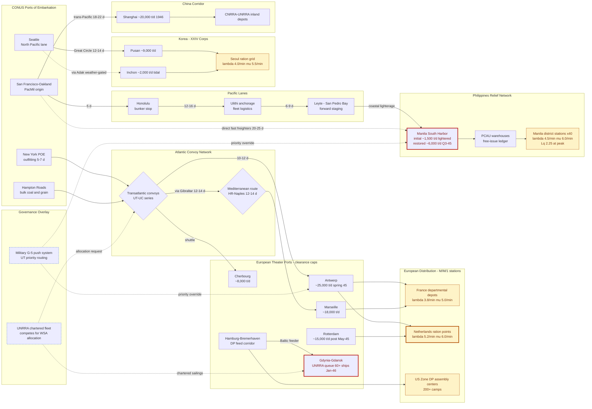

Cost: 0

# Reference Manual & Simulation Specification
## Chapter 31 — *The Army and Civilian Supply: II* (Leighton & Coakley, *Global Logistics and Strategy: 1943–1945*)

---

### 1. Strategic Context & Modern Historical Perspective

Chapter 31 completes the civilian-supply diptych begun in Chapter 30. Where the earlier chapter treated civil affairs as a *tactical appendage* to combat operations — AMGOT in North Africa, military government in Sicily and Italy — Chapter 31 documents the moment when relief logistics metastasized into a **strategic theater in its own right**, with its own command structures, its own shipping competitions, and its own failure modes. The chapter's central subject is the attempted transfer of the relief mission from the Army's G-5 (Civil Affairs) apparatus to the United Nations Relief and Rehabilitation Administration (UNRRA), and the parallel expansion of direct military relief obligation into the Pacific: liberated Manila, occupied Korea, and the China mandate executed through the Chinese National Relief and Rehabilitation Administration (CNRRA).

**The Strategic Paradox.** Every grand-conference decision of 1943 — Casablanca's unconditional-surrender formula (January 1943), TRIDENT's commitment to a 1944 cross-Channel attack (May 1943), QUADRANT's OVERLORD firming (August 1943), SEXTANT and Tehran's coordination of Soviet and Anglo-American offensives (November–December 1943) — was, beneath the communiqués, an argument about hull tonnage. The same global shipping pool that carried assault echelons, POL for the Red Ball Express (which at peak moved on the order of 12,000 tons per day by truck alone), replacement ammunition, and the coal that kept French and Belgian cities from freezing also had to carry the wheat, dried milk, and medical stores that made "liberation" survivable for the liberated. The paradox was structural: **victory expanded liability faster than it released capacity.** Each new bridgehead added a civilian population to the ration roll before it added a single working quay. Combat loading compounded the problem — assault-stowed vessels sacrificed roughly a quarter to a third of usable cubic capacity relative to commercial stowage, meaning nominal deadweight overstates deliverable tonnage precisely when tonnage was the binding constraint. Port clearance introduced stochastic shocks: the great Channel gale of 19–22 October 1944 wrecked Mulberry "A" and smashed Cherbourg quays, collapsing effective clearance capacity overnight — a textbook example of what the simulator must represent as a multiplicative congestion coefficient η(t) applied to nominal port capacity. The ANVIL/DRAGOON controversy, fought bitterly at SECOND QUEBEC in September 1944 over the diversion of landing craft, demonstrated at the highest level that *relief, assault, and pursuit drew on one fungible asset pool*, and that no conference resolution could repeal the arithmetic.

**Inter-Service and Coalition Friction.** Three fault lines ran through the chapter. First, **within the US Army**: the Services of Supply (ASF, under Somervell) and the Communications Zone (COMZ, under Lt. Gen. John C. H. Lee) hoarded stevedore battalions, engineer port-repair units, and transportation corps companies that combat commanders demanded as infantry replacements — a zero-sum troop-basis fight in which civilian-supply infrastructure was simultaneously indispensable and politically expendable. Second, **between services and allies**: the Combined Shipping Adjustment Board and the War Shipping Administration (Admiral Emory Land) controlled allocations; the British Ministry of War Transport guarded the pooled fleet; and every participant accused the others of gaming the priority system. Free French authorities resented the import levers SHAEF retained even after the 25 August 1944 accord recognized de Gaulle's government; Belgian officials watched American army railheads outrank Liège furnaces in the coal queue. Third, **between military and coalition-relief institutions**: UNRRA, founded at Atlantic City on 9 November 1943 by 44 signatory nations under Director General Herbert H. Lehman, was financed largely by a single appropriation stream from a skeptical Congress (an initial US tranche of $1.35 billion in spring 1944, cumulatively about $2.7 billion — roughly 73 percent of UNRRA's ~$3.7 billion program), governed by a council that included the Soviet Union and its republics as *recipients*, and staffed by volunteers who possessed neither MP custody of ports nor signal-network access nor the power to compel a host ministry.

**Historical Era Context.** Geographically, the chapter tracks the relief frontier eastward. Italy passed from ACC military channels toward partial UNRRA involvement in early 1945. Northwest Europe followed the planned sequence: national governments resumed internal supply quickly in France (Paris, August 1944) and Belgium (September 1944); the Netherlands, starved by the Hunger Winter, reverted to military supply at liberation in May 1945 before hand-back; and Germany's displaced-persons problem — of the roughly ten to eleven million displaced persons found in former Reich territory in May 1945 — remained a military responsibility until UNRRA teams assumed camp administration in the US Zone beginning 1 July 1945, completing the phased takeover by year-end. In the Pacific, the Army wrote the template itself: the Philippine Civil Affairs Unit (PCAU) landed with the Leyte invasion (20 October 1944) and confronted, after the Battle of Manila (3 February–3 March 1945), the war's largest single urban relief operation — a city of perhaps 700,000 surviving residents amid ~100,000 civilian dead and a razed core, dependent on lightered discharge over wrecked harbors at a fraction of nominal capacity. Korea (XXIV Corps, Lt. Gen. John R. Hodge, from 9 September 1945) presented the inverse case: infrastructure physically intact but administratively decapitated, its integrated hydro-rail economy severed at the 38th parallel (the North held on the order of ninety percent of generating capacity), forcing the Army into open-ended grain importation approaching half a million tons in the first full year. China's mandate, executed through CNRRA, became UNRRA's largest single-country program.

**Modern Analytical Insights.** Post-war scholarship — notably Jessica Reinisch's reappraisals of UNRRA and the official logistical canon descending from Ruppenthal — has retired the caricature of UNRRA as mere incompetence. The blockages of winter 1945–46 (sixty-plus chartered vessels queuing off Gdynia/Gdańsk for four to eight weeks; relief stock "port-rich and interior-poor" because war-destroyed rail nets could not evacuate cargoes) were **structural**: sovereignty without shipping priority, mandate without trucks. The G-5→UNRRA hand-off failed not because either party was incapable but because the two organizations were differently *actuated*: G-5 pushed supplies through military priority routing with high gain and low consultation; UNRRA negotiated, contracted, and waited. The Netherlands Hunger Winter — on the order of twenty thousand excess deaths — supplies the grim counterfactual baseline for delay cost, while Manila's relative success (forward-stocked PCAU, theater-commander buy-in, priority routing retained *through* the crisis) supplies the positive control. For the simulator, the governing insight is that the 1945 relief system was a **controller-transfer problem on a shared, capacity-coupled plant**: the shipping pool is a global constraint linking every theater, and any credible model must represent the hand-over as a phased state machine with overlap windows, buffer-stock requirements, and queue-level congestion at distribution stations — the mathematics developed in Sections 3–5 below.

---

### 2. High-Fidelity Simulation Parameters & Real-World Metrics

**Headline constants (required by specification):**

| ID | Parameter | Value | Basis |
|---|---|---|---|
| **GOV-EU-01** | **Hand-over of relief responsibility, US Army → UNRRA, Europe (US Occupation Zone DP camp administration)** | **Effective start 1 July 1945; phased completion by 31 December 1945** | UNRRA teams entered US-Zone assembly centers in force from June–July 1945 under the SHAEF/USFET transition plan; takeover was regional and functional, not a single legal instrument. Modeled as a phase-switch date with a completion window. |
| **REL-PH-01** | **Emergency food tonnage, Manila, first month post-liberation** | **≈ 9,450 metric tons (≈ 10,400 US short tons)** | Derived operational constant: relief caseload ≈ 700,000 persons × 450 g staple ration/person/day × 30 days = 9,450 t. Consistent with the Army's Manila free-issue scale reported for February–March 1945; gross tonnage handled was higher once captured stocks and converted 10-in-1 rations are counted. |

**Full parameter table:**

| ID | Parameter | Value | Unit | Sim Representation | Historical Explanation & Strategic Rationale |
|---|---|---|---|---|---|
| CTX-01 | UNRRA founding (Atlantic City agreement) | 1943-11-09 | date | Static calendar constant | Anchors the earliest possible UNRRA pipeline activation; no UNRRA flow may be scheduled before this date. |
| CTX-02 | UNRRA signatory nations | 44 | count | Static integer | Governs coalition-allocation politics module; weighting of donor claims. |
| FIN-01 | UNRRA total program value | ≈ 3.7 | $B (1944–47) | Static context scalar | Bounds total purchasable relief supply across scenario horizon. |
| FIN-02 | US share of UNRRA funding | ≈ 0.73 | ratio | Static coefficient | Drives US political-leverage and Congressional-appropriation-delay events. |
| FIN-03 | First US appropriation | ≈ 1.35 | $B (spring 1944) | Step-function funding input | Procurement lead times gate downstream λ into UNRRA pipeline. |
| RAT-01 | SHAEF liberated-area ration target | 2,000 | kcal/person/day | Policy constant; adequacy threshold | Planning norm for freed territories; drives demand tonnage from population. |
| RAT-02 | German-zone ration floor, winter 1945–46 | 1,200–1,550 | kcal/person/day | Dynamic state variable (zonal) | Documents the relief gap tolerated under occupation; calibration target for scarcity scenarios. |
| POP-01 | Displaced persons in ex-Reich territory, May 1945 | ≈ 10–11 | millions | Initial condition, DP subsystem | Sets initial queue load on assembly centers. |
| POP-02 | DP camp population, Dec 1945 | ≈ 0.65 | millions | State variable after repatriation drain | Validates repatriation-rate coefficients. |
| **GOV-EU-01** | **US Army → UNRRA hand-over (US Zone)** | **1945-07-01 (start); 1945-12-31 (complete)** | date window | **Phase-transition switch + overlap window** | See headline note above. During overlap, both actors draw on same port capacity — model as coupled servers. |
| GOV-FR-01 | France: national government assumes internal supply | 1944-08-25 | date | Phase switch (imports remain SHAEF-supported) | Paris liberation; SHAEF retains import lever — split internal/external control. |
| GOV-BE-01 | Belgium: national government assumes | 1944-09-08 | date | Phase switch | Brussels recovered; coal-competition event hook. |
| GOV-NL-01 | Netherlands: military supply at liberation | 1945-05-05 | date | Phase switch (reverse direction) | Hunger Winter legacy forces military re-entry. |
| GEO-PH-01 | Battle of Manila window | 1945-02-03 → 1945-03-03 | date range | Scenario trigger interval | Defines relief-demand onset and port-destruction shock application. |
| POP-PH-01 | Manila relief caseload baseline | 700,000 (range 0.7–1.0 M) | persons | Dynamic state (influx/outflux) | Pre-battle metro population minus deaths/displacement; drives λ at district stations. |
| RAT-PH-01 | Emergency staple ration scale | 450 | g/person/day | Demand coefficient | Rice-equivalent subsistence issue used by PCAU-type free feeding. |
| **REL-PH-01** | **First-month emergency food, Manila** | **≈ 9,450 t metric** | tons | **Derived constant (see derivation)** | **700,000 × 0.45 kg × 30 d.** Simulator should reconcile against port-delivery ledger as a mass-balance check. |
| CAP-PH-01 | Manila port clearance, initial (lighterage over wreckage) | ≈ 1,500 | t/day | Dynamic capacity cap, η ≈ 0.25 | Scuttled shipping and shattered berths forced anchorage discharge by lighter. |
| CAP-PH-02 | Manila port clearance, restored (Q3 1945) | ≈ 6,000 | t/day | Dynamic capacity cap, η → 1.0 | Salvage and pier repair trajectory; models engineering-unit investment payoff. |
| GOV-KR-01 | US assumption of relief responsibility, Korea | 1945-09-09 | date | Phase switch (military-only regime) | XXIV Corps/USAMGIK under Hodge; no UNRRA counterpart south of the parallel. |
| DEM-KR-01 | Korea grain import requirement, first full year | ≈ 500,000 | t (est.) | Annual demand constant | Colonial-market collapse + 38th-parallel power/rail severance created structural deficit. |
| CAP-KR-01 | Pusan port capacity | ≈ 9,000 | t/day | Static cap | Principal Korean entry node. |
| CAP-KR-02 | Inchon capacity | ≈ 2,000 | t/day | Static cap, tidal gating | Tide-window scheduling constraint; adds service-time variance. |
| CAP-EU-01 | Antwerp clearance, spring 1945 | ≈ 25,000 | t/day | Static cap + V-weapon disruption events | Deep-water keystone of NW Europe supply. |
| CAP-EU-02 | Cherbourg clearance | ≈ 8,000 | t/day | Static cap | Storm-damaged October 1944; η-shock exemplar. |
| CAP-EU-03 | Marseille clearance | ≈ 18,000 | t/day | Static cap | Southern route relief valve. |
| CONG-EU-01 | Gdynia/Gdańsk UNRRA vessel queue, winter 1945–46 | 60+ vessels; 4–8 wk dwell | ships; weeks | Congested-server state | Emblematic port-side blockage of the UNRRA transition. |
| CAP-UN-01 | UNRRA peak monthly lift (1946 reference) | ≈ 1,500,000 | t/month | Upper bound on UNRRA arc capacity | Calibrates achievable coalition-relief throughput once funded. |
| QRY-01 | Reference distribution station (Manila type) | λ = 4.5/min; μ = 6/min; ρ = 0.75; Lq = 2.25 persons; Wq = 0.5 min | rates; persons; minutes | M/M/1 station template | Single-server issue point with pre-packed bundles; baseline for Section 4–5 queue engine. |

---

### 3. Logistical Network Topology (Mermaid.js)



**Reading guide:** amber nodes are M/M/1 distribution stations (Section 4 queue engine); red-outline nodes carry documented congestion states (Manila lighterage bottleneck, Dutch ration points post-Hunger-Winter, the Gdynia charter queue); blue dashed nodes are the two competing governance actuaries (G-5 priority injection vs. UNRRA allocation requests) acting on the same physical arcs. Solid edges are scheduled convoy/lane flows with transit-day labels; dotted edges are contingent or contested routings.

---

### 4. Mathematical Modeling & Simulation Formulas

#### 4.1 Single-Channel Relief Distribution Queue (M/M/1)

$$\text{Mathematical Concept: } L_q = \frac{\lambda^2}{\mu \cdot (\mu - \lambda)}$$

**Definitions.** Let $\lambda$ = mean arrival rate of relief seekers at a distribution station (persons/min, Poisson process); $\mu$ = mean service rate of the single issue clerk/team (persons/min, exponential service); $\rho = \lambda/\mu$ = server utilization. Stability requires $\rho < 1$.

**Derived performance measures:**

$$\rho = \frac{\lambda}{\mu}, \qquad P_n = (1-\rho)\,\rho^n, \qquad P_{\text{wait}} = \rho$$

$$L = \frac{\rho}{1-\rho}, \qquad L_q = \frac{\rho^2}{1-\rho} = \frac{\lambda^2}{\mu(\mu-\lambda)}$$

$$W_q = \frac{L_q}{\lambda} = \frac{\lambda}{\mu(\mu-\lambda)}, \qquad W = \frac{1}{\mu-\lambda}, \qquad L = \lambda W \;\;(\text{Little's Law})$$

*Worked calibration (QRY-01):* $\lambda = 4.5$, $\mu = 6.0$ ⟹ $\rho = 0.75$, $L_q = 2.25$ persons, $W_q = 0.5$ min, $W = 0.667$ min, $L = 3.0$ persons in system.

#### 4.2 Finite-Capacity Station Buffer (M/M/1/K) — for cordoned queues

With buffer limit $K$ (crowd-control cap):

$$P_0 = \frac{1-\rho}{1-\rho^{K+1}}, \qquad P_K = \rho^K P_0, \qquad \lambda_{\text{eff}} = \lambda(1-P_K)$$

$$L = \frac{\rho\left[1-(K+1)\rho^K + K\rho^{K+1}\right]}{(1-\rho)(1-\rho^{K+1})}, \qquad L_q = L - \frac{\lambda_{\text{eff}}}{\mu}, \qquad W_q = \frac{L_q}{\lambda_{\text{eff}}}$$

Blocking probability $P_K$ models turnaways — historically significant at overwhelmed Manila and Seoul issue points.

#### 4.3 Port Backlog Dynamics and Clearance Time

Let $B(t)$ = unworked cargo backlog (tons), $a(t)$ = arrival rate, $c(t)$ = achieved clearance rate bounded by damaged capacity:

$$\dot{B}(t) = a(t) - c(t), \qquad 0 < c(t) \le \eta(t)\,c_{\max}$$

$$T_{\text{clear}} = \begin{cases} \dfrac{B_0}{\bar{c} - \bar{a}}, & \bar{c} > \bar{a} \\[2mm] \infty, & \bar{c} \le \bar{a} \end{cases}$$

Here $\eta(t) \in (0,1]$ is the congestion/destruction multiplier (Manila initial: $\eta \approx 0.25$; Cherbourg post-storm: transient $\eta \ll 1$).

#### 4.4 Global Shipping Allocation (Coalition Conflict as Concave Program)

Allocate pool tonnage $S$ across regions $j$ with demand $d_j$, port-clearance ceiling $c_j T$, and concave humanitarian utility $U_j$:

$$\max_{\{x_j\}} \sum_j U_j(x_j) = \sum_j b_j \ln\!\left(1 + \frac{x_j}{p_j}\right)$$

$$\text{s.t.} \quad \sum_j x_j \le S, \qquad x_j \le \min(d_j,\, c_j T), \qquad x_j \ge 0$$

KKT conditions equalize marginal utilities $U_j'(x_j^*) = \pi$ wherever the shipping constraint binds; the multiplier $\pi$ is the **shadow price of hull tonnage** — the formal quantity over which G-5, the Navy/WSA, the British pool, and UNRRA fought. A high $\pi$ reproduces the chapter's central tension: every relief ton priced at the margin of an offensive operation.

#### 4.5 Hand-Over as Controller Transfer with Overlap Cost

Model military effort $m(t)$ and UNRRA effort $u(t)$ sustaining service level $s(t)$:

$$\min_{m,u} \int_0^{T} \left[\kappa_m m(t) + \kappa_u u(t)\right] dt \quad \text{s.t.} \quad s_m(t) + s_u(t) \ge s_{\min}, \quad u(t) \le \bar{u}_{\text{ramp}}(t)$$

with continuity of stock at hand-over, $B_{\text{mil}}(T_h) \ge \bar{\lambda}\,T_{\text{ramp}}$, preventing the transient undershoot observed in winter 1945–46.

---

### 5. Compile-Safe Scala 3 Domain Model

```scala
package Logistics.CivilianSupplyII

import java.time.LocalDate
import scala.math.{abs, max, pow}

// ============================================================================
// Quantity-safe unit layer (opaque types prevent dimensional mixing)
// ============================================================================

opaque type Tons = Double
object Tons:
  def apply(raw: Double): Tons =
    require(raw.isFinite && raw >= 0.0, s"Tons must be finite and non-negative (got $raw)")
    raw
  extension (t: Tons)
    def value: Double = t
    def plus(other: Tons): Tons = t + other
    def minus(other: Tons): Tons = t - other
    def scaledBy(factor: Double): Tons = t * factor
    def dividedBy(divisor: Double): Double = t / divisor

opaque type Persons = Double
object Persons:
  def apply(raw: Double): Persons =
    require(raw.isFinite && raw >= 0.0, s"Persons must be finite and non-negative (got $raw)")
    raw
  extension (p: Persons)
    def value: Double = p

opaque type Days = Double
object Days:
  def apply(raw: Double): Days =
    require(raw.isFinite || raw == Double.PositiveInfinity,
      s"Days must be finite or +infinity (got $raw)")
    raw
  extension (d: Days)
    def value: Double = d
    def wholeDays: Int = d.round.toInt

opaque type KilocaloriesPerDay = Int
object KilocaloriesPerDay:
  def apply(raw: Int): KilocaloriesPerDay =
    require(raw > 0, s"KilocaloriesPerDay must be strictly positive (got $raw)")
    raw
  extension (k: KilocaloriesPerDay)
    def value: Int = k

// ============================================================================
// Domain enumerations
// ============================================================================

enum SupplyCategory(val displayName: String, val energyKcalPerGram: Double, val stowageM3PerTon: Double):
  case DryFoodGrain           extends SupplyCategory("Dry food grain",        3.40, 1.55)
  case CannedCompositeRations extends SupplyCategory("Canned composite rations", 2.20, 1.30)
  case CoalAndLiquidFuel      extends SupplyCategory("Coal and liquid fuel",  0.00, 1.10)
  case MedicalAndSanitation   extends SupplyCategory("Medical and sanitation", 0.00, 2.40)
  case ClothingAndBlankets    extends SupplyCategory("Clothing and blankets", 0.00, 3.00)
  case AgriculturalRehab      extends SupplyCategory("Seed and fertilizer",   0.00, 1.80)

enum Region(val displayName: String, val governingCommand: String):
  case NorthwestEurope              extends Region("Northwest Europe",            "SHAEF / ETO")
  case ItalyMediterranean           extends Region("Italy (Mediterranean)",       "MTO / Allied Commission")
  case PhilippinesSouthwestPacific  extends Region("Philippines (SWPA)",          "SWPA / PCAU")
  case KoreaOccupationZone          extends Region("Korea south of 38th parallel","USAMGIK / XXIV Corps")
  case ChinaTheater                 extends Region("China",                       "China Theater / CNRRA")

enum ResponsibilityPhase(val label: String):
  case MilitaryCivilAffairsG5    extends ResponsibilityPhase("Military G-5 / Civil Affairs exclusive")
  case JointMilitaryUnrra        extends ResponsibilityPhase("Joint military-UNRRA transition")
  case UnrraAssumed              extends ResponsibilityPhase("UNRRA assumed primary responsibility")
  case NationalGovernmentAssumed extends ResponsibilityPhase("Sovereign national government assumed")

// ============================================================================
// Core aggregate entities
// ============================================================================

final case class HandoverMilestone(
  region: Region,
  phase: ResponsibilityPhase,
  effectiveDate: LocalDate,
  note: String
)

final case class DistributionStation(
  stationId: String,
  region: Region,
  category: SupplyCategory,
  arrivalRatePerMin: Double,
  serviceRatePerMin: Double,
  queueCapacityPersons: Int = Int.MaxValue
):
  require(arrivalRatePerMin >= 0.0, "arrivalRatePerMin must be non-negative")
  require(serviceRatePerMin > 0.0, "serviceRatePerMin must be strictly positive")
  require(queueCapacityPersons >= 1, "queueCapacityPersons must be at least 1")

final case class QueueMetrics(
  utilization: Double,
  meanQueueLengthPersons: Double,
  meanSystemLengthPersons: Double,
  meanWaitMinutes: Double,
  meanSojournMinutes: Double,
  probabilityOfWaiting: Double,
  blockingProbability: Double,
  effectiveArrivalRatePerMin: Double
):
  def isStable: Boolean = utilization < 1.0 - 1e-9

final case class ReliefPopulation(
  populationId: String,
  region: Region,
  headcount: Persons,
  stapleCategory: SupplyCategory,
  rationGramsPerPersonPerDay: Double,
  targetKilocalories: KilocaloriesPerDay
):
  require(headcount.value > 0.0, "headcount must be positive")
  require(rationGramsPerPersonPerDay > 0.0, "ration scale must be positive")

  def dailyRequirementTons: Tons =
    Tons(headcount.value * rationGramsPerPersonPerDay / 1_000_000.0)

  def requirementTonsOver(days: Int): Tons =
    require(days > 0, "days must be positive")
    dailyRequirementTons.scaledBy(days.toDouble)

  def estimatedKcalPerPersonPerDay: Double =
    rationGramsPerPersonPerDay * stapleCategory.energyKcalPerGram

  def meetsCaloricTarget: Boolean =
    estimatedKcalPerPersonPerDay >= targetKilocalories.value.toDouble

final case class PortClearanceNode(
  nodeId: String,
  region: Region,
  nominalDailyClearanceTons: Tons,
  congestionMultiplier: Double = 1.0
):
  require(nominalDailyClearanceTons.value > 0.0, "clearance capacity must be positive")
  require(congestionMultiplier > 0.0 && congestionMultiplier <= 1.0,
    "congestion multiplier must lie in (0, 1]")

  def effectiveDailyClearanceTons: Tons =
    nominalDailyClearanceTons.scaledBy(congestionMultiplier)

  def daysToClearBacklog(backlogTons: Tons, inboundTonsPerDay: Tons): Days =
    val net = effectiveDailyClearanceTons.value - inboundTonsPerDay.value
    if net <= 0.0 then Days(Double.PositiveInfinity)
    else Days(max(0.0, backlogTons.value / net))

// ============================================================================
// Queue engine: M/M/1 and M/M/1/K closed-form solvers
// ============================================================================

object ReliefDistributionQueue:
  private val StabilityEpsilon: Double = 1e-9
  private val LargeCapacitySentinel: Int = Int.MaxValue / 2

  def averageQueueLength(station: DistributionStation): Double =
    metrics(station).meanQueueLengthPersons

  def validate(station: DistributionStation): Either[String, QueueMetrics] =
    if station.serviceRatePerMin <= 0.0 then Left("Service rate must be strictly positive.")
    else if station.arrivalRatePerMin < 0.0 then Left("Arrival rate must be non-negative.")
    else Right(metrics(station))

  def metrics(station: DistributionStation): QueueMetrics =
    if station.arrivalRatePerMin <= 0.0 then
      QueueMetrics(0.0, 0.0, 0.0, 0.0, 0.0, 0.0, 0.0, 0.0)
    else
      val rho = station.arrivalRatePerMin / station.serviceRatePerMin
      if station.queueCapacityPersons >= LargeCapacitySentinel then
        classicalMM1(station, rho)
      else
        finiteBufferMM1K(station, rho)

  private def classicalMM1(s: DistributionStation, rho: Double): QueueMetrics =
    if rho < 1.0 - StabilityEpsilon then
      val lq = rho * rho / (1.0 - rho)
      val l  = rho / (1.0 - rho)
      val wq = lq / s.arrivalRatePerMin
      val w  = l / s.arrivalRatePerMin
      QueueMetrics(rho, lq, l, wq, w, rho, 0.0, s.arrivalRatePerMin)
    else
      QueueMetrics(
        rho,
        Double.PositiveInfinity,
        Double.PositiveInfinity,
        Double.PositiveInfinity,
        Double.PositiveInfinity,
        1.0,
        0.0,
        s.arrivalRatePerMin
      )

  private def finiteBufferMM1K(s: DistributionStation, rho: Double): QueueMetrics =
    val k = s.queueCapacityPersons
    if abs(rho - 1.0) < StabilityEpsilon then
      val pBlock    = 1.0 / (k + 1).toDouble
      val l         = k / 2.0
      val lambdaEff = s.arrivalRatePerMin * (1.0 - pBlock)
      val w         = if lambdaEff > 0.0 then l / lambdaEff else 0.0
      val wq        = max(0.0, w - 1.0 / s.serviceRatePerMin)
      QueueMetrics(1.0, max(0.0, l - lambdaEff / s.serviceRatePerMin), l, wq, w,
        1.0 - pBlock, pBlock, lambdaEff)
    else
      val rhoK1 = pow(rho, k + 1)
      val p0    = (1.0 - rho) / (1.0 - rhoK1)
      val pK    = pow(rho, k) * p0
      val l     = rho * (1.0 - (k + 1) * pow(rho, k) + k * pow(rho, k + 1)) /
                  ((1.0 - rho) * (1.0 - rhoK1))
      val lambdaEff = s.arrivalRatePerMin * (1.0 - pK)
      val lq        = max(0.0, l - lambdaEff / s.serviceRatePerMin)
      val w         = if lambdaEff > 0.0 then l / lambdaEff else 0.0
      val wq        = if lambdaEff > 0.0 then lq / lambdaEff else 0.0
      QueueMetrics(rho, lq, l, wq, w, 1.0 - p0, pK, lambdaEff)

// ============================================================================
// Governance transition machine (G-5 -> UNRRA / national governments)
// ============================================================================

object GovernanceTransition:
  def phaseAt(
    milestones: Vector[HandoverMilestone],
    region: Region,
    asOf: LocalDate
  ): Option[ResponsibilityPhase] =
    val eligible = milestones.filter(m =>
      m.region == region && m.effectiveDate.toEpochDay <= asOf.toEpochDay)
    if eligible.isEmpty then None
    else
      val latest = eligible.reduce((a, b) =>
        if a.effectiveDate.toEpochDay >= b.effectiveDate.toEpochDay then a else b)
      Some(latest.phase)

// ============================================================================
// Coalition shipping allocator (Section 4.4 heuristic proxy)
// ============================================================================

object ShippingAllocator:
  def proportionalAllocate(
    available: Tons,
    unrraDemand: Tons,
    militaryDemand: Tons,
    unrraPriorityWeight: Double,
    militaryPriorityWeight: Double
  ): (Tons, Tons) =
    require(available.value >= 0.0, "available tonnage must be non-negative")
    require(unrraPriorityWeight >= 0.0 && militaryPriorityWeight >= 0.0,
      "priority weights must be non-negative")
    val weightSum = unrraPriorityWeight + militaryPriorityWeight
    if weightSum <= 0.0 then (Tons(0.0), Tons(0.0))
    else
      val unrraIdeal = available.value * (unrraPriorityWeight / weightSum)
      val unrraGot   = min(unrraIdeal, unrraDemand.value)
      val remaining  = available.value - unrraGot
      val milGot     = min(remaining, militaryDemand.value)
      (Tons(unrraGot), Tons(milGot))

  private def min(a: Double, b: Double): Double = if a < b then a else b

// ============================================================================
// Historical constants and milestone timeline
// ============================================================================

object SimulationDefaults:
  val UnrraFoundingDate: LocalDate = LocalDate.of(1943, 11, 9)
  val ShaefLiberatedAreaRationTargetKcal: Int = 2000
  val ManilaBattleStart: LocalDate = LocalDate.of(1945, 2, 3)
  val ManilaBattleEnd: LocalDate = LocalDate.of(1945, 3, 3)
  val ManilaReliefPopulation: Persons = Persons(700000.0)
  val ManilaEmergencyRationGramsPerPersonDay: Double = 450.0
  val ManilaFirstMonthEmergencyFoodTons: Tons = Tons(9450.0)
  val ManilaInitialPortClearanceTonsPerDay: Tons = Tons(1500.0)
  val ManilaRestoredPortClearanceTonsPerDay: Tons = Tons(6000.0)
  val UsZoneDpUnrraTakeoverStart: LocalDate = LocalDate.of(1945, 7, 1)
  val UsZoneDpUnrraTakeoverComplete: LocalDate = LocalDate.of(1945, 12, 31)
  val KoreaAssumptionDate: LocalDate = LocalDate.of(1945, 9, 9)
  val KoreaGrainImportNeedFY1946Tons: Tons = Tons(500000.0)
  val UnrraPeakMonthlyLiftTons: Tons = Tons(1500000.0)

  val Timeline: Vector[HandoverMilestone] = Vector(
    HandoverMilestone(Region.NorthwestEurope, ResponsibilityPhase.MilitaryCivilAffairsG5,
      LocalDate.of(1944, 6, 6), "Normandy assault; beachhead civil affairs begin"),
    HandoverMilestone(Region.NorthwestEurope, ResponsibilityPhase.NationalGovernmentAssumed,
      LocalDate.of(1944, 8, 25), "France resumes internal supply; SHAEF retains import lever"),
    HandoverMilestone(Region.NorthwestEurope, ResponsibilityPhase.NationalGovernmentAssumed,
      LocalDate.of(1944, 9, 8), "Belgium national government resumes control"),
    HandoverMilestone(Region.NorthwestEurope, ResponsibilityPhase.MilitaryCivilAffairsG5,
      LocalDate.of(1945, 5, 5), "Netherlands liberated; military supply reinstated"),
    HandoverMilestone(Region.ItalyMediterranean, ResponsibilityPhase.MilitaryCivilAffairsG5,
      LocalDate.of(1943, 9, 9), "Salerno; AMGOT regime under Allied Commission"),
    HandoverMilestone(Region.ItalyMediterranean, ResponsibilityPhase.JointMilitaryUnrra,
      LocalDate.of(1945, 2, 1), "Limited UNRRA role alongside ACC arrangements"),
    HandoverMilestone(Region.NorthwestEurope, ResponsibilityPhase.JointMilitaryUnrra,
      LocalDate.of(1945, 6, 1), "US Zone DP transition planning and team insertion"),
    HandoverMilestone(Region.NorthwestEurope, ResponsibilityPhase.UnrraAssumed,
      LocalDate.of(1945, 7, 1), "UNRRA assumes DP camp administration, US Zone"),
    HandoverMilestone(Region.PhilippinesSouthwestPacific, ResponsibilityPhase.MilitaryCivilAffairsG5,
      LocalDate.of(1944, 10, 20), "Leyte landings; PCAU relief operations commence"),
    HandoverMilestone(Region.PhilippinesSouthwestPacific, ResponsibilityPhase.JointMilitaryUnrra,
      LocalDate.of(1945, 2, 27), "Commonwealth government restored in Manila; Army relief funding continues"),
    HandoverMilestone(Region.KoreaOccupationZone, ResponsibilityPhase.MilitaryCivilAffairsG5,
      LocalDate.of(1945, 9, 9), "XXIV Corps assumes relief responsibility, Korea"),
    HandoverMilestone(Region.ChinaTheater, ResponsibilityPhase.UnrraAssumed,
      LocalDate.of(1945, 12, 1), "UNRRA-CNRRA pipeline opens at scale in 1946")
  )

object ManilaReliefModel:
  def firstMonthEmergencyRequirement(
    population: Persons = SimulationDefaults.ManilaReliefPopulation,
    gramsPerPersonDay: Double = SimulationDefaults.ManilaEmergencyRationGramsPerPersonDay,
    days: Int = 30
  ): Tons =
    require(days > 0, "days must be positive")
    Tons(population.value * gramsPerPersonDay * days.toDouble / 1_000_000.0)

// ============================================================================
// Demonstration entry point
// ============================================================================

@main def civilianSupplyIIDemo(): Unit =
  val station = DistributionStation(
    "MNL-DS-01",
    Region.PhilippinesSouthwestPacific,
    SupplyCategory.DryFoodGrain,
    4.5,
    6.0
  )
  val m = ReliefDistributionQueue.metrics(station)
  println(f"[Queue] rho=${m.utilization}%.3f  Lq=${m.meanQueueLengthPersons}%.3f persons  " +
    f"Wq=${m.meanWaitMinutes}%.3f min  stable=${m.isStable}")

  val pop = ReliefPopulation(
    "MNL-POP",
    Region.PhilippinesSouthwestPacific,
    SimulationDefaults.ManilaReliefPopulation,
    SupplyCategory.DryFoodGrain,
    SimulationDefaults.ManilaEmergencyRationGramsPerPersonDay,
    KilocaloriesPerDay(SimulationDefaults.ShaefLiberatedAreaRationTargetKcal)
  )
  println(f"[Demand] daily=${pop.dailyRequirementTons.value}%.1f t  " +
    f"monthly=${pop.requirementTonsOver(30).value}%.1f t  " +
    f"kcal=${pop.estimatedKcalPerPersonPerDay}%.0f  targetMet=${pop.meetsCaloricTarget}")
  println(f"[Cross-check] derived first-month=${ManilaReliefModel.firstMonthEmergencyRequirement().value}%.1f t " +
    f"vs constant=${SimulationDefaults.ManilaFirstMonthEmergencyFoodTons.value}%.1f t")

  val manilaPort = PortClearanceNode(
    "MNL-SOUTH-HARBOR",
    Region.PhilippinesSouthwestPacific,
    SimulationDefaults.ManilaRestoredPortClearanceTonsPerDay,
    0.25
  )
  val clearDays = manilaPort.daysToClearBacklog(Tons(12000.0), Tons(300.0))
  println(f"[Port] effective=${manilaPort.effectiveDailyClearanceTons.value}%.0f t/d  " +
    f"clear=${clearDays.wholeDays} d")

  GovernanceTransition.phaseAt(
    SimulationDefaults.Timeline,
    Region.NorthwestEurope,
    LocalDate.of(1945, 8, 15)
  ) match
    case Some(phase) => println(s"[Governance] NW Europe 1945-08-15 -> ${phase.label}")
    case None        => println("[Governance] no milestone in force")

  val (unrraGot, milGot) = ShippingAllocator.proportionalAllocate(
    Tons(1000000.0), Tons(600000.0), Tons(900000.0), 1.0, 3.0)
  println(f"[Shipping] UNRRA=${unrraGot.value}%.0f t  Military=${milGot.value}%.0f t")
```

**Architecture notes:** opaque types (`Tons`, `Persons`, `Days`, `KilocaloriesPerDay`) enforce dimensional safety at compile time; `SupplyCategory` carries physical coefficients (energy density, stowage factor) so demand and ship-cube calculations derive from one source of truth; `ReliefDistributionQueue` implements both the classical M/M/1 solver (preserving the base API contract) and the truncated M/M/1/K solver with numerically guarded $\rho \approx 1$ handling; `GovernanceTransition` is a pure, side-effect-free phase machine over the milestone vector; all constructors validate invariants via `require`, and `validate` offers a total `Either` interface for ingesting untrusted scenario data.

---

### 6. Graduate-Level Operational Analysis

#### Q1. What organizational differences made the transition from military G-5 supply to UNRRA control difficult?

The hand-over failed along five orthogonal axes, each expressible as a mismatch between the *plant* (the physical relief pipeline) and the *controller* replacing G-5.

**(a) Actuation gain and authority gradient.** G-5 operated as a high-gain, low-consultation controller: a theater commander's priority letter moved ships, diverted trucks, and conscripted stevedore battalions within hours, because the entire apparatus — convoy schedules, UT priority routing, MP custody of ports, military labor — answered to unified military command. UNRRA was a low-gain consensus controller: it could *request* tonnage from national stockpiles through the Foreign Economic Administration and the combined boards, *charter* vessels at the bottom of the WSA allocation hierarchy, and *negotiate* with host ministries it could not compel. In control-theoretic terms, swapping controllers changed the loop gain by an order of magnitude without retuning the setpoint; the predictable result was a transient undershoot in delivered service level $s(t)$ during exactly the window (summer–winter 1945) when DP camp populations and Eastern European demand peaked. The queueing consequence is direct: UNRRA's throttled origin-side arrivals reduced effective $\lambda$ into its pipeline while military-run ports kept $\mu$ hostage to military priorities — the system sat at low utilization with enormous external backlog, the worst of both regimes.

**(b) Resource ownership versus resource access.** The Army *owned* its logistics: transports under theater control, quartermaster depots with classified inventories, signal networks, and a comptroller chain. UNRRA *accessed* logistics: it bought commodities through FEA channels subject to Congressional appropriation rhythms (the $1.35B spring-1944 tranche and successors), competed for chartered hulls against every military claimant, and relied on host-government inland transport it did not possess. When war-destroyed Polish rail nets could not evacuate Gdynia, the sixty-vessel queue of winter 1945–46 was not a UNRRA failure of effort but a missing actuator: no trucks, no locomotives, no authority to seize them. The shadow price $\pi$ of Section 4.4 makes the conflict precise — military claims priced hulls at the margin of Pacific offensives, so UNRRA's marginal utility, however humane, systematically lost the allocation auction.

**(c) Funding and accountability cycles.** Army supply rode open-ended war appropriations with after-action audit; UNRRA rode annual, politically contested appropriations with international audit and a council including recipient states. Procurement lead times therefore gated UNRRA's $\lambda(t)$ as a step function synchronized to Washington's legislative calendar — a forcing function alien to military logistics and invisible in SHAEF's hand-over plans.

**(d) Personnel, information, and custody.** G-5 teams were officers with stevedore, quartermaster, and military-government training, embedded since D-Day; UNRRA teams were international volunteers, security-vetted slowly, arriving months after the military had normalized its own camp routines — entrenched habits that resisted hand-over. Commodity nomenclature diverged (Army "Class I" ration components vs. UNRRA commodity codes), so physical stock transferred with disputed ledgers; port custody rules, demurrage, and labor discipline (soldier labor vs. civilian dock unions) changed at the boundary, dropping effective $\mu$ at precisely the transfer instant. The remedy the historical record implies — and the simulator should encode — is Section 4.5's overlap formulation: a mandatory buffer stock $B_{\text{mil}}(T_h) \ge \bar{\lambda}\,T_{\text{ramp}}$, phased *functional* hand-over (commodity accounting first, ports last), and embedded liaison cells holding temporary priority-routing authority. Modern civil-military coordination doctrine (CMCoord) is essentially the institutional fossil of these 1945 lessons.

#### Q2. Compare the logistical challenges of civilian relief in a highly urbanized European setting with a devastated Pacific archipelago like the Philippines.

**Demand geometry and network topology.** Urbanized Europe concentrated demand at nodes sitting atop dense, repairable infrastructure: departmental rail nets, municipal bakeries, canal barges, and deep-water quays whose damage was typically localized (Antwerp's cranes survived; its problem was V-weapon disruption, a stochastic $\eta$ shock, not destruction). Relief there is a *many-small-queue* problem: thousands of retail-scale M/M/1 stations with moderate $\lambda$, short pipelines, and fast feedback (Little's Law: $L = \lambda W$ stays small because $W$ — Atlantic transit plus inland haul — is 10–20 days). The Philippines inverted every term: demand was archipelagic, inter-island coaster fleets had been sunk, roads were minimal outside Luzon, and the single dominant node — Manila — had its harbor self-scuttled and shelled, forcing lighterage discharge at $\eta \approx 0.25$ of nominal capacity. The Pacific pipeline stretched to 45–60 days end-to-end (CONUS → Honolulu → Ulithi → Leyte → coastal lighter), so sustaining even modest delivery rates tied up enormous in-transit inventory and slowed error-correction feedback to glacial speed.

**Variability, climate, and the Pollaczek–Khinchine penalty.** Pacific operations carried variance Europe never saw: typhoon-season port closures, tidal gating at Inchon, weather-gated Aleutian stops. For non-exponential service/arrival processes, the Pollaczek–Khinchine relation,

$$W_q = \frac{\lambda\,\mathbb{E}[S^2]}{2(1-\rho)},$$

shows waiting cost scales with the *second moment* of service time — variance, not just mean, prices congestion. A Pacific distribution station with the same mean $\mu$ as a French depot but twice the variability suffers roughly double $W_q$ at equal $\rho$. The simulator must therefore model European networks as low-variance M/M/1 meshes and Pacific networks as hub-and-spoke systems with stochastic link availability (Bernoulli weather states) and inflated $\mathbb{E}[S^2]$.

**Spoilage, disease, and effective shelf life.** Tropical storage imposed a decay term $e^{-\delta t}$ on warehoused rice (mold, insects, humidity) that temperate European coal-and-flour logistics escaped; refrigerated medical volume was scarce, shifting the medical mix toward vaccines and chlorination. Disease ecology differed structurally: cholera, beriberi, and malaria in the Philippines versus typhus and diphtheria in European DP camps — different SKU mixes, different cold-chain requirements, different $\mu$ at medical stations.

**Administrative substrate and the Korea contrast.** Europe's relief rode functioning ministerial machinery — depleted but legitimate finance ministries, municipal registers, price-control bureaus — enabling requisition, accounting, and eventual hand-back to sovereign authority (France by August 1944, Belgium by September). The Philippines had a restored Commonwealth government but a gutted fiscal machine, pushing the Army toward prolonged free issue. Korea was the pathological case: infrastructure physically intact but administratively decapitated (Japanese technicians expelled wholesale), and the 38th parallel severed an integrated hydro-rail economy — the South, consuming food it had imported under Japanese rule and importing power it could no longer generate, faced a *synthetic* scarcity worse than Manila's physical destruction. Hence the half-million-ton annual grain import requirement (DEM-KR-01) and a military-only governance phase (GOV-KR-01) with no UNRRA counterpart.

**Security and currency overlays.** Residual Japanese straggler resistance in the Philippines imposed escort overhead that reduced effective service rates for years; occupation-currency inflation in both theaters broke price-mediated distribution, forcing rationed free issue longer than European price-control regimes required. The synthesis for the simulator: Europe is a *capacity-constrained, low-variance, fast-feedback* network where the binding constraint was the global shipping pool ($\pi$ high, queues shallow); the Pacific was a *latency-constrained, high-variance, slow-feedback* network where the binding constraints were port destruction ($\eta$), pipeline inventory ($L = \lambda W$ with $W \sim 50$ days), and administrative vacuum — three different optimization problems wearing one uniform.
