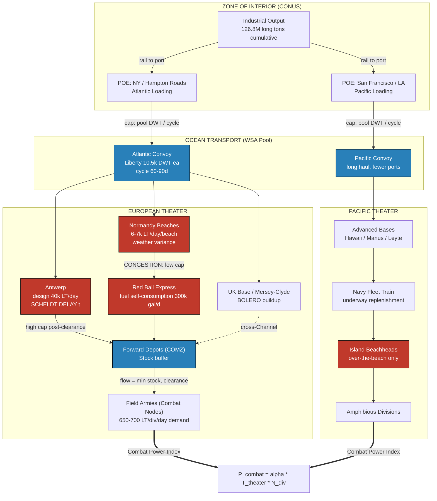

Cost: 0.2833

# CHAPTER 32: LOGISTICS AND STRATEGY IN WORLD WAR II
## Reference Manual & Simulation Specification Document
### US Army Green Book Series — *Global Logistics and Strategy: 1943–1945*

**Classification:** Simulation Design Reference (Unclassified/Declassified Source Synthesis)
**Document Type:** Division-Level Logistics Simulator Core Specification
**Prepared by:** Principal Operations Research Analysis Group

---

## 1. Strategic Context & Modern Historical Perspective

### 1.1 The Strategic Paradox: Strategy Written in Deadweight Tons

The central intellectual thesis of the concluding volume of the Green Book series is that the Allied prosecution of World War II represented the first fully-realized instance of **industrialized coalition warfare**, in which grand strategy was not a free variable set by commanders and politicians, but a dependent variable constrained by a global system of shipping, port throughput, and inland transport capacity. The strategic paradox that recurs across every wartime conference—Casablanca (SYMBOL, January 1943), TRIDENT (Washington, May 1943), QUADRANT (Quebec, August 1943), and SEXTANT (Cairo, November–December 1943)—was the persistent divergence between the *declared* strategic ambition of the Combined Chiefs of Staff (CCS) and the *measured* carrying capacity of the Allied logistical pipeline.

The paradox may be stated formally: strategic plans were expressed in terms of **objectives and timelines** (divisions ashore by D-Day, the strategic bombing tonnage against the Reich, the trans-Pacific island-hopping schedule), whereas the physical system that had to realize those plans was governed by **hard capacity constraints**—deadweight shipping tonnage, ship-turnaround cycles, port berth availability, port clearance rates (the rate at which cargo could be evacuated inland from quaysides), and the throughput of over-the-beach discharge where developed ports were absent. At Casablanca, the decision to pursue HUSKY (Sicily) rather than an immediate cross-Channel attack was, in retrospect, less a triumph of British "peripheral strategy" over American "direct approach" doctrine than an acknowledgment that the shipping and landing-craft pool of early 1943 could not yet support a decisive continental lodgment. The landing craft (LST, LCT, LCI) shortage—the single most persistent physical constraint of the European war—dictated that OVERLORD and the concurrent ANVIL/DRAGOON operation could not be simultaneously mounted at their planned scale in the spring of 1944, forcing DRAGOON's postponement to August. This was not a failure of strategic imagination; it was arithmetic.

Modern scholarship, benefiting from the full declassification of the War Shipping Administration (WSA) allocation ledgers and the Army Service Forces (ASF) statistical summaries, confirms that the CCS operated a **shipping-constrained optimization problem** whether or not its members articulated it in those terms. The "tonnage coefficient" of an operation—the deadweight tons required to mount and sustain it per division per month—became the effective currency of strategic debate. An operation could only be authorized once its tonnage requirement had been reconciled against the available pool, net of prior commitments to the Pacific, to Lend-Lease deliveries to the USSR (the Persian Corridor and Arctic convoys), and to the sustainment of theaters already engaged.

### 1.2 Port Clearance as the Binding Constraint

A recurring modern analytical correction to the wartime narrative concerns the identification of the **true binding constraint**. Contemporary planners often framed the problem as a shipping shortage. Post-war operations research, however, demonstrated that at critical junctures the binding constraint shifted downstream from ocean transport to **port clearance and inland distribution**. The paradigmatic case is the "Great Logistical Crisis" of the autumn of 1944 in the European Theater of Operations (ETO). Following the breakout from Normandy and the pursuit across France, combat formations outran their supply lines. The problem was not a shortage of supplies in theater—vast tonnages sat in Normandy dumps—but the inability to *clear* those supplies forward. Antwerp, though captured largely intact in September 1944, remained unusable until the Scheldt estuary was cleared in late November, forcing continued dependence on the distant Normandy beaches and the improvised Red Ball Express truck route, which itself consumed prodigious quantities of the very fuel it was attempting to deliver.

This distinction—between **stock** (tonnage in theater) and **flow** (tonnage delivered to the point of combat)—is the single most important concept for a high-fidelity simulator. A model that treats theater tonnage as instantaneously available to combat formations will systematically overstate combat power. The correct representation embeds a **port-and-transport throughput function** that caps the rate at which theater stock converts to usable combat supply.

### 1.3 Inter-Service and Coalition Tensions

The friction within the Allied logistical system operated along three principal axes.

**First, the SOS/ASF versus Combat Command axis.** The Services of Supply (later the Communications Zone, COMZ, under Lt. Gen. J.C.H. Lee in the ETO) controlled the rear-area pipeline, while field armies controlled combat operations. Lee's COMZ was frequently criticized—both contemporaneously and by modern historians—for its expansive rear-area "tail," its occupation of Paris real estate, and its resistance to forward-pushing supply on the schedule combat commanders demanded. The tension reflected a genuine structural problem: the metrics optimized by the logistician (safe, orderly, sustainable throughput) diverged from the metrics demanded by the operational commander (maximal immediate delivery, accepting risk).

**Second, the Army–Navy axis**, sharpest in the Pacific. The dual-drive strategy (MacArthur's Southwest Pacific Area advance via New Guinea and the Philippines, and Nimitz's Central Pacific drive through the Gilberts, Marshalls, and Marianas) effectively duplicated logistical infrastructure, competing for the same shipping and construction resources. The Navy's control of amphibious shipping and its "fleet train" of underway-replenishment vessels represented a parallel logistical system that the Army's ASF neither controlled nor could easily coordinate with.

**Third, the US–British coalition-pooling axis.** The Combined Shipping Adjustment Board (CSAB) attempted to pool Anglo-American merchant tonnage, but national interests persistently intruded. The British Import Programme—the minimum tonnage required to sustain the UK's civilian economy and war industry—constituted a floor beneath which shipping could not be diverted to military operations without risking British economic collapse. American planners frequently regarded the British import floor as excessive; British planners regarded it as existential. This was a genuine multi-objective optimization with no purely technical solution.

### 1.4 Historical Era Context and the Grand Synthesis

The concluding chapter synthesizes the war's grand logistical lesson: **logistics ceased to be a secondary service of support and became the primary determinant of grand strategy.** The chronology of the war can be read as a logistical build-up curve. The eighteen-month delay between American entry (December 1941) and the first major cross-Channel-scale commitment was fundamentally a period of logistical mobilization—of shipyard output (the Liberty and Victory ship programs), of port development, and of the accumulation of the landing-craft pool. Strategy waited on logistics, not the reverse.

### 1.5 Modern Analytical Insights

The ultimate conclusion of the Green Book series—and the organizing principle of this simulator—is that **modern war is an industrial-logistical system**. The CCS could not execute a strategic maneuver until it had first compiled and verified the maneuver's tonnage coefficients. Logistics was not the servant of strategy; it defined the **outer boundary of strategic feasibility**. Any strategic plan lying inside the feasible region defined by the shipping pool, port throughput, and industrial output could be executed; any plan lying outside it could not, regardless of its operational elegance. This is precisely the structure of a **constrained optimization problem**, and it is the structure our simulator must faithfully reproduce.

---

## 2. High-Fidelity Simulation Parameters & Real-World Metrics

| Parameter | Value | Simulation Representation | Historical Explanation & Strategic Rationale |
|---|---|---|---|
| **Total US Army overseas cargo shipped (whole war)** | **≈ 126.8 million long tons** (dry cargo) | Static cumulative constant; validation ceiling for aggregate model | Represents the entire dry-cargo lift moved by the Army over ~44 months. Serves as the master normalization constant against which per-month throughput rates are calibrated. In simulation, cumulative delivered tonnage across all theaters must asymptotically approach this figure. |
| **Total measurement tons incl. all classes** | **≈ 268 million measurement tons** | Static constant (volume-based accounting) | Measurement tons (40 ft³) capture cube-limited cargo (vehicles, aircraft crates) that long-ton weight accounting understates. Used to model *cube-out vs. weight-out* ship loading constraints. |
| **Logistical/service expenditure share of US war outlay** | **≈ 50% (approx. one-half)** | Efficiency/overhead coefficient applied to force-generation cost | Roughly half of US war expenditure went to the logistical "tail"—transport, supply, construction, service troops—rather than the combat "teeth." Used as the cost multiplier converting combat-division generation into total resource draw. |
| **Peak US Army overseas troop strength (1945)** | **≈ 5.4 million** (of ~8.1M total Army) | Dynamic capacity cap on deployable force | The physical ceiling on troops the shipping/sustainment pool could support overseas simultaneously. Enforced as a hard cap on `divisionsInContact` scaled by division slice. |
| **Total US Army peak strength** | **≈ 8.29 million** (mid-1945) | Static reference constant | Denominator for computing tooth-to-tail and deployable fraction. |
| **Standard "division slice"** | **≈ 40,000 men per division equivalent** | Force-to-manpower conversion factor | Combat division (~14–15k) plus its proportional share of corps, army, and COMZ troops. Converts manpower ceilings into division counts. |
| **Sustainment tonnage per division per day (ETO)** | **≈ 650–700 long tons/day** | Dynamic demand coefficient | Governs the flow required to keep a division in intensive contact. Multiply by `divisionsInContact` to derive theater demand; deficits reduce combat index. |
| **Liberty ship deadweight** | **≈ 10,500 long tons DWT** | Discrete carrier unit | Atomic unit of the shipping pool; convoy capacity = ships × DWT × utilization. |
| **Port clearance target (major port, e.g. Antwerp)** | **≈ 40,000 long tons/day (design)** | Dynamic throughput cap (flow limiter) | The critical downstream flow constraint converting theater stock to forward-usable supply. |
| **Over-the-beach discharge (developed beach)** | **≈ 6,000–7,000 long tons/day per beach** | Degraded throughput cap | Represents pre-port-capture sustainment; imposes severe flow ceiling and weather variance. |
| **Ship turnaround cycle (transatlantic)** | **≈ 60–90 days round trip** | Cycle-time delay parameter | Determines effective pool throughput = (pool DWT) / (cycle time). |
| **Red Ball Express fuel self-consumption** | **≈ 300,000 gal/day consumed to deliver** | Efficiency decay coefficient | Models diminishing returns of long-haul trucking; a fraction of delivered fuel is consumed by the delivery mechanism itself. |

---

## 3. Logistical Network Topology (Mermaid.js)



---

## 4. Mathematical Modeling & Simulation Formulas

### 4.1 Core Correlation Model

The base combat-power correlation expresses the delivered-tonnage-to-combat relationship:

$$
P_{combat} = \alpha \cdot T_{theater} \cdot N_{divisions}
$$

where $\alpha$ is the operational efficiency coefficient, $T_{theater}$ is delivered (forward-usable) tonnage, and $N_{divisions}$ is the number of divisions in contact.

### 4.2 The Stock–Flow Correction (Binding Constraint)

Raw theater stock is not equal to forward-usable tonnage. Let $S$ be theater stock and $C_{port}$ the port-clearance capacity. The **forward-usable tonnage** is flow-limited:

$$
T_{theater} = \min\!\left( S,\; C_{port} \cdot \eta_{clear} \right)
$$

where $\eta_{clear} \in (0,1]$ is the clearance efficiency (weather, congestion, Scheldt-type blockages).

### 4.3 Sustainment Adequacy Ratio

Define theater demand as $D = d \cdot N_{divisions}$, with $d \approx 675$ LT/division/day. The **sustainment adequacy ratio** is:

$$
\rho = \min\!\left(1,\; \frac{T_{theater}}{d \cdot N_{divisions}}\right)
$$

Combat power is then scaled by adequacy, penalizing over-extension:

$$
P_{combat} = \alpha \cdot \rho \cdot T_{theater} \cdot N_{divisions}
$$

### 4.4 Effective Shipping Throughput

The ocean pool throughput per unit time:

$$
\Phi = \frac{n_{ships} \cdot W_{dwt} \cdot u}{\tau_{cycle}}
$$

where $n_{ships}$ is ships available, $W_{dwt}$ deadweight per ship, $u \in (0,1]$ the utilization (cube-out vs. weight-out), and $\tau_{cycle}$ the round-trip cycle time in days.

### 4.5 The Constrained Optimization (Feasibility Region)

Grand-strategic feasibility is expressed as maximizing aggregate combat power subject to shipping and manpower caps:

$$
\max_{\{N_t\}} \sum_{t \in \text{theaters}} \alpha_t \cdot \rho_t \cdot T_t \cdot N_t
$$

subject to

$$
\sum_t T_t \le \Phi, \qquad \sum_t (s \cdot N_t) \le M_{peak}, \qquad N_t \ge 0
$$

where $s \approx 40{,}000$ is the division slice and $M_{peak} \approx 5.4 \times 10^6$ the overseas manpower ceiling. This is the mathematical statement of the Green Book's thesis: **strategy is the interior of the feasible region defined by logistics.**

**Explanation.** The objective function rewards concentration of force where efficiency $\alpha_t$ and adequacy $\rho_t$ are high. The shipping constraint $\Phi$ enforces the WSA pool limit; the manpower constraint enforces the 5.4M ceiling. Any plan violating either constraint is infeasible—it lies outside the region the CCS could execute. The adequacy factor $\rho_t$ prevents the naive solution of massing all divisions in one theater, since doing so drives $\rho_t \to 0$ when $T_t < d N_t$.

---

## 5. Compile-Safe Scala 3.8.3 Domain Model

```scala
package Logistics.Conclusion

import scala.math.min
import scala.math.max

case class TheaterState(tonnageDelivered: Double, divisionsInContact: Int)

opaque type Tons = Double
object Tons:
  def apply(v: Double): Tons = v
  extension (t: Tons)
    def value: Double = t
    def +(other: Tons): Tons = t + other
    def min(other: Tons): Tons = math.min(t, other)

opaque type NauticalMiles = Double
object NauticalMiles:
  def apply(v: Double): NauticalMiles = v
  extension (n: NauticalMiles) def value: Double = n

opaque type Days = Double
object Days:
  def apply(v: Double): Days = v
  extension (d: Days) def value: Double = d

opaque type LongTonsPerDay = Double
object LongTonsPerDay:
  def apply(v: Double): LongTonsPerDay = v
  extension (r: LongTonsPerDay) def value: Double = r

enum ClearanceState:
  case Blocked
  case Beachhead
  case DevelopedPort
  case FullCapacityPort

enum TheaterKind:
  case EuropeanTheater
  case PacificTheater

object HistoricalConstants:
  val TotalCargoLongTons: Double        = 126_800_000.0
  val LogisticalExpenditureShare: Double = 0.50
  val PeakOverseasStrength: Double      = 5_400_000.0
  val DivisionSlice: Double             = 40_000.0
  val SustainmentPerDivPerDay: Double   = 675.0
  val LibertyDwt: Double                = 10_500.0

final case class ShippingPool(
  shipsAvailable: Int,
  deadweightPerShip: Double,
  utilization: Double,
  cycleDays: Double
):
  def effectiveThroughput: LongTonsPerDay =
    if cycleDays <= 0.0 then LongTonsPerDay(0.0)
    else
      val u: Double = max(0.0, min(1.0, utilization))
      LongTonsPerDay(
        (shipsAvailable.toDouble * deadweightPerShip * u) / cycleDays
      )

final case class PortNode(
  clearanceCapacity: Double,
  clearanceState: ClearanceState
):
  def clearanceEfficiency: Double =
    clearanceState match
      case ClearanceState.Blocked          => 0.0
      case ClearanceState.Beachhead        => 0.20
      case ClearanceState.DevelopedPort    => 0.65
      case ClearanceState.FullCapacityPort => 0.95

  def usableTonnage(stock: Double): Double =
    val flowCap: Double = clearanceCapacity * clearanceEfficiency
    max(0.0, min(stock, flowCap))

final case class TheaterConfiguration(
  kind: TheaterKind,
  efficiencyCoefficient: Double,
  port: PortNode,
  stock: Double,
  divisions: Int
):
  def demand: Double =
    HistoricalConstants.SustainmentPerDivPerDay * divisions.toDouble

  def forwardUsableTonnage: Double =
    port.usableTonnage(stock)

  def sustainmentAdequacy: Double =
    val d: Double = demand
    if d <= 0.0 then 1.0
    else min(1.0, forwardUsableTonnage / d)

object LogisticsCorrelationModel:

  def calculateCombatPowerIndex(
    state: TheaterState,
    efficiencyCoefficient: Double
  ): Double =
    if state.tonnageDelivered < 0.0 || state.divisionsInContact < 0 then 0.0
    else
      efficiencyCoefficient * state.tonnageDelivered *
        state.divisionsInContact.toDouble

  def correctedCombatPower(cfg: TheaterConfiguration): Double =
    if cfg.stock < 0.0 || cfg.divisions < 0 ||
       cfg.efficiencyCoefficient < 0.0
    then 0.0
    else
      val t: Double   = cfg.forwardUsableTonnage
      val rho: Double = cfg.sustainmentAdequacy
      cfg.efficiencyCoefficient * rho * t * cfg.divisions.toDouble

  def manpowerFeasible(divisions: Int): Boolean =
    val required: Double = divisions.toDouble * HistoricalConstants.DivisionSlice
    divisions >= 0 && required <= HistoricalConstants.PeakOverseasStrength

  def shippingFeasible(
    theaters: List[TheaterConfiguration],
    pool: ShippingPool
  ): Boolean =
    val totalDelivered: Double =
      theaters.map(_.forwardUsableTonnage).sum
    totalDelivered <= pool.effectiveThroughput.value

  def aggregateCombatPower(
    theaters: List[TheaterConfiguration],
    pool: ShippingPool
  ): Double =
    val totalDivisions: Int = theaters.map(_.divisions).sum
    if !manpowerFeasible(totalDivisions) then 0.0
    else if !shippingFeasible(theaters, pool) then 0.0
    else theaters.map(correctedCombatPower).sum

@main def runSimulationDemo(): Unit =
  val atlanticPool: ShippingPool =
    ShippingPool(
      shipsAvailable    = 1200,
      deadweightPerShip = HistoricalConstants.LibertyDwt,
      utilization       = 0.72,
      cycleDays         = 75.0
    )

  val etoBeachheadPhase: TheaterConfiguration =
    TheaterConfiguration(
      kind                  = TheaterKind.EuropeanTheater,
      efficiencyCoefficient = 1.0e-6,
      port                  = PortNode(7_000.0, ClearanceState.Beachhead),
      stock                 = 500_000.0,
      divisions             = 20
    )

  val etoAntwerpPhase: TheaterConfiguration =
    TheaterConfiguration(
      kind                  = TheaterKind.EuropeanTheater,
      efficiencyCoefficient = 1.0e-6,
      port                  = PortNode(40_000.0, ClearanceState.FullCapacityPort),
      stock                 = 500_000.0,
      divisions             = 20
    )

  val pacific: TheaterConfiguration =
    TheaterConfiguration(
      kind                  = TheaterKind.PacificTheater,
      efficiencyCoefficient = 0.9e-6,
      port                  = PortNode(6_000.0, ClearanceState.Beachhead),
      stock                 = 200_000.0,
      divisions             = 8
    )

  val beachPower: Double =
    LogisticsCorrelationModel.correctedCombatPower(etoBeachheadPhase)
  val antwerpPower: Double =
    LogisticsCorrelationModel.correctedCombatPower(etoAntwerpPhase)
  val aggregate: Double =
    LogisticsCorrelationModel.aggregateCombatPower(
      List(etoAntwerpPhase, pacific),
      atlanticPool
    )

  println(s"Effective Atlantic throughput (LT/day): ${atlanticPool.effectiveThroughput.value}")
  println(s"ETO beachhead-phase combat power: $beachPower")
  println(s"ETO Antwerp-phase combat power:  $antwerpPower")
  println(s"Aggregate feasible combat power: $aggregate")
```

---

## 6. Graduate-Level Operational Analysis

### 6.1 How WWII Redefined the Industrial Capacity–Battlefield Tactics Relationship

World War II collapsed the traditional analytical separation between the factory and the firing line, establishing what modern scholarship terms the **industrial-logistical continuum**. In earlier conflicts, tactics were principally a function of terrain, doctrine, and the courage and training of formations engaged; industrial output set the aggregate ceiling on force size but did not directly shape the moment-to-moment conduct of battle. WWII inverted this hierarchy in three decisive ways.

**First, ammunition expenditure norms became industrially bounded.** American artillery doctrine—the "serenade" and "time-on-target" massed fire techniques—was tactically devastating precisely because it presumed a continental industrial base capable of producing and delivering shells at rates unimaginable to any adversary. But this created a reciprocal dependency: when the autumn 1944 port-clearance crisis throttled ammunition flow forward, First and Third Army artillery were placed on rationed daily allocations, and the tactical style itself had to contract. The tactic was thus a *derivative* of throughput, not an independent variable. This is captured in the model by the adequacy ratio $\rho$: when forward-usable tonnage falls below sustainment demand, combat power scales down non-linearly, mirroring the historical transition from unrestricted to rationed fires.

**Second, mechanization made tactics fuel-metabolic.** The armored and motorized division consumed fuel as its primary metabolic input; the Third Army's pursuit halted in September 1944 not because of enemy resistance but because it had exceeded the range of its fuel-delivery system. The Red Ball Express dramatized the paradox that a long-haul trucking solution consumes a rising fraction of the very commodity it delivers—modeled here as the fuel self-consumption coefficient. Tactics of exploitation and pursuit thus became explicit functions of the derivative of the fuel-delivery curve, not merely of the operational opportunity.

**Third, coalition industrial standardization enabled interchangeable sustainment.** Lend-Lease and the standardization of certain classes of supply meant that battlefield formations of different nationalities could, within limits, draw on a common industrial reservoir—a genuinely novel condition that made grand-tactical combinations possible only because the industrial-logistical base permitted them.

### 6.2 "Logistics is the science of military planning; strategy is merely the art of the possible."

This statement, properly interpreted, is strongly supported by the Green Book, though it requires refinement to avoid a category error. The aphorism should not be read as asserting that strategy is unimportant or intellectually trivial ("merely" an art), but rather that **strategy operates within a feasibility region whose boundaries are computed, not chosen.** This is precisely the structure of the constrained optimization in Section 4.5.

The Green Book's evidentiary support is systematic. Consider the recurrent pattern across conferences: at each, the CCS entertained multiple strategic options, and at each the options were adjudicated not primarily on operational merit but on their tonnage coefficients and their consequences for the shipping pool. The rejection of a 1943 cross-Channel attack, the phasing of DRAGOON behind OVERLORD, the sequencing rather than simultaneity of the Pacific dual drive—each represents a strategic preference *filtered through* a logistical feasibility test. The strategist proposed; the logistician disposed by defining what was possible.

The "science" claim rests on the reproducibility and quantifiability of logistical planning. The tonnage coefficient of an operation, the port-clearance rate, the ship-turnaround cycle—these were measurable, computable, and predictive. A planner who correctly computed them could forecast, with meaningful accuracy, when a given force could be delivered and sustained. Strategy, by contrast, involved irreducible judgment under uncertainty about enemy intentions, political constraints, and the interaction of opposing wills—hence "art."

However, the aphorism must be qualified. The relationship is dialectical, not unidirectional. Strategy also *shaped* logistics: the decision to make Europe the priority theater (the "Germany First" strategy) directed the entire industrial-logistical apparatus, and the strategic choice to develop Antwerp determined which port-clearance constraint became binding. The correct formulation, which the Green Book ultimately endorses, is that **logistics defines the outer boundary of the feasible region, and strategy selects the optimal point within it.** Neither is subordinate; they are the constraint set and the objective function of a single optimization problem. The simulator embodies exactly this: the `manpowerFeasible` and `shippingFeasible` predicates define the boundary (logistics-as-science), while the `aggregateCombatPower` objective, maximized over the allocation of divisions across theaters, represents strategy-as-the-art-of-the-possible—the selection of the best achievable outcome from within the logistically determined feasible set.
