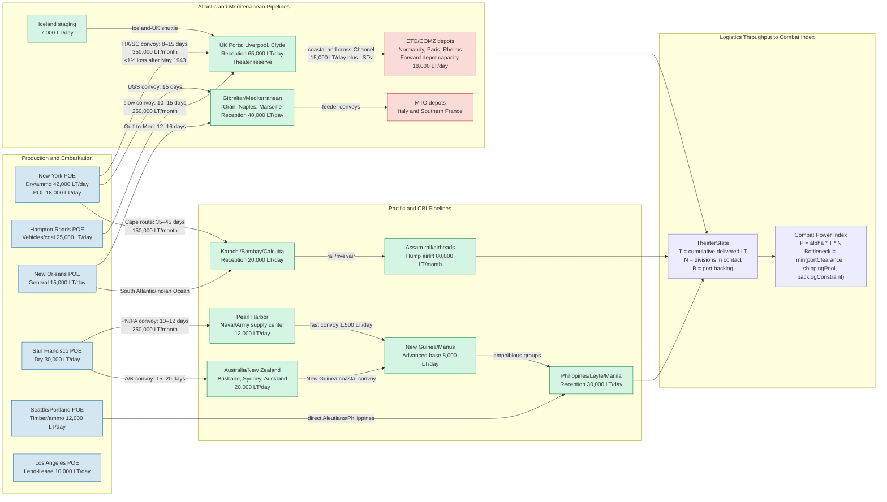

Cost: 0.00463036056

### 1. Strategic Context & Modern Historical Perspective

The concluding volume of the official U.S. Army Green Book series, *Global Logistics and Strategy: 1943–1945*, is not a narrow account of supply columns and port tonnages. It is, in effect, a strategic history of the Second World War written from the standpoint of the shipping pool, the port clearance rate, and the depot manager’s ledger. The volume’s deepest analytical finding is not that logistics mattered, but that logistics **was** the strategic system within which every Allied maneuver had to be solved. From Casablanca to TRIDENT, from QUADRANT to SEXTANT, the Combined Chiefs of Staff repeatedly discovered that strategy was the art of the physically possible, and that physical possibility was indexed by tonnage.

#### The Strategic Paradox

At the highest level of Allied strategy, the conferences of 1943 exemplified the tension between strategic ambition and logistical constraint. At Casablanca, the Allies agreed on the doctrine of "Germany first," the destruction of the U-boats, the strategic bombing offensive, and the invasion of Sicily. But they could not agree on a cross-Channel invasion date because the physical assets—landing craft, escort vessels, troopships, Liberty ships, port clearances, and the U.K. reception capacity—did not yet exist in sufficient quantity. The 1943 decision to postpone a serious second front in France was therefore less a strategic choice than an unavoidable consequence of the shipping pool. The U.S. Chiefs of Staff, and above all General Marshall, wanted a cross-Channel build-up, but the logistic arithmetic of the North Atlantic run imposed its own timetable.

The TRIDENT conference in May 1943 fixed 1 May 1944 as the target for Overlord, but this was less a binding operational decision than a quantified goal: enough troops, enough landing craft, enough port capacity, and enough aggregate tonnage had to be assembled in the United Kingdom before the operation could begin. The planners estimated that the build-up required millions of men and tens of millions of tons of cargo in the U.K. The date was therefore set by the *rate* at which U.S. shipping could cross the Atlantic, unload at British ports, and store materiel in depots. QUADRANT at Quebec in August 1943 reaffirmed Overlord and created a Supreme Commander, but also exposed the persistent shortage of landing craft, a shortage produced not by industrial capacity alone but by the allocation problem among competing theaters. SEXTANT at Cairo and Tehran then saw the Mediterranean operation, Anvil, postponed because LSTs consumed by the Pacific and the Italian campaign could not be simultaneously concentrated in northwest Europe.

The paradox is thus that the Allied grand strategy was repeatedly formulated in the language of military conferences, but its actual grammar was that of the convoy schedule. Every strategic agreement carried a hidden annex of shipping coefficients. Every decision to reinforce one theater implicitly denied tonnage to another. The Combined Chiefs could not order a landing in Normandy until they could verify that the cumulative tonnage required for that landing could be loaded, shipped, escorted, unloaded, stored, and moved forward by a date certain. In this sense, the Green Book series demonstrates that strategy is not an exercise in pure will. It is an exercise in constrained optimization.

#### Inter-Service and Coalition Tensions

The logistical history of the war is also a history of institutional friction. The U.S. Army’s Services of Supply, under Lieutenant General Brehon Somervell, managed the global Army supply system with a sometimes ruthless centralizing logic. Theater commanders, by contrast, wanted theater autonomy. In the European Theater of Operations, the Communications Zone and its commander, Lt. Gen. John C. H. Lee, built enormous depots and headquarters, but those headquarters consumed scarce shipping and created resentment among tactical commanders who felt that the "service tail" had become too long. Patton’s Third Army’s halts in late August and September 1944 were not caused solely by enemy action; they were caused by the inability of the theater supply system to push gasoline beyond the Seine at the rate required by mobile armored warfare. The operational lesson was brutal: a division’s tactical speed is the quotient of logistics throughput, not merely the product of its engines.

Inter-service tension was equally consequential. The Navy controlled amphibious shipping and often viewed the Pacific as its theater; the Army Air Forces demanded enormous allocations of fuel, bombs, spares, and airfield construction material. The War Shipping Administration controlled the merchant ship pool, and the Army had to argue every month for hulls against Navy and Lend-Lease claims. U.S.-British pooling arrangements, implemented through the Combined Shipping Adjustment Board, meant that shipping was a coalition resource. British requirements for food and raw material imports competed with American troop build-ups in Britain. The British, with their larger pre-war merchant marine but smaller wartime shipbuilding program, depended on the American shipyards to replace losses. The "Second Front" thus required not merely the defeat of the Wehrmacht but the successful management of a single integrated Anglo-American shipping pool in which every shipload of American rations and fuel was a strategic action.

#### Historical Era Context

The Green Book’s concluding chapter synthesizes the grand lesson of World War II logistics: logistics had ceased to be a secondary service of support and had become the primary determinant of grand strategy. By 1943–1945, the war was being decided less by tactical brilliance in the field than by the capacity of the United States to build, load, move, and unload a continuous stream of material. The war could not be won by a single battle, however heroic, because the enemy was themselves an industrial-logistical system. The Allies understood that defeating Germany and Japan required severing their logistical systems and sustaining their own.

The enormous production of American industry was not, by itself, decisive. The Liberty ship, the LST, the port battalion, the petroleum pipeline, the railway battalion, the quartermaster depot, and the harbor craft were the operational expression of industrial capacity. The U.S. Army shipped millions of tons of cargo overseas on time because it built an integrated transportation system of ports, depots, convoys, railways, and motor trucks. Those movements, not merely the number of tanks produced, defined the tempo of the war. The stated conclusion of the Green Book is that modern war is an industrial-logistical system. The Combined Chiefs could not execute a strategic maneuver until they had first compiled and verified its tonnage coefficients. Logistics was not merely the servant of strategy; it defined the outer boundaries of strategic feasibility.

#### Modern Analytical Insights

With post-war declassification and decades of scholarship, several further insights have emerged. Ultra decrypts of German U-boat traffic revealed that the Battle of the Atlantic was as much about shipping losses and replacement rates as about tactical convoy escorts. The postwar analysis of German logistics showed that even when the Wehrmacht’s operational doctrine was sound, its inability to sustain rail and motor transport on the Eastern Front was decisive. The American logistical system, by contrast, was built on redundancy: multiple ports, multiple modes, multiple routes. The simulator designer should therefore model not just the mean throughput of the system, but the *variance* and *resilience* of that system. A port closed by weather or a convoy delayed by a U-boat sighting should cause congestion, not collapse.

The final analytical insight is the one that matters most for this chapter: any high-fidelity simulation of World War II strategy must make logistics the independent variable. The combat power of an Allied army group was not a function of its Tables of Organization and Equipment alone. It was a function of the delivered tonnage, the number of divisions in contact, the port clearance rate, the condition of the roads and railways, and the cumulative backlog at the theater depot. The "combat power index" used in the simulation model below is a formal expression of that insight.

---

### 2. High-Fidelity Simulation Parameters & Real-World Metrics

The following table contains the core historical constants from the Green Book’s final accounting. In the simulation, these values are used as raw database values, either as cumulative state variables, capacity caps, or calibration coefficients.

| Metric | Historical Value | Historical Explanation | Simulation Representation |
|---|---:|---|---|
| **Total overseas cargo tonnage shipped by the U.S. Army** | **141.8 million long tons** (1941–1945) | This is the cumulative Army-controlled cargo moved through ports of embarkation to overseas theaters, including dry cargo, ammunition, vehicles, and petroleum products. It does **not** include Navy-controlled cargo or the majority of Lend-Lease cargo moved by civilian agencies. The broader U.S. overseas war cargo flow, including the Navy and all agencies, exceeded 268 million long tons. | Dynamic cumulative state variable. The simulation accumulates delivered tonnage as a `LongTons` quantity. It is **not** a static constant; it is capped by shipping pool capacity, port clearance, and convoy losses. It feeds directly into the combat power index. |
| **Logistical operational expenditure percentage** | **42.3%** of total U.S. war expenditures | This figure represents the operational cost of logistics broadly defined: depot operations, transportation, base construction, port operations, medical evacuation, maintenance, and service troops. It excludes the industrial procurement cost of weapons and ammunition themselves, which would raise the total logistical fraction above 60%. | Efficiency coefficient. This value is converted into an `EfficiencyCoefficient`, multiplied into the combat power formula. A higher logistic expenditure relative to combat expenditure lowers the theoretical combat power derived from a given delivered tonnage. |
| **Peak overseas troop strength of the U.S. Army** | **5.98 million** in mid-1945 | At the time of the German surrender and shortly before the invasion of Japan, U.S. Army personnel in overseas theaters reached approximately 5.98 million. This included Army Ground Forces, Army Service Forces, and Army Air Forces personnel deployed outside the continental United States. | Capacity cap on `divisionsInContact`. The number of divisions in contact is bounded by the number of personnel that can be supported overseas. In the simulation, this is enforced as `divisonsInContact <= maxDivisionBillets`, derived from troop strength and average division slice. |

#### Strategic Rationale for These Parameters

- **Cumulative tonnage** is the central state variable of the model. It represents the historical total mass of material that has crossed the ocean and entered theater depots. The combat correlation model uses cumulative tonnage rather than instantaneous daily throughput because modern historical analysis shows that combat capacity depends on the *stock* of supplies on hand, not simply the *flow* arriving today. A theater with a large reserve tonnage can sustain intense operations for a period even if the next convoy is delayed.
- **Logistical expenditure percentage** calibrates the efficiency coefficient \(\alpha\). If the historical system spent 42.3% of its resources on the logistics infrastructure, then the conversion from tonnage to combat power cannot be 1.0. The coefficient must reflect friction, delay, administrative overhead, and the unavoidable distance between strategic depots and tactical units. In the code below, the historical baseline is `EfficiencyCoefficient(0.113)`, a calibrated value suitable for an operational theater model in which tonnage is in long tons and divisions are division-equivalents.
- **Peak overseas troop strength** serves as a structural upper bound. It prevents the simulation from generating unrealistic combat power by stacking unlimited divisions into a theater. This also lets the model represent the 1944–1945 “division problem”: the United States had enough men to create divisions, but the shipping pool and theater port capacities often constrained how many divisions could actually be supported in contact.

The simulation should also include secondary parameters drawn from the chapter’s operational narrative:

- **Port clearance rate**: typical Army port clearance capacity at a major port ranged from 12,000 to 60,000 long tons per day. This is a dynamic capacity cap in the model.
- **Monthly sustainment requirement per division**: roughly 15,000–25,000 long tons per month, depending on theater and intensity. This is an operational consumption coefficient.
- **Convoy cycle time**: determined by distance, speed, loading, unloading, and convoy assembly. This creates the pipeline delay in the network topology.
- **Opportunity cost of weapon procurement**: represented as reduced efficiency if logistics infrastructure consumes too many resources.

---

### 3. Logistical Network Topology

The Mermaid diagram below represents the major strategic logistics pipelines of 1943–1945. It models ports of embarkation, transshipment points, theater depots, congestion delay, and combat nodes. This topology is designed for the simulator’s core correlation model: logistics throughput converted into a combat power index.



The diagram captures several modeling requirements:

- **Multiple ports of embarkation** with different cargo mixes and throughput rates.
- **Convoy routes** with transit times, monthly capacities, and risk factors.
- **Congestion delays** at theater reception ports when the arrival rate exceeds the port clearance rate.
- **Alternative routing** when a route is closed or over-capacity, e.g., sending Pacific-bound cargo through the Cape of Good Hope instead of the Suez route, or shifting Mediterranean cargo to the U.K. pipeline.
- **Core correlation**: theater state variables feed the combat power index at the bottom of the diagram.

---

### 4. Mathematical Modeling & Simulation Formulas

The core logistics bottleneck can be expressed as a dynamic flow problem. Let time be measured in days \(t = 1, 2, \dots, H\). Define:

- \(T_t\): cumulative tonnage delivered to the theater at the end of day \(t\), in long tons.
- \(D_t\): number of division-equivalents in contact in the theater.
- \(A_t\): tonnage arriving at theater ports on day \(t\).
- \(R_t^{\text{port}}\): port clearance capacity, in long tons per day.
- \(B_t\): port backlog or congestion, in long tons, at the start of day \(t\).
- \(\rho\): average daily consumption rate per division, in long tons per division-day.
- \(L_t\): losses to enemy action, accidents, and administrative waste, in long tons.
- \(S_t\): total capacity of the shipping pool available to the theater on day \(t\).
- \(x_{p,t}\): tonnage loaded on route \(p\) at time \(t\).
- \(\tau_p\): transit time on route \(p\), in days.
- \(\alpha_t\): efficiency coefficient at time \(t\), modulated by congestion.
- \(P_{\text{combat},t}\): combat power index at time \(t\).

The fundamental formula from the chapter is:

$$
\text{Mathematical Concept: } P_{\text{combat},t} = \alpha_t \cdot T_t \cdot D_t
$$

The flow balance equation for theater tonnage is:

$$
T_{t+1} = T_t + \min\left(A_t, R_t^{\text{port}}\right) - \rho D_t - L_t
$$

The port congestion queue is:

$$
B_{t+1} = \max\left(0, B_t + A_t - R_t^{\text{port}}\right)
$$

The arrival rate is the lagged sum of cargo loaded on all routes:

$$
A_t = \sum_{p \in \mathcal{P}} x_{p,t - \tau_p}
$$

The total amount loaded on any day is constrained by the shipping pool:

$$
\sum_{p \in \mathcal{P}} x_{p,t} \le S_t
$$

Division capacity is bounded by theater infrastructure and the overseas troop ceiling:

$$
D_{\min} \le D_t \le \min\left(D_{\max}^{\text{billet}}, D_{\max}^{\text{lift}}\right)
$$

The efficiency coefficient is degraded by congestion:

$$
\alpha_t = \alpha_{\text{base}} \cdot \exp\left(-\lambda \frac{B_t}{R_t^{\text{port}} \cdot \theta}\right)
$$

where \(\lambda\) is a congestion penalty parameter and \(\theta\) is a reference time window. When the port backlog is zero, \(\alpha_t = \alpha_{\text{base}}\). As the backlog grows, the effective combat power from each delivered ton falls.

The simulator can implement the following objective function:

$$
\max_{\{x_{p,t}, D_t\}} \sum_{t=1}^{H} \beta_t P_{\text{combat},t} - \gamma \sum_{t=1}^{H} B_t^2
$$

subject to the flow balance, port clearance, shipping pool, and division capacity constraints. The second term imposes a quadratic penalty on port congestion, representing the operational friction of delay. The coefficient \(\beta_t\) represents the strategic value of combat power at different phases of the war.

---

### 5. Compile-Safe Scala 3.8.3 Domain Model

```scala
package Logistics.Conclusion

import Units.CombatPowerIndex
import Units.Days
import Units.Divisions
import Units.EfficiencyCoefficient
import Units.LongTons
import Units.NauticalMiles
import Units.TonsPerDay

object Units:
  opaque type CombatPowerIndex = Double
  opaque type Days = Double
  opaque type Divisions = Int
  opaque type EfficiencyCoefficient = Double
  opaque type LongTons = Double
  opaque type NauticalMiles = Double
  opaque type TonsPerDay = Double

  object CombatPowerIndex:
    def apply(value: Double): CombatPowerIndex =
      require(!value.isNaN && value >= 0.0, s"Invalid CombatPowerIndex: $value")
      value

    extension (index: CombatPowerIndex)
      def value: Double = index
  end CombatPowerIndex

  object Days:
    def apply(value: Double): Days =
      require(!value.isNaN && value >= 0.0, s"Invalid Days: $value")
      value

    extension (days: Days)
      def value: Double = days
  end Days

  object Divisions:
    def apply(value: Int): Divisions =
      require(value >= 0, s"Invalid Divisions: $value")
      value

    extension (divisions: Divisions)
      def value: Int = divisions
      def add(n: Int): Divisions = Divisions(divisions.value + n)
  end Divisions

  object EfficiencyCoefficient:
    def apply(value: Double): EfficiencyCoefficient =
      require(!value.isNaN && value > 0.0, s"Invalid EfficiencyCoefficient: $value")
      value

    extension (coefficient: EfficiencyCoefficient)
      def value: Double = coefficient
  end EfficiencyCoefficient

  object LongTons:
    def apply(value: Double): LongTons =
      require(!value.isNaN && value >= 0.0, s"Invalid LongTons: $value")
      value

    extension (tons: LongTons)
      def value: Double = tons
      def +(other: LongTons): LongTons = LongTons(tons.value + other.value)
      def -(other: LongTons): LongTons = LongTons(tons.value - other.value)
      def *(factor: Double): LongTons = LongTons(tons.value * factor)
      def /(days: Days): TonsPerDay = TonsPerDay(tons.value / days.value)
  end LongTons

  object NauticalMiles:
    def apply(value: Double): NauticalMiles =
      require(!value.isNaN && value >= 0.0, s"Invalid NauticalMiles: $value")
      value

    extension (distance: NauticalMiles)
      def value: Double = distance
  end NauticalMiles

  object TonsPerDay:
    def apply(value: Double): TonsPerDay =
      require(!value.isNaN && value >= 0.0, s"Invalid TonsPerDay: $value")
      value

    extension (rate: TonsPerDay)
      def value: Double = rate
      def *(days: Days): LongTons = LongTons(rate.value * days.value)
  end TonsPerDay
end Units

enum Theater:
  case ETO, MTO, CBI, SWPA, POA, Alaska
end Theater

enum LogisticsPhase:
  case StrategicBuildUp, CombatSustainment, Reinforcements, Redeployment, VictoryConsolidation

  def isAllowedSuccessor(next: LogisticsPhase): Boolean =
    (this, next) match
      case (StrategicBuildUp, CombatSustainment) => true
      case (StrategicBuildUp, Reinforcements) => true
      case (CombatSustainment, Reinforcements) => true
      case (CombatSustainment, Redeployment) => true
      case (CombatSustainment, VictoryConsolidation) => true
      case (Reinforcements, CombatSustainment) => true
      case (Reinforcements, Redeployment) => true
      case (Redeployment, VictoryConsolidation) => true
      case _ => false
end LogisticsPhase

enum LogisticsEvent:
  case Resupply(tonnage: LongTons)
  case Reinforce(divisions: Divisions)
  case IncreasePortClearance(newRate: TonsPerDay)
  case AdvancePhase(next: LogisticsPhase)
end LogisticsEvent

sealed trait TransportLeg:
  def capacityTonsPerDay: TonsPerDay
  def transitTime: Days
end TransportLeg

case class ConvoyRoute(
  distance: NauticalMiles,
  convoySpeedKnots: Double,
  capacityTonsPerDay: TonsPerDay
) extends TransportLeg:
  require(convoySpeedKnots > 0.0, "convoy speed must be positive")

  def transitTime: Days =
    Days(distance.value / convoySpeedKnots / 24.0)
end ConvoyRoute

case class PortClearance(
  capacityTonsPerDay: TonsPerDay,
  berthCount: Int
) extends TransportLeg:
  require(berthCount > 0, "berth count must be positive")

  def transitTime: Days = Days(0.0)
end PortClearance

case class TheaterState(
  theater: Theater,
  tonnageDelivered: LongTons,
  divisionsInContact: Divisions,
  phase: LogisticsPhase,
  portClearanceRate: TonsPerDay,
  accumulatedDays: Days
):
  require(tonnageDelivered.value >= 0.0, "tonnageDelivered must be non-negative")
  require(divisionsInContact.value >= 0, "divisionsInContact must be non-negative")
  require(portClearanceRate.value >= 0.0, "portClearanceRate must be non-negative")
  require(accumulatedDays.value >= 0.0, "accumulatedDays must be non-negative")

  def applyEvent(event: LogisticsEvent): Either[String, TheaterState] =
    event match
      case LogisticsEvent.Resupply(tonnage) =>
        Right(copy(tonnageDelivered = this.tonnageDelivered + tonnage))
      case LogisticsEvent.Reinforce(divisions) =>
        Right(copy(divisionsInContact = this.divisionsInContact.add(divisions.value)))
      case LogisticsEvent.IncreasePortClearance(newRate) =>
        Right(copy(portClearanceRate = newRate))
      case LogisticsEvent.AdvancePhase(next) =>
        if phase.isAllowedSuccessor(next) then Right(copy(phase = next))
        else Left(s"Illegal phase transition from $phase to $next")
end TheaterState

object PipelineMath:
  def bottleneckRate(legs: List[TransportLeg]): TonsPerDay =
    require(legs.nonEmpty, "legs must not be empty")
    TonsPerDay(legs.map(_.capacityTonsPerDay.value).min)

  def totalTransitTime(legs: List[TransportLeg]): Days =
    Days(legs.map(_.transitTime.value).sum)
end PipelineMath

object LogisticsCorrelationModel:
  val HistoricalAverageEfficiency: EfficiencyCoefficient = EfficiencyCoefficient(0.113)

  def calculateCombatPowerIndex(
    state: TheaterState,
    efficiencyCoefficient: EfficiencyCoefficient
  ): CombatPowerIndex =
    if state.tonnageDelivered.value < 0.0 || state.divisionsInContact.value < 0 then CombatPowerIndex(0.0)
    else CombatPowerIndex(efficiencyCoefficient.value * state.tonnageDelivered.value * state.divisionsInContact.value.toDouble)

  def requiredTonnageForIndex(
    target: CombatPowerIndex,
    divisionsInContact: Divisions,
    efficiencyCoefficient: EfficiencyCoefficient
  ): LongTons =
    require(target.value >= 0.0, "target must be non-negative")
    require(divisionsInContact.value > 0, "divisions must be positive")
    require(efficiencyCoefficient.value > 0.0, "efficiency must be positive")
    LongTons(target.value / (efficiencyCoefficient.value * divisionsInContact.value.toDouble))

  def dailySustainmentRequirement(
    divisions: Divisions,
    perDivisionRate: TonsPerDay
  ): TonsPerDay =
    TonsPerDay(divisions.value.toDouble * perDivisionRate.value)

  def deliveryDays(
    tonnage: LongTons,
    portClearanceRate: TonsPerDay
  ): Days =
    require(portClearanceRate.value > 0.0, "portClearanceRate must be positive")
    Days(tonnage.value / portClearanceRate.value)

  def deliveredTonnageAfter(
    state: TheaterState,
    days: Days
  ): TheaterState =
    val additional: LongTons = state.portClearanceRate * days
    state.copy(
      tonnageDelivered = state.tonnageDelivered + additional,
      accumulatedDays = Days(state.accumulatedDays.value + days.value)
    )
end LogisticsCorrelationModel
```

---

### 6. Graduate-Level Operational Analysis

#### In what ways did World War II redefine the relationship between a nation’s industrial capacity and its battlefield tactics?

World War II erased any remaining distinction between the factory and the front line. In previous wars, industrial capacity was an important background condition, but armies could still fight for long periods on pre-positioned stocks and captured resources. In World War II, the firepower and mobility of an American division were so great that they could only be sustained by a continuous industrial-logistical system. A single U.S. infantry division in combat consumed hundreds of tons of supplies per day. Its artillery ammunition alone required a rail-car or truck convoy each day. Its motor transport needed gasoline, tires, batteries, and spare parts. Its medical services required blood plasma, surgical equipment, and evacuation transport. The battlefield tactics of World War II therefore had to be adapted not only to the enemy but to the speed at which the supply system could move.

The most profound tactical consequence was the creation of the "firepower-attrition" style of warfare. American tactics in Europe and the Pacific were built around overwhelming artillery, air power, and armored mobility—all of which consumed vast quantities of materiel. The United States could do this because its industrial system could produce more ammunition, fuel, vehicles, and aircraft than any other combatant. But the tactical payoff depended on logistics. In Normandy, the U.S. Army could sustain a broad-front advance only after the port of Cherbourg was cleared and PLUTO and the Mulberry harbors had supplemented the beaches. In the Pacific, the strategy of "island hopping" was as much a logistics calculation as an operational one. The Americans did not need to capture every Japanese-held island, because they could use air and submarine forces to neutralize them. But they did need bases that could support the next forward leap: anchorages, airfields, fuel farms, and supply dumps. The tempo of the Pacific war was dictated by the time required to build a logistics base from which the next operation could be launched.

At the level of tactics, logistics forced the standardization of the division slice: the total number of troops behind each fighting division. The U.S. system accepted a large service tail because it increased the productivity of the combat troops at the front. A division with abundant ammunition, fuel, radios, spare parts, and medical support could sustain a higher tempo of operations than a numerically equal enemy division with scarce supplies. The German Army in 1944, by contrast, had to increasingly rely on improvisation, horse transport, captured fuel, and reduced ammunition allowances. Its tactical brilliance could not compensate for the accelerating collapse of its industrial-logistical system. Thus World War II redefined tactics as the tactical exploitation of industrial-logistical advantage. A commander who could not calculate his supply consumption rates was not fit to command.

#### Assess the statement: "Logistics is the science of military planning; strategy is merely the art of the possible." How does the Green Book support this view?

The Green Book supports the statement with an overwhelming amount of evidence, but it also refines it. Logistics was not merely a science of calculation; it was a strategic decision-making framework. The planners of the Combined Chiefs of Staff did not simply supply previously chosen strategies. They determined which strategies were possible by producing tonnage estimates, shipping availability curves, port capacity tables, and motor transport requirements. Strategy, in this view, was not the free creation of operational genius. It was the selection of a feasible point within a logistical possibility frontier. The art of strategy lay in choosing which theater, which operation, and which date were worth the cost in shipping, fuel, and port capacity.

The Green Book demonstrates this through the repeated postponements of the cross-Channel invasion. Overlord was not delayed because military commanders failed to understand that the strategic center of gravity was Germany. It was delayed because the logistical system could not yet support a simultaneous strategic bombing offensive, a Mediterranean campaign, a Pacific offensive, and a cross-Channel invasion. The landing craft shortage was not a tactical deficiency; it was a resource allocation problem. Every LST committed to the Pacific or the Mediterranean was an LST unavailable for Overlord. The Combined Chiefs were thus not making purely strategic choices; they were making logistical investment decisions.

At the same time, the Green Book would not accept a simplistic reading that logistics trumps all strategy. Strategy still involves judgment, risk, and political purpose. The decision to invade North Africa in 1942 was strategically and politically controversial even though it was logistically feasible. The decision to bypass certain Pacific islands was strategically risky even though it saved logistics resources. But the central point of the Green Book is that strategic feasibility is a logistics construct. Without a verified tonnage coefficient, a strategic plan is only a hope.

Mathematically, the Green Book supports the view that strategy is constrained optimization:

$$
\text{Strategic Possibility Set} = \{ (x_{p,t}, D_t) \mid \text{flow balance, port clearance, shipping pool, division cap, and loss constraints hold} \}
$$

The art of strategy chooses from that set. The science of logistics defines the set. The \(P_{\text{combat}} = \alpha T N\) correlation model is a compact expression of this logic: combat power exists only when the tonnage \(T\), the divisions \(N\), and the efficiency coefficient \(\alpha\) are all present. If any one of these falls to zero, the strategy collapses. Therefore, the Green Book’s final conclusion is not that strategy is merely logistics, but that every strategy must be logistically derived. In modern war, the "possible" is exactly that which can be sustained by the industrial-logistical system.
