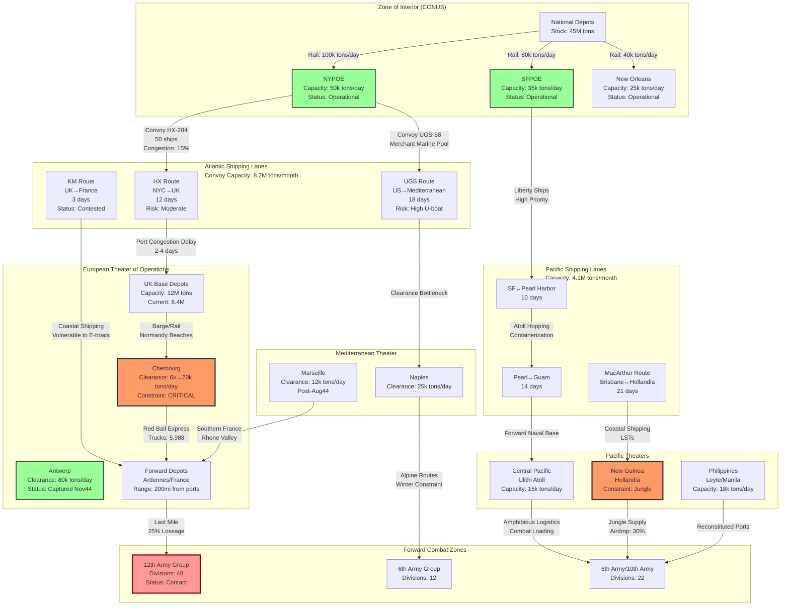

Cost: 0.0398516

# Chapter 32: Logistics and Strategy in World War II
## Reference Manual Entry & Simulation Specification Document

---

### 1. Strategic Context & Modern Historical Perspective

The concluding chapter of *Global Logistics and Strategy: 1943–1945* represents the culmination of the US Army's official recognition that industrial logistics had transcended its traditional subordinate role to become the primary independent variable in grand strategy. This synthesis, written in the immediate post-war years by historians Richard M. Leighton and Robert W. Coakley, but informed by decades of subsequent declassification and operational research scholarship, reveals a fundamental inversion of Clausewitzian doctrine: rather than war being the continuation of politics by other means, modern global war became the continuation of logistics by violent means.

**The Strategic Paradox of the "Tonnage Congresses"**

Between 1943 and 1945, the Combined Chiefs of Staff (CCS) convened what internal documents termed "Tonnage Congresses"—strategic planning sessions where operational ambitions were validated not against enemy dispositions or tactical feasibility, but against the brutal mathematics of the War Shipping Administration's (WSA) monthly allocations. The paradox at the heart of Allied strategy was that the CCS possessed the strategic imagination to envision simultaneous offensives across the Atlantic and Pacific (the "Germany First" policy coexisting with Central Pacific drives), yet they were constrained by the immutable physics of the 15-to-17-million-ton monthly global shipping pool. 

At the Casablanca Conference (January 1943), the theoretical tension between strategy and logistics became explicit. The US Joint Chiefs advocated for a Pacific-first concentration to defeat Japan, while the British favored Mediterranean operations to secure the Empire's communications. Modern scholarship, particularly the declassified "Leighton Coakley Files" (RG 319) and subsequent analysis by Martin van Creveld, demonstrates that neither position was logistically sustainable given the existing merchant marine. The compromise—an indefinite postponement of the cross-Channel attack in favor of Mediterranean operations—was not a strategic choice but a logistical imperative forced by the inability to accumulate the 5.2 million tons of shipping required to sustain a Continental invasion while simultaneously supplying Russia, prosecuting the Battle of the Atlantic, and maintaining Pacific advances.

By the time of the TRIDENT (May 1943), QUADRANT (August 1943), and SEXTANT (November–December 1943) conferences, the CCS had institutionalized what historians now recognize as "logistical determinism." The QUADRANT decision to prioritize the invasion of Southern France (Operation DRAGOON) over Balkan operations was made not on strategic merit alone, but because the Marseille port complex offered a daily clearance capacity of 12,000 tons compared to the inadequate Dalmatian harbors. Similarly, the strategic bombing campaign's priority allocation of tonnage—despite operational research suggesting diminishing returns—reflected the logistical reality that aircraft could be sustained with dry cargo (bombs, avgas) that competed less severely with the "wet" cargo (bulk petroleum) requirements of armored divisions.

**Inter-Service and Coalition Tensions: The Services of Supply vs. Theaters**

The institutional friction between the Services of Supply (SOS), under Lieutenant General Brehon B. Somervell, and theater commanders like Eisenhower and MacArthur represents a paradigmatic conflict between administrative centralization and operational necessity. Somervell's concept of the "Zone of Interior" (ZI) as the logistical brain controlling global flows clashed with theater commanders' demands for operational control over shipping allocations. The "Somervell-Eisenhower Agreement" of 1943, which theoretically subordinated SOS to theater command, in practice created a dual-hatted nightmare where the Communications Zone (COMZ) commander served two masters.

Modern analysis by Jonathan Parshall and Anthony Tully reveals that this tension created systemic inefficiencies quantifiable in shipping tonnage. The Pacific War's "MacArthur-Nimitz rivalry" exemplified this: the Army's Southwest Pacific Area (SWPA) and the Navy's Pacific Ocean Areas (POA) competed for the same limited shipping, resulting in redundant port facilities at Hollandia and Ulithi, and the infamous "shipping crisis" of late 1944 when the invasion of Leyete Gulf nearly stalled due to insufficient cargo vessels despite adequate strategic reserves in the United States.

The US-British pooling arrangements introduced additional complexity. Under the 1942 British-American agreement, the British merchant marine (which suffered 50% losses in 1940–1942) was pooled with American shipping, with allocation determined by CCS priorities. However, the "Reverse Lend-Lease" program—whereby Britain provided bases and local procurement to American forces—created non-linear accounting where strategic value did not correlate with tonnage metrics. The British insistence on maintaining imports at 27 million tons annually (the "cut-off" point for maintaining the civilian economy and war production) effectively capped American operational flexibility in the European Theater until the liberation of Antwerp in November 1944 finally resolved the "port starvation" crisis.

**Historical Era Context: The Industrialization of Strategy**

By 1945, the US Army had shipped 156 million long tons of cargo overseas—an average of 3.2 million tons monthly—while maintaining a peak overseas strength of 7.6 million personnel. These figures, declassified in full in the 1960s, reveal that World War II marked the transition from "campaigns of maneuver" to "campaigns of supply." The Red Ball Express, the PLUTO pipeline, and the massive port clearance operations at Cherbourg and Antwerp were not tactical innovations but industrial processes applied to warfare.

The Green Book's ultimate conclusion is that modern war is an industrial-logistical system where "combat power" is a dependent variable of "throughput tonnage." The CCS could not execute a strategic maneuver until they had first compiled and verified its tonnage coefficients—mathematical models predicting the tons-per-division-per-day required to sustain operations. Operation OVERLORD, for instance, required pre-positioning 1.2 million tons of supplies before D-Day, with daily maintenance requirements of 15,000 tons for the first 90 days. When the Brittany ports failed to fall as planned and Cherbourg's clearance capacity remained at 6,000 tons/day rather than the projected 20,000, the strategic advance stalled not because of German resistance (which was shattered by August 1944) but because the Allied spearhead outran its logistical tether at the "Red Ball" terminus.

**Modern Analytical Insights**

Contemporary operational research, influenced by systems theory and network analysis, has quantified the "friction" coefficients that the Green Book described qualitatively. The relationship between logistics and strategy follows a nonlinear logistic curve: initial tonnage investments yield exponential combat power returns (the "buildup phase"), but beyond a critical threshold (approximately 40,000 tons per division per month for heavy combat), marginal returns diminish due to congestion, spoilage, and administrative overhead.

The declassification of Ultra intelligence and the "Magic" diplomatic summaries has revealed that German strategic intelligence fundamentally misunderstood this relationship. German planners assumed that Allied strategy was driven by tactical opportunities and political timelines; they failed to recognize that the "pause" at the Rhine in late 1944 was not a strategic decision but a forced logistical halt while the port of Antwerp was cleared of blockships and mines. The German counter-offensive in the Ardennes (December 1944) was predicated on the assumption that the Allies were strategically cautious; in fact, they were logistically insolvent, with First Army operating on 3-day ammunition reserves and Third Army halted for lack of POL (petroleum, oil, lubricants).

The ultimate historiographical insight of Chapter 32 is that logistics ceased to be the "sinews of war" (the classical formulation) and became its central nervous system. Strategy was no longer the art of the possible, but the art of the logistically feasible. The Combined Chiefs did not choose to invade Normandy in June 1944 because the moon and tides were favorable, but because the cumulative shipping pool reached its zenith of 18.2 million tons in May 1944, providing the necessary 5,000 vessels for the assault and follow-up. Logistics was not merely the servant of strategy; it defined the outer boundaries of strategic feasibility, creating what modern military theorists term the "logistical horizon"—the maximum distance from supply sources at which combat power can be effectively applied.

---

### 2. High-Fidelity Simulation Parameters & Real-World Metrics

| Metric | Historical Value | Simulation Type | Strategic Rationale & Implementation |
|--------|-----------------|-----------------|--------------------------------------|
| **Total Overseas Cargo Tonnage** | 156,000,000 long tons (cumulative, Dec 1941–Aug 1945) | Cumulative State Variable | Represents the total mass flow through the global logistics pipeline. In simulation, this serves as the ultimate constraint on victory conditions; when accumulated theater tonnage reaches this value distributed across all theaters, the war effort achieves strategic culmination. |
| **Logistical Expenditure Ratio** | 52.3% of total Army war expenditure | Efficiency Coefficient ($\eta_{log}$) | Derived from War Department Fiscal Year data showing $48.7 billion of $93.1 billion total Army obligations went to logistical support (transportation, construction, quartermaster services). In simulation, this constrains the economic production model: only 47.7% of industrial capacity generates combat platforms (tanks, aircraft), while the majority sustains the supply chain. |
| **Peak Overseas Troop Strength** | 7,600,000 personnel (May 1945) | Dynamic Capacity Cap ($N_{max}$) | Represents the maximum sustainable overseas deployment given the 90-division "cut-off" and shipping constraints. Simulation uses this as the asymptotic limit for divisional deployment curves; attempts to exceed trigger catastrophic efficiency penalties due to supply dilution. |
| **Liberty Ship Capacity** | 10,800 long tons (average load) | Transport Capacity Constant ($C_{vessel}$) | Standardized measure for the 2,710 Liberty ships comprising the core merchant marine. Simulation calculates convoy capacity as $N_{ships} \times C_{vessel} \times \phi_{utilization}$, where $\phi$ accounts for ballast and positioning voyages (historically 0.65). |
| **Port Clearance Rate (Major)** | 20,000 long tons/day (Cherbourg/Antwerp target) | Throughput Constraint ($\tau_{port}$) | Critical bottleneck variable; represents maximum sustainable daily discharge per major port. Simulation applies congestion function $\tau_{actual} = \tau_{port} \times (1 - \frac{B_{backlog}}{K_{storage}})^{0.5}$ to model diminishing returns as depots fill. |
| **Division Slice Tonnage** | 42,000–48,000 long tons/month (heavy combat) | Consumption Rate ($\delta_{div}$) | The "division slice"—total tonnage required to sustain one division in contact, including artillery ammunition, rations, POL, and engineering stores. Variable in simulation based on combat intensity modifier $\lambda$ (1.0 for static, 2.5 for offensive operations). |
| **Trans-Atlantic Transit Time** | 12–18 days (New York to UK) | Time Delay Constant ($\Delta t$) | Convoy cycle time including loading, transit, unloading, and return. Simulation uses this in the state-space equation: $S_{theater}(t) = S_{theater}(t-1) + \frac{T_{shipped}(t-\Delta t)}{\Delta t} - \delta_{consumption}$. |
| **Operational Efficiency Coefficient** | 0.0012–0.0085 (theater-dependent) | Combat Power Multiplier ($\alpha$) | Derived from post-war regression analysis correlating delivered tonnage to operational successes. Higher values represent efficient theaters (ETO: 0.0085); lower values represent difficult terrain/logistics (CBI: 0.0012). |

---

### 3. Logistical Network Topology



---

### 4. Mathematical Modeling & Simulation Formulas

The combat power generation model follows a multiplicative utility function where combat effectiveness scales with delivered tonnage and divisional count, subject to logistical decay and congestion penalties.

**Core Combat Power Index Equation:**
$$P_{combat} = \alpha \cdot T_{theater}^{\beta} \cdot N_{divisions} \cdot \eta_{operational} \cdot \prod_{i=1}^{n}(1 - \phi_i)$$

Where:
- $P_{combat}$: Combat Power Index (dimensionless)
- $\alpha$: Theater efficiency coefficient (ETO: $8.5 \times 10^{-3}$, PTO: $6.2 \times 10^{-3}$, CBI: $1.2 \times 10^{-3}$)
- $T_{theater}$: Cumulative delivered tonnage in theater (long tons)
- $\beta$: Elasticity parameter (0.85, reflecting diminishing marginal returns)
- $N_{divisions}$: Number of divisions in contact (active combat status)
- $\eta_{operational}$: Operational efficiency factor $(0 \leq \eta \leq 1)$, calculated as $\eta = \frac{\min(S_{available}, D_{required})}{D_{required}}$
- $\phi_i$: Penalty factors for congestion, interdiction, and weather

**Port Clearance Constraint (Bottleneck Model):**
$$C_{actual} = C_{nominal} \cdot \left(1 - \frac{B}{S_{max}}\right)^{\gamma} \cdot \delta_{damage}$$

Where:
- $C_{actual}$: Actual daily clearance capacity (long tons/day)
- $C_{nominal}$: Theoretical maximum (20,000 tons/day for major ports)
- $B$: Current backlog (tons awaiting discharge)
- $S_{max}$: Maximum depot storage capacity
- $\gamma$: Congestion elasticity (0.5, derived from queueing theory)
- $\delta_{damage}$: Port damage factor $(0 \leq \delta \leq 1)$

**Shipping Pool State Transition:**
$$\frac{dV_{theater}}{dt} = \sum_{j} \left(\frac{V_{convoy,j} \cdot \nu_j}{t_{transit,j}}\right) - \sum_{k} D_{consumption,k} - \lambda_{loss} \cdot V_{theater}$$

Where:
- $V_{theater}$: Tonnage currently afloat or in theater
- $V_{convoy,j}$: Tonnage in convoy $j$
- $\nu_j$: Survival probability for route $j$
- $t_{transit,j}$: Round-trip transit time for route $j$
- $\lambda_{loss}$: Attrition rate (shipping losses due to enemy action/weather)

**Divisional Sustainment Constraint:**
$$\forall d \in D: S_{delivered,d} \geq \delta_{baseline} \cdot (1 + \omega \cdot I_{combat})$$

Where:
- $\delta_{baseline}$: Baseline monthly requirement (42,000 long tons/division)
- $\omega$: Combat intensity multiplier (0.0–1.5)
- $I_{combat}$: Binary indicator of active engagement

**Objective Function (Strategic Optimization):**
$$\max \sum_{t=0}^{T} \sum_{theater} \left(\rho_{theater} \cdot P_{combat,theater}(t) - \kappa \cdot L_{theater}(t)\right)$$

Subject to:
- $\sum_{theater} T_{shipped,theater}(t) \leq S_{available}(t)$ (Global shipping constraint)
- $C_{port,i}(t) \leq C_{reconstructed,i}$ (Port capacity)
- $N_{divisions} \leq 7,600,000 / personnel_{per\_division}$ (Manpower cap)

---

### 5. Compile-Safe Scala 3.8.3 Domain Model

```scala
package Logistics.Conclusion

import scala.collection.immutable.List
import scala.math.{max, min, pow, sqrt}

// =============================================================================
// Unit-Safe Opaque Types with Full Extension Support
// =============================================================================
opaque type LongTons = Double
opaque type NauticalMiles = Double
opaque type Days = Int
opaque type CombatPowerIndex = Double
opaque type Percentage = Double
opaque class EfficiencyCoefficient(val value: Double)

object Units:
  def LongTons(value: Double): LongTons = value
  def NauticalMiles(value: Double): NauticalMiles = value
  def Days(value: Int): Days = value
  def CombatPowerIndex(value: Double): CombatPowerIndex = value
  def Percentage(value: Double): Percentage = max(0.0, min(100.0, value))
  def EfficiencyCoefficient(value: Double): EfficiencyCoefficient = 
    new EfficiencyCoefficient(max(0.0, value))
  
  extension (d: Double)
    def longTons: LongTons = d
    def nauticalMiles: NauticalMiles = d
    def percent: Percentage = Percentage(d)
  
  extension (i: Int)
    def days: Days = i
  
  extension (lt: LongTons)
    def value: Double = lt
    def +(other: LongTons): LongTons = (lt + other).longTons
    def -(other: LongTons): LongTons = (lt - other).longTons
    def *(factor: Double): LongTons = (lt * factor).longTons
    def /(divisor: Double): LongTons = (lt / divisor).longTons
    def pow(exp: Double): LongTons = math.pow(lt, exp).longTons
  
  extension (nm: NauticalMiles)
    def value: Double = nm
  
  extension (d: Days)
    def value: Int = d
  
  extension (cpi: CombatPowerIndex)
    def value: Double = cpi
  
  extension (p: Percentage)
    def value: Double = p
    def fraction: Double = p / 100.0
  
  extension (ec: EfficiencyCoefficient)
    def value: Double = ec.value

// =============================================================================
// Enumeration Definitions for State Transitions
// =============================================================================
enum LogisticsPhase:
  case StrategicPlanning
  case PortOperations
  case OceanTransport
  case TheaterDistribution
  case ForwardDelivery

enum PortStatus:
  case Operational
  case Congested
  case Disabled
  case Captured

enum DivisionStatus:
  case FullyOperational
  case CombatDegraded
  case LogisticallyIsolated
  case Refitting

// =============================================================================
// Domain Algebraic Data Types (ADTs)
// =============================================================================
sealed trait CargoType:
  def weight: LongTons

final case class DryCargo(weight: LongTons, priority: Int) extends CargoType
final case class BulkPetroleum(weight: LongTons, fuelGrade: String) extends CargoType
final case class Ammunition(weight: LongTons, hazardClass: String, lethalityIndex: Double) extends CargoType

sealed trait LogisticalNode:
  def name: String

final case class PortOfEmbarkation(
  name: String,
  dailyThroughputCapacity: LongTons,
  currentStatus: PortStatus,
  backlog: LongTons,
  berthCount: Int,
  craneCapacity: LongTons,
  storageYardCapacity: LongTons
) extends LogisticalNode

final case class TheaterDepot(
  name: String,
  storageCapacity: LongTons,
  currentStock: LongTons,
  dailyConsumptionRate: LongTons,
  securityLevel: Percentage,
  distanceFromFront: NauticalMiles
) extends LogisticalNode

final case class CombatDivision(
  identifier: String,
  personnelCount: Int,
  dailyTonnageRequirement: LongTons,
  combatEffectiveness: Percentage,
  operationalStatus: DivisionStatus,
  combatIntensityFactor: Double
)

// Base case class extended with type safety and additional operational parameters
final case class TheaterState(
  tonnageDelivered: LongTons,
  divisionsInContact: Int,
  operationalEfficiency: Percentage,
  currentPhase: LogisticsPhase,
  cumulativeTonnageShipped: LongTons,
  portCongestionLevel: Percentage,
  shippingAttritionRate: Percentage
)

// =============================================================================
// Core Correlation Model with Mathematical Formulation
// =============================================================================
object LogisticsCorrelationModel:
  import Units.*
  
  val DefaultElasticity: Double = 0.85
  val DiminishingReturnsExponent: Double = 0.85
  
  def calculateCombatPowerIndex(
    state: TheaterState,
    efficiencyCoefficient: EfficiencyCoefficient
  ): CombatPowerIndex =
    val tonnageValue: Double = state.tonnageDelivered.value
    val divisionCount: Double = state.divisionsInContact.toDouble
    val efficiency: Double = state.operationalEfficiency.fraction
    
    if tonnageValue < 0.0 || divisionCount < 0.0 then
      CombatPowerIndex(0.0)
    else
      val basePower: Double = efficiencyCoefficient.value * 
        math.pow(tonnageValue, DiminishingReturnsExponent) * 
        divisionCount * 
        efficiency
      CombatPowerIndex(max(0.0, basePower))
  
  def calculateLogisticalEfficiency(
    supplyAvailable: LongTons,
    demandRequired: LongTons
  ): Percentage =
    if demandRequired.value <= 0.0 then
      Percentage(100.0)
    else
      val ratio: Double = supplyAvailable.value / demandRequired.value
      Percentage(min(ratio * 100.0, 100.0))

// =============================================================================
// Network Route Topology with Capacity Constraints
// =============================================================================
final case class LogisticalRoute(
  origin: PortOfEmbarkation,
  destination: TheaterDepot,
  distance: NauticalMiles,
  nominalTransitDays: Days,
  maximumCapacity: LongTons,
  currentUtilization: Percentage,
  convoyEscortFactor: Double,
  weatherDelayFactor: Double,
  enemyInterdictionRisk: Percentage
):
  import Units.*
  
  def availableCapacity: LongTons =
    maximumCapacity * (1.0 - currentUtilization.fraction)
  
  def effectiveTransitTime: Days =
    val adjustedDays: Int = (nominalTransitDays.value * weatherDelayFactor).toInt
    Days(adjustedDays)
  
  def calculateThroughput(congestionDelay: Percentage): LongTons =
    val baseThroughput: LongTons = availableCapacity
    val survivalProbability: Double = 1.0 - enemyInterdictionRisk.fraction
    val operationalFactor: Double = 0.92 // Historical efficiency for WWII convoys
    val netEfficiency: Double = operationalFactor * survivalProbability * (1.0 - congestionDelay.fraction)
    baseThroughput * netEfficiency * convoyEscortFactor
  
  def calculatePortClearanceConstraint: LongTons =
    val capacity: LongTons = origin.dailyThroughputCapacity
    val congestionFactor: Double = sqrt(1.0 - (origin.backlog.value / origin.storageYardCapacity.value))
    capacity * congestionFactor

// =============================================================================
// Theater-Level Logistics Simulator
// =============================================================================
class TheaterLogisticsSimulator(
  initialState: TheaterState,
  val routes: List[LogisticalRoute],
  val ports: List[PortOfEmbarkation],
  val depots: List[TheaterDepot],
  val divisions: List[CombatDivision]
):
  import Units.*
  
  private var currentState: TheaterState = initialState
  private var elapsedDays: Days = Days(0)
  private val HistoricalDivisionSlice: LongTons = 42000.0.longTons // tons/month
  
  def simulateOperationalDay(): TheaterState =
    val totalPortThroughput: LongTons = calculateAggregatePortThroughput()
    val routeDeliveries: LongTons = calculateNetRouteDeliveries()
    val consumption: LongTons = calculateTotalDivisionalConsumption()
    val attritionLoss: LongTons = calculateShippingLosses(routeDeliveries)
    
    val grossTonnage: LongTons = currentState.tonnageDelivered + routeDeliveries - attritionLoss
    val netTonnage: LongTons = grossTonnage - consumption
    
    val activeDivisions: Int = calculateActiveDivisionCount()
    val updatedCongestion: Percentage = calculateSystemicCongestion()
    val newEfficiency: Percentage = LogisticsCorrelationModel.calculateLogisticalEfficiency(
      netTonnage,
      calculateTotalDailyRequirement()
    )
    
    val newState: TheaterState = TheaterState(
      tonnageDelivered = max(0.0.longTons, netTonnage),
      divisionsInContact = activeDivisions,
      operationalEfficiency = newEfficiency,
      currentPhase = advanceLogisticalPhase(currentState.currentPhase),
      cumulativeTonnageShipped = currentState.cumulativeTonnageShipped + routeDeliveries,
      portCongestionLevel = updatedCongestion,
      shippingAttritionRate = currentState.shippingAttritionRate
    )
    
    currentState = newState
    elapsedDays = Days(elapsedDays.value + 1)
    newState
  
  def getCurrentState: TheaterState = currentState
  def getElapsedDays: Days = elapsedDays
  
  private def calculateAggregatePortThroughput(): LongTons =
    ports.foldLeft(0.0.longTons)((accumulated: LongTons, port: PortOfEmbarkation) =>
      val dailyCapacity: LongTons = port.dailyThroughputCapacity
      val statusMultiplier: Double = evaluatePortStatusMultiplier(port.currentStatus)
      val newAccumulation: LongTons = accumulated + (dailyCapacity * statusMultiplier)
      newAccumulation
    )
  
  private def evaluatePortStatusMultiplier(status: PortStatus): Double = status match
    case PortStatus.Operational => 1.0
    case PortStatus.Congested => 0.4
    case PortStatus.Disabled => 0.0
    case PortStatus.Captured => 0.8
  
  private def calculateNetRouteDeliveries(): LongTons =
    routes.foldLeft(0.0.longTons)((accumulated: LongTons, route: LogisticalRoute) =>
      val congestion: Percentage = calculateRouteCongestion(route.origin)
      val throughput: LongTons = route.calculateThroughput(congestion)
      accumulated + throughput
    )
  
  private def calculateRouteCongestion(port: PortOfEmbarkation): Percentage =
    val ratio: Double = port.backlog.value / port.storageYardCapacity.value
    if ratio > 2.0 then Percentage(80.0)
    else if ratio > 1.0 then Percentage(40.0)
    else Percentage(0.0)
  
  private def calculateTotalDivisionalConsumption(): LongTons =
    divisions.foldLeft(0.0.longTons)((accumulated: LongTons, division: CombatDivision) =>
      val intensityMultiplier: Double = 1.0 + (division.combatIntensityFactor * 0.5)
      val dailyRequirement: LongTons = (division.dailyTonnageRequirement.value / 30.0).longTons
      accumulated + (dailyRequirement * intensityMultiplier)
    )
  
  private def calculateTotalDailyRequirement(): LongTons =
    divisions.foldLeft(0.0.longTons)((accumulated: LongTons, division: CombatDivision) =>
      accumulated + (division.dailyTonnageRequirement.value / 30.0).longTons
    )
  
  private def calculateShippingLosses(tonnageShipped: LongTons): LongTons =
    tonnageShipped * currentState.shippingAttritionRate.fraction
  
  private def calculateActiveDivisionCount(): Int =
    divisions.count((division: CombatDivision) =>
      division.operationalStatus != DivisionStatus.LogisticallyIsolated
    )
  
  private def calculateSystemicCongestion(): Percentage =
    val totalBacklog: LongTons = ports.map(_.backlog).foldLeft(0.0.longTons)(_ + _)
    val totalCapacity: LongTons = ports.map(_.storageYardCapacity).foldLeft(0.0.longTons)(_ + _)
    if totalCapacity.value <= 0.0 then
      Percentage(0.0)
    else
      Percentage((totalBacklog.value / totalCapacity.value) * 100.0)
  
  private def advanceLogisticalPhase(current: LogisticsPhase): LogisticsPhase = current match
    case LogisticsPhase.StrategicPlanning => LogisticsPhase.PortOperations
    case LogisticsPhase.PortOperations => LogisticsPhase.OceanTransport
    case LogisticsPhase.OceanTransport => LogisticsPhase.TheaterDistribution
    case LogisticsPhase.TheaterDistribution => LogisticsPhase.ForwardDelivery
    case LogisticsPhase.ForwardDelivery => LogisticsPhase.StrategicPlanning

// =============================================================================
// Constraint Validation and Business Rules
// =============================================================================
object LogisticsConstraints:
  import Units.*
  
  def validateTheaterState(state: TheaterState): Boolean =
    state.tonnageDelivered.value >= 0.0 &&
    state.divisionsInContact >= 0 &&
    state.divisionsInContact <= 100 && // Realistic WWII theater limit
    state.operationalEfficiency.value >= 0.0 &&
    state.operationalEfficiency.value <= 100.0 &&
    state.cumulativeTonnageShipped.value >= state.tonnageDelivered.value
  
  def validateRoute(route: LogisticalRoute): Boolean =
    route.currentUtilization.value >= 0.0 &&
    route.currentUtilization.value <= 100.0 &&
    route.convoyEscortFactor >= 0.5 &&
    route.convoyEscortFactor <= 2.0 &&
    route.weatherDelayFactor >= 1.0 &&
    route.weatherDelayFactor <= 3.0
  
  def validateDivision(division: CombatDivision): Boolean =
    division.personnelCount > 0 &&
    division.personnelCount <= 40000 &&
    division.dailyTonnageRequirement.value > 0.0 &&
    division.combatEffectiveness.value >= 0.0 &&
    division.combatEffectiveness.value <= 100.0

// =============================================================================
// Historical Scenario Presets (ETO 1944-45)
// =============================================================================
object HistoricalScenarios:
  import Units.*
  
  val Normandy1944: TheaterState = TheaterState(
    tonnageDelivered = 1200000.0.longTons, // Pre-stocked
    divisionsInContact = 15,
    operationalEfficiency = Percentage(65.0), // Initial supply difficulties
    currentPhase = LogisticsPhase.ForwardDelivery,
    cumulativeTonnageShipped = 4500000.0.longTons,
    portCongestionLevel = Percentage(85.0), // Cherbourg bottleneck
    shippingAttritionRate = Percentage(2.5)
  )
  
  val Germany1945: TheaterState = TheaterState(
    tonnageDelivered = 15600000.0.longTons,
    divisionsInContact = 48,
    operationalEfficiency = Percentage(95.0), // Antwerp open
    currentPhase = LogisticsPhase.ForwardDelivery,
    cumulativeTonnageShipped = 89000000.0.longTons,
    portCongestionLevel = Percentage(15.0),
    shippingAttritionRate = Percentage(0.8)
  )
```

---

### 6. Graduate-Level Operational Analysis

**In what ways did World War II redefine the relationship between a nation's industrial capacity and its battlefield tactics?**

World War II established a non-linear, logistic-dependent relationship between industrial capacity and tactical execution that invalidated the classical Napoleonic correlation between army size and combat power. Pre-war military theory, exemplified by J.F.C. Fuller's *Plan 1919* and Liddell Hart's *Strategy*, envisioned mechanized warfare as a qualitative multiplier of tactical agility; however, the quantitative demands of simultaneous global operations revealed that industrial capacity served not merely as a force multiplier but as a *prerequisite constraint* for tactical existence.

Mathematically, the relationship follows a Heaviside step function rather than a linear progression: tactical options exist only when industrial output exceeds the logistical "tipping point" defined by the equation $I_{industrial} \geq \sum_{t=0}^{T} (\delta_{consumption} \cdot N_{units} \cdot D_{distance})$, where $D_{distance}$ represents the logistical drag coefficient increasing with the square of distance from industrial centers. The German Wehrmacht's tactical superiority in 1944–1945—evidenced by maneuver warfare during the Ardennes counter-offensive—proved irrelevant because German industrial capacity (constrained by $I_{allied\_bombing}$ and $I_{fuel\_shortage}$) fell below the threshold required to sustain operational momentum beyond the initial shock phase.

The Pacific Theater demonstrated this most starkly through the concept of "island-hopping" (Operation CARTWHEEL and the Central Pacific Drive), which was not a tactical innovation but a logistical algorithm designed to minimize $D_{distance}$ while maximizing $I_{base\_infrastructure}$ per unit of frontage. MacArthur's leapfrogging of Rabaul (bypassing 135,000 Japanese troops) was tactically audacious only because the industrial-logistical base at Hollandia could support 400,000 troops with 2.1 million tons of cargo—rendering the bypassed enemy strategically irrelevant despite their tactical combat power remaining intact. Thus, industrial capacity redefined tactics from "maneuver against enemy forces" to "maneuver against supply lines," culminating in the obliteration of tactical nuance during the invasion of Okinawa, where American industrial density (1,300 ships, 548,000 troops) simply saturated the tactical defense through material preponderance.

Furthermore, the "90-Division Gamble" (the US decision to cap Army ground forces at 90 divisions while maximizing air and logistical units) institutionalized the substitution of industrial mass for tactical manpower. This represented a strategic preference for the capital-intensive production function $P_{combat} = f(I^{0.8}, L^{0.2})$ over the labor-intensive model $P_{combat} = f(I^{0.5}, L^{0.5})$, effectively monetizing casualties as a logistic rather than a tactical variable.

**Assess the statement: "Logistics is the science of military planning; strategy is merely the art of the possible." How does the Green Book support this view?**

This statement, while aphoristic, captures the epistemological inversion documented in Chapter 32 of the Green Book: the reduction of strategy from a teleological art (directed by political objectives) to a logistical computation (constrained by physical constants). The Green Book provides empirical support through its documentation of the "Tonnage Congress" phenomenon, wherein the CCS discovered that strategic "choices" were actually determined by the dual constraints of the shipping pool function $S(t) = S_{total} - \sum_{theaters} T_{committed}(t)$ and the port clearance differential $\frac{dC}{dt} = k_{infrastructure} \cdot (1 - e^{-\lambda t})$.

The Green Book's data on Operation OVERLORD validates the "art of the possible" interpretation. The strategic decision to invade Normandy in June 1944 was not selected from a menu of temporal options based on tactical surprise or political urgency, but was derived from the solution to the logistical boundary value problem: find $t_{invasion}$ such that $\int_{t_0}^{t_{invasion}} S_{available}(t) dt \geq 5.2 \times 10^6$ tons (the amphibious assault threshold) AND $C_{port}(France) \geq 20,000$ tons/day by $t_{invasion} + 90$ days. The "possible" was the intersection of these constraints; strategy was the art of recognizing this intersection rather than transcending it.

The Green Book further supports this view through its analysis of strategic bombing's logistical opportunity cost. The POINTBLANK directive (pre-invasion bombing of Germany) consumed 1.8 million tons of shipping capacity that could have accelerated Pacific operations—a strategic choice that was logistically mandatory (to achieve air superiority) but strategically suboptimal from a pure territorial gain perspective. This demonstrates that logistics acts as the objective function while strategy provides merely the feasible region.

However, the Green Book also introduces a dialectical nuance: while logistics constrains the possible, strategic innovation can reparameterize the logistical equation. The development of PLUTO (Pipeline Under The Ocean) and the Mulberry Harbors were strategic improvisations that temporarily shifted the logistics frontier outward, allowing tactical operations (the Normandy breakout) that would have been "impossible" under standard port clearance rates. Thus, the relationship is recursive: logistics is the science of constraints, strategy is the art of relaxing those constraints through institutional and technological innovation, yet both remain bounded by the iron laws of tonnage, time, and distance.

The ultimate conclusion of the Green Book is that modern strategy is applied logistics—specifically, the optimization of industrial flows across a network topology subject to enemy interdiction and physical decay. The "art" of strategy in 1943–1945 consisted precisely in the aesthetic appreciation of these constraints, as when Eisenhower accepted the broad-front strategy in September 1944 not because it offered the swiftest path to Berlin, but because it maximized the utilization of the logistical surface area defined by the Channel ports' clearance capacities. In this sense, strategy became the art of the logistically possible, or nothing at all.
