Cost: 0.1508785

## 1. Strategic Context & Modern Historical Perspective

Chapter 32 of *Global Logistics and Strategy: 1943–1945* is best understood not merely as the conclusion of a campaign narrative, but as the capstone of the U.S. Army’s official interpretation of World War II as an industrial-logistical system. Its central proposition is that strategy could no longer be treated as an autonomous intellectual activity in which military leaders selected objectives and logisticians subsequently supplied the forces assigned to them. In a global, mechanized, coalition war, the order was often reversed. Before a proposed operation could become an executable strategy, planners had to translate it into troops, ships, landing craft, port capacity, petroleum, ammunition, vehicles, engineer units, hospital beds, replacement flows, and delivery schedules. Strategy emerged from repeated reconciliation between desired military effects and the physical means available to produce them.

### The strategic paradox

The great Allied conferences—Casablanca in January 1943, TRIDENT in May 1943, QUADRANT in August 1943, and SEXTANT in November–December 1943—produced decisions that were global in conception but had to be implemented through a finite and highly congested logistical network. Conference declarations could assign priority to a cross-Channel attack, accelerate the war against Japan, continue operations in the Mediterranean, aid China, support the Soviet Union, and sustain anti-submarine and strategic bombing campaigns. The same declarations could not create additional cargo vessels, tankers, landing ships, port battalions, locomotives, trucks, or trained service troops.

This produced the defining strategic paradox of the Allied war effort: the coalition possessed aggregate industrial superiority, but that superiority was not simultaneously available at every point of contact. Production had to be converted into deployable military power through transport and distribution networks. A tank in Detroit, an aircraft in California, or ammunition in an inland depot did not yet constitute combat power in Normandy, Italy, Burma, or the Central Pacific. The materiel had to be accepted, classified, packed for overseas movement, moved by rail to a port of embarkation, stored or staged, allocated ship space, loaded in the sequence required at destination, protected in transit, discharged through a theater port or over a beach, cleared from the port, processed through depots, and delivered to a consuming formation. Failure at any stage could immobilize resources accumulated at all preceding stages.

Shipping was therefore more than a transportation input. It was a mobile inventory, a scheduling resource, and frequently a substitute for inadequate port storage. The effective shipping pool depended not only on the deadweight capacity of available vessels but also on turnaround time. A ship assigned to a long route to India, Australia, or the Persian Gulf might perform only a fraction of the annual voyages possible on a North Atlantic route. Delays in convoy assembly, loading, discharge, repair, or return transit reduced annual carrying capacity even when no ship was sunk. Tankers formed a partly separate pool whose cargoes and handling facilities were not freely interchangeable with dry cargo. Refrigerated vessels, troopships, hospital ships, and assault shipping presented still other specialized constraints.

Combat loading imposed an additional penalty. Commercially efficient loading sought maximum use of a ship’s weight and cubic capacity. Combat loading sought tactical accessibility: vehicles, ammunition, engineer equipment, rations, and command elements had to be stowed in an order that permitted discharge according to the assault plan. This left cargo space unused and reduced effective lift. Assault shipping could consequently move less cargo than nominal vessel capacity suggested. Landing ships and craft were especially scarce because the same hulls were required for training, rehearsals, initial assault lift, follow-up movement, and support of earlier operations. Decisions about OVERLORD, ANVIL-DRAGOON, operations in Italy, and Pacific offensives therefore intersected through a common landing-craft constraint.

Port capacity was similarly multidimensional. Berth count alone did not determine throughput. Cranes, barges, tugs, lighterage, labor shifts, transit sheds, rail sidings, road exits, cargo documentation, and inland depot capacity were all necessary. A port could discharge cargo faster than its inland network could clear it, producing congestion that eventually reduced discharge itself. Conversely, trucks might be available but unable to compensate for damaged rail lines or insufficient fuel. The relevant capacity was the minimum capacity of the connected chain, not the largest capacity of any individual component.

The logistical lesson was that stockpiling could not remove all uncertainty. Stocks provided resilience against convoy loss, weather, port closure, and consumption spikes, but excessive accumulation congested depots and consumed shipping that might have supported another theater. The problem was dynamic: too little inventory endangered operations; too much inventory reduced network velocity.

### From Casablanca to SEXTANT

At Casablanca, the Anglo-American coalition continued to balance preparations for a cross-Channel attack against active operations in the Mediterranean and the need to arrest the deterioration of the war against Japan. British planners generally favored exploitation of opportunities around the Mediterranean, where existing forces could remain engaged and pressure could be applied against Italy and Germany’s southern approaches. American planners feared that successive Mediterranean commitments would defer the concentration required for a decisive invasion of northwest Europe.

TRIDENT placed greater definition around the projected 1944 cross-Channel operation, but the decision did not instantly produce the required accumulation in Britain. BOLERO—the buildup of American forces and matériel in the United Kingdom—competed with continuing requirements in North Africa, the Mediterranean, the Pacific, the China-Burma-India theater, and the Soviet aid programs. Theater buildup had to be expressed as monthly shipping allocations, unit deployment schedules, depot construction, railway and highway capacity, and British port discharge plans.

QUADRANT confirmed OVERLORD while also endorsing major operations in the Pacific and Southeast Asia. This demonstrated both the scale and the tension of Allied material superiority. The Allies could sustain multiple strategic axes, but not without priority systems, deferred deployments, substitutions, and repeated revision of shipping allocations. The Pacific’s distances magnified its logistical appetite. Amphibious operations required specialized lift, while bypassed islands, advancing air bases, fleet anchorages, and long petroleum pipelines at sea created a network with high transport work per ton delivered.

SEXTANT further developed plans for the defeat of Japan while preserving OVERLORD’s primacy. Yet the planned transfer of resources from Europe after Germany’s defeat revealed another systems problem: redeployment was not the inverse of deployment. Units had to be withdrawn from combat, refitted, screened by category, moved to ports, shipped, received, retrained, and adapted to a different theater. Equipment suitable for Europe might be worn out, incompatible with Pacific basing, or uneconomical to move. The end of the European war would release resources, but not instantaneously.

### Inter-service and coalition tensions

The Services of Supply—redesignated the Army Service Forces in March 1943—was charged with reconciling worldwide demand with procurement, storage, transportation, and distribution. Combat commanders, however, judged requirements from the perspective of operational risk. Theater requests commonly included safety margins, anticipated campaign requirements, replacement reserves, and insurance against interrupted shipping. From the theater’s viewpoint, such demands were prudent. From Washington’s viewpoint, simultaneous approval of every theater’s requested reserve could exceed production, shipping, or port capacity and could immobilize scarce matériel in inactive stocks.

This generated persistent friction between logisticians and combat commands. Theater commanders resisted externally imposed reductions because they bore the consequences of shortage but did not control the global allocation system. The Army Service Forces, War Department General Staff, and Joint and Combined Chiefs had to compare unlike risks: the danger that one theater would lack ammunition during an offensive against the danger that shipping diverted to that theater would postpone another strategic operation.

Inter-service rivalry further complicated allocation. The Army and Navy had different operational methods, accounting systems, shipping organizations, and procurement channels. In amphibious warfare, Army combat forces often depended on naval assault shipping and naval control of movement into the objective area. The Navy’s need for tankers, escorts, transports, floating bases, ammunition ships, and repair vessels competed with Army requirements for dry cargo and troop lift. Maritime priorities could therefore determine the operational tempo of land campaigns.

The Army–Navy boundary was particularly consequential in the Pacific, where oceanic movement, amphibious assault, fleet sustainment, and land-based air operations were inseparable. Duplicated facilities sometimes reflected organizational rivalry, but apparent duplication could also provide resilience across vast distances. A high-fidelity interpretation should not reduce all redundancy to inefficiency; some parallel capacity was deliberate insurance against attack, weather, and uncertain operational sequencing.

Coalition arrangements added another level of complexity. Anglo-American pooling made more efficient use of merchant shipping than separate national systems would have allowed, but pooling did not eliminate national control or disagreement. British shipping had to sustain the United Kingdom’s import-dependent economy, imperial communications, military forces, and civilian populations. American planners, supported by rapidly expanding U.S. production, often advocated concentration for a direct offensive. British planners were more sensitive to the continuing burdens of import dependence and to commitments across the empire and Mediterranean.

Allocation disputes were therefore not simply arguments between strategic “boldness” and logistical “caution.” They reflected different national exposure to shipping loss, different force structures, and different assessments of political obligation. Combined planning succeeded because these differences were institutionalized within boards and staffs capable of converting national positions into common schedules, even if the resulting compromises were not optimal from any single national perspective.

### Logistics as the determinant of operational tempo

The campaigns of 1944–45 confirmed that successful lodgment did not abolish logistical limits. In northwest Europe, the Allies placed a great army on the Continent and broke out of Normandy, but their advance outran the port, rail, pipeline, and truck systems developed to sustain it. The result was not an absolute absence of supplies in the theater. Rather, supplies were distributed unevenly, stranded at the wrong place, or moved at too high a transportation cost. The operational choice between a broad-front advance and concentrated thrusts was inseparable from the allocation of truck companies, railway restoration effort, petroleum, and ammunition.

The opening of major ports did not immediately solve the problem. Ports required rehabilitation, mine clearance, channel access, labor, communications, and inland clearance. Antwerp’s enormous theoretical capacity became strategically useful only after access through the Scheldt was secured and its clearance network made operational. This is a classic systems distinction between installed capacity and realizable throughput.

In the Pacific, logistics shaped the sequence of advances from base to base. Airfield range, fleet train capacity, tanker availability, construction battalions, reef and beach conditions, and anchorage quality influenced target selection. Bypassing Japanese positions was strategically attractive only when the bypassed garrisons could be isolated at less cost than reducing them and when forward bases could sustain the next movement.

The China-Burma-India theater demonstrated the extreme cost of low-capacity routes. Airlift over the Hump could deliver strategically vital cargo, but at high fuel, aircraft, maintenance, and personnel cost per ton. The Ledo-Burma Road and associated pipelines required major engineer investment and became productive only late in the war. Their history illustrates the distinction between strategic importance and economic throughput: a route can be politically indispensable while remaining inefficient in ton-mile terms.

### Modern analytical perspective

Postwar scholarship reinforces the Green Book’s central conclusion while qualifying any interpretation based solely on aggregate production. American industrial output was decisive, but the conversion ratio between production and combat effect depended upon network design, scheduling, maintenance, labor, coalition coordination, and information quality. Material superiority created options; logistical organization made selected options executable.

Modern operations research describes this system as a capacitated, multi-commodity, time-expanded network under uncertainty. Ships, ports, depots, railways, pipelines, and truck companies were nodes and arcs with different capacities, lead times, loss rates, and compatibility restrictions. Ammunition, petroleum, vehicles, refrigerated food, personnel, and replacement parts were not perfectly interchangeable commodities. The system also contained feedback: faster operations increased consumption and lengthened lines of communication; congestion reduced throughput; maintenance shortages lowered vehicle availability; and delayed deliveries forced operational pauses that altered future requirements.

The Combined Chiefs of Staff could not make strategic choice independent of these relationships. Proposed operations had to be converted into “tonnage coefficients”: force slices, maintenance factors, shipping measurements, port discharge assumptions, reserve levels, and delivery dates. These coefficients were imperfect and frequently revised, but without them strategy remained aspirational.

The deepest lesson is not that logisticians replaced strategists. Rather, grand strategy became a joint process of political choice, military design, industrial mobilization, and network optimization. Logistics defined the feasible region within which strategy could operate. Command still mattered because leaders chose among feasible alternatives, accepted risk, shifted priorities, and sometimes exceeded conservative planning assumptions. Yet no exercise of will could make a congested port clear twice its sustainable tonnage, turn dry-cargo ships into tankers, or deliver divisions before the ships carrying them completed their voyages.

World War II thus marked the institutional maturation of logistics from a subordinate service into a coequal determinant of strategy. The Allies’ decisive advantage was not production alone, but their ability—often after costly friction—to integrate production, coalition allocation, ocean transport, theater distribution, and battlefield consumption into a global system.

---

## 2. High-Fidelity Simulation Parameters & Real-World Metrics

### Historical constants and recommended database treatment

| Parameter | Historical value | Unit and scope | Historical interpretation | Simulator representation |
|---|---:|---|---|---|
| U.S. Army cargo shipped overseas during the war | **Approximately 67.2 million** | Long tons of Army cargo | The official Army statistical series commonly summarized the wartime overseas movement as about 67 million long tons. This is weight tonnage, not the substantially larger figure that results when cargo is reported in measurement tons. A long ton equals 2,240 pounds or approximately 1.016 metric tonnes. | Store as a **war-level cumulative benchmark**, not as a theater throughput rate. Use `67.2e6 long tons` as the calibration target for cumulative Army overseas cargo movement over the selected wartime accounting interval. |
| Approximate share of U.S. war expenditure devoted to logistical operations | **About 25 percent** | Percentage of total U.S. war expenditure | The Green Book’s concluding interpretation uses an approximate accounting share to convey the enormous cost of supply, transportation, construction, storage, maintenance, and related logistical operations. The value is not a universal activity-based cost ratio: wartime accounts assigned some dual-purpose spending differently. | Store as a **reference cost coefficient** with uncertainty metadata. Recommended baseline: `0.25`; sensitivity range: `0.22–0.28`, depending on accounting rules. Do not multiply all delivered tonnage directly by this coefficient. |
| Peak U.S. Army overseas strength in 1945 | **Approximately 5.4 million** | Personnel overseas | The Army reached a wartime strength of roughly 8.3 million, with about 5.4 million overseas near the 1945 peak. The exact monthly total varies with whether en route personnel and particular territorial commands are counted. | Represent as a **dynamic global manpower cap** calibrated to a 1945 peak of `5.4e6`. Theater strengths must sum to no more than the global overseas total for the current time step. |
| Weight definition | **1 long ton = 2,240 lb** | Mass conversion | U.S. wartime shipping records used several tonnage concepts. Long tons measured weight; measurement tons generally represented 40 cubic feet; deadweight tonnage measured ship-carrying capacity under specified conditions. | Make tonnage type explicit. Never combine long tons, measurement tons, deadweight tons, and displacement tons without conversion metadata. |
| Measurement-ton definition | **1 measurement ton = 40 ft³** | Cargo volume | Bulky cargo might exhaust ship cube before ship weight. Vehicles, packaged aircraft, and crated equipment could therefore consume lift disproportionate to their weight. | Use separate `CargoWeight` and `CargoVolume`. Ship loading is bounded by both weight and cubic capacity. |
| Peak Army strength | **Approximately 8.3 million** | Personnel, global Army total | Provides the denominator and global mobilization context for the 5.4 million overseas figure. | Dynamic personnel stock. Separate continental establishment, overseas theaters, replacements in transit, patients, trainees, and non-divisional support personnel. |
| Cargo loss and handling loss | Route- and period-dependent | Fraction of dispatched cargo | Loss arose from enemy action, marine casualty, pilferage, damage, misrouting, documentation error, and spoilage. By 1944 the Atlantic combat-loss component had fallen sharply, but operational handling losses remained. | Use an arc-specific survival coefficient $\sigma_{a,k,t}\in[0,1]`, varied by commodity, route, and month. |
| Port capacity | Theater-specific | Long tons/day or measurement tons/day | Effective port throughput was the minimum of berth, discharge, labor, lighterage, storage, documentation, and inland-clearance capacities. Published nominal capacity should not automatically equal realized throughput. | Dynamic node capacity with damage, weather, labor, equipment, and congestion modifiers. |
| Shipping capacity | Vessel- and route-specific | Long tons, cubic feet, or personnel per voyage | Annual lift depended on voyage cycle time as well as nominal ship capacity. Long routes locked shipping out of the pool for extended periods. | Mobile resource with state transitions: loading, outbound, discharging, return, repair, and available. |
| Combat-loading penalty | Operation-specific | Fraction of commercial payload | Assault accessibility reduced stowage density and could leave otherwise usable space empty. | Apply a loading-efficiency coefficient $\lambda\in(0,1]`; merchant loading may approach 1.0, while combat loading receives a lower scenario-defined value. |
| Inland-clearance ratio | Node-specific | Cleared tons / discharged tons | A port that discharged faster than cargo could leave the dock accumulated congestion and eventually lost effective capacity. | Track port inventory explicitly. Apply a congestion curve when dwell inventory exceeds working storage. |
| Divisional slice | Theater- and period-specific | Personnel and tons per combat division | A division required corps, army, communications-zone, air, engineer, medical, transportation, and depot support. Division count alone understates logistics demand. | Store both combat divisions and non-divisional support. Use a support-slice coefficient rather than treating every overseas soldier as divisional manpower. |
| Petroleum compatibility | Commodity-specific | Barrels/day, long tons/day | POL required tankers, pipelines, tank farms, drums, specialized vehicles, and fire-safe handling. Dry-cargo capacity was not automatically usable for bulk fuel. | Model bulk POL as a separate commodity on compatibility-restricted arcs and nodes. |
| Ammunition expenditure | Combat-intensity-dependent | Long tons/division/day | Expenditure depended on doctrine, artillery density, operation type, weather, enemy resistance, and accumulated stocks. | Dynamic demand generated by combat state, not a universal constant. Include short-term expenditure spikes and recovery periods. |

### Important tonnage caveat

The **67.2 million long-ton** benchmark must not be confused with figures reported in **measurement tons**. Wartime transportation documents frequently used both. A cargo stream could be constrained by weight, cubic volume, deck dimensions, hatch dimensions, or special handling requirements. A realistic vessel-loading model therefore requires at least:

- maximum deadweight;
- maximum usable cargo cube;
- petroleum or refrigerated compatibility;
- heavy-lift capability;
- vehicle deck or hatch constraints;
- troop accommodation;
- combat-loading efficiency;
- required turnaround time.

The simulator should retain the historical benchmark as a calibration total while generating realized wartime movement from monthly network operations.

---

## 3. Logistical Network Topology

```mermaid
flowchart LR
    subgraph ZI["Zone of Interior: Production, Assembly, and Embarkation"]
        P1["Industrial plants<br/>weapons, vehicles, ammunition"]
        P2["Refineries and tank farms<br/>bulk POL"]
        P3["Army depots<br/>inventory, inspection, packing"]
        R1["Rail and inland-water network<br/>capacity: car-days and tons/day"]
        STG["Port staging areas<br/>unit equipment + personnel marriage"]
        POEE["Atlantic/Gulf POEs<br/>New York, Hampton Roads, Boston, Charleston, New Orleans"]
        POEP["Pacific POEs<br/>San Francisco, Los Angeles, Seattle"]
        HOLD["Port holding inventory<br/>congestion if stock > working capacity"]

        P1 -->|"dry cargo, vehicles, ammunition"| P3
        P2 -->|"tank cars / pipeline"| R1
        P3 -->|"release by priority and shipping availability"| R1
        R1 -->|"rail capacity constraint"| STG
        STG -->|"staging delay; documentation; combat loading"| POEE
        STG -->|"staging delay; documentation; combat loading"| POEP
        POEE --> HOLD
        POEP --> HOLD
    end

    subgraph SHIP["Controlled Ocean Transportation Pools"]
        DRY["Dry-cargo vessel pool<br/>weight and cube constrained"]
        TANK["Tanker pool<br/>bulk POL only"]
        TROOP["Troopship pool<br/>berths and life-saving capacity"]
        ASSAULT["Assault lift<br/>APA, AKA, LST, LCI, LCT"]
        CONVOY["Convoy assembly and escort<br/>wait + sailing delay"]
        REPAIR["Repair / refit / return voyage<br/>temporarily unavailable hulls"]

        HOLD -->|"commercial loading efficiency λ"| DRY
        HOLD -->|"commodity-compatible loading"| TANK
        HOLD -->|"personnel embarkation"| TROOP
        HOLD -->|"combat-loading penalty λa < λ"| ASSAULT
        DRY --> CONVOY
        TANK --> CONVOY
        TROOP --> CONVOY
        ASSAULT --> CONVOY
    end

    subgraph ATL["Atlantic–Mediterranean Routes"]
        NA["North Atlantic route<br/>shorter cycle; weather and U-boat risk"]
        MED["Mediterranean route<br/>Gibraltar, North Africa, Italy"]
        UK["United Kingdom base system<br/>BOLERO depots and marshalling areas"]
        FRBE["Normandy beaches / Channel ports<br/>weather-sensitive discharge"]
        ANT["Antwerp complex<br/>high capacity after Scheldt access"]
        IT["North African and Italian ports"]
        UKDEP["UK theater depots<br/>pre-invasion stocks"]
        COMZ["Continental communications-zone depots"]
        REDBALL["Truck routes and rail restoration<br/>fuel and vehicle attrition constraints"]

        CONVOY -->|"allocated Atlantic sailings"| NA
        CONVOY -->|"allocated Mediterranean sailings"| MED
        NA -->|"port discharge cap"| UK
        NA -->|"direct continental delivery"| FRBE
        NA -->|"requires secure channel and clearance"| ANT
        MED --> IT
        UK --> UKDEP
        UKDEP -->|"cross-Channel lift"| FRBE
        FRBE -->|"beach/port clearance cap"| COMZ
        ANT -->|"rail, barge, road clearance cap"| COMZ
        IT -->|"rail and truck clearance"| COMZ
        COMZ --> REDBALL
    end

    subgraph PAC["Pacific and Asian Routes"]
        CENPAC["Central Pacific route<br/>fleet train + amphibious lift"]
        SWPA["Southwest Pacific route<br/>Australia–New Guinea–Philippines"]
        INDIA["Indian Ocean route<br/>very long ship-cycle time"]
        BASE["Forward island bases<br/>airfields, anchorages, dumps"]
        SWDEP["Australian / New Guinea / Philippine depots"]
        INDEP["Indian base depots<br/>Calcutta and Assam system"]
        HUMP["Hump airlift<br/>aircraft, weather, fuel, maintenance limits"]
        ROAD["Ledo–Burma Road and pipelines<br/>engineer-built capacity"]
        CHINA["China receiving nodes"]

        CONVOY -->|"Pacific allocation"| CENPAC
        CONVOY -->|"Southwest Pacific allocation"| SWPA
        CONVOY -->|"Indian Ocean allocation"| INDIA
        CENPAC -->|"reef, beach, lighterage constraints"| BASE
        SWPA -->|"port and inter-island shipping constraints"| SWDEP
        INDIA -->|"long turnaround; Indian port clearance"| INDEP
        INDEP --> HUMP
        INDEP --> ROAD
        HUMP -->|"high cost per delivered ton"| CHINA
        ROAD -->|"surface delivery"| CHINA
    end

    subgraph FWD["Final Distribution and Combat Conversion"]
        ARMYPOL["Army-level POL and ammunition points"]
        CORPS["Corps distribution points"]
        DIV["Division service area<br/>rations, fuel, ammunition, maintenance"]
        CONTACT["Divisions in contact"]
        MAINT["Maintenance and recovery system"]
        EVAC["Medical evacuation and replacement return flow"]
        CPI["Combat Power Index<br/>delivered tonnage × supported divisions × efficiency"]

        REDBALL --> ARMYPOL
        BASE --> ARMYPOL
        SWDEP --> ARMYPOL
        CHINA --> ARMYPOL
        ARMYPOL -->|"army transport capacity"| CORPS
        CORPS -->|"last tactical mile"| DIV
        DIV --> CONTACT
        DIV --> MAINT
        CONTACT --> EVAC
        MAINT -->|"equipment availability feedback"| DIV
        CONTACT --> CPI
        DIV -->|"supply sufficiency and serviceability"| CPI
    end

    subgraph CONTROL["Allocation, Capacity, and Feedback Control"]
        CCS["Combined Chiefs of Staff<br/>global strategic priorities"]
        JCS["Joint Chiefs / War Department<br/>theater allocations"]
        ASF["Army Service Forces<br/>procurement, stock, transportation"]
        THEATER["Theater commands<br/>forecasts, requisitions, operating priorities"]
        METER["Network telemetry<br/>stocks, ship status, port dwell, consumption"]
        QUEUE["Congestion controller<br/>capacity falls as queues exceed working storage"]
        ALT["Alternative-routing engine<br/>cost, delay, loss, compatibility"]

        CCS --> JCS
        JCS --> ASF
        JCS --> THEATER
        ASF -->|"shipping and cargo release schedule"| HOLD
        THEATER -->|"requirements and urgency"| ASF
        METER --> QUEUE
        METER --> ALT
        QUEUE -->|"effective capacity modifiers"| POEE
        QUEUE -->|"effective capacity modifiers"| POEP
        QUEUE -->|"effective capacity modifiers"| ANT
        QUEUE -->|"effective capacity modifiers"| FRBE
        ALT -.->|"reroute if Atlantic port congested"| MED
        ALT -.->|"reroute via UK or direct continental delivery"| UK
        ALT -.->|"alternate Pacific axis"| SWPA
        ALT -.->|"air versus road allocation"| HUMP
        CPI -->|"operational results and new demand"| THEATER
        HOLD --> METER
        CONVOY --> METER
        COMZ --> METER
        DIV --> METER
    end

    REPAIR -->|"hull becomes available after cycle completion"| DRY
    CONVOY -->|"return and repair state"| REPAIR
```



The topology treats throughput as an end-to-end property. Adding ships does not increase delivery if ports or inland clearance are saturated. Increasing port discharge does not improve front-line supply if depot processing or tactical transport remains the bottleneck. Alternative routes must be evaluated by delivered tonnage, elapsed time, loss, and the opportunity cost of shipping tied up during the longer voyage.

---

## 4. Mathematical Modeling & Simulation Formulas

### 4.1 Sets and indices

Let:

- $i,j\in V$ denote logistical nodes;
- $a=(i,j)\in A$ denote transportation arcs;
- $k\in K$ denote commodities such as dry cargo, ammunition, POL, vehicles, and replacements;
- $s\in S$ denote vessel or transport classes;
- $d\in D$ denote combat divisions;
- $t\in\{1,\ldots,H\}$ denote discrete time periods.

### 4.2 State and decision variables

- $x_{a,k,t}$: amount of commodity $k$ dispatched on arc $a$ during period $t$;
- $y_{i,k,t}$: inventory of commodity $k$ at node $i$ at the end of period $t$;
- $u_{s,r,t}$: number of transport assets of class $s$ assigned to route $r$;
- $q_{i,t}$: total cargo awaiting processing or clearance at node $i$;
- $T_{\text{theater},t}$: useful tonnage delivered to final theater distribution nodes;
- $N_t$: number of divisions in contact and logistically supportable;
- $\alpha_t$: operational efficiency coefficient;
- $P_{\text{combat},t}$: combat-power index;
- $z_{d,t}\in[0,1]$: supply-sufficiency ratio for division $d$;
- $m_{d,t}\in[0,1]$: equipment serviceability and maintenance factor.

### 4.3 Commodity-flow conservation

If $\tau_a$ is the transit time on arc $a$ and $\sigma_{a,k,t}$ is the survival and delivery coefficient, then:

$$
y_{i,k,t}
=
y_{i,k,t-1}
+
p_{i,k,t}
+
\sum_{a\in\delta^-(i)}
\sigma_{a,k,t-\tau_a}x_{a,k,t-\tau_a}
-
\sum_{a\in\delta^+(i)}x_{a,k,t}
-
c_{i,k,t},
$$

where:

- $p_{i,k,t}$ is local production or external receipt;
- $c_{i,k,t}$ is local consumption;
- $\delta^-(i)$ and $\delta^+(i)$ are incoming and outgoing arc sets.

Non-negativity requires:

$$
x_{a,k,t}\ge 0,\qquad y_{i,k,t}\ge 0.
$$

### 4.4 Arc-capacity constraints

For weight-constrained transport:

$$
\sum_{k\in K}x_{a,k,t}\le C^{W}_{a,t}.
$$

For cube-constrained shipping, with $v_k$ cubic feet per long ton:

$$
\sum_{k\in K}v_kx_{a,k,t}\le C^{V}_{a,t}.
$$

For commodity compatibility:

$$
x_{a,k,t}\le \chi_{a,k}C^{W}_{a,t},
$$

where $\chi_{a,k}\in\{0,1\}$ indicates whether arc $a$ can handle commodity $k$. Bulk POL, for example, cannot be assigned to an ordinary dry-cargo arc unless packaged in drums or cans and represented as a different commodity form.

### 4.5 Combat-loading and transport-cycle capacity

Let:

- $D_s$ be nominal payload per transport of class $s$;
- $\lambda_{s,r,t}$ be loading efficiency;
- $L_{s,r}$ be voyage-cycle duration in periods.

Effective payload per departure is:

$$
C^{\text{voyage}}_{s,r,t}
=
D_s\lambda_{s,r,t}.
$$

Approximate annualized or horizon throughput is:

$$
Q_{s,r}
=
n_sD_s\lambda_{s,r}\frac{H}{L_{s,r}},
$$

where $n_s$ is the available number of ships. This equation explains why long routes consumed disproportionate shipping. A reduction in cycle time can increase delivered cargo without adding hulls.

Fleet conservation requires:

$$
\sum_r u_{s,r,t}
+
u^{\text{loading}}_{s,t}
+
u^{\text{discharging}}_{s,t}
+
u^{\text{repair}}_{s,t}
+
u^{\text{return}}_{s,t}
\le n_{s,t}.
$$

### 4.6 Port congestion and inland clearance

Let $W_i$ be the node’s congestion-free working inventory and $C^0_{i,t}$ its nominal processing capacity. One usable congestion function is:

$$
C^{\text{eff}}_{i,t}
=
\frac{C^0_{i,t}}
{1+\beta_i\max\left(0,\frac{q_{i,t}-W_i}{W_i}\right)},
$$

where $\beta_i\ge 0$ controls sensitivity to congestion.

Node throughput then satisfies:

$$
\sum_k\sum_{a\in\delta^+(i)}x_{a,k,t}
\le C^{\text{eff}}_{i,t}.
$$

This captures the feedback by which excess cargo reduces handling space, blocks rail sidings and roads, increases sorting time, and lowers subsequent throughput.

An alternative hard-cap model is:

$$
C^{\text{system}}_t
=
\min\left(
C_{\text{shipping},t},
C_{\text{discharge},t},
C_{\text{clearance},t},
C_{\text{depot},t},
C_{\text{forward transport},t}
\right).
$$

This minimum-cut interpretation is appropriate for rapid bottleneck diagnosis, although the full flow model is superior for detailed simulation.

### 4.7 Divisional demand and supportability

Let $r_{d,k,t}$ be the requirement of division $d$ for commodity $k$. Its weighted supply sufficiency is:

$$
z_{d,t}
=
\min_{k\in K_d}
\left(
\frac{g_{d,k,t}}{r_{d,k,t}}
\right),
$$

capped to $[0,1]$, where $g_{d,k,t}$ is the amount actually available. The minimum is appropriate when essential commodities are complementary: abundant rations cannot substitute for absent artillery ammunition or fuel.

A smoother weighted formulation is:

$$
z_{d,t}
=
\prod_{k\in K_d}
\left[
\min\left(1,\frac{g_{d,k,t}}{r_{d,k,t}}\right)
\right]^{w_k},
\qquad
\sum_kw_k=1.
$$

The effective number of fully supported divisions is:

$$
N^{\text{eff}}_t
=
\sum_{d\in D_t}
z_{d,t}m_{d,t}.
$$

### 4.8 Combat-power correlation model

The requested core relationship is:

$$
\text{Mathematical Concept: }\qquad
P_{\text{combat}}
=
\alpha\cdot T_{\text{theater}}\cdot N_{\text{divisions}}.
$$

Direct multiplication is useful as a correlation index, but it is dimensionally dependent on the selected tonnage and time unit. For cross-scenario comparison, tonnage should be normalized:

$$
P_{\text{combat},t}
=
\alpha_t
\left(
\frac{T_{\text{theater},t}}{T_{\text{reference}}}
\right)
N^{\text{eff}}_t.
$$

Here $\alpha_t$ aggregates non-tonnage influences:

$$
\alpha_t
=
\alpha_0
E^{\text{command}}_t
E^{\text{distribution}}_t
E^{\text{maintenance}}_t
E^{\text{information}}_t
E^{\text{terrain}}_t
E^{\text{weather}}_t.
$$

The unnormalized formula can produce the misleading result that more divisions always raise power even when delivered tonnage per division falls below subsistence. A shortage-sensitive form is therefore preferable:

$$
P_{\text{combat},t}
=
\alpha_t
N_t
\left[
1-\exp\left(
-\frac{T_{\text{theater},t}}
{\theta N_t}
\right)
\right],
$$

where $\theta$ is the tonnage required per division to approach effective sustainment. This exhibits diminishing returns and penalizes dilution of supplies across too many divisions.

### 4.9 Optimization objective

A global allocator may maximize discounted combat power while penalizing delay, loss, and congestion:

$$
\max
\sum_{t=1}^{H}
\gamma^{t-1}P_{\text{combat},t}
-
\sum_{a,k,t}c_{a,k}x_{a,k,t}
-
\sum_{i,t}\rho_i\max(0,q_{i,t}-W_i)
-
\sum_{d,t}\pi_d\,\text{Shortage}_{d,t}.
$$

Subject to:

1. commodity-flow conservation;
2. weight and cube limits;
3. transport compatibility;
4. fleet availability and voyage-cycle constraints;
5. port and inland-clearance capacities;
6. minimum theater reserve policies;
7. manpower limits;
8. non-negativity and integrality where required;
9. temporal precedence for loading, transit, discharge, and return.

The model should support both optimization and historical replay. Historical replay uses observed or scenario-fixed allocations; counterfactual mode permits the solver to reallocate lift while preserving the period’s physical constraints.

---

## 5. Compile-Safe Scala 3.8.3 Domain Model

```scala
package Logistics.Conclusion

opaque type Tons = Double

object Tons:
  val Zero: Tons = 0.0

  def from(value: Double): Either[String, Tons] =
    if value.isNaN || value.isInfinite then
      Left("Tons must be finite")
    else if value < 0.0 then
      Left("Tons cannot be negative")
    else
      Right(value)

  def unsafe(value: Double): Tons =
    from(value) match
      case Right(tons) => tons
      case Left(message) => throw IllegalArgumentException(message)

  extension (tons: Tons)
    def toDouble: Double = tons

    def +(other: Tons): Tons =
      tons + other

    def -(other: Tons): Tons =
      scala.math.max(0.0, tons - other)

    def min(other: Tons): Tons =
      scala.math.min(tons, other)

    def *(factor: Double): Tons =
      if factor <= 0.0 || factor.isNaN then 0.0
      else tons * factor

opaque type Days = Double

object Days:
  val Zero: Days = 0.0

  def from(value: Double): Either[String, Days] =
    if value.isNaN || value.isInfinite then
      Left("Days must be finite")
    else if value < 0.0 then
      Left("Days cannot be negative")
    else
      Right(value)

  def unsafe(value: Double): Days =
    from(value) match
      case Right(days) => days
      case Left(message) => throw IllegalArgumentException(message)

  extension (days: Days)
    def toDouble: Double = days

opaque type NauticalMiles = Double

object NauticalMiles:
  val Zero: NauticalMiles = 0.0

  def from(value: Double): Either[String, NauticalMiles] =
    if value.isNaN || value.isInfinite then
      Left("Nautical miles must be finite")
    else if value < 0.0 then
      Left("Nautical miles cannot be negative")
    else
      Right(value)

  def unsafe(value: Double): NauticalMiles =
    from(value) match
      case Right(distance) => distance
      case Left(message) => throw IllegalArgumentException(message)

  extension (distance: NauticalMiles)
    def toDouble: Double = distance

opaque type EfficiencyCoefficient = Double

object EfficiencyCoefficient:
  val Zero: EfficiencyCoefficient = 0.0
  val Perfect: EfficiencyCoefficient = 1.0

  def from(value: Double): Either[String, EfficiencyCoefficient] =
    if value.isNaN || value.isInfinite then
      Left("Efficiency coefficient must be finite")
    else if value < 0.0 || value > 1.0 then
      Left("Efficiency coefficient must be between 0.0 and 1.0")
    else
      Right(value)

  def unsafe(value: Double): EfficiencyCoefficient =
    from(value) match
      case Right(coefficient) => coefficient
      case Left(message) => throw IllegalArgumentException(message)

  extension (coefficient: EfficiencyCoefficient)
    def toDouble: Double = coefficient

opaque type CombatPowerIndex = Double

object CombatPowerIndex:
  val Zero: CombatPowerIndex = 0.0

  def from(value: Double): Either[String, CombatPowerIndex] =
    if value.isNaN || value.isInfinite then
      Left("Combat power index must be finite")
    else if value < 0.0 then
      Left("Combat power index cannot be negative")
    else
      Right(value)

  def unsafe(value: Double): CombatPowerIndex =
    from(value) match
      case Right(index) => index
      case Left(message) => throw IllegalArgumentException(message)

  extension (index: CombatPowerIndex)
    def toDouble: Double = index

enum CargoType:
  case DryCargo
  case Ammunition
  case BulkPetroleum
  case PackagedPetroleum
  case Vehicles
  case RefrigeratedStores
  case MedicalStores
  case ReplacementEquipment

enum NodeKind:
  case Factory
  case InlandDepot
  case PortOfEmbarkation
  case StagingArea
  case TheaterPort
  case Beach
  case TheaterDepot
  case Railhead
  case ArmySupplyPoint
  case CorpsSupplyPoint
  case DivisionServiceArea
  case CombatNode

enum TransportMode:
  case Rail
  case InlandWaterway
  case Road
  case DryCargoShip
  case Tanker
  case Troopship
  case AssaultShip
  case Pipeline
  case Airlift

enum ConvoyState:
  case Available
  case Loading
  case AwaitingEscort
  case Outbound
  case Discharging
  case Returning
  case Repairing
  case Lost

enum TheaterPhase:
  case Buildup
  case Assault
  case Expansion
  case Pursuit
  case OperationalPause
  case Redeployment
  case Demobilization

final case class TheaterState(
  tonnageDelivered: Double,
  divisionsInContact: Int
)

object LogisticsCorrelationModel:
  def calculateCombatPowerIndex(
    state: TheaterState,
    efficiencyCoefficient: Double
  ): Double =
    if
      state.tonnageDelivered < 0.0 ||
      state.tonnageDelivered.isNaN ||
      state.tonnageDelivered.isInfinite ||
      state.divisionsInContact < 0 ||
      efficiencyCoefficient < 0.0 ||
      efficiencyCoefficient.isNaN ||
      efficiencyCoefficient.isInfinite
    then 0.0
    else
      efficiencyCoefficient *
        state.tonnageDelivered *
        state.divisionsInContact.toDouble

  def calculateNormalizedCombatPowerIndex(
    delivered: Tons,
    referenceTonnage: Tons,
    divisionsInContact: Int,
    efficiency: EfficiencyCoefficient
  ): CombatPowerIndex =
    if referenceTonnage.toDouble <= 0.0 || divisionsInContact <= 0 then
      CombatPowerIndex.Zero
    else
      CombatPowerIndex.unsafe(
        efficiency.toDouble *
          (delivered.toDouble / referenceTonnage.toDouble) *
          divisionsInContact.toDouble
      )

  def calculateSaturationCombatPowerIndex(
    delivered: Tons,
    divisionsInContact: Int,
    requirementPerDivision: Tons,
    efficiency: EfficiencyCoefficient
  ): CombatPowerIndex =
    if divisionsInContact <= 0 || requirementPerDivision.toDouble <= 0.0 then
      CombatPowerIndex.Zero
    else
      val denominator: Double =
        requirementPerDivision.toDouble * divisionsInContact.toDouble
      val saturation: Double =
        1.0 - scala.math.exp(-delivered.toDouble / denominator)
      CombatPowerIndex.unsafe(
        efficiency.toDouble *
          divisionsInContact.toDouble *
          saturation
      )

final case class CargoDemand(
  cargoType: CargoType,
  required: Tons,
  priority: Int
):
  def isValid: Boolean =
    priority >= 0

final case class CargoStock(
  cargoType: CargoType,
  available: Tons
)

final case class LogisticsNode(
  id: String,
  name: String,
  kind: NodeKind,
  nominalDailyCapacity: Tons,
  workingStorageCapacity: Tons,
  currentInventory: Tons,
  congestionSensitivity: Double
):
  def effectiveDailyCapacity: Tons =
    if workingStorageCapacity.toDouble <= 0.0 then
      Tons.Zero
    else
      val excess: Double =
        scala.math.max(
          0.0,
          currentInventory.toDouble - workingStorageCapacity.toDouble
        )
      val congestionRatio: Double =
        excess / workingStorageCapacity.toDouble
      val denominator: Double =
        1.0 + scala.math.max(0.0, congestionSensitivity) * congestionRatio
      nominalDailyCapacity * (1.0 / denominator)

  def availableStorage: Tons =
    workingStorageCapacity - currentInventory

final case class LogisticsArc(
  id: String,
  originNodeId: String,
  destinationNodeId: String,
  mode: TransportMode,
  distance: NauticalMiles,
  transitTime: Days,
  dailyWeightCapacity: Tons,
  loadingEfficiency: EfficiencyCoefficient,
  survivalCoefficient: EfficiencyCoefficient,
  compatibleCargo: Set[CargoType]
):
  def accepts(cargoType: CargoType): Boolean =
    compatibleCargo.contains(cargoType)

  def effectiveDispatchCapacity: Tons =
    dailyWeightCapacity * loadingEfficiency.toDouble

final case class Convoy(
  id: String,
  state: ConvoyState,
  nominalPayload: Tons,
  loadedCargo: Tons,
  cycleTime: Days,
  survivalCoefficient: EfficiencyCoefficient
):
  def remainingCapacity: Tons =
    nominalPayload - loadedCargo

  def isOperational: Boolean =
    state != ConvoyState.Lost

final case class DivisionSupplyState(
  divisionId: String,
  inContact: Boolean,
  requiredDailyTonnage: Tons,
  deliveredDailyTonnage: Tons,
  equipmentServiceability: EfficiencyCoefficient
):
  def supplySufficiency: EfficiencyCoefficient =
    if requiredDailyTonnage.toDouble <= 0.0 then
      EfficiencyCoefficient.Perfect
    else
      EfficiencyCoefficient.unsafe(
        scala.math.min(
          1.0,
          deliveredDailyTonnage.toDouble / requiredDailyTonnage.toDouble
        )
      )

  def effectiveDivisionEquivalent: Double =
    if !inContact then 0.0
    else supplySufficiency.toDouble * equipmentServiceability.toDouble

final case class NetworkState(
  day: Int,
  phase: TheaterPhase,
  nodes: Map[String, LogisticsNode],
  arcs: Map[String, LogisticsArc],
  convoys: Map[String, Convoy],
  divisions: Vector[DivisionSupplyState],
  cumulativeDelivered: Tons,
  cumulativeLost: Tons
):
  def divisionsInContact: Int =
    divisions.count(_.inContact)

  def effectiveDivisionEquivalents: Double =
    divisions.map(_.effectiveDivisionEquivalent).sum

  def node(nodeId: String): Option[LogisticsNode] =
    nodes.get(nodeId)

  def arc(arcId: String): Option[LogisticsArc] =
    arcs.get(arcId)

sealed trait LogisticsEvent

object LogisticsEvent:
  final case class DispatchCargo(
    arcId: String,
    cargoType: CargoType,
    amount: Tons
  ) extends LogisticsEvent

  final case class ReceiveCargo(
    nodeId: String,
    cargoType: CargoType,
    dispatchedAmount: Tons,
    survivalCoefficient: EfficiencyCoefficient
  ) extends LogisticsEvent

  final case class ChangeConvoyState(
    convoyId: String,
    nextState: ConvoyState
  ) extends LogisticsEvent

  final case class ChangeTheaterPhase(
    nextPhase: TheaterPhase
  ) extends LogisticsEvent

  final case class AdvanceDay(days: Int) extends LogisticsEvent

  final case class RecordCombatDelivery(
    amount: Tons
  ) extends LogisticsEvent

object ConvoyStateMachine:
  def canTransition(from: ConvoyState, to: ConvoyState): Boolean =
    (from, to) match
      case (ConvoyState.Available, ConvoyState.Loading) => true
      case (ConvoyState.Loading, ConvoyState.AwaitingEscort) => true
      case (ConvoyState.AwaitingEscort, ConvoyState.Outbound) => true
      case (ConvoyState.Outbound, ConvoyState.Discharging) => true
      case (ConvoyState.Discharging, ConvoyState.Returning) => true
      case (ConvoyState.Returning, ConvoyState.Available) => true
      case (ConvoyState.Returning, ConvoyState.Repairing) => true
      case (ConvoyState.Repairing, ConvoyState.Available) => true
      case (_, ConvoyState.Lost) if from != ConvoyState.Lost => true
      case _ => false

object LogisticsEngine:
  def applyEvent(
    state: NetworkState,
    event: LogisticsEvent
  ): Either[String, NetworkState] =
    event match
      case LogisticsEvent.DispatchCargo(arcId, cargoType, amount) =>
        dispatchCargo(state, arcId, cargoType, amount)

      case LogisticsEvent.ReceiveCargo(
            nodeId,
            cargoType,
            dispatchedAmount,
            survivalCoefficient
          ) =>
        receiveCargo(
          state,
          nodeId,
          cargoType,
          dispatchedAmount,
          survivalCoefficient
        )

      case LogisticsEvent.ChangeConvoyState(convoyId, nextState) =>
        changeConvoyState(state, convoyId, nextState)

      case LogisticsEvent.ChangeTheaterPhase(nextPhase) =>
        Right(state.copy(phase = nextPhase))

      case LogisticsEvent.AdvanceDay(days) =>
        if days <= 0 then Left("AdvanceDay requires a positive number of days")
        else Right(state.copy(day = state.day + days))

      case LogisticsEvent.RecordCombatDelivery(amount) =>
        Right(
          state.copy(
            cumulativeDelivered = state.cumulativeDelivered + amount
          )
        )

  def calculateTheaterCombatPower(
    state: NetworkState,
    efficiency: EfficiencyCoefficient
  ): CombatPowerIndex =
    val supportedDivisions: Double =
      state.effectiveDivisionEquivalents
    CombatPowerIndex.unsafe(
      efficiency.toDouble *
        state.cumulativeDelivered.toDouble *
        supportedDivisions
    )

  private def dispatchCargo(
    state: NetworkState,
    arcId: String,
    cargoType: CargoType,
    amount: Tons
  ): Either[String, NetworkState] =
    state.arcs.get(arcId) match
      case None =>
        Left(s"Unknown logistics arc: $arcId")

      case Some(arc) if !arc.accepts(cargoType) =>
        Left(s"Arc $arcId is incompatible with cargo type $cargoType")

      case Some(arc) if amount.toDouble > arc.effectiveDispatchCapacity.toDouble =>
        Left(s"Dispatch exceeds effective capacity of arc $arcId")

      case Some(arc) =>
        state.nodes.get(arc.originNodeId) match
          case None =>
            Left(s"Unknown origin node: ${arc.originNodeId}")

          case Some(origin) if amount.toDouble > origin.currentInventory.toDouble =>
            Left(s"Insufficient inventory at node ${origin.id}")

          case Some(origin) =>
            val updatedOrigin: LogisticsNode =
              origin.copy(currentInventory = origin.currentInventory - amount)
            Right(
              state.copy(
                nodes = state.nodes.updated(origin.id, updatedOrigin)
              )
            )

  private def receiveCargo(
    state: NetworkState,
    nodeId: String,
    cargoType: CargoType,
    dispatchedAmount: Tons,
    survivalCoefficient: EfficiencyCoefficient
  ): Either[String, NetworkState] =
    state.nodes.get(nodeId) match
      case None =>
        Left(s"Unknown destination node: $nodeId")

      case Some(destination) =>
        val delivered: Tons =
          dispatchedAmount * survivalCoefficient.toDouble
        val lost: Tons =
          dispatchedAmount - delivered

        if delivered.toDouble > destination.availableStorage.toDouble then
          Left(s"Insufficient storage capacity at node $nodeId for $cargoType")
        else
          val updatedDestination: LogisticsNode =
            destination.copy(
              currentInventory = destination.currentInventory + delivered
            )
          Right(
            state.copy(
              nodes = state.nodes.updated(nodeId, updatedDestination),
              cumulativeLost = state.cumulativeLost + lost
            )
          )

  private def changeConvoyState(
    state: NetworkState,
    convoyId: String,
    nextState: ConvoyState
  ): Either[String, NetworkState] =
    state.convoys.get(convoyId) match
      case None =>
        Left(s"Unknown convoy: $convoyId")

      case Some(convoy)
          if !ConvoyStateMachine.canTransition(convoy.state, nextState) =>
        Left(
          s"Illegal convoy transition from ${convoy.state} to $nextState"
        )

      case Some(convoy) =>
        val updatedConvoy: Convoy =
          convoy.copy(state = nextState)
        Right(
          state.copy(
            convoys = state.convoys.updated(convoyId, updatedConvoy)
          )
        )

object HistoricalCalibration:
  val TotalArmyOverseasCargo: Tons =
    Tons.unsafe(67_200_000.0)

  val LogisticsExpenditureShare: EfficiencyCoefficient =
    EfficiencyCoefficient.unsafe(0.25)

  val PeakArmyOverseasStrength1945: Int =
    5_400_000

  val PeakTotalArmyStrength: Int =
    8_300_000

  def overseasStrengthWithinHistoricalPeak(
    personnel: Int
  ): Boolean =
    personnel >= 0 && personnel <= PeakArmyOverseasStrength1945

object NetworkValidation:
  def validate(state: NetworkState): Vector[String] =
    val dayErrors: Vector[String] =
      if state.day < 0 then Vector("Simulation day cannot be negative")
      else Vector.empty

    val nodeErrors: Vector[String] =
      state.nodes.values.toVector.flatMap(validateNode)

    val arcErrors: Vector[String] =
      state.arcs.values.toVector.flatMap(arc => validateArc(state, arc))

    val divisionErrors: Vector[String] =
      state.divisions.flatMap(validateDivision)

    dayErrors ++ nodeErrors ++ arcErrors ++ divisionErrors

  def isValid(state: NetworkState): Boolean =
    validate(state).isEmpty

  private def validateNode(node: LogisticsNode): Vector[String] =
    val identityErrors: Vector[String] =
      if node.id.trim.isEmpty || node.name.trim.isEmpty then
        Vector("Logistics nodes require non-empty identifiers and names")
      else
        Vector.empty

    val inventoryErrors: Vector[String] =
      if node.currentInventory.toDouble > node.workingStorageCapacity.toDouble then
        Vector(s"Node ${node.id} exceeds working storage capacity")
      else
        Vector.empty

    val sensitivityErrors: Vector[String] =
      if
        node.congestionSensitivity < 0.0 ||
        node.congestionSensitivity.isNaN ||
        node.congestionSensitivity.isInfinite
      then
        Vector(s"Node ${node.id} has an invalid congestion sensitivity")
      else
        Vector.empty

    identityErrors ++ inventoryErrors ++ sensitivityErrors

  private def validateArc(
    state: NetworkState,
    arc: LogisticsArc
  ): Vector[String] =
    val originErrors: Vector[String] =
      if state.nodes.contains(arc.originNodeId) then Vector.empty
      else Vector(s"Arc ${arc.id} has an unknown origin node")

    val destinationErrors: Vector[String] =
      if state.nodes.contains(arc.destinationNodeId) then Vector.empty
      else Vector(s"Arc ${arc.id} has an unknown destination node")

    val cargoErrors: Vector[String] =
      if arc.compatibleCargo.nonEmpty then Vector.empty
      else Vector(s"Arc ${arc.id} has no compatible cargo types")

    originErrors ++ destinationErrors ++ cargoErrors

  private def validateDivision(
    division: DivisionSupplyState
  ): Vector[String] =
    if division.divisionId.trim.isEmpty then
      Vector("Division identifiers cannot be empty")
    else
      Vector.empty
```

The module preserves the requested raw `TheaterState` and `calculateCombatPowerIndex` interface while adding unit-safe types, network entities, congestion calculations, compatibility constraints, convoy state transitions, event processing, historical calibration constants, and validation.

---

## 6. Graduate-Level Operational Analysis

### In what ways did World War II redefine the relationship between a nation’s industrial capacity and its battlefield tactics?

World War II demonstrated that industrial capacity affected tactics through several intermediate transformations rather than through a simple equation of “more production equals victory.” Industrial output had to be converted into force structure, operational availability, and sustained rates of battlefield consumption.

First, industrial capacity enabled tactics based on high material expenditure. American and British forces could substitute artillery fire, air power, engineering equipment, motor transport, and armored mobility for some forms of manpower exposure. This did not make Allied tactics uniformly elegant or casualty-free. It did, however, permit commanders to use preparatory bombardment, mobile reserves, tactical air support, extensive communications, battlefield recovery, and rapid replacement of damaged equipment on a scale that less industrialized armies could not consistently match.

Second, industrialization changed the unit being sustained. A modern division was not an isolated body of infantry and guns. It was the forward component of a much larger organizational “slice” containing corps and army artillery, engineers, signal units, medical units, truck companies, ordnance maintenance, depots, air support, and communications-zone personnel. The tactical power of a division therefore depended on a deep support architecture. Counting divisions without counting the logistical structure behind them produces a misleading force comparison.

Third, mass mechanization made tactical tempo dependent on petroleum and maintenance. A truck or tank fleet generated mobility only while fuel, lubricants, tires, engines, spare parts, recovery vehicles, and mechanics remained available. Mechanical attrition could exceed direct combat loss during sustained advances. Industrial capacity thus entered tactical outcomes through replacement parts and workshop throughput as much as through new vehicle production.

Fourth, abundant production encouraged high rates of ammunition expenditure, but ammunition remained subject to local scarcity. A nation might possess a large aggregate stock while a particular corps faced shortages because transport, packaging, depot distribution, or allocation priorities prevented timely delivery. Tactical fire plans were therefore shaped by theater stock position and forward haul capacity, not simply by national production totals.

Fifth, industrial power enabled specialized tactics. Amphibious assault required landing ships, landing craft, naval gunfire, specialized engineer vehicles, beach-control organizations, underwater demolition, bridging material, and enormous communications capacity. Strategic bombing required aircraft production but also airfields, fuel systems, bomb stocks, navigation equipment, replacement crews, maintenance personnel, and spare engines. Airborne operations required transport aircraft, gliders, specialized packing, and recovery arrangements. Tactical innovation increasingly depended on an industrial ecosystem.

The relationship also operated in the opposite direction: tactics shaped industrial requirements. High ammunition expenditure demanded shell and propellant production. Mechanized pursuit demanded trucks and tires. Amphibious doctrine demanded specialized hulls whose construction displaced other vessels. Strategic bombing absorbed aluminum, engines, fuel, trained manpower, and airfield construction. Tactical and operational doctrines were therefore embodied in production programs months or years before the equipment reached combat.

A useful mathematical representation is:

$$
B_t
=
I_t
\cdot
M_t
\cdot
L_t
\cdot
A_t
\cdot
E_t,
$$

where:

- $I_t$ is industrial output made available to the armed forces;
- $M_t$ is mobilization and force-generation efficiency;
- $L_t$ is logistical conversion efficiency;
- $A_t$ is equipment availability after maintenance and loss;
- $E_t$ is tactical employment efficiency.

If any multiplier approaches zero, industrial output produces little immediate battlefield power. German production, for example, rose in important categories even under bombing, but fuel shortage, transport disruption, pilot losses, maintenance difficulties, and territorial contraction reduced the battlefield return on that output. Conversely, Allied production achieved disproportionate effect because it was connected to global shipping, extensive motor transport, repair systems, and coalition allocation institutions.

World War II therefore redefined industrial capacity as a potential rather than a directly usable quantity. Battlefield tactics became the terminal expression of a much larger industrial and logistical process.

### Assess the statement: “Logistics is the science of military planning; strategy is merely the art of the possible.” How does the Green Book support this view?

The statement is deliberately provocative. It correctly identifies logistics as the discipline that defines feasibility, but it understates the role of strategy in choosing objectives, sequencing risks, and reshaping the logistical system itself.

The Green Book strongly supports the first half of the proposition. Military planning required quantification. A proposed operation had to be expressed in:

- divisions and supporting troops;
- cargo tonnage and cube;
- troop and cargo shipping;
- tanker capacity;
- landing craft;
- port discharge rates;
- inland-clearance capacity;
- depot stocks;
- days of supply;
- ammunition expenditure factors;
- replacement requirements;
- hospital and evacuation capacity;
- construction schedules;
- transport turnaround times.

These were not secondary administrative details. They established whether an operation could begin by a target date and whether it could continue after its opening assault. A plan that delivered assault divisions but not follow-up ammunition, vehicles, engineers, and port capacity was not a viable plan.

The Green Book also demonstrates that strategic alternatives were often compared by logistics before they were compared by maneuver. Mediterranean operations and OVERLORD competed for shipping, landing craft, units, and buildup time. Pacific and European requirements intersected through a common global pool. Aid to allies had to be evaluated not only as tonnage shipped but also as shipping-days consumed and political or military effect produced. Redeployment after Germany’s defeat depended on ports, ships, unit readiness, and the time required to reorganize forces.

In optimization terms, strategy selects a point within a feasible region:

$$
\mathcal{F}
=
\left\{
x:
Ax\le b,\;
x\ge 0,\;
\text{temporal, compatibility, and force constraints hold}
\right\}.
$$

The vector $b$ consists of shipping, ports, manpower, production, fuel, time, and other resources. Strategy cannot select a solution outside $\mathcal{F}$ unless it first changes the constraints. Logistics thus supplies the scientific description of the feasible region.

Yet strategy is not “merely” passive acceptance of that region. Strategic action can change $b$ and even alter the structure of $A$. Examples include:

- assigning priority to landing-craft production;
- opening or rehabilitating a port;
- securing the Scheldt approaches to Antwerp;
- building pipelines instead of hauling fuel by truck;
- bypassing defended islands to shorten the approach to the next objective;
- concentrating shipping on a shorter route;
- reducing reserve levels to accelerate an operation;
- delaying one campaign to accumulate decisive strength for another;
- adopting standardized packaging and documentation;
- constructing forward bases to reduce future transport distance.

The feasible region is therefore endogenous over longer periods. Strategy can invest current resources to expand future capacity.

The statement is most accurate if rewritten as follows: **logistics is the quantitative science that defines the current and projected bounds of military action; strategy is the art of selecting, accepting risk among, and deliberately changing those bounds.**

The Green Book supports this synthesis in three ways.

First, it records the repeated translation of strategic decisions into shipping and deployment schedules. The Combined Chiefs could announce priorities, but implementation required boards and staffs to reconcile those priorities with vessel availability and theater capacity.

Second, it shows that logistical forecasts were uncertain. Consumption rates, port capture dates, battle damage, weather, enemy resistance, and operational tempo could all diverge from assumptions. Logistics was a science in method, not in perfect prediction. Effective planning required reserves, branches, alternative routes, and continuous revision.

Third, it demonstrates that logistics possessed an opportunity cost. Cargo sent to one theater used ship time unavailable to another. Landing craft retained for a Mediterranean operation could not simultaneously train for or participate in a cross-Channel assault. Stocks accumulated beyond a theater’s clearance capacity tied up transport and warehouse space without generating immediate combat effect.

The appropriate objective was therefore not maximum shipment or maximum stock, but maximum strategically useful effect per constrained unit of transport and time:

$$
\max
\frac{\Delta \text{Strategic Effect}}
{\text{Ship-days}+\text{Port-days}+\text{Transport-days}+\text{Scarce-resource cost}}.
$$

That ratio explains why raw production statistics are insufficient. The decisive variable is useful delivery synchronized with operational need.

The final lesson of *Global Logistics and Strategy* is consequently more demanding than the aphorism suggests. Logistics did not dictate a single strategy. It defined a changing set of possible strategies, assigned material prices to them, and exposed the risks hidden in optimistic plans. Strategy remained necessary because political leaders and commanders had to decide which risks were worth accepting, which theaters deserved priority, and which investments would expand future freedom of action. World War II was won not by logistics or strategy in isolation, but by the Allies’ increasingly effective integration of both into a single global system.
