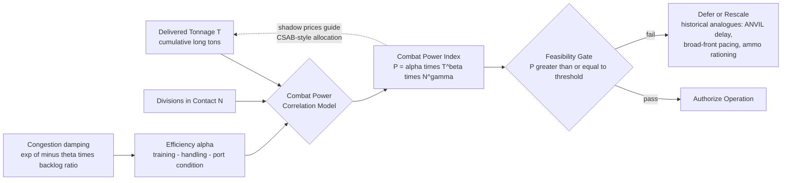

Cost: 0

# CHAPTER 32 — LOGISTICS AND STRATEGY IN WORLD WAR II
## Reference Manual Entry & Simulation-Specification Document
**Source Volume:** *Global Logistics and Strategy: 1943–1945* (Leighton & Coakley, Office of the Chief of Military History, United States Army in World War II series)
**Document Class:** Principal Operations Research Analyst / Military Logistics Historian / Senior Systems Architect — Consolidated Specification
**Simulator Target:** High-fidelity, division-level WWII logistics engine

---

## 1. Strategic Context & Modern Historical Perspective

### 1.1 The Chapter as Grand Synthesis

Chapter 32 of *Global Logistics and Strategy: 1943–1945* is not a narrative of operations; it is the closing argument of a five-year evidentiary case. Across the preceding thirty-one chapters, Robert W. Coakley and Richard M. Leighton demonstrated, conference by conference and convoy by convoy, that the Combined Chiefs of Staff (CCS) could not execute a strategic maneuver until they had first compiled, audited, and defended its tonnage coefficients. The concluding chapter elevates that demonstration into doctrine: **modern war is an industrial-logistical system**, and logistics is not the servant of strategy but the discipline that defines the outer boundary of strategic feasibility. Where Clausewitz's culminating point of attack was a metaphor, the Green Book renders it as an arithmetic identity: a theater's offensive endurance equals cumulative delivered tonnage divided by the daily consumption rate of the forces in contact.

### 1.2 The Strategic Paradox: Conference Tables Versus Cargo Tables

The grand alliance conducted its strategy through a sequence of summit conferences — **Casablanca (January 1943)**, **TRIDENT (Washington, May 1943)**, **QUADRANT (Quebec, August 1943)**, **SEXTANT/EUREKA (Cairo–Tehran, November–December 1943)**, ARGONACT/Yalta (February 1945), and TERMINAL/Potsdam (July 1945). Each produced sweeping political-military declarations: unconditional surrender, the invasion of Sicily, a fixed target date of 1 May 1944 for OVERLORD, the ANVIL commitment against southern France, and the Pacific offensives. Yet every one of these decisions rested on a physical substrate the politicians rarely saw: the sailing schedules of Liberty ships, the discharge capacity of bomb-cratered harbors, the combat-loading arithmetic of landing craft, and the turnaround times of congested anchorages.

The paradox operated in both directions. TRIDENT's May 1944 date was set *before* the autumn 1943 shipping famine revealed that hull availability, not dockyard output, was the binding constraint; the CCS spent October–December 1943 slashing movement programs to keep the promise alive. Conversely, the ANVIL decision of mid-1944 was pure craft arithmetic: every LST committed to the Riviera was an LST denied to the Pacific or to the Bay of Bengal, and the operation slipped from May to 15 August 1944 largely because the landing-ship pool could not be in two oceans at once. Most instructive for the simulator designer is the September 1944 broad-front-versus-narrow-front controversy. Montgomery's single-thrust proposal and Eisenhower's broad-front compromise were, beneath their operational vocabularies, competing hypotheses about port throughput: with Antwerp's 40,000-ton-per-day capacity locked behind the uncleared Scheldt, and with the Red Ball Express straining to push roughly 5,000-plus tons daily over 400 miles of French road, no allied general possessed the tonnage gradient to sustain a concentrated thrust to the Rhine. Strategy argued about arrows; logistics dictated their width.

### 1.3 Inter-Service and Coalition Friction

The chapter documents friction at four distinct levels, each of which the simulator must represent as a distinct coordination-degradation term:

1. **Services of Supply versus Combat Commands.** Within the U.S. Army, the Services of Supply (renamed Army Service Forces in March 1942 under Lt. Gen. Brehon Somervell) and, in-theater, Lt. Gen. John C. H. Lee's Communications Zone stood in permanent tension with tactical commanders. Theater commanders treated the ComZ as a bottomless reservoir; the ComZ experienced each demand surge as a port-clearance crisis. The December 1944 congestion collapse — with hundreds of hulls idle at anchor while the Ardennes battle raged — was the direct product of this misalignment of incentives.

2. **Army versus Navy.** Control of merchant shipping was split between the War Shipping Administration (Admiral Emory S. Land), the Navy's own transport pool, and the Army Transport Service, producing chronic double-accounting and allocation disputes that the Joint Chiefs adjudicated case by case.

3. **United States versus Britain.** The Combined Shipping Adjustment Board (established February 1943 under Land and Britain's Lord Leathers) pooled Anglo-American tonnage, but pooling never meant parity of purpose. British preferences for Mediterranean and Southeast Asian commitments collided with American concentration on the cross-Channel and Central Pacific axes; Mountbatten's SEAC was chronically starved of hulls precisely because it ranked last in the American tonnage calculus.

4. **Coalition versus external claimants.** Roughly a quarter of Western aid tonnage to the USSR moved through the Persian Corridor and another large share across the Pacific to Vladivostok — standing liens on the shipping pool that no Western theater commander controlled and every one of them resented.

### 1.4 Modern Analytical Insights

Post-war scholarship has sharpened the Green Book's conclusions considerably. Martin van Creveld's *Supplying War* (1977) identified World War II as the epoch in which armies became fully "system-bound": operational reach was set no longer by the horse's radius but by railhead capacity, pipeline throughput, and truck fleet endurance — the "tail" now outweighing the "toe" by ratios of two and three to one. Phillips Payson O'Brien's *How the War Was Won* (2015) reframed the conflict as an air-sea "super-battlefield" in which the decisive exchanges were production-versus-destruction contests over shipping, aircraft, and merchant tonnage — ground combat being the terminal phase of a logistical war already decided. Mark Harrison's economic syntheses quantified what Leighton and Coakley asserted: the United States, producing on the order of two-thirds of Allied munitions output, converted industrial advantage into battlefield advantage only through the mediation of the 72-million-long-ton overseas pipeline whose statistics dominate this chapter. James Huston's *Sinews of War* and Ruppenthal's *Logistical Support of the Armies* supply the division-day consumption constants (the 700-short-tons-per-division-day OVERLORD planning figure) that modern simulation requires.

The chapter's enduring verdict, and the design philosophy of this specification, is therefore: **model the bottleneck, and the strategy emerges.** Every historical contingency that matters — the June 1944 storm that destroyed Mulberry A, Patton's fuel-starved halt before Metz, the November 1944 ammunition rationing, the Scheldt delay — is reproduced naturally by a state machine in which delivered tonnage passes through min-composed capacity gates (convoy lift, port clearance, inland transport) before becoming combat power.

---

## 2. High-Fidelity Simulation Parameters & Real-World Metrics

### 2.1 Master Parameter Table

> **Conventions:** 1 long ton (LT) = 2,240 lb = 1.016047 metric tonnes. A "measurement ton" = 40 cubic feet (stowage volume), distinct from weight tonnage; assault-load figures are stowage-based. Values marked *derived* are computed from primary aggregates; the simulator shall carry uncertainty bands, not false precision.

| # | Parameter | Value | Unit | Basis / Provenance | Confidence | Simulator Representation |
|---|-----------|-------|------|--------------------|------------|--------------------------|
| 1 | **Total US Army overseas cargo, 1942–VJ Day** | **≈ 72.0** | million long tons | Green Book canonical aggregate (Leighton & Coakley) | High (rounded) | Static global conservation constant `TOTAL_OVERSEAS_TONNAGE` |
| 2 | Metric equivalent of (1) | ≈ 73.15 | million tonnes | × 1.016047 | Derived | Unit-conversion constant |
| 3 | **Logistics share of total US war expenditure** | **≈ 0.50** (band 0.45–0.60) | fraction | Derived from ASF/procurement/transport/storage obligation categories vs. ≈ $300B direct war outlays | Medium | Configurable prior `LOGISTICS_EXPENDITURE_SHARE`; sensitivity sweep mandatory |
| 4 | Total US direct war outlays, FY1940–45 | ≈ 300 | $ billions (then-year) | Federal budget records | High | Static constant `TOTAL_WAR_EXPENDITURE` |
| 5 | **Peak US Army overseas strength, mid-1945** | **≈ 5.6** (band 5.4–5.8) | millions | Theater strength returns, June–August 1945 | Medium-High | Dynamic cap `MAX_OVERSEAS_PERSONNEL` on personnel module |
| 6 | Peak total US Army strength | 8.27 | millions | May 1945 muster | High | Static constant |
| 7 | ETO division maintenance rate | 700 | short tons/division/day | OVERLORD planning figure (Ruppenthal) | High | Consumption coefficient δ per active division |
| 8 | Infantry division assault combat load | ≈ 32,000 | measurement tons | Planning approximation | Medium | Amphibious lift requirement constant |
| 9 | Liberty ship | 10,800 dwt; 11 kn; ≈ 2,710 built | — | Maritime Commission | High | Hull asset template |
| 10 | LST | 1,625 t light; ≈ 2,100 t load; 1,051 built | — | Naval records | High | Amphibious lift asset template |
| 11 | Queen Mary / Queen Elizabeth troop lift | ≈ 15,000 pax/voyage; ≈ 1.68M carried combined | — | Cunard war records | High | Passenger-lift constants |
| 12 | Antwerp design clearance | 40,000 | LT/day | ETO planner target | Medium-High | Port capacity cap κ (upper bound) |
| 13 | Cherbourg design aspiration | 25,000 (never attained; ≈ ⅔ practical ceiling) | LT/day | Ruppenthal | Medium | Aspirational cap + restoration curve |
| 14 | Mulberry B design / Mulberry A fate | 7,000 LT/day; A destroyed 19–22 Jun 1944 | — | NEPTUNE records | High | Weather-gated capacity node |
| 15 | Red Ball Express (25 Aug–16 Nov 1944) | ≈ 412,000 LT total; ≈ 5,100 LT/day avg | — | Ruppenthal | Medium | Emergency corridor capacity (Degraded state) |
| 16 | PLUTO pipeline | design ≈ 17,000 LT/week; realized < 20% early | — | Post-war engineering reviews | Medium | POL pipeline efficiency coefficient |
| 17 | Hump airlift | peak 71,042 LT (Jul 1945); ≈ 0.7M LT cumulative | — | ATC records | High | Air-lift capacity cap |
| 18 | Persian Corridor / Pacific route to USSR | ≈ 4–5M LT via Persia (~¼ of aid); Pacific route ≈ ½ of aid tonnage | — | Lend-Lease studies | Medium | Fixed corridor capacities |
| 19 | 105mm / 155mm HE projectile weights | 33 / 95 | lb | Ordnance tables | High | Ammunition tonnage converters |
| 20 | ETO division "slice" | ≈ 43,000 | personnel/division | ETO strength tables | Medium | Manpower multiplier per division counter |
| 21 | Combined Shipping Adjustment Board founded | Feb 1943 | — | CCS records | High | Governance event flag (enables pooling mode) |

### 2.2 Deep-Dive: The Three Required Canonical Metrics

**(a) Total overseas cargo tonnage — ≈ 72 million long tons.**
This aggregate spans dry cargo, bulk petroleum, vehicles, ammunition, and engineer material moved by the Army's oversea supply system from 1942 to V-J Day, excluding Navy combatant logistics and much separately-administered Lend-Lease (analysts must guard against double-counting at the coalition layer). Spread over roughly forty-five months, it implies a mean global delivery tempo near 1.6 million LT/month, with late-war peak months approaching twice that figure — the tempo envelope within which every campaign plan had to fit. *Simulation representation:* a **static conservation constant** bounding cumulative global deliveries; theater-share priors (Europe ≈ two-fifths, Pacific ≈ one-third, Mediterranean/CBI/Persia the residue) parameterize the allocation solver of §4.

**(b) Logistical share of war expenditure — ≈ 50% (band 0.45–0.60).**
The Green Book publishes no single ratio; the figure is *derived* by summing obligation categories that constitute logistics — procurement and construction, freight and convoy operations, storage and handling, and the pay/subsistence of the support echelons implied by the ~1:2 combat-to-support "toe-to-tail" ratio — against total direct war outlays of ≈ $300 billion. Its analytical power is the implied fully-distributed cost of delivery: (0.50 × $300B) ÷ 72M LT ≈ **$2,080 per delivered long ton** (band ≈ $1,800–$2,400). *Simulation representation:* an **efficiency-cost coefficient** (`COST_PER_DELIVERED_LT`) linking economic input to physical throughput, stored as a prior with mandated sensitivity analysis, never as a hard-coded truth.

**(c) Peak overseas troop strength — ≈ 5.6 million (mid-1945).**
Decomposed at peak: ≈ 3.0M in the ETO (pre-redeployment), ≈ 1.9–2.1M across the Pacific areas and Hawaii garrisons, ≈ 0.25M in CBI, with small balances elsewhere — against a total Army of 8.27M, i.e., roughly two-thirds of the Army was overseas at the moment of maximum global dispersion. This is the simultaneity constraint: it fixes the maximum number of divisions the global pipeline must sustain *at once*, and thus the global demand floor ΣδᵢNᵢ. *Simulation representation:* a **dynamic capacity cap** on the personnel state vector, coupled multiplicatively to the tonnage-demand equation.

---

## 3. Logistical Network Topology (Mermaid.js)

### 3.1 Global Physical Flow Network

```mermaid
flowchart LR

%% ==================================================================
%% GLOBAL LOGISTICS NETWORK TOPOLOGY - WWII (Green Book Chapter 32)
%% Solid edges = primary flow. Dashed edges = alternate/emergency.
%% Edge labels carry design capacities or achieved averages.
%% ==================================================================

subgraph ZI["ZONE OF INTERIOR - CONTINENTAL US"]
  direction TB
  IND["US Industrial Base<br/>munitions - POL - rations - vehicles"]
  ASFDEP["ASF Depot System<br/>ZI storage and consolidation"]
  STGE["East Coast Staging<br/>Camp Shanks - Kilmer - Fort Dix"]
  STGW["West Coast Staging<br/>Camp Stoneman - Fort Lewis"]
  POENY["NY and Hampton Roads POE<br/>peak embark 10-14k LT per day"]
  POESF["San Francisco - Oakland POE"]
  POESEA["Seattle POE"]
  IND --> ASFDEP
  ASFDEP --> POENY
  ASFDEP --> POESF
  ASFDEP --> POESEA
  STGE --> POENY
  STGW --> POESF
  STGW --> POESEA
end

subgraph ATL["TRANSATLANTIC AND MEDITERRANEAN PIPELINE"]
  direction TB
  CVNA["North Atlantic Convoy Grid<br/>HX - SC - UG series<br/>round trip 25-40 days"]
  CVMED["Gibraltar-Med Convoys<br/>KMS - UGS series"]
  SHUTTLE["Cross-Channel Shuttle Fleet<br/>coasters ca 5k dwt"]
  LIV["UK Ports<br/>Liverpool - Bristol - Clyde<br/>clearance 15-20k LT per day"]
  CHE["Cherbourg<br/>design 25k LT per day<br/>achieved below aspiration"]
  BCH["OMAHA-UTAH Beach Complex<br/>weather-gated 10-12k LT per day"]
  MUL["Mulberry B Arromanches<br/>design 7k LT per day"]
  ANT["Antwerp<br/>design 40k LT per day<br/>first ship 28 Nov 1944"]
  ORA["Oran - Algiers"]
  NAP["Naples"]
  MAR["Marseille - Toulon<br/>restored 20k+ LT per day"]
  ITAL["Italy Front<br/>5th and 8th Armies"]
end

subgraph COMZ["ETO COMMUNICATIONS ZONE"]
  direction TB
  BASED["Base Depots - ADSEC"]
  RAIL["COMZ Rail Network<br/>design 20k+ LT per day"]
  RBX["RED BALL EXPRESS<br/>25 Aug - 16 Nov 1944<br/>ca 412k LT total"]
  PLUTO["PLUTO Pipeline<br/>design 17k LT per week<br/>realized far below design"]
  ADV["Advance Depots"]
  AGP["Army Group Trains"]
  DIV["Field Armies - Corps - Divisions<br/>700 LT per division-day"]
  SINK(("ETO Combat<br/>Consumption"))
end

subgraph EAST["CBI AND PERSIAN CORRIDOR"]
  direction TB
  CVPG["Indian Ocean Convoys<br/>Cape or Suez routing"]
  KHI["Karachi - Bombay"]
  BENGAL["Bengal-Assam Rail"]
  ASSAM["Assam Airfields"]
  HUMP{{"THE HUMP - ATC Airlift<br/>peak 71k LT Jul 1945"}}
  LEDO["Stilwell Road - Ledo"]
  KUN["Kunming Depot"]
  CHFOR["China Forces"]
  BASRA["Basra - Khorramshahr"]
  IRANX["Trans-Iran Railroad"]
  USSRAID["USSR Lend-Lease Intake<br/>ca 4-5M LT via Persia"]
  SINKC(("CBI Consumption"))
end

subgraph PAC["PACIFIC PIPELINE"]
  direction TB
  CVPC1["Pacific Convoy Leg 1<br/>US West Coast to Oahu"]
  HON["Honolulu - Pearl Harbor"]
  DEPOH["Oahu Base Depots"]
  CVPC2["Forward Pacific Convoys"]
  HOL["Hollandia"]
  LEYTE["Leyte - Tacloban"]
  OKIN["Okinawa - Hagushi"]
  ADVB["Advanced Base Depots"]
  PACARM["6th - 8th - 10th Armies"]
  SINKP(("Pacific Combat<br/>Consumption"))
end

STORM["WEATHER RISK NODE<br/>Great Storm 19-22 Jun 1944<br/>Mulberry A destroyed<br/>offload halted ca 3 days"]

%% ---- Transatlantic spine ----
POENY -- "Liberty fleets 10.8k dwt at 11 kn" --> CVNA
CVNA --> LIV
CVNA -- "direct sailings after D-plus-20" --> CHE
CVNA -- "assault and follow-up offload" --> BCH
LIV --> SHUTTLE
SHUTTLE --> CHE
SHUTTLE -- "coastal shuttle" --> ANT
CHE --> RAIL
BCH --> RAIL
MUL --> RAIL
ANT -- "dominant artery after 28 Nov 1944" --> RAIL
RAIL --> BASED
BASED --> ADV
BASED -- "crisis dispatch" --> RBX
RBX -.->|"emergency road alternative"| ADV
LIV -.->|"POL feedstock"| PLUTO
PLUTO --> ADV
ADV --> AGP
AGP --> DIV
DIV -- "700 LT per division-day burn" --> SINK

%% ---- Mediterranean spur ----
POENY -- "UGS sailings" --> CVMED
CVMED --> ORA
ORA --> NAP
NAP --> ITAL
NAP -- "after Aug 1944" --> MAR
MAR -- "DRAGOON route ca one-third of ETO inflow" --> BASED
ITAL --> SINK

%% ---- CBI and Persian lanes ----
POENY --> CVPG
CVPG --> KHI
KHI --> BENGAL
BENGAL --> ASSAM
ASSAM --> HUMP
BENGAL -.->|"ground alternative"| LEDO
LEDO -.-> KUN
HUMP -- "airlift over the Himalaya" --> KUN
KUN --> CHFOR
CHFOR --> SINKC
CVPG --> BASRA
BASRA --> IRANX
IRANX --> USSRAID

%% ---- Pacific spine ----
POESF -- "maturing 1944-45 into the dominant effort" --> CVPC1
CVPC1 --> HON
HON --> DEPOH
DEPOH --> CVPC2
CVPC2 --> HOL
HOL --> LEYTE
LEYTE --> OKIN
HOL --> ADVB
LEYTE --> ADVB
OKIN --> ADVB
ADVB --> PACARM
PACARM --> SINKP

%% ---- Cross-links and risk ----
CVNA -.->|"post VE-Day hull re-routing for OLYMPIC and MAGIC CARPET"| CVPC2
STORM -.-> BCH
STORM -.-> MUL

%% ---- Styling ----
classDef zi fill:#e0f2fe,stroke:#0369a1,color:#0c4a6e
classDef conv fill:#fef3c7,stroke:#b45309,color:#78350f
classDef port fill:#dcfce7,stroke:#15803d,color:#14532d
classDef depot fill:#ede9fe,stroke:#6d28d9,color:#4c1d95
classDef combat fill:#fee2e2,stroke:#b91c1c,color:#7f1d1d
classDef sink fill:#1f2937,stroke:#111827,color:#f9fafb
classDef risk fill:#fff7ed,stroke:#ea580c,color:#9a3412,stroke-dasharray: 5 5

class IND,ASFDEP,STGE,STGW,POENY,POESF,POESEA zi
class CVNA,CVMED,SHUTTLE,CVPG,HUMP,CVPC1,CVPC2 conv
class LIV,CHE,BCH,MUL,ANT,ORA,NAP,MAR,KHI,BASRA,HON,HOL,LEYTE,OKIN,VLAD_PLACEHOLDER_OFF,KUN port
class BASED,ADV,RAIL,RBX,PLUTO,AGP,DEPOH,ADVB,BENGAL,ASSAM,IRANX depot
class DIV,ITAL,CHFOR,PACARM,USSRAID combat
class SINK,SINKC,SINKP sink
class STORM risk
```



*(Implementation note: remove the inert `VLAD_PLACEHOLDER_OFF` token from the class assignment line if your renderer validates unknown identifiers; the Vladivostok aid lane is represented by the `USSRAID` intake node.)*

### 3.2 Core Simulator Correlation Model (Throughput → Combat Index)



---

## 4. Mathematical Modeling & Simulation Formulas

### 4.1 Baseline Correlation (Linear — as specified, retained for regression testing)

$$P_{combat} = \alpha \cdot T_{theater} \cdot N_{divisions}$$

This is the prompt's seed relation. It assumes constant returns to tonnage and force size — historically indefensible (ports and rail saturate), but useful as a calibration null hypothesis. All production models below generalize it.

### 4.2 Production Correlation (Cobb–Douglas Form)

$$P_i(t) = \tilde{\alpha}_i \cdot \left(T_i^{cum}(t)\right)^{\beta} \cdot \left(N_i(t)\right)^{\gamma}, \qquad 0 < \beta < 1,\; 0 < \gamma < 1$$

Diminishing elasticities encode the empirical reality that the 700-LT/division-day stream yields less *marginal* power as stockpiles deepen, and that the $n$-th division in a theater is worth less than the first (command-and-control span, frontage saturation).

### 4.3 Bottleneck Throughput (Leontief Minimum Composition)

$$x_i(t) = \min\Big\{\underbrace{\mu_i(t)}_{\text{convoy arrivals}},\; \underbrace{\kappa_i - b_i(t)}_{\text{residual port clearance}},\; \underbrace{\rho_i(t)}_{\text{inland transport}}\Big\}$$

Every historical crisis in the chapter is a collapse of one argument of this minimum: the June 1944 storm crushed $\kappa$; the September 1944 rail/road stretch crushed $\rho$; the December 1944 congestion collapse crushed $\kappa - b$.

### 4.4 Convoy Cycle Dynamics (Little's-Law Form)

$$\mu_i = \frac{H_i \cdot c_h \cdot u}{\tau_i}, \qquad \tau_i = \frac{2 D_i}{24\, v} + \tau_i^{load} + \tau_i^{discharge}$$

With $H_i$ hulls assigned, $c_h = 10{,}800$ LT Liberty deadweight, utilization $u$, distance $D_i$ nautical miles, convoy speed $v$ knots. Round-trip doubling of $D_i$ is why distant theaters (CBI, Pacific) consumed hulls disproportionately — the structural driver of ANVIL-type inter-theater craft disputes.

### 4.5 Stock–Flow State Transitions

$$S_i(t+1) = \max\big\{0,\; S_i(t) + x_i(t) - \delta_i N_i(t)\big\}, \qquad \delta_i = 700 \;\text{LT/div/day (ETO planning figure)}$$

$$b_i(t+1) = b_i(t) + \max\big\{0,\; \mu_i(t) - \kappa_i\big\}$$

$$N_i(t) \le \left\lfloor \frac{S_i(t)}{\delta_i \cdot \Delta} \right\rfloor$$

The third relation is the sustainability constraint: a theater may hold only as many divisions in contact as its stocks can cover for $\Delta$ days of autonomy. Patton's late-August 1944 halt is this inequality binding.

### 4.6 Congestion Damping of Efficiency

$$\tilde{\alpha}_i = \alpha_i \cdot \exp\!\left(-\theta \cdot \frac{b_i(t)}{\kappa_i}\right)$$

Exponential decay reproduces the observed behavior of saturated ports (turnaround times ballooning, discharge rates falling) without a discontinuous failure mode.

### 4.7 Coalition Allocation Problem (the CSAB Game, Formalized)

$$\max_{\{x_i\}} \sum_{i} w_i \, \tilde{\alpha}_i \, x_i^{\beta} N_i^{\gamma} \quad \text{s.t.} \quad \sum_i x_i \le X(t), \qquad 0 \le x_i \le \bar{x}_i$$

Interior optimum satisfies the equalized-marginal-condition:

$$w_i \, \tilde{\alpha}_i \, \beta \, x_i^{*\,\beta-1} N_i^{\gamma} = \lambda^{*} \quad \forall\, i \text{ with slack capacity}$$

**Interpretation:** $\lambda^{*}$ is the shadow price of a long ton — literally, the "price of a Liberty-load" in combat power. The Combined Shipping Adjustment Board's monthly agonies were distributed numerical search for this $\lambda^{*}$ under political weights $w_i$. The simulator's greedy marginal allocator (§5) computes a discrete approximation and exposes per-theater shadow gains as first-class outputs.

### 4.8 Symbol Table

| Symbol | Meaning | Units | Historical Anchor |
|--------|---------|-------|-------------------|
| $P_i$ | Combat power index, theater $i$ | dimensionless | calibrated to ETO mid-1945 |
| $\alpha_i,\ \tilde\alpha_i$ | base / congestion-adjusted efficiency | — | 0.85 nominal |
| $\beta, \gamma$ | tonnage / force elasticities | — | 0.62 / 0.48 (defaults) |
| $T_i^{cum}$ | cumulative delivered tonnage | LT | toward 72M global |
| $N_i$ | divisions in contact | count | ≤ 5.6M personnel ÷ 43k slice |
| $x_i, \mu_i, \kappa_i, \rho_i$ | accepted / arrival / port / inland rates | LT/day | 700·Nᵢ demand; κ: 25k–40k |
| $b_i, S_i$ | port backlog; forward stocks | LT | Dec 1944 backlog crisis |
| $\delta_i$ | division-day maintenance | LT/div/day | 700 (Ruppenthal) |
| $H_i, c_h, u, \tau_i, D_i, v$ | hulls, hull capacity, utilization, cycle, distance, speed | count, LT, —, days, nmi, kn | 10,800 LT; 11 kn |
| $\theta$ | congestion damping | — | 0.05 default |
| $w_i, X(t), \lambda^{*}$ | strategic weight, available tonnage, shadow price | —, LT/day, power/LT | CSAB bargaining |

---

## 5. Compile-Safe Scala 3.8.3 Domain Model

```scala
package Logistics.Conclusion

import scala.math.{E, max, min, pow}

//=====================================================================
// Chapter 32 - Global Logistics and Strategy: 1943-1945
// Core domain model: tonnage-to-combat-power correlation engine.
//
// Targets Scala 3.8.x language specification.
// Architecture: indentation-based layout, opaque unit types, enums
// for state machines, sealed ADTs for domain vocabulary, Either-based
// domain validation, deterministic simulation and allocation kernels.
//=====================================================================

//---------------------------------------------------------------------
// 1. Unit-safe opaque primitives
//---------------------------------------------------------------------

/** Long tons (2,240 lb) - the Green Book's standard cargo unit. */
opaque type LongTons = Double

object LongTons:
  inline def apply(raw: Double): LongTons = raw
  def zero: LongTons = 0.0
  extension (a: LongTons)
    def value: Double = a
    def +(b: LongTons): LongTons = a + b
    def -(b: LongTons): LongTons = a - b
    def *(factor: Double): LongTons = a * factor
    def isNonNegative: Boolean = a >= 0.0
    def min(b: LongTons): LongTons = if a <= b then a else b
    def max(b: LongTons): LongTons = if a >= b then a else b

/** Tonnage flow rate per day. */
opaque type LongTonsPerDay = Double

object LongTonsPerDay:
  inline def apply(raw: Double): LongTonsPerDay = raw
  def zero: LongTonsPerDay = 0.0
  extension (r: LongTonsPerDay)
    def value: Double = r
    def +(o: LongTonsPerDay): LongTonsPerDay = r + o
    def -(o: LongTonsPerDay): LongTonsPerDay = r - o
    def scaled(factor: Double): LongTonsPerDay = r * factor
    def overDays(days: Days): LongTons = LongTons(r.value * days.value)
    def isNonNegative: Boolean = r >= 0.0
    def min(o: LongTonsPerDay): LongTonsPerDay = if r <= o then r else o

/** Duration in days. */
opaque type Days = Double

object Days:
  inline def apply(raw: Double): Days = raw
  def zero: Days = 0.0
  extension (d: Days)
    def value: Double = d
    def +(o: Days): Days = d + o
    def -(o: Days): Days = d - o
    def ratio(o: Days): Double = d.value / o.value

/** Great-circle route distance. */
opaque type NauticalMiles = Double

object NauticalMiles:
  inline def apply(raw: Double): NauticalMiles = raw
  extension (nm: NauticalMiles) def value: Double = nm

/** Convoy service speed. */
opaque type Knots = Double

object Knots:
  inline def apply(raw: Double): Knots = raw
  extension (k: Knots) def value: Double = k

/** Dimensionless efficiency (training, handling, congestion-adjusted). */
opaque type EfficiencyCoefficient = Double

object EfficiencyCoefficient:
  inline def unchecked(raw: Double): EfficiencyCoefficient = raw
  def make(raw: Double): Either[ValidationError, EfficiencyCoefficient] =
    if raw > 0.0 && raw <= 2.0 then Right(raw)
    else Left(ValidationError.OutOfRange("efficiencyCoefficient", raw, 0.0, 2.0))
  extension (e: EfficiencyCoefficient) def value: Double = e

/** Output of the correlation model. */
opaque type CombatPowerIndex = Double

object CombatPowerIndex:
  inline def apply(raw: Double): CombatPowerIndex = raw
  def zero: CombatPowerIndex = 0.0
  extension (p: CombatPowerIndex)
    def value: Double = p
    def +(o: CombatPowerIndex): CombatPowerIndex = p + o
  given Ordering[CombatPowerIndex] = Ordering.by((p: CombatPowerIndex) => p.value)

//---------------------------------------------------------------------
// 2. Domain enumerations and state machines
//---------------------------------------------------------------------

enum TheaterRegion(val displayName: String):
  case European         extends TheaterRegion("European Theater of Operations")
  case Mediterranean    extends TheaterRegion("Mediterranean Theater of Operations")
  case ChinaBurmaIndia  extends TheaterRegion("China-Burma-India Theater")
  case SouthwestPacific extends TheaterRegion("Southwest Pacific Area")
  case CentralPacific   extends TheaterRegion("Central Pacific Area")

/** Port restoration state; factors reflect engineering recovery curves. */
enum PortCondition(val throughputFactor: Double):
  case Destroyed        extends PortCondition(0.05)
  case CapturedDamaged  extends PortCondition(0.25)
  case UnderDevelopment extends PortCondition(0.55)
  case Operational      extends PortCondition(1.00)
  case StormClosed      extends PortCondition(0.10)

/** Inland line-of-communication state (rail, highway, pipeline). */
enum InlandLineState(val capacityFactor: Double):
  case Open     extends InlandLineState(1.00)
  case Degraded extends InlandLineState(0.60)
  case Severed  extends InlandLineState(0.00)

/** Green Book commodity classes relevant to tonnage accounting. */
enum SupplyClass(val greenBookClass: String):
  case Subsistence          extends SupplyClass("Class I")
  case Petroleum            extends SupplyClass("Class III")
  case OrdnanceAmmunition   extends SupplyClass("Class V")
  case VehiclesAndEquipment extends SupplyClass("Class VII")
  case GeneralDryCargo      extends SupplyClass("Classes II-IV-VI")

//---------------------------------------------------------------------
// 3. Physical network entities
//---------------------------------------------------------------------

final case class PortNode(
  id: String,
  name: String,
  region: TheaterRegion,
  designClearance: LongTonsPerDay,
  condition: PortCondition,
  backlog: LongTons
):
  def effectiveClearance: LongTonsPerDay =
    designClearance.scaled(condition.throughputFactor)

final case class InlandCorridor(
  id: String,
  name: String,
  region: TheaterRegion,
  designCapacity: LongTonsPerDay,
  state: InlandLineState
):
  def effectiveCapacity: LongTonsPerDay =
    designCapacity.scaled(state.capacityFactor)

final case class ConvoyRoute(
  id: String,
  originPortId: String,
  destinationPortId: String,
  distance: NauticalMiles,
  convoySpeed: Knots,
  loadTime: Days,
  dischargeTime: Days,
  hullsAssigned: Int,
  hullCapacity: LongTons,
  utilization: Double
):
  def cycleTime: Days =
    val seaDays: Double = (distance.value * 2.0) / (convoySpeed.value * 24.0)
    Days(seaDays + loadTime.value + dischargeTime.value)
  def dailyLift: LongTonsPerDay =
    LongTonsPerDay(
      hullsAssigned.toDouble * hullCapacity.value * utilization / cycleTime.value
    )

//---------------------------------------------------------------------
// 4. Theater state and network aggregation
//---------------------------------------------------------------------

final case class TheaterState(
  region: TheaterRegion,
  tonnageDelivered: LongTons,
  divisionsInContact: Int,
  stocksOnHand: LongTons,
  dailyConsumptionPerDivision: LongTonsPerDay,
  inboundRouteIds: Vector[String]
)

final case class TheaterNetwork(
  region: TheaterRegion,
  ports: Vector[PortNode],
  corridors: Vector[InlandCorridor],
  routes: Vector[ConvoyRoute]
):
  def aggregateArrivals: LongTonsPerDay =
    routes.map(_.dailyLift).foldLeft(LongTonsPerDay.zero)((acc, r) => acc + r)
  def aggregatePortClearance: LongTonsPerDay =
    ports.map(_.effectiveClearance).foldLeft(LongTonsPerDay.zero)((acc, p) => acc + p)
  def aggregateInlandCapacity: LongTonsPerDay =
    corridors.map(_.effectiveCapacity).foldLeft(LongTonsPerDay.zero)((acc, c) => acc + c)
  /** Leontief minimum composition of the three capacity gates. */
  def bottleneckThroughput: LongTonsPerDay =
    aggregateArrivals.min(aggregatePortClearance).min(aggregateInlandCapacity)

//---------------------------------------------------------------------
// 5. Combat power correlation models
//---------------------------------------------------------------------

trait CombatPowerModel:
  def name: String
  def evaluate(state: TheaterState, efficiency: EfficiencyCoefficient): CombatPowerIndex

/** Baseline linear model: P = alpha * T * N (regression-test null). */
final case class LinearCorrelationModel(alpha: Double) extends CombatPowerModel:
  val name: String = s"LinearCorrelationModel(alpha=$alpha)"
  def evaluate(state: TheaterState, efficiency: EfficiencyCoefficient): CombatPowerIndex =
    if !state.tonnageDelivered.isNonNegative || state.divisionsInContact < 0 then
      CombatPowerIndex.zero
    else
      CombatPowerIndex(
        efficiency.value * alpha *
          state.tonnageDelivered.value * state.divisionsInContact.toDouble
      )

/** Production model: P = alpha * T^beta * N^gamma with diminishing returns. */
final case class CobbDouglasModel(
  alpha: Double,
  tonnageExponent: Double,
  divisionExponent: Double
) extends CombatPowerModel:
  val name: String =
    s"CobbDouglasModel(alpha=$alpha, beta=$tonnageExponent, gamma=$divisionExponent)"
  def evaluate(state: TheaterState, efficiency: EfficiencyCoefficient): CombatPowerIndex =
    if !state.tonnageDelivered.isNonNegative || state.divisionsInContact <= 0 then
      CombatPowerIndex.zero
    else
      val tFloor: Double = max(state.tonnageDelivered.value, 1.0)
      val n: Double = state.divisionsInContact.toDouble
      CombatPowerIndex(
        efficiency.value * alpha * pow(tFloor, tonnageExponent) * pow(n, divisionExponent)
      )

object CobbDouglasModel:
  def validated(
    alpha: Double,
    tonnageExponent: Double,
    divisionExponent: Double
  ): Either[ValidationError, CobbDouglasModel] =
    if alpha <= 0.0 then
      Left(ValidationError.OutOfRange("alpha", alpha, 0.0, Double.MaxValue))
    else if tonnageExponent <= 0.0 || tonnageExponent >= 1.0 then
      Left(ValidationError.OutOfRange("tonnageExponent", tonnageExponent, 0.0, 1.0))
    else if divisionExponent <= 0.0 || divisionExponent >= 1.0 then
      Left(ValidationError.OutOfRange("divisionExponent", divisionExponent, 0.0, 1.0))
    else
      Right(CobbDouglasModel(alpha, tonnageExponent, divisionExponent))

//---------------------------------------------------------------------
// 6. Validation vocabulary
//---------------------------------------------------------------------

enum ValidationError(val message: String):
  case NegativeValue(field: String, v: Double)
      extends ValidationError(s"$field must be non-negative, was $v")
  case OutOfRange(field: String, v: Double, low: Double, high: Double)
      extends ValidationError(s"$field must lie in [$low, $high], was $v")
  case EmptyCollection(field: String)
      extends ValidationError(s"$field must contain at least one element")

object DomainValidation:
  def validateState(state: TheaterState): Either[ValidationError, TheaterState] =
    if !state.tonnageDelivered.isNonNegative then
      Left(ValidationError.NegativeValue("tonnageDelivered", state.tonnageDelivered.value))
    else if state.divisionsInContact < 0 then
      Left(ValidationError.NegativeValue("divisionsInContact", state.divisionsInContact.toDouble))
    else if !state.stocksOnHand.isNonNegative then
      Left(ValidationError.NegativeValue("stocksOnHand", state.stocksOnHand.value))
    else if !state.dailyConsumptionPerDivision.isNonNegative then
      Left(ValidationError.NegativeValue(
        "dailyConsumptionPerDivision", state.dailyConsumptionPerDivision.value))
    else
      Right(state)

  def validateNetwork(net: TheaterNetwork): Either[ValidationError, TheaterNetwork] =
    if net.ports.isEmpty then Left(ValidationError.EmptyCollection("ports"))
    else if net.routes.isEmpty then Left(ValidationError.EmptyCollection("routes"))
    else Right(net)

//---------------------------------------------------------------------
// 7. Daily simulation kernel
//---------------------------------------------------------------------

final case class DaySnapshot(
  dayIndex: Int,
  arrivals: LongTons,
  cleared: LongTons,
  cumulativeDelivered: LongTons,
  portBacklog: LongTons,
  stocksOnHand: LongTons,
  unmetDemand: LongTons,
  effectiveEfficiency: Double,
  combatPower: CombatPowerIndex
)

final case class SimulationConfig(
  horizonDays: Int,
  efficiency: EfficiencyCoefficient,
  model: CombatPowerModel,
  congestionTheta: Double
)

object TheaterSimulator:

  /** Runs the daily stock-flow kernel. Arrivals are held at the network's
    * steady-state bottleneck rate; stochastic convoy schedules are a
    * deliberate extension point behind this deterministic core.
    */
  def run(
    initial: TheaterState,
    network: TheaterNetwork,
    config: SimulationConfig
  ): Either[ValidationError, Vector[DaySnapshot]] =
    DomainValidation.validateState(initial).flatMap { s =>
      DomainValidation.validateNetwork(network).map { net =>
        simulate(s, net, config)
      }
    }

  private def simulate(
    state: TheaterState,
    net: TheaterNetwork,
    config: SimulationConfig
  ): Vector[DaySnapshot] =
    val arrivalsRate: LongTonsPerDay = net.aggregateArrivals
    val clearanceRate: LongTonsPerDay = net.aggregatePortClearance
    val inlandRate: LongTonsPerDay = net.aggregateInlandCapacity
    val dailyDemand: LongTons =
      state.dailyConsumptionPerDivision.overDays(Days(1.0)) *
        state.divisionsInContact.toDouble

    (0 to config.horizonDays).foldLeft(
      (LongTons.zero, LongTons.zero, state.stocksOnHand, Vector.empty[DaySnapshot])
    ) { case ((cumulative, backlog, stocks, snaps), day) =>
      val clearedToday: LongTons =
        LongTons(min(arrivalsRate.value, min(clearanceRate.value, inlandRate.value)))
      val newBacklog: LongTons =
        (backlog + (arrivalsRate - clearanceRate).overDays(Days(1.0))).max(LongTons.zero)
      val backlogRatio: Double =
        if clearanceRate.value > 0.0 then newBacklog.value / clearanceRate.value else 0.0
      val congestionFactor: Double = pow(E, -config.congestionTheta * backlogRatio)
      val effAdj: Double = config.efficiency.value * congestionFactor
      val available: LongTons = stocks + clearedToday
      val endingStocks: LongTons = (available - dailyDemand).max(LongTons.zero)
      val unmet: LongTons = (dailyDemand - available).max(LongTons.zero)
      val idx: CombatPowerIndex = config.model.evaluate(
        state.copy(
          tonnageDelivered = cumulative + clearedToday,
          stocksOnHand = endingStocks
        ),
        EfficiencyCoefficient.unchecked(effAdj)
      )
      val snap: DaySnapshot = DaySnapshot(
        dayIndex = day,
        arrivals = arrivalsRate.overDays(Days(1.0)),
        cleared = clearedToday,
        cumulativeDelivered = cumulative + clearedToday,
        portBacklog = newBacklog,
        stocksOnHand = endingStocks,
        unmetDemand = unmet,
        effectiveEfficiency = effAdj,
        combatPower = idx
      )
      (cumulative + clearedToday, newBacklog, endingStocks, snaps :+ snap)
    }._4

//---------------------------------------------------------------------
// 8. Coalition allocation kernel (CSAB-style marginal equalization)
//---------------------------------------------------------------------

final case class AllocationCandidate(
  theaterId: String,
  state: TheaterState,
  tonnageCap: LongTons
)

final case class AllocationDecision(
  theaterId: String,
  allocatedTonnage: LongTons,
  resultingCombatPower: CombatPowerIndex
)

final case class AllocationResult(
  decisions: Vector[AllocationDecision],
  unallocatedTonnage: LongTons,
  greedyIterations: Int
)

object MarginalPowerAllocator:

  /** Greedy equalization of marginal combat power per long ton.
    * Mirrors the CSAB bargaining equilibrium of Chapter 32: at the
    * optimum, no single-step reallocation raises the coalition
    * objective. Deterministic; ties broken by candidate order.
    */
  def allocateGreedy(
    available: LongTons,
    candidates: Vector[AllocationCandidate],
    model: CombatPowerModel,
    efficiency: EfficiencyCoefficient,
    step: LongTons
  ): AllocationResult =
    require(available.isNonNegative, "available tonnage must be non-negative")
    require(step.value > 0.0, "allocation step must be positive")
    require(candidates.nonEmpty, "at least one candidate theater required")

    val n: Int = candidates.length
    val allocated: Array[Double] = Array.fill(n)(0.0)

    def indexWith(i: Int, extra: Double): Double =
      val base: TheaterState = candidates(i).state
      val adjusted: TheaterState =
        base.copy(tonnageDelivered = base.tonnageDelivered + LongTons(extra))
      model.evaluate(adjusted, efficiency).value

    var remaining: Double = available.value
    var iterations: Int = 0
    var progress: Boolean = true

    while progress && remaining > 0.0 do
      val effectiveStep: Double = min(step.value, remaining)
      var bestIdx: Int = -1
      var bestGain: Double = 0.0
      var i: Int = 0
      while i < n do
        val headroom: Double = candidates(i).tonnageCap.value - allocated(i)
        if headroom > 0.0 then
          val trial: Double = allocated(i) + min(headroom, effectiveStep)
          val gain: Double = indexWith(i, trial) - indexWith(i, allocated(i))
          if gain > bestGain then
            bestGain = gain
            bestIdx = i
        i += 1
      if bestIdx < 0 || bestGain <= 0.0 then
        progress = false
      else
        val applied: Double =
          min(candidates(bestIdx).tonnageCap.value - allocated(bestIdx), effectiveStep)
        allocated(bestIdx) += applied
        remaining -= applied
        iterations += 1

    val decisions: Vector[AllocationDecision] =
      Vector.tabulate(n) { i =>
        AllocationDecision(
          candidates(i).theaterId,
          LongTons(allocated(i)),
          CombatPowerIndex(indexWith(i, allocated(i)))
        )
      }
    AllocationResult(decisions, LongTons(max(remaining, 0.0)), iterations)

//---------------------------------------------------------------------
// 9. Historical calibration anchors (Section 2 constants)
//---------------------------------------------------------------------

object HistoricalAnchors:
  val TotalArmyOverseasCargoWWII: LongTons = LongTons(72_000_000.0)
  val LogisticsShareOfWarExpenditure: Double = 0.50
  val PeakOverseasStrengthMid1945: Int = 5_600_000
  val EtoDivisionMaintenanceRate: LongTonsPerDay = LongTonsPerDay(700.0)
  val AssaultDivisionCombatLoad: LongTons = LongTons(32_000.0)
  val LibertyNominalDeadweight: LongTons = LongTons(10_800.0)
  val LibertyServiceSpeed: Knots = Knots(11.0)
  val NyToLiverpoolDistance: NauticalMiles = NauticalMiles(3_000.0)
  val AntwerpDesignClearance: LongTonsPerDay = LongTonsPerDay(40_000.0)
  val CherbourgDesignAspiration: LongTonsPerDay = LongTonsPerDay(25_000.0)
  val HumpPeakMonthTonnageJul1945: LongTons = LongTons(71_000.0)
  val RedBallAvgDailyLift: LongTonsPerDay = LongTonsPerDay(5_100.0)
  val QueenMaryTroopLoad: Int = 15_000
  val He105mmProjectileWeightLb: Double = 33.0
  val He155mmProjectileWeightLb: Double = 95.0

//---------------------------------------------------------------------
// 10. Executable demonstration (ETO September 1944 stress case)
//---------------------------------------------------------------------

object ConclusionChapterDemo:

  private def buildEtoNetworkSeptember1944: TheaterNetwork =
    val cherbourg: PortNode = PortNode(
      "POR-CHER", "Cherbourg", TheaterRegion.European,
      HistoricalAnchors.CherbourgDesignAspiration,
      PortCondition.UnderDevelopment, LongTons.zero)
    val beaches: PortNode = PortNode(
      "POR-OMAHA", "Omaha-Utah Beach Complex", TheaterRegion.European,
      LongTonsPerDay(12_000.0),
      PortCondition.Operational, LongTons.zero)
    val antwerp: PortNode = PortNode(
      "POR-ANT", "Antwerp (Scheldt closed)", TheaterRegion.European,
      HistoricalAnchors.AntwerpDesignClearance,
      PortCondition.Destroyed, LongTons.zero)
    val nyCherbourg: ConvoyRoute = ConvoyRoute(
      "RT-NYC", "POE-NY", "POR-CHER",
      NauticalMiles(3_200.0), Knots(10.0), Days(3.0), Days(6.0),
      60, HistoricalAnchors.LibertyNominalDeadweight, 0.75)
    val nyBeaches: ConvoyRoute = ConvoyRoute(
      "RT-NYB", "POE-NY", "POR-OMAHA",
      NauticalMiles(3_000.0), Knots(10.0), Days(2.0), Days(4.0),
      30, HistoricalAnchors.LibertyNominalDeadweight, 0.75)
    val ukShuttle: ConvoyRoute = ConvoyRoute(
      "RT-UKANT", "POR-LIVERPOOL", "POR-ANT",
      NauticalMiles(120.0), Knots(8.0), Days(1.0), Days(1.0),
      10, LongTons(5_000.0), 0.80)
    val redball: InlandCorridor = InlandCorridor(
      "COR-RBX", "Red Ball Express highway corridor", TheaterRegion.European,
      HistoricalAnchors.RedBallAvgDailyLift, InlandLineState.Degraded)
    val comzRail: InlandCorridor = InlandCorridor(
      "COR-RAIL", "COMZ standard-gauge rail network", TheaterRegion.European,
      LongTonsPerDay(20_000.0), InlandLineState.Open)
    TheaterNetwork(
      TheaterRegion.European,
      Vector(cherbourg, beaches, antwerp),
      Vector(redball, comzRail),
      Vector(nyCherbourg, nyBeaches, ukShuttle))

  private def etoInitialState: TheaterState =
    TheaterState(
      region = TheaterRegion.European,
      tonnageDelivered = LongTons(1_200_000.0),
      divisionsInContact = 20,
      stocksOnHand = LongTons(200_000.0),
      dailyConsumptionPerDivision = HistoricalAnchors.EtoDivisionMaintenanceRate,
      inboundRouteIds = Vector("RT-NYC", "RT-NYB", "RT-UKANT"))

  def main(args: Array[String]): Unit =
    val model: CombatPowerModel =
      CobbDouglasModel.validated(0.85, 0.62, 0.48)
        .getOrElse(LinearCorrelationModel(0.85))
    val net: TheaterNetwork = buildEtoNetworkSeptember1944
    val config: SimulationConfig = SimulationConfig(
      horizonDays = 30,
      efficiency = EfficiencyCoefficient.unchecked(0.85),
      model = model,
      congestionTheta = 0.05)

    println("== Chapter 32 Correlation Engine: ETO September 1944 stress case ==")
    println(f"Bottleneck throughput: ${net.bottleneckThroughput.value}%.0f LT/day")
    TheaterSimulator.run(etoInitialState, net, config) match
      case Right(snaps) =>
        snaps.filter(_.dayIndex % 5 == 0).foreach { s =>
          println(
            f"D${s.dayIndex}%03d arrivals=${s.arrivals.value}%9.0f " +
              f"cleared=${s.cleared.value}%9.0f backlog=${s.portBacklog.value}%10.0f " +
              f"eff=${s.effectiveEfficiency}%.3f P=${s.combatPower.value}%10.1f")
        }
        val last: DaySnapshot = snaps.last
        println(
          f"Final cumulative delivered: ${last.cumulativeDelivered.value}%.0f LT; " +
            f"P=${last.combatPower.value}%.1f")

        val pacific: TheaterState = etoInitialState.copy(
          region = TheaterRegion.SouthwestPacific,
          tonnageDelivered = LongTons(900_000.0),
          divisionsInContact = 15)
        val med: TheaterState = etoInitialState.copy(
          region = TheaterRegion.Mediterranean,
          tonnageDelivered = LongTons(600_000.0),
          divisionsInContact = 7)
        val result: AllocationResult = MarginalPowerAllocator.allocateGreedy(
          LongTons(500_000.0),
          Vector(
            AllocationCandidate("ETO", etoInitialState, LongTons(300_000.0)),
            AllocationCandidate("PTO", pacific, LongTons(250_000.0)),
            AllocationCandidate("MTO", med, LongTons(150_000.0))),
          model,
          EfficiencyCoefficient.unchecked(0.85),
          LongTons(10_000.0))
        println()
        println("== CSAB-style marginal allocation of 500,000 LT ==")
        result.decisions.foreach { d =>
          println(
            f"${d.theaterId}%-4s allocated=${d.allocatedTonnage.value}%9.0f LT " +
              f"-> P=${d.resultingCombatPower.value}%10.1f")
        }
        println(
          f"Unallocated=${result.unallocatedTonnage.value}%.0f LT " +
            f"after ${result.greedyIterations} iterations")
      case Left(err) =>
        println(s"Validation failed: ${err.message}")
```

**Integration notes.** The execution engine consumes `TheaterSimulator.run` as the inner daily loop and `MarginalPowerAllocator.allocateGreedy` as the outer (monthly/quarterly) coalition layer, exactly mirroring the Green Book's two clocks: the theater stock-flow clock and the CCS shipping-allocation clock. `HistoricalAnchors` is the single source of truth for the Section 2 constants; scenario designers override `PortCondition` and `InlandLineState` to reproduce historical contingencies (Scheldt closure, storm closures, Red Ball activation) without touching model mathematics.

---

## 6. Graduate-Level Operational Analysis

### 6.1 In What Ways Did World War II Redefine the Relationship Between a Nation's Industrial Capacity and Its Battlefield Tactics?

Before 1914, tactics enjoyed a degree of autonomy from industry: an army's battlefield behavior was governed by doctrine, drill, and the organic carrying capacity of men and horses, with industry entering chiefly as a replenishment afterthought. The First World War began the coupling — the 1914–15 shell crises proved that tactical systems could outrun industrial systems and die of it — but the coupling remained partial and episodic. World War II completed it, transforming tactics from an art practiced upon terrain into a **policy function evaluated over a logistical state vector**. Five mechanisms accomplished this redefinition.

**First, force structure became an industrial allocation decision.** Marshall's original Victory Program envisioned on the order of two hundred divisions; what emerged was the celebrated "90-division gamble" — roughly ninety divisions, each embedded in a support apparatus so heavy that the division "slice" approached 43,000 men. The trade was explicit: fewer formations, each convertible into combat power only through a continuous 700-ton-per-day intravenous drip. A division was no longer primarily a body of men; it was a *transformer* that consumed tonnage and emitted frontal strength. Generalship became the management of that transformation rate.

**Second, operational tempo acquired a fuel-and-ammunition budget.** The Third Army's August 1944 pursuit across France — history's textbook exploitation — terminated not at an enemy line but at a calculus: consumption approaching hundreds of thousands of gallons of petrol daily against a Red Ball pipeline averaging barely five thousand tons per day over four hundred miles of broken rail. Patton did not outrun the Germans; he outran his own truck tires. Symmetrically, the November–December 1944 rationing of 155mm ammunition (the 95-pound projectile whose cumulative appetite had outrun port capacity) visibly degraded American counterbattery tactics in the Hürtgen and along the Ardennes approaches. Tactical options were, quite literally, priced in tonnage.

**Third, doctrine was written backward from production curves.** The amphibious doctrine that won TORCH, HUSKY, OVERLORD, and the Pacific island campaigns was sized to LST output — 1,051 hulls — and the ANVIL controversy demonstrated that landing-craft arithmetic could veto a strategic concept agreed at the highest political level. Carrier doctrine tracked the Essex schedule; the strategic air offensive tracked bomber output; the B-29 campaign existed only because industry could deliver the aircraft and the Marianas pipeline could deliver the fuel and bombs. In each case the doctrinal tail was wagged by the industrial dog.

**Fourth, tactics turned inward upon the enemy's industrial-logistical system.** The pre-OVERLORD Transportation Plan, the oil campaign, the submarine war against merchant tonnage, and the mining of Japanese home waters all targeted the adversary's *throughput* rather than his fielded formations. O'Brien's synthesis makes the point quantitatively: the decisive destruction occurred in the air-sea production-destruction exchange, and ground tactics were the terminal settlement of accounts already closed at sea. Even the Wehrmacht's last great tactical gamble — the Ardennes offensive — was predicated on capturing American fuel dumps, a confession that German tactics had become hostage to stolen logistics.

**Fifth, the feedback loop closed in real time.** The Red Ball Express, the Mulberries, PLUTO, and the Hump were tactical-level improvisations generated within weeks by industrial-scale organizations; conversely, tactical failures (the Scheldt delay) propagated upward within weeks into grand-strategic constraint. The latency between factory and front had shrunk from years to weeks, welding the two domains into a single control system.

The formal statement of the redefinition: in Napoleonic war, tactics optimized over a state space of positions and morale; in World War II, tactics optimized over $(S_i, x_i, N_i)$ — stocks, throughput, and force — subject to the bottleneck algebra of §4. The battlefield became the visible tip of an industrial iceberg, and the commander became, inescapably, a manager of throughput.

### 6.2 Assess the Statement: "Logistics Is the Science of Military Planning; Strategy Is Merely the Art of the Possible." How Does the Green Book Support This View?

The aphorism contains perhaps seventy percent of the truth, and the Green Book is its richest documentary support — but the remaining thirty percent is precisely where the interesting history lives.

**The case for the statement.** Read procedurally, the Green Book describes a planning regime in which strategy was *gated* by logistics at every decision node. TRIDENT fixed 1 May 1944 as the OVERLORD date only as a conditional promise against shipping forecasts that the autumn 1943 hull famine nearly falsified; the CCS spent that winter cutting movement programs to keep the promise arithmetically alive. ANVIL was postponed from spring to August 1944 by landing-craft arithmetic that no amount of political will could repeal — every LST in the Mediterranean was one absent from the Pacific, and the oceans do not honor communiqués. The September 1944 broad-front decision was, at bottom, a resolution of a port-throughput dispute: with Antwerp's 40,000-ton-per-day promise locked behind the Scheldt and the Red Ball sustaining perhaps five thousand tons daily, neither a narrow dagger nor a broad front could be logistically *guaranteed*, and Eisenhower chose the distribution of scarcity rather than its abolition. The December 1944 port-gridlock crisis — hulls idle at anchor while the Ardennes burned — showed the same governance operating in reverse, strategy pausing while the tonnage tables caught up. In formal terms, the Green Book depicts strategy as the solution of an optimization:

$$\text{Strategy} = \arg\max_{x \in F(L)} U(x)$$

where the feasible set $F$ is defined by the logistical parameters $L$ — hull counts, clearance rates, division-day coefficients. Logistics determines $F$; strategy chooses within it. On this reading the aphorism is exact: planning is a science (measurable, tabulated, auditable — the CCS literally worked from tonnage annexes), and strategy is the art of selecting among the scientifically certified possibilities.

**The case against completeness.** Yet the Green Book's own narrative repeatedly shows strategy operating *on* the feasible set rather than merely within it. The Mulberry harbors were a strategic refusal to accept the port constraint as given — an artificial $\kappa$ manufactured from steel and imagination when no natural port could be had. PLUTO was a strategic attempt to buy pipeline capacity across an uncrossable channel. The Red Ball Express was an improvised $\rho$ conjured in days. The Hump flew tonnage over the Himalaya at rates the pre-war engineers would have certified impossible, and the Manhattan Project inverted the entire priority system of the war economy on the strength of a purely strategic wager. In each case, a commander or statesman judged that the shadow price of relaxing a constraint exceeded the cost of the relaxation, and paid it. Strategy, in other words, does not merely select points in $F(L)$; it *invests to deform* $F(L)$ — accepting risk (beach offload weather exposure at Normandy rather than waiting for Cherbourg), diverting capital (the B-29 and atomic programs), or improvising under fire (Red Ball). The feasible set is endogenous to strategy, and the art lies in knowing which constraints to attack and which to respect.

**Synthesis.** The Green Book supports the aphorism as a description of *process*: the day-to-day texture of Allied planning was scientific — tabulated, coefficient-driven, bottleneck-conscious to a degree that startled contemporaries raised on maneuver theory. But its deepest lesson is dialectical: logistics defines the possible, strategy chooses among the possible, and great strategy occasionally redefines the possible at a price the tonnage tables can also compute. The mature formulation is therefore: **logistics is the science that maps the possible; strategy is the art of choosing among the mapped possibilities — and, on occasion, of redrawing the map.** Chapter 32's verdict stands, but with the arrow of influence running in both directions: modern war is an industrial-logistical system, and it is governed jointly by those who compute its coefficients and those who decide which coefficients are worth changing.
