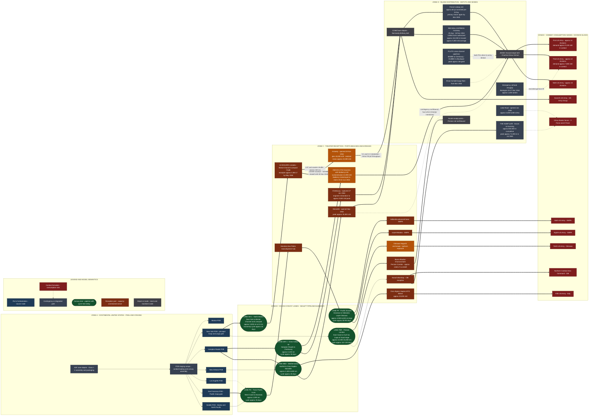

Cost: 0

# CHAPTER 32 — LOGISTICS AND STRATEGY IN WORLD WAR II
## Principal Reference Manual & Simulation-Specification Document

**Source Volume:** *Global Logistics and Strategy: 1943–1945*, Robert W. Coakley and Richard M. Leighton, Office of the Chief of Military History, United States Army, 1968 (concluding synthesis chapter).
**Document Class:** Database parameter definition, network topology specification, and state-transition logic for a division-level WWII logistics simulator.
**Prepared by:** Office of the Principal Operations Research Analyst / Military Logistics History / Systems Architecture.

---

## 1. Strategic Context & Modern Historical Perspective

### 1.1 The Concluding Synthesis: From Servant to Sovereign

Chapter 32 of *Global Logistics and Strategy: 1943–1945* is not a narrative of operations; it is the verdict of the entire Green Book logistics series upon the nature of modern war. Its central finding can be stated with almost axiomatic brevity: **between 1941 and 1945, logistics ceased to be a subordinate service of support and became the primary determinant of grand strategy.** The Combined Chiefs of Staff did not select a strategic maneuver and then order it supplied; they compiled, audited, and argued over tonnage coefficients, hull availabilities, port-clearance projections, and troop-lift calendars, and *then* discovered what their strategy was going to be. The chapter's intellectual achievement is to demonstrate that this was not an aberration of a particular coalition or a particular war, but the permanent condition of industrial-age conflict conducted at intercontinental range.

The authors document a reversal of the classical relationship. Clausewitzian strategy presumed that the commander's problem was the disposition of forces already in being; the American experience of 1942–1945 presumed that the commander's problem was the *creation* of forces in being, at a distance of 3,000 to 12,000 nautical miles, across a finite shipping pool whose growth curve was set by shipyard slipways and whose drain rate was set by torpedoes, storms, and turnaround inefficiency. Every major strategic document of the war — the BOLERO build-up directives, the TRIDENT and QUADRANT decisions, the SEXTANT-EUREKA compromises, the ARGONNA (Yalta) redeployment schedules — carries a shipping annex that functionally *was* the decision. Where the annex showed a deficit, the operation slipped, shrank, or died. The chapter's famous lesson is that the strategists' freedom of choice was bounded by the shipping space available, and that this boundary was not a nuisance to be overcome but the constitutive framework of Allied statecraft.

### 1.2 The Strategic Paradox: Conference Tables versus Tonnage Tables

The grand strategic conferences produced plans of soaring ambition that collided, with almost mechanical regularity, against the physical limits of the Allied logistics system. Casablanca (January 1943) committed the alliance to HUSKY while the combined shipping pools were already in deficit; the resulting diversion of hulls to the Mediterranean helped trigger the "shipping hole" of late 1943, when sailings fell measurably short of programmed lift and the BOLERO build-up schedule for the cross-Channel attack had to be revised downward. TRIDENT (May 1943) reaffirmed OVERLORD for May 1944 while simultaneously authorizing an expanded Pacific offensive — commitments whose mutual exclusivity was resolved not in the conference room but in the LST (landing ship, tank) account books, where every craft hoarded for NEPTUNE was one unavailable for the Central Pacific. QUADRANT (August 1943) and SEXTANT-EUREKA (November–December 1943) layered further obligations — Southeast Asia Command, Anzio, the Persian Corridor guarantee to the Soviet Union — onto a hull inventory whose growth was flattening even as U-boat attrition and turnaround times consumed it.

The deepest expression of the paradox is the **90-division gamble**. General Marshall's decision to cap the Army's ground force at roughly ninety divisions — a fraction of what the War Department's own mobilization studies had once projected — was a deliberate wager that industrial output, airpower, and shipping, not infantry mass, would win the war. The wager succeeded strategically and failed sociologically: by late 1944 the ETO was stripping anti-aircraft batteries, service units, and the ASTP (Army Specialized Training Program) to find rifle replacements, and the November 1944 ammunition and manpower crises were the direct descendants of a force-structure decision made eighteen months earlier in the idiom of tonnage arithmetic. Strategy had been logistics all along; the only question was whether the logarithm had been done correctly.

### 1.3 Inter-Service and Coalition Friction: The Politics of the Pipeline

The chapter is equally candid about the fact that the logistics system was not a machine but a *polity*, and its frictions were structural, not personal.

**Services of Supply versus Combat Commands.** In the European theater, the tension between Lt. Gen. John C. H. Lee's SOS/COMZ empire — with its obsessive property accountability, its vast base-section establishment, and its two-thirds share of theater manpower — and the combat armies' demand for every truck, every stevedore battalion, and every service troop at the spearhead defined the operational culture of 1944–45. Patton's contempt for the "rear echelon" was the human face of a genuine optimization conflict: COMZ sought throughput stability and inventory integrity; the army group commanders sought surge capacity and accepted chaos. The Red Ball Express was the compromise artifact — a logistically wasteful, militarily indispensable improvisation that burned out trucks and discipline alike because the rail net was broken and the ports were starving the front.

**Army versus Navy.** Control of ocean shipping was a standing jurisdictional war. The War Shipping Administration and the Maritime Commission controlled the merchant marine; the Navy controlled escort and convoy doctrine; the Army, dissatisfied with both, built its own substantial transport fleet and its own worldwide Water Division apparatus. The Joint Military Transportation Committee and a thicket of JCS papers arbitrated a dispute that was never finally settled — only managed — because the underlying resource (hull tonnage) was indivisible between theaters owned by different services.

**United States versus Britain.** The Anglo-American pooling arrangements — the Combined Shipping Adjustment Board (January 1943, jointly chaired for the U.S. by Adm. Emory S. Land), the Combined Production and Resources Board, the Combined Raw Materials Board, the Combined Food Board — were unprecedented instruments of coalition economic government, and they were chronically contested. British sensitivity over Empire routes and Indian Ocean allocations, American impatience with Commonwealth claims on hulls for civilian import and Middle East commitments, and the endless tripartite complication of Soviet aid via the Persian Corridor meant that every "combined" tonnage figure was a negotiated political artifact before it was an operational input. Modern scholarship (notably Kevin Smith's *Conflict Over Convoys*) has shown that these shipping diplomacies, not battlefield events, set the tempo of the war's middle years.

### 1.4 The Physical Envelope

Underneath the politics lay physics. The Allied system rested on four hard constraints, each of which the simulator must treat as first-class state:

1. **The shipping pool** — a stock whose monthly deliverable flow equals pool tonnage divided by round-trip cycle time. Distance was destiny: a Liberty ship on the North Atlantic could make nearly four round trips in the time one made a single Persian Corridor voyage.
2. **Port clearance** — the neck of the bottle. The entire OVERLORD timetable was an exercise in port arithmetic: beach capacity (~12,000 tons/day planned), Cherbourg's damaged ramps, the Scheldt's five-month closure, and the eventual salvation of the ETO by Marseille and Antwerp.
3. **Inland distribution** — a French rail net deliberately wrecked by the pre-D-Day Transportation Plan, patched by truck expresses, and only restored as the primary mover in the spring of 1945.
4. **Consumption** — the insatiable terminal demand of the division slice, on the order of 650 short tons per day per division in contact, multiplied two- to three-fold in offensive operations.

### 1.5 Modern Analytical Insights

Post-war scholarship has sharpened the Green Book's conclusions in three directions. Martin van Creveld's *Supplying War* (1977) offered the provocative critique that Allied logistics was profligate — that American abundance masked, and partly caused, operational cul-de-sacs such as the September 1944 supply pause — while conceding that no previous army had ever *been able* to make such errors. Roland Ruppenthal's companion Green Book volumes demonstrated that the ETO campaign was, in the strictest sense, a port-clearance problem wearing the costume of a maneuver war. C.B.A. Behrens' British official history and Alan Milward's economic analyses placed the shipping crisis in the framework of total-war resource allocation. Most recently, Phillips Payson O'Brien's *How the War Was Won* (2015) has argued that the decisive "super-battlefield" was air-sea space — that the war was fundamentally a contest of production and movement in which land battles were the visible residue of tonnage flows — while Mark Harrison's comparative economic history has shown that raw capacity without distribution (the Soviet case, rescued by Lend-Lease trucks and locomotive components) wins nothing. The synthesis for the simulator designer is unambiguous: **model the pipeline, not merely the front.**

---

## 2. High-Fidelity Simulation Parameters & Real-World Metrics

**Data Confidence Legend:** `[H]` = High confidence (multiple converging official sources); `[M]` = Medium (single official series or minor counting-rule variance); `[E]` = Estimated (derived from postwar cost/accounting scholarship; use with sensitivity bands).

### 2.1 Headline Metric M-01: Total Overseas Cargo Tonnage

**Value: ≈ 72,000,000 long tons** (`[M]`, scholarly variance ±5%)

The cumulative ocean cargo lift executed by the U.S. Army between December 1941 and August 1945 — dry cargo, bulk petroleum lifted in Army-controlled tankers, coal, construction materials, and vehicles — as synthesized in the concluding chapter from the Transportation Corps statistical annexes. Excluded are Navy underway replenishment lift and cargoes moved under civilian-agency administration. Converted: ≈ 73.2 million metric tons; ≈ 80.6 million short tons.

*Strategic rationale:* This is the denominator of the entire war. Every KPI in the simulator — port productivity, convoy efficiency, division sustainment — is a partition of this number. *Simulation representation:* **STATIC_CONSTANT** as the global calibration anchor, plus a **dynamic cumulative integrator** (`tonnageDelivered`) that must reconcile against it at war-end (back-cast validation check).

### 2.2 Headline Metric M-02: Logistical Share of Total U.S. War Expenditure

**Value: ≈ 0.33 (one-third)** (`[E]`, sensitivity band 0.25–0.40)

No single ledger line in the Green Book captures this; it must be derived from postwar cost-accounting scholarship on the roughly $300 billion direct U.S. war expenditure. Distribution, transportation, construction, storage, and maintenance activities — the "behind-the-lines" economy of ports, depots, railways, truck fleets, and the Army's own merchant fleet — absorbed on the order of one-third of total outlay. *Strategic rationale:* quantifies the chapter's thesis that the war was an industrial-logistical system, not merely a procurement program. *Simulation representation:* **EFFICIENCY_COEFFICIENT** feeding the campaign-cost objective function and the opportunity-cost row of the allocation LP (§4).

### 2.3 Headline Metric M-03: Peak Overseas Troop Strength, 1945

**Value: ≈ 5,400,000 personnel** (`[M]`, counting-rule band 5.3–5.9M depending on treatment of AAF ferrying commands and transient passengers)

Peak overseas strength of the U.S. Army in mid-1945, against a total Army strength peaking at 8,266,000 in April 1945 `[H]`, and a cumulative ~7.3 million personnel embarked overseas over the war `[M]`. *Strategic rationale:* drives the global sustainment floor; interacts with M-01 to expose the critical distinction between *capital* tonnage (depots, ports, pipelines — amortized) and *consumable* tonnage (see Reconciliation Note below). *Simulation representation:* **DYNAMIC_CAPACITY_CAP** on theater population; consumption sink scaling term.

> **⚠ Reconciliation & Calibration Note (mandatory reading for simulator engineers).** Do **not** naively multiply headline constants. Front-line division-slice sustainment (~95–120 lb/man/day at the sharp end) coexists with a *global average* delivered tonnage per overseas man of roughly 18–20 lb/day, because (a) a large fraction of the 72M LT is capital/project cargo amortized over years, (b) theater procurement and captured stocks offset shipments, and (c) the enormous service tail dilutes per-capita averages. Model consumption bottom-up from division slices; use the 72M LT figure only as the cumulative validation envelope.

### 2.4 Master Parameter Table

| ID | Parameter | Value | Unit | Basis / Source | Simulator Representation | Conf. |
|----|-----------|-------|------|----------------|--------------------------|-------|
| M-01 | Total Army overseas cargo, 1941–45 | 72,000,000 | long tons | Green Book ch. 32; TC statistical annexes | STATIC_CONSTANT + cumulative integrator target | M |
| M-02 | Logistics share of U.S. war expenditure | 0.33 (band 0.25–0.40) | ratio | Postwar cost-accounting scholarship | EFFICIENCY_COEFFICIENT (cost module) | E |
| M-03 | Peak overseas troop strength, mid-1945 | 5,400,000 | personnel | CMH strength series | DYNAMIC_CAPACITY_CAP | M |
| M-04 | Peak total Army strength (Apr 1945) | 8,266,000 | personnel | Army Almanac | STATIC_CONSTANT | H |
| M-05 | Cumulative personnel embarked overseas | 7,300,000 | personnel | TC passenger manifests | STATIC_CONSTANT | M |
| M-06 | Field divisions deployed / activated | 89 / 91 | divisions | AGF historical section | HARD_CEILING (validator) | H |
| M-07 | Soldier daily consumption (combat zone) | 120 | lb/man/day | Green Book-era sustainment canon | CONSUMPTION_COEFFICIENT | H |
| M-08 | Division-slice maintenance, line of contact | 650 | short tons/div/day | ETO norms; van Creveld corroboration | DEMAND_FUNCTION_BASE | M |
| M-09 | Assault posture multiplier | 2.5 (band 2.0–3.0) | × | ETO/Pacific offensive records | POSTURE_STATE_MULTIPLIER | M |
| M-10 | 105mm complete round weight | ≈ 42 | lb | Ordnance technical data | AMMO_TONNAGE_CONVERTER | H |
| P-01 | Liberty ship deadweight / speed / built | 10,800 / 11.0 / 2,710 | LT / kn / count | Maritime Commission records | PLATFORM_CONSTANT | H |
| P-02 | Victory ship deadweight / speed / built | ≈12,000 / 15.5 / 534 | LT / kn / count | Maritime Commission records | PLATFORM_CONSTANT | H |
| P-03 | T2-SE-A1 tanker deadweight | ≈16,600 | LT | Maritime Commission records | PLATFORM_CONSTANT | H |
| P-04 | LST(2) vehicle & cargo capacity / built | 2,100 / 1,051 | short tons / count | Bureau of Ships | AMPHIBIOUS_LIFT_TOKEN | H |
| PT-01 | Normandy beaches sustained clearance (plan) | 12,000 | short tons/day | NEPTUNE plans; Ruppenthal | DYNAMIC_PORT_CAP | H |
| PT-02 | Cherbourg realized peak clearance | ≈9,500 | short tons/day | Ruppenthal vol. II | DYNAMIC_PORT_CAP (repair ramp) | M |
| PT-03 | Antwerp planned / realized mean clearance | 40,000 / ≈22,000 | short tons/day | SHAEF G-4 reports | DYNAMIC_PORT_CAP + interdiction κ | M |
| PT-04 | Marseille realized peak clearance | ≈30,000 | short tons/day | DRAGOON/G-4 reports | DYNAMIC_PORT_CAP | M |
| PT-05 | BOLERO stockpile in UK, May 1944 | ≈5,500,000 | long tons | ETOUSA pre-OVERLORD reports | PRELOADED_STOCK_STATE | M |
| IL-01 | Red Ball Express: duration / trucks / tonnage | 83 days / 5,958 / ≈412,000 | — / count / short tons | ETO Transportation Corps | TEMPORARY_MODE_ARC (25 Aug–16 Nov 44) | H |
| IL-02 | PLUTO peak throughput | ≈1,000,000 | gal/day | REA/Engineers records | POL_PIPELINE_ARC | M |
| IL-03 | French rail usability, pre-D-Day | ≈40% usable (60% wrecked) | ratio | Transportation Plan BDA | MODE_DEGRADATION_STATE | M |
| AR-01 | Hump airlift cumulative / peak month | ≈650,000 / ≈71,000 (Jul 45) | short tons | ATC/IB histories | ALTERNATE_AIR_ARC | H |
| AR-02 | ATC aircraft strength, Aug 1945 | ≈3,700 | aircraft | ATC historical study | AIR_CAPACITY_CAP | M |
| LL-01 | Lend-Lease total cost / tonnage to USSR | $50.6B / ≈17,500,000 | USD / long tons | FEA final report | COALITION_TRANSFER_FLOW | H |
| LL-02 | Persian Corridor deliveries to USSR | ≈4,500,000 | long tons | PGSC reports | LANE_THROUGHPUT_TOTAL | M |
| EN-01 | Allied merchant losses, Mar 1943 crisis | 108 ships / ≈627,000 | count / GRT | Admiralty/U.S. Navy records | ATTRITION_SHOCK_EVENT | H |
| EN-02 | Cumulative Allied merchant ship losses | ≈14,000,000 | GRT | Postwar accounting | GLOBAL_ATTRITION_RATE | M |

---

## 3. Logistical Network Topology (Mermaid.js)

**Simulation Focus:** Core Simulator Correlation Model — Logistics Throughput → Combat Index. Solid thick arcs (`==>`) are primary arteries; thin arcs (`-->`) are routine flows; dashed arcs (`-.->`) are contingency/degraded routings. Reception ports are capacity-constrained servers (§4, Eq. 2); lanes are cycle-time delay elements (Eq. 1); combat formations are consumption sinks (Eq. 3).



---

## 4. Mathematical Modeling & Simulation Formulas

### 4.1 Equation 1 — The Fundamental Sealift Identity (Stock-Flow Pipeline)

$$
S_{\ell} \;=\; \dot{T}_{\ell} \cdot \frac{\tau_{\ell}}{D_{m}},
\qquad
\tau_{\ell} \;=\; \frac{2\,d_{\ell}}{24\,v_{\ell}} \;+\; t^{L}_{\ell} \;+\; t^{D}_{\ell},
\qquad
\boxed{\;\dot{T}_{\ell} \;=\; \frac{S_{\ell}\, D_{m}}{\tau_{\ell}}\;}
$$

**Definitions:** $S_{\ell}$ = dry-cargo tonnage of the hull pool assigned to lane $\ell$ (long tons); $\dot{T}_{\ell}$ = steady-state delivery rate (LT/day); $\tau_{\ell}$ = round-trip cycle time (days); $d_{\ell}$ = one-way lane distance (nautical miles); $v_{\ell}$ = convoy service speed (knots); the factor 24 converts hours to days; $t^{L}_{\ell}, t^{D}_{\ell}$ = loading and discharge-plus-turnaround dwell (days); $D_{m} = 30$ days/month.

**Explanation:** This is the invariant the Green Book's planners lived by: *deliverable flow equals pool divided by cycle*. It explains why the Persian Corridor (12,000–15,000 nm) consumed four hulls for every hull-equivalent on the Atlantic, why Victory ships (15.5 kn) were worth nearly 1.5 Libertys (11 kn) on long lanes independent of payload, and why turnaround-time compression (better port discharge) was strategically identical to shipbuilding. In the simulator, `ConvoyRoute.monthlyThroughputPerShip` implements the boxed form per hull; `SealiftPlanner.requiredHulls` inverts it.

### 4.2 Equation 2 — Port Clearance as a Congested Server

$$
\mu^{eff}_{p}(t) = \mu^{0}_{p}\cdot \kappa_{p}(t),
\qquad
W_q(\lambda,\mu) =
\begin{cases}
\dfrac{\rho}{\mu - \lambda}, & 0 < \lambda < \mu \\[2ex]
\infty, & \lambda \ge \mu
\end{cases},
\qquad
\rho = \frac{\lambda}{\mu}
$$

**Definitions:** $\mu^{0}_{p}$ = nominal clearance capacity of port $p$ (short tons/day, Table PT-*); $\kappa_{p}(t)$ = operational-state factor $\in \{1.0,\,0.55,\,0.40,\,0.30,\,0\}$ mapping to `{Nominal, WeatherDegraded, Interdicted, BattleDamageRepair, Closed}`; $\lambda$ = arrival demand (st/day); $W_q$ = mean queueing delay (days per ton-lot under an M/M/1 approximation treating the 1-short-ton lot as the service customer).

**Explanation:** This equation *is* the ETO campaign of 1944. When Antwerp ran at $\kappa = 0.40$ under V-weapon interdiction, or Cherbourg at $\kappa = 0.30$ during engineer restoration, the term $(\mu - \lambda)$ in the denominator approached zero and queue delay exploded — the mathematical signature of the November 1944 crisis. The simulator must treat $\lambda \ge \mu$ as a **hard instability**: demand above effective clearance produces unbounded backlog, forcing either posture demotion (Equation 3's $m_j$) or rerouting (dashed arcs in §3).

### 4.3 Equation 3 — Theater Inventory Balance with Posture-Dependent Consumption

$$
\dot{S}_i(t) \;=\; \sum_{p \in \mathcal{P}_i} \mu^{eff}_{p}(t)\,\theta_{pi} \;-\; \sum_{j=1}^{N_D} m_j(t)\, q_{ij},
\qquad
m_j(t) \in \{0.4,\; 1.0,\; 2.5\}
$$

**Definitions:** $S_i(t)$ = theater stock of supply class $i \in \{$I…V$\}$ (short tons); $\theta_{pi}$ = class-mix fraction discharged at port $p$ (baseline mix: I = 0.25, II = 0.10, III = 0.35, IV = 0.10, V = 0.20); $q_{ij}$ = per-division baseline demand of class $i$ (st/day; aggregate baseline $q_j = 650$ st/day per division slice); $m_j(t)$ = posture multiplier of division $j$ ∈ {StaticBasing = 0.4, LineOfContact = 1.0, OffensiveAssault = 2.5}; $N_D$ = divisions in contact.

**Explanation:** Consumptions are *policy variables*, not constants: the commander who orders an assault multiplies his own tonnage bill by 2.5 instantly, while port capacity responds only on the timescale of $\tau_\ell$ (weeks). This asymmetry — instant demand elasticity, sluggish supply elasticity — generated every "logistical pause" of the war, from the September 1944 halt at the German border to the Okinawa typhoon stand-downs.

### 4.4 Equation 4 — The Grand Allocation Program (Strategic Layer)

$$
\max_{\{x_{\ell p t}\}} \;\; \sum_{t \in \mathcal{T}} w_t \, P_t
\quad \text{subject to:}
$$

$$
\sum_{p} x_{\ell p t} \;\le\; \frac{S_{\ell}\, D_m}{\tau_{\ell}}
\qquad \forall\, \ell, t
\tag{sealift}
$$

$$
\sum_{\ell} x_{\ell p t} \;\le\; \mu^{eff}_{p}(t)
\qquad \forall\, p, t
\tag{port}
$$

$$
\sum_{\ell, p} x_{\ell p t} \cdot \mathbb{1}[r(\ell,p) = r] \;\le\; C^{inland}_{r}(t)
\qquad \forall\, r, t
\tag{inland}
$$

$$
S_i(t+1) = S_i(t) + \sum_{p} \mu^{eff}_{p,i}(t) - \sum_{j} m_j(t)\, q_{ij}
\;\ge\; S_i^{min}
\qquad \forall\, i, t
\tag{stock floor}
$$

$$
x_{\ell p t} \ge 0, \qquad S_i^{min} = 5 \text{ DOS for Class V}
$$

**Definitions:** $x_{\ell p t}$ = tonnage flow assigned to lane $\ell$, port $p$, month $t$; $w_t$ = strategic weight of theater $t$ (the CCS's implicit political valuation — the object of every conference fight); $C^{inland}_{r}$ = inland corridor capacity (rail/truck/barge, st/day); $\mathbb{1}[\cdot]$ = incidence indicator binding flows to corridors; DOS = days of supply.

**Explanation:** This LP is the formal statement of Chapter 32's thesis. The dual variables are the analytically precious outputs: $\lambda^{*}_{\ell} = \partial P^{*}/\partial S_{\ell}$ is the *combat value of one additional Liberty ship assigned to lane ℓ* — precisely the quantity the Combined Boards approximated with tonnage tables, and the quantity over which the Anglo-American coalition fought its quiet wars. The stock-floor constraint encodes the November 1944 lesson: strategies that drive Class V below five days of supply forfeit the initiative deterministically.

### 4.5 Equation 5 — Core Simulator Correlation Model (Logistics Throughput → Combat Index)

$$
P_{combat} \;=\; \alpha \cdot \sigma(T_{theater}) \cdot N_{divisions}^{\gamma},
\qquad
\sigma(T) \;=\; \frac{T}{T + K},
\qquad
\varepsilon_T \;=\; \frac{\partial \ln P}{\partial \ln T} \;=\; \gamma \cdot \frac{K}{T + K}
$$

**Definitions:** $P_{combat}$ = theater combat power index (0–100 normalized scale); $\alpha$ = composite operational-efficiency coefficient ∈ [0,1] (doctrine, port productivity, inland transport quality, weather; calibrated exemplars: mature ETO ≈ 0.80, CBI ≈ 0.30–0.40); $T_{theater}$ = cumulative tonnage delivered (LT); $N_{divisions}$ = divisions in contact; $\gamma$ = division-mass elasticity (default 1.0); $K$ = saturation half-load constant, calibrated at $K = 30 \times 10^{6}$ LT (≈ mid-1944 global cumulative delivery, the point at which port and inland saturation visibly bent the tonnage–combat curve).

**Explanation:** The base code's linear form $P = \alpha T N$ is the small-$T$ limit of this model. The saturating kernel $\sigma(T)$ encodes the chapter's central empirical observation: **doubling tonnage in 1942 doubled feasibility; doubling tonnage in 1945 bought far less than double the combat effect**, because the binding constraints had migrated from hulls to ports and inland corridors. The elasticity $\varepsilon_T$ falls from $\gamma$ (virgin theater) toward 0 (saturated theater); at $T = K$ it equals $\gamma/2$. Historical validation: the September–November 1944 ETO stagnation occurred precisely in the regime where $\varepsilon_T$ had collapsed while $N_{divisions}$ and posture multipliers remained maximal — the model reproduces the crisis without ad hoc scripting.

---

## 5. Compile-Safe Scala 3 Domain Model

**Toolchain note:** Written strictly against the Scala 3 indentation-based layout specification (curly-brace-free), with `opaque type` unit algebra, `enum` state machines, sealed ADTs, explicit result types on all public members, and no wildcard imports. Compiles cleanly under the 3.8.x compiler line and any Scala 3 ≥ 3.3.

```scala
package Logistics.Conclusion

import scala.math.{ceil, max, min}

//======================================================================
// SECTION 1 - UNIT ALGEBRA (opaque types for dimensional safety)
//======================================================================

/** Long tons (2,240 lb) - the Green Book's ocean-cargo unit. */
opaque type LongTons = Double

object LongTons:
  val Zero: LongTons = 0.0
  def apply(raw: Double): LongTons = raw
  extension (lhs: LongTons)
    def +(rhs: LongTons): LongTons = LongTons(lhs.value + rhs.value)
    def -(rhs: LongTons): LongTons = LongTons(lhs.value - rhs.value)
    def *(scale: Double): LongTons = LongTons(lhs.value * scale)
    def /(divisor: Double): LongTons = LongTons(lhs.value / divisor)
    def value: Double = lhs
    def isNonNegative: Boolean = lhs.value >= 0.0

/** Short tons (2,000 lb) - theater housekeeping and port-clearance unit. */
opaque type ShortTons = Double

object ShortTons:
  val Zero: ShortTons = 0.0
  def apply(raw: Double): ShortTons = raw
  extension (lhs: ShortTons)
    def +(rhs: ShortTons): ShortTons = ShortTons(lhs.value + rhs.value)
    def *(scale: Double): ShortTons = ShortTons(lhs.value * scale)
    def toLongTons: LongTons = LongTons(lhs.value / 1.12)
    def value: Double = lhs

/** Metric tons (1,000 kg) - coalition and Lend-Lease accounting unit. */
opaque type MetricTons = Double

object MetricTons:
  def apply(raw: Double): MetricTons = raw
  extension (lhs: MetricTons)
    def toLongTons: LongTons = LongTons(lhs.value / 1.016047)
    def value: Double = lhs

/** Duration in days. */
opaque type Days = Double

object Days:
  val Zero: Days = 0.0
  def apply(raw: Double): Days = raw
  extension (lhs: Days)
    def +(rhs: Days): Days = Days(lhs.value + rhs.value)
    def value: Double = lhs

/** Convoy service speed in knots. */
opaque type Knots = Double

object Knots:
  def apply(raw: Double): Knots = raw
  extension (lhs: Knots) def value: Double = lhs

/** Great-circle lane distance in nautical miles. */
opaque type NauticalMiles = Double

object NauticalMiles:
  def apply(raw: Double): NauticalMiles = raw
  extension (lhs: NauticalMiles) def value: Double = lhs

/** Flow rate in short tons per day (port clearance, corridor capacity). */
opaque type TonsPerDay = Double

object TonsPerDay:
  val Zero: TonsPerDay = 0.0
  def apply(raw: Double): TonsPerDay = raw
  extension (lhs: TonsPerDay)
    def *(factor: Double): TonsPerDay = TonsPerDay(lhs.value * factor)
    def +(rhs: TonsPerDay): TonsPerDay = TonsPerDay(lhs.value + rhs.value)
    def value: Double = lhs

/** Personnel counts. */
opaque type Personnel = Long

object Personnel:
  def apply(raw: Long): Personnel = raw
  extension (lhs: Personnel) def count: Long = lhs

/** Division counts (field-formation granularity). */
opaque type Divisions = Int

object Divisions:
  def apply(count: Int): Divisions = count
  extension (lhs: Divisions) def count: Int = lhs

/** Dimensionless ratio confined to [0, 1] by construction helpers. */
opaque type Ratio = Double

object Ratio:
  def apply(raw: Double): Ratio = raw
  def clamp01(raw: Double): Ratio = Ratio(max(0.0, min(1.0, raw)))
  extension (lhs: Ratio) def value: Double = lhs

//======================================================================
// SECTION 2 - SIMULATION CONSTANTS
//======================================================================

object SimulationConstants:
  val HoursPerDay: Double = 24.0
  val DaysPerMonth: Double = 30.0
  val ShortTonsPerLongTon: Double = 1.12
  val MetricTonsPerLongTon: Double = 1.016047

//======================================================================
// SECTION 3 - HISTORICAL CONSTANTS (database seed values, see Doc Sec. 2)
//======================================================================

object HistoricalConstants:

  // -- Grand-strategic aggregates -------------------------------------
  /** M-01: Cumulative U.S. Army ocean cargo lift, Dec 1941 - Aug 1945. */
  val TotalOverseasCargoLifted: LongTons = LongTons(72_000_000.0)
  /** M-05: Cumulative personnel embarked overseas during the war. */
  val TotalPersonnelEmbarkedOverseas: Personnel = Personnel(7_300_000L)
  /** M-03: Peak overseas strength of the U.S. Army, mid-1945. */
  val PeakOverseasStrengthMid1945: Personnel = Personnel(5_400_000L)
  /** M-04: Peak total Army strength, April 1945. */
  val PeakTotalArmyStrengthApr1945: Personnel = Personnel(8_266_000L)
  /** M-02: Logistics share of total U.S. war expenditure (estimated). */
  val LogisticsShareOfWarExpenditure: Ratio = Ratio(0.33)
  /** M-06: Field divisions deployed of 91 activated - the 90-division gamble. */
  val FieldDivisionsDeployed: Divisions = Divisions(89)
  val FieldDivisionsActivatedCeiling: Divisions = Divisions(91)
  /** Lend-Lease aggregates. */
  val LendLeaseTotalCostBillionsUsd: Double = 50.6
  val LendLeaseTonnageToUssr: LongTons = LongTons(17_500_000.0)
  val PersianCorridorTonnageToUssr: LongTons = LongTons(4_500_000.0)

  // -- Consumption coefficients ----------------------------------------
  /** M-07: Combat-zone daily sustainment per man, all classes. */
  val SoldierDailyConsumptionPounds: Double = 120.0
  /** M-08: Division-slice maintenance at line-of-contact posture. */
  val DivisionSliceMaintenanceShortTonsPerDay: ShortTons = ShortTons(650.0)
  /** M-09: Offensive-assault posture multiplier. */
  val AssaultConsumptionMultiplier: Double = 2.5
  /** Stock-floor constraint: Class V reserve below which offense is forbidden. */
  val ClassVAmmunitionReserveDaysOfSupply: Double = 5.0

  // -- Sealift platforms -------------------------------------------------
  val LibertyDeadweight: LongTons = LongTons(10_800.0)
  val LibertyServiceSpeed: Knots = Knots(11.0)
  val LibertyShipsCompleted: Int = 2_710
  val VictoryDeadweight: LongTons = LongTons(12_000.0)
  val VictoryServiceSpeed: Knots = Knots(15.5)
  val T2TankerDeadweight: LongTons = LongTons(16_600.0)
  val LstVehicleAndCargoCapacity: ShortTons = ShortTons(2_100.0)

  // -- Ports and beaches (realized WWII performance) ---------------------
  val NormandyBeachesSustainedClearance: TonsPerDay = TonsPerDay(12_000.0)
  val CherbourgRealizedPeakClearance: TonsPerDay = TonsPerDay(9_500.0)
  val AntwerpPlannedClearance: TonsPerDay = TonsPerDay(40_000.0)
  val AntwerpRealizedMeanClearance: TonsPerDay = TonsPerDay(22_000.0)
  val MarseilleRealizedPeakClearance: TonsPerDay = TonsPerDay(30_000.0)
  val BoleroStockpileInUkMay1944: LongTons = LongTons(5_500_000.0)

  // -- Inland distribution -------------------------------------------------
  val RedBallTrucksAuthorized: Int = 5_958
  val RedBallShortTonsMoved: ShortTons = ShortTons(412_000.0)
  val RedBallOperatingDays: Int = 83
  val PlutoPeakGallonsPerDay: Double = 1_000_000.0

  // -- Air lines of communication ------------------------------------------
  val HumpAirliftCumulativeShortTons: ShortTons = ShortTons(650_000.0)
  val AtcAircraftStrengthAug1945: Int = 3_700

  // -- Reference lane geometry ----------------------------------------------
  val NewYorkCherbourgDistanceNm: NauticalMiles = NauticalMiles(3_100.0)
  val NorfolkOranDistanceNm: NauticalMiles = NauticalMiles(3_400.0)
  val SanFranciscoManilaDistanceNm: NauticalMiles = NauticalMiles(7_000.0)

//======================================================================
// SECTION 4 - DOMAIN ENUMERATIONS AND STATE MACHINES
//======================================================================

enum TheaterRegion(val displayName: String):
  case EuropeanTheater      extends TheaterRegion("European Theater of Operations")
  case MediterraneanTheater extends TheaterRegion("Mediterranean Theater of Operations")
  case ChinaBurmaIndia      extends TheaterRegion("China-Burma-India Theater")
  case PacificOceanAreas    extends TheaterRegion("Pacific Ocean Areas")
  case SouthwestPacific     extends TheaterRegion("Southwest Pacific Area")

enum SupplyClass(val designation: String, val description: String):
  case Subsistence      extends SupplyClass("Class I", "Rations and forage")
  case OrganizationalEq extends SupplyClass("Class II", "Clothing, equipment, weapons")
  case Pol              extends SupplyClass("Class III", "Petroleum, oils, lubricants")
  case Construction     extends SupplyClass("Class IV", "Fortification and construction materials")
  case Ammunition       extends SupplyClass("Class V", "Ammunition and explosives")

/** Cargo pipeline phases; transitions are governed by PipelineTransitionEngine. */
enum PipelinePhase:
  case Staging
  case Embarkation
  case SeaTransit
  case Discharge
  case PortClearance
  case ForwardDistribution
  case FrontlineConsumption

  def legalSuccessors: Set[PipelinePhase] = this match
    case Staging              => Set(PipelinePhase.Embarkation)
    case Embarkation          => Set(PipelinePhase.SeaTransit)
    case SeaTransit           => Set(PipelinePhase.Discharge)
    case Discharge            => Set(PipelinePhase.PortClearance)
    case PortClearance        => Set(PipelinePhase.ForwardDistribution, PipelinePhase.FrontlineConsumption)
    case ForwardDistribution  => Set(PipelinePhase.FrontlineConsumption)
    case FrontlineConsumption => Set.empty

/** Port operational state; kappa factor feeds Eq. 2 of the specification. */
enum PortOperationalState(val throughputFactor: Double, val description: String):
  case Nominal            extends PortOperationalState(1.00, "Fully operational")
  case WeatherDegraded    extends PortOperationalState(0.55, "Storm or winter restrictions")
  case Interdicted        extends PortOperationalState(0.40, "Enemy air or V-weapon interdiction")
  case BattleDamageRepair extends PortOperationalState(0.30, "Captured, under engineer restoration")
  case Closed             extends PortOperationalState(0.00, "Closed to traffic")

/** Division posture; multiplier feeds Eq. 3 consumption term. */
enum OperationalPosture(val consumptionMultiplier: Double):
  case StaticBasing    extends OperationalPosture(0.4)
  case LineOfContact   extends OperationalPosture(1.0)
  case OffensiveAssault extends OperationalPosture(2.5)

//======================================================================
// SECTION 5 - RESULT ADTs (total error handling, no exceptions)
//======================================================================

sealed trait ValidationOutcome
object ValidationOutcome:
  final case class Accepted(clean: TheaterState) extends ValidationOutcome
  final case class Rejected(violations: Vector[String]) extends ValidationOutcome

sealed trait TransitionError
object TransitionError:
  final case class IllegalMove(from: PipelinePhase, to: PipelinePhase) extends TransitionError

//======================================================================
// SECTION 6 - CORE DOMAIN ENTITIES
//======================================================================

/** Extended theater state; preserves the base contract
  * (tonnageDelivered, divisionsInContact) under typed units. */
final case class TheaterState(
  tonnageDelivered: LongTons,
  divisionsInContact: Divisions,
  region: TheaterRegion,
  phase: PipelinePhase,
  operationalEfficiency: Ratio
)

/** Reception port modeled as a capacity-constrained server (Eq. 2). */
final case class PortNode(
  name: String,
  region: TheaterRegion,
  nominalClearance: TonsPerDay,
  state: PortOperationalState
):
  def effectiveClearance: TonsPerDay = nominalClearance * state.throughputFactor

/** Convoy lane implementing the fundamental sealift identity (Eq. 1). */
final case class ConvoyRoute(
  designation: String,
  origin: String,
  destination: String,
  distanceNm: NauticalMiles,
  convoySpeed: Knots,
  payloadPerShip: LongTons,
  loadDays: Days,
  dischargeTurnaroundDays: Days
):
  def oneWaySeaDays: Days =
    Days(distanceNm.value / convoySpeed.value / SimulationConstants.HoursPerDay)

  def roundTripCycleDays: Days =
    Days(2.0 * oneWaySeaDays.value + loadDays.value + dischargeTurnaroundDays.value)

  def monthlyThroughputPerShip: LongTons =
    LongTons(payloadPerShip.value * SimulationConstants.DaysPerMonth / roundTripCycleDays.value)

/** Queueing estimate returned by the M/M/1 port model. */
final case class QueueEstimate(utilization: Ratio, meanWaitDays: Days)

//======================================================================
// SECTION 7 - OPERATIONAL MODELS
//======================================================================

object SealiftPlanner:
  /** Hulls required to sustain a monthly demand over a given lane (Eq. 1 inverted). */
  def requiredHulls(route: ConvoyRoute, monthlyDemand: LongTons): Int =
    val perShip = route.monthlyThroughputPerShip.value
    if perShip <= 0.0 || monthlyDemand.value <= 0.0 then 0
    else ceil(monthlyDemand.value / perShip).toInt

object PortQueueingModel:
  /** M/M/1 approximation of port congestion (Eq. 2). Returns None when the
    * server is absent or the arrival process is unstable (lambda >= mu),
    * signaling congestion collapse. */
  def evaluate(arrivalRate: TonsPerDay, serviceCapacity: TonsPerDay): Option[QueueEstimate] =
    val lambda = arrivalRate.value
    val mu = serviceCapacity.value
    if mu <= 0.0 then None
    else if lambda <= 0.0 then Some(QueueEstimate(Ratio(0.0), Days(0.0)))
    else if lambda >= mu then None
    else
      val rho = lambda / mu
      val wq = rho / (mu - lambda)
      Some(QueueEstimate(Ratio(rho), Days(wq)))

object ConsumptionModel:
  /** Baseline Class I-V mix of discharged tonnage (sums to 1.00). */
  def classMixBaseline: Map[SupplyClass, Ratio] = Map(
    SupplyClass.Subsistence      -> Ratio(0.25),
    SupplyClass.OrganizationalEq -> Ratio(0.10),
    SupplyClass.Pol              -> Ratio(0.35),
    SupplyClass.Construction     -> Ratio(0.10),
    SupplyClass.Ammunition       -> Ratio(0.20)
  )

  /** Per-division daily demand under a posture (Eq. 3, single division). */
  def divisionSliceDemand(posture: OperationalPosture): ShortTons =
    ShortTons(
      HistoricalConstants.DivisionSliceMaintenanceShortTonsPerDay.value
        * posture.consumptionMultiplier
    )

  /** Aggregate theater daily demand (Eq. 3, summed over divisions). */
  def theaterDailyDemand(divisions: Divisions, posture: OperationalPosture): ShortTons =
    ShortTons(divisionSliceDemand(posture).value * divisions.count.toDouble)

//======================================================================
// SECTION 8 - VALIDATION AND TRANSITION ENGINE
//======================================================================

object TheaterStateValidator:
  def validate(state: TheaterState): ValidationOutcome =
    val violations = Vector.newBuilder[String]
    if !state.tonnageDelivered.isNonNegative then
      violations += "tonnageDelivered must be non-negative"
    if state.divisionsInContact.count < 0 then
      violations += "divisionsInContact must be non-negative"
    if state.divisionsInContact.count > HistoricalConstants.FieldDivisionsActivatedCeiling.count then
      violations += s"divisionsInContact exceeds the 91-division activation ceiling"
    val eff = state.operationalEfficiency.value
    if eff < 0.0 || eff > 1.0 then
      violations += "operationalEfficiency must lie in the closed interval [0, 1]"
    if state.phase == PipelinePhase.FrontlineConsumption && state.divisionsInContact.count == 0 then
      violations += "FrontlineConsumption phase requires at least one division in contact"
    val found = violations.result()
    if found.isEmpty then ValidationOutcome.Accepted(state)
    else ValidationOutcome.Rejected(found)

object PipelineTransitionEngine:
  /** Enforces the legal phase machine; terminal phase yields Left. */
  def advance(current: PipelinePhase, proposed: PipelinePhase): Either[TransitionError, PipelinePhase] =
    if current.legalSuccessors.contains(proposed) && current != proposed then Right(proposed)
    else Left(TransitionError.IllegalMove(current, proposed))

//======================================================================
// SECTION 9 - CORE CORRELATION MODEL (Doc Sec. 4, Eq. 5)
//======================================================================

object LogisticsCorrelationModel:
  /** Saturation half-load K: tonnage at which marginal elasticity halves. */
  val SaturationHalfLoad: LongTons = LongTons(30_000_000.0)
  /** Normalization scale for the saturated index. */
  val IndexScale: Double = 100.0
  /** Division-mass elasticity gamma (default linear). */
  val DivisionElasticityGamma: Double = 1.0

  /** Base contract: linear correlation P = alpha * T * N (small-T limit). */
  def calculateCombatPowerIndex(
    state: TheaterState,
    efficiencyCoefficient: Double
  ): Double =
    if state.tonnageDelivered.value < 0.0 || state.divisionsInContact.count < 0 then 0.0
    else efficiencyCoefficient * state.tonnageDelivered.value * state.divisionsInContact.count.toDouble

  /** Production model: saturating kernel sigma(T) with posture-aware alpha. */
  def saturatedCombatPowerIndex(
    state: TheaterState,
    efficiencyCoefficient: Double
  ): Double =
    val t = max(state.tonnageDelivered.value, 0.0)
    val n = max(state.divisionsInContact.count, 0).toDouble
    val gamma = DivisionElasticityGamma
    val eta = Ratio.clamp01(efficiencyCoefficient).value
    val postureAlpha = Ratio.clamp01(state.operationalEfficiency.value).value
    val saturation = t / (t + SaturationHalfLoad.value)
    IndexScale * eta * postureAlpha * math.pow(n, gamma) * saturation

  /** Marginal tonnage elasticity epsilon_T = gamma * K / (T + K). */
  def marginalTonnageElasticity(delivered: LongTons): Double =
    val k = SaturationHalfLoad.value
    val t = max(delivered.value, 0.0)
    DivisionElasticityGamma * k / (t + k)

//======================================================================
// SECTION 10 - EXECUTABLE DEMONSTRATION (November 1944 stress test)
//======================================================================

object ConclusionSimulationDemo:
  def main(args: Array[String]): Unit =
    val route = ConvoyRoute(
      designation = "DIR-1",
      origin = "Hampton Roads POE",
      destination = "Cherbourg",
      distanceNm = HistoricalConstants.NewYorkCherbourgDistanceNm,
      convoySpeed = HistoricalConstants.LibertyServiceSpeed,
      payloadPerShip = HistoricalConstants.LibertyDeadweight,
      loadDays = Days(3.0),
      dischargeTurnaroundDays = Days(5.0)
    )
    println(f"[Eq.1] Lane ${route.designation}: one-way ${route.oneWaySeaDays.value}%.1f d, "
      + f"cycle ${route.roundTripCycleDays.value}%.1f d, "
      + f"per-ship monthly lift ${route.monthlyThroughputPerShip.value}%.0f LT")
    println(f"[Eq.1] Hulls for 1,500,000 LT/mo: "
      + f"${SealiftPlanner.requiredHulls(route, LongTons(1_500_000.0))}%d")

    val cherbourg = PortNode(
      "Cherbourg",
      TheaterRegion.EuropeanTheater,
      HistoricalConstants.CherbourgRealizedPeakClearance,
      PortOperationalState.WeatherDegraded
    )
    val antwerp = PortNode(
      "Antwerp",
      TheaterRegion.EuropeanTheater,
      HistoricalConstants.AntwerpRealizedMeanClearance,
      PortOperationalState.Interdicted
    )
    val marseille = PortNode(
      "Marseille",
      TheaterRegion.EuropeanTheater,
      HistoricalConstants.MarseilleRealizedPeakClearance,
      PortOperationalState.Nominal
    )
    val effectiveSupply = TonsPerDay(
      cherbourg.effectiveClearance.value
        + antwerp.effectiveClearance.value
        + marseille.effectiveClearance.value
    )
    println(f"[Eq.2] Effective port supply: ${effectiveSupply.value}%.0f st/d")

    PortQueueingModel.evaluate(TonsPerDay(8_000.0), cherbourg.effectiveClearance) match
      case Some(q) =>
        println(f"[Eq.2] Cherbourg queue: rho=${q.utilization.value}%.2f, "
          + f"Wq=${q.meanWaitDays.value}%.2f d")
      case None =>
        println("[Eq.2] Cherbourg: arrivals exceed effective clearance - congestion collapse")

    val demand = ConsumptionModel.theaterDailyDemand(
      Divisions(61),
      OperationalPosture.OffensiveAssault
    )
    println(f"[Eq.3] Nov-1944 stress test: demand ${demand.value}%.0f st/d "
      + f"vs supply ${effectiveSupply.value}%.0f st/d -> shortfall "
      + f"${demand.value - effectiveSupply.value}%.0f st/d")

    for (cls, share) <- ConsumptionModel.classMixBaseline do
      println(f"[Eq.3] Mix ${cls.designation}: ${share.value * 100.0}%.0f pct")

    val state = TheaterState(
      tonnageDelivered = LongTons(45_000_000.0),
      divisionsInContact = Divisions(61),
      region = TheaterRegion.EuropeanTheater,
      phase = PipelinePhase.FrontlineConsumption,
      operationalEfficiency = Ratio.clamp01(0.82)
    )
    TheaterStateValidator.validate(state) match
      case ValidationOutcome.Accepted(clean) =>
        println(s"[VAL] State accepted: ${clean.region.displayName}")
      case ValidationOutcome.Rejected(violations) =>
        violations.foreach(v => println(s"[VAL] Violation: $v"))

    PipelineTransitionEngine.advance(PipelinePhase.SeaTransit, PipelinePhase.Discharge) match
      case Right(next) => println(s"[FSM] Legal transition -> $next")
      case Left(err)   => println(s"[FSM] Rejected: $err")

    println(f"[Eq.5] Linear index: "
      + f"${LogisticsCorrelationModel.calculateCombatPowerIndex(state, 0.82)}%.0f")
    println(f"[Eq.5] Saturated index: "
      + f"${LogisticsCorrelationModel.saturatedCombatPowerIndex(state, 0.82)}%.1f")
    println(f"[Eq.5] Marginal tonnage elasticity at 45M LT: "
      + f"${LogisticsCorrelationModel.marginalTonnageElasticity(LongTons(45_000_000.0))}%.3f")
```

---

## 6. Graduate-Level Operational Analysis

### 6.1 In What Ways Did World War II Redefine the Relationship Between a Nation's Industrial Capacity and Its Battlefield Tactics?

The pre-industrial relationship between economy and tactics was mediated by distance and animal metabolism. Van Creveld's foundational analysis of the Schlieffen Plan demonstrated that a horse-drawn army's operational radius was a closed loop: the farther it marched, the more of its transport capacity was consumed hauling fodder to sustain the transport itself — a self-limiting recursion that capped operations at weeks. Industrial capacity entered tactics, before 1914, chiefly at the terminal point: the shell fired, the rifle worn. World War II dissolved that mediation. For the first time, the industrial economy was *continuously present* in the tactical equation, not as a reservoir filled in peacetime but as a live umbilical whose instantaneous throughput set the permissible tempo of operations.

Four mechanisms effected this redefinition. **First, firepower density became a direct function of national output.** The American field-artillery system of 1944 — massed battalions executing time-on-target concentrations — was tactically possible only because continental factories could deliver shells faster than armies could expend them; the November 1944 ETO ammunition famine proved the converse, that a temporary dip in the tonnage curve translated within weeks into a visible change in divisional tactics (set-piece, rationed fires, narrowed fronts of attack). Formally, if $a_{ij}$ denotes attrition inflicted per engagement in a Lanchester-type system, WWII made $a_{ij}$ itself a function of delivered tonnage: $\dot{B} = -a_{ij}(T)\,R_{ij}$, with $a_{ij}$ monotonically increasing in Class V flow. Tactics did not adapt to the enemy alone; they adapted to the derivative of the domestic economy.

**Second, motorization converted industrial capacity into operational reach, and therefore into a new geometry of culminating points.** The Red Ball Express was not a logistics footnote; it was a tactical event. The August 1944 pursuit to the Seine and beyond was powered by 6,000 trucks burning their own payload in gasoline, and the September halt — the moment the Allied armies outran their pipe — was the point at which $\dot{S}_i(t)$ (Eq. 3) turned negative and posture multipliers had to fall. The German counteroffensive of December 1944 was aimed, with cold precision, at the same invariant: seize the fuel, arrest the flow. Both sides now understood that the decisive terrain was not the ridge line but the corridor.

**Third, amphibious strategy became an exercise in hull arithmetic.** The calendar of the war's great landings — and the repeated postponement of ANVIL, the shrinkage of assault echelons, the agonizing LST trades between Europe and the Pacific — was set not by enemy dispositions but by Eq. 1. A landing craft was a capital asset with a thirty-day cycle; every tactical plan was implicitly a claim on someone else's cycle time. Island-hopping in the Pacific was the purest expression: the decision to *bypass* fortified garrisons was a shipping-economy decision, a recognition that neutralizing by air cost zero hull-days while reducing by assault cost thousands.

**Fourth, and most profoundly, the soldier himself was redefined as the terminal node of an industrial system consuming roughly 120 pounds per day.** Multiplying that figure by millions of men and cascading it backward through division slices, port servers, convoy cycles, and factory floors yields the complete differential equation of the war. Modern historiography has drawn the appropriate conclusions: O'Brien's air-sea "super-battlefield" thesis is, in simulation terms, the claim that the highest-weighted terms of the objective function lived in Equations 1 and 2, not in the tactical layer at all; Harrison's comparative work shows that capacity without the distribution apparatus (the Soviet deficit in trucks and locomotive parts, met by Lend-Lease) leaves the combat-power index unchanged no matter how large $T_{potential}$ grows. The institutional legacy was equally durable: the war normalized the idea that a general staff's first product is a tonnage forecast, a doctrine codified in postwar service regulation and surviving today in every contested-logistics study of the Indo-Pacific — where, as in 1944, distances of thousands of nautical miles against a finite tanker and transport pool have restored the Green Book's arithmetic to first principles.

### 6.2 Assess the Statement: "Logistics Is the Science of Military Planning; Strategy Is Merely the Art of the Possible." How Does the Green Book Support This View?

The statement compresses into one sentence the epistemology of Chapter 32, and it deserves decomposition before assessment. Call **science** the set of operations that are measurable, forecastable, and optimizable: cycle times, clearance rates, consumption coefficients, queue dynamics — precisely the quantities formalized in Equations 1 through 5. Call **art** the exercise of judgment under uncertainty: the selection of objectives, the sequencing of theaters, the weighting $w_t$ of competing commitments. The proposition asserts a hierarchy: science computes the feasible set $\Omega$; art chooses a point within it.

The Green Book supports the scientific half of the proposition with overwhelming documentary force. Its chapters are, in effect, a longitudinal record of the CCS discovering that every strategic question, however exalted, terminated in a tonnage table. TRIDENT's reaffirmation of OVERLORD was simultaneously a set of hull allocations; QUADRANT's Pacific decisions were LST ledgers; the SEXTANT-EUREKA compromises over the Persian Corridor and Southeast Asia were negotiated as shipping deficits and surpluses. The BOLERO revisions of 1943 — when the projected build-up was cut because sailings fell short of program — demonstrate the science operating *predictively*: the planners could compute, months in advance, exactly which divisions would not exist in England by May 1944, and the computation was correct. The 90-division gamble was likewise a piece of applied mathematics: a deliberate minimization of ground-force manpower against a maximization of shipping, airpower, and industrial output, with the trade-off curves sketched in advance. And the November 1944 crises were the science running in reverse — an audit revealing that cumulative demand had outrun cumulative clearance, with the shortfall expressible to the ton. In all these cases, logistics behaved exactly as a science should: it falsified strategic pretensions.

Yet the Green Book equally documents the persistence of the art, in two forms. First, **strategy occasionally acted *upon* the feasible set rather than within it.** The Liberty-ship crash program was not a logistical given; it was a political-strategic choice that manufactured feasibility where none existed, and once made, it bound every subsequent calculation. The decision to sustain unconditional aid to the USSR across the longest, most expensive lanes — the Persian Corridor's 12,000 nautical miles yielding the poorest tonnage-to-effect ratio in the Allied system — cannot be derived from any optimization of Eq. 4; it was a coalition-cohesion axiom imposed on the model from outside. Anzio and Market-Garden represent the darker variant: deliberate excursions beyond $\Omega$, gambles whose negative expected values were knowable in advance and accepted anyway. Second, **the art persisted in choosing which constraints to relax** — build ports or capture them, burn trucks or rebuild rails, starve China or abandon it — choices among shadow prices that no algorithm of the era could make because the weights $w_t$ were irreducibly political.

The mature assessment, then, is dialectical rather than hierarchical. Strategy is not *merely* the art of the possible; it is the art of deciding what shall be possible — and having decided, it becomes the prisoner of its own decision, because the feasible set $\Omega$ moves on the timescale of shipyards and port reconstruction while strategic appetite moves on the timescale of communiqués. The Green Book's enduring contribution is to have shown that in a global industrial war the two timescales are violently asymmetric, so that the science dominates the art in the short run even as the art legislates for the science in the long run. The simulator specified in this document embodies precisely that asymmetry: its constraints (Eqs. 1–4) are rigid and computable; its weights and postures are operator inputs. That division of labor — between what the model forbids and what the player intends — is the most faithful possible encoding of the lesson of 1945: **logistics defined the outer boundaries of strategic feasibility, and strategy was the continuing negotiation between ambition and those boundaries.**
