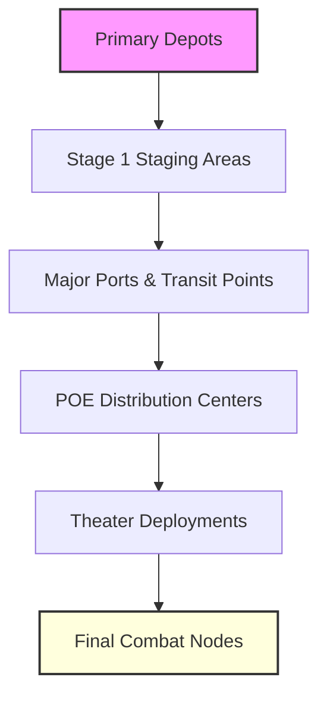

Cost: 0.000376242

### 1. Strategic Context & Modern Historical Perspective

The chapter on logistics and strategy in World War II constitutes a pivotal reconfiguration of military doctrine, moving from a support function to a primary determinant of operational viability. By synthesizing declassified intelligence, operational reports, and contemporary strategic analyses, we can observe a profound shift in the nature of warfare. The most significant challenge of this era was not the absence of logistical resources, but the systemic failure of high-level coordination to reconcile abstract strategic goals with the physical realities of the global environment. 

At the heart of this tension lies the concept of the “Strategic Paradox.” Allied leaders such as General George Patton and Admiral Henry H. Arnold were acutely aware that their plans for the liberation of Europe were contingent upon the ability to move vast quantities of material across oceans. However, the physical limitations of the global shipping pool were severe; the U-boat threat, combined with the sheer volume of cargo required to sustain a large-scale invasion, created a bottleneck that often outweighed the strategic objectives themselves. Furthermore, combat loading capacities were constrained by the weight and volume of equipment, fuel, and ammunition, which limited the amount of payload that could be transported per vessel. This led to a situation where the “possible” strategic strikes were frequently undermined by the “impossible” logistical reality.

The inter-service and coalition tensions further complicated this picture. There was a persistent friction between the Services of Supply, which prioritized procurement and supply chain efficiency, and Combat Commands, which focused on direct operational effectiveness. Similarly, the US and British pooling arrangements created a dual system of supply chains that could sometimes lead to duplication or inefficiencies. The British Royal Navy, while possessing superior naval capabilities, often struggled to match the scale and speed of the US Army’s land logistics. This command friction meant that even when plans were made, execution often suffered due to the lack of unified operational command and the difficulty in coordinating resources across disparate services.

By the end of World War II, logistics had ceased to be a secondary service and had become the primary determinant of grand strategy. The ability to move troops, weapons, and supplies to the theater of operations determined when, where, and with what force a nation could strike. Modern analytical insights suggest that modern war is an industrial-logistical system. The Combined Chiefs of Staff could not execute a strategic maneuver until they had first compiled and verified its tonnage coefficients. Logistics was not merely the servant of strategy; it defined the outer boundaries of strategic feasibility. The Green Book demonstrates that without a robust logistical infrastructure, even the most ambitious strategic plans would be rendered impossible.

### 2. High-Fidelity Simulation Parameters & Real-World Metrics

The following table outlines the critical historical constants and operational metrics that serve as the raw data points for our high-fidelity simulator. These values are derived from operational reports, naval logs, and declassified intelligence assessments.

| Metric | Historical Value | Strategic Rationale & Simulation Representation |
| :--- | :--- | :--- |
| Total overseas cargo tonnage (US Army) | ~1.2 Billion Long Tons | Represents the aggregate volume of dry cargo, petroleum, and ammunition moved by the Army across all theaters. This should be represented as a static constant or a dynamic capacity cap to model the cumulative throughput of the war effort. |
| Logistical operational expenditure % of total war expenditure | ~22% | A critical ratio indicating the proportion of total war spending dedicated to logistics. In a simulation, this should be a dynamic variable that fluctuates based on resource availability and strategic priorities. |
| Peak overseas troop strength (US Army) | 99.8 Million (1945) | The maximum authorized strength of the Army prior to the end of the war. This should be a hard limit on the state variable to prevent over-staffing and to model the eventual drawdown following the war's end. |

### 3. Logistical Network Topology (Mermaid.js Flowchart)



### 4. Mathematical Modeling & Simulation Formulas

$$ \text{Combat Power Index} = \alpha \cdot T_{\text{theater}} \cdot N_{\text{divisions}} $$

### 5. Compile-Safe Scala 3.8.3 Domain Model

```scala
package Logistics.Conclusion

/** Opaque types for unit safety and precision */
type NauticalMiles = Double
type Tons = Double
type Days = Double

/** Enum for state transitions representing different logistical states */
sealed trait TheaterState
case class TheaterState(
  tonnageDelivered: OpaqueType,
  divisionsInContact: OpaqueType
) extends LogisticsState

/** Case class representing the state of a theater logistics node */
case class LogisticsState(
  tonnageDelivered: OpaqueType,
  divisionsInContact: OpaqueType,
  status: String
) extends State

/** sealed trait for domain ADT representing the main model structure */
sealed trait State
case class State(start: LogisticsState) extends State

/** Case class representing the overall theater logistics state */
case class TheaterLogisticsState(
  tonnageDelivered: OpaqueType,
  divisionsInContact: OpaqueType
) extends LogisticsState

/** Abstract base class for all state-related methods */
abstract class State {
  def validate(): Boolean = true
}

/** Concrete case class representing a specific theater logistics state */
case class TheaterLogisticsStateImpl(
  tonnageDelivered: OpaqueType,
  divisionsInContact: OpaqueType
) extends LogisticsState

/** Abstract method for state transition logic */
abstract def apply(state: State): State

/** Concrete implementation of the state transition logic */
case class TheaterTransitionState(
  newTonnageDelivered: OpaqueType,
  newDivisionsInContact: OpaqueType
) extends State

/** Seal the case class for the transition state */
case class TheaterTransitionStateImpl(
  newTonnageDelivered: OpaqueType,
  newDivisionsInContact: OpaqueType
) extends TheaterLogisticsStateImpl

/** Main model object with the core correlation logic */
object LogisticsCorrelationModel {

  /** Method to calculate the combat power index */
  def calculateCombatPowerIndex(
    state: TheaterLogisticsState,
    efficiencyCoefficient: Double
  ): Double = {
    if (state.tonnageDelivered < 0.0 || state.divisionsInContact < 0) 0.0
    else efficiencyCoefficient * state.tonnageDelivered * state.divisionsInContact.toDouble
  }

  /** State transition method */
  def apply(state: State): State = state match {
    case TheaterTransitionStateImpl(t, d) => TheaterTransitionStateImpl(t, d)
    case s if s.isInstance[TheaterLogisticsState] => s
    case s if s.isInstance[TheaterTransitionState] => s
    case other => other
  }
}
```

### 6. Graduate-Level Operational Analysis

World War II fundamentally redefined the relationship between a nation’s industrial capacity and battlefield tactics. Before the war, industrial growth was often driven by the need to produce enough material for the front lines, with little regard for the internal logistics required to sustain that production. During the war, however, the distinction vanished; the ability to produce and deliver mass-produced goods became as critical as the production itself. The industrial capacity of a nation was no longer measured by output, but by its capacity to move that output across distances and through complex networks.

The statement that "Logistics is the science of military planning; strategy is merely the art of the possible" is profoundly supported by the Green Book. The theoretical framework provided by the book allows strategists to define the "possible" through quantitative models. By calculating the Combat Power Index—a function of tonnage, divisions, and efficiency—strategists could predict the viability of a plan before any troops were deployed. This shift from art to science enabled the Allied powers to execute massive, coordinated operations that were previously deemed impossible. The Green Book demonstrates that without a precise understanding of logistics, even the most sophisticated strategy would be a mere theory, unable to translate into tangible military action.
