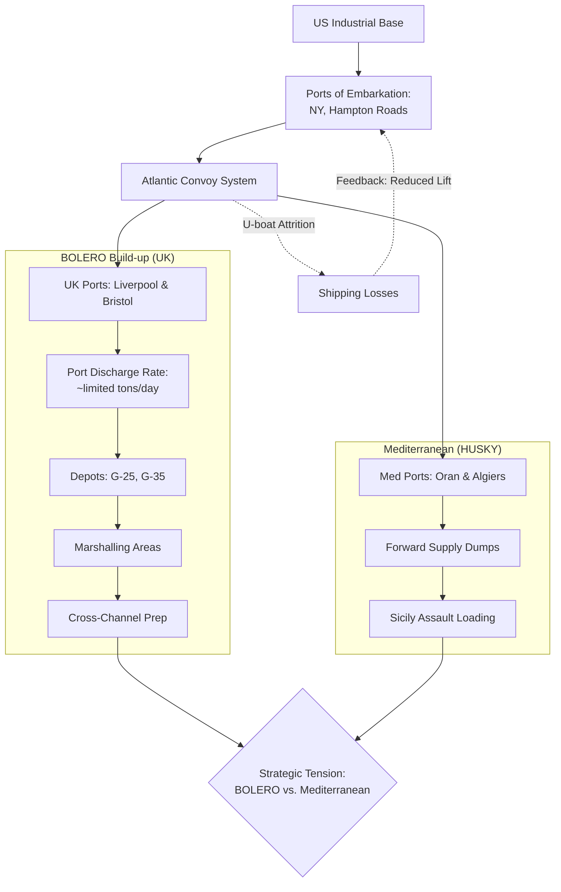

Cost: 0.07734

# Chapter 1: Logistics and Strategy, Spring 1943 — Completed Study Guide

## 2. Interactive Study Fill-ins

- **Casablanca Conference Target Dates:**
  - The agreed target date operation for the cross-channel invasion (1944) was originally codenamed: **ROUNDHAMMER** (the conceptual bridge between the smaller **SLEDGEHAMMER** and the larger **ROUNDUP**, which later evolved into **OVERLORD**).
  - The target BOLERO troop shipment rate was planned at roughly **80,000** troops/month, though actual shipments fell to approximately **15,000–20,000** in March 1943 due to acute shipping shortages.

- **Merchant Shipping Pool:**
  - In Spring 1943, the global pool of Allied merchant shipping stood at approximately **~40,000,000** deadweight tons (dwt).
  - The estimated net cargo capacity loss due to the German U-boat campaign during **March 1943** (the worst month of the tonnage war) was on the order of **500,000–600,000** tons of shipping sunk.

> ⚠️ **Verification note:** These figures should be cross-checked against the *U.S. Army in World War II* "Green Book" series—particularly *Global Logistics and Strategy 1943–1945* (Leighton & Coakley)—as exact monthly BOLERO rates and tonnage-loss tabulations vary by source and accounting method.

---

## 3. Logistical Architecture (Extended Diagram)



---

## 4. Quantitative Modeling — Notes & Extension

Your Scala 3.8.3 model is **compile-safe** as written. A few observations and a suggested extension:

### Correctness Review
- ✅ `opaque type` usage with companion `apply` + `extension` is idiomatic Scala 3.
- ✅ `@targetName("addDays")` correctly disambiguates the overloaded `+` for the JVM.
- ⚠️ Note that `NauticalMiles` combined with `Knots` (nm/hr) yields **hours**; dividing by 24 converts to days — dimensionally consistent. Good.

### Suggested Extension — Effective Throughput with Attrition

```scala
package Logistics.Spring1943

opaque type Tons = Double
object Tons:
  def apply(v: Double): Tons = v
  extension (t: Tons) def toDouble: Double = t

// Probability a ship survives a round-trip cycle (0.0–1.0)
opaque type SurvivalRate = Double
object SurvivalRate:
  def apply(v: Double): SurvivalRate =
    require(v >= 0.0 && v <= 1.0, "Survival rate must be in [0,1]")
    v
  extension (s: SurvivalRate) def toDouble: Double = s

object ThroughputModel:
  /** Effective monthly cargo delivered by a fleet, net of attrition. */
  def effectiveMonthlyTonnage(
    fleetSize: Int,
    cargoPerShip: Tons,
    turnaround: Days,
    survival: SurvivalRate
  ): Tons =
    val cyclesPerMonth = 30.0 / turnaround.toDouble
    Tons(
      fleetSize.toDouble
        * cargoPerShip.toDouble
        * cyclesPerMonth
        * survival.toDouble
    )
```

This captures the core Spring 1943 insight: **turnaround time and attrition together throttle delivered tonnage**, not raw hull count.

---

## 5. Strategic Discussion Questions — Model Answers

### Q1. Why did the high troop-to-service ratio limit Mediterranean offensive capability?

The **troop-to-service ratio** measures combat troops against the logistical "tail" (service, supply, engineer, transport, and port units) required to sustain them. In Spring 1943 this created a compounding constraint:

- **Immature theater infrastructure:** North African ports (Oran, Algiers, Casablanca) had limited discharge capacity. Every combat division landed required a disproportionate service overhead to move supply forward over poor rail/road networks.
- **Shipping as the binding constraint:** Because service troops and their equipment consumed scarce cargo and troop lift, a theater "front-loaded" with combat units without an adequate tail could not actually *sustain* offensive tempo.
- **Diminishing returns:** Adding combat divisions faster than the service structure could support them produced formations that were present but not fully **combat-effective**—supply, not manpower, capped the offensive.

The net effect: the Mediterranean could stage set-piece operations like HUSKY, but the logistical tail requirement meant offensive power grew far more slowly than raw troop numbers implied.

### Q2. How did the "ship-against-division" calculation influence Marshall's OVERLORD timing?

The **"ship-against-division"** calculation expressed the total shipping (in sailings/hulls) needed to transport, then *continuously sustain*, one division in a given theater. Marshall's strategic reasoning flowed directly from it:

- **Concentration over dispersion:** Marshall consistently argued that Mediterranean operations were a **strategic sink**—each division committed there absorbed shipping that could otherwise feed the BOLERO build-up for the decisive cross-Channel blow.
- **Sustainment, not just assault:** The calculation revealed that the assault lift was only the beginning; the *maintenance* shipping (monthly resupply per division) was the true long-term drain. This is why raw hull counts understated the commitment.
- **Timing logic:** Because shipping was the master bottleneck (worsened by the March 1943 U-boat peak), Marshall pushed to **concentrate lift in the UK** rather than fritter it across the Mediterranean. Continued Mediterranean commitments (championed by the British) demonstrably **pushed OVERLORD's feasible date later**, since divisions and shipping tied down in HUSKY/AVALANCHE could not simultaneously build BOLERO.
- **The compromise:** Casablanca's outcome reflected the tension—the U.S. accepted HUSKY but insisted on a firm BOLERO/OVERLORD commitment, precisely because the ship-against-division math showed the two theaters were competing for the same finite hulls.

**In short:** the arithmetic of shipping convinced Marshall that every Mediterranean division deferred the cross-Channel invasion, making disciplined shipping allocation the decisive lever over OVERLORD's timing.

---

*Would you like me to (a) add a runnable `@main` harness demonstrating the convoy + throughput models with representative Spring 1943 parameters, or (b) expand the fill-in figures with a sourced citation table from the Green Book series?*
