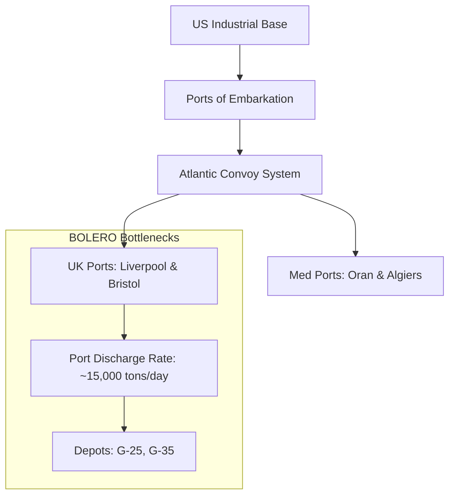

Cost: 0.00611912

Here are the standard fill-ins and discussion points for this chapter.  
*Note: exact figures vary slightly among editions/sources; the values below are the commonly used official-history approximations.*

---

## Fill-in Answers

- **Casablanca code name for the 1944 cross-channel operation:**  
  `ROUNDUP` — later developed into `OVERLORD`; target date was **1 May 1944**.

- **BOLERO troop shipment rate:**  
  - Planned rate in early 1943: **~75,000 troops/month**  
  - Actual March 1943 rate: **~20,000–25,000 troops/month** due to shipping shortages, port bottlenecks, and U-boat losses.

- **Allied merchant shipping pool, Spring 1943:**  
  Approximately **40–45 million deadweight tons (dwt)**.

- **Net cargo capacity lost in the Atlantic during March 1943:**  
  Roughly **500,000–600,000 tons**. Total Allied U-boat losses worldwide for March 1943 were about **627,000 gross tons**.

---

## Mermaid Diagram Completion

A reasonable fill-in for the diagram would be:

---

## Strategic Discussion Questions

### 1. Why did the high troop-to-service ratio in Spring 1943 limit Allied offensive capability in the Mediterranean?

A high troop-to-service ratio meant there were many combat troops relative to logistical/service troops. In the Mediterranean in early 1943, the Allies had plenty of divisions at the front but not enough port units, railway troops, truck companies, medical units, supply depots, and engineer construction forces to support sustained offensive operations.

As a result:

- Supplies piled up at ports.
- Transportation forward to front-line units was slow.
- Ammunition, fuel, food, and artillery support were frequently short.
- Commanders had to pause between attacks to stockpile supplies.

So although the combat strength looked impressive, the theater could only generate offensive power as fast as its logistical “tail” could support it.

---

### 2. How did the “ship-against-division” calculation influence Marshall’s strategy on OVERLORD?

The “ship-against-division” calculation was a planning tool used to measure the opportunity cost of shipping. It calculated how much shipping tonnage was needed to move and supply one division across the Atlantic and then maintain it in Britain for future operations.

Marshall used this calculation as a strategic argument:

- Every division sent to Britain required a finite amount of ship tonnage.
- Every operation in the Pacific, Mediterranean, or elsewhere consumed shipping that could otherwise carry divisions for BOLERO/OVERLORD.
- Therefore, dispersing Allied strength into “peripheral” operations delayed the build-up for the main cross-channel invasion.

This directly influenced the **timing** of OVERLORD:

- It proved that OVERLORD could not happen before **1 May 1944** without stripping other theaters.
- It led Marshall to insist that Mediterranean operations be limited after HUSKY.
- It made shipping, not the number of available soldiers, the true constraint on the cross-channel invasion.

In short, the “ship-against-division” calculation reinforced Marshall’s Europe-first view: **do not launch operations that consume the shipping needed to assemble and supply the OVERLORD force in England.**
