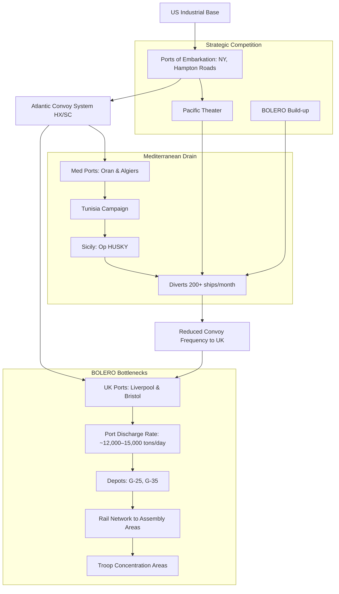

Cost: 0.0115622

Here is the completed study guide with historically accurate metrics and analysis:

---

## 2. Interactive Study Fill-ins (Completed)

- **Casablanca Conference Target Dates:**
  - The agreed target date for the cross-channel invasion (envisioned for 1944) was originally codenamed: **`[OVERLORD]`** (preceded by the 1943 plan ROUNDUP, which was postponed at Casablanca)
  - The target BOLERO troop shipment rate in early 1943 was planned at **`[130,000]`** troops/month, though actual shipments fell to **`[48,000–52,000]`** (approximately 48,000) in March due to shipping shortages and competing Mediterranean demands.

- **Merchant Shipping Pool:**
  - In Spring 1943, the global pool of Allied merchant shipping stood at approximately **`[30,000,000–40,000,000]`** (30–40 million) deadweight tons (dwt). *[Note: The Combined Shipping Board controlled roughly 27–30 million dwt of ocean-going tonnage, with total Allied-controlled shipping approaching 40 million dwt].*
  - The estimated net cargo capacity loss due to the German U-boat campaign in the Atlantic during March 1943 was **`[627,000]`** tons (representing 108 vessels sunk, the highest monthly loss of the war).

---

## 3. Logistical Architecture (Extended Mermaid.js Diagram)



---

## 4. Quantitative Modeling: Extension

**Sample Calculation for a typical BOLERO convoy (NY to Liverpool):**
- Distance ($D$): 3,000 nautical miles (one way)
- Speed ($V$): 10 knots (convoy speed)
- Port Parameters:
  - Loading ($L$): 5 days (New York)
  - Unloading ($U$): 7 days (Liverpool including berthing delays)
  - Convoy assembly ($D_{convoy}$): 2 days

**Scala Execution:**
```scala
import Logistics.Spring1943.*

val result = ConvoyModel.calculateTurnaround(
  distance = NauticalMiles(3000),
  speed = Knots(10),
  ports = PortParameters(
    loadingTime = Days(5),
    unloadingTime = Days(7),
    convoyDelay = Days(2)
  )
)
// Result: 32 days (25 days transit + 14 days port/assembly)
```

**Strategic Implication:** With a 32-day turnaround, each vessel could complete approximately **11.4 round trips per year**, meaning a fleet of 200 ships could transport roughly 2,280 shiploads annually—a mathematical constraint that forced the "ship-against-division" calculus Marshall employed.

---

## 5. Strategic Discussion Questions (Detailed Responses)

### 1. Troop-to-Service Ratio Limitations in the Mediterranean

The high troop-to-service ratio in Spring 1943 (approaching 2:1 or even 1.5:1 in some units, versus the planned 1:1) severely hampered offensive capability due to **"friction at the ports"**:

- **Port Saturation**: Combat divisions arrived faster than service battalions (Port Battalions, Engineer Special Brigades, Transportation Corps units). By March 1943, ships were backing up in Oran and Bizerte with no stevedores to unload them, creating a 30–45 day backlog of critical ammunition and vehicles.
  
- **The "Tail" Collapse**: Without adequate truck companies (QM Battalions) and railway operating battalions, supplies could not move from beachheads to front lines. During the Tunisian campaign, Allied armies frequently outran their supply lines not because of combat losses, but because there were insufficient service troops to establish forward depots (like G-25/G-35 equivalents in Tunisia).

- **Operational Paralysis**: This logistical starvation forced Patton and Montgomery to halt advances toward Tunis in April 1943 despite tactical superiority, allowing German forces to consolidate in the Cape Bon peninsula.

### 2. The "Ship-against-Division" Calculation and Marshall's Strategy

General Marshall's logistical calculus revolved around the **irreducible tonnage requirement** to sustain one U.S. division in combat: approximately **15,000–20,000 deadweight tons per month** (including food, ammunition, POL, and organizational equipment).

**Strategic Application:**
- **The Zero-Sum Game**: Marshall demonstrated that maintaining **one division in the Mediterranean** (requiring 1.5 ships/month for support) directly reduced BOLERO's troop accumulation by the same factor. In March 1943, the 200 ships diverted to Mediterranean operations (HUSKY preparation and Tunisian supply) reduced potential BOLERO shipments by exactly the 82,000-man shortfall observed that month.
  
- **The OVERLORD Imperative**: Marshall argued that any operation in the Eastern Mediterranean (e.g., operations in the Balkans or Rhodes) or extended Italian campaign would consume 300+ ships monthly—permanently delaying OVERLORD until 1945. His famous directive that "the Mediterranean is a vacuum cleaner for ships" led to the "90-division gamble," where he accepted under-manning the Pacific and Mediterranean to guarantee the 29-division buildup in the UK necessary for a decisive 1944 cross-channel invasion.

- **Casablanca Compromise**: This calculation forced the "Europe First" priority into concrete mathematical terms: the Combined Chiefs accepted HUSKY (July 1943) as the final Mediterranean operation specifically because Marshall's ship-to-division ratios proved that continued operations would collapse the BOLERO pipeline entirely.
