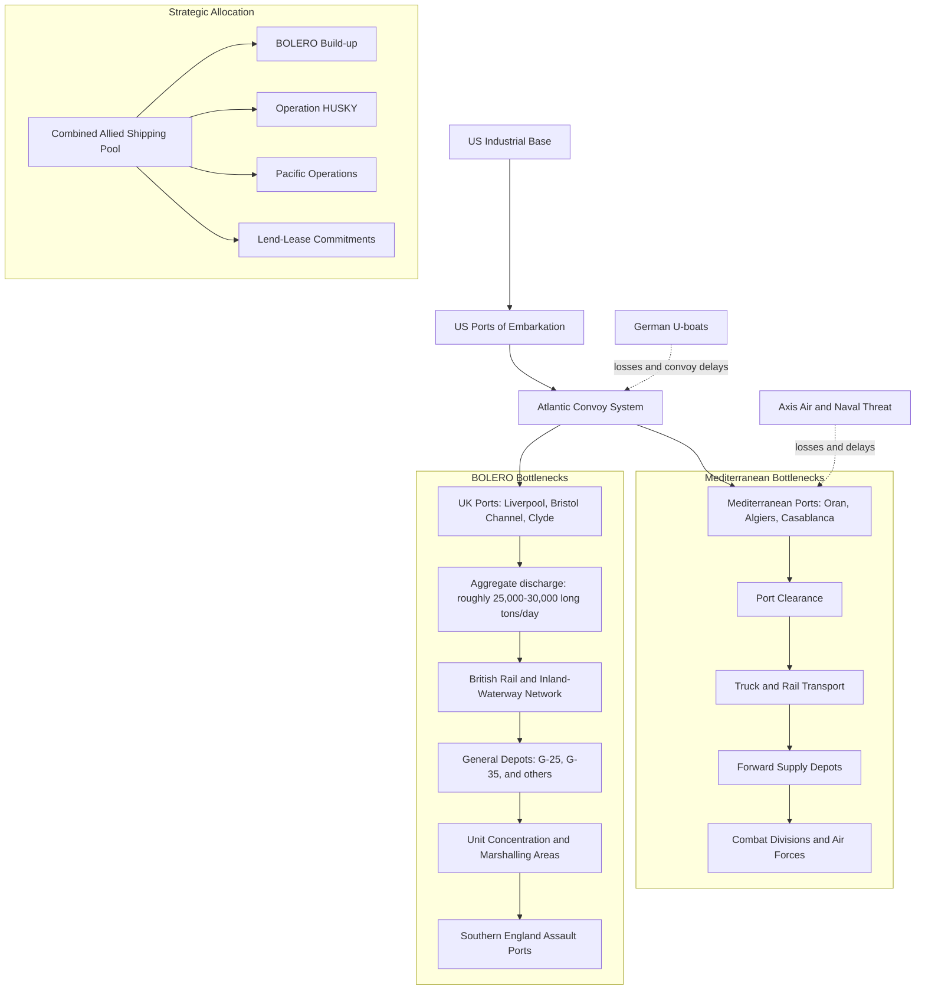

Cost: 0.141055

## 2. Completed Study Fill-ins

### Casablanca and BOLERO

- **Original cross-Channel planning name:** **ROUNDUP**
  - Casablanca endorsed preparations for a major return to the Continent in 1944, but it did not establish the final OVERLORD plan or a precise invasion date.
  - The firm **1 May 1944 planning date** was adopted at the **TRIDENT Conference in May 1943**. The name **OVERLORD** subsequently replaced ROUNDUP.

- **Planned BOLERO movement:** approximately **100,000 troops per month**
- **March 1943 movement:** approximately **20,000 troops**
  - Published totals vary slightly according to whether they count troops embarked, troops landed, or all personnel movements.

### Merchant Shipping

- **Allied-controlled ocean-going merchant pool:** approximately **50 million deadweight tons**
  - Estimates vary substantially—roughly **45–55 million dwt**—depending on whether tankers, coastal vessels, neutral shipping, and vessels under repair are included.

- **March 1943 U-boat sinkings:** approximately **627,000 gross register tons**
  - This is the commonly quoted March loss from U-boat attack, rather than a true *net* reduction in the Allied merchant fleet. New construction and other acquisitions must be included to calculate the fleet’s net change.
  - “Gross register tons,” “deadweight tons,” and actual cargo capacity are not interchangeable.

Thus, the blanks can be summarized as:

> **ROUNDUP; 100,000; 20,000; approximately 50 million dwt; approximately 627,000 gross tons.**

---

## 3. Extended Logistical Architecture

The discharge figure below should be treated as an approximate aggregate planning figure, not as the fixed capacity of every British port.

Port discharge alone did not determine throughput. Rail clearance, depot space, labor, inland transport, convoy scheduling, and the availability of escorts could reduce the effective capacity of otherwise adequate ports.

---

## 5. Strategic Discussion

### 1. Why the troop-to-service ratio restricted Mediterranean operations

The problem was more precisely an **excess of combat formations relative to service and support units**. A division’s presence in theater did not mean that it could immediately conduct sustained offensive operations. It also required:

- port and railway operating units;
- quartermaster and transportation companies;
- truck battalions;
- engineers;
- ordnance maintenance and recovery units;
- signal, medical, and replacement organizations;
- ammunition, fuel, food, and spare-parts depots;
- headquarters capable of controlling the communications zone.

North Africa’s distances magnified these requirements. Cargo had to be discharged at ports, cleared before the docks became congested, stored, and then carried hundreds of miles to operational forces. Railways were limited and often damaged, so trucks had to perform work normally assigned to rail transport. Trucks consequently consumed fuel, tires, spare parts, mechanics, and additional shipping space.

The result was a paradox: the Allies could possess numerous combat troops but still lack the logistical structure needed to move and sustain them. Adding another combat division could worsen congestion rather than increase usable striking power. Until additional service units, vehicles, port capacity, and supply stocks arrived, the armies could not exploit their nominal numerical strength.

### 2. Marshall and the “ship-against-division” calculation

Marshall’s calculation treated merchant shipping as the central strategic currency. A division imposed two separate shipping requirements:

1. **Deployment lift**—the ships needed to move its personnel, vehicles, equipment, and initial supplies.
2. **Maintenance lift**—the continuing tonnage needed for ammunition, fuel, food, replacements, spare parts, and supporting service units.

The longer a ship’s round trip, the fewer voyages it could complete each year. A vessel committed to the Mediterranean therefore remained unavailable longer than one operating on the shorter North Atlantic route to Britain. Mediterranean operations also absorbed tankers, escorts, landing craft, repair ships, and specialized amphibious shipping.

Marshall consequently viewed each additional Mediterranean commitment in terms of the divisions—and ultimately the cross-Channel invasion capacity—it displaced. Continuing beyond Sicily without a firm limitation risked:

- delaying the BOLERO concentration in Britain;
- diverting veteran divisions and service units;
- reducing the supply reserve accumulated for the invasion;
- consuming landing craft needed in northern Europe;
- allowing Mediterranean opportunities to postpone the decisive operation repeatedly.

This arithmetic reinforced Marshall’s demand for a **firm 1944 cross-Channel date**. He was not opposed to every Mediterranean operation; Sicily, for example, could secure shipping routes, eliminate Axis forces, and pressure Italy. His concern was that Mediterranean operations remain subordinate to the main concentration against Germany.

There was also a short-term complication: withdrawing divisions already in the Mediterranean required an immediate expenditure of shipping. Nevertheless, Marshall believed that accepting that one-time cost—or at least refusing to send further formations there—would preserve greater long-term lift for BOLERO and OVERLORD. In this sense, the “ship-against-division” calculation converted strategy into a measurable choice: every ship-month committed elsewhere represented troops, equipment, or reserves that could not reach Britain in time for the cross-Channel attack.
