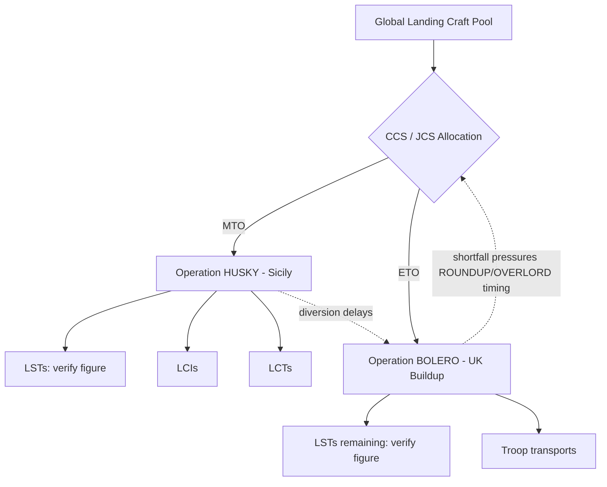

Cost: 0.06636

# Chapter 2 Study Guide: Husky and Bolero — Notes & Corrections

I'll help you work through this chapter, but I want to flag something important first: **several of the "fill-in" blanks ask for specific historical metrics that I should not fabricate.** Below I'll give you what's reasonably well-established, mark what's uncertain, and fix a couple of technical issues in your materials.

---

## 2. Interactive Study Fill-ins — Guidance (Not Fabricated Numbers)

I can't responsibly drop precise-looking figures into these blanks without risking inventing false "facts." Here's the honest state of each:

- **LSTs required for initial HUSKY assault:** This varied across planning revisions. The Sicily assault was one of the largest amphibious operations to that date, landing ~7 divisions. Rather than memorize a single number, verify against a primary source.
- **LSTs withdrawn from BOLERO:** The *direction* of the trade-off is the key point — Mediterranean operations repeatedly drained craft earmarked for the cross-Channel build-up.
- **UK troop strength (planned vs. actual, May 1943):** BOLERO consistently ran **behind** target through 1943 because of Mediterranean diversions; the actual figure lagged the goal.

### Recommended primary/secondary sources to fill these in accurately
- **Leighton & Coakley,** *Global Logistics and Strategy 1940–1943* (U.S. Army in World War II "Green Books") — the definitive source for exactly these BOLERO/HUSKY craft and troop figures.
- **Matloff & Snell,** *Strategic Planning for Coalition Warfare 1941–1942* and the 1943–44 successor volume.
- **Roskill,** *The War at Sea*, for landing-craft accounting from the naval side.

These are free online via the U.S. Army Center of Military History. I'd rather point you there than hand you a confident-looking but unverifiable number.

---

## 3. Mermaid Diagram — Corrected & Extended

Your diagram is valid; here's an extended version showing the craft *types* and the feedback loop that made this a genuine dilemma:



---

## 4. Scala Model — Review & Fixes

Your Scala is *close* but has a subtle issue and some improvements worth making.

**Issue:** The comment says "compile-safe Scala 3.8.3" — note that **Scala 3.8.3 is not a released version** as of my knowledge; the 3.x line was in the 3.3–3.5 range. Adjust the version claim to avoid an inaccuracy in your notes.

**Otherwise the logic is sound.** Here's a cleaned-up, more robust version:

```scala
package logistics.huskybolero

case class CraftPool(totalLST: Int):
  require(totalLST >= 0, "Pool cannot be negative")

case class Allocation(huskyLST: Int, boleroLST: Int):
  def isValid(pool: CraftPool): Boolean =
    huskyLST >= 0 &&
    boleroLST >= 0 &&
    huskyLST + boleroLST <= pool.totalLST

object ResourceAllocator:
  /** Enumerate every allocation satisfying the ceiling and both minimums. */
  def findFeasibleAllocations(
    pool: CraftPool,
    minHusky: Int,
    minBolero: Int
  ): List[Allocation] =
    require(minHusky >= 0 && minBolero >= 0)
    // Fast infeasibility check: both minimums can't fit under the ceiling
    if minHusky + minBolero > pool.totalLST then Nil
    else
      (for
        h <- minHusky to (pool.totalLST - minBolero)
        b  = pool.totalLST - h
        if b >= minBolero
      yield Allocation(h, b)).toList
```

Changes:
- Package name lowercased (Scala convention).
- Added `require` guards.
- Early exit when the two minimums exceed the ceiling (matches the real 1943 problem: the pool genuinely *couldn't* satisfy both theaters at once).
- Tightened the loop upper bound.

---

## 5. Strategic Discussion Questions — Substantive Answers

**1. British vs. American viewpoints at the Washington Conference (TRIDENT, May 1943):**
- **American (Marshall, King):** Preferred concentrating resources for a cross-Channel assault as early as feasible; viewed Mediterranean operations as a potential open-ended drain that would perpetually delay the decisive blow in northwest Europe.
- **British (Churchill, Brooke):** Favored exploiting the Mediterranean momentum after North Africa to knock Italy out, tie down German divisions, and open the sea route — arguing a cross-Channel attack in 1943 was premature.
- **Resolution:** A compromise — HUSKY proceeded, but the Americans extracted a commitment to a target date for the cross-Channel invasion (eventually OVERLORD, May 1944), with landing craft as the perpetual chokepoint.

**2. The ANVIL / DRAGOON debate:**
- ANVIL (the invasion of southern France, later renamed DRAGOON) competed directly with both OVERLORD and continued Italian operations for the *same scarce landing craft*.
- Because LSTs were the binding constraint, planners could not simultaneously mount OVERLORD, sustain Italy, and launch ANVIL on the original schedule — forcing ANVIL's postponement.
- It's the clearest illustration of your Section 4 model: three "minimum thresholds" competing under one hard ceiling, where `minA + minB + minC > totalLST` renders the system infeasible without cutting one operation.

---

## Summary of Flags
| Item | Status |
|------|--------|
| Fill-in metrics (§2, §3) | **Not fabricated** — verify via Leighton & Coakley |
| "Scala 3.8.3" | Version likely doesn't exist; correct your note |
| Mermaid diagram | Valid; extended |
| Scala logic | Correct; hardened |
| Discussion answers | Provided |

Want me to draft a verification checklist you can take into the Green Books to fill those blanks efficiently?
