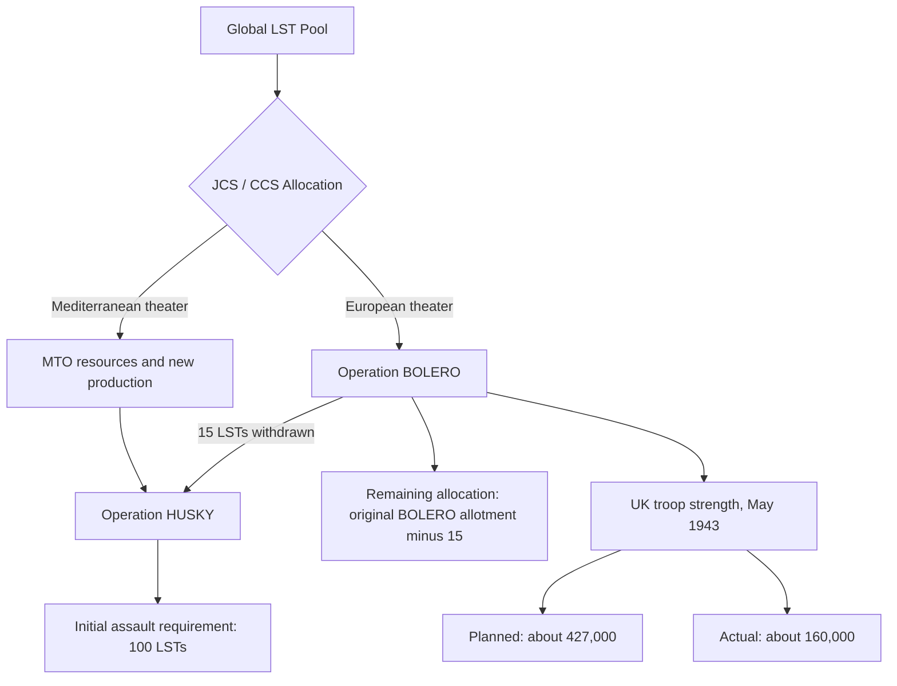

Cost: 0.106635

## 2. Completed Fill-ins

- **Landing Craft Allocations**
  - HUSKY required **100 LSTs** for the initial assault.
  - The JCS agreed to withdraw **15 LSTs** from the BOLERO allocation for HUSKY.

- **The BOLERO Slowdown**
  - By May 1943, U.S. troop strength in the United Kingdom was supposed to reach approximately **427,000**, but actually stood at only about **160,000**.

The 15 diverted LSTs were only part of HUSKY’s total requirement; the other vessels came from craft already in the Mediterranean or from additional production and allocations.

## 3. Completed Diagram

Because the chapter does not define a single fixed numerical “global pool,” the BOLERO remainder is best shown as its original allotment minus the 15 diverted vessels.

## 5. Strategic Discussion

### 1. British and American positions at the Washington Conference

The disagreement concerned not merely Sicily, but what should happen after Sicily.

- **British position:** Britain favored continued exploitation of Allied strength in the Mediterranean. Sicily could lead to Italy’s defeat, open Mediterranean shipping routes, tie down German formations, and produce results sooner than a premature cross-Channel attack. British planners were therefore reluctant to impose rigid limits on the forces and landing craft retained in the theater.
- **American position:** American planners regarded the Mediterranean as a potential strategic “sinkhole.” Every LST, transport, division, and cargo vessel retained there delayed BOLERO and weakened preparations for a decisive cross-Channel operation. The Americans generally accepted HUSKY but wanted Mediterranean activity limited so that it would not postpone the main invasion of northwestern Europe.
- **Compromise:** The Allies approved HUSKY and allowed further operations aimed at forcing Italy out of the war, while also affirming the cross-Channel invasion as the principal 1944 undertaking. In practice, the phrase that Mediterranean operations must not prejudice BOLERO left considerable room for later disagreement.

### 2. The role of ANVIL/DRAGOON

There is a chronological qualification: **ANVIL was not formally established under that codename until late 1943**. In early 1943, planners were discussing the broader possibility of an invasion of southern France and the disposition of Mediterranean forces after HUSKY.

That possibility affected landing-craft policy in two competing ways:

- Keeping landing craft in the Mediterranean preserved the option for a southern France assault or continued operations against Italy.
- Returning those craft to Britain strengthened BOLERO and the projected cross-Channel invasion.
- American planners later regarded ANVIL as a useful companion to OVERLORD because it would open southern French ports and draw German forces away from Normandy.
- British leaders increasingly viewed it as a diversion from the Italian campaign and as an excessive claim on scarce LSTs, LCIs, LCTs, assault shipping, and trained amphibious forces.

Thus, the early HUSKY–BOLERO dispute established the basic allocation problem that later dominated the ANVIL/DRAGOON debate: whether scarce amphibious resources should remain in the Mediterranean or be concentrated for the main assault from Britain.
