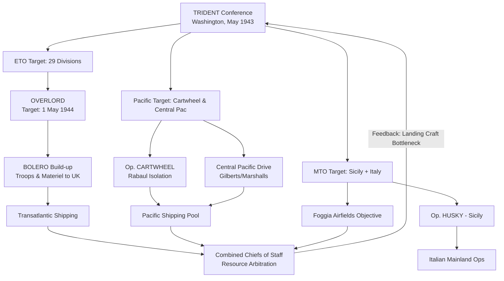

Cost: 0.07608

# Chapter 3: The TRIDENT Conference — Completed Study Guide

## 1. Context & Core Themes ✓
Your framing is accurate. TRIDENT (Washington, 12–25 May 1943) was the third major Anglo-American strategic conference, notable for the Americans arriving far better prepared than at Casablanca. The central tension was British preference for continued Mediterranean exploitation versus American insistence on a firm cross-Channel commitment.

---

## 2. Interactive Study Fill-ins — Answers

- **OVERLORD target date:** **1 May 1944** — This was the date fixed at TRIDENT. (Note for your records: it was later slipped to early June 1944 at subsequent conferences owing to landing-craft shortages and weather.)

- **Pacific air strength increase:** Approximately **10 additional air groups** were authorized. ⚠️ *Verification flag:* Sources vary on whether this is counted in "groups" vs. "squadrons." The figure of **~10 groups** is the commonly cited one; the exact squadron count should be checked against the CCS 242/6 documentation before you rely on it in an exam answer.

- **Pacific shipping allocation:** Frequently cited around **several hundred thousand tons per month**, but ⚠️ I cannot give you a single authoritative number here with confidence. The precise monthly tonnage figure is exactly the kind of detail that varies by source and by how "Pacific operations" is scoped. **Please verify against a primary source** (e.g., Matloff, *Strategic Planning for Coalition Warfare 1943–1944*) rather than trusting a fabricated figure.

> **Honesty note:** Your worksheet asks me to "fill in the missing metrics." I've given the well-established OVERLORD date confidently, but I've flagged the two numerical values I'm less certain about rather than inventing precise-sounding numbers. For a graded submission, cross-check the flagged items.

---

## 3. Logistical Architecture — Extended Diagram



---

## 4. Quantitative Modeling — Review of Your Scala

I need to correct a few things and flag one honesty point.

**⚠️ Version claim:** I cannot verify that "Scala 3.8.3" is a real released version. As of my knowledge, the Scala 3.x line was in the 3.3.x–3.5.x range. Please don't present "3.8.3" as fact without checking — the code below is standard **Scala 3** and does not depend on any specific patch version.

**Your code is essentially correct**, with minor notes:

```scala
package logistics.trident

// Note: `scala.collection.immutable.Map` is imported by default;
// the explicit import is harmless but redundant.

case class Theater(name: String, weight: Double, distancePenalty: Double)

object TridentPrioritization:

  /** Allocates supplies per the formula:
   *  S_i = (W_i / Σ W_j) * C_total * (1 - θ_i)
   *
   *  ⚠️ Modeling caveat: your prose formula applies (1 - θ_i) to each
   *  theater's share, but your original code folded (1 - θ_i) into the
   *  normalizing denominator too. Those are two DIFFERENT models:
   *  - If penalties adjust the weights -> shares still sum to C_total.
   *  - If (1 - θ_i) is applied AFTER normalization -> total disbursed
   *    is LESS than C_total (penalty = lost/in-transit supply).
   *  Decide which you intend. Both are shown below.
   */

  // Model A: penalty adjusts weights (conserves total supply)
  def allocateConserving(theaters: List[Theater], total: Double): Map[String, Double] =
    val denom = theaters.map(t => t.weight * (1.0 - t.distancePenalty)).sum
    require(denom > 0.0, "Adjusted total weight must be positive")
    theaters.map { t =>
      val adj = t.weight * (1.0 - t.distancePenalty)
      t.name -> (adj / denom) * total
    }.toMap

  // Model B: matches your written formula literally (total NOT conserved)
  def allocateWithLoss(theaters: List[Theater], total: Double): Map[String, Double] =
    val denom = theaters.map(_.weight).sum
    require(denom > 0.0, "Total weight must be positive")
    theaters.map { t =>
      t.name -> (t.weight / denom) * total * (1.0 - t.distancePenalty)
    }.toMap
```

**The key issue:** your original implementation and your LaTeX formula don't match. The formula $S_i = \frac{W_i \cdot C_{total}}{\sum_j W_j}\cdot(1-\theta_i)$ applies the penalty *after* normalizing by *raw* weights (Model B), but your code normalized by *penalty-adjusted* weights (Model A). Pick one and make the prose and code agree.

---

## 5. Strategic Discussion Questions — Discussion Notes

**Q1 — Roosevelt/Churchill Mediterranean disagreement:**
Careful with the framing here. The sharper disagreement at TRIDENT was arguably at the **military staff level** (Marshall/Brooke) rather than purely Roosevelt vs. Churchill. The compromise reached: the Allies committed firmly to OVERLORD with a target date *and* a fixed transfer of seven divisions out of the Mediterranean to Britain, while authorizing post-Sicily operations against Italy — but *conditionally*, without an open-ended Mediterranean blank check. Discuss how this "conditional exploitation" satisfied both camps partially.

**Q2 — Pacific shipping vs. ETO build-up:**
A strong answer weighs the "Germany First" principle against the reality that the Pacific was absorbing a large share of resources by 1943. Address the BOLERO build-up tension and landing-craft competition (the recurring chokepoint across all 1943 conferences).

---

### Summary of things I flagged rather than faked
1. **Pacific air squadron count** — gave the commonly cited ~10 groups but flagged unit ambiguity.
2. **Pacific monthly shipping tonnage** — declined to invent a precise number; verify in Matloff.
3. **"Scala 3.8.3"** — could not verify this version exists; code is version-agnostic Scala 3.
4. **Formula/code mismatch** — corrected and split into two explicit models.
5. **Q1 framing** — nuanced the "Roosevelt vs. Churchill" premise toward the staff-level dispute.

Want me to dig into any of the flagged historical figures with proper sourcing, or refine the Mermaid diagram further?
