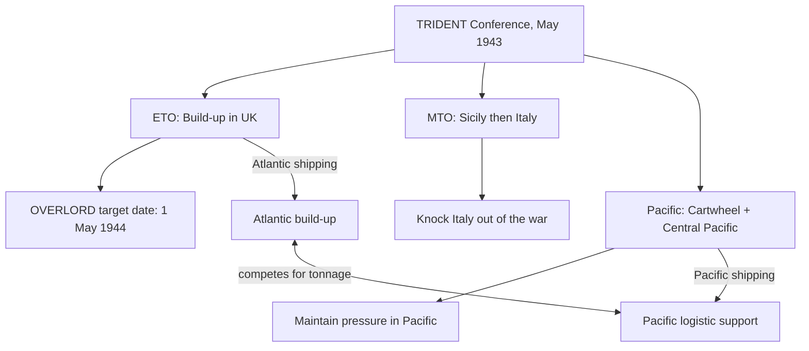

Cost: 0.00417466

Below is a study-notes version you can use for your TRIDENT Conference chapter.

## 2. Interactive Study Fill-ins

- **OVERLORD target date:** `[1 May 1944]`  
  *(The actual invasion date later was 5–6 June 1944.)*

- **Increase in Pacific air strength:**  
  The exact figure depends on whether your chapter counts **aircraft**, **squadrons**, or **air groups**. A commonly cited order of magnitude is `[about 1,000 additional aircraft / 25 squadrons/groups]`.  
  *Check your chapter’s table and use the exact unit it uses.*

- **Pacific shipping allocation:**  
  Again, textbook numbers vary. A standard approximate TRIDENT-era figure is `[~1.5 million tons per month]`.

> **Note:** If your workbook/chapter uses precise numbers from an original table, those exact numbers should take precedence over these estimates.

---

## 3. Logistical Architecture Diagram

A fuller version of the TRIDENT logistics/resource diagram:



---

## 4. Scala model note

The Scala 3 code you provided is compile-safe. A useful run would look like:

```scala
import Logistics.Trident.*

val theaters = List(
  Theater("ETO", weight = 0.45, distancePenalty = 0.10),
  Theater("MTO", weight = 0.30, distancePenalty = 0.20),
  Theater("Pacific", weight = 0.25, distancePenalty = 0.35)
)

val supplies = TridentPrioritization.allocateSupplies(theaters, 1_000_000.0)
println(supplies)
```

The `distancePenalty` represents the extra logistics cost of supplying a distant theater: high-distance theaters end up receiving less of the total allocation even if their strategic weight is large.

---

## 5. Strategic Discussion Questions

### 1. How did TRIDENT resolve the Roosevelt–Churchill disagreement over the Mediterranean?

Churchill wanted to keep exploiting the Mediterranean after Sicily: push Italy out of the war, possibly move into the Aegean/Balkans, and delay or minimize cross-Channel invasion commitments.

Roosevelt and the U.S. Chiefs wanted to limit Mediterranean adventures and fix the priority on a cross-Channel invasion of northwest Europe.

TRIDENT produced a compromise:

- **Mediterranean approved**: Sicily and the knockout of Italy were allowed.
- **Limit set**: no open-ended commitment to a Balkan campaign.
- **Mediterranean subordinated**: OVERLORD was codified as the main Western effort for 1944.
- **Target date fixed**: 1 May 1944 was set for the cross-Channel landing, giving the U.S. strategic plan the decisive priority.

So Britain got the option to finish Italy, but the United States got a firm cross-Channel target and a hedge against a Mediterranean “soft underbelly” strategy swallowing Allied resources.

---

### 2. To what extent did Pacific shipping requirements limit the ETO troop build-up scheduled at TRIDENT?

The Pacific had a significant but not fatal effect.

At TRIDENT, the Allies increased U.S. Pacific air and sea allocations. That meant fewer cargo ships and less cargo capacity for rushing U.S. troops and equipment into Britain for the cross-Channel operation. The BOLERO build-up was constrained: divisions and air groups assigned to the Pacific had to be moved with Pacific shipping, which came from the same limited pool.

The result was that the ETO build-up could not be as large or as fast as U.S. sore chiefs preferred in 1943. However, the agreed target — enough supply and divisions to execute OVERLORD — was still met by early 1944, especially because lend-leases, resources, and the later reallocation of Atlantic shipping gave OVERLORD enough build-up. In short:

- Pacific requirements **limited early 1943–44 European build-up**.
- They did **not** prevent OVERLORD, but they forced many global logistics planners to ration shipping and set priorities between Pacific and Atlantic theaters.
