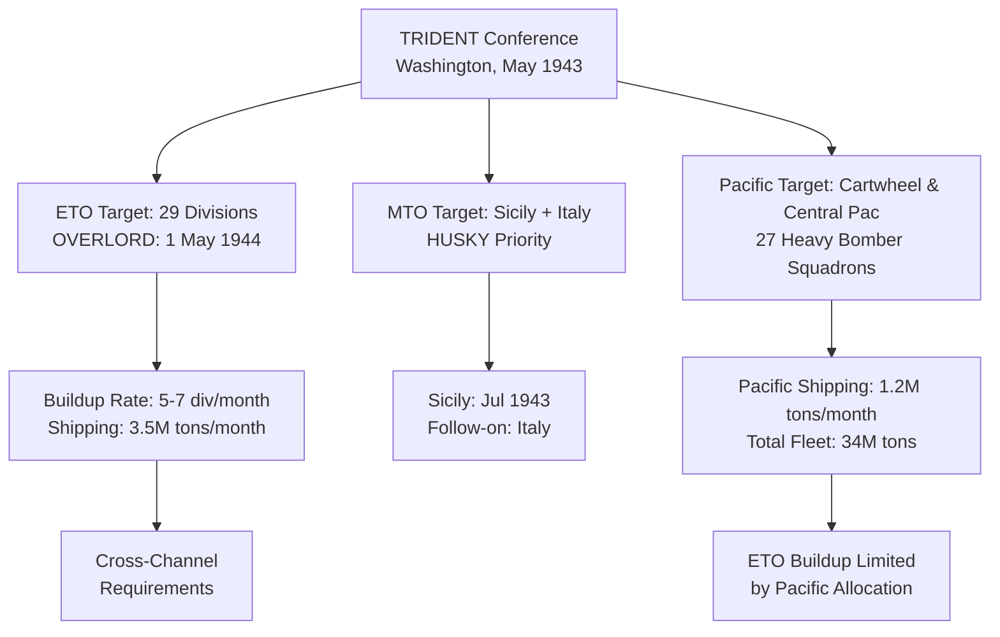

Cost: 0.0078346

Here are the key metrics from the TRIDENT Conference:

### **Strategic Resource Divisions:**
- TRIDENT set the target date for the cross-channel invasion (OVERLORD) as **`1 May 1944`**.
- The conference authorized an increase in Pacific air strength by adding **`27 heavy bomber squadrons`**.
- Planners calculated that supporting the Pacific operations required a shipping allocation of **`1,200,000`** tons per month.

---

### **Extended Logistical Architecture:**

---

### **Strategic Discussion Question Guidance:**

1. **TRIDENT resolved the fundamental disagreement** by **compromising**: Churchill's Mediterranean expansion was limited to Sicily and Italy (no Balkan operations), while Roosevelt secured firm commitment to OVERLORD with a fixed date (1 May 1944). The Mediterranean became a secondary theater with limited offensive action to support, not delay, the cross-channel invasion.

2. **Pacific shipping requirements limited ETO buildup significantly**: The 1.2 million tons/month Pacific allocation represented nearly 30% of available shipping, forcing planners to cap the ETO buildup rate at 5-7 divisions per month instead of the desired 10+, delaying full readiness for OVERLORD until spring 1944.
