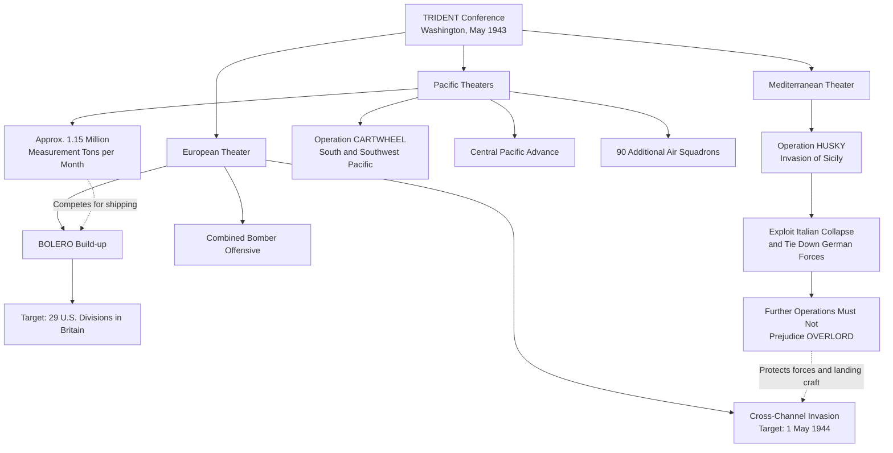

Cost: 0.102185

## 2. Completed Study Fill-ins

- **Strategic Resource Divisions**
  - TRIDENT set the target date for the cross-channel invasion—later designated **OVERLORD—as 1 May 1944**.
  - The conference authorized an increase in Pacific air strength of **90 additional air squadrons**.
  - Supporting the approved Pacific operations required approximately **1,150,000 measurement tons of shipping per month**.

> “Measurement tons” represented cargo volume rather than ship deadweight. Some accounts round the shipping figure to roughly **1.1–1.2 million tons monthly**.

---

## 3. Expanded Logistical Architecture

---

## 4. Modeling Note

The Scala implementation is internally consistent, but it differs slightly from the displayed mathematical formula. The code normalizes **distance-adjusted weights**, so the corresponding equation is:

\[
S_i =
\frac{W_i(1-\theta_i)}
{\sum_j W_j(1-\theta_j)}
\cdot C_{\text{total}}
\]

This version ensures that all theater allocations sum exactly to \(C_{\text{total}}\). The original displayed formula divides only by \(\sum_j W_j\), so some supplies would remain unallocated whenever distance penalties are positive.

---

## 5. Strategic Discussion

### 1. How did TRIDENT resolve the Mediterranean disagreement?

TRIDENT produced a **compromise rather than a complete resolution**. The British, especially Churchill, wanted freedom to exploit success in the Mediterranean after Sicily, potentially through Italy or elsewhere around the eastern Mediterranean. American planners feared that an open-ended Mediterranean campaign would consume divisions, landing craft, aircraft, and shipping needed for the decisive cross-Channel attack.

The compromise had three principal elements:

- **OVERLORD received a firm target date of 1 May 1944.**
- The United States would build toward a force of approximately **29 divisions in Britain**.
- Operations after Sicily could seek to eliminate Italy from the war and tie down German forces, but they were **not to jeopardize the forces and equipment required for OVERLORD**.

Thus Churchill preserved the possibility of further action in Italy, while the Americans obtained a timetable and resource protection for the cross-Channel invasion. Decisions about the exact scope of the Italian campaign were effectively deferred until the results of HUSKY became clear.

### 2. How much did Pacific shipping requirements limit the ETO build-up?

They imposed a **significant but not decisive limitation**. The Pacific allocation—about **1.15 million measurement tons per month**—removed cargo capacity, troop lift, tankers, and support shipping that otherwise could have accelerated BOLERO, the movement of American forces and matériel to Britain.

The consequences included:

- A slower ETO accumulation than envisioned in earlier, more ambitious BOLERO plans.
- A practical ceiling of roughly **29 U.S. divisions in Britain** for the planned invasion period.
- Continued competition for specialized resources, especially landing craft, escorts, aircraft, and service units.
- Less flexibility to recover from delays caused by Mediterranean commitments or Atlantic shipping losses.

Nevertheless, TRIDENT did not allow Pacific demands to displace the agreed strategy of defeating Germany first. Pacific operations were expanded within a defined shipping allocation, while OVERLORD’s date and minimum force structure were protected. Pacific requirements therefore **constrained the size and speed of the ETO build-up without canceling its strategic priority**.
