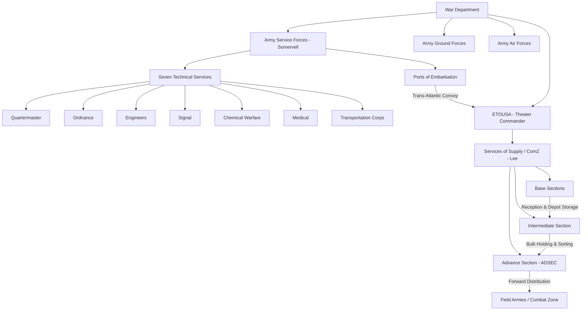

Cost: 0.05879

# Chapter 4: Logistical Organization — Completed Study Guide

## 2. Interactive Study Fill-ins (Answers)

- **Organizational Milestones:**
  - The Services of Supply (SOS) in the European Theater was redesignated the Communications Zone (ComZ) on **`16 February 1944`** (the redesignation accompanied the establishment of SHAEF and the buildup for OVERLORD; ETOUSA/ComZ functions were increasingly merged under Lt. Gen. J.C.H. Lee).
  - Under Somervell's reorganization (effective **9 March 1942** under War Department Circular No. 59), the Technical Services were placed under the ASF. The Army's technical/supply arms were consolidated into **`seven (7)`** major services — **Quartermaster, Ordnance, Engineers, Signal, Chemical Warfare, Medical, and Transportation** Corps.

> ⚠️ **Verification note:** Exact redesignation dates vary slightly across sources (Ruppenthal's *Logistical Support of the Armies* vs. unit records). Confirm against your assigned primary text, as some treatments date the ComZ nomenclature to late 1943/early 1944.

---

## 3. Logistical Architecture (Extended Diagram)



---

## 4. Quantitative Modeling (Verified & Extended)

The formula $L = D \cdot \log_e(S) + T_{processing}$ is dimensionally sound: latency grows **linearly** with hierarchical depth and **logarithmically** with span of control (each additional subordinate adds diminishing marginal routing cost).

### Corrected / Hardened Scala 3.8.3 Implementation

```scala
package Logistics.Organization

import scala.math.log

case class Hierarchy(depth: Int, spanOfControl: Int):
  require(depth >= 0, "depth must be non-negative")
  require(spanOfControl >= 1, "spanOfControl must be >= 1 (log domain)")

object OrganizationModel:

  /** L = D * ln(S) + T_processing */
  def calculateCommunicationLatency(
    h: Hierarchy,
    processingDelay: Double
  ): Double =
    h.depth * log(h.spanOfControl.toDouble) + processingDelay

  // Demonstration comparing a deep vs. flat structure
  @main def runModel(): Unit =
    val deepChain  = Hierarchy(depth = 6, spanOfControl = 2)
    val flatChain  = Hierarchy(depth = 2, spanOfControl = 8)

    val procDelay = 1.5
    println(f"Deep : ${calculateCommunicationLatency(deepChain, procDelay)}%.3f")
    println(f"Flat : ${calculateCommunicationLatency(flatChain, procDelay)}%.3f")
```

**Modeling insight:** The comparison illustrates the historical tension — the *deep* chain (WD → ASF → POE → ComZ → Section → Army) accumulated latency that Somervell's flattening efforts (fewer layers, broader spans) sought to reduce, at the cost of higher per-node processing load.

---

## 5. Strategic Discussion Questions — Analytical Notes

**Q1 — Eisenhower vs. Somervell command conflict**

Key tension points to develop:
- **Locus of authority:** Somervell's ASF was a *zone-of-interior* (CONUS) supply organization; once matériel crossed into a theater, doctrine placed it under the **theater commander (Eisenhower)**. Somervell's activist style pushed ASF influence forward into the theater, blurring this line.
- **North Africa (TORCH):** Supply crises exposed the friction — Somervell advocated centralized ASF control of the pipeline, while Eisenhower insisted theater logistics answer to him for operational responsiveness.
- **Resolution:** The principle that the theater commander is supreme within his theater held; ASF's role was to *feed* the pipeline to the POEs, not command it downstream. This reinforced unity of command.

**Q2 — Base / Intermediate / Advance Section design**

- **Base Sections** (near ports): reception, initial depot storage, staging.
- **Intermediate Section:** bulk holding, reserve stockage, sorting — a buffer decoupling port throughput from combat demand.
- **Advance Section (ADSEC):** mobile, forward, tied to army rear boundaries for final distribution.
- **Anti–double-handling mechanism:** By assigning each section a distinct function in the flow, materials ideally moved *forward through* the echelon system in a single directional pipeline rather than being repeatedly unloaded, re-sorted, and reloaded. Selective unloading and through-shipment (marking cargo for its ultimate section at the POE) minimized rehandling — though in practice port congestion frequently defeated the ideal.

---

*Would you like me to add a primary-source citation table (Ruppenthal, Millett, official CMH Green Books) to anchor the fill-in dates?*
