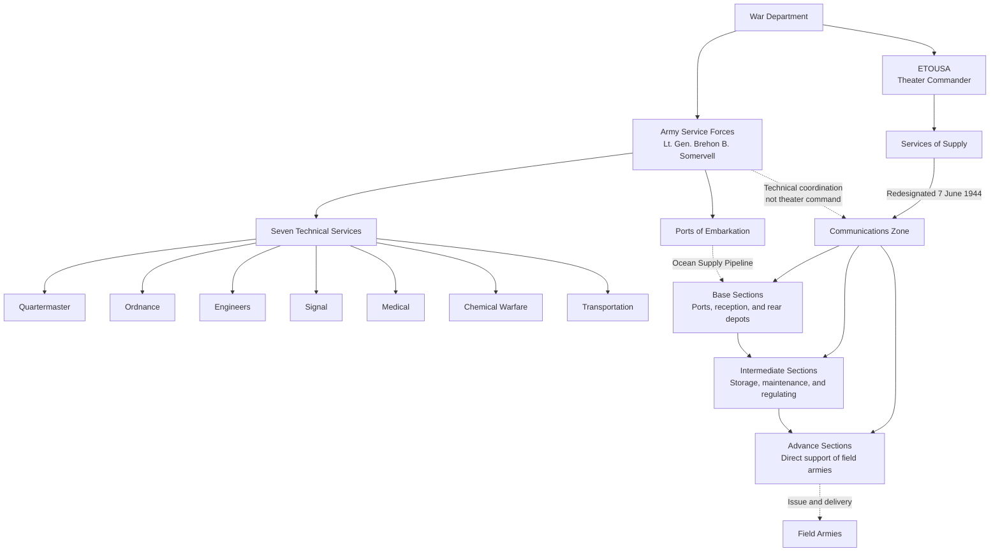

Cost: 0.093565

## 1. Completed Organizational Milestones

- The Services of Supply in the European Theater was redesignated the **Communications Zone (ComZ) on 7 June 1944**, the day after the Normandy landings.
- Under Somervell’s reorganization, the Army’s technical services were consolidated into **seven** major services:
  1. Quartermaster Corps  
  2. Ordnance Department  
  3. Corps of Engineers  
  4. Signal Corps  
  5. Medical Department  
  6. Chemical Warfare Service  
  7. Transportation Corps  

“Technical Services” is the more precise collective term; not all seven were formally styled as corps.

---

## 2. Extended Logistical Architecture

Solid lines below represent command relationships; dashed lines represent supply movement or technical coordination.

---

## 3. Strategic Discussion

### 1. Eisenhower–Somervell conflicts over logistical control

The basic dispute concerned the boundary between **centralized logistical administration** and **theater command authority**.

Somervell, as commander of the ASF, controlled procurement, storage, transportation, ports of embarkation, and the American portion of the overseas supply pipeline. He favored strong theater Services of Supply organizations patterned after the ASF, with centralized control over depots, transportation, construction, and technical services. He and his staff also maintained close technical contact with overseas supply officers.

Eisenhower, however, insisted on the principle of **unity of command**: once personnel and matériel were assigned to a theater, their employment had to be governed by the theater commander’s operational priorities. Technical-service channels to Washington could provide information and expertise, but they could not become an independent command system bypassing theater headquarters.

#### England

In England, the BOLERO buildup produced a large SOS organization under Maj. Gen. John C. H. Lee. Somervell supported Lee’s efforts to centralize logistical functions and grant the SOS considerable administrative autonomy. Eisenhower needed this strong organization but was wary of allowing it to become, in effect, an overseas extension of the ASF independent of theater control.

The tension was therefore not simply personal. It reflected competing needs:

- Somervell wanted standardized procedures and efficient management of the global supply pipeline.
- Eisenhower needed the freedom to change priorities according to operational plans.
- Lee sought sufficient authority to operate ports, depots, transportation, construction, and replacement systems without continual intervention by operational staffs.

#### North Africa

Operation TORCH made the problem more complicated. North Africa was an active, multinational theater, whereas England was simultaneously a major base for future operations against northwest Europe. Early North African logistics were divided among task forces, ports, Allied Force Headquarters, theater G-4 staffs, and technical-service organizations.

Somervell favored establishing a conventional, centralized SOS structure rather than leaving logistical operations fragmented among staff sections and separate task forces. Eisenhower had to ensure that any such organization remained subordinate to Allied and theater operational requirements. He also had to balance urgent North African demands against the continued buildup in Britain.

The eventual establishment of a more regular SOS organization in North Africa represented a compromise: logistics became more centralized, but the SOS remained subordinate to the theater commander rather than to Somervell’s ASF.

---

### 2. How geographical sections reduced double-handling

The Base, Intermediate, and Advance Sections divided responsibility geographically and functionally:

- **Base Sections** operated ports, reception facilities, and large rear-area depots.
- **Intermediate Sections** managed reserve stocks, repair installations, transportation links, and regulating stations.
- **Advance Sections** maintained stocks close to the armies and delivered supplies to forward users.

This structure reduced double-handling in several ways:

1. **Clear territorial responsibility:** Each installation and transportation route belonged to a designated section, reducing overlapping organizations.
2. **Planned routing:** Cargo could be classified at the port and sent directly to the appropriate depot or forward area.
3. **Through shipment:** Supplies urgently needed by the armies could bypass unnecessary rear depots instead of being unloaded, stored, reloaded, and reclassified repeatedly.
4. **Echeloned stocks:** Base reserves, intermediate stocks, and advance stocks had distinct purposes, limiting duplication.
5. **Central movement control:** Regulating stations and transportation authorities matched shipments to available rail, road, and port capacity.
6. **Single requisition chain:** Forward units requested supplies through established channels rather than drawing independently from several rear agencies.

The system did not eliminate all physical rehandling—especially when ports, railways, or tactical conditions changed—but it reduced unnecessary transfers by assigning each section a defined role in the supply pipeline.

### Sources

- Roland G. Ruppenthal, *Logistical Support of the Armies*, Vol. I.
- John D. Millett, *The Organization and Role of the Army Service Forces*.
