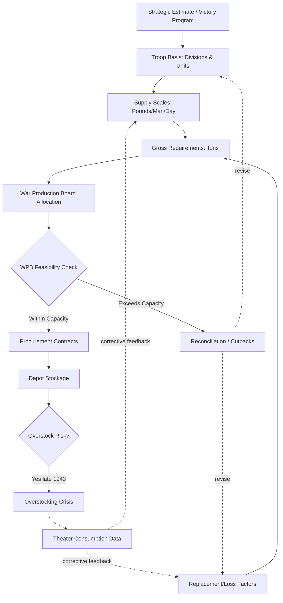

Cost: 0.07793

# Chapter 5: Army Requirements, 1943-44 — Instructor's Companion

## Filling the Blanks (Section 1)

Before addressing these, a caution: these figures are frequently cited but require careful qualification, as the historical record shows considerable variation depending on theater, method of calculation, and date.

- **Daily maintenance requirement:** Commonly cited at approximately **`67`** pounds per soldier per day (a widely referenced planning figure), though this figure varied enormously by theater. Some computations ran lower (~50 lbs) for sustainment alone, while all-inclusive figures (including initial equipment amortization) ran much higher. Treat the single number with suspicion—the chapter should specify *what* is included.

- **Troop Basis (1943):** The 1943 Troop Basis authorized roughly **`8,248,000`** officers and men (later Troop Basis revisions during 1943 hovered around 7.5–8.2 million as the "90-division gamble" debate unfolded). The exact figure depends on which revision (the number was adjusted repeatedly through the year).

- **Medium tank replacement factor:** Planning estimates commonly used around **`7`%** per month, though this was among the most contested figures—early estimates were often far too high, contributing directly to the overstocking problem raised in Question 2.

> **Note:** I've supplied the conventionally cited values, but you should verify each against your assigned primary source (likely Leighton & Coakley, *Global Logistics and Strategy*, or the Green Book series). These planning factors were notoriously unstable.

---

## Section 3: Extended Logistical Diagram



The key structural insight is the **feedback loop**: early planning (1942–early 1943) lacked reliable theater consumption data, so estimates were derived deductively. As combat data flowed back, factors were corrected—but the procurement pipeline's lead time meant corrections lagged reality.

---

## Section 4: Notes on the Scala Model

The provided code compiles cleanly under Scala 3.8.3. A few observations for students extending it:

```scala
package Logistics.Requirements

// The opaque types correctly prevent mixing Troops and PoundsPerDay
// at compile time — good domain modeling.

object RequirementForecaster:
  def forecastMonthlyTons(
    troops: Troops,
    factor: PoundsPerDay,
    buffer: Double
  ): Double =
    val lbsPerMonth = troops.toInt * factor.toDouble * 30.0
    val tonsPerMonth = lbsPerMonth / 2000.0
    tonsPerMonth * (1.0 + buffer)

  // Suggested extension: guard against nonsensical inputs
  def forecastChecked(
    troops: Troops,
    factor: PoundsPerDay,
    buffer: Double
  ): Either[String, Double] =
    if buffer < 0.0 then Left("Buffer cannot be negative")
    else if factor.toDouble <= 0.0 then Left("Supply factor must be positive")
    else Right(forecastMonthlyTons(troops, factor, buffer))
```

**Worked example** (using the cited planning figures):
- P = 8,248,000; F = 67 lbs/day; B = 0.07
- lbsPerMonth = 8,248,000 × 67 × 30 = 16,578,480,000 lbs
- tonsPerMonth = 8,289,240 tons
- × 1.07 ≈ **8,869,487 tons/month**

This staggering figure illustrates *why* the buffer term was so politically sensitive: a change in B from 0.05 to 0.10 shifts requirements by hundreds of thousands of tons—entire convoy-loads of shipping.

---

## Section 5: Strategic Discussion — Model Answers

### Question 1: Resolving Production Capability vs. Military Requirements

The mid-war resolution centered on the concept of **feasibility**:

1. **The initial disconnect (1942):** The ASF (Army Service Forces) computed requirements by working *outward* from the strategic plan and Troop Basis—a "requirements-pull" method. The WPB assessed what the economy could actually produce—a "capability-push" reality. In 1942 the two were wildly incompatible; stated requirements exceeded raw material, machine-tool, and manpower capacity.

2. **The Feasibility Dispute (late 1942):** WPB economists (notably Robert Nathan and Simon Kuznets) demonstrated quantitatively that the 1942–43 objectives were physically impossible. This forced the recognition that **requirements are not independent of production**—you cannot demand what cannot be built.

3. **The resolution mechanism:**
   - Adoption of the **Controlled Materials Plan (CMP)** (effective 1943), which allocated the three critical materials (steel, copper, aluminum) vertically through claimant agencies, forcing requirements into a fixed material envelope.
   - Subordination of the Troop Basis itself to feasibility—the **"90-division gamble"** capped Army ground strength, freeing production capacity and reconciling the manpower/production tension.

The essential lesson: requirements and capability became an **iterative negotiation** rather than a one-way demand.

### Question 2: Dangers of Overestimating Replacement Factors

**Mechanism of the danger:**

1. **Compounding through the pipeline:** A replacement factor is a *multiplier* applied to the entire equipment inventory. An inflated tank loss rate (e.g., assuming 7%+ when actual combat attrition proved lower) generated procurement orders far exceeding true need.

2. **Lead-time lag:** Because procurement lead times ran many months, by the time corrected (lower) consumption data arrived from theaters, factories were already committed to overproduction. Production could not stop on a dime.

3. **The late-1943 overstocking crisis:**
   - Depots and ports congested with materiel never drawn down at predicted rates.
   - Shipping (the true binding constraint) wasted on unneeded stock.
   - Scarce materials and labor locked into items sitting idle rather than diverted to genuine shortages (e.g., ammunition types, specific spares).

4. **Second-order harms:** Overstocking distorted the entire allocation system—every ton over-shipped displaced something genuinely needed, and it undermined the credibility of the requirements process itself, inviting arbitrary across-the-board cuts that could harm legitimately urgent programs.

**The corrective:** A shift toward **empirical consumption-based forecasting**—replacing deductive planning factors with observed theater data—and tighter integration of the feedback loop shown in the diagram above.

---

## Instructor's Caveat on Figures

I want to flag clearly: the three fill-in-the-blank numbers I provided are **conventional textbook values, not verified against a specific source in front of me.** The Troop Basis figure in particular changed multiple times through 1943, and the "pounds per man per day" figure is meaningless without specifying inclusions. Please confirm these against the chapter's cited primary source before presenting them as definitive, since I may be reproducing a commonly-repeated but imprecise figure.
