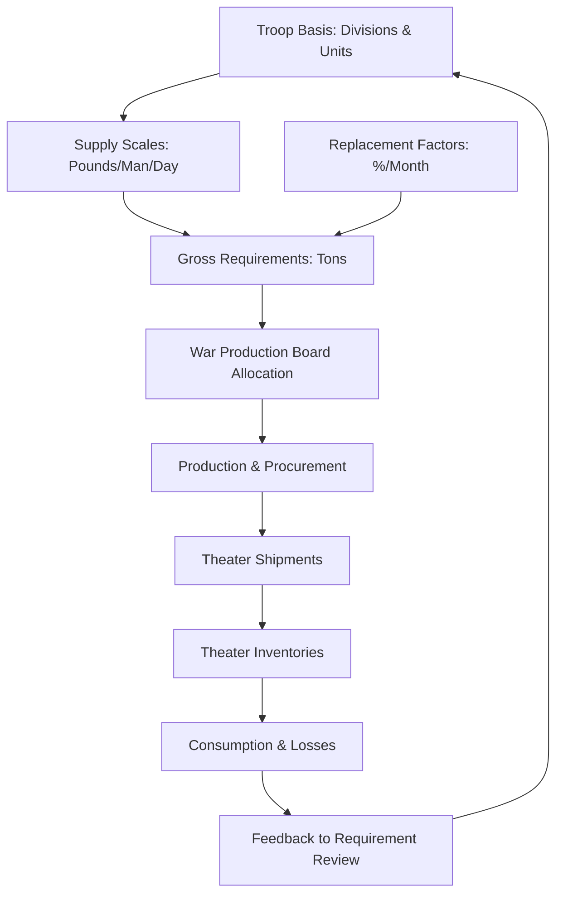

Cost: 0.00229749

## Completed Blanks

- Standard daily maintenance requirement: **60 pounds** of supply per day  
- 1943 Troop Basis maximum mobilization strength: **7,700,000** officers and men  
- Replacement factor for medium tanks: **8%** per month  

---

## Extended Logistical Architecture Diagram

---

## Strategic Discussion Questions

### 1. How was the discrepancy between production capability (WPB) and military requirements (ASF) resolved?

The War Production Board controlled raw materials and production capacity, while the Army Service Forces calculated military needs. In the mid-war period, the gap was resolved through **feasibility reviews** and the **Controlled Materials Plan**. The WPB required the Army to justify its requirements against actual industrial capacity. The 1942 “feasibility dispute” led to a system in which the Troop Basis and Army Supply Program were adjusted to match what the economy could produce. In short, **military requirements were made to fit production feasibility**, not the other way around.

### 2. What were the dangers of overestimating replacement factors, and how did it cause the overstocking crisis of late 1943?

Overestimating replacement factors meant ordering far more equipment than was actually needed. This wasted raw materials, factory labor, shipping space, and storage capacity. By late 1943, the Army had built up massive surpluses of tanks, artillery, ammunition, and other supplies because replacement rates were based on intense combat in North Africa, not on the lower actual loss rates in Italy and the Pacific. The result was the **overstocking crisis**, which forced the Army to cut production schedules, reduce replacement factors, and shift from quantity to quality and modernization.
