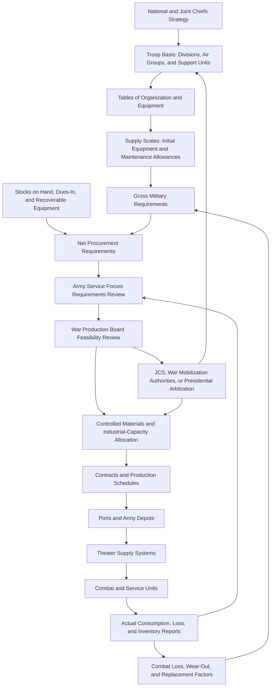

Cost: 0.100125

## 2. Requirement Planning — Completed Values

- The standard daily maintenance requirement for a U.S. soldier in the field in 1943 was calculated at **45 pounds of supply per day**.
- The 1943 Troop Basis authorized a maximum mobilization strength of **8,208,000 officers and enlisted personnel**.
- The replacement factor for medium tanks in combat was estimated at **7 percent per month**.

These were planning factors rather than universal measures of actual consumption. Theater conditions, combat intensity, climate, and transportation losses could produce substantially different results.

---

## 3. Expanded Logistical Architecture



---

## 4. Quantitative Example

Using:

- \(P = 8{,}208{,}000\) troops
- \(F_{day} = 45\) pounds per troop per day
- \(B = 0.07\)

\[
R_{month}
=
\frac{8{,}208{,}000 \times 45 \times 30}{2{,}000}
\times 1.07
\]

\[
R_{month}=5{,}928{,}228\text{ short tons per month}
\]

Scala usage:

```scala
@main def runForecast(): Unit =
  val troops = Troops(8_208_000)
  val dailyFactor = PoundsPerDay(45.0)
  val replacementBuffer = 0.07

  val result =
    RequirementForecaster.forecastMonthlyTons(
      troops,
      dailyFactor,
      replacementBuffer
    )

  println(f"Forecast requirement: $result%,.0f short tons per month")
```

Output:

```text
Forecast requirement: 5,928,228 short tons per month
```

This is only an aggregate illustration. Historically, a 7-percent medium-tank replacement factor would be applied to the tank program rather than to food, fuel, ammunition, clothing, and all other supplies collectively.

---

## 5. Strategic Discussion

### 1. Resolving production capability versus military requirements

The Army Service Forces initially formulated requirements from the Troop Basis, equipment tables, supply allowances, and estimated combat-loss factors. These calculations represented what the Army believed it would need to equip and sustain the planned force. They did not necessarily reflect what American industry could produce within the available supplies of steel, copper, aluminum, labor, machine tools, and transportation.

The War Production Board tested these military programs against industrial feasibility. Reconciliation occurred through:

- revision and rephasing of the Army Supply Program;
- establishment of strategic priorities among weapons and theaters;
- reduction or cancellation of lower-priority contracts;
- substitution of materials and standardization of designs;
- deduction of stocks on hand and scheduled deliveries from gross requirements;
- the Controlled Materials Plan, which allocated critical metals against approved production schedules;
- arbitration by higher mobilization authorities, the Joint Chiefs, and ultimately the President when military programs exceeded national capacity.

Thus, neither military requirements nor industrial capacity alone determined the final program. The accepted program was an iterative compromise among strategic necessity, available inventories, shipping capacity, manpower, and feasible production.

### 2. Overestimated replacement factors and the 1943 overstocking problem

An inflated replacement factor converts a temporary error into a recurring procurement demand. If planners assume that 7 percent of a particular item will be lost every month when actual losses are much lower, factories continue replacing equipment that remains usable or is already held in depots.

The consequences included:

- excessive procurement contracts and unnecessary plant capacity;
- diversion of critical materials from higher-priority weapons;
- congestion at factories, ports, depots, and rail terminals;
- increased storage, preservation, and maintenance costs;
- accumulation of obsolete models and spare parts;
- reduced shipping space for supplies actually needed overseas;
- abrupt contract cancellations and industrial disruption once the surplus was recognized.

By late 1943, reduced force plans, slower-than-anticipated overseas deployment, improved recovery and repair, and lower actual losses for some items revealed that earlier requirements had been too high. The resulting overstocking crisis encouraged the Army to rely more heavily on actual theater consumption and loss reports, distinguish among theaters and combat conditions, subtract existing inventories from gross requirements, and review procurement programs more frequently.
